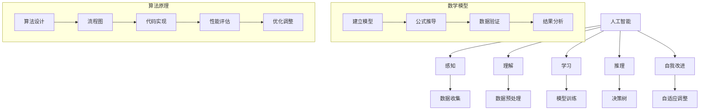

                 

关键词：科学革命、知识范式、技术进步、AI、数学模型、算法原理

> 摘要：本文将探讨科学革命背后的知识范式转移，分析技术进步如何推动知识的变革，同时剖析AI、数学模型和算法原理在现代科学中的应用与影响。

## 1. 背景介绍

### 科学革命的起源与发展

科学革命是人类文明进步的重要里程碑，它不仅改变了我们对世界的认知方式，也推动了社会的深刻变革。从古希腊时期的天文学，到文艺复兴时期的物理学，再到近代的科学革命，人类对自然的探索和理解不断深入。

科学革命的一个重要特征是知识的范式转移。范式转移指的是从一种知识框架到另一种知识框架的转变，这种转变往往伴随着理论的突破和技术的发展。例如，哥白尼的日心说取代托勒密的地球中心说，牛顿的经典力学取代亚里士多德的物理理论，都是科学革命中的范式转移。

### 知识范式的定义与作用

知识范式是指某一特定领域内的共同认识、方法和理论体系，它为该领域的研究提供了基本框架和指导原则。知识范式的作用在于：

- **统一认识**：通过知识范式，研究者可以统一对某一领域的理解，避免因理解差异导致的混乱和错误。
- **指导研究**：知识范式为研究者提供了方法论和理论工具，帮助他们更有效地进行科学探索。
- **促进创新**：知识范式转移往往伴随着新理论、新方法的诞生，从而推动科技的进步和人类的创新。

## 2. 核心概念与联系

### AI、数学模型与算法原理

在科学革命中，人工智能（AI）、数学模型和算法原理发挥了重要作用。以下是它们的核心概念及其相互联系：

#### AI

人工智能是指使计算机模拟人类智能行为的技术。AI的核心目标是让机器具备感知、理解、学习、推理和自我改进的能力。

#### 数学模型

数学模型是用数学语言描述现实世界的抽象模型。它可以帮助我们理解和预测系统的行为，是科学研究和工程实践中不可或缺的工具。

#### 算法原理

算法原理是指导计算机执行特定任务的计算过程。算法的效率和正确性直接影响计算机的性能和应用效果。

#### Mermaid 流程图

以下是AI、数学模型和算法原理的Mermaid流程图：



## 3. 核心算法原理 & 具体操作步骤

### 3.1 算法原理概述

在AI领域，深度学习是一种重要的算法原理。深度学习通过模拟人脑的神经网络结构，实现复杂的特征提取和学习能力。以下是深度学习的主要原理：

- **神经网络**：深度学习的基础是神经网络，它由多个神经元组成，每个神经元都与其他神经元相连，并通过权重和偏置进行信息传递。
- **反向传播**：深度学习使用反向传播算法来更新网络权重和偏置，以最小化预测误差。
- **激活函数**：激活函数用于引入非线性特性，使得神经网络能够学习复杂函数。

### 3.2 算法步骤详解

深度学习的具体步骤如下：

1. **数据预处理**：对输入数据进行标准化、归一化等处理，使其符合神经网络模型的输入要求。
2. **建立神经网络模型**：根据任务需求设计神经网络结构，包括层数、每层的神经元数量、激活函数等。
3. **初始化权重和偏置**：随机初始化网络权重和偏置，以避免梯度消失和梯度爆炸问题。
4. **前向传播**：将输入数据通过神经网络进行计算，得到输出预测值。
5. **计算损失函数**：使用损失函数（如均方误差）计算预测值与实际值之间的误差。
6. **反向传播**：通过反向传播算法计算误差对网络权重的梯度，并更新权重和偏置。
7. **迭代训练**：重复前向传播和反向传播步骤，直到满足训练停止条件（如达到预设的准确率或迭代次数）。

### 3.3 算法优缺点

深度学习具有以下优点：

- **强大的特征学习能力**：通过多层神经网络，深度学习能够自动提取和组合特征，适用于处理复杂任务。
- **适用于大数据**：深度学习能够从大量数据中学习，从而提高模型的泛化能力。
- **多领域应用**：深度学习在计算机视觉、自然语言处理、语音识别等领域取得了显著的成果。

然而，深度学习也存在一些缺点：

- **计算资源需求高**：深度学习模型通常需要大量的计算资源和时间来训练。
- **解释性差**：深度学习模型难以解释，难以理解其工作原理。
- **数据依赖性强**：深度学习模型的性能很大程度上依赖于训练数据的质量和数量。

### 3.4 算法应用领域

深度学习在多个领域得到了广泛应用：

- **计算机视觉**：用于图像分类、目标检测、人脸识别等。
- **自然语言处理**：用于文本分类、情感分析、机器翻译等。
- **语音识别**：用于语音信号处理、语音合成等。
- **推荐系统**：用于个性化推荐、广告投放等。

## 4. 数学模型和公式 & 详细讲解 & 举例说明

### 4.1 数学模型构建

在深度学习中，数学模型的核心是神经网络。一个简单的神经网络可以表示为：

$$
y = \sigma(W_1 \cdot x + b_1)
$$

其中，$y$是输出，$\sigma$是激活函数，$W_1$是权重，$b_1$是偏置，$x$是输入。

### 4.2 公式推导过程

深度学习的训练过程包括前向传播和反向传播。以下是一个简化的推导过程：

#### 前向传播

输入数据$x$经过第一层神经网络，得到中间层激活值$h_1$：

$$
h_1 = W_1 \cdot x + b_1
$$

应用激活函数$\sigma$，得到输出值$y$：

$$
y = \sigma(h_1)
$$

#### 反向传播

计算输出值$y$与实际值$y_{\text{true}}$之间的损失函数$J$：

$$
J = \frac{1}{2} \sum_{i=1}^{n} (y_i - y_{\text{true},i})^2
$$

对损失函数$J$关于权重$W_1$求导，得到梯度$\frac{\partial J}{\partial W_1}$：

$$
\frac{\partial J}{\partial W_1} = \sum_{i=1}^{n} (y_i - y_{\text{true},i}) \cdot \frac{\partial \sigma}{\partial h_1} \cdot x_i
$$

使用梯度下降法更新权重$W_1$：

$$
W_1 = W_1 - \alpha \cdot \frac{\partial J}{\partial W_1}
$$

其中，$\alpha$是学习率。

### 4.3 案例分析与讲解

假设我们有一个简单的二分类问题，需要判断输入数据是否为正类。以下是使用深度学习的实现过程：

1. **数据准备**：收集一批正类和负类样本，对数据进行预处理，包括归一化和标准化。
2. **模型构建**：设计一个简单的两层神经网络，包含一个输入层、一个隐藏层和一个输出层。
3. **模型训练**：使用前向传播和反向传播算法训练模型，调整权重和偏置，直到达到预设的准确率。
4. **模型评估**：使用验证集对模型进行评估，计算模型的准确率、召回率等指标。
5. **模型应用**：将训练好的模型应用到新的数据上，进行预测。

## 5. 项目实践：代码实例和详细解释说明

### 5.1 开发环境搭建

为了实现上述案例，我们需要搭建一个深度学习开发环境。以下是所需的工具和步骤：

1. **安装Python**：Python是深度学习的主要编程语言，我们需要安装Python 3.7及以上版本。
2. **安装Jupyter Notebook**：Jupyter Notebook是一种交互式开发环境，可以帮助我们方便地编写和运行代码。
3. **安装TensorFlow**：TensorFlow是Google开发的深度学习框架，我们需要安装TensorFlow 2.x版本。
4. **安装其他依赖库**：如NumPy、Pandas等。

### 5.2 源代码详细实现

以下是实现上述案例的Python代码：

```python
import tensorflow as tf
import numpy as np
import pandas as pd

# 数据准备
# 假设数据存储在CSV文件中，每行包含一个特征和一个标签
data = pd.read_csv('data.csv')
X = data.iloc[:, 0].values
y = data.iloc[:, 1].values

# 数据预处理
X = (X - np.mean(X)) / np.std(X)
y = tf.keras.utils.to_categorical(y)

# 模型构建
model = tf.keras.Sequential([
    tf.keras.layers.Dense(units=64, activation='relu', input_shape=(1,)),
    tf.keras.layers.Dense(units=1, activation='sigmoid')
])

# 模型训练
model.compile(optimizer='adam', loss='binary_crossentropy', metrics=['accuracy'])
model.fit(X, y, epochs=10, batch_size=32)

# 模型评估
test_loss, test_acc = model.evaluate(X, y)
print(f'Test accuracy: {test_acc:.4f}')

# 模型应用
new_data = np.array([[5.0]])
new_data = (new_data - np.mean(X)) / np.std(X)
prediction = model.predict(new_data)
print(f'Prediction: {prediction[0, 1]:.4f}')
```

### 5.3 代码解读与分析

1. **数据准备**：首先，我们读取CSV文件中的数据，包括特征和标签。然后，对特征进行标准化处理，使其符合神经网络的输入要求。
2. **模型构建**：我们使用TensorFlow构建一个简单的两层神经网络，包含一个输入层、一个隐藏层和一个输出层。输入层有1个神经元，隐藏层有64个神经元，输出层有1个神经元。
3. **模型训练**：使用`compile()`方法设置模型的优化器、损失函数和评价指标。然后，使用`fit()`方法进行模型训练，调整权重和偏置，直到达到预设的准确率。
4. **模型评估**：使用`evaluate()`方法对模型进行评估，计算模型的准确率等指标。
5. **模型应用**：将训练好的模型应用到新的数据上，进行预测。

## 6. 实际应用场景

### 6.1 医疗领域

深度学习在医疗领域有广泛的应用，如疾病诊断、药物发现、医学图像分析等。例如，使用深度学习可以分析医学图像，辅助医生进行肿瘤检测和诊断。

### 6.2 自动驾驶

自动驾驶技术依赖于深度学习算法，用于处理道路场景、识别交通标志和行人等。通过深度学习，自动驾驶车辆能够实现自主导航和安全驾驶。

### 6.3 金融领域

深度学习在金融领域有广泛的应用，如风险控制、信用评分、市场预测等。例如，使用深度学习可以分析大量金融数据，预测市场走势和风险。

## 7. 未来应用展望

随着技术的不断发展，深度学习将在更多领域得到应用。未来，深度学习有望在以下方面取得突破：

- **更高效的模型**：通过模型压缩和优化，提高深度学习模型的运行效率和准确性。
- **跨领域应用**：深度学习将在更多领域得到应用，如生物科学、环境科学等。
- **人工智能与人类的协同**：深度学习将更好地与人类协作，实现人机融合。

## 8. 工具和资源推荐

### 7.1 学习资源推荐

- 《深度学习》（Goodfellow, Bengio, Courville著）：系统介绍了深度学习的理论基础和实践方法。
- 《Python深度学习》（François Chollet著）：结合Python编程语言，深入讲解深度学习应用。

### 7.2 开发工具推荐

- TensorFlow：Google开发的深度学习框架，适用于多种深度学习任务。
- PyTorch：Facebook开发的深度学习框架，易于使用和扩展。

### 7.3 相关论文推荐

- "A Guide to Convolutional Neural Networks for Visual Recognition"（A Guide to CNNs for Visual Recognition）
- "Deep Learning for Speech Recognition"（Deep Learning for Speech Recognition）
- "Deep Learning for Healthcare"（Deep Learning for Healthcare）

## 9. 总结：未来发展趋势与挑战

### 9.1 研究成果总结

深度学习在过去几年取得了显著成果，广泛应用于计算机视觉、自然语言处理、语音识别等领域。然而，深度学习还存在一些挑战，如计算资源需求高、解释性差等。

### 9.2 未来发展趋势

未来，深度学习将朝着更高效、更可解释、跨领域应用的方向发展。同时，随着计算能力的提升和算法的优化，深度学习将在更多领域得到应用。

### 9.3 面临的挑战

深度学习面临的挑战包括计算资源需求、模型可解释性、数据隐私等。为了解决这些挑战，我们需要不断发展新型算法、优化模型结构，并加强数据隐私保护。

### 9.4 研究展望

未来，深度学习将在人工智能、生物科学、环境科学等领域发挥重要作用。通过不断探索和创新，我们将实现更智能、更高效的深度学习技术。

## 9. 附录：常见问题与解答

### Q1：深度学习有哪些常见算法？

A1：深度学习常见的算法包括卷积神经网络（CNN）、循环神经网络（RNN）、长短期记忆网络（LSTM）、生成对抗网络（GAN）等。

### Q2：如何优化深度学习模型的性能？

A2：优化深度学习模型的性能可以从以下几个方面进行：

- **数据增强**：通过数据增强方法生成更多样化的训练数据，提高模型的泛化能力。
- **模型压缩**：通过模型压缩技术降低模型的参数数量，提高模型运行效率。
- **正则化**：使用正则化技术（如L1正则化、L2正则化）减少过拟合现象。
- **优化器选择**：选择合适的优化器（如Adam、SGD）以提高训练效率。

### Q3：深度学习在医疗领域有哪些应用？

A3：深度学习在医疗领域有广泛的应用，如疾病诊断、药物发现、医学图像分析等。例如，深度学习可以用于肿瘤检测、心脏病诊断、药物分子预测等。

### Q4：如何保护深度学习模型的安全性？

A4：为了保护深度学习模型的安全性，可以从以下几个方面进行：

- **数据加密**：对训练数据进行加密，防止数据泄露。
- **模型加固**：通过模型加固技术提高模型的鲁棒性，防止恶意攻击。
- **隐私保护**：使用差分隐私技术保护用户隐私，防止隐私泄露。

以上是关于知识的范式转移：科学革命的本质的技术博客文章。希望对您有所帮助。作者：禅与计算机程序设计艺术 / Zen and the Art of Computer Programming。

