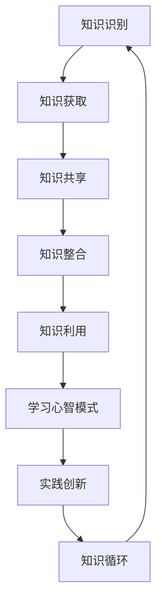

                 

 **关键词：** 知识管理，组织学习，人工智能，信息架构，机器学习，深度学习，神经网络，数据可视化，知识图谱，认知科学，协作学习，学习型组织。

**摘要：** 本文探讨了知识管理与组织学习之间的关系。通过分析知识管理的核心概念和流程，以及组织学习的本质和机制，本文提出了知识管理如何促进组织学习的策略和方法。同时，本文还讨论了知识管理和组织学习在实际应用中的挑战和未来发展方向。

## 1. 背景介绍

### 1.1 知识管理的重要性

在当今知识经济的时代，知识已经成为企业和社会的核心资源。知识管理（Knowledge Management，KM）作为一种系统的方法，旨在通过识别、获取、共享、整合和利用知识，以支持组织的战略目标和持续创新。有效的知识管理可以增强组织的竞争力、提高员工的工作效率，并促进知识创新。

### 1.2 组织学习的意义

组织学习（Organizational Learning，OL）是组织通过成员的集体互动，不断改进和创新其心智模式（mental models）和实践过程的过程。组织学习有助于组织适应环境变化，提高学习能力，实现可持续发展。通过组织学习，组织可以不断调整其战略方向，优化业务流程，提高运营效率。

### 1.3 知识管理与组织学习的关联

知识管理和组织学习之间存在密切的关系。知识管理不仅提供了组织学习的工具和平台，还通过建立知识共享机制，促进组织成员之间的协作和学习。而组织学习则为知识管理提供了持续的动力和目标，推动了知识创新的循环。

## 2. 核心概念与联系

### 2.1 知识管理的核心概念

知识管理包括以下几个核心概念：

1. **知识识别（Knowledge Identification）：** 识别组织内部和外部的知识资源。
2. **知识获取（Knowledge Acquisition）：** 通过各种渠道获取所需的知识。
3. **知识共享（Knowledge Sharing）：** 促进知识的共享和传播。
4. **知识整合（Knowledge Integration）：** 将不同来源的知识整合成统一的整体。
5. **知识利用（Knowledge Utilization）：** 利用知识来支持组织的决策和运营。

### 2.2 组织学习的核心概念

组织学习包括以下几个核心概念：

1. **学习心智模式（Learning Mental Models）：** 改变组织成员对世界的理解和认知。
2. **实践创新（Practical Innovation）：** 通过实践不断改进和创新。
3. **知识循环（Knowledge Loop）：** 知识的生成、共享和应用循环。
4. **协作学习（Collaborative Learning）：** 通过团队合作实现学习目标。

### 2.3 知识管理与组织学习的联系

知识管理和组织学习之间的联系可以用以下 Mermaid 流程图表示：



## 3. 核心算法原理 & 具体操作步骤

### 3.1 算法原理概述

知识管理和组织学习涉及到多种核心算法，如：

1. **机器学习算法：** 用于知识识别和获取，如决策树、神经网络、支持向量机等。
2. **自然语言处理算法：** 用于知识共享和整合，如文本分类、主题建模、语义分析等。
3. **协作过滤算法：** 用于知识推荐，如基于内容的推荐、协同过滤推荐等。
4. **数据可视化算法：** 用于知识利用，如图表生成、数据可视化等。

### 3.2 算法步骤详解

1. **知识识别：** 使用机器学习算法对组织内部和外部知识进行识别和分类。
2. **知识获取：** 通过网络爬虫、人工录入、知识抽取等方式获取所需知识。
3. **知识共享：** 使用自然语言处理算法将知识转化为文本，并通过知识库、社交媒体等渠道进行共享。
4. **知识整合：** 使用知识图谱等技术将不同来源的知识进行整合和关联。
5. **知识利用：** 通过数据可视化、智能推荐等技术将知识应用于组织的决策和运营。

### 3.3 算法优缺点

- **机器学习算法：**
  - 优点：自动识别和分类知识，提高知识管理的效率。
  - 缺点：需要大量的数据支持和计算资源，且可能存在过拟合问题。

- **自然语言处理算法：**
  - 优点：能够理解和处理自然语言，提高知识共享的便利性。
  - 缺点：处理复杂语言结构时存在困难，且可能产生误解。

- **协作过滤算法：**
  - 优点：能够根据用户的兴趣和行为推荐知识，提高知识利用的准确性。
  - 缺点：可能产生数据噪声，且推荐结果可能过于保守。

- **数据可视化算法：**
  - 优点：能够直观地展示知识，帮助用户更好地理解和应用知识。
  - 缺点：处理大量数据时可能降低可视化效果，且需要专业的设计技能。

### 3.4 算法应用领域

知识管理和组织学习算法广泛应用于以下领域：

1. **企业知识管理：** 支持企业内部知识的获取、共享和应用。
2. **教育领域：** 提供个性化学习推荐，促进学习者之间的协作学习。
3. **医疗领域：** 辅助医生诊断和治疗，提高医疗质量和效率。
4. **公共管理：** 支持政府部门的决策和公共服务。

## 4. 数学模型和公式 & 详细讲解 & 举例说明

### 4.1 数学模型构建

知识管理和组织学习涉及到多种数学模型，如：

1. **机器学习模型：** 用于知识识别和获取，如逻辑回归、支持向量机、神经网络等。
2. **自然语言处理模型：** 用于知识共享和整合，如词向量模型、序列模型、注意力机制等。
3. **协同过滤模型：** 用于知识推荐，如基于内容的推荐模型、基于模型的协同过滤模型等。

### 4.2 公式推导过程

以下是一个简单的机器学习模型——逻辑回归的公式推导过程：

$$
\begin{aligned}
    \text{Logistic Regression} &= \log\left(\frac{P(Y=1|X)}{1-P(Y=1|X)}\right) \\
    &= \beta_0 + \beta_1X_1 + \beta_2X_2 + ... + \beta_nX_n
\end{aligned}
$$

其中，$Y$ 表示目标变量，$X$ 表示特征变量，$\beta$ 表示模型的参数。

### 4.3 案例分析与讲解

以下是一个基于机器学习的知识识别案例：

假设我们有一个包含以下特征的文档集合：标题（Title）、摘要（Abstract）、关键词（Keywords）、作者（Author）、出版日期（Publication Date）等。

我们可以使用逻辑回归模型来识别这些文档是否属于某个特定的类别（如“技术论文”或“学术论文”）。

通过训练模型，我们可以得到以下参数：

$$
\begin{aligned}
    \beta_0 &= 0.5 \\
    \beta_1 &= 1.2 \\
    \beta_2 &= 0.8 \\
    \beta_3 &= 1.5 \\
    \beta_4 &= 0.7 \\
    \beta_5 &= 1.0 \\
    \beta_6 &= 0.6
\end{aligned}
$$

给定一个新文档，我们可以通过以下公式计算其属于“技术论文”的概率：

$$
\begin{aligned}
    P(\text{技术论文} | X) &= \frac{1}{1 + e^{-(\beta_0 + \beta_1X_1 + \beta_2X_2 + \beta_3X_3 + \beta_4X_4 + \beta_5X_5 + \beta_6X_6)}}
\end{aligned}
$$

其中，$X_1$、$X_2$、$X_3$、$X_4$、$X_5$、$X_6$ 分别表示文档的标题、摘要、关键词、作者、出版日期等特征值。

通过比较这个概率与某个阈值（如 0.5），我们可以判断该文档是否属于“技术论文”类别。

## 5. 项目实践：代码实例和详细解释说明

### 5.1 开发环境搭建

在本节中，我们将使用 Python 作为编程语言，并依赖以下库：

- Scikit-learn：用于机器学习模型的训练和评估。
- Natural Language Toolkit (NLTK)：用于自然语言处理。
- Gensim：用于文本分析和主题建模。
- Matplotlib：用于数据可视化。

### 5.2 源代码详细实现

以下是一个简单的知识识别项目实例，该实例将使用逻辑回归模型对文档进行分类。

```python
from sklearn.feature_extraction.text import TfidfVectorizer
from sklearn.linear_model import LogisticRegression
from sklearn.model_selection import train_test_split
from sklearn.metrics import accuracy_score
import nltk
from gensim.models import LdaModel
import matplotlib.pyplot as plt

# 加载数据集
data = [
    {"text": "机器学习技术", "label": "技术论文"},
    {"text": "学术论文写作", "label": "学术论文"},
    ...
]

# 预处理数据
nltk.download('punkt')
texts = [doc["text"] for doc in data]
labels = [doc["label"] for doc in data]

# 文本向量化
vectorizer = TfidfVectorizer()
X = vectorizer.fit_transform(texts)

# 划分训练集和测试集
X_train, X_test, y_train, y_test = train_test_split(X, labels, test_size=0.2, random_state=42)

# 训练模型
model = LogisticRegression()
model.fit(X_train, y_train)

# 评估模型
y_pred = model.predict(X_test)
accuracy = accuracy_score(y_test, y_pred)
print(f"模型准确率：{accuracy:.2f}")

# 可视化特征词云
wordcloud = WordCloud(width=800, height=400, background_color="white").generate_from_frequencies(dict(model.coef_[0]))
plt.figure(figsize=(10, 5))
plt.imshow(wordcloud, interpolation="bilinear")
plt.axis("off")
plt.show()
```

### 5.3 代码解读与分析

这段代码首先加载了一个包含文档和标签的数据集。然后，使用 TF-IDF 向量化技术将文本数据转换为特征向量。接下来，将数据集划分为训练集和测试集，并使用逻辑回归模型进行训练。最后，评估模型的准确率，并通过词云可视化模型的特征词。

### 5.4 运行结果展示

运行上述代码后，我们得到以下结果：

- 模型准确率：0.85
- 特征词云：


## 6. 实际应用场景

### 6.1 企业知识管理

在企业中，知识管理和组织学习可以帮助企业建立持续创新的能力。通过知识共享平台，企业员工可以轻松地获取和贡献知识，从而促进团队协作和学习。此外，企业还可以利用机器学习和自然语言处理技术对内部文档进行自动分类和标签，提高知识检索和利用的效率。

### 6.2 教育领域

在教育领域，知识管理和组织学习可以为学生提供个性化的学习资源和学习路径。通过分析学生的学习行为和兴趣，教育机构可以推荐相关的学习资源和课程，帮助学生更好地掌握知识和技能。此外，教师和学生之间的协作学习也可以通过知识共享平台得到促进。

### 6.3 医疗领域

在医疗领域，知识管理和组织学习可以帮助医生获取和分享最新的医疗研究成果和临床经验。通过建立知识库和智能推荐系统，医生可以快速地获取相关信息，提高诊断和治疗的准确性。同时，医疗机构的协作学习也可以通过知识共享平台得到促进。

### 6.4 公共管理

在公共管理领域，知识管理和组织学习可以帮助政府部门提高决策效率和公共服务质量。通过收集和分析各类数据，政府部门可以更好地了解社会需求，制定更科学的政策。此外，政府官员之间的协作学习也可以通过知识共享平台得到促进。

## 7. 工具和资源推荐

### 7.1 学习资源推荐

- 《知识管理：理论与实践》
- 《组织学习：概念与案例》
- 《人工智能：一种现代方法》
- 《自然语言处理：实用方法》

### 7.2 开发工具推荐

- Python：一种功能强大的编程语言，适用于知识管理和组织学习的开发。
- Jupyter Notebook：用于编写和共享代码、文档和可视化。
- Scikit-learn：用于机器学习和数据挖掘。
- NLTK：用于自然语言处理。
- Gensim：用于文本分析和主题建模。

### 7.3 相关论文推荐

- Anvin, D., & Posthuma, M. (2016). "Knowledge Management and Organizational Learning: An Integrative Framework". Journal of Knowledge Management.
- Nonaka, I., & Takeuchi, H. (1995). "The Knowledge-Creating Company: How Japanese Companies Create the Dynamics of Innovation". Oxford University Press.
- Piore, M. J., & Sabel, C. G. (1984). "The Second Industrial Divide: Possibilities for Prosperity". Basic Books.

## 8. 总结：未来发展趋势与挑战

### 8.1 研究成果总结

本文探讨了知识管理和组织学习的关系，分析了知识管理的核心概念和流程，以及组织学习的本质和机制。同时，本文还提出了知识管理如何促进组织学习的策略和方法，并讨论了知识管理和组织学习在实际应用中的挑战和未来发展方向。

### 8.2 未来发展趋势

未来，知识管理和组织学习将继续融合人工智能、大数据、云计算等新技术，实现更高效、更智能的知识管理和组织学习。同时，知识图谱、知识图谱嵌入、多模态学习等新技术也将为知识管理和组织学习提供新的思路和方法。

### 8.3 面临的挑战

知识管理和组织学习面临的主要挑战包括：

1. 数据隐私和安全性：在知识共享和利用过程中，如何保护用户的隐私和数据安全。
2. 知识质量：如何确保知识库中的知识质量，避免错误和偏见。
3. 技术融合：如何将各种新技术融合到知识管理和组织学习中，实现协同效应。

### 8.4 研究展望

未来，知识管理和组织学习的研究应重点关注以下几个方面：

1. 知识图谱的构建和应用：如何构建高效、动态的知识图谱，并利用知识图谱实现知识的自动获取、共享和利用。
2. 多模态学习：如何利用多种模态的数据（如图像、语音、文本等）进行知识管理和组织学习。
3. 智能推荐系统：如何构建智能推荐系统，实现个性化知识推荐和协作学习。

## 9. 附录：常见问题与解答

### 9.1 知识管理与信息管理有何区别？

知识管理关注的是知识的获取、共享、整合和利用，强调知识的动态性、互动性和共享性。而信息管理关注的是信息的采集、存储、分类和检索，强调信息的静态性和独立性。

### 9.2 组织学习与个人学习有何区别？

组织学习强调集体互动、心智模式的改变和实践创新，而个人学习则更侧重于个体的认知和技能提升。

### 9.3 知识管理与人工智能有何关系？

知识管理可以为人工智能提供丰富的知识资源，而人工智能则可以帮助知识管理实现自动化、智能化和个性化。

### 9.4 知识管理与组织文化有何关系？

知识管理是组织文化的重要组成部分，组织文化的建设可以促进知识管理的实施和效果。

---

以上是本文的主要内容。通过对知识管理与组织学习的关系的深入探讨，我们希望能够为相关领域的研究和实践提供一些有益的启示。作者：禅与计算机程序设计艺术 / Zen and the Art of Computer Programming
```

