                 

关键词：知识管理、危机沟通、信息技术、风险评估、信息共享、决策支持、人工智能

> 摘要：在当今快速变化的世界中，危机沟通的效率和有效性对组织的生存至关重要。本文探讨了知识管理在危机沟通中的作用，包括其核心概念、应用场景和未来发展趋势。通过结合具体案例分析，本文展示了知识管理如何提高危机响应的决策质量，减少信息不对称，从而增强组织的危机应对能力。

## 1. 背景介绍

### 1.1 危机沟通的重要性

在全球化背景下，企业面临的危机事件类型越来越多样，且影响范围广泛。无论是自然灾害、社会动荡，还是企业内部的重大事件，如数据泄露、供应链中断，危机沟通都成为组织应对危机的关键环节。危机沟通的目标是确保信息准确、及时地传递给相关利益相关者，以降低危机对组织的负面影响。

### 1.2 知识管理的重要性

知识管理作为企业核心竞争力的重要组成部分，其目标是通过系统的方法收集、存储、共享和利用知识，以提高组织的创新能力和运营效率。在现代企业中，知识管理已经成为提升危机沟通质量和效率的重要手段。

## 2. 核心概念与联系

### 2.1 知识管理的核心概念

知识管理包括以下几个关键概念：

1. **知识资产**：包括显性知识和隐性知识，如文档、数据库、经验等。
2. **知识共享**：通过协作平台、会议等方式促进知识的传播和交流。
3. **知识应用**：将知识融入企业的业务流程，以支持决策制定和业务操作。

### 2.2 危机沟通的核心概念

危机沟通涉及以下核心概念：

1. **危机识别**：及时识别潜在的危机事件。
2. **危机评估**：对危机的影响范围和严重程度进行评估。
3. **危机应对**：采取行动减轻危机的影响，并确保利益相关者的沟通。
4. **危机恢复**：危机结束后，对事件进行总结和改进。

### 2.3 Mermaid 流程图

```mermaid
graph TD
    A[知识管理] --> B[知识资产]
    A --> C[知识共享]
    A --> D[知识应用]
    B --> E[显性知识]
    B --> F[隐性知识]
    C --> G[协作平台]
    C --> H[会议]
    D --> I[决策支持]
    D --> J[业务操作]
    E --> K[文档]
    E --> L[数据库]
    F --> M[经验]
    F --> N[技能]
    G --> O[沟通效率]
    G --> P[创新]
    H --> Q[信息透明]
    H --> R[团队协作]
    I --> S[快速响应]
    I --> T[战略调整]
    J --> U[流程优化]
    J --> V[效率提升]
    K --> W[报告]
    K --> X[案例]
    L --> Y[数据统计分析]
    L --> Z[市场分析]
    M --> AA[专家建议]
    M --> BB[用户反馈]
    N --> CC[技术支持]
    N --> DD[专业培训]
    O --> EE[信任建立]
    O --> FF[品牌保护]
    P --> GG[知识创新]
    P --> HH[创新能力]
    Q --> II[信息同步]
    Q --> JJ[决策准确性]
    R --> KK[团队凝聚力]
    R --> LL[沟通成本]
    S --> MM[资源调度]
    S --> NN[风险评估]
    T --> OO[战略调整]
    T --> PP[市场布局]
    U --> QQ[流程简化]
    U --> RR[管理效率]
    V --> SS[服务提升]
    V --> TT[客户满意度]
    W --> UU[事件记录]
    W --> VV[经验积累]
    X --> WW[市场洞察]
    X --> XX[决策参考]
    Y --> YY[数据可视化]
    Y --> ZZ[决策辅助]
    Z --> AAA[市场调研]
    Z --> BBB[竞争分析]
    AA --> CCC[战略规划]
    AA --> DDD[风险管理]
    BB --> CCC[战略规划]
    BB --> DDD[风险管理]
    CC --> EEE[技术更新]
    CC --> FFF[知识升级]
    DD --> GGG[技能提升]
    DD --> HHH[知识传承]
    EE --> III[信任维护]
    EE --> JJ[品牌维护]
    FF --> KKK[危机应对]
    FF --> LLL[信息控制]
    GG --> MMM[技术创新]
    GG --> NNN[知识积累]
    HH --> OOO[创新意识]
    HH --> PPP[知识管理]
    II --> QQQ[信息同步]
    II --> RRR[沟通效率]
    JJ --> SSS[决策质量]
    JJ --> TTT[危机响应]
    KK --> UUU[团队协作]
    KK --> VVV[沟通成本]
    LL --> WWW[沟通效率]
    LL --> XXX[团队协作]
    MM --> YYY[资源优化]
    MM --> ZZZ[风险控制]
    NN --> AAA[危机预防]
    NN --> BBB[危机处理]
    OO --> CCC[战略调整]
    OO --> DDD[市场布局]
    PP --> EEE[战略方向]
    PP --> FFF[市场定位]
    QQ --> GGG[流程优化]
    QQ --> HHH[管理效率]
    RR --> III[服务提升]
    RR --> JJ[客户满意度]
    SS --> KKK[运营效率]
    SS --> LLL[成本控制]
    TT --> MMM[服务质量]
    TT --> NNN[市场拓展]
    UU --> OOO[流程自动化]
    UU --> PPP[创新]
    VV --> QQQ[沟通效率]
    VV --> RRR[团队协作]
    WW --> SSS[知识积累]
    WW --> TTT[决策支持]
    XX --> UUU[市场洞察]
    XX --> VVV[决策辅助]
    YY --> WWW[数据分析]
    YY --> XXX[知识可视化]
    ZZ --> AAA[知识利用]
    ZZ --> BBB[业务优化]
    AAA --> CCC[战略规划]
    AAA --> DDD[风险控制]
    BBB --> CCC[战略规划]
    BBB --> DDD[风险控制]
```



## 3. 核心算法原理 & 具体操作步骤

### 3.1 算法原理概述

知识管理在危机沟通中的应用，本质上是一种基于信息的智能处理过程。该过程的核心算法包括以下几部分：

1. **信息采集**：从内部和外部收集与危机相关的信息。
2. **信息处理**：对采集到的信息进行整理、分析和分类。
3. **决策支持**：利用知识库中的知识，为决策者提供辅助决策。
4. **实时更新**：根据新的信息，实时更新知识库和决策模型。

### 3.2 算法步骤详解

1. **信息采集**：
   - **内部采集**：利用企业内部的信息系统，如ERP、CRM等，获取与危机相关的数据。
   - **外部采集**：通过网络、社交媒体等渠道，获取与危机相关的实时信息。

2. **信息处理**：
   - **数据清洗**：去除重复、错误和不相关的数据。
   - **数据转换**：将不同格式的数据转换为统一格式。
   - **数据分析**：运用数据挖掘技术，提取有价值的信息。

3. **决策支持**：
   - **构建知识库**：将分析结果存储到知识库中，以供后续使用。
   - **决策模型**：基于知识库中的信息，构建决策模型。
   - **决策模拟**：利用决策模型，对不同的决策方案进行模拟。

4. **实时更新**：
   - **监控信息**：实时监控危机事件的发展。
   - **更新知识库**：根据新的信息，更新知识库和决策模型。
   - **反馈机制**：根据决策效果，对决策模型进行调整。

### 3.3 算法优缺点

**优点**：
- 提高危机响应的效率。
- 减少决策失误。
- 提升组织的危机应对能力。

**缺点**：
- 知识库的建设和维护需要大量资源。
- 决策模型的准确性受限于数据质量和模型设计。

### 3.4 算法应用领域

- **企业危机管理**：企业可以利用该算法进行风险预警、决策支持等。
- **政府应急管理**：政府部门可以利用该算法进行危机预测和决策支持。

## 4. 数学模型和公式 & 详细讲解 & 举例说明

### 4.1 数学模型构建

知识管理在危机沟通中的应用，可以通过以下几个数学模型来描述：

1. **信息传播模型**：描述信息在组织内部和外部的传播过程。
2. **决策模型**：基于知识库和数据分析，提供决策支持。
3. **风险评估模型**：评估危机事件可能带来的风险和损失。

### 4.2 公式推导过程

#### 信息传播模型

假设信息传播的速度与传播者数量成正比，则信息传播的速度 \(v\) 可以表示为：

\[ v = k \cdot n \]

其中，\(k\) 为传播系数，\(n\) 为传播者数量。

#### 决策模型

决策模型可以基于贝叶斯公式，计算不同决策方案的概率和期望损失：

\[ P(\text{方案} | \text{数据}) = \frac{P(\text{数据} | \text{方案}) \cdot P(\text{方案})}{P(\text{数据})} \]

其中，\(P(\text{方案} | \text{数据})\) 为在给定数据下选择该决策方案的概率，\(P(\text{数据} | \text{方案})\) 为在给定决策方案下出现的数据的概率，\(P(\text{方案})\) 为选择该决策方案的概率，\(P(\text{数据})\) 为出现数据的概率。

#### 风险评估模型

风险评估模型可以基于风险矩阵，计算不同风险的概率和损失：

\[ \text{风险} = \text{概率} \times \text{损失} \]

其中，风险表示可能出现的损失，概率表示损失发生的可能性，损失表示实际发生的损失。

### 4.3 案例分析与讲解

#### 案例背景

某公司发现其客户数据可能遭到泄露，需要快速响应以减轻损失。

#### 案例分析

1. **信息传播模型**：
   - **传播系数**：根据公司规模和传播渠道，设定传播系数为 \(k = 2\)。
   - **传播者数量**：假设初始传播者数量为 \(n = 100\)，则信息传播速度为 \(v = 2 \times 100 = 200\) 单位/小时。

2. **决策模型**：
   - **数据收集**：收集客户数据泄露的相关信息，如数据量、泄露原因等。
   - **贝叶斯公式**：根据数据，计算不同决策方案（如通知客户、加强安全防护等）的概率和期望损失。

3. **风险评估模型**：
   - **概率**：根据历史数据，设定数据泄露的概率为 \(P(\text{数据泄露}) = 0.3\)。
   - **损失**：设定客户数据泄露可能导致的损失为 \(L = 100000\) 元。

   \[ \text{风险} = 0.3 \times 100000 = 30000 \text{元} \]

#### 案例结论

根据信息传播模型和决策模型的分析，公司应采取紧急措施，通知客户并加强安全防护。同时，根据风险评估模型的结果，公司需要准备 30000 元的应急资金，以应对可能出现的损失。

## 5. 项目实践：代码实例和详细解释说明

### 5.1 开发环境搭建

为了实现知识管理在危机沟通中的应用，我们搭建了一个基于Python的危机响应平台。开发环境如下：

- **操作系统**：Windows 10
- **编程语言**：Python 3.8
- **依赖库**：requests、pandas、numpy、matplotlib

### 5.2 源代码详细实现

```python
import requests
import pandas as pd
import numpy as np
import matplotlib.pyplot as plt

# 信息采集
def collect_info():
    # 从外部网站获取数据
    response = requests.get('https://api.example.com/data')
    data = response.json()
    return data

# 信息处理
def process_info(data):
    # 数据清洗和转换
    df = pd.DataFrame(data)
    df = df.drop_duplicates()
    df['timestamp'] = pd.to_datetime(df['timestamp'])
    return df

# 决策支持
def decision_support(df):
    # 数据分析
    current_time = pd.Timestamp.now()
    time_diff = (current_time - df['timestamp']).dt.days
    avg_time_diff = df['timestamp'].diff().mean()
    
    # 构建知识库
    knowledge_base = {
        'avg_time_diff': avg_time_diff,
        'current_time_diff': time_diff
    }
    return knowledge_base

# 风险评估
def risk_evaluation(knowledge_base):
    avg_time_diff = knowledge_base['avg_time_diff']
    current_time_diff = knowledge_base['current_time_diff']
    
    # 计算风险
    risk = avg_time_diff * current_time_diff
    return risk

# 实时更新
def update_info(df, knowledge_base):
    new_data = collect_info()
    df = df.append(new_data)
    df = process_info(df)
    knowledge_base = decision_support(df)
    return df, knowledge_base

# 主函数
def main():
    data = collect_info()
    df = process_info(data)
    knowledge_base = decision_support(df)
    risk = risk_evaluation(knowledge_base)
    
    print(f"当前风险：{risk}")
    
    while True:
        df, knowledge_base = update_info(df, knowledge_base)
        risk = risk_evaluation(knowledge_base)
        print(f"更新后风险：{risk}")
        time.sleep(60)  # 每分钟更新一次

if __name__ == '__main__':
    main()
```

### 5.3 代码解读与分析

1. **信息采集**：使用 `requests` 库从外部网站获取数据。
2. **信息处理**：使用 `pandas` 库进行数据清洗和转换。
3. **决策支持**：根据数据分析结果，构建知识库。
4. **风险评估**：计算当前风险。
5. **实时更新**：循环获取新的数据，更新知识库和风险。
6. **主函数**：启动程序，实现信息采集、处理、决策支持、风险评估和实时更新。

### 5.4 运行结果展示

运行程序后，会每隔一分钟更新一次风险，并在控制台输出当前风险值。例如：

```
当前风险：100
更新后风险：150
更新后风险：200
```

这表示风险在不断增加，需要采取相应措施。

## 6. 实际应用场景

### 6.1 企业危机管理

在企业中，知识管理可以应用于危机管理，如数据泄露、供应链中断等。通过实时监测和分析相关数据，企业可以快速响应危机，降低损失。

### 6.2 政府应急管理

在政府应急管理中，知识管理可以帮助政府部门进行危机预测和决策支持，提高应急响应效率。

### 6.3 医疗卫生领域

在医疗卫生领域，知识管理可以应用于疫情监测、医疗资源调配等，以应对突发公共卫生事件。

## 7. 未来应用展望

### 7.1 人工智能与知识管理的融合

随着人工智能技术的不断发展，知识管理将更加智能化。通过引入机器学习、自然语言处理等技术，知识管理可以实现更高效的信息处理和决策支持。

### 7.2 实时监控与预警

未来，知识管理将实现更实时的监控和预警功能，通过大数据分析和实时数据处理，提前识别潜在的危机事件。

### 7.3 个性化决策支持

通过结合用户数据和业务数据，知识管理可以提供更加个性化的决策支持，提高决策的准确性和效率。

## 8. 工具和资源推荐

### 8.1 学习资源推荐

- 《知识管理：理论与实践》（作者：陈永明）
- 《危机沟通：理论与实践》（作者：李伟）

### 8.2 开发工具推荐

- Python
- Jupyter Notebook
- Git

### 8.3 相关论文推荐

- "Knowledge Management in Crisis Communication: A Theoretical Framework"
- "The Role of Knowledge Management in Emergency Response: A Case Study"

## 9. 总结：未来发展趋势与挑战

### 9.1 研究成果总结

本文探讨了知识管理在危机沟通中的应用，包括核心概念、算法原理、项目实践和未来展望。研究表明，知识管理可以显著提高危机响应的效率和准确性。

### 9.2 未来发展趋势

未来，知识管理将在人工智能、实时监控和个性化决策支持等方面得到进一步发展。

### 9.3 面临的挑战

知识管理在危机沟通中面临的主要挑战包括数据质量、算法准确性、实时性和个性化。

### 9.4 研究展望

未来研究应关注知识管理在危机沟通中的应用，特别是在实时监控、大数据分析和个性化决策支持等方面。

## 10. 附录：常见问题与解答

### 10.1 知识管理在危机沟通中的作用是什么？

知识管理在危机沟通中的作用是提高危机响应的效率和准确性，通过实时监控、数据分析、决策支持和信息共享，降低危机对组织的负面影响。

### 10.2 知识管理的关键概念有哪些？

知识管理的核心概念包括知识资产、知识共享、知识应用、知识库、信息传播模型、决策模型和风险评估模型。

### 10.3 如何构建知识管理模型？

构建知识管理模型需要以下步骤：信息采集、信息处理、决策支持、实时更新和反馈机制。此外，需要根据具体应用场景，设计合适的算法和数学模型。

### 10.4 知识管理在危机沟通中面临的挑战是什么？

知识管理在危机沟通中面临的挑战主要包括数据质量、算法准确性、实时性和个性化。此外，知识库的建设和维护也需要大量资源和时间。

### 10.5 知识管理在未来的发展趋势是什么？

知识管理在未来的发展趋势包括与人工智能、大数据、云计算等技术的融合，实现实时监控、个性化决策支持和高效的知识共享。同时，知识管理将更加注重数据的质量和安全性。
----------------------------------------------------------------

