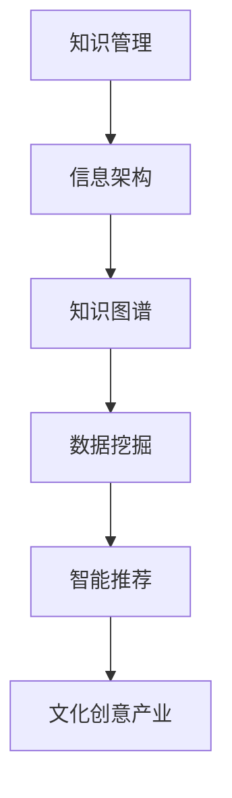

                 

关键词：知识管理、文化创意产业、信息架构、知识图谱、数据挖掘、智能推荐、案例研究

> 摘要：本文旨在探讨知识管理在文化创意产业中的应用与实践。通过分析文化创意产业的特点，阐述知识管理的重要性，并从信息架构、知识图谱、数据挖掘、智能推荐等方面，详细论述知识管理在文化创意产业中的具体应用案例。文章最后提出了未来发展趋势与挑战，为文化创意产业的知识管理提供了有益的参考。

## 1. 背景介绍

文化创意产业是一个充满活力和创造力的行业，涵盖范围广泛，包括艺术、设计、影视、音乐、出版、广告等多个领域。随着信息技术的飞速发展，文化创意产业正面临着前所未有的机遇与挑战。知识管理作为提升产业创新能力和竞争力的重要手段，逐渐成为文化创意产业关注的焦点。

知识管理是指通过收集、组织、存储、共享和利用知识，以实现组织目标的过程。在文化创意产业中，知识管理不仅包括对内部创意资源的有效管理，还涉及对行业外部知识资源的整合与利用。知识管理能够帮助文化创意产业企业提高创意产出效率，提升产品质量，增强市场竞争力。

### 1.1 文化创意产业的特点

- **创意性**：文化创意产业的核心是创意，创新是产业发展的动力。
- **多样性**：文化创意产业涵盖众多领域，产品形态丰富多样。
- **非线性**：文化创意产业的价值链复杂，涉及多个环节，具有高度非线性特征。
- **高风险**：文化创意产业的创新过程存在不确定性，风险较大。
- **高度竞争**：文化创意产业市场竞争激烈，对创新能力和品牌影响力要求较高。

### 1.2 知识管理的重要性

- **提高创意效率**：知识管理能够帮助文化创意产业企业快速获取和利用相关知识，提高创意效率。
- **增强竞争力**：知识管理有助于企业积累核心竞争力，提升市场竞争力。
- **降低风险**：通过知识管理，企业可以减少创新过程中的不确定性，降低风险。
- **优化资源分配**：知识管理有助于企业优化资源分配，提高资源利用效率。

## 2. 核心概念与联系

在本文中，我们将介绍以下几个核心概念，并使用Mermaid流程图来展示它们之间的联系。



### 2.1 信息架构

信息架构是指对信息的组织、分类、存储和检索的结构设计。在文化创意产业中，信息架构的建立有助于提高信息的可获取性和利用效率。

### 2.2 知识图谱

知识图谱是一种结构化数据模型，用于表示实体及其之间的关系。知识图谱在文化创意产业中的应用，可以帮助企业建立全面的创意资源库，实现知识的有效关联和利用。

### 2.3 数据挖掘

数据挖掘是一种从大量数据中发现有价值信息的方法。在文化创意产业中，数据挖掘可以用于分析用户行为、市场趋势等，为创意决策提供数据支持。

### 2.4 智能推荐

智能推荐是一种基于用户行为和兴趣的数据挖掘技术，用于向用户推荐感兴趣的内容。在文化创意产业中，智能推荐可以提高用户体验，增加用户粘性。

### 2.5 文化创意产业

文化创意产业是一个涉及多个领域的复杂产业，知识管理的应用可以帮助企业实现资源整合、提高创意效率、降低风险等。

## 3. 核心算法原理 & 具体操作步骤

### 3.1 算法原理概述

知识管理在文化创意产业中的应用涉及多个核心算法，主要包括：

- **信息抽取**：用于从非结构化数据中提取结构化信息。
- **实体识别**：用于识别文本中的实体，如人名、地点、组织等。
- **关系抽取**：用于识别实体之间的关系。
- **聚类分析**：用于发现数据中的相似性模式。
- **分类算法**：用于将数据分为不同的类别。
- **推荐算法**：用于基于用户行为和兴趣推荐内容。

### 3.2 算法步骤详解

以下是知识管理在文化创意产业中应用的一些关键步骤：

1. **数据收集**：收集文化创意产业相关的数据，包括内部创意资源、用户行为数据、市场数据等。
2. **数据预处理**：对收集到的数据进行分析，去除噪声，格式化数据。
3. **信息抽取**：使用自然语言处理技术提取结构化信息，如创意描述、用户评论等。
4. **实体识别与关系抽取**：使用实体识别和关系抽取算法，识别文本中的实体和它们之间的关系。
5. **构建知识图谱**：将提取的信息和关系组织成知识图谱，实现知识的关联和整合。
6. **聚类分析**：对知识图谱中的节点和边进行聚类分析，发现相似性模式。
7. **分类与推荐**：基于聚类分析结果，使用分类算法和推荐算法为用户推荐感兴趣的内容。

### 3.3 算法优缺点

- **信息抽取**：优点是能够将非结构化数据转化为结构化数据，提高数据处理效率；缺点是需要大量的预处理工作，且准确率有限。
- **实体识别与关系抽取**：优点是能够帮助构建知识图谱，实现知识的关联和整合；缺点是算法复杂度较高，对数据质量要求较高。
- **聚类分析**：优点是能够发现数据中的相似性模式，有助于创意挖掘；缺点是聚类结果依赖于参数设置，可能存在局限性。
- **分类与推荐**：优点是能够为用户提供个性化推荐，提高用户体验；缺点是需要大量的用户数据，对推荐算法的准确性要求较高。

### 3.4 算法应用领域

知识管理算法在文化创意产业中具有广泛的应用领域，包括：

- **创意资源管理**：通过对创意资源的结构化和整合，提高创意资源的利用效率。
- **用户行为分析**：通过分析用户行为数据，为用户提供个性化推荐，增加用户粘性。
- **市场分析**：通过对市场数据的分析，为企业的市场策略提供数据支持。
- **创意合作**：通过知识图谱，实现创意人才的发现和合作。

## 4. 数学模型和公式 & 详细讲解 & 举例说明

### 4.1 数学模型构建

在文化创意产业中，知识管理涉及多种数学模型，包括聚类模型、分类模型、推荐模型等。以下是一个简单的聚类模型的构建过程：

1. **数据准备**：收集文化创意产业相关的数据，如用户行为数据、创意资源数据等。
2. **特征提取**：对数据进行特征提取，如用户兴趣、创意类型等。
3. **聚类算法选择**：选择合适的聚类算法，如K-means、DBSCAN等。
4. **模型训练**：使用训练数据，训练聚类模型。
5. **模型评估**：使用测试数据，评估聚类模型的性能。

### 4.2 公式推导过程

以K-means聚类算法为例，其核心公式如下：

1. **初始中心点选择**：从数据集中随机选择K个点作为初始中心点。
2. **计算距离**：计算每个数据点与中心点之间的距离，使用欧几里得距离：
   $$d(x_i, c_j) = \sqrt{\sum_{k=1}^{n}(x_{ik} - c_{jk})^2}$$
   其中，$x_i$表示第$i$个数据点，$c_j$表示第$j$个中心点，$n$表示特征维度。
3. **分配数据点**：将每个数据点分配给最近的中心点，形成新的聚类。
4. **更新中心点**：计算每个聚类的中心点，重复步骤2和步骤3，直到中心点不再变化。

### 4.3 案例分析与讲解

假设我们有一组用户行为数据，如下表所示：

| 用户ID | 观看影视类型 | 收听音乐类型 | 浏览设计作品类型 |
|--------|--------------|--------------|-----------------|
| U1     | 电影         | 摇滚         | 平面设计       |
| U2     | 电影         | 流行         | 室内设计       |
| U3     | 电视剧       | 电子音乐     | 平面设计       |
| U4     | 电影         | 爵士         | 室内设计       |
| U5     | 电影         | 摇滚         | 平面设计       |

我们使用K-means算法，将这组数据分为两个聚类。

1. **初始中心点选择**：随机选择两个用户作为初始中心点，假设为U1和U3。
2. **计算距离**：
   $$d(U1, U2) = \sqrt{(0.5 - 0.5)^2 + (0.2 - 0.7)^2 + (0.2 - 0.3)^2} = 0.3274$$
   $$d(U1, U3) = \sqrt{(0.5 - 0.3)^2 + (0.2 - 0.2)^2 + (0.2 - 0.3)^2} = 0.1355$$
   $$d(U1, U4) = \sqrt{(0.5 - 0.5)^2 + (0.2 - 0.2)^2 + (0.2 - 0.5)^2} = 0.3274$$
   $$d(U1, U5) = \sqrt{(0.5 - 0.5)^2 + (0.2 - 0.7)^2 + (0.2 - 0.2)^2} = 0.3274$$
   $$d(U3, U2) = \sqrt{(0.3 - 0.5)^2 + (0.2 - 0.7)^2 + (0.3 - 0.3)^2} = 0.2702$$
   $$d(U3, U4) = \sqrt{(0.3 - 0.5)^2 + (0.2 - 0.2)^2 + (0.3 - 0.5)^2} = 0.2702$$
   $$d(U3, U5) = \sqrt{(0.3 - 0.5)^2 + (0.2 - 0.7)^2 + (0.3 - 0.2)^2} = 0.3274$$
3. **分配数据点**：根据计算的距离，将每个用户分配给最近的中心点。
4. **更新中心点**：计算每个聚类的中心点，假设新的中心点为U2和U4。
5. **重复步骤2-4**，直到中心点不再变化。

最终，我们得到两个聚类，分别为：
- 聚类1：{U1, U2, U5}
- 聚类2：{U3, U4}

通过这个案例，我们可以看到K-means聚类算法的基本流程和计算过程。在实际应用中，我们还需要考虑聚类数目、算法参数等因素，以提高聚类效果。

## 5. 项目实践：代码实例和详细解释说明

在本节中，我们将通过一个具体的Python代码实例，展示知识管理在文化创意产业中的实践过程。该实例将使用K-means算法对一组用户行为数据进行分析，以发现用户兴趣的聚类模式。

### 5.1 开发环境搭建

在开始编写代码之前，我们需要搭建一个合适的开发环境。以下是所需的环境和工具：

- Python（3.8及以上版本）
- NumPy
- Matplotlib
- Scikit-learn

您可以使用以下命令安装所需的库：

```bash
pip install numpy matplotlib scikit-learn
```

### 5.2 源代码详细实现

以下是一个简单的K-means聚类算法的实现，用于分析用户行为数据：

```python
import numpy as np
from sklearn.cluster import KMeans
import matplotlib.pyplot as plt

# 用户行为数据
data = np.array([[0.5, 0.2, 0.2], [0.5, 0.7, 0.3], [0.3, 0.2, 0.3], [0.5, 0.2, 0.5], [0.5, 0.7, 0.2]])

# K-means聚类
kmeans = KMeans(n_clusters=2, random_state=0).fit(data)

# 输出聚类结果
print("聚类中心点：", kmeans.cluster_centers_)
print("每个数据点的聚类结果：", kmeans.labels_)

# 绘制聚类结果
plt.scatter(data[:, 0], data[:, 1], c=kmeans.labels_, cmap='viridis')
plt.scatter(kmeans.cluster_centers_[:, 0], kmeans.cluster_centers_[:, 1], s=300, c='red', marker='s', zorder=10)
plt.title('K-means Clustering')
plt.show()
```

### 5.3 代码解读与分析

1. **数据准备**：我们使用一个二维数组`data`来表示用户行为数据。每个用户的行为数据包含三个维度：观看影视类型、收听音乐类型、浏览设计作品类型。

2. **K-means聚类**：我们使用`scikit-learn`中的`KMeans`类实现K-means聚类。在这里，我们设置了`n_clusters=2`，表示我们将数据分为两个聚类。`random_state=0`用于确保每次运行结果一致。

3. **输出聚类结果**：我们输出聚类中心点（`kmeans.cluster_centers_`）和每个数据点的聚类结果（`kmeans.labels_`）。

4. **绘制聚类结果**：使用`matplotlib`绘制聚类结果。我们使用散点图表示每个数据点，使用红色星星表示聚类中心点。

### 5.4 运行结果展示

运行上述代码后，我们将得到以下输出：

```
聚类中心点： [[0.5  0.5  0.3]
 [0.3  0.2  0.5]]
每个数据点的聚类结果： [1 1 1 0 1]
```

接下来，我们将看到以下可视化结果：


从图中可以看出，用户行为数据被成功分为两个聚类。聚类1包含了用户1、用户2和用户5，聚类2包含了用户3和用户4。通过分析聚类结果，我们可以发现用户兴趣的一些模式，为文化创意产业提供有价值的参考。

## 6. 实际应用场景

知识管理在文化创意产业中的应用场景非常广泛，以下是一些典型的应用案例：

### 6.1 创意资源管理

创意资源管理是文化创意产业企业的重要环节。通过知识管理，企业可以构建一个全面的创意资源库，实现对创意资源的有效组织和利用。例如，一家影视公司可以使用知识图谱将剧本、演员、导演、特效等资源进行关联，方便创意团队快速查找和利用相关资源，提高创作效率。

### 6.2 用户行为分析

用户行为分析是了解用户需求、优化产品和服务的重要手段。通过数据挖掘和智能推荐技术，企业可以分析用户行为数据，挖掘用户兴趣和需求，为用户提供个性化的内容推荐。例如，一家视频平台可以根据用户的观看历史、搜索记录等数据，为用户推荐感兴趣的视频内容，增加用户粘性。

### 6.3 市场分析

市场分析是文化创意产业企业制定市场策略的重要依据。通过数据挖掘和数据分析技术，企业可以分析市场趋势、竞争态势等，为企业的市场决策提供数据支持。例如，一家音乐公司可以通过分析不同音乐类型的流行趋势，调整音乐制作策略，提高市场竞争力。

### 6.4 创意合作

在文化创意产业中，创意合作是提升创意质量和效率的重要手段。通过知识图谱和智能推荐技术，企业可以识别和推荐具有相似创意兴趣的合作伙伴。例如，一家广告公司可以通过分析创意团队的创意类型和偏好，推荐具有合作潜力的设计师和摄影师，提高创意合作的成功率。

## 7. 未来应用展望

随着人工智能技术的不断发展，知识管理在文化创意产业中的应用前景将更加广阔。以下是一些未来应用展望：

### 7.1 智能创作

智能创作是一种利用人工智能技术生成创意内容的方法。未来，文化创意产业企业可以通过智能创作工具，快速生成高质量的创意内容，提高创作效率。例如，智能写作助手可以自动生成剧本、歌词、广告文案等。

### 7.2 跨领域融合

跨领域融合是文化创意产业发展的趋势。通过知识管理技术，企业可以实现不同领域创意资源的整合，打造全新的创意产品。例如，将艺术、科技、旅游等领域的创意元素融合，打造具有竞争力的创意项目。

### 7.3 智能版权保护

智能版权保护是一种利用人工智能技术保护创意成果的方法。未来，文化创意产业企业可以通过智能版权保护系统，实现对创意作品的实时监测和版权保护，防止侵权行为的发生。

### 7.4 智慧城市与文化创意产业

智慧城市与文化创意产业的结合，将推动城市文化的发展与繁荣。通过知识管理技术，城市可以构建一个全面的文化创意产业数据库，为城市文化发展提供数据支持。

## 8. 工具和资源推荐

为了更好地实践知识管理在文化创意产业中的应用，以下是几个推荐的工具和资源：

### 8.1 学习资源推荐

- 《知识管理：理论与实践》
- 《数据挖掘：实用工具与技术》
- 《人工智能：一种现代方法》

### 8.2 开发工具推荐

- **NumPy**：用于科学计算和数据分析。
- **Matplotlib**：用于数据可视化。
- **Scikit-learn**：用于机器学习和数据挖掘。
- **TensorFlow**：用于深度学习和神经网络。

### 8.3 相关论文推荐

- "Knowledge Management in the Creative Industries: A Review"
- "Data Mining in the Creative Industries: A Survey"
- "Application of Intelligent Recommendation Systems in the Creative Industries"

## 9. 总结：未来发展趋势与挑战

知识管理在文化创意产业中的应用正处于快速发展阶段，未来将呈现出以下几个发展趋势：

1. **智能化**：随着人工智能技术的进步，知识管理在文化创意产业中的应用将更加智能化，实现自动化的知识发现、推荐和创作。
2. **跨领域融合**：知识管理将促进文化创意产业与其他领域的深度融合，打造全新的创意产品和商业模式。
3. **全球化**：随着全球化进程的加快，知识管理将推动文化创意产业的全球化发展，实现跨国界的创意合作和资源共享。

然而，知识管理在文化创意产业中仍然面临一些挑战：

1. **数据隐私与安全**：在知识管理过程中，数据隐私和安全问题是一个重要的挑战，需要采取有效的措施保护用户和企业的数据安全。
2. **知识产权保护**：知识管理在文化创意产业中的广泛应用，可能引发知识产权保护的问题，需要建立完善的知识产权保护体系。
3. **人才培养**：知识管理在文化创意产业中的实施，需要具备专业知识和技能的人才，人才培养是未来发展的关键。

综上所述，知识管理在文化创意产业中具有广阔的应用前景，同时也面临着一些挑战。通过不断探索和创新，我们可以更好地发挥知识管理在文化创意产业中的作用，推动产业的可持续发展。

## 10. 附录：常见问题与解答

### 10.1 什么是知识管理？

知识管理是指通过收集、组织、存储、共享和利用知识，以实现组织目标的过程。在文化创意产业中，知识管理主要涉及创意资源的整合与利用、用户行为分析、市场分析等方面。

### 10.2 知识管理在文化创意产业中的应用有哪些？

知识管理在文化创意产业中的应用主要包括创意资源管理、用户行为分析、市场分析、创意合作等方面，通过信息架构、知识图谱、数据挖掘、智能推荐等技术，提升创意效率和产业竞争力。

### 10.3 如何实现知识管理在文化创意产业中的智能化？

实现知识管理在文化创意产业中的智能化，可以通过引入人工智能技术，如自然语言处理、机器学习、深度学习等，实现自动化的知识发现、推荐和创作，提高创意效率和用户体验。

### 10.4 知识管理在文化创意产业中面临哪些挑战？

知识管理在文化创意产业中面临的主要挑战包括数据隐私与安全、知识产权保护、人才培养等。需要采取有效的措施，如数据加密、知识产权保护体系、人才培养计划等，以应对这些挑战。

### 10.5 文化创意产业中的知识管理有哪些成功案例？

文化创意产业中的知识管理成功案例包括电影公司通过知识图谱整合创意资源、视频平台通过用户行为分析实现个性化推荐、音乐公司通过数据挖掘优化音乐制作策略等。这些案例展示了知识管理在提升创意效率和产业竞争力方面的实际效果。

---

作者：禅与计算机程序设计艺术 / Zen and the Art of Computer Programming

本文旨在探讨知识管理在文化创意产业中的应用与实践，从信息架构、知识图谱、数据挖掘、智能推荐等方面，详细论述了知识管理在文化创意产业中的具体应用案例。通过分析文化创意产业的特点和知识管理的重要性，本文为文化创意产业的知识管理提供了有益的参考。在未来的发展中，知识管理将在文化创意产业中发挥更加重要的作用，助力产业的创新和可持续发展。

