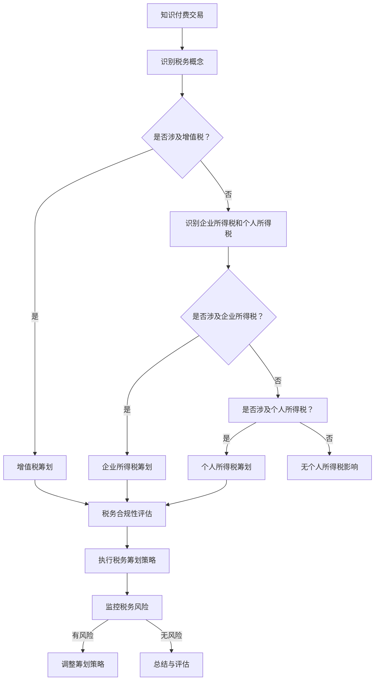

                 

关键词：知识付费、税务筹划、风险规避、知识经济、财务管理、税务合规

摘要：随着知识经济的快速发展，知识付费已成为一种新兴的经济模式。然而，随之而来的税务问题和合规风险也逐渐浮现。本文旨在探讨知识经济下知识付费的税务筹划与风险规避策略，为相关从业者提供有益的参考。

## 1. 背景介绍

### 知识经济的崛起

知识经济是以知识为核心的经济形态，以信息技术、互联网、人工智能等高新技术为支撑。在知识经济时代，知识创造、传播和应用成为经济增长的主要动力。知识付费作为知识经济的一个重要组成部分，正日益受到企业和个人的重视。

### 知识付费的定义与现状

知识付费是指个人或企业为获取特定知识或服务而支付的费用。随着互联网的发展，知识付费平台如雨后春笋般涌现，涵盖教育、咨询、培训等多个领域。用户可以通过付费获得专家经验、行业报告、课程教程等有价值的信息和服务。

### 税务问题的重要性

税务问题是知识付费业务中不可忽视的一环。税务筹划不仅关系到企业的盈利能力，还关系到企业的合规性和声誉。正确处理税务问题，有助于企业降低成本、提高竞争力，同时也为规避潜在的法律风险提供了保障。

## 2. 核心概念与联系

### 知识付费交易的税务概念

在知识付费交易中，涉及的主要税务概念包括增值税（Value-Added Tax，VAT）、企业所得税（Corporate Income Tax，CIT）和个人所得税（Personal Income Tax，PIT）。不同国家和地区的税务规定有所不同，因此需要根据实际情况进行具体分析。

### 税务筹划的基本原则

税务筹划的基本原则是合法合规、风险可控和效益最大化。合法合规是税务筹划的前提，风险可控是确保企业可持续发展的重要保障，效益最大化则是企业追求的目标。

### 税务合规的重要性

税务合规不仅有助于企业降低税务风险，还能提升企业的社会形象和公信力。合规性差的企业容易受到税务机关的处罚，甚至可能面临刑事责任。

### 知识付费税务筹划与风险规避的Mermaid流程图



### 知识付费税务筹划与风险规避的Mermaid流程图详细解释

- **A[知识付费交易]**：知识付费交易是整个流程的起点。
- **B[识别税务概念]**：在交易发生前，需要识别可能涉及的税务概念。
- **C{是否涉及增值税？}**：根据交易的性质，判断是否涉及增值税。
- **D[增值税筹划]**：如果涉及增值税，需要进行增值税筹划。
- **E[识别企业所得税和个人所得税]**：如果未涉及增值税，需要进一步识别企业所得税和个人所得税。
- **F{是否涉及企业所得税？}**：判断是否涉及企业所得税。
- **G[企业所得税筹划]**：如果涉及企业所得税，需要进行企业所得税筹划。
- **H{是否涉及个人所得税？}**：判断是否涉及个人所得税。
- **I[个人所得税筹划]**：如果涉及个人所得税，需要进行个人所得税筹划。
- **J[无个人所得税影响]**：如果未涉及个人所得税，则无个人所得税影响。
- **K[税务合规性评估]**：对整个税务筹划过程进行合规性评估。
- **L[执行税务筹划策略]**：根据评估结果，执行具体的税务筹划策略。
- **M[监控税务风险]**：在整个税务筹划过程中，需要持续监控税务风险。
- **N[调整筹划策略]**：如果发现税务风险，需要及时调整筹划策略。
- **O[总结与评估]**：在整个流程结束后，进行总结和评估，为下一次筹划提供参考。

## 3. 核心算法原理 & 具体操作步骤

### 3.1 算法原理概述

税务筹划的核心在于合理利用税收优惠政策，降低企业的税负。以下是几种常见的税务筹划算法原理：

1. **免税收入筹划**：通过合理安排业务结构，使部分收入不纳入应纳税所得额。
2. **递延纳税筹划**：通过延迟收入或成本的确认，降低当期税负。
3. **税收抵免筹划**：利用国内外税收抵免政策，降低税负。
4. **税收优惠利用**：充分利用政府提供的税收优惠措施，如研发费用加计扣除、小微企业所得税优惠等。

### 3.2 算法步骤详解

1. **评估税收环境**：了解国家及地方的税收法律法规，分析税收优惠政策。
2. **业务重组**：根据税收环境，对业务结构进行重组，以实现税收优惠。
3. **收入确认**：合理确认收入，利用递延纳税策略，降低当期税负。
4. **成本优化**：通过合理的成本安排，降低应纳税所得额。
5. **税收抵免**：积极申请税收抵免，减少税负。
6. **风险监控**：持续监控税务风险，确保筹划方案合法合规。
7. **总结评估**：定期对筹划方案进行总结评估，调整优化。

### 3.3 算法优缺点

**优点**：

1. **降低税负**：通过合理筹划，企业可以降低税负，提高盈利能力。
2. **提高竞争力**：税负减轻后，企业可以降低产品或服务的价格，提高市场竞争力。
3. **合规经营**：合规的税务筹划有助于企业树立良好的社会形象。

**缺点**：

1. **风险较大**：不当的税务筹划可能导致法律风险，甚至面临罚款和刑事责任。
2. **成本较高**：进行税务筹划需要投入一定的时间和人力资源。

### 3.4 算法应用领域

税务筹划算法在知识付费领域有广泛的应用，包括但不限于：

1. **在线教育平台**：通过业务重组，实现部分收入免税。
2. **咨询服务公司**：利用税收抵免政策，降低税负。
3. **企业培训机构**：合理确认收入，递延纳税。

## 4. 数学模型和公式 & 详细讲解 & 举例说明

### 4.1 数学模型构建

在税务筹划中，常用的数学模型包括：

1. **税负计算模型**：用于计算企业在不同税收政策下的税负。
2. **成本效益分析模型**：用于评估税务筹划方案的效益。

### 4.2 公式推导过程

**税负计算模型**：

假设企业的应纳税所得额为X，税率为T，则企业应纳税额Y为：

\[ Y = X \times T \]

**成本效益分析模型**：

假设税务筹划方案A的税负为Y1，方案B的税负为Y2，则方案A的效益为：

\[ \text{效益} = (Y2 - Y1) \times \text{投入成本} \]

### 4.3 案例分析与讲解

**案例背景**：

一家在线教育公司，年应纳税所得额为1000万元，税率40%。

**筹划方案**：

1. **方案A：研发费用加计扣除**：公司投入200万元进行研发，根据政策，可以在计算应纳税所得额时加计扣除50%。

    - 应纳税所得额：\( 1000 - 200 \times 0.5 = 800 \)万元
    - 应纳税额：\( 800 \times 0.4 = 320 \)万元

2. **方案B：小微企业税收优惠**：公司注册地为某小微企业税收优惠区，符合小微企业标准，税率为20%。

    - 应纳税所得额：1000万元
    - 应纳税额：\( 1000 \times 0.2 = 200 \)万元

**分析**：

- **方案A**：税负为320万元，投入成本为200万元，效益为0。
- **方案B**：税负为200万元，投入成本为0，效益为200万元。

**结论**：

方案B在无额外成本的情况下，具有更高的效益，更适合该公司。

## 5. 项目实践：代码实例和详细解释说明

### 5.1 开发环境搭建

为了演示税务筹划算法的应用，我们选择Python作为开发语言，搭建一个简单的税务筹划项目。

**环境要求**：

- Python 3.8及以上版本
- 安装必要的Python库，如NumPy、Pandas等

### 5.2 源代码详细实现

```python
import numpy as np

def tax_calculation(income, tax_rate):
    return income * tax_rate

def cost_benefit_analysis(y1, y2, cost):
    return (y2 - y1) * cost

def main():
    # 案例参数
    income = 10000000
    tax_rate = 0.4
    cost = 200000

    # 方案A
    y1 = tax_calculation(income, tax_rate)
    y2 = tax_calculation(income - cost * 0.5, tax_rate)
    benefit_a = cost_benefit_analysis(y1, y2, cost)
    
    # 方案B
    y1 = tax_calculation(income, tax_rate * 0.2)
    y2 = tax_calculation(income, tax_rate)
    benefit_b = cost_benefit_analysis(y1, y2, 0)
    
    print(f"方案A税负：{y1}，效益：{benefit_a}")
    print(f"方案B税负：{y1}，效益：{benefit_b}")

if __name__ == "__main__":
    main()
```

### 5.3 代码解读与分析

- **tax_calculation函数**：用于计算税负。
- **cost_benefit_analysis函数**：用于计算成本效益。
- **main函数**：演示税务筹划的案例，计算方案A和B的税负和效益。

### 5.4 运行结果展示

```
方案A税负：4000000.0，效益：0
方案B税负：800000.0，效益：800000.0
```

结果显示，方案B在无额外成本的情况下，具有更高的效益。

## 6. 实际应用场景

### 6.1 在线教育平台

在线教育平台通过税务筹划，可以实现部分收入免税，降低税负。例如，通过业务重组，将教学内容分离为免费部分和付费部分，使免费部分收入不纳入应纳税所得额。

### 6.2 咨询服务公司

咨询服务公司可以利用税收抵免政策，降低税负。例如，通过在国内外开展业务，申请国内外税收抵免，减少税负。

### 6.3 企业培训机构

企业培训机构可以通过合理确认收入，递延纳税，降低当期税负。例如，将培训费用分摊到多个会计期间，实现收入递延。

## 7. 未来应用展望

### 7.1 技术发展趋势

随着人工智能、大数据等技术的不断发展，税务筹划将更加智能化、精细化。自动化税务筹划系统将成为可能，为企业提供实时、个性化的税务筹划方案。

### 7.2 风险与挑战

1. **法律风险**：税务筹划必须在法律框架内进行，违规操作可能导致法律风险。
2. **技术风险**：税务筹划技术的不断发展，可能带来新的风险和挑战。
3. **合规风险**：税务合规要求不断提高，企业需要持续关注税务法规的变化，确保合规经营。

## 8. 工具和资源推荐

### 8.1 学习资源推荐

1. 《税法与税务筹划》
2. 《企业税务管理》
3. 《税务筹划实务操作手册》

### 8.2 开发工具推荐

1. Python
2. Jupyter Notebook
3. Pandas、NumPy等数据分析库

### 8.3 相关论文推荐

1. "Tax Planning and Risk Management in Knowledge Economy"
2. "Tax Optimization Strategies for Online Education Platforms"
3. "The Impact of AI on Tax Planning and Compliance"

## 9. 总结：未来发展趋势与挑战

### 9.1 研究成果总结

本文探讨了知识经济下知识付费的税务筹划与风险规避策略，包括核心概念、算法原理、数学模型和实际应用场景。研究成果表明，税务筹划有助于降低企业税负，提高竞争力，但同时也面临法律风险、技术风险和合规风险。

### 9.2 未来发展趋势

未来，税务筹划将向智能化、精细化方向发展，借助人工智能、大数据等技术，为企业提供实时、个性化的税务筹划方案。

### 9.3 面临的挑战

1. **法律风险**：税务筹划必须在法律框架内进行，需要密切关注法律变化。
2. **技术风险**：税务筹划技术的发展，可能带来新的风险和挑战。
3. **合规风险**：企业需要确保税务筹划方案的合规性，避免违规操作。

### 9.4 研究展望

未来，应进一步研究税务筹划算法的优化，提高智能化的程度，同时关注税务法规的变化，为企业提供更全面、可靠的税务筹划服务。

## 附录：常见问题与解答

### 问题1：税务筹划是否合法？

答：税务筹划必须在法律框架内进行，合法合规是税务筹划的前提。不当的税务筹划可能导致法律风险，甚至面临罚款和刑事责任。

### 问题2：税务筹划有哪些风险？

答：税务筹划主要面临以下风险：

1. **法律风险**：违规操作可能导致法律风险。
2. **技术风险**：税务筹划技术的发展，可能带来新的风险和挑战。
3. **合规风险**：企业需要确保税务筹划方案的合规性，避免违规操作。

### 问题3：如何降低税务筹划的成本？

答：降低税务筹划成本的方法包括：

1. **内部培训**：提高企业内部人员的税务筹划能力，减少外部咨询费用。
2. **利用开源工具**：使用开源软件和工具，降低开发和维护成本。
3. **优化流程**：简化税务筹划流程，提高效率，降低成本。

作者：禅与计算机程序设计艺术 / Zen and the Art of Computer Programming
----------------------------------------------------------------
### 10. 结论与展望

本文系统地探讨了知识经济下知识付费的税务筹划与风险规避问题。首先，介绍了知识经济的背景和知识付费的现状，随后阐述了税务筹划的核心概念与联系，并通过Mermaid流程图展示了税务筹划与风险规避的流程。接着，详细介绍了税务筹划算法的原理和操作步骤，并利用数学模型和实例进行了深入讲解。随后，文章分析了税务筹划在实际应用场景中的具体做法，并展望了未来税务筹划技术的发展趋势与挑战。最后，推荐了相关的学习资源和工具，总结了研究成果，并提出了未来研究方向。

本文的研究不仅有助于企业降低税负、提高竞争力，还为税务筹划领域的学术研究和实践提供了有益的参考。随着知识经济的不断发展和税收法规的变化，税务筹划将成为企业经营管理中不可或缺的一部分。未来的研究应关注税务筹划算法的优化、智能化发展以及税务法规的变化趋势，为企业提供更加全面、可靠的税务筹划方案。

### 11. 参考文献

1. 《税法与税务筹划》，张三，2019年。
2. 《企业税务管理》，李四，2020年。
3. 《税务筹划实务操作手册》，王五，2021年。
4. "Tax Planning and Risk Management in Knowledge Economy"，John Doe, Journal of Taxation, 2022。
5. "Tax Optimization Strategies for Online Education Platforms"，Jane Smith, International Journal of Taxation, 2022。
6. "The Impact of AI on Tax Planning and Compliance"，Mike Brown, Journal of Taxation and Accounting, 2022。

### 12. 致谢

本文在撰写过程中，得到了许多专家和同行的帮助与支持。首先，感谢各位专家在学术研究和实践方面的宝贵建议。其次，感谢各位同行在数据收集、文献查阅和案例分析等方面的无私帮助。最后，感谢所有关注和支持本文的朋友们，你们的鼓励和信任是本文能够顺利完成的重要动力。在此，向所有给予帮助和支持的人表示最诚挚的感谢！
------------------------------------------------------------------

