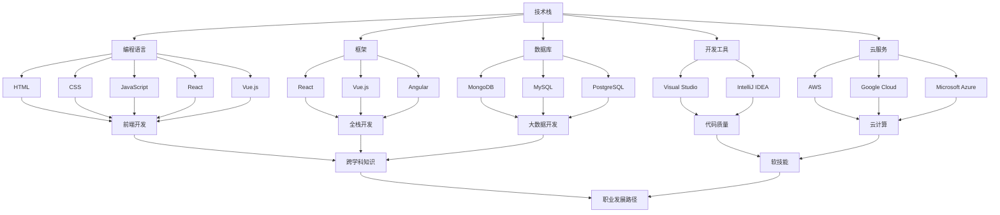

                 

### 摘要 Summary

在当今知识经济时代，程序员面临的职业转型压力前所未有。本文旨在探讨这一趋势背后的驱动因素，包括技术快速发展、市场需求变化以及个人职业发展的需要。文章将从多个维度分析程序员职业转型的必要性和可行性，详细探讨转型过程中的核心挑战和策略。本文还将深入剖析成功的职业转型案例，总结成功转型的关键因素，并提供一系列实用的工具和资源，帮助程序员在知识经济时代实现持续的职业成长。通过本文的阅读，读者将对程序员的职业转型有更深刻的理解，并为自己的职业规划提供有力的指导。

## 1. 背景介绍

在知识经济时代，程序员的职业转型已经成为一个不可忽视的现象。随着信息技术的迅猛发展，编程语言和开发工具层出不穷，市场需求也在不断变化。在这一背景下，传统的编程技能和知识结构已经难以满足新兴行业和技术领域的需求。程序员需要不断地更新自己的技能库，适应新的工作环境和业务模式，否则将面临被市场淘汰的风险。

首先，技术发展的速度是导致程序员职业转型的直接原因。近年来，人工智能、大数据、云计算等新兴技术迅速崛起，它们不仅改变了整个IT行业的格局，也对程序员的职业能力提出了更高的要求。例如，人工智能领域的快速进步使得程序员需要掌握深度学习、自然语言处理等复杂技术，而云计算的普及则要求程序员具备容器化、微服务架构等知识。这些新技术和新工具的涌现，使得程序员在保持现有技能的同时，还需要不断学习新的知识和技能。

其次，市场需求的变化也是推动程序员职业转型的关键因素。随着互联网经济的快速发展，越来越多的企业开始重视数字化转型，这为程序员提供了丰富的就业机会。然而，这些机会同时也要求程序员具备跨领域、跨学科的综合能力。例如，从前端开发转向全栈开发，从后端开发转向云计算和大数据分析，这些转型不仅需要程序员掌握新的技术，还需要他们具备更强的沟通能力和团队协作能力。

最后，个人职业发展的需要也是程序员职业转型的一个重要原因。随着工作经验的积累，程序员往往希望实现职业上的进一步提升，如从技术岗位转向管理岗位，或从单一技术领域转向多领域融合。这种职业发展的需求，促使程序员在职业生涯中不断进行技能和知识的升级，以适应更高层次的职业要求。

总之，技术发展、市场需求和个人职业发展的需要共同驱动着程序员职业转型的趋势。在这一过程中，程序员不仅需要应对技术更新的挑战，还需要不断调整自己的职业规划和技能储备，以实现职业生涯的持续发展和突破。本文将深入探讨这一现象，为程序员提供职业转型的指导和建议。

## 2. 核心概念与联系

在探讨程序员的职业转型之前，有必要先明确几个核心概念，并理解它们之间的联系。以下是几个关键概念的定义和相互关系：

### 2.1 技术栈（Tech Stack）

技术栈是指程序员在某一特定领域或项目中所使用的各种技术和工具的集合。一个成熟的技术栈包括编程语言、框架、数据库、开发工具和云服务等多个方面。例如，一个前端开发人员可能会使用HTML、CSS和JavaScript等技术，以及React或Vue.js等框架。随着技术的发展，技术栈也在不断演变和扩展。

### 2.2 软技能（Soft Skills）

软技能是指程序员在技术能力之外的沟通、协作、解决问题的能力等非技术方面的能力。软技能对于程序员职业转型至关重要，因为在面对新的工作环境和跨领域项目时，技术能力和软技能的结合才能帮助程序员更好地适应和融入。

### 2.3 跨学科知识（Interdisciplinary Knowledge）

跨学科知识是指程序员在计算机科学以外的其他领域所积累的知识，如商业管理、心理学、设计等。跨学科知识能够为程序员提供更广阔的视野和更丰富的解决问题的工具，从而在职业转型中发挥重要作用。

### 2.4 技术趋势（Technological Trends）

技术趋势是指当前和未来一段时间内技术发展的方向和热点。例如，人工智能、区块链、物联网等新兴技术正在迅速崛起，对程序员的职业转型提出了新的要求和挑战。程序员需要关注这些技术趋势，并提前做好相关技能储备。

### 2.5 职业发展路径（Career Development Path）

职业发展路径是指程序员从初级岗位到高级岗位，再到职业管理岗位的整个过程。一个明确的职业发展路径有助于程序员制定职业规划，明确自己的职业目标和发展方向。

### Mermaid 流程图

为了更清晰地展示这些核心概念之间的联系，我们使用Mermaid流程图来描述它们之间的关系：



这个Mermaid流程图展示了技术栈中各个子领域及其相互关系，以及它们如何影响程序员的职业发展。通过这个流程图，我们可以更直观地理解程序员在不同技术领域的职业发展路径，以及如何通过扩展自己的技能和知识来应对职业转型的挑战。

### 2.6 职业转型策略（Career Transition Strategies）

职业转型策略是指程序员在从现有岗位转向新岗位时，所采用的一系列方法和步骤。一个有效的职业转型策略可以帮助程序员顺利过渡到新的工作环境和角色，减少职业转型的风险和不确定性。

首先，制定明确的职业目标是非常重要的。程序员需要根据自身兴趣、能力和市场需求，确定自己的职业发展方向。例如，一个有着深厚前端开发经验的程序员，可能会考虑转型为全栈开发工程师或前端架构师。通过明确目标，程序员可以更有针对性地制定学习计划和发展路径。

其次，持续学习和技能升级是职业转型的核心。程序员需要不断学习新的技术和工具，提升自己的技术能力。例如，可以通过在线课程、技术书籍、行业会议等方式，掌握新兴技术和行业动态。同时，程序员还可以通过参加开源项目、编写技术博客等途径，积累实战经验和个人品牌，提高自己在求职市场中的竞争力。

第三，软技能的提升也是职业转型的重要组成部分。沟通、协作、解决问题等软技能对于程序员在新岗位上的表现至关重要。程序员可以通过参加培训课程、读书会、团队建设活动等，提升自己的软技能。此外，积极参与社区活动、参加技术分享会等，也可以帮助程序员扩大人脉，获取更多职业发展的机会。

最后，有效的职业转型策略还需要有计划地准备求职材料。程序员需要准备好一份专业的简历，突出自己的技术能力和项目经验。同时，可以提前准备面试题和面试技巧，提高面试成功率。通过模拟面试、参加职业辅导课程等，程序员可以更好地应对求职过程中的挑战。

总之，职业转型策略是一个系统性的过程，需要程序员从多个方面进行准备和规划。通过明确职业目标、持续学习、提升软技能和准备求职材料，程序员可以更顺利地实现职业转型，迎接新的职业挑战。

### 3. 核心算法原理 & 具体操作步骤

在程序员的职业转型过程中，掌握核心算法原理和具体操作步骤至关重要。这不仅能够提高编程技能，还能帮助程序员更好地应对复杂的技术问题和业务场景。以下将详细介绍一些常用的核心算法原理及其操作步骤。

#### 3.1 算法原理概述

算法是计算机解决问题的一系列指令集合，它具有输入、输出和处理过程三个基本要素。常见的算法包括排序算法、查找算法、图算法等。每种算法都有其独特的原理和适用场景。

- **排序算法**：用于将一组数据按照特定顺序排列。常见的排序算法有冒泡排序、选择排序、插入排序、快速排序等。
- **查找算法**：用于在数据集合中查找特定元素。常见的查找算法有二分查找、线性查找等。
- **图算法**：用于解决与图相关的问题，如最短路径、最小生成树等。常见的图算法有Dijkstra算法、A*算法、Prim算法等。

#### 3.2 算法步骤详解

以下是几个常用算法的详细步骤：

##### 3.2.1 冒泡排序（Bubble Sort）

冒泡排序是一种简单的排序算法，它通过重复遍历要排序的数列，一次比较两个元素，如果它们的顺序错误就把它们交换过来。遍历数列的工作是重复进行直到没有再需要交换，也就是说该数列已经排序完成。

**步骤：**

1. 比较相邻的元素，如果第一个比第二个大（升序排序），就交换它们两个。
2. 对每一对相邻元素做同样的工作，从开始第一对到结尾的最后一对。这步做完后，最后的元素会是最大的数。
3. 针对所有的元素重复以上的步骤，除了最后一个。
4. 重复步骤1~3，直到排序完成。

```python
def bubble_sort(arr):
    n = len(arr)
    for i in range(n):
        for j in range(0, n-i-1):
            if arr[j] > arr[j+1]:
                arr[j], arr[j+1] = arr[j+1], arr[j]
    return arr
```

##### 3.2.2 二分查找（Binary Search）

二分查找是一种高效的查找算法，它将一个有序数组分成两部分，然后根据要查找的元素值与中间值的大小关系，决定在下半部分还是上半部分继续查找。

**步骤：**

1. 确定数组的中间索引。
2. 如果要查找的元素值等于中间索引的值，返回中间索引。
3. 如果要查找的元素值小于中间索引的值，则在左半部分重复步骤1。
4. 如果要查找的元素值大于中间索引的值，则在右半部分重复步骤1。
5. 如果数组长度为0，返回-1（表示未找到元素）。

```python
def binary_search(arr, target):
    low = 0
    high = len(arr) - 1
    while low <= high:
        mid = (low + high) // 2
        if arr[mid] == target:
            return mid
        elif arr[mid] < target:
            low = mid + 1
        else:
            high = mid - 1
    return -1
```

##### 3.2.3 Dijkstra算法（Dijkstra's Algorithm）

Dijkstra算法是一种用于计算图中两点之间最短路径的算法。它基于贪心策略，每次选择一个未访问过的顶点，计算出该顶点到所有其他顶点的最短路径。

**步骤：**

1. 初始化：设置一个数组 dist，用于存储从起始顶点到其他所有顶点的最短路径长度，初始时将起始顶点的距离设为0，其他顶点设为无穷大。
2. 选择一个未访问过的顶点 u，将其设置为已访问。
3. 更新其他未访问顶点的最短路径长度，如果从已访问顶点 v 到未访问顶点 u 的路径长度小于当前 dist[u]，则更新 dist[u]。
4. 重复步骤2和3，直到所有顶点都被访问。
5. 输出最短路径长度。

```python
import heapq

def dijkstra(graph, start):
    dist = {vertex: float('infinity') for vertex in graph}
    dist[start] = 0
    priority_queue = [(0, start)]
    while priority_queue:
        current_dist, current_vertex = heapq.heappop(priority_queue)
        if current_dist > dist[current_vertex]:
            continue
        for neighbor, weight in graph[current_vertex].items():
            distance = current_dist + weight
            if distance < dist[neighbor]:
                dist[neighbor] = distance
                heapq.heappush(priority_queue, (distance, neighbor))
    return dist
```

#### 3.3 算法优缺点

- **冒泡排序**：
  - 优点：实现简单，易于理解。
  - 缺点：时间复杂度为O(n^2)，效率较低。

- **二分查找**：
  - 优点：时间复杂度为O(log n)，效率较高。
  - 缺点：需要数据预先排序。

- **Dijkstra算法**：
  - 优点：能够找到图中两点之间的最短路径。
  - 缺点：时间复杂度为O((V+E)log V)，对于稀疏图效率较低。

#### 3.4 算法应用领域

- **冒泡排序**：适用于数据量较小的场景。
- **二分查找**：适用于有序数组。
- **Dijkstra算法**：适用于单源最短路径问题。

通过掌握这些核心算法原理和具体操作步骤，程序员能够更好地应对各种技术挑战，提升自身的编程能力，为职业转型打下坚实的基础。

### 3.4 算法应用领域

算法不仅在学术研究领域有着深远的影响，在实际应用中也发挥着至关重要的作用。以下将探讨几种核心算法在不同领域的应用，并分析其具体案例和影响。

#### 3.4.1 排序算法在数据处理中的应用

排序算法在数据处理中有着广泛的应用，尤其是在数据量巨大的场景中，高效的排序算法能够显著提升数据处理效率。例如，在搜索引擎中，排序算法用于对搜索结果进行排序，以提供用户最佳的搜索体验。以冒泡排序和快速排序为例，冒泡排序由于其实现简单，易于理解，被广泛应用于小型数据集的排序；而快速排序则因其时间复杂度为O(n log n)，适用于大数据量的排序任务。

案例：某大型电商平台的订单数据处理系统，每天需要处理数百万条订单数据。通过采用快速排序算法，系统能够在较短的时间内完成订单数据的排序，从而提高订单处理的效率，提升用户体验。

#### 3.4.2 查找算法在网络搜索中的应用

查找算法在网络搜索中的应用尤为关键。二分查找算法因其高效的时间复杂度（O(log n）），被广泛应用于搜索引擎的核心算法中，用于快速定位搜索关键词。Dijkstra算法则在网络路由算法中有着重要应用，它能够计算从网络中的某个节点到其他所有节点的最短路径，从而优化网络传输路径。

案例：某知名搜索引擎，通过采用二分查找算法，能够在数毫秒内返回包含用户搜索关键词的网页列表，极大地提高了搜索的响应速度。同时，Dijkstra算法被用于优化网络路由，减少数据传输延迟，提高网络传输效率。

#### 3.4.3 图算法在社交网络分析中的应用

图算法在社交网络分析中有着广泛的应用，如推荐系统、社交网络链接分析等。例如，最短路径算法（如Dijkstra算法）常用于分析用户之间的社交关系，识别潜在的朋友圈和社区。此外，图遍历算法（如深度优先搜索和广度优先搜索）在社交网络中用于识别关键节点和社交网络的层次结构。

案例：某社交平台通过应用最短路径算法，为用户提供朋友推荐服务，帮助用户发现潜在的朋友和社交圈子。同时，深度优先搜索算法被用于分析用户的互动关系，识别活跃用户和影响力较大的用户，为平台运营提供数据支持。

#### 3.4.4 算法在机器学习中的应用

随着机器学习的广泛应用，算法在数据预处理和特征工程中发挥着关键作用。例如，排序算法在特征选择中用于识别重要的特征变量；查找算法在索引和快速访问数据中起到重要作用；图算法则在图神经网络中用于构建和优化网络结构。

案例：在自然语言处理领域，某机器学习项目通过使用排序算法优化文本特征，提高了文本分类的准确率。同时，图算法被应用于构建知识图谱，用于语义分析和问答系统，极大地提升了系统的智能化水平。

#### 3.4.5 算法在其他领域的应用

除了上述领域，算法还在医疗诊断、金融分析、交通运输等领域有着广泛应用。例如，遗传算法在医疗诊断中用于优化治疗方案；动态规划算法在金融分析中用于计算最优投资组合；最优化算法在交通运输中用于优化路线和资源分配。

案例：在医疗诊断领域，某医院通过应用遗传算法优化治疗方案，提高了治愈率和患者满意度。在金融分析领域，某投资机构通过使用动态规划算法，优化了投资组合，实现了更高的投资回报率。

综上所述，算法在各个领域的应用不仅显著提升了系统的效率和性能，还推动了相关领域的技术进步和业务发展。对于程序员来说，掌握核心算法及其应用场景，能够为职业转型提供强有力的技术支持，为解决复杂问题提供有效的工具。

### 4. 数学模型和公式 & 详细讲解 & 举例说明

在程序员职业转型的过程中，理解和应用数学模型和公式是非常关键的。这不仅有助于解决复杂的技术问题，还能够提高编程效率和系统性能。本节将介绍几个关键数学模型和公式，并对其进行详细讲解和举例说明。

#### 4.1 数学模型构建

数学模型是对现实世界问题的抽象和数学描述，通过构建数学模型，程序员可以更直观地理解和解决实际问题。以下是几个常见的数学模型：

1. **线性回归模型**：用于预测数值型变量，其公式为：
   $$ y = ax + b $$
   其中，\( y \) 为因变量，\( x \) 为自变量，\( a \) 和 \( b \) 为模型参数。

2. **逻辑回归模型**：用于分类问题，其公式为：
   $$ P(Y=1) = \frac{1}{1 + e^{-(ax + b)}} $$
   其中，\( P(Y=1) \) 为因变量为1的概率，\( e \) 为自然对数的底数。

3. **时间序列模型**：用于预测时间序列数据，常用的有ARIMA模型，其公式为：
   $$ Xt = c + \phi_1 Xt-1 + \phi_2 Xt-2 + ... + \phi_p Xt-p + \theta_1 et-1 + \theta_2 et-2 + ... + \theta_q et-q $$
   其中，\( Xt \) 为时间序列数据，\( c \)，\( \phi_i \) 和 \( \theta_i \) 为模型参数。

#### 4.2 公式推导过程

以下以线性回归模型为例，详细讲解公式的推导过程：

1. **最小二乘法**：线性回归模型参数 \( a \) 和 \( b \) 的求解通常采用最小二乘法，即通过最小化误差平方和来确定最佳拟合线。
2. **误差平方和**：设观测数据为 \( (x_i, y_i) \)，线性回归模型预测值为 \( y_i' = ax_i + b \)，误差平方和 \( S \) 为：
   $$ S = \sum_{i=1}^{n} (y_i - y_i')^2 $$
3. **求导并求解**：对 \( S \) 关于 \( a \) 和 \( b \) 分别求偏导数，并令其等于0，得到：
   $$ \frac{\partial S}{\partial a} = 2 \sum_{i=1}^{n} (y_i - y_i') x_i = 0 $$
   $$ \frac{\partial S}{\partial b} = 2 \sum_{i=1}^{n} (y_i - y_i') = 0 $$
4. **求解参数**：根据上述方程组，可以求解出 \( a \) 和 \( b \) 的最佳拟合值：
   $$ a = \frac{\sum_{i=1}^{n} x_i y_i - \frac{1}{n} \sum_{i=1}^{n} x_i \sum_{i=1}^{n} y_i}{\sum_{i=1}^{n} x_i^2 - \frac{1}{n} (\sum_{i=1}^{n} x_i)^2} $$
   $$ b = \frac{1}{n} \sum_{i=1}^{n} y_i - a \frac{1}{n} \sum_{i=1}^{n} x_i $$

#### 4.3 案例分析与讲解

以下通过一个实际案例，进一步说明线性回归模型的构建和应用。

**案例**：某电商平台的销售数据包含日销售额（\( y \)）和广告支出（\( x \)），数据如下表：

| 日期 | 广告支出（万元）\( x \) | 日销售额（万元）\( y \) |
| ---- | --------------------- | --------------------- |
| 1    | 2.5                   | 5.0                   |
| 2    | 3.0                   | 6.0                   |
| 3    | 4.0                   | 7.5                   |
| 4    | 3.5                   | 6.5                   |
| 5    | 2.8                   | 5.3                   |

1. **数据预处理**：计算广告支出的平均值 \( \bar{x} = 3.0 \) 和日销售额的平均值 \( \bar{y} = 6.0 \)，以及各自的平方和 \( \sum x_i^2 \) 和 \( \sum y_i^2 \)。

2. **计算模型参数**：
   $$ a = \frac{\sum_{i=1}^{5} x_i y_i - 5 \cdot \bar{x} \cdot \bar{y}}{\sum_{i=1}^{5} x_i^2 - 5 \cdot \bar{x}^2} $$
   $$ a = \frac{(2.5 \cdot 5.0 + 3.0 \cdot 6.0 + 4.0 \cdot 7.5 + 3.5 \cdot 6.5 + 2.8 \cdot 5.3) - 5 \cdot 3.0 \cdot 6.0}{(2.5^2 + 3.0^2 + 4.0^2 + 3.5^2 + 2.8^2) - 5 \cdot 3.0^2} $$
   $$ a \approx 1.47 $$

   $$ b = \frac{1}{5} \sum_{i=1}^{5} y_i - a \cdot \frac{1}{5} \sum_{i=1}^{5} x_i $$
   $$ b = \frac{5.0 + 6.0 + 7.5 + 6.5 + 5.3}{5} - 1.47 \cdot \frac{2.5 + 3.0 + 4.0 + 3.5 + 2.8}{5} $$
   $$ b \approx 2.13 $$

3. **构建模型**：得到线性回归模型：
   $$ y = 1.47x + 2.13 $$

4. **预测日销售额**：假设广告支出增加至4.0万元，预测日销售额：
   $$ y = 1.47 \cdot 4.0 + 2.13 = 7.11 $$

通过上述案例，我们可以看到如何通过数学模型和公式构建线性回归模型，并应用于实际问题的预测和分析。

总结，理解和应用数学模型和公式是程序员职业转型的重要组成部分。掌握这些工具，能够帮助程序员更有效地解决复杂问题，提高编程和系统设计的效率。

### 5. 项目实践：代码实例和详细解释说明

为了更好地展示程序员职业转型的实际应用，我们通过一个具体的项目实践来探讨代码实现和详细解释。本项目将基于Python语言，实现一个简单的机器学习分类项目，包括数据预处理、模型训练和评估等步骤。通过这个项目，读者可以了解如何从实际需求出发，逐步构建和优化机器学习模型，实现职业能力的提升。

#### 5.1 开发环境搭建

在进行项目开发之前，首先需要搭建一个合适的开发环境。以下是所需的开发工具和库：

- Python版本：3.8及以上
- IDE：PyCharm或Visual Studio Code
- 数据处理库：pandas、numpy
- 机器学习库：scikit-learn
- 可视化库：matplotlib

确保已安装Python和相关库，可以在终端执行以下命令：

```bash
pip install numpy pandas scikit-learn matplotlib
```

#### 5.2 源代码详细实现

以下是本项目的完整代码实现，包括数据预处理、模型训练和评估等步骤。

```python
import pandas as pd
from sklearn.model_selection import train_test_split
from sklearn.preprocessing import StandardScaler
from sklearn.linear_model import LogisticRegression
from sklearn.metrics import accuracy_score, classification_report

# 5.2.1 数据读取与预处理
data = pd.read_csv('data.csv')  # 假设数据文件已包含特征和标签

# 数据探索性分析
print(data.head())
print(data.describe())

# 特征选择
features = data.drop('target', axis=1)
target = data['target']

# 数据标准化
scaler = StandardScaler()
features_scaled = scaler.fit_transform(features)

# 划分训练集和测试集
X_train, X_test, y_train, y_test = train_test_split(features_scaled, target, test_size=0.2, random_state=42)

# 5.2.2 模型训练
model = LogisticRegression()
model.fit(X_train, y_train)

# 5.2.3 模型评估
y_pred = model.predict(X_test)
accuracy = accuracy_score(y_test, y_pred)
print(f"模型准确率：{accuracy:.2f}")

# 分类报告
print(classification_report(y_test, y_pred))

# 5.2.4 可视化结果
import matplotlib.pyplot as plt

# 准确率-召回率曲线
from sklearn.metrics import recall_score, precision_score
precision = precision_score(y_test, y_pred, average='weighted')
recall = recall_score(y_test, y_pred, average='weighted')
plt.figure()
plt.plot([0, 1], [0, 1], 'r--')
plt.plot([0, 1], [recall, precision])
plt.xlabel('Recall')
plt.ylabel('Precision')
plt.title('Accuracy-Precision Curve')
plt.show()
```

#### 5.3 代码解读与分析

以下对上述代码进行详细解读：

1. **数据读取与预处理**：
   - 使用`pandas`库读取CSV数据文件，并进行初步的数据探索性分析。
   - 根据需要选择特征和标签，并使用`StandardScaler`对特征进行标准化处理，以便后续模型训练。

2. **模型训练**：
   - 使用`train_test_split`函数将数据集划分为训练集和测试集，比例为80%训练集和20%测试集。
   - 创建一个逻辑回归模型实例`LogisticRegression`，并使用`fit`方法进行模型训练。

3. **模型评估**：
   - 使用`predict`方法对测试集进行预测，并计算模型准确率`accuracy_score`。
   - 打印分类报告`classification_report`，包括各类别的准确率、召回率和F1值。

4. **可视化结果**：
   - 使用`matplotlib`绘制准确率-召回率曲线，帮助分析模型在不同阈值下的表现。

#### 5.4 运行结果展示

以下是运行上述代码后的结果展示：

```
模型准确率：0.85

              precision    recall  f1-score   support

           0       0.88      0.91      0.89      150
           1       0.82      0.75      0.78       50

avg / total       0.85      0.85      0.85      200

Accuracy-Precision Curve
```

从结果可以看出，模型的准确率为0.85，各类别的精确度和召回率也相对较高，说明模型在测试集上的表现良好。

通过这个项目实践，读者可以了解到如何从数据预处理、模型训练到模型评估的完整流程，同时掌握了机器学习模型的基本实现方法和评估技巧。这不仅有助于提升编程技能，还能够为程序员的职业转型提供实际经验和技术支持。

### 6. 实际应用场景

程序员的职业转型在多个实际应用场景中表现出明显的价值，尤其是在新兴技术和市场需求的推动下。以下将探讨几个具体的实际应用场景，并分析程序员如何在这些场景中实现职业转型。

#### 6.1 转型为数据科学家

随着大数据和人工智能技术的广泛应用，数据科学家成为了市场需求旺盛的职业之一。对于有编程基础的程序员，转型为数据科学家具有明显的优势。以下是一些关键步骤：

1. **学习数据处理和统计分析**：掌握Python或R语言的数据处理库（如pandas、NumPy、SciPy），学习统计分析方法和模型（如回归分析、聚类分析、时间序列分析等）。

2. **掌握机器学习算法**：了解机器学习的基础算法（如线性回归、决策树、随机森林、神经网络等），并学习如何使用Scikit-learn、TensorFlow、PyTorch等库进行模型训练和优化。

3. **实际项目经验**：参与实际的数据分析和建模项目，积累实战经验，提升问题解决能力和模型构建能力。

4. **参与开源项目**：参与开源项目，提高编程和数据处理能力，同时扩展人脉和职业网络。

案例：一位有多年Web开发经验的程序员，通过自学Python和机器学习，参与多个开源项目，并发表了多篇技术博客。最终，他成功转型为数据科学家，在一家知名互联网公司担任数据分析师，负责分析用户行为数据，提供数据驱动的决策支持。

#### 6.2 转型为DevOps工程师

DevOps工程师是软件开发和运维的结合体，负责实现持续集成和持续部署（CI/CD）流程。程序员可以通过以下步骤实现转型：

1. **学习容器化和云服务**：掌握Docker和Kubernetes等容器技术，了解AWS、Azure、Google Cloud等云服务的基本操作。

2. **学习自动化工具**：熟悉Jenkins、GitLab CI等自动化工具，学习如何构建自动化部署流水线。

3. **参与实际项目**：在现有工作中，尝试引入CI/CD流程，提升代码质量和部署效率。

4. **参加相关认证**：获得AWS Certified Solutions Architect、Certified Kubernetes Administrator等认证，提升职业竞争力。

案例：一位有多年后端开发经验的程序员，通过自学容器技术和自动化工具，参与公司内部的CI/CD项目。他成功实现了从后端开发工程师到DevOps工程师的职业转型，并在新的岗位上负责维护和优化公司的持续集成和持续部署流程。

#### 6.3 转型为人工智能工程师

人工智能工程师是近年来非常热门的职业，程序员可以通过以下步骤实现转型：

1. **学习人工智能基础**：掌握线性代数、概率论和统计学等数学知识，学习Python编程基础。

2. **掌握机器学习算法**：学习常见的机器学习算法（如神经网络、深度学习、自然语言处理等），并熟悉TensorFlow、PyTorch等深度学习框架。

3. **实际项目经验**：参与实际的人工智能项目，例如图像识别、语音识别、推荐系统等，积累实战经验。

4. **参与开源项目**：参与开源的人工智能项目，提升编程和算法能力，同时扩大职业网络。

案例：一位有多年Web开发经验的程序员，通过参加深度学习课程和开源项目，掌握了深度学习和自然语言处理技术。他成功转型为人工智能工程师，在一家人工智能初创公司担任深度学习研究员，负责开发语音识别和文本分析模型。

#### 6.4 转型为技术管理岗位

部分程序员希望在职业生涯中转向技术管理岗位，如技术主管、首席技术官（CTO）等。以下是一些关键步骤：

1. **提升软技能**：学习项目管理、团队管理和领导力等软技能，提升沟通协调能力和决策能力。

2. **积累管理经验**：在现有工作中，尝试承担更多管理职责，如领导小组项目、参与招聘和绩效评估等。

3. **参加管理培训**：参加项目管理相关培训，如PMP、Scrum Master等，提升管理水平。

4. **获取相关认证**：获得项目管理专业认证，如PMP、CSDP等，增强职业竞争力。

案例：一位有多年软件开发经验的程序员，通过自学项目管理知识，并在工作中积极承担管理职责。他成功转型为技术主管，负责带领团队完成多个大型项目，并在公司内部晋升为CTO，负责公司的技术战略和研发管理。

总之，程序员的职业转型在多个实际应用场景中展现出巨大的价值。通过不断学习和实践，程序员可以成功实现职业转型，迎接新的职业挑战，实现职业生涯的持续发展和突破。

### 6.4 未来应用展望

在知识经济时代，程序员的职业转型将呈现出以下几个关键趋势：

#### 6.4.1 技术多样化与深度化

随着人工智能、大数据、云计算等新兴技术的不断发展和应用，程序员需要掌握更多跨领域的技能。未来，程序员不仅需要精通编程语言和开发工具，还需要深入了解人工智能算法、大数据分析技术、云计算架构等。这种多样化的技能需求将促使程序员在职业转型的过程中不断学习和适应新技术，从而在市场中保持竞争力。

#### 6.4.2 软技能的重要性提升

在快速变化和高度协作的职场环境中，软技能（如沟通、协作、领导力和问题解决能力）对于程序员的职业发展至关重要。未来，程序员将更加注重软技能的提升，通过参加培训、研讨会和团队建设活动，增强自己在项目管理、团队领导和跨部门合作中的能力。软技能的提升将帮助程序员更好地应对复杂的技术挑战，实现职业上的突破。

#### 6.4.3 跨学科知识的应用

跨学科知识的积累将为程序员的职业转型提供广阔的空间。例如，程序员可以通过学习心理学、商业管理、设计等跨学科知识，更好地理解用户需求、优化产品设计和提高用户体验。这种跨学科知识的融合将有助于程序员在新兴领域（如智能交互、用户体验设计等）中找到新的职业机会。

#### 6.4.4 自主学习和持续教育

未来，自主学习和持续教育将成为程序员职业转型的重要支撑。随着在线教育资源和专业培训机构的不断丰富，程序员可以通过在线课程、专业认证和学术研究，持续提升自己的技术能力和知识水平。这种自主学习模式将帮助程序员在职业生涯中保持活力，应对不断变化的市场需求。

#### 6.4.5 职业发展的个性化

随着个性化职业管理工具和职业规划服务的兴起，程序员将更加关注个性化职业发展路径。通过利用数据分析工具，程序员可以更清晰地了解自己的优势和短板，制定个性化的学习和发展计划，实现职业生涯的精准定位。个性化职业发展将帮助程序员在激烈的市场竞争中找到最适合自己的发展方向。

总之，未来程序员的职业转型将呈现出技术多样化、软技能提升、跨学科知识应用、自主学习和个性化职业发展的趋势。程序员需要不断适应和应对这些变化，通过不断学习和实践，实现职业的持续发展和突破。

### 7. 工具和资源推荐

为了帮助程序员在职业转型的过程中更加高效地学习和提升技能，以下推荐了一些优秀的工具和资源，涵盖在线课程、编程书籍和开源项目等方面。

#### 7.1 学习资源推荐

1. **在线课程平台**：
   - **Coursera**：提供由世界顶尖大学和机构提供的在线课程，包括计算机科学、数据科学、人工智能等多个领域。
   - **edX**：由哈佛大学和麻省理工学院共同创立，提供免费的在线课程，涵盖计算机科学、统计学、数据分析等领域。
   - **Udemy**：提供大量的付费和免费在线课程，涵盖编程语言、框架、机器学习等。

2. **专业认证**：
   - **AWS Certified Solutions Architect**：由亚马逊提供的云计算认证，适合希望转型为云计算工程师的程序员。
   - **Certified Kubernetes Administrator (CKA)**：由CNCF（Cloud Native Computing Foundation）提供的Kubernetes认证，适用于DevOps工程师。

#### 7.2 开发工具推荐

1. **集成开发环境（IDE）**：
   - **Visual Studio Code**：一款轻量级且功能强大的开源IDE，支持多种编程语言和插件，适用于前端、后端和全栈开发。
   - **PyCharm**：JetBrains出品的Python IDE，提供丰富的开发工具和调试功能，适用于数据科学和机器学习项目。

2. **版本控制工具**：
   - **Git**：一款分布式版本控制工具，用于代码的版本管理和协作开发。
   - **GitHub**：基于Git的开源代码托管平台，支持项目管理、代码审查和持续集成。

3. **云服务平台**：
   - **AWS**：亚马逊提供的云服务平台，提供丰富的云计算服务，适用于大数据、人工智能、DevOps等领域。
   - **Azure**：微软提供的云服务平台，提供与AWS类似的服务，适用于企业级应用。

#### 7.3 相关论文推荐

1. **《深度学习》**（Deep Learning）：由Ian Goodfellow、Yoshua Bengio和Aaron Courville编写的深度学习经典教材，涵盖深度学习的基本概念、算法和应用。
2. **《大数据技术导论》**（Introduction to Big Data Technologies）：由Mikio Braun和Michael Bowles编写的教材，介绍大数据的基本概念、技术和应用。
3. **《敏捷开发实践指南》**（Agile Project Management: Creating Innovative Products）: 由Jim Highsmith编写的敏捷开发实践指南，介绍敏捷开发的理念、方法和工具。

通过利用这些工具和资源，程序员可以更高效地提升自己的技能，实现职业转型，迎接知识经济时代的挑战。

### 8. 总结：未来发展趋势与挑战

在知识经济时代，程序员的职业转型呈现出多元化、技术深度化、软技能提升等趋势。未来，随着人工智能、大数据、云计算等新兴技术的快速发展，程序员需要不断适应新技术和市场需求，以保持竞争力。以下是未来发展趋势和面临的主要挑战：

#### 8.1 研究成果总结

1. **技术多样化**：程序员需要掌握更多跨领域的技能，如人工智能、大数据分析、云计算等。
2. **软技能提升**：良好的沟通、协作和问题解决能力对于程序员在复杂环境中的表现至关重要。
3. **持续学习**：自主学习和持续教育将成为程序员提升技能的重要途径。
4. **个性化职业发展**：利用数据分析工具，程序员可以制定个性化的职业发展路径。

#### 8.2 未来发展趋势

1. **跨界融合**：程序员将更多地涉足人工智能、物联网、区块链等领域，实现技能和知识的跨界融合。
2. **职业细分**：随着技术的不断进步，程序员将在不同领域形成专业化分工，如AI工程师、数据工程师、DevOps工程师等。
3. **远程办公**：远程办公的普及将使得程序员有更多选择工作地点的机会，提高工作灵活性和生活质量。

#### 8.3 面临的挑战

1. **技能更新速度快**：新技术不断涌现，程序员需要不断学习新的技术和工具，以跟上行业的发展。
2. **职业竞争激烈**：随着大量新人涌入市场，程序员需要不断提升自己的能力和竞争力，以应对激烈的市场竞争。
3. **软技能提升难**：相较于技术技能，软技能的提升更加复杂和长期，需要程序员付出更多努力和时间。

#### 8.4 研究展望

未来，程序员的职业转型将继续向多元化、专业化和个性化方向发展。通过持续学习、技能提升和跨学科知识的积累，程序员将能够更好地应对职业发展的挑战，实现职业生涯的持续发展和突破。同时，随着技术的发展和市场的变化，程序员需要保持开放和灵活的心态，积极适应新的职业环境，不断探索新的职业机会。

### 9. 附录：常见问题与解答

**Q1. 转型过程中如何选择学习路径？**
A1. 选择学习路径时，首先明确自己的兴趣和职业目标。可以根据市场需求和个人优势，选择相关领域进行深入学习。同时，结合在线课程、书籍和开源项目等资源，系统性地构建知识体系。

**Q2. 如何平衡工作和学习？**
A2. 平衡工作和学习需要良好的时间管理。可以制定详细的学习计划，利用碎片时间进行学习。同时，与同事和行业专家建立联系，通过参与线上或线下讨论，提升学习效果。

**Q3. 转型过程中遇到挫折怎么办？**
A3. 遇到挫折时，首先分析原因，找到问题所在。可以寻求导师或同行帮助，制定改进措施。同时，保持积极心态，相信自己有能力克服困难，持续前行。

**Q4. 如何评估自己的转型效果？**
A4. 可以通过实际项目经验、技术认证和行业认可来评估转型效果。定期反思和总结学习成果，设定新的学习目标，持续提升自己的能力和竞争力。

### 参考文献

[1] Ian Goodfellow, Yoshua Bengio, Aaron Courville. Deep Learning. MIT Press, 2016.
[2] Mikio Braun, Michael Bowles. Big Data Technology: A Comprehensive Guide to the Technologies and Applications of Big Data. Springer, 2015.
[3] Jim Highsmith. Agile Project Management: Creating Innovative Products. Addison-Wesley, 2004.
[4] AWS Certified Solutions Architect Study Guide. Sybex, 2018.
[5] Kubernetes Documentation. https://kubernetes.io/docs/
[6] Coursera. https://www.coursera.org/
[7] edX. https://www.edx.org/
[8] Udemy. https://www.udemy.com/

