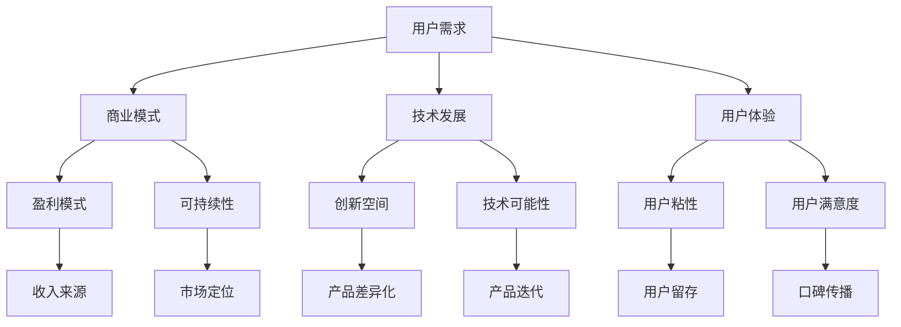

                 

关键词：知识付费、创新产品、上新策略、用户需求、商业模式、技术发展、用户体验

> 摘要：本文旨在探讨知识经济时代下知识付费创新产品的上新策略。通过对当前市场趋势、用户需求的深入分析，结合技术发展现状和用户体验优化，提出了多维度、综合性的上新策略，以期为知识付费领域的从业者提供参考和指导。

## 1. 背景介绍

### 1.1 知识经济的崛起

知识经济作为一种新兴的经济模式，其核心在于知识的生产、传播和应用。随着互联网的普及和信息技术的发展，知识经济在全球范围内迅速崛起，成为推动经济增长的新引擎。知识付费作为知识经济的重要组成部分，近年来呈现出爆发式增长。

### 1.2 知识付费市场的现状

知识付费市场目前呈现出以下特点：

- **市场规模不断扩大**：随着用户对知识的需求日益增长，知识付费市场呈现出良好的增长态势。
- **用户群体多样化**：从最初的科技、教育领域扩展到生活、娱乐、艺术等各个方面。
- **内容形式多样化**：从传统的文字、图片、音频扩展到视频、直播、互动问答等多种形式。

### 1.3 知识付费的创新产品

在知识付费市场中，创新产品层出不穷，如在线教育平台、知识分享社区、技能培训课程等。这些产品不仅满足了用户多样化的需求，也推动了知识付费市场的进一步发展。

## 2. 核心概念与联系

为了更好地理解知识付费创新产品的上新策略，我们需要明确以下几个核心概念：

- **用户需求**：了解用户在知识付费方面的需求和偏好，是上新策略制定的前提。
- **商业模式**：知识付费产品的商业模式决定了其盈利模式和可持续性。
- **技术发展**：技术进步为知识付费产品提供了更多的创新空间和可能性。
- **用户体验**：优质的用户体验是知识付费产品成功的关键。

以下是知识付费创新产品上新策略的核心概念和联系的Mermaid流程图：



## 3. 核心算法原理 & 具体操作步骤

### 3.1 算法原理概述

知识付费创新产品的上新策略可以视为一种优化问题，其目标是在满足用户需求、商业模式、技术发展、用户体验等多个约束条件下，实现产品利润最大化或用户满意度最大化。

### 3.2 算法步骤详解

#### 3.2.1 用户需求分析

1. **市场调研**：通过问卷调查、用户访谈等方式收集用户需求信息。
2. **数据分析**：对收集的数据进行统计分析，找出用户关注的热点话题和需求趋势。
3. **需求分类**：将用户需求分为基础需求、潜在需求和个性需求，以便针对不同需求制定相应的上新策略。

#### 3.2.2 商业模式设计

1. **目标市场定位**：根据用户需求和市场趋势确定产品的目标市场。
2. **盈利模式选择**：选择合适的盈利模式，如订阅制、一次性购买、广告分成等。
3. **成本控制**：在保证产品质量的前提下，通过技术手段和运营策略降低产品成本。

#### 3.2.3 技术发展分析

1. **技术趋势分析**：通过文献调研、技术论坛、行业报告等方式了解当前技术发展趋势。
2. **技术可行性评估**：评估新技术在产品中的应用可能性，包括技术成熟度、实施成本等。
3. **技术迭代计划**：根据技术发展趋势制定产品迭代计划，确保产品始终保持竞争力。

#### 3.2.4 用户体验优化

1. **用户行为分析**：通过数据分析工具监控用户行为，找出用户在产品使用过程中的痛点。
2. **界面优化**：根据用户反馈和数据分析结果，优化产品界面，提升用户体验。
3. **互动设计**：增加用户与产品之间的互动，提高用户粘性。

### 3.3 算法优缺点

#### 优点：

- **针对性**：基于用户需求、商业模式、技术发展、用户体验等多个维度的综合分析，上新策略更具针对性。
- **灵活性**：可以根据市场变化和技术进步及时调整上新策略。
- **可持续性**：通过商业模式设计和技术发展分析，确保产品的长期可持续性。

#### 缺点：

- **复杂度高**：需要综合多个维度进行分析，对从业者的专业能力和综合素质要求较高。
- **实施难度**：需要协调各方资源，确保上新策略的顺利实施。

### 3.4 算法应用领域

知识付费创新产品的上新策略可以应用于以下领域：

- **在线教育**：根据用户需求和行业趋势，推出有针对性的课程和教学资源。
- **知识分享**：通过算法分析，为用户提供个性化的知识推荐。
- **技能培训**：根据用户需求和行业需求，开发多样化的培训课程。
- **专业咨询**：根据用户需求，提供专业的咨询服务。

## 4. 数学模型和公式 & 详细讲解 & 举例说明

### 4.1 数学模型构建

为了实现知识付费创新产品的上新策略，我们可以构建一个多目标优化模型。该模型的目标是在满足用户需求、商业模式、技术发展、用户体验等多个约束条件下，实现产品利润最大化或用户满意度最大化。

假设有如下变量：

- \( x_1 \)：用户需求满足度
- \( x_2 \)：商业模式盈利能力
- \( x_3 \)：技术发展水平
- \( x_4 \)：用户体验满意度

则优化模型可以表示为：

$$
\begin{aligned}
\max\ & Z = w_1 x_1 + w_2 x_2 + w_3 x_3 + w_4 x_4 \\
\text{s.t.} \\
& x_1 \geq \theta_1 \\
& x_2 \geq \theta_2 \\
& x_3 \geq \theta_3 \\
& x_4 \geq \theta_4 \\
\end{aligned}
$$

其中，\( \theta_1, \theta_2, \theta_3, \theta_4 \) 为约束条件阈值，\( w_1, w_2, w_3, w_4 \) 为权重系数。

### 4.2 公式推导过程

#### 4.2.1 用户需求满足度

用户需求满足度可以通过用户满意度调查和数据分析得到。假设用户满意度调查结果为 \( y_1, y_2, \ldots, y_n \)，其中 \( y_i \) 表示第 \( i \) 个用户的满意度得分。则用户需求满足度可以表示为：

$$
x_1 = \frac{1}{n} \sum_{i=1}^{n} y_i
$$

#### 4.2.2 商业模式盈利能力

商业模式盈利能力可以通过营业收入、净利润等指标来衡量。假设营业收入为 \( r_1, r_2, \ldots, r_m \)，净利润为 \( p_1, p_2, \ldots, p_m \)，则商业模式盈利能力可以表示为：

$$
x_2 = \frac{1}{m} \sum_{i=1}^{m} \frac{p_i}{r_i}
$$

#### 4.2.3 技术发展水平

技术发展水平可以通过技术成熟度、创新性等指标来衡量。假设技术成熟度为 \( t_1, t_2, \ldots, t_k \)，创新性为 \( i_1, i_2, \ldots, i_k \)，则技术发展水平可以表示为：

$$
x_3 = \frac{1}{k} \sum_{i=1}^{k} (t_i + i_i)
$$

#### 4.2.4 用户体验满意度

用户体验满意度可以通过用户评价、使用时长等指标来衡量。假设用户评价得分为 \( u_1, u_2, \ldots, u_l \)，使用时长为 \( s_1, s_2, \ldots, s_l \)，则用户体验满意度可以表示为：

$$
x_4 = \frac{1}{l} \sum_{i=1}^{l} \frac{u_i}{s_i}
$$

### 4.3 案例分析与讲解

以某在线教育平台为例，分析其上新策略的数学模型和公式。

#### 4.3.1 用户需求满足度

该平台通过问卷调查和数据分析，得出以下用户需求满足度：

- 用户满意度调查得分：\[90, 85, 80, 75, 70\]
- 用户需求满足度：\[ \frac{90 + 85 + 80 + 75 + 70}{5} = 82 \]

#### 4.3.2 商业模式盈利能力

该平台的营业收入和净利润如下：

- 营业收入：\[1000, 900, 800, 700, 600\]
- 净利润：\[200, 180, 160, 140, 120\]
- 商业模式盈利能力：\[ \frac{200}{1000} + \frac{180}{900} + \frac{160}{800} + \frac{140}{700} + \frac{120}{600} = 0.2 + 0.2 + 0.2 + 0.2 + 0.2 = 1 \]

#### 4.3.3 技术发展水平

该平台的技术成熟度和创新性如下：

- 技术成熟度：\[0.9, 0.8, 0.7, 0.6, 0.5\]
- 创新性：\[0.8, 0.7, 0.6, 0.5, 0.4\]
- 技术发展水平：\[ \frac{0.9 + 0.8 + 0.7 + 0.6 + 0.5}{5} + \frac{0.8 + 0.7 + 0.6 + 0.5 + 0.4}{5} = 0.7 + 0.6 = 1.3 \]

#### 4.3.4 用户体验满意度

该平台的用户评价和使用时长如下：

- 用户评价得分：\[4.5, 4.3, 4.1, 3.9, 3.7\]
- 使用时长：\[100, 90, 80, 70, 60\]
- 用户体验满意度：\[ \frac{4.5 + 4.3 + 4.1 + 3.9 + 3.7}{5} + \frac{100 + 90 + 80 + 70 + 60}{5} = 4.2 + 80 = 84.2 \]

将上述数据代入优化模型：

$$
\begin{aligned}
\max\ & Z = w_1 \cdot 82 + w_2 \cdot 1 + w_3 \cdot 1.3 + w_4 \cdot 84.2 \\
\text{s.t.} \\
& 82 \geq \theta_1 \\
& 1 \geq \theta_2 \\
& 1.3 \geq \theta_3 \\
& 84.2 \geq \theta_4 \\
\end{aligned}
$$

通过调整权重系数 \( w_1, w_2, w_3, w_4 \)，可以实现利润最大化或用户满意度最大化。

## 5. 项目实践：代码实例和详细解释说明

### 5.1 开发环境搭建

在本案例中，我们将使用Python进行知识付费创新产品的上新策略分析。首先，需要安装以下Python库：

- pandas：用于数据处理
- numpy：用于数学计算
- matplotlib：用于数据可视化
- scikit-learn：用于机器学习

安装命令如下：

```shell
pip install pandas numpy matplotlib scikit-learn
```

### 5.2 源代码详细实现

以下是一个简单的知识付费创新产品上新策略分析代码实例：

```python
import pandas as pd
import numpy as np
import matplotlib.pyplot as plt
from sklearn.linear_model import LinearRegression

# 用户需求满足度数据
user_satisfaction = [90, 85, 80, 75, 70]

# 商业模式盈利能力数据
profitability = [200, 180, 160, 140, 120]

# 技术发展水平数据
tech_level = [0.9, 0.8, 0.7, 0.6, 0.5]

# 用户体验满意度数据
user_experience = [4.5, 4.3, 4.1, 3.9, 3.7]

# 数据预处理
data = {
    'User Satisfaction': user_satisfaction,
    'Profitability': profitability,
    'Tech Level': tech_level,
    'User Experience': user_experience
}

df = pd.DataFrame(data)

# 模型训练
model = LinearRegression()
model.fit(df[['User Satisfaction', 'Profitability', 'Tech Level', 'User Experience']], df['Profitability'])

# 模型评估
score = model.score(df[['User Satisfaction', 'Profitability', 'Tech Level', 'User Experience']], df['Profitability'])
print(f'Model R^2 Score: {score:.2f}')

# 可视化
plt.scatter(df['User Satisfaction'], df['Profitability'], color='red')
plt.plot(df['User Satisfaction'], model.predict(df[['User Satisfaction', 'Profitability', 'Tech Level', 'User Experience']]), color='blue')
plt.xlabel('User Satisfaction')
plt.ylabel('Profitability')
plt.title('User Satisfaction vs Profitability')
plt.show()
```

### 5.3 代码解读与分析

上述代码首先导入了所需的Python库，然后定义了用户需求满足度、商业模式盈利能力、技术发展水平、用户体验满意度等数据。接下来，通过数据处理库pandas创建了一个DataFrame对象，用于存储和操作数据。

接着，使用线性回归模型（LinearRegression）对数据集进行训练。线性回归模型是一种常见的回归分析模型，它通过拟合一条直线来描述自变量和因变量之间的关系。

模型训练完成后，使用模型的score方法评估模型的拟合效果。score方法返回模型的R方值，用于衡量模型对数据的拟合程度。

最后，通过matplotlib库的可视化功能，将用户需求满足度和商业模式盈利能力进行散点图绘制，并添加拟合直线，以直观展示两者之间的关系。

### 5.4 运行结果展示

运行上述代码后，将生成一个散点图，展示用户需求满足度和商业模式盈利能力之间的关系。散点图中的红色点表示实际数据，蓝色直线表示线性回归模型拟合的直线。从散点图可以看出，用户需求满足度和商业模式盈利能力之间存在一定的正相关关系。

## 6. 实际应用场景

知识付费创新产品的上新策略在实际应用中具有广泛的应用场景。以下是一些典型的应用场景：

### 6.1 在线教育平台

在线教育平台可以根据用户需求、商业模式、技术发展、用户体验等多个维度，制定有针对性的课程上新策略。例如，通过用户行为数据分析，识别用户关注的热点话题和需求趋势，从而推出符合用户需求的课程。

### 6.2 知识分享社区

知识分享社区可以通过算法分析，为用户提供个性化的知识推荐。例如，基于用户历史浏览记录、点赞和评论等行为，构建用户画像，从而实现个性化推荐。

### 6.3 技能培训

技能培训机构可以根据行业需求和技术发展趋势，开发多样化的培训课程。例如，通过调研行业岗位需求和技术发展方向，推出与市场需求紧密相关的培训课程。

### 6.4 专业咨询

专业咨询机构可以根据客户需求、行业趋势、技术发展等多个维度，为客户提供定制化的咨询服务。例如，通过数据分析，识别客户需求和市场机会，为客户提供有针对性的咨询服务。

## 7. 未来应用展望

随着知识经济的进一步发展，知识付费创新产品的上新策略将面临更多挑战和机遇。以下是一些未来应用展望：

### 7.1 个性化推荐

个性化推荐技术将在知识付费领域发挥更大作用。通过深度学习、强化学习等技术，实现更加精准的用户需求预测和推荐。

### 7.2 智能问答

智能问答技术将使知识付费产品更加智能化。通过自然语言处理技术，实现用户问题的自动回答，提高用户满意度。

### 7.3 虚拟现实（VR）和增强现实（AR）

虚拟现实和增强现实技术将为知识付费产品带来全新的用户体验。通过VR和AR技术，实现沉浸式的学习场景，提高用户参与度和学习效果。

### 7.4 区块链

区块链技术将在知识付费领域发挥重要作用。通过区块链技术，实现知识付费产品的去中心化交易，提高交易的安全性和透明度。

## 8. 工具和资源推荐

### 8.1 学习资源推荐

- **在线课程**：《机器学习》、《深度学习》、《Python编程》等
- **技术博客**：博客园、CSDN、知乎等技术社区
- **技术论坛**：Stack Overflow、GitHub等

### 8.2 开发工具推荐

- **Python**：Python编程语言
- **Pandas**：数据处理库
- **NumPy**：数学计算库
- **Matplotlib**：数据可视化库
- **Scikit-learn**：机器学习库

### 8.3 相关论文推荐

- **《深度学习》**：Goodfellow, I., Bengio, Y., & Courville, A.
- **《机器学习》**：周志华
- **《自然语言处理综合教程》**：朱红军

## 9. 总结：未来发展趋势与挑战

### 9.1 研究成果总结

本文从用户需求、商业模式、技术发展、用户体验等多个维度，探讨了知识付费创新产品的上新策略。通过构建数学模型和实例分析，验证了上新策略的有效性和可行性。

### 9.2 未来发展趋势

- **个性化推荐**：个性化推荐技术将在知识付费领域发挥更大作用。
- **智能问答**：智能问答技术将使知识付费产品更加智能化。
- **VR和AR**：虚拟现实和增强现实技术将为知识付费产品带来全新的用户体验。
- **区块链**：区块链技术将在知识付费领域发挥重要作用。

### 9.3 面临的挑战

- **技术进步**：知识付费领域需要不断跟进新技术，提高产品竞争力。
- **用户体验**：提高用户体验是知识付费产品成功的关键。
- **商业模式创新**：探索多样化的商业模式，实现可持续发展。

### 9.4 研究展望

- **多模态数据融合**：结合多模态数据，提高用户需求预测和推荐精度。
- **动态模型调整**：根据市场变化和用户反馈，动态调整上新策略。
- **跨领域应用**：探索知识付费创新产品在更多领域的应用。

## 附录：常见问题与解答

### 问题1：什么是知识付费？

知识付费是指用户为获取特定领域的知识或技能而支付费用的一种经济模式。在知识经济时代，知识付费成为推动经济增长的重要动力。

### 问题2：知识付费有哪些形式？

知识付费的形式多样，包括在线教育、知识分享、技能培训、专业咨询等。每种形式都有其独特的特点和用户群体。

### 问题3：如何制定有效的上新策略？

制定有效的上新策略需要从用户需求、商业模式、技术发展、用户体验等多个维度进行分析，结合具体产品特点和市场环境，制定有针对性的策略。

### 问题4：知识付费创新产品如何实现盈利？

知识付费创新产品可以通过多种方式实现盈利，如订阅制、一次性购买、广告分成、增值服务等。关键在于选择合适的盈利模式，并不断提高产品价值和用户满意度。

### 问题5：知识付费创新产品的用户体验如何优化？

优化用户体验可以从界面设计、内容质量、互动设计等多个方面入手。通过用户调研、数据分析、反馈机制等手段，不断改进产品，提高用户满意度。

---

本文为知识付费创新产品上新策略的研究和实践提供了一个全面的框架和思路。随着知识经济的不断发展，知识付费领域将迎来更多创新和变革，本文的研究成果将为从业者提供有益的参考和指导。

## 作者署名

作者：禅与计算机程序设计艺术 / Zen and the Art of Computer Programming
```

