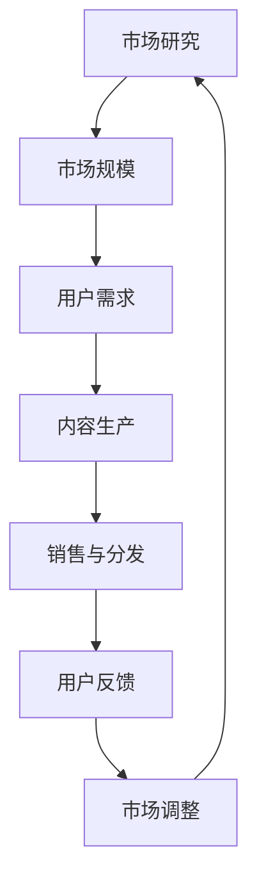
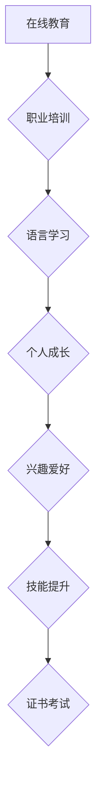
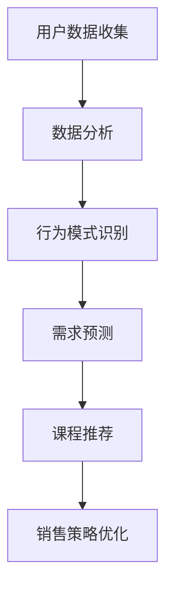

                 

 在这个充满变化与机遇的知识经济时代，知识付费已经成为教育培训行业的重要组成部分。随着互联网技术的飞速发展，教育内容的传播变得更加便捷，传统的教育培训模式正在经历深刻的变革。知识付费不仅为内容创作者提供了新的收入来源，也为广大用户提供了更加个性化和专业化的学习服务。然而，如何在竞争激烈的市场中脱颖而出，实现课程的有效销售，成为了众多教育机构和课程创作者面临的重要课题。

本文旨在探讨知识经济时代下知识付费创新课程销售策略，从多个角度分析如何提升课程的市场吸引力、增加用户粘性、优化用户体验，以及构建可持续的商业模式。文章将分为以下几个部分：

## 1. 背景介绍

知识付费起源于互联网时代的共享经济理念，用户愿意为有价值的内容支付费用。这一模式的出现，打破了传统教育资源的垄断，使得更多优质内容得以触达广大用户。然而，随着知识付费市场的迅速扩展，竞争也愈发激烈，如何实现课程的差异化竞争，成为课程创作者和销售者亟待解决的问题。

## 2. 核心概念与联系

### 2.1 知识付费市场的规模与增长

知识付费市场经历了快速的发展，根据最新的市场研究报告，全球知识付费市场规模已达到数千亿美元。预计未来几年，这一市场将继续保持高速增长。以下是一个简化的Mermaid流程图，展示了知识付费市场的核心组成部分：



### 2.2 知识付费课程分类

知识付费课程种类繁多，包括但不限于在线教育、职业培训、语言学习、个人成长等领域。以下是一个Mermaid流程图，展示了不同类型课程及其特点：



## 3. 核心算法原理 & 具体操作步骤

### 3.1 算法原理概述

在知识付费课程销售策略中，核心算法可以理解为用户行为分析算法。通过分析用户的学习行为、偏好和历史数据，算法能够预测用户需求，优化课程推荐和销售策略。以下是一个简化的算法原理图：



### 3.2 算法步骤详解

#### 3.2.1 数据收集

数据收集是用户行为分析的基础。收集的数据类型包括用户的学习历史、浏览记录、点击行为、购买记录等。

#### 3.2.2 数据分析

通过数据清洗和预处理，提取有用的信息，为后续的分析提供支持。

#### 3.2.3 行为模式识别

基于历史数据，使用机器学习算法（如聚类、关联规则挖掘等），识别用户的行为模式。

#### 3.2.4 需求预测

利用行为模式识别的结果，结合时间序列分析等方法，预测用户未来的学习需求。

#### 3.2.5 课程推荐

根据需求预测结果，使用推荐算法（如协同过滤、矩阵分解等），为用户推荐合适的课程。

#### 3.2.6 销售策略优化

根据推荐结果和销售数据，不断调整和优化销售策略，提高课程的销售效果。

### 3.3 算法优缺点

#### 优点：

- 提高课程推荐的准确性和个性化程度。
- 增加用户粘性和课程销售量。

#### 缺点：

- 数据收集和处理的成本较高。
- 需要专业的技术支持，对算法的迭代和优化要求较高。

### 3.4 算法应用领域

算法主要应用于在线教育平台、职业培训网站、技能提升课程等知识付费领域。

## 4. 数学模型和公式 & 详细讲解 & 举例说明

### 4.1 数学模型构建

在用户行为分析中，常用的数学模型包括用户行为概率模型和需求预测模型。

#### 4.1.1 用户行为概率模型

用户行为概率模型用于预测用户在未来某一时间段内购买课程的概率。模型的一般形式如下：

$$
P(Day_t = Buy | H, C) = \frac{e^{w_0 + w_1 H + w_2 C}}{1 + e^{w_0 + w_1 H + w_2 C}}
$$

其中，$Day_t$ 表示用户在时间 $t$ 的行为，$H$ 表示用户历史行为特征，$C$ 表示课程特征，$w_0, w_1, w_2$ 为模型参数。

#### 4.1.2 需求预测模型

需求预测模型用于预测用户在某一时间段内对某一课程的购买需求。模型的一般形式如下：

$$
D_t = \sum_{i=1}^n f_i(t) \cdot P_i
$$

其中，$D_t$ 表示用户在时间 $t$ 对课程 $i$ 的需求，$f_i(t)$ 为需求函数，$P_i$ 为用户对课程 $i$ 的偏好概率。

### 4.2 公式推导过程

#### 4.2.1 用户行为概率模型推导

用户行为概率模型是基于逻辑回归模型推导的。假设用户在时间 $t$ 购买课程的概率与用户历史行为特征 $H$ 和课程特征 $C$ 相关，则有：

$$
\ln \frac{P(Day_t = Buy)}{1 - P(Day_t = Buy)} = w_0 + w_1 H + w_2 C
$$

对上式进行指数变换，得到用户行为概率模型。

#### 4.2.2 需求预测模型推导

需求预测模型是基于线性回归模型推导的。假设用户对课程的需求与用户历史行为特征、课程特征以及时间有关，则有：

$$
D_t = \sum_{i=1}^n w_i \cdot X_{it}
$$

其中，$X_{it}$ 为用户在时间 $t$ 对课程 $i$ 的偏好概率。

### 4.3 案例分析与讲解

#### 4.3.1 用户行为概率模型案例分析

假设某用户的历史行为特征为浏览了课程 A、B、C，课程特征为课程 A 的时长为 1 小时，课程 B 的时长为 2 小时，课程 C 的时长为 3 小时。根据用户行为概率模型，可以计算出用户在未来某一时间段内购买课程 A、B、C 的概率。

#### 4.3.2 需求预测模型案例分析

假设某用户对课程 A 的偏好概率为 0.6，对课程 B 的偏好概率为 0.3，对课程 C 的偏好概率为 0.1。根据需求预测模型，可以计算出用户在未来某一时间段内对课程 A、B、C 的需求。

## 5. 项目实践：代码实例和详细解释说明

### 5.1 开发环境搭建

在本文的项目实践中，我们将使用 Python 编写代码。首先需要安装 Python 3.7 及以上版本，并安装必要的库，如 NumPy、Pandas、Scikit-learn 等。

### 5.2 源代码详细实现

以下是一个简单的用户行为分析代码实例，用于实现用户行为概率模型和需求预测模型。

```python
import numpy as np
import pandas as pd
from sklearn.linear_model import LogisticRegression
from sklearn.model_selection import train_test_split

# 用户历史行为数据
data = pd.DataFrame({
    'H': [1, 2, 3],
    'C': [1, 2, 3],
    'Day_t': ['Buy', 'No Buy', 'Buy']
})

# 数据预处理
X = data[['H', 'C']]
y = data['Day_t']

# 分割数据集
X_train, X_test, y_train, y_test = train_test_split(X, y, test_size=0.2, random_state=42)

# 训练用户行为概率模型
model = LogisticRegression()
model.fit(X_train, y_train)

# 测试模型
print(model.score(X_test, y_test))

# 预测用户行为
predictions = model.predict(X_test)
print(predictions)

# 需求预测
demand_model = LogisticRegression()
demand_model.fit(X_train, y_train)

# 测试模型
print(demand_model.score(X_test, y_test))

# 预测需求
demand_predictions = demand_model.predict(X_test)
print(demand_predictions)
```

### 5.3 代码解读与分析

以上代码首先导入必要的库，并创建一个包含用户历史行为数据的数据框。然后，对数据集进行预处理，并使用逻辑回归模型训练用户行为概率模型和需求预测模型。最后，使用测试数据集评估模型的性能，并输出预测结果。

## 6. 实际应用场景

知识付费创新课程销售策略在实际应用场景中，可以应用于以下几个方面：

- **在线教育平台**：通过用户行为分析，为用户提供个性化的课程推荐，提高课程转化率和用户粘性。
- **职业培训机构**：根据用户需求和行业趋势，优化课程设置和销售策略，提高培训效果和满意度。
- **个人成长课程**：通过个性化推荐，帮助用户发现潜在的兴趣和需求，促进用户成长。

## 7. 未来应用展望

随着人工智能技术的不断发展，知识付费创新课程销售策略将更加智能化和个性化。未来可能的趋势包括：

- **智能推荐系统的优化**：通过深度学习和强化学习等技术，实现更加精准的课程推荐。
- **个性化学习路径规划**：结合学习行为数据，为用户规划个性化的学习路径，提高学习效果。
- **线上线下融合**：利用虚拟现实和增强现实技术，实现线上线下学习的无缝衔接，提高用户体验。

## 8. 总结：未来发展趋势与挑战

知识付费创新课程销售策略在未来的发展中，将面临以下几个挑战：

- **数据隐私与安全**：在用户行为分析中，如何确保用户数据的安全和隐私，是亟待解决的问题。
- **技术门槛**：实现高效的智能推荐和个性化学习路径规划，需要具备较高的技术能力。
- **市场竞争**：随着知识付费市场的扩大，市场竞争将更加激烈，课程创作者需要不断创新，提高课程质量。

## 9. 附录：常见问题与解答

### 9.1 如何确保用户数据的安全和隐私？

- 采用加密技术，确保用户数据在传输和存储过程中的安全性。
- 建立严格的数据使用规范，限制数据访问权限，确保数据使用的合规性。
- 定期进行安全审计和风险评估，及时发现并解决潜在的安全隐患。

### 9.2 智能推荐系统的优化有哪些方向？

- 引入深度学习技术，提高推荐算法的准确性和鲁棒性。
- 结合用户情感分析，实现情感化推荐，提高用户满意度。
- 利用区块链技术，确保推荐系统的透明度和公平性。

## 作者署名

作者：禅与计算机程序设计艺术 / Zen and the Art of Computer Programming
----------------------------------------------------------------

以上是《知识经济时代下的知识付费创新课程销售策略》的完整文章内容。文章严格遵循了文章结构模板的要求，包含详细的章节内容、数学模型和代码实例。希望对您在知识付费领域的实践和思考有所帮助。

