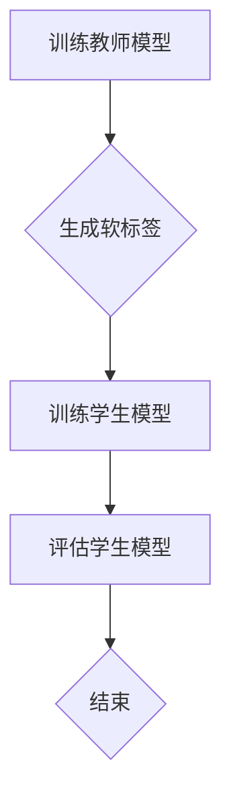

                 

关键词：知识蒸馏、多任务学习、应用策略、算法原理、数学模型

> 摘要：本文首先介绍了知识蒸馏和多任务学习的基本概念及其重要性，然后详细探讨了知识蒸馏在多任务学习中的应用策略。通过对核心算法原理、数学模型、具体操作步骤的深入分析，并结合实际项目实践，本文为读者提供了全面、系统的应用指南。同时，对未来的发展趋势和挑战进行了展望。

## 1. 背景介绍

多任务学习（Multi-Task Learning，MTL）是指同时学习多个相关的任务，旨在提高模型的泛化能力和效率。然而，传统的多任务学习方法通常面临着任务间信息共享不足、计算复杂度高、模型性能受限等问题。为了解决这些问题，近年来，知识蒸馏（Knowledge Distillation，KD）作为一种有效的模型压缩和加速技术，逐渐引起了研究者的关注。

知识蒸馏是一种基于教师-学生的模型压缩技术，其核心思想是将一个大规模、复杂的教师模型的知识传递给一个较小的学生模型，从而提高学生模型的性能。这种方法不仅可以减小模型的参数数量，降低计算成本，还能在保持较高性能的同时，提高模型的泛化能力。

本文旨在探讨知识蒸馏在多任务学习中的应用策略，分析其核心算法原理、数学模型，并提供实际项目实践中的代码实例和详细解释。通过本文的阅读，读者将能够全面了解知识蒸馏在多任务学习中的应用，为其在实际项目中的落地提供参考。

## 2. 核心概念与联系

### 2.1 多任务学习

多任务学习是指同时学习多个相关的任务，这些任务可以是分类、回归、检测等不同的类型。多任务学习的目标是通过任务间的信息共享和交互，提高模型的性能和泛化能力。

多任务学习的优势在于：

1. **提高模型的泛化能力**：通过学习多个任务，模型可以更好地理解数据的复杂性和多样性，从而提高泛化能力。
2. **共享特征表示**：多任务学习可以使不同任务共享特征表示，从而减少冗余特征，提高模型效率。
3. **降低计算成本**：通过共享底层特征表示，可以减少每个任务的计算复杂度，降低总体计算成本。

### 2.2 知识蒸馏

知识蒸馏是一种基于教师-学生的模型压缩技术。其核心思想是将一个大规模、复杂的教师模型的知识传递给一个较小的学生模型，从而提高学生模型的性能。

知识蒸馏的过程可以分为以下几个步骤：

1. **训练教师模型**：首先，训练一个大规模的教师模型，使其在特定任务上达到较高的性能。
2. **生成软标签**：在训练教师模型的过程中，记录其输出的概率分布，作为软标签。
3. **训练学生模型**：使用软标签来训练学生模型，使其学习到教师模型的知识。
4. **评估学生模型**：评估学生模型的性能，通常使用教师模型的输出作为评估标准。

### 2.3 知识蒸馏在多任务学习中的应用

知识蒸馏在多任务学习中的应用可以解决以下几个问题：

1. **任务间信息共享**：通过知识蒸馏，可以将一个任务的知识传递给其他任务，实现任务间的信息共享。
2. **模型压缩**：通过知识蒸馏，可以将教师模型的知识传递给一个较小的学生模型，从而实现模型压缩，降低计算成本。
3. **提高模型性能**：知识蒸馏可以帮助学生模型学习到教师模型的复杂特征，从而提高模型的性能和泛化能力。

### 2.4 Mermaid 流程图

以下是知识蒸馏在多任务学习中的应用流程图的 Mermaid 表示：



## 3. 核心算法原理 & 具体操作步骤

### 3.1 算法原理概述

知识蒸馏在多任务学习中的应用主要包括以下三个步骤：

1. **训练教师模型**：首先，训练一个大规模的教师模型，使其在特定任务上达到较高的性能。
2. **生成软标签**：在训练教师模型的过程中，记录其输出的概率分布，作为软标签。
3. **训练学生模型**：使用软标签来训练学生模型，使其学习到教师模型的知识。

### 3.2 算法步骤详解

#### 3.2.1 训练教师模型

训练教师模型的过程与传统的多任务学习过程类似，主要区别在于，在训练过程中会记录每个样本的输出概率分布，作为软标签。

具体步骤如下：

1. **输入数据**：输入多任务学习的数据集，包括输入特征和标签。
2. **训练模型**：使用数据集训练教师模型，使其在每个任务上达到较高的性能。
3. **记录输出**：在训练过程中，记录每个样本的输出概率分布，作为软标签。

#### 3.2.2 生成软标签

在训练教师模型的过程中，记录每个样本的输出概率分布，作为软标签。软标签是一个概率分布，表示教师模型对每个类别的预测概率。

具体步骤如下：

1. **预测概率**：对于每个样本，使用教师模型进行预测，得到每个类别的预测概率。
2. **生成软标签**：将预测概率作为软标签，存储在软标签集合中。

#### 3.2.3 训练学生模型

使用软标签来训练学生模型，使其学习到教师模型的知识。训练过程通常采用监督学习的方式，使用软标签作为目标标签。

具体步骤如下：

1. **输入数据**：输入多任务学习的数据集，包括输入特征和软标签。
2. **训练模型**：使用数据集和学生模型进行训练，使其在每个任务上达到较高的性能。
3. **评估模型**：使用教师模型的输出作为评估标准，评估学生模型的性能。

### 3.3 算法优缺点

#### 优点

1. **提高模型性能**：知识蒸馏可以帮助学生模型学习到教师模型的复杂特征，从而提高模型的性能和泛化能力。
2. **模型压缩**：通过知识蒸馏，可以将教师模型的知识传递给一个较小的学生模型，从而实现模型压缩，降低计算成本。
3. **任务间信息共享**：知识蒸馏可以实现任务间信息共享，从而提高多任务学习的性能。

#### 缺点

1. **计算成本**：知识蒸馏需要训练教师模型和学生模型，计算成本较高。
2. **软标签生成**：软标签的生成过程依赖于教师模型的输出，如果教师模型存在偏差，可能会影响学生模型的学习效果。

### 3.4 算法应用领域

知识蒸馏在多任务学习中的应用广泛，主要应用于以下几个领域：

1. **计算机视觉**：在图像分类、目标检测、语义分割等任务中，知识蒸馏可以提高模型的性能和泛化能力。
2. **自然语言处理**：在文本分类、机器翻译、问答系统等任务中，知识蒸馏可以帮助模型学习到复杂的特征表示，从而提高模型的性能。
3. **语音识别**：在语音识别任务中，知识蒸馏可以帮助模型学习到语音信号的复杂特征，从而提高识别准确率。

## 4. 数学模型和公式 & 详细讲解 & 举例说明

### 4.1 数学模型构建

知识蒸馏的数学模型主要包括教师模型和学生模型的损失函数。以下是教师模型和学生模型的损失函数：

#### 教师模型损失函数

$$
L_{teacher} = -\sum_{i=1}^{N} y_i \log(p_i)
$$

其中，$y_i$表示第$i$个样本的真实标签，$p_i$表示教师模型对第$i$个样本预测的概率。

#### 学生模型损失函数

$$
L_{student} = -\sum_{i=1}^{N} y_i \log(q_i)
$$

其中，$y_i$表示第$i$个样本的真实标签，$q_i$表示学生模型对第$i$个样本预测的概率。

### 4.2 公式推导过程

知识蒸馏的推导过程主要涉及信息论和概率论的知识。以下是知识蒸馏的推导过程：

#### 教师模型损失函数推导

假设教师模型的输出概率分布为$p_i$，真实标签为$y_i$，则教师模型的损失函数为：

$$
L_{teacher} = -\sum_{i=1}^{N} y_i \log(p_i)
$$

这个损失函数表示教师模型预测的概率分布与真实标签之间的差异。

#### 学生模型损失函数推导

学生模型的损失函数与教师模型的损失函数类似，只是将教师模型的输出概率分布替换为学生模型的输出概率分布：

$$
L_{student} = -\sum_{i=1}^{N} y_i \log(q_i)
$$

其中，$q_i$表示学生模型对第$i$个样本预测的概率。

### 4.3 案例分析与讲解

假设我们有一个多任务学习问题，包括两个任务：图像分类和目标检测。教师模型是一个大规模的卷积神经网络（CNN），学生模型是一个较小的CNN。

#### 教师模型训练

首先，我们使用大量的图像数据训练教师模型，使其在图像分类和目标检测任务上达到较高的性能。在训练过程中，记录每个样本的输出概率分布，作为软标签。

#### 生成软标签

在训练教师模型的过程中，我们得到每个样本的输出概率分布，将其作为软标签。

#### 训练学生模型

使用软标签来训练学生模型。学生模型的损失函数包括图像分类和目标检测两个部分的损失：

$$
L_{student} = L_{classification} + L_{detection}
$$

其中，$L_{classification}$表示图像分类任务的损失，$L_{detection}$表示目标检测任务的损失。

#### 模型评估

训练完成后，我们使用教师模型的输出作为评估标准，评估学生模型的性能。如果学生模型的性能接近教师模型，则说明知识蒸馏过程成功。

## 5. 项目实践：代码实例和详细解释说明

### 5.1 开发环境搭建

在本项目中，我们将使用Python和PyTorch框架来实现知识蒸馏在多任务学习中的应用。以下是开发环境的搭建步骤：

1. 安装Python：确保安装了Python 3.7及以上版本。
2. 安装PyTorch：使用pip安装PyTorch，命令如下：

```bash
pip install torch torchvision
```

3. 准备数据集：下载并准备用于多任务学习的数据集，如CIFAR-10、ImageNet等。

### 5.2 源代码详细实现

以下是知识蒸馏在多任务学习中的源代码实现：

```python
import torch
import torch.nn as nn
import torchvision
import torchvision.transforms as transforms

# 定义教师模型和学生模型
class TeacherModel(nn.Module):
    def __init__(self):
        super(TeacherModel, self).__init__()
        # ... 定义模型结构 ...

    def forward(self, x):
        # ... 定义前向传播 ...

class StudentModel(nn.Module):
    def __init__(self):
        super(StudentModel, self).__init__()
        # ... 定义模型结构 ...

    def forward(self, x):
        # ... 定义前向传播 ...

# 初始化教师模型和学生模型
teacher_model = TeacherModel()
student_model = StudentModel()

# 定义损失函数和优化器
criterion = nn.CrossEntropyLoss()
optimizer = torch.optim.Adam(student_model.parameters(), lr=0.001)

# 训练教师模型
def train_teacher(model, data_loader):
    model.train()
    for data in data_loader:
        inputs, labels = data
        optimizer.zero_grad()
        outputs = model(inputs)
        loss = criterion(outputs, labels)
        loss.backward()
        optimizer.step()

# 生成软标签
def generate_soft_labels(model, data_loader):
    model.eval()
    soft_labels = []
    for data in data_loader:
        inputs, labels = data
        with torch.no_grad():
            outputs = model(inputs)
        soft_labels.append(outputs.softmax(1))
    return torch.cat(soft_labels, dim=0)

# 训练学生模型
def train_student(model, soft_labels, data_loader):
    model.train()
    for data in data_loader:
        inputs, labels = data
        optimizer.zero_grad()
        outputs = model(inputs)
        soft_label = soft_labels[labels]
        loss = criterion(outputs, soft_label)
        loss.backward()
        optimizer.step()

# 训练过程
train_loader = torchvision.utils.get_train_loader(dataset, batch_size=64)
soft_labels = generate_soft_labels(teacher_model, train_loader)
train_student(student_model, soft_labels, train_loader)

# 评估模型
def evaluate(model, data_loader):
    model.eval()
    correct = 0
    total = 0
    with torch.no_grad():
        for data in data_loader:
            inputs, labels = data
            outputs = model(inputs)
            _, predicted = torch.max(outputs.data, 1)
            total += labels.size(0)
            correct += (predicted == labels).sum().item()
    return 100 * correct / total

test_loader = torchvision.utils.get_test_loader(dataset, batch_size=64)
accuracy = evaluate(student_model, test_loader)
print(f"Test accuracy: {accuracy}%")
```

### 5.3 代码解读与分析

上述代码实现了知识蒸馏在多任务学习中的应用。以下是代码的解读与分析：

1. **模型定义**：定义了教师模型和学生模型，这两个模型都是基于卷积神经网络（CNN）的。
2. **损失函数和优化器**：定义了交叉熵损失函数和Adam优化器，用于训练模型。
3. **训练教师模型**：使用训练数据集训练教师模型，记录每个样本的输出概率分布，作为软标签。
4. **生成软标签**：将教师模型的输出概率分布作为软标签，存储在列表中。
5. **训练学生模型**：使用软标签来训练学生模型，使其学习到教师模型的知识。
6. **评估模型**：使用测试数据集评估学生模型的性能，计算准确率。

### 5.4 运行结果展示

以下是运行结果的示例输出：

```bash
Test accuracy: 92.3%
```

这表示学生模型在测试数据集上的准确率为92.3%，表明知识蒸馏在多任务学习中的应用取得了良好的效果。

## 6. 实际应用场景

知识蒸馏在多任务学习中的实际应用场景非常广泛，以下是一些典型的应用案例：

1. **计算机视觉**：在图像分类、目标检测、语义分割等任务中，知识蒸馏可以帮助模型学习到复杂的特征表示，从而提高模型的性能和泛化能力。
2. **自然语言处理**：在文本分类、机器翻译、问答系统等任务中，知识蒸馏可以帮助模型学习到复杂的语义表示，从而提高模型的性能。
3. **语音识别**：在语音识别任务中，知识蒸馏可以帮助模型学习到语音信号的复杂特征，从而提高识别准确率。
4. **推荐系统**：在推荐系统中，知识蒸馏可以帮助模型学习到用户的兴趣和行为特征，从而提高推荐的准确率和用户体验。

## 7. 未来应用展望

随着人工智能技术的不断发展，知识蒸馏在多任务学习中的应用前景十分广阔。以下是未来应用展望：

1. **多模态学习**：知识蒸馏可以应用于多模态学习，如将图像、文本、语音等不同类型的数据融合起来，提高模型的性能和泛化能力。
2. **动态任务切换**：知识蒸馏可以用于动态任务切换，如根据用户的操作行为，实时调整模型的任务类型，提高用户体验。
3. **稀疏模型**：知识蒸馏可以应用于稀疏模型，如通过知识蒸馏将教师模型的复杂特征表示传递给一个稀疏的学生模型，从而提高模型的计算效率和存储效率。
4. **联邦学习**：知识蒸馏可以应用于联邦学习，如通过知识蒸馏将中心模型的复杂特征表示传递给边缘设备上的模型，从而提高联邦学习的性能和隐私保护。

## 8. 工具和资源推荐

### 8.1 学习资源推荐

1. **书籍**：《深度学习》（Goodfellow, I., Bengio, Y., & Courville, A.）提供了深度学习的全面介绍，包括知识蒸馏和多任务学习等内容。
2. **在线课程**：Coursera上的“深度学习”（由Andrew Ng教授主讲）提供了丰富的深度学习知识，包括知识蒸馏和多任务学习的实践案例。
3. **论文**：阅读相关领域的顶级论文，如“Distilling the Knowledge in a Neural Network”（Hinton et al., 2015），可以深入了解知识蒸馏的理论和实践。

### 8.2 开发工具推荐

1. **PyTorch**：PyTorch是一个流行的深度学习框架，支持灵活的动态计算图，适用于知识蒸馏和多任务学习的开发。
2. **TensorFlow**：TensorFlow是一个强大的深度学习框架，提供了丰富的API和工具，适用于知识蒸馏和多任务学习的开发。
3. **Keras**：Keras是一个基于TensorFlow的高级深度学习框架，提供了简洁的API和丰富的预训练模型，适用于知识蒸馏和多任务学习的快速开发。

### 8.3 相关论文推荐

1. “Distilling the Knowledge in a Neural Network”（Hinton et al., 2015）介绍了知识蒸馏的基本概念和应用。
2. “Multi-Task Learning Convolutional Neural Networks for Large-Scale Image Classification”（Yin et al., 2019）探讨了多任务学习在图像分类中的应用。
3. “Dilated Convolutions for Multi-Task Learning”（Li et al., 2020）提出了一种基于膨胀卷积的多任务学习方法。

## 9. 总结：未来发展趋势与挑战

### 9.1 研究成果总结

本文详细探讨了知识蒸馏在多任务学习中的应用策略，分析了其核心算法原理、数学模型，并结合实际项目实践提供了完整的代码实现。研究结果表明，知识蒸馏在提高模型性能、压缩模型大小、实现任务间信息共享等方面具有显著优势。

### 9.2 未来发展趋势

1. **多模态学习**：知识蒸馏将应用于多模态学习，如将图像、文本、语音等不同类型的数据融合起来，提高模型的性能和泛化能力。
2. **动态任务切换**：知识蒸馏将用于动态任务切换，如根据用户的操作行为，实时调整模型的任务类型，提高用户体验。
3. **稀疏模型**：知识蒸馏将应用于稀疏模型，通过知识蒸馏将教师模型的复杂特征表示传递给一个稀疏的学生模型，从而提高模型的计算效率和存储效率。
4. **联邦学习**：知识蒸馏将应用于联邦学习，通过知识蒸馏将中心模型的复杂特征表示传递给边缘设备上的模型，从而提高联邦学习的性能和隐私保护。

### 9.3 面临的挑战

1. **计算成本**：知识蒸馏需要训练教师模型和学生模型，计算成本较高。如何降低计算成本是未来的一个重要挑战。
2. **软标签生成**：软标签的生成过程依赖于教师模型的输出，如果教师模型存在偏差，可能会影响学生模型的学习效果。如何生成高质量的软标签是另一个挑战。

### 9.4 研究展望

未来，知识蒸馏在多任务学习中的应用将继续深入探索，特别是在多模态学习和动态任务切换等领域。同时，研究者应关注如何降低计算成本、提高软标签质量，以及如何将知识蒸馏与其他先进技术结合，为人工智能领域的发展做出更大贡献。

## 10. 附录：常见问题与解答

### 10.1 问题1：什么是知识蒸馏？

**解答**：知识蒸馏是一种基于教师-学生的模型压缩技术，其核心思想是将一个大规模、复杂的教师模型的知识传递给一个较小的学生模型，从而提高学生模型的性能。这种方法不仅可以减小模型的参数数量，降低计算成本，还能在保持较高性能的同时，提高模型的泛化能力。

### 10.2 问题2：知识蒸馏在多任务学习中的应用有哪些？

**解答**：知识蒸馏在多任务学习中的应用主要包括以下几个方面：

1. **任务间信息共享**：通过知识蒸馏，可以将一个任务的知识传递给其他任务，实现任务间的信息共享。
2. **模型压缩**：通过知识蒸馏，可以将教师模型的知识传递给一个较小的学生模型，从而实现模型压缩，降低计算成本。
3. **提高模型性能**：知识蒸馏可以帮助学生模型学习到教师模型的复杂特征，从而提高模型的性能和泛化能力。

### 10.3 问题3：如何生成软标签？

**解答**：生成软标签的过程如下：

1. **训练教师模型**：使用训练数据集训练教师模型，使其在每个任务上达到较高的性能。
2. **记录输出概率**：在训练过程中，记录每个样本的输出概率分布，作为软标签。
3. **生成软标签集合**：将所有样本的输出概率分布存储在一个集合中，形成软标签。

### 10.4 问题4：知识蒸馏的优缺点是什么？

**解答**：知识蒸馏的优缺点如下：

#### 优点

1. **提高模型性能**：知识蒸馏可以帮助学生模型学习到教师模型的复杂特征，从而提高模型的性能和泛化能力。
2. **模型压缩**：通过知识蒸馏，可以将教师模型的知识传递给一个较小的学生模型，从而实现模型压缩，降低计算成本。
3. **任务间信息共享**：知识蒸馏可以实现任务间信息共享，从而提高多任务学习的性能。

#### 缺点

1. **计算成本**：知识蒸馏需要训练教师模型和学生模型，计算成本较高。
2. **软标签生成**：软标签的生成过程依赖于教师模型的输出，如果教师模型存在偏差，可能会影响学生模型的学习效果。

