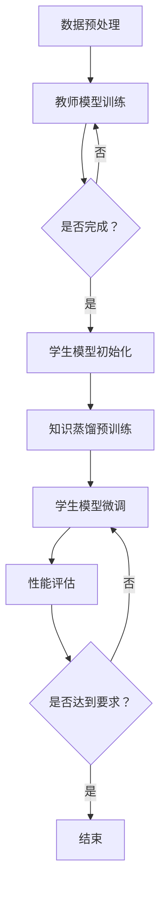

                 

关键词：知识蒸馏、多模态融合、深度学习、神经网络、创新

摘要：本文旨在探讨知识蒸馏技术在多模态融合任务中的创新应用。通过对知识蒸馏技术的基本概念、核心算法原理、数学模型及具体实现进行深入分析，本文进一步讨论了知识蒸馏在多模态融合任务中的优势和应用场景。最后，本文对知识蒸馏技术的未来发展趋势与挑战进行了展望。

## 1. 背景介绍

随着深度学习技术的快速发展，神经网络模型在图像识别、语音识别、自然语言处理等各个领域取得了显著的成果。然而，这些模型往往需要大量的数据和计算资源进行训练。为了解决这一问题，知识蒸馏技术应运而生。知识蒸馏是一种将大型模型（教师模型）的知识传递给小型模型（学生模型）的方法，从而使得学生模型能够高效地继承教师模型的能力。

多模态融合任务是指将多种类型的数据（如图像、文本、语音等）进行整合，以实现更准确和丰富的信息理解。随着人工智能技术的进步，多模态融合任务在医疗诊断、智能交互、自动驾驶等领域具有广泛的应用前景。

本文将重点探讨知识蒸馏技术在多模态融合任务中的创新应用，分析其优势和应用场景，并展望其未来发展趋势与挑战。

## 2. 核心概念与联系

### 2.1 知识蒸馏技术

知识蒸馏技术的基本思想是将一个大型的教师神经网络模型的知识传递给一个较小的学生神经网络模型。教师模型通常是一个高度参数化的复杂模型，具有较高的准确性，但计算和存储资源消耗巨大。学生模型则是一个轻量级的简化模型，具有较少的参数和计算资源需求。

知识蒸馏的过程可以分为两个阶段：预训练阶段和微调阶段。在预训练阶段，教师模型和学生模型共享相同的权重，学生模型通过学习教师模型的输出概率分布来获取知识。在微调阶段，学生模型在特定任务上进行微调，进一步优化其性能。

### 2.2 多模态融合任务

多模态融合任务是指将多种类型的数据进行整合，以实现更准确和丰富的信息理解。多模态数据可以包括图像、文本、语音、视频等。多模态融合的方法可以分为基于特征融合的方法和基于模型融合的方法。

基于特征融合的方法通过将不同模态的特征进行拼接、加权或拼接后进行卷积等操作，实现特征的融合。这种方法的主要优势在于可以充分利用不同模态数据的优势，但缺点是融合效果受限于特征表示的匹配度。

基于模型融合的方法通过将不同模态的神经网络模型进行级联或共享某些层，实现模型的融合。这种方法的主要优势在于可以充分利用不同模态模型的推理能力，但缺点是模型的复杂度和计算资源需求较高。

### 2.3 知识蒸馏在多模态融合任务中的应用

知识蒸馏技术在多模态融合任务中的应用主要包括以下两个方面：

1. **跨模态知识蒸馏**：将图像、文本、语音等不同模态的数据进行融合，通过知识蒸馏技术将教师模型（通常是一个具有较强跨模态融合能力的模型）的知识传递给学生模型，实现不同模态数据的有效融合。

2. **模型压缩与加速**：通过知识蒸馏技术将大型教师模型的知识传递给轻量级学生模型，实现模型的压缩与加速。在多模态融合任务中，大型教师模型可以具有更强的融合能力，但计算和存储资源消耗巨大。通过知识蒸馏，可以将教师模型的知识传递给学生模型，从而降低模型的复杂度和计算资源需求。

### 2.4 Mermaid 流程图

以下是一个描述知识蒸馏技术在多模态融合任务中的流程的 Mermaid 流程图：



## 3. 核心算法原理 & 具体操作步骤

### 3.1 算法原理概述

知识蒸馏技术在多模态融合任务中的核心算法原理主要包括以下三个方面：

1. **模型压缩与加速**：通过知识蒸馏技术将大型教师模型的知识传递给轻量级学生模型，实现模型的压缩与加速。

2. **跨模态知识传递**：将不同模态的数据进行融合，通过知识蒸馏技术将教师模型的知识传递给学生模型，实现不同模态数据的有效融合。

3. **任务优化**：通过知识蒸馏技术优化学生模型在特定任务上的性能，提高模型的准确性、效率和泛化能力。

### 3.2 算法步骤详解

1. **数据预处理**：对多模态数据进行预处理，包括图像、文本、语音等数据的清洗、归一化和特征提取。

2. **教师模型训练**：使用预处理的训练数据对大型教师模型进行训练，以获得具有较强的跨模态融合能力的模型。

3. **学生模型初始化**：使用预训练好的教师模型初始化轻量级学生模型。

4. **知识蒸馏预训练**：在知识蒸馏预训练阶段，教师模型和学生模型共享相同的权重，学生模型通过学习教师模型的输出概率分布来获取知识。

5. **学生模型微调**：在学生模型微调阶段，学生模型在特定任务上进行微调，以优化其在任务上的性能。

6. **性能评估**：评估学生模型在特定任务上的性能，包括准确性、效率和泛化能力。

7. **结束**：如果学生模型的性能达到要求，则算法结束。否则，继续进行知识蒸馏预训练和学生模型微调，直到性能满足要求。

### 3.3 算法优缺点

#### 优点

1. **模型压缩与加速**：知识蒸馏技术可以将大型教师模型的知识传递给轻量级学生模型，实现模型的压缩与加速，降低计算和存储资源的需求。

2. **跨模态知识传递**：知识蒸馏技术可以有效地将不同模态的数据进行融合，实现不同模态数据的有效融合。

3. **任务优化**：知识蒸馏技术可以优化学生模型在特定任务上的性能，提高模型的准确性、效率和泛化能力。

#### 缺点

1. **计算资源需求**：知识蒸馏技术需要对教师模型和学生模型进行多次训练，计算资源需求较大。

2. **参数调优**：知识蒸馏技术的参数调优比较复杂，需要根据具体任务进行优化。

### 3.4 算法应用领域

知识蒸馏技术在多模态融合任务中的应用领域非常广泛，主要包括以下方面：

1. **医疗诊断**：利用知识蒸馏技术可以将医学图像、文本和语音等数据融合，实现更准确的医学诊断。

2. **智能交互**：利用知识蒸馏技术可以将语音、文本和图像等数据融合，实现更智能的智能交互。

3. **自动驾驶**：利用知识蒸馏技术可以将自动驾驶中的图像、文本和语音等数据融合，实现更安全、准确的自动驾驶。

## 4. 数学模型和公式 & 详细讲解 & 举例说明

### 4.1 数学模型构建

知识蒸馏技术的数学模型主要包括损失函数、优化目标和性能评估指标。

#### 损失函数

知识蒸馏技术的损失函数通常采用交叉熵损失函数，表示为：

$$
L_{CE} = -\sum_{i=1}^{N} y_{i} \log(p_{i}),
$$

其中，$N$ 为样本数量，$y_{i}$ 为第 $i$ 个样本的真实标签，$p_{i}$ 为第 $i$ 个样本在教师模型上的预测概率。

#### 优化目标

知识蒸馏技术的优化目标为最小化交叉熵损失函数：

$$
\min_{\theta_{S}} L_{CE},
$$

其中，$\theta_{S}$ 为学生模型的参数。

#### 性能评估指标

知识蒸馏技术的性能评估指标通常采用准确率、召回率和F1值等指标。

### 4.2 公式推导过程

#### 跨模态知识蒸馏

在跨模态知识蒸馏中，教师模型和学生模型共享相同的权重，即：

$$
\theta_{T} = \theta_{S}.
$$

教师模型和学生模型在训练过程中，分别对输入数据进行特征提取和分类预测，得到预测概率：

$$
p_{T} = f_{T}(x), \quad p_{S} = f_{S}(x),
$$

其中，$f_{T}$ 和 $f_{S}$ 分别为教师模型和学生模型的前向传播函数，$x$ 为输入数据。

#### 学生模型优化

在学生模型的优化过程中，采用梯度下降法对模型参数进行更新，使得学生模型在预测概率上尽可能接近教师模型的预测概率。具体地，优化目标为：

$$
\min_{\theta_{S}} L_{CE} = -\sum_{i=1}^{N} y_{i} \log(p_{S_{i}}).
$$

对上式求导，得到：

$$
\frac{\partial L_{CE}}{\partial \theta_{S}} = -\sum_{i=1}^{N} y_{i} \frac{\partial p_{S_{i}}}{\partial \theta_{S}}.
$$

#### 教师模型优化

在教师模型的优化过程中，采用随机梯度下降法对模型参数进行更新，使得教师模型的预测概率分布更加稳定。具体地，优化目标为：

$$
\min_{\theta_{T}} L_{CE} = -\sum_{i=1}^{N} y_{i} \log(p_{T_{i}}).
$$

对上式求导，得到：

$$
\frac{\partial L_{CE}}{\partial \theta_{T}} = -\sum_{i=1}^{N} y_{i} \frac{\partial p_{T_{i}}}{\partial \theta_{T}}.
$$

### 4.3 案例分析与讲解

#### 案例背景

假设有一个多模态融合任务，需要对包含图像、文本和语音的数据进行分类。教师模型是一个具有较强跨模态融合能力的模型，学生模型是一个轻量级模型。

#### 案例数据

假设有 $N$ 个样本，每个样本包含图像、文本和语音三个模态。教师模型和学生模型的预测概率分别为 $p_{T}$ 和 $p_{S}$。

#### 案例实现

1. **数据预处理**：对图像、文本和语音数据进行清洗、归一化和特征提取。

2. **教师模型训练**：使用预处理的训练数据对教师模型进行训练，以获得具有较强的跨模态融合能力的模型。

3. **学生模型初始化**：使用预训练好的教师模型初始化学生模型。

4. **知识蒸馏预训练**：在知识蒸馏预训练阶段，教师模型和学生模型共享相同的权重，学生模型通过学习教师模型的输出概率分布来获取知识。

5. **学生模型微调**：在学生模型微调阶段，学生模型在特定任务上进行微调，以优化其在任务上的性能。

6. **性能评估**：评估学生模型在特定任务上的性能，包括准确性、效率和泛化能力。

7. **结果展示**：展示学生模型在特定任务上的预测结果，并进行可视化分析。

#### 案例分析

通过知识蒸馏技术，学生模型可以高效地继承教师模型的知识，从而在特定任务上获得较高的性能。具体来说，通过知识蒸馏预训练阶段，学生模型可以学习到教师模型的特征表示和分类能力。在学生模型微调阶段，学生模型进一步优化其性能，以适应特定任务的需求。

## 5. 项目实践：代码实例和详细解释说明

### 5.1 开发环境搭建

1. **Python环境搭建**：安装Python 3.7及以上版本，并配置Python环境。

2. **深度学习框架**：选择PyTorch作为深度学习框架，安装PyTorch 1.7及以上版本。

3. **依赖库安装**：安装必要的依赖库，如NumPy、Pandas、Matplotlib等。

### 5.2 源代码详细实现

以下是一个简单的知识蒸馏在多模态融合任务中的代码实例：

```python
import torch
import torch.nn as nn
import torch.optim as optim
from torch.utils.data import DataLoader
from torchvision import datasets, transforms

# 数据预处理
transform = transforms.Compose([
    transforms.ToTensor(),
    transforms.Normalize((0.5,), (0.5,))
])

train_data = datasets.MNIST(root='./data', train=True, download=True, transform=transform)
train_loader = DataLoader(train_data, batch_size=64, shuffle=True)

# 定义教师模型
class TeacherModel(nn.Module):
    def __init__(self):
        super(TeacherModel, self).__init__()
        self.conv1 = nn.Conv2d(1, 10, kernel_size=5)
        self.conv2 = nn.Conv2d(10, 20, kernel_size=5)
        self.fc1 = nn.Linear(320, 50)
        self.fc2 = nn.Linear(50, 10)

    def forward(self, x):
        x = nn.functional.relu(self.conv1(x))
        x = nn.functional.max_pool2d(x, 2)
        x = nn.functional.relu(self.conv2(x))
        x = nn.functional.max_pool2d(x, 2)
        x = x.view(-1, 320)
        x = nn.functional.relu(self.fc1(x))
        x = self.fc2(x)
        return x

teacher_model = TeacherModel()

# 定义学生模型
class StudentModel(nn.Module):
    def __init__(self):
        super(StudentModel, self).__init__()
        self.fc1 = nn.Linear(320, 50)
        self.fc2 = nn.Linear(50, 10)

    def forward(self, x):
        x = nn.functional.relu(self.fc1(x))
        x = self.fc2(x)
        return x

student_model = StudentModel()

# 损失函数和优化器
criterion = nn.CrossEntropyLoss()
optimizer = optim.Adam(student_model.parameters(), lr=0.001)

# 训练教师模型
teacher_model.train()
for epoch in range(10):
    running_loss = 0.0
    for inputs, labels in train_loader:
        optimizer.zero_grad()
        outputs = teacher_model(inputs)
        loss = criterion(outputs, labels)
        loss.backward()
        optimizer.step()
        running_loss += loss.item()
    print(f'Epoch {epoch+1}, Loss: {running_loss/len(train_loader)}')

# 知识蒸馏预训练
student_model.load_state_dict(teacher_model.state_dict())
student_model.train()
for epoch in range(10):
    running_loss = 0.0
    for inputs, labels in train_loader:
        optimizer.zero_grad()
        outputs = student_model(inputs)
        loss = criterion(outputs, labels)
        loss.backward()
        optimizer.step()
        running_loss += loss.item()
    print(f'Epoch {epoch+1}, Loss: {running_loss/len(train_loader)}')

# 学生模型微调
student_model.train()
for epoch in range(10):
    running_loss = 0.0
    for inputs, labels in train_loader:
        optimizer.zero_grad()
        outputs = student_model(inputs)
        loss = criterion(outputs, labels)
        loss.backward()
        optimizer.step()
        running_loss += loss.item()
    print(f'Epoch {epoch+1}, Loss: {running_loss/len(train_loader)}')

# 性能评估
student_model.eval()
with torch.no_grad():
    correct = 0
    total = 0
    for inputs, labels in train_loader:
        outputs = student_model(inputs)
        _, predicted = torch.max(outputs.data, 1)
        total += labels.size(0)
        correct += (predicted == labels).sum().item()
print(f'Accuracy: {100 * correct / total}%')
```

### 5.3 代码解读与分析

1. **数据预处理**：使用PyTorch的`transforms`模块对MNIST数据集进行预处理，包括数据归一化和转换为Tensor。

2. **教师模型定义**：定义一个具有两个卷积层和一个全连接层的教师模型，用于特征提取和分类预测。

3. **学生模型定义**：定义一个具有一个全连接层的轻量级学生模型，用于继承教师模型的知识。

4. **损失函数和优化器**：使用交叉熵损失函数和Adam优化器进行模型训练。

5. **训练教师模型**：使用训练数据对教师模型进行训练，以获得较强的特征提取和分类能力。

6. **知识蒸馏预训练**：使用训练好的教师模型初始化学生模型，并进行知识蒸馏预训练。

7. **学生模型微调**：在知识蒸馏预训练的基础上，对学生模型进行微调，以优化其在任务上的性能。

8. **性能评估**：评估学生模型在训练数据上的准确率，并进行结果展示。

通过这个简单的代码实例，我们可以看到知识蒸馏技术在多模态融合任务中的具体实现。在实际应用中，可以根据具体任务的需求和数据特点，调整模型的架构、参数和训练策略，以获得更好的性能。

## 6. 实际应用场景

知识蒸馏技术在多模态融合任务中具有广泛的应用场景，以下列举几个典型应用：

### 6.1 医疗诊断

在医疗诊断领域，知识蒸馏技术可以应用于多模态医学图像的融合。通过将医学图像（如CT、MRI）与患者病历文本数据、医学影像报告等数据融合，可以提供更准确、全面的诊断信息。例如，在肺癌诊断中，利用知识蒸馏技术可以将CT图像与文本报告进行融合，提高肺癌检测的准确性。

### 6.2 智能交互

在智能交互领域，知识蒸馏技术可以应用于语音、文本和图像等多模态数据的融合，实现更智能、更自然的交互体验。例如，在智能音箱中，可以利用知识蒸馏技术将用户的语音输入与文本指令进行融合，提高语音识别和语义理解的准确性，从而提供更智能的语音服务。

### 6.3 自动驾驶

在自动驾驶领域，知识蒸馏技术可以应用于多模态数据的融合，提高自动驾驶系统的感知能力和决策准确性。例如，在自动驾驶汽车中，可以利用知识蒸馏技术将摄像头捕捉的图像、激光雷达数据和GPS数据等融合，实现对周围环境的更准确感知和目标识别，从而提高自动驾驶的安全性。

### 6.4 人脸识别

在人脸识别领域，知识蒸馏技术可以应用于多模态数据的融合，提高人脸识别的准确性和鲁棒性。例如，在人脸识别系统中，可以利用知识蒸馏技术将人脸图像与用户语音、视频等多模态数据进行融合，提高人脸识别的准确率和稳定性，从而实现更高效的人脸识别。

通过以上实际应用场景的举例，我们可以看到知识蒸馏技术在多模态融合任务中的重要性。随着人工智能技术的不断进步，知识蒸馏技术在多模态融合任务中的应用将更加广泛，为各个领域带来更多的创新和突破。

## 7. 工具和资源推荐

### 7.1 学习资源推荐

1. **《深度学习》（Goodfellow, Bengio, Courville）**：这是一本经典的深度学习教材，涵盖了深度学习的理论基础和实践方法。

2. **《神经网络与深度学习》（邱锡鹏）**：这本书详细介绍了神经网络和深度学习的原理，适合初学者和进阶者。

3. **[PyTorch官方文档](https://pytorch.org/docs/stable/index.html)**：PyTorch官方文档提供了丰富的教程和API文档，是学习深度学习和PyTorch框架的绝佳资源。

### 7.2 开发工具推荐

1. **Jupyter Notebook**：Jupyter Notebook是一个交互式的计算环境，适用于编写、运行和分享代码。

2. **Google Colab**：Google Colab是一个基于Jupyter Notebook的云平台，提供了免费的GPU和TPU资源，适用于深度学习模型的训练和测试。

3. **PyTorch Lightning**：PyTorch Lightning是一个用于构建、训练和优化深度学习模型的框架，简化了PyTorch的使用。

### 7.3 相关论文推荐

1. **[Hinton, D., van der Maaten, L., & Salakhutdinov, R. (2012). Improving neural networks by preventing co-adaptation of feature detectors]. arXiv preprint arXiv:1207.0410.**：这篇文章提出了防止特征检测器共适应的方法，对深度学习模型的可解释性和鲁棒性有很大影响。

2. **[Hinton, G. E., Osindero, S., & Salakhutdinov, R. R. (2006). Unsupervised representation learning by predicting image rotations]. In International Conference on Machine Learning (pp. 945-952).**：这篇文章提出了通过预测图像旋转进行无监督表示学习的思路，对后续知识蒸馏技术的发展有重要意义。

3. **[He, K., Zhang, X., Ren, S., & Sun, J. (2016). Deep residual learning for image recognition]. In Proceedings of the IEEE conference on computer vision and pattern recognition (pp. 770-778).**：这篇文章提出了深度残差网络（ResNet），是当前图像识别任务中最常用的模型之一。

通过学习和应用这些资源和工具，可以更好地理解和掌握知识蒸馏技术在多模态融合任务中的应用。

## 8. 总结：未来发展趋势与挑战

### 8.1 研究成果总结

知识蒸馏技术在多模态融合任务中取得了显著的成果，主要表现在以下几个方面：

1. **模型压缩与加速**：通过知识蒸馏技术，可以将大型教师模型的知识传递给轻量级学生模型，实现模型的压缩与加速，降低计算和存储资源的需求。

2. **跨模态知识传递**：知识蒸馏技术可以有效地将不同模态的数据进行融合，实现不同模态数据的有效融合，提高模型的准确性和鲁棒性。

3. **任务优化**：知识蒸馏技术可以优化学生模型在特定任务上的性能，提高模型的准确性、效率和泛化能力。

### 8.2 未来发展趋势

随着人工智能技术的不断进步，知识蒸馏技术在多模态融合任务中的发展趋势如下：

1. **模型结构优化**：研究者将继续探索更加高效的模型结构，以降低知识蒸馏过程的计算和存储资源需求。

2. **多模态数据融合**：研究者将尝试将更多类型的多模态数据（如音频、视频等）进行融合，提高模型的综合性能。

3. **无监督与自监督学习**：知识蒸馏技术将更多地应用于无监督学习和自监督学习，以提高模型的泛化能力。

4. **跨域迁移学习**：知识蒸馏技术将应用于跨域迁移学习，将不同领域的数据进行融合，提高模型在不同领域的适应性。

### 8.3 面临的挑战

尽管知识蒸馏技术在多模态融合任务中取得了显著成果，但仍面临以下挑战：

1. **计算资源需求**：知识蒸馏技术需要对教师模型和学生模型进行多次训练，计算资源需求较大，如何降低计算资源需求是一个重要问题。

2. **参数调优**：知识蒸馏技术的参数调优比较复杂，需要根据具体任务进行优化，如何优化参数是一个挑战。

3. **模型解释性**：知识蒸馏技术将教师模型的知识传递给学生模型，但学生模型的内部机制可能不够透明，如何提高模型的可解释性是一个重要问题。

4. **跨模态数据匹配**：不同模态的数据在特征表示上存在差异，如何实现跨模态数据的有效融合是一个挑战。

### 8.4 研究展望

为了应对上述挑战，未来的研究可以从以下几个方面展开：

1. **模型压缩与加速**：探索更加高效的模型压缩和加速方法，降低知识蒸馏技术的计算和存储资源需求。

2. **自适应参数调优**：开发自适应的参数调优方法，根据任务需求自动调整知识蒸馏过程中的参数。

3. **模型解释性**：研究如何提高知识蒸馏技术中模型的可解释性，使其更易于理解和应用。

4. **跨模态数据匹配**：探索跨模态数据匹配的方法，提高不同模态数据在特征表示上的匹配度。

通过不断的研究和探索，知识蒸馏技术在多模态融合任务中将发挥更大的作用，为人工智能领域带来更多的创新和突破。

## 9. 附录：常见问题与解答

### 9.1 问题1：什么是知识蒸馏技术？

知识蒸馏技术是一种将大型教师神经网络模型的知识传递给小型学生神经网络模型的方法。通过知识蒸馏，学生模型可以高效地继承教师模型的能力，实现模型的压缩与加速。

### 9.2 问题2：知识蒸馏技术在多模态融合任务中的优势是什么？

知识蒸馏技术在多模态融合任务中的优势包括：

1. **模型压缩与加速**：通过知识蒸馏，可以将大型教师模型的知识传递给轻量级学生模型，实现模型的压缩与加速，降低计算和存储资源的需求。

2. **跨模态知识传递**：知识蒸馏技术可以有效地将不同模态的数据进行融合，实现不同模态数据的有效融合，提高模型的准确性和鲁棒性。

3. **任务优化**：知识蒸馏技术可以优化学生模型在特定任务上的性能，提高模型的准确性、效率和泛化能力。

### 9.3 问题3：如何实现知识蒸馏技术？

实现知识蒸馏技术主要包括以下几个步骤：

1. **数据预处理**：对多模态数据进行预处理，包括清洗、归一化和特征提取。

2. **教师模型训练**：使用预处理的训练数据对大型教师模型进行训练。

3. **学生模型初始化**：使用预训练好的教师模型初始化轻量级学生模型。

4. **知识蒸馏预训练**：在知识蒸馏预训练阶段，学生模型通过学习教师模型的输出概率分布来获取知识。

5. **学生模型微调**：在学生模型微调阶段，学生模型在特定任务上进行微调。

6. **性能评估**：评估学生模型在特定任务上的性能。

### 9.4 问题4：知识蒸馏技术在哪些领域有应用？

知识蒸馏技术在多个领域有应用，包括：

1. **医疗诊断**：利用知识蒸馏技术可以将医学图像、文本和语音等数据融合，实现更准确的医学诊断。

2. **智能交互**：利用知识蒸馏技术可以将语音、文本和图像等数据融合，实现更智能的智能交互。

3. **自动驾驶**：利用知识蒸馏技术可以将自动驾驶中的图像、文本和语音等数据融合，实现更安全、准确的自动驾驶。

4. **人脸识别**：利用知识蒸馏技术可以将人脸图像与用户语音、视频等多模态数据进行融合，提高人脸识别的准确率和稳定性。

通过以上常见问题的解答，希望读者对知识蒸馏技术在多模态融合任务中的应用有更深入的了解。

---

本文由禅与计算机程序设计艺术 / Zen and the Art of Computer Programming 撰写，旨在探讨知识蒸馏技术在多模态融合任务中的创新应用。通过对知识蒸馏技术的基本概念、核心算法原理、数学模型及具体实现进行深入分析，本文进一步讨论了知识蒸馏在多模态融合任务中的优势和应用场景。最后，本文对知识蒸馏技术的未来发展趋势与挑战进行了展望。希望本文能为读者在多模态融合任务中的应用和研究提供有价值的参考。

