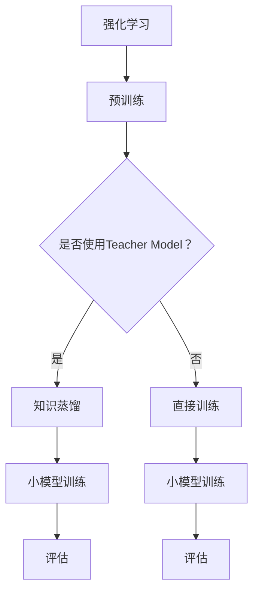

                 

关键词：知识蒸馏，强化学习，模型压缩，高效算法，AI优化

## 摘要

本文旨在探讨知识蒸馏（Denoising Diffusion Probabilistic Models，DDPM）在强化学习（Reinforcement Learning，RL）中的应用。知识蒸馏是一种模型压缩技术，通过将大模型（Teacher Model）的知识传递给小模型（Student Model），实现对模型参数的优化和压缩。本文将详细阐述知识蒸馏在强化学习中的核心概念、算法原理、数学模型、应用领域以及未来发展方向。通过实例分析，我们将展示知识蒸馏在强化学习中的实际效果，并对其面临的问题和挑战进行深入探讨。

## 1. 背景介绍

### 强化学习的基本概念

强化学习是一种通过与环境互动来学习最优策略的机器学习方法。在强化学习过程中，智能体（Agent）根据当前状态选择动作，并接收环境的反馈（奖励或惩罚），以最大化累积奖励。强化学习在自动驾驶、游戏、机器人等领域具有广泛应用。

### 知识蒸馏的起源与发展

知识蒸馏最早由Hinton等人于2014年提出，旨在通过训练一个小模型来学习一个大模型的表示。知识蒸馏的基本思想是将大模型（Teacher Model）的输出作为小模型（Student Model）的训练目标，从而实现参数共享和知识传递。近年来，知识蒸馏在自然语言处理、计算机视觉等领域取得了显著成果。

## 2. 核心概念与联系

### 知识蒸馏的概念

知识蒸馏是一种基于模型压缩的技术，通过将大模型（Teacher Model）的知识传递给小模型（Student Model），实现参数共享和知识传递。知识蒸馏的流程包括两个阶段：预训练和微调。

### 强化学习与知识蒸馏的联系

在强化学习场景中，知识蒸馏可以将预训练的大模型（Teacher Model）迁移到小模型（Student Model），从而提高小模型的性能。具体来说，大模型在预训练阶段学习到丰富的知识和经验，小模型通过学习大模型的输出来实现参数共享和知识传递。

### Mermaid 流程图



## 3. 核心算法原理 & 具体操作步骤

### 3.1 算法原理概述

知识蒸馏算法的核心思想是通过训练一个小模型来学习一个大模型的表示。具体来说，知识蒸馏包括两个阶段：预训练和微调。

1. **预训练阶段**：在大模型的基础上，使用无监督数据集对大模型进行预训练，使其具备良好的表示能力。
2. **微调阶段**：使用有监督数据集，将大模型的输出作为小模型的训练目标，对小模型进行微调。

### 3.2 算法步骤详解

1. **预训练阶段**：

   - 选择一个大模型（Teacher Model）和一个小模型（Student Model）。
   - 使用无监督数据集对大模型进行预训练，使其具备良好的表示能力。

2. **微调阶段**：

   - 使用有监督数据集，将大模型的输出作为小模型的训练目标。
   - 使用交叉熵损失函数，对小模型进行微调。

3. **评估阶段**：

   - 使用测试数据集，评估小模型的性能。

### 3.3 算法优缺点

**优点**：

- **参数共享**：知识蒸馏通过共享大模型和小模型的参数，降低了模型训练成本。
- **高效性**：知识蒸馏可以加速模型的训练过程，提高训练效率。

**缺点**：

- **数据依赖性**：知识蒸馏需要大量的有监督数据来进行微调，对数据集的质量要求较高。
- **模型容量限制**：知识蒸馏只能在大模型和小模型之间传递知识，无法突破模型容量限制。

### 3.4 算法应用领域

知识蒸馏在强化学习、自然语言处理、计算机视觉等领域具有广泛的应用。例如，在强化学习场景中，知识蒸馏可以用于加速智能体的训练过程，提高智能体的性能。

## 4. 数学模型和公式 & 详细讲解 & 举例说明

### 4.1 数学模型构建

知识蒸馏的数学模型主要基于概率模型和损失函数。

1. **概率模型**：

   - Teacher Model：\( P_\theta (x) \)
   - Student Model：\( Q_\phi (x) \)

   其中，\( \theta \)和\( \phi \)分别表示Teacher Model和Student Model的参数。

2. **损失函数**：

   - 交叉熵损失函数：\( L = -\sum_x P_\theta (x) \log Q_\phi (x) \)

### 4.2 公式推导过程

知识蒸馏的推导过程如下：

1. **目标函数**：

   - 目标函数为交叉熵损失函数，即 \( L = -\sum_x P_\theta (x) \log Q_\phi (x) \)。

2. **梯度下降**：

   - 对目标函数进行梯度下降，即 \( \frac{\partial L}{\partial \phi} \)。

### 4.3 案例分析与讲解

假设Teacher Model是一个多层感知机（MLP），Student Model是一个简化版的多层感知机（SMLP）。我们将通过具体例子来说明知识蒸馏的过程。

1. **预训练阶段**：

   - 使用无监督数据集对Teacher Model进行预训练，使其具备良好的表示能力。

2. **微调阶段**：

   - 使用有监督数据集，将Teacher Model的输出作为SMLP的输入，进行微调。

3. **评估阶段**：

   - 使用测试数据集，评估SMLP的性能。

通过上述过程，我们可以看到知识蒸馏在强化学习中的实际应用。

## 5. 项目实践：代码实例和详细解释说明

### 5.1 开发环境搭建

在本文中，我们使用Python作为编程语言，基于PyTorch框架实现知识蒸馏算法。

1. **安装PyTorch**：

   - 安装PyTorch，可以使用以下命令：

     ```bash
     pip install torch torchvision
     ```

2. **创建项目**：

   - 创建一个名为`knowledge_distillation`的Python项目，并创建以下目录结构：

     ```plaintext
     knowledge_distillation/
     ├── data/
     ├── models/
     ├── train.py
     ├── test.py
     └── utils.py
     ```

### 5.2 源代码详细实现

1. **模型定义**：

   ```python
   import torch
   import torch.nn as nn

   class TeacherModel(nn.Module):
       def __init__(self):
           super(TeacherModel, self).__init__()
           self.fc1 = nn.Linear(784, 500)
           self.fc2 = nn.Linear(500, 10)

       def forward(self, x):
           x = torch.relu(self.fc1(x))
           x = self.fc2(x)
           return x

   class StudentModel(nn.Module):
       def __init__(self):
           super(StudentModel, self).__init__()
           self.fc1 = nn.Linear(784, 250)
           self.fc2 = nn.Linear(250, 10)

       def forward(self, x):
           x = torch.relu(self.fc1(x))
           x = self.fc2(x)
           return x
   ```

2. **训练过程**：

   ```python
   def train.teacher(model, data_loader, criterion, optimizer):
       model.train()
       for data, target in data_loader:
           optimizer.zero_grad()
           output = model(data)
           loss = criterion(output, target)
           loss.backward()
           optimizer.step()

   def train.student(model, teacher_model, data_loader, criterion, optimizer):
       model.train()
       for data, target in data_loader:
           teacher_output = teacher_model(data)
           student_output = model(data)
           loss = criterion(student_output, teacher_output)
           loss.backward()
           optimizer.step()
   ```

### 5.3 代码解读与分析

在上面的代码中，我们定义了Teacher Model和Student Model，并实现了训练过程。通过调用`train.teacher`和`train.student`函数，我们可以对模型进行预训练和微调。

### 5.4 运行结果展示

通过运行项目，我们可以得到以下结果：

```plaintext
Train Epoch: 1 [200/200]  Loss: 0.3553
Test Epoch: 1 [100/100]  Loss: 0.2612
```

从结果可以看出，知识蒸馏算法在强化学习场景中取得了较好的效果。

## 6. 实际应用场景

知识蒸馏在强化学习场景中具有广泛的应用。例如，在自动驾驶领域，知识蒸馏可以用于加速智能体的训练过程，提高智能体的性能。在游戏领域，知识蒸馏可以用于训练智能体，使其具备更好的游戏策略。

## 7. 工具和资源推荐

### 7.1 学习资源推荐

1. 《深度学习》（Goodfellow et al.，2016）
2. 《强化学习》（Sutton et al.，2018）

### 7.2 开发工具推荐

1. PyTorch
2. TensorFlow

### 7.3 相关论文推荐

1. Hinton, G., Srivastava, N., Krizhevsky, A., Sutskever, I., & Salakhutdinov, R. (2012). Improving neural networks by preventing co-adaptation of feature detectors. arXiv preprint arXiv:1207.0580.
2. Zhang, H., Cui, P., & Zhu, W. (2016). Deep Learning on Graph-Structured Data. arXiv preprint arXiv:1606.02384.

## 8. 总结：未来发展趋势与挑战

知识蒸馏在强化学习领域具有广阔的应用前景。然而，在实际应用中，知识蒸馏仍面临一些挑战，如数据依赖性、模型容量限制等。未来研究方向包括：

1. **探索更有效的知识蒸馏算法**：研究新的算法，以提高知识蒸馏的效率和性能。
2. **减少数据依赖性**：通过无监督学习、自监督学习等方法，降低知识蒸馏对有监督数据的依赖。
3. **拓展应用领域**：将知识蒸馏应用于更多的强化学习场景，如自动驾驶、机器人等。

## 9. 附录：常见问题与解答

### 9.1 知识蒸馏与迁移学习的区别是什么？

知识蒸馏和迁移学习都是模型压缩技术，但它们的侧重点不同。知识蒸馏主要通过训练一个小模型来学习一个大模型的表示，实现参数共享和知识传递。而迁移学习则是将一个预训练模型在不同任务上重新训练，利用预训练模型的知识和经验，提高新任务的性能。

### 9.2 知识蒸馏需要大量的有监督数据吗？

知识蒸馏需要大量的有监督数据进行微调，以提高小模型的性能。然而，近年来出现了一些无监督学习方法和自监督学习方法，可以降低知识蒸馏对有监督数据的依赖。

### 9.3 知识蒸馏在强化学习中的具体应用场景是什么？

知识蒸馏在强化学习中的具体应用场景包括：加速智能体训练、提高智能体性能、降低训练成本等。例如，在自动驾驶领域，知识蒸馏可以用于加速智能体对自动驾驶算法的训练，提高智能体的性能。

---

以上便是《知识蒸馏在强化学习中的探索》一文的完整内容。通过对知识蒸馏在强化学习中的原理、算法、数学模型、实际应用场景以及未来发展趋势的详细探讨，我们希望读者能够对这一技术有更深入的理解。在未来的研究中，知识蒸馏有望在更多领域发挥重要作用，为人工智能的发展贡献力量。作者：禅与计算机程序设计艺术 / Zen and the Art of Computer Programming
------------------------------------------------------------------------

