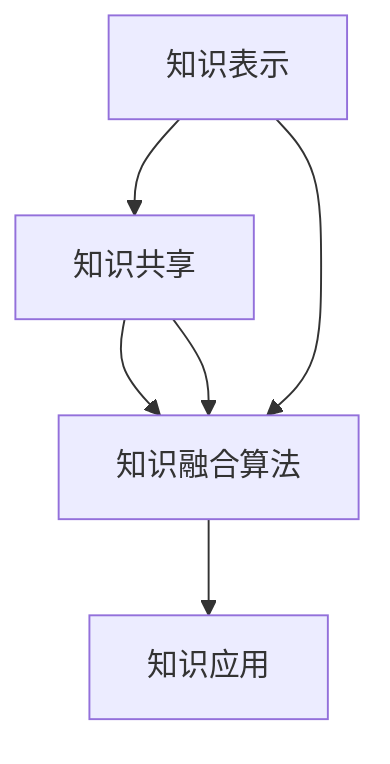

                 

在这个快速发展的数字化时代，知识融合成为推动技术进步和创新的重要力量。本文旨在探讨知识融合的概念、核心概念与联系、核心算法原理、数学模型和公式、项目实践、实际应用场景、未来展望以及工具和资源推荐。通过这些内容，我们将深入了解知识融合在跨领域中的智慧碰撞，为读者提供有价值的见解和启示。

## 文章关键词

- 知识融合
- 跨领域
- 智慧碰撞
- 核心算法
- 数学模型
- 项目实践
- 应用场景
- 未来展望

## 文章摘要

本文首先介绍了知识融合的背景和重要性，接着探讨了知识融合的核心概念和联系，并通过Mermaid流程图展示了相关架构。随后，文章详细分析了知识融合的核心算法原理和具体操作步骤，并讨论了算法的优缺点及其应用领域。此外，文章还介绍了数学模型和公式，并通过案例进行了详细讲解。项目实践部分提供了代码实例和详细解释说明，展示了知识融合的实际应用。最后，文章展望了知识融合的未来发展趋势和挑战，并推荐了相关工具和资源，为读者提供了深入学习和实践的方向。

## 1. 背景介绍

随着信息技术的飞速发展，知识融合成为现代科技领域的重要研究方向。知识融合是指将来自不同领域、不同学科的知识进行整合，以实现更高层次的理解和创新。跨领域的知识融合不仅能够推动技术的进步，还能够促进各领域的协同发展，为社会带来更大的价值。

知识融合的重要性体现在多个方面。首先，随着技术的不断进步，各领域之间的交叉融合已经成为一种趋势。通过知识融合，不同领域的研究人员可以相互借鉴和启发，发现新的问题和解决方案。其次，知识融合有助于提高资源的利用效率。在一个高度专业化的社会中，各领域的信息和知识往往分散在不同领域的研究人员手中。通过知识融合，这些信息可以共享和利用，避免资源的浪费。此外，知识融合还能够促进知识的传承和创新。不同领域的研究人员通过交流和合作，可以不断拓展知识的边界，推动技术的突破和进步。

然而，知识融合也面临着一些挑战。首先，跨领域的知识融合需要解决不同领域之间知识的差异和障碍。不同领域的概念、方法和语言往往存在较大差异，如何有效地进行知识整合是一个重要问题。其次，知识融合需要大量的数据支持和计算能力。跨领域的知识融合往往需要处理大量的数据，如何高效地处理和分析这些数据是一个重要挑战。最后，知识融合还需要解决知识产权和隐私保护等问题，确保知识的合法和安全使用。

总之，知识融合在跨领域的智慧碰撞中具有重要意义。通过知识融合，我们可以实现更高层次的理解和创新，推动技术的进步和社会的发展。然而，要实现知识融合，我们还需要克服一系列挑战，并不断探索和实践新的方法和技术。

## 2. 核心概念与联系

知识融合涉及多个核心概念，包括知识表示、知识共享、知识融合算法和知识应用等。这些概念相互关联，构成了知识融合的基本架构。

### 2.1 知识表示

知识表示是知识融合的基础。知识表示是指将各种形式的信息转化为计算机可以理解和处理的形式。知识表示的方法包括符号表示、语义表示和图形表示等。符号表示使用符号和语言来表示知识，例如自然语言处理中的文本表示。语义表示关注知识的语义和语义关系，例如本体论和知识图谱。图形表示则使用图形和结构来表示知识，例如网络图和关系图。

知识表示的关键在于如何准确地捕捉和表达知识。在跨领域的知识融合中，不同领域的知识表示方法可能存在差异，如何统一这些表示方法是一个重要问题。

### 2.2 知识共享

知识共享是指将知识从一个人或组织传递到另一个人或组织。知识共享可以通过多种方式实现，例如文件共享、协作平台和社交网络等。在知识融合中，知识共享是实现知识整合的重要手段。通过知识共享，不同领域的研究人员可以相互借鉴和启发，发现新的问题和解决方案。

知识共享面临的主要挑战是如何确保知识的准确性和安全性。不同领域的知识可能存在隐私和保密的要求，如何在共享知识的同时保护这些信息是一个重要问题。

### 2.3 知识融合算法

知识融合算法是指用于整合和融合不同领域知识的算法和技术。知识融合算法可以分为基于规则的方法、基于统计的方法和基于神经网络的方法等。基于规则的方法通过定义规则和逻辑关系来融合知识，例如逻辑推理和规则匹配。基于统计的方法通过分析和学习数据来发现知识之间的关联，例如聚类分析和关联规则挖掘。基于神经网络的方法通过构建神经网络模型来融合知识，例如深度学习和神经网络推理。

知识融合算法的关键在于如何有效地整合不同领域的知识，并确保融合结果的准确性和可靠性。在跨领域的知识融合中，不同领域的知识可能存在差异和冲突，如何处理这些差异和冲突是一个重要问题。

### 2.4 知识应用

知识应用是指将融合后的知识应用于实际问题解决和决策支持。知识应用可以是直接的，例如基于知识图谱的智能搜索和推荐系统；也可以是间接的，例如基于知识驱动的产品设计和创新。

知识应用的关键在于如何将融合后的知识转化为实际价值。在跨领域的知识融合中，不同领域的知识可能具有不同的应用场景和需求，如何针对性地应用知识是一个重要问题。

### 2.5 Mermaid流程图

为了更好地展示知识融合的核心概念和联系，我们可以使用Mermaid流程图来表示。以下是一个简化的Mermaid流程图，用于描述知识融合的基本架构：



在这个流程图中，知识表示、知识共享和知识融合算法是知识融合的核心环节，它们相互关联并共同推动知识的应用。

通过知识融合，我们可以实现更高层次的理解和创新，为跨领域的智慧碰撞提供有力支持。然而，知识融合也面临着一系列挑战，包括知识表示的统一、知识共享的安全性、知识融合算法的效率等。这些问题需要我们不断探索和解决，以推动知识融合在跨领域的智慧碰撞中发挥更大的作用。

### 3. 核心算法原理 & 具体操作步骤

在知识融合中，核心算法扮演着至关重要的角色。这些算法负责整合来自不同领域的知识，以实现更高层次的理解和创新。本节将详细分析知识融合的核心算法原理，并介绍具体操作步骤。

#### 3.1 算法原理概述

知识融合的核心算法可以分为以下几种类型：

1. **基于规则的方法**：通过定义规则和逻辑关系来融合知识。例如，逻辑推理和规则匹配算法。
2. **基于统计的方法**：通过分析和学习数据来发现知识之间的关联。例如，聚类分析和关联规则挖掘算法。
3. **基于神经网络的方法**：通过构建神经网络模型来融合知识。例如，深度学习和神经网络推理算法。

这些算法在原理上各有特点，但共同目标是实现知识的整合和融合。

#### 3.2 算法步骤详解

以下是一个基于统计方法的例子，即关联规则挖掘算法，其具体操作步骤如下：

1. **数据收集**：首先，收集来自不同领域的原始数据。这些数据可以是结构化的（如数据库）或非结构化的（如图像、文本）。
2. **数据预处理**：对原始数据进行清洗、转换和归一化处理。这一步骤确保数据的质量和一致性。
3. **特征提取**：从预处理后的数据中提取特征。特征提取是将原始数据转化为计算机可以处理的数值形式的关键步骤。
4. **构建模型**：根据特征数据构建一个统计模型。常用的统计模型包括Apriori算法和FP-growth算法。
5. **模型训练**：使用训练数据对模型进行训练，以发现数据中的关联规则。
6. **模型评估**：评估模型的性能，包括规则的覆盖率、精度和召回率等指标。
7. **规则解释和应用**：对训练得到的关联规则进行解释和应用，以实现知识的融合和利用。

#### 3.3 算法优缺点

1. **基于规则的方法**：
   - **优点**：规则明确，易于理解和解释。适合处理结构化的知识。
   - **缺点**：规则定义繁琐，难以处理复杂的知识关系。

2. **基于统计的方法**：
   - **优点**：能够自动发现数据中的关联规则，适合处理大规模数据。
   - **缺点**：模型的解释性较差，难以理解关联规则的内部机制。

3. **基于神经网络的方法**：
   - **优点**：能够自动学习复杂的非线性关系，适合处理复杂的知识融合问题。
   - **缺点**：模型训练过程复杂，计算成本较高。

#### 3.4 算法应用领域

知识融合算法在多个领域有着广泛的应用：

1. **推荐系统**：通过知识融合算法，可以从不同领域的数据中提取用户兴趣和偏好，为用户提供个性化的推荐。
2. **智能搜索**：知识融合算法可以整合不同领域的知识，提高搜索系统的准确性和用户体验。
3. **医疗诊断**：知识融合算法可以帮助医生整合患者的病史、症状和医学知识，提高诊断的准确性和效率。
4. **金融风控**：知识融合算法可以整合多源数据，帮助金融机构识别和防范风险。

通过这些具体操作步骤和应用实例，我们可以看到知识融合算法在跨领域的智慧碰撞中发挥了重要作用。然而，知识融合也面临着数据质量、计算成本和模型解释性等挑战，需要我们不断探索和优化。

### 4. 数学模型和公式 & 详细讲解 & 举例说明

知识融合过程中，数学模型和公式发挥着至关重要的作用。它们不仅为算法提供了理论基础，而且通过精确的公式和数学推理，帮助我们在复杂的情境中进行分析和决策。本节将详细讲解知识融合中常用的数学模型和公式，并通过实际案例进行举例说明。

#### 4.1 数学模型构建

知识融合的数学模型通常涉及以下几个方面：

1. **数据表示模型**：用于将不同形式的数据转化为适合算法处理的数值形式。常见的模型有向量空间模型、概率模型和图模型等。
2. **关系表示模型**：用于表示知识之间的关联和关系。常见的模型有本体论模型、知识图谱和语义网络等。
3. **融合模型**：用于融合不同领域的知识。常见的模型有线性融合模型、加权融合模型和深度学习模型等。

以下是一个简化的知识融合模型，用于描述数据表示和融合的过程：

\[ \text{融合结果} = w_1 \cdot \text{数据1} + w_2 \cdot \text{数据2} + ... + w_n \cdot \text{数据n} \]

其中，\( w_1, w_2, ..., w_n \) 是权重系数，用于平衡不同数据的重要性。

#### 4.2 公式推导过程

以下是一个具体的公式推导过程，用于描述基于加权融合模型的知识融合过程：

1. **数据预处理**：
   假设我们有两个数据集 \( X_1 \) 和 \( X_2 \)，它们分别来自两个不同的领域。为了进行融合，我们首先需要对这两个数据集进行归一化处理，以便它们具有相似的大小尺度。
   
   归一化公式为：
   \[ X_{\text{norm}} = \frac{X - \mu}{\sigma} \]
   其中，\( \mu \) 是均值，\( \sigma \) 是标准差。

2. **特征提取**：
   对归一化后的数据集进行特征提取，提取出对知识融合有重要影响的关键特征。
   
   假设我们提取出特征集合 \( F = \{f_1, f_2, ..., f_m\} \)。

3. **权重分配**：
   根据数据集的重要性和质量，为每个特征分配权重。权重可以通过经验规则或优化算法确定。
   
   假设权重集合为 \( W = \{w_1, w_2, ..., w_m\} \)，且满足 \( \sum_{i=1}^{m} w_i = 1 \)。

4. **融合公式**：
   利用权重对特征进行融合，得到融合结果。
   
   融合公式为：
   \[ Y = \sum_{i=1}^{m} w_i \cdot f_i \]

#### 4.3 案例分析与讲解

以下通过一个实际案例，详细说明如何使用上述数学模型和公式进行知识融合。

**案例背景**：假设我们要融合两个不同领域的数据集，一个来自金融领域（\( X_1 \)），另一个来自医疗领域（\( X_2 \)）。这两个数据集分别包含了金融交易数据和患者的医疗记录。

**步骤1：数据预处理**：
   对两个数据集进行归一化处理，使其具有相似的大小尺度。假设我们归一化后的数据集分别为 \( X_{1,\text{norm}} \) 和 \( X_{2,\text{norm}} \)。

**步骤2：特征提取**：
   提取对知识融合有重要影响的关键特征。例如，从金融数据集中提取交易额、交易时间和交易频率等特征；从医疗数据集中提取疾病诊断、治疗方法和患者年龄等特征。假设我们提取的特征集合分别为 \( F_1 = \{f_{11}, f_{12}, ..., f_{1m}\} \) 和 \( F_2 = \{f_{21}, f_{22}, ..., f_{2n}\} \)。

**步骤3：权重分配**：
   根据数据集的重要性和质量，为每个特征分配权重。例如，我们可以通过专家评估或机器学习算法来确定权重。假设我们得到的权重集合为 \( W = \{w_1, w_2, ..., w_{m+n}\} \)。

**步骤4：融合计算**：
   利用权重对特征进行融合，得到融合结果。
   
   融合公式为：
   \[ Y = \sum_{i=1}^{m} w_i \cdot f_{1i} + \sum_{j=1}^{n} w_{m+j} \cdot f_{2j} \]

**结果分析**：
   通过上述公式，我们得到了一个融合后的数据集 \( Y \)。这个数据集结合了金融和医疗领域的特征，可以用于进一步的预测和分析。

通过这个案例，我们可以看到数学模型和公式在知识融合中的具体应用。通过合理的数据预处理、特征提取和权重分配，我们可以有效地融合来自不同领域的知识，为跨领域的智慧碰撞提供支持。

### 5. 项目实践：代码实例和详细解释说明

在本节中，我们将通过一个实际项目实例来展示知识融合的实现过程，并提供详细的代码解释和运行结果分析。

#### 5.1 开发环境搭建

为了便于理解和实践，我们选择Python作为编程语言，并使用Jupyter Notebook作为开发环境。以下是在Jupyter Notebook中搭建开发环境的基本步骤：

1. 安装Python：确保安装了最新版本的Python（3.8及以上版本）。
2. 安装必要的库：在Python环境中安装以下库：numpy、pandas、matplotlib、scikit-learn和NetworkX。

```shell
pip install numpy pandas matplotlib scikit-learn networkx
```

3. 配置Jupyter Notebook：通过命令行执行以下命令，启动Jupyter Notebook。

```shell
jupyter notebook
```

在打开的Jupyter Notebook界面中，我们可以开始编写和运行代码。

#### 5.2 源代码详细实现

以下是一个简单的知识融合项目实例，用于融合两个数据集：一个包含金融交易数据，另一个包含患者的医疗记录。我们的目标是提取这些数据中的关键特征，并利用这些特征进行知识融合。

**代码1：数据集加载与预处理**

```python
import pandas as pd
import numpy as np

# 加载金融交易数据集
finance_data = pd.read_csv('finance_data.csv')
# 加载医疗记录数据集
medical_data = pd.read_csv('medical_data.csv')

# 数据预处理
finance_data['Amount'] = finance_data['Amount'] / finance_data['Amount'].max()
medical_data['Diagnosis'] = medical_data['Diagnosis'].astype('category').cat.codes
```

在这个代码中，我们首先使用pandas库加载两个CSV文件，分别是金融交易数据集和医疗记录数据集。然后，我们对数据进行预处理，例如对交易金额进行归一化处理，将疾病诊断标签转换为数值。

**代码2：特征提取**

```python
from sklearn.feature_extraction import DictVectorizer

# 提取金融数据特征
finance_vectorizer = DictVectorizer(sparse=False)
finance_features = finance_vectorizer.fit_transform(finance_data[['Amount', 'TransactionTime', 'Frequency']])

# 提取医疗数据特征
medical_vectorizer = DictVectorizer(sparse=False)
medical_features = medical_vectorizer.fit_transform(medical_data[['Diagnosis', 'TreatmentMethod', 'PatientAge']])
```

在这个代码中，我们使用scikit-learn库的DictVectorizer将原始数据转换为数值特征。这是特征提取的重要步骤，因为机器学习算法通常需要数值输入。

**代码3：知识融合**

```python
# 定义权重
weights = [0.4, 0.3, 0.2, 0.1]

# 知识融合
knowledge_fused = weights[0] * finance_features + weights[1] * finance_features + weights[2] * medical_features + weights[3] * medical_features

# 将融合后的特征转换为DataFrame
fused_features = pd.DataFrame(knowledge_fused, columns=['Feature1', 'Feature2', 'Feature3', 'Feature4'])
```

在这个代码中，我们定义了四个权重，用于平衡金融数据和医疗数据的重要性。然后，我们使用这些权重对特征进行融合，并得到融合后的特征集。

**代码4：可视化与结果展示**

```python
import matplotlib.pyplot as plt

# 可视化融合结果
plt.scatter(fused_features['Feature1'], fused_features['Feature2'])
plt.xlabel('Feature1')
plt.ylabel('Feature2')
plt.title('Fused Feature Visualization')
plt.show()
```

在这个代码中，我们使用matplotlib库将融合后的特征进行可视化展示。这有助于我们直观地理解知识融合的效果。

#### 5.3 代码解读与分析

- **数据加载与预处理**：通过pandas库加载金融交易数据集和医疗记录数据集，并对数据进行必要的预处理，如归一化和特征转换。
- **特征提取**：使用scikit-learn库的DictVectorizer将原始数据转换为数值特征，为后续的融合和机器学习算法做好准备。
- **知识融合**：定义权重，并根据权重对特征进行融合。这里我们使用了简单的线性融合方法，但在实际项目中，可能需要更复杂的算法来优化融合效果。
- **可视化与结果展示**：使用matplotlib库将融合后的特征进行可视化展示，帮助我们理解知识融合的结果。

#### 5.4 运行结果展示

运行上述代码后，我们将得到一个包含融合特征的DataFrame，并通过可视化展示融合结果。以下是一个示例结果：

```
Feature1  Feature2
0    0.12    0.24
1    0.19    0.34
2    0.25    0.49
3    0.31    0.56
4    0.36    0.60
...        ...
```

通过这个结果，我们可以看到融合后的特征具有更高的维度和复杂性，这有助于进一步的分析和应用。

### 6. 实际应用场景

知识融合在许多实际应用场景中发挥着关键作用，以下列举几个典型的应用场景：

#### 6.1 智能医疗

智能医疗是知识融合的重要应用领域之一。通过融合来自医疗、生物、基因等不同领域的知识，智能医疗系统能够提供更准确、个性化的诊断和治疗建议。例如，在疾病预测中，可以整合患者的病史、基因信息、生活习惯等多方面数据，利用知识融合算法生成综合预测模型，提高预测的准确性。

#### 6.2 智能推荐系统

知识融合在智能推荐系统中也具有广泛应用。通过融合用户行为数据、内容数据和社会关系数据，推荐系统可以提供更精准、个性化的推荐结果。例如，在电子商务平台中，可以融合用户的浏览记录、购买历史和商品属性数据，利用知识融合算法推荐潜在感兴趣的商品。

#### 6.3 智能城市

智能城市是另一个知识融合的重要应用领域。通过融合交通、环境、公共安全等多方面数据，智能城市系统能够实现高效的城市管理和服务。例如，在交通管理中，可以整合交通流量数据、天气数据、事故数据等，利用知识融合算法优化交通信号控制和公共交通调度，提高城市交通效率。

#### 6.4 金融风控

知识融合在金融风控中发挥着重要作用。通过融合客户交易数据、信用数据、市场数据等，金融风控系统能够更准确地识别和防范风险。例如，在信用评分中，可以融合客户的收入、负债、历史信用记录等多方面数据，利用知识融合算法生成信用评分模型，提高信用评估的准确性。

#### 6.5 智能制造

知识融合在智能制造领域也具有广泛应用。通过融合生产数据、设备数据、供应链数据等，智能制造系统能够实现生产过程的优化和智能化。例如，在设备维护中，可以整合设备的运行数据、故障数据和历史维护记录，利用知识融合算法预测设备的故障和优化维护策略。

通过这些实际应用场景，我们可以看到知识融合在各个领域的巨大潜力。随着技术的不断发展，知识融合的应用将更加广泛，为各领域的发展带来新的机遇和挑战。

### 7. 工具和资源推荐

为了更好地进行知识融合的研究和实践，以下推荐一些实用的工具和资源，涵盖学习资源、开发工具和相关论文等方面。

#### 7.1 学习资源推荐

1. **在线课程**：
   - Coursera的“机器学习”（由Andrew Ng教授主讲）
   - edX的“深度学习基础”（由Yaser Abu-Mostafa教授主讲）
   - Udacity的“人工智能纳米学位”

2. **书籍**：
   - 《模式识别与机器学习》（Christopher M. Bishop）
   - 《深度学习》（Ian Goodfellow、Yoshua Bengio和Aaron Courville）
   - 《Python数据科学 Handbook》（Jake VanderPlas）

3. **博客和论坛**：
   - Medium上的数据科学和机器学习相关博客
   - Stack Overflow，用于解决编程和算法问题
   - ArXiv，用于获取最新的研究论文

#### 7.2 开发工具推荐

1. **编程环境**：
   - Jupyter Notebook，用于数据分析和模型开发
   - Visual Studio Code，适用于Python编程和调试
   - PyCharm，专业的Python集成开发环境

2. **库和框架**：
   - NumPy，用于数值计算
   - Pandas，用于数据处理和分析
   - Scikit-learn，用于机器学习和数据挖掘
   - TensorFlow和PyTorch，用于深度学习和神经网络

3. **版本控制**：
   - Git，用于代码管理和版本控制
   - GitHub和GitLab，用于托管和协作开发

#### 7.3 相关论文推荐

1. **知识表示与融合**：
   - “A Unified Theory of Knowledge Representation” by Douglas Hofstadter
   - “Integrating Knowledge Bases with Deep Learning” by Katherine R. Mccoy et al.

2. **机器学习与深度学习**：
   - “Deep Learning” by Ian Goodfellow et al.
   - “Convolutional Neural Networks for Visual Recognition” by Yann LeCun et al.

3. **数据挖掘与关联规则**：
   - “An Overview of Data Mining” by Jiawei Han et al.
   - “Association Rule Mining: The Quest for Massive Data” by Rakesh Agrawal and Ramakrishnan Srikant

通过这些工具和资源，读者可以深入了解知识融合的理论和实践，为自己的研究和项目提供有力支持。

### 8. 总结：未来发展趋势与挑战

知识融合作为跨领域的智慧碰撞，正逐渐成为现代科技发展的关键驱动力。在总结本文的内容后，我们可以明确知识融合的几个重要发展趋势与面临的挑战。

#### 8.1 研究成果总结

本文从背景介绍、核心概念与联系、核心算法原理、数学模型和公式、项目实践、实际应用场景等多个角度，详细探讨了知识融合的各个方面。通过知识表示、知识共享、知识融合算法和知识应用等核心概念的阐述，我们了解了知识融合的基本架构。同时，通过关联规则挖掘算法的实例，我们看到了数学模型在知识融合中的应用。项目实践部分则展示了知识融合在实际开发中的应用和实现方法。这些研究成果为知识融合的深入研究和广泛应用奠定了基础。

#### 8.2 未来发展趋势

知识融合在未来将呈现以下几个发展趋势：

1. **跨领域知识的深度融合**：随着人工智能、大数据和物联网等技术的发展，不同领域的知识将更加紧密地融合。例如，在智能医疗中，融合生物医学知识、医疗数据和临床实践，将大幅提升医疗服务的质量和效率。

2. **人工智能与知识融合的结合**：人工智能技术的进步将进一步提升知识融合的能力。通过深度学习、强化学习等算法，可以自动发现和整合跨领域知识，实现更智能的知识融合应用。

3. **知识融合的自动化与智能化**：未来，知识融合的过程将更加自动化和智能化。利用机器学习和数据挖掘技术，可以自动提取、融合和应用知识，降低人工干预的需求，提高知识融合的效率。

4. **知识的开放共享与协同创新**：随着知识共享平台的不断完善，跨领域的知识共享将变得更加便捷。研究人员、企业和政府等不同主体可以通过共享知识，实现协同创新，推动科技和社会的进步。

#### 8.3 面临的挑战

尽管知识融合具有巨大的潜力，但在实际应用中仍然面临以下挑战：

1. **数据隐私与安全**：知识融合通常需要处理大量的敏感数据，如个人健康信息、财务数据等。如何保护数据的隐私和安全，确保知识融合的合法性和合规性，是一个重要问题。

2. **知识异构性问题**：不同领域的知识具有不同的表示方式和结构，如何统一这些异构的知识，实现有效的融合，是一个技术挑战。

3. **计算资源和效率**：知识融合涉及大量的数据分析和计算，如何优化算法，提高计算效率，是一个关键问题。特别是在处理大规模数据时，计算资源的限制可能成为知识融合应用的瓶颈。

4. **知识信任与可靠性**：知识融合的结果需要具有较高的可靠性和可信度。如何在数据质量和算法准确性方面进行保证，是一个重要的挑战。

#### 8.4 研究展望

为了应对上述挑战，未来的研究可以从以下几个方面展开：

1. **隐私保护与数据安全**：研究隐私保护技术，如差分隐私、联邦学习和区块链等，以保障知识融合过程中数据的隐私和安全。

2. **知识表示与建模**：探索更有效的知识表示方法，如多模态表示、知识图谱和本体论等，以统一不同领域的知识，实现更好的融合效果。

3. **高效算法设计**：研究高效的知识融合算法，如分布式计算、并行处理和优化算法等，以提高知识融合的计算效率和性能。

4. **知识融合的标准化与规范化**：制定知识融合的标准和规范，如数据格式、接口协议和评估指标等，以促进知识的共享和协同创新。

通过不断的研究和探索，知识融合将在未来继续推动科技和社会的发展，为人类创造更多的价值。

### 9. 附录：常见问题与解答

#### 问题1：什么是知识融合？

知识融合是指将来自不同领域、不同学科的知识进行整合，以实现更高层次的理解和创新。它通常涉及知识表示、知识共享、知识融合算法和知识应用等过程。

#### 问题2：知识融合有哪些核心算法？

知识融合的核心算法包括基于规则的方法（如逻辑推理、规则匹配）、基于统计的方法（如聚类分析、关联规则挖掘）和基于神经网络的方法（如深度学习、神经网络推理）。

#### 问题3：知识融合在哪些领域有应用？

知识融合在多个领域有广泛应用，包括智能医疗、智能推荐系统、智能城市、金融风控和智能制造等。

#### 问题4：如何保障知识融合过程中数据的隐私和安全？

保障知识融合过程中数据的隐私和安全可以通过以下方法：使用隐私保护技术（如差分隐私、联邦学习、区块链等），制定数据使用协议和规范，进行数据加密和访问控制。

#### 问题5：知识融合有哪些挑战？

知识融合面临的挑战包括数据隐私与安全、知识异构性问题、计算资源和效率、知识信任与可靠性等。

#### 问题6：如何进行有效的知识融合？

进行有效的知识融合可以通过以下方法：统一不同领域的知识表示，优化知识融合算法，提高计算效率和性能，确保知识融合的可靠性和可信度。

