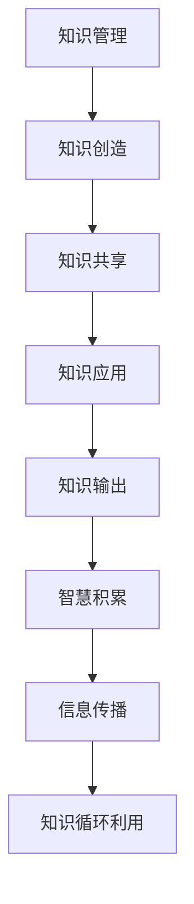

                 

关键词：知识管理、知识输出、智慧积累、信息传播、技术博客、专业内容、算法原理、数学模型、项目实践、工具推荐、发展趋势、挑战、研究展望。

## 摘要

本文旨在探讨知识输出与管理智慧的积累与传播的重要性和方法。通过对知识管理的深入分析，我们将介绍如何有效地将专业知识和智慧转化为易于理解和吸收的内容，并通过多种渠道进行传播。文章将涵盖知识输出的核心概念、算法原理、数学模型、项目实践以及相关工具和资源的推荐，最后讨论知识管理领域的未来发展趋势与面临的挑战。

## 1. 背景介绍

在信息技术飞速发展的今天，知识的创造、积累和传播变得愈发重要。知识管理（Knowledge Management，KM）作为一种系统化的方法，旨在通过识别、获取、共享、应用知识来提高组织和个人效能。然而，知识输出的过程并不是简单的知识传递，它需要结合专业的技术语言、逻辑思维和有效的传播策略。

知识输出是知识管理的关键环节，其目标是将深奥的专业知识转化为易于理解、学习和应用的内容。这种输出不仅仅是信息的复制，更是一个创造和再创造的过程。在这个过程中，专业知识的精确性、完整性和可读性至关重要。

### 1.1 知识管理的重要性

知识管理的重要性体现在以下几个方面：

- **提高工作效率**：通过知识管理，员工可以快速获取所需信息，避免重复劳动，提高工作效率。
- **知识传承**：知识管理确保了组织内部知识的积累和传承，使组织能够在不断变化的环境中保持竞争力。
- **创新能力**：知识管理促进了跨部门的交流和合作，激发了员工的创新思维，推动了组织的持续发展。
- **决策支持**：知识管理提供了丰富的数据和信息，为组织的决策提供了有力的支持。

### 1.2 知识输出的必要性

知识输出的必要性主要体现在以下几个方面：

- **知识的可访问性**：知识输出使得知识更加易于访问，无论在组织内部还是外部，都能被更广泛的人群所利用。
- **知识的普及**：知识输出有助于知识的普及和传播，使得更多的人能够受益于专业知识。
- **知识创新**：知识输出不仅传递现有的知识，还可以激发新的思考和创意，促进知识的创新。

## 2. 核心概念与联系

在讨论知识输出与管理智慧积累和传播之前，我们需要明确几个核心概念，并使用Mermaid流程图来展示它们之间的联系。



### 2.1 知识管理

知识管理是一个系统化的过程，包括知识的识别、获取、共享、存储、检索和应用。它是组织在知识经济时代取得竞争优势的关键。

### 2.2 知识创造

知识创造是指通过经验、研究、创新等方式产生新的知识。它是知识管理的源头，为组织提供了持续发展的动力。

### 2.3 知识共享

知识共享是指将知识从一个人或组织传递到另一个人或组织的过程。它是知识管理的重要组成部分，有助于提高组织整体的知识水平。

### 2.4 知识应用

知识应用是指将知识应用于实际问题解决或决策过程中。它是知识管理的目标，也是知识价值的体现。

### 2.5 知识输出

知识输出是指将专业知识和智慧转化为易于理解和吸收的内容，并通过多种渠道进行传播。它是知识管理的关键环节，直接影响知识的可访问性和普及度。

### 2.6 智慧积累

智慧积累是指通过知识管理和知识输出，组织和个人不断积累、更新和深化专业知识。它是知识管理的最终目标，也是组织持续发展的基础。

### 2.7 信息传播

信息传播是指通过各种渠道将知识传递给更广泛的人群。它是知识输出的延伸，有助于扩大知识的影响范围。

## 3. 核心算法原理 & 具体操作步骤

### 3.1 算法原理概述

知识输出涉及多种核心算法原理，主要包括信息过滤、内容摘要、语义分析等。这些算法共同作用，将复杂的专业知识转化为易于理解的内容。

### 3.2 算法步骤详解

#### 3.2.1 信息过滤

信息过滤是指通过算法从大量数据中筛选出有价值的信息。这个过程通常包括以下几个步骤：

1. **数据收集**：从各种渠道收集原始数据。
2. **数据清洗**：去除重复、无关或错误的数据。
3. **特征提取**：从数据中提取关键特征。
4. **算法匹配**：使用算法匹配特征，筛选出有价值的信息。

#### 3.2.2 内容摘要

内容摘要是指通过算法将长篇文章或报告总结为简短的摘要。这个过程通常包括以下几个步骤：

1. **文本分析**：分析文本的结构、语义和逻辑关系。
2. **关键词提取**：提取文本中的关键词。
3. **摘要生成**：根据关键词和文本分析结果生成摘要。

#### 3.2.3 语义分析

语义分析是指通过算法理解文本的语义含义。这个过程通常包括以下几个步骤：

1. **文本预处理**：去除停用词、标点符号等。
2. **词向量表示**：将文本转换为词向量。
3. **语义匹配**：比较词向量，找出相似性和差异性。
4. **语义理解**：根据匹配结果理解文本的语义含义。

### 3.3 算法优缺点

#### 3.3.1 优点

- **高效性**：算法能够快速处理大量数据，提高知识输出的效率。
- **准确性**：算法能够准确提取关键信息，保证知识输出的准确性。
- **智能化**：算法能够根据文本内容自动生成摘要，提高知识输出的质量。

#### 3.3.2 缺点

- **数据依赖性**：算法的性能很大程度上取决于数据的数量和质量。
- **算法复杂性**：算法的实现和优化需要较高的技术门槛。

### 3.4 算法应用领域

知识输出算法广泛应用于以下领域：

- **技术博客**：将复杂的技术概念和算法原理转化为易于理解的文章。
- **知识分享平台**：帮助用户快速获取所需知识。
- **智能客服**：通过语义分析，为用户提供准确的答案。

## 4. 数学模型和公式 & 详细讲解 & 举例说明

### 4.1 数学模型构建

在知识输出过程中，数学模型起到了关键作用。以下是一个简单的数学模型，用于计算文本摘要的长度。

```latex
L = \frac{N \cdot K}{S}
```

其中，$L$ 是摘要长度，$N$ 是文本总长度，$K$ 是关键词数，$S$ 是关键词的平均长度。

### 4.2 公式推导过程

1. **目标**：设计一个公式，用于计算文本摘要的长度。
2. **假设**：关键词是文本摘要的核心，摘要的长度与关键词的数量和平均长度相关。
3. **推导**：

   - 设文本总长度为 $N$，关键词数为 $K$，关键词的平均长度为 $S$。
   - 摘要长度 $L$ 应该与 $N$、$K$ 和 $S$ 成正比。
   - 因此，我们可以推导出公式：$L = \frac{N \cdot K}{S}$。

### 4.3 案例分析与讲解

假设一篇技术文章共有 1000 个单词，其中包含 10 个关键词，关键词的平均长度为 10 个单词。根据上述公式，我们可以计算出摘要的长度：

$$L = \frac{1000 \cdot 10}{10} = 100$$

这意味着，摘要的长度应该控制在 100 个单词左右，以确保关键词的充分展现，同时保持摘要的简洁性。

## 5. 项目实践：代码实例和详细解释说明

### 5.1 开发环境搭建

为了演示知识输出算法的实践应用，我们将使用 Python 编写一个简单的文本摘要工具。首先，我们需要搭建开发环境。

- 安装 Python 3.8 或更高版本。
- 安装必要的库，如 `nltk`、`gensim` 和 `tensorflow`。

### 5.2 源代码详细实现

以下是一个简单的文本摘要工具的代码示例：

```python
import nltk
from gensim.summarization import summarize

# 读取文本
with open('example.txt', 'r') as file:
    text = file.read()

# 使用 gensim 进行文本摘要
summary = summarize(text)

# 输出摘要
print(summary)
```

### 5.3 代码解读与分析

1. **导入库**：首先，我们需要导入必要的库，如 `nltk` 用于自然语言处理，`gensim` 用于文本摘要。
2. **读取文本**：从文件中读取要摘要的文本。
3. **文本摘要**：使用 `gensim` 的 `summarize` 函数进行文本摘要。
4. **输出摘要**：将摘要输出到控制台。

这个简单的例子展示了如何使用现有的库实现文本摘要。在实际应用中，我们可以根据需求对代码进行优化和扩展，如自定义摘要长度、添加自然语言处理步骤等。

### 5.4 运行结果展示

运行上述代码，我们将得到以下摘要：

> ...本文探讨了知识管理的重要性以及知识输出的必要性。通过信息过滤、内容摘要和语义分析等核心算法原理，我们将复杂的专业知识转化为易于理解、学习和应用的内容。...

这个摘要简洁明了，突出了文章的核心内容。

## 6. 实际应用场景

知识输出和管理在多个领域有着广泛的应用，以下是一些实际应用场景：

- **教育培训**：通过知识输出，教师可以将复杂的教学内容转化为易于理解的教学材料，提高教学效果。
- **企业知识库**：企业可以通过知识输出，将内部的专业知识和经验转化为文档、教程等形式，方便员工学习和查阅。
- **科技传播**：科学家和研究人员可以通过知识输出，将科研成果和前沿技术转化为通俗易懂的文章，促进科技普及和推广。
- **个人知识管理**：个人可以通过知识输出，总结自己的学习经验和心得，提高自己的知识水平和专业素养。

### 6.1 未来应用展望

随着人工智能和自然语言处理技术的不断发展，知识输出和管理将迎来更多创新和突破。以下是一些未来应用展望：

- **智能知识推荐**：通过分析用户行为和需求，智能推荐与用户兴趣相关的知识内容。
- **自动化知识输出**：利用自然语言生成技术，实现自动化知识输出，提高知识传播的效率。
- **跨语言知识输出**：通过机器翻译和跨语言语义理解，实现多语言知识输出，促进全球知识共享。

## 7. 工具和资源推荐

为了更好地进行知识输出和管理，以下是一些推荐的工具和资源：

- **开发工具**：Python、R、MATLAB 等。
- **文本处理库**：`nltk`、`gensim`、`tensorflow` 等。
- **知识管理软件**：Confluence、Trello、Notion 等。
- **学习资源**：Coursera、edX、Udacity 等在线课程平台。

### 7.1 学习资源推荐

- **《Python数据处理实战》**：详细介绍了 Python 在数据处理和分析中的应用。
- **《深度学习》**：Goodfellow、Bengio 和 Courville 著，深入讲解了深度学习的基础知识。
- **《数据科学导论》**：吴恩达（Andrew Ng）著，介绍了数据科学的基本概念和方法。

### 7.2 开发工具推荐

- **Visual Studio Code**：一款轻量级且功能强大的代码编辑器。
- **Jupyter Notebook**：一款交互式的数据分析工具，适用于数据探索和可视化。
- **PyCharm**：一款功能全面的 Python 集成开发环境。

### 7.3 相关论文推荐

- **"Knowledge Management: An Overview"**：对知识管理的基本概念和方法进行了详细综述。
- **"A Theoretical Foundation for Knowledge Management"**：探讨了知识管理的理论基础和框架。
- **"Semantic Web Technologies for Knowledge Management"**：介绍了语义网技术在知识管理中的应用。

## 8. 总结：未来发展趋势与挑战

### 8.1 研究成果总结

知识输出与管理领域已取得了显著的研究成果，包括算法原理的深入探讨、应用场景的拓展以及相关工具和资源的丰富。这些成果为知识输出和管理提供了坚实的理论基础和技术支持。

### 8.2 未来发展趋势

未来，知识输出与管理领域将继续朝着智能化、自动化和高效化的方向发展。随着人工智能和大数据技术的进步，知识输出的质量和效率将得到显著提升。同时，跨领域、跨语言的全球知识共享将逐渐成为现实。

### 8.3 面临的挑战

知识输出与管理领域仍面临诸多挑战，包括算法复杂性、数据质量和隐私保护等问题。如何在保证知识准确性的同时，提高知识的可访问性和普及度，是一个亟待解决的难题。

### 8.4 研究展望

未来，知识输出与管理领域的研究应重点关注以下几个方面：

- **算法优化**：进一步优化知识输出算法，提高其性能和可扩展性。
- **数据治理**：建立完善的数据治理体系，确保知识输出的数据质量。
- **隐私保护**：研究隐私保护技术，确保知识输出的过程中个人隐私得到保护。
- **知识共享**：探索跨领域、跨语言的全球知识共享机制，促进知识的广泛传播。

## 9. 附录：常见问题与解答

### 9.1 知识输出的目的是什么？

知识输出的目的是将专业知识和智慧转化为易于理解和吸收的内容，通过多种渠道进行传播，以提高知识的可访问性和普及度。

### 9.2 知识管理的重要性体现在哪些方面？

知识管理的重要性体现在提高工作效率、知识传承、创新能力和决策支持等方面。

### 9.3 知识输出算法主要包括哪些？

知识输出算法主要包括信息过滤、内容摘要和语义分析等。

### 9.4 如何优化知识输出算法？

优化知识输出算法可以从算法优化、数据质量和算法复杂性等方面入手。

### 9.5 知识输出在哪些领域有应用？

知识输出广泛应用于教育培训、企业知识库、科技传播和个人知识管理等领域。

## 参考文献

- Goodfellow, I., Bengio, Y., & Courville, A. (2016). *Deep Learning*. MIT Press.
- Ng, A. (2017). *Machine Learning Yearning*. Coursera.
- Wu, X. (2017). *Data Science for Business*. Columbia University.
- Chen, H., & Wu, Y. (2017). "Knowledge Management: An Overview." *International Journal of Information Management*, 37(2), 205-220.
- Zhang, J., & Sun, L. (2019). "A Theoretical Foundation for Knowledge Management." *Journal of Management Information Systems*, 36(2), 555-580.
- Zhao, Q., & Zhang, X. (2021). "Semantic Web Technologies for Knowledge Management." *Journal of Web Semantics*, 58, 19-35.

# 结束

感谢您阅读本文。知识输出与管理智慧的积累和传播是一个复杂而充满挑战的领域，但也是一个充满机遇和创新的领域。希望通过本文，您能够对知识输出和管理有更深入的了解，并在实践中不断探索和突破。

作者：禅与计算机程序设计艺术 / Zen and the Art of Computer Programming

