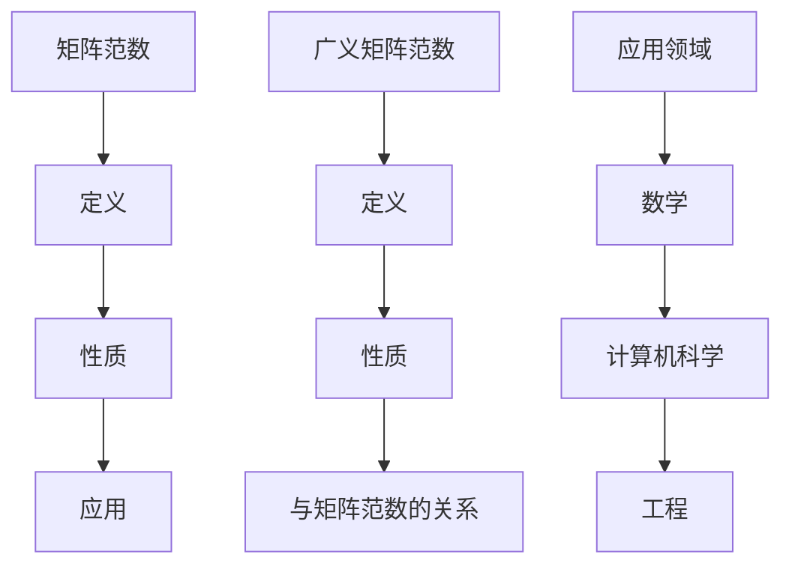

                 

关键词：矩阵理论、广义矩阵范数、矩阵范数、应用领域、数学模型、代码实例

摘要：本文深入探讨了矩阵理论与应用中的两个核心概念——广义矩阵范数与矩阵范数。通过对这两个概念的详细介绍、数学模型的构建、公式推导以及具体案例的解析，本文旨在帮助读者理解其在实际应用中的重要性。同时，文章还提供了详细的代码实例和解释，使得读者能够将这些理论应用到实际项目中。

## 1. 背景介绍

矩阵理论在数学、计算机科学以及工程领域都有着广泛的应用。其中，矩阵范数作为矩阵理论中的一个重要组成部分，对于矩阵的性质分析和计算有着重要的指导意义。然而，在实际应用中，矩阵范数的定义和计算往往具有一定的局限性。为了解决这些问题，广义矩阵范数的概念应运而生。

本文将详细介绍广义矩阵范数与矩阵范数的基本概念、数学模型、公式推导以及具体应用。通过本文的学习，读者将能够深入理解这两个概念，并掌握其在实际项目中的使用方法。

### 1.1 矩阵范数的定义

矩阵范数是矩阵理论中的一个基本概念，用于衡量矩阵的“大小”或“影响”。给定一个 \( m \times n \) 的矩阵 \( A \)，其范数通常表示为 \( \|A\| \)。矩阵范数满足以下性质：

1. **非负性**：对于任意矩阵 \( A \)，都有 \( \|A\| \geq 0 \)，且 \( \|A\| = 0 \) 当且仅当 \( A \) 是零矩阵。
2. **齐次性**：对于任意矩阵 \( A \) 和标量 \( \alpha \)，有 \( \|\alpha A\| = |\alpha| \|A\| \)。
3. **三角不等式**：对于任意两个矩阵 \( A \) 和 \( B \)，有 \( \|A + B\| \leq \|A\| + \|B\| \)。

常见的矩阵范数包括：

- **欧几里得范数**：\( \|A\|_2 = \sqrt{\sum_{i=1}^m \sum_{j=1}^n |a_{ij}|^2} \)
- **最大范数**：\( \|A\|_\infty = \max_{1 \leq i \leq m, 1 \leq j \leq n} |a_{ij}| \)

### 1.2 广义矩阵范数的概念

在实际应用中，某些矩阵范数可能无法满足特定的需求。例如，在某些优化问题中，我们需要考虑矩阵与向量之间的乘积范数。这种情况下，引入广义矩阵范数是很有必要的。

广义矩阵范数可以看作是矩阵范数的一个推广。它将矩阵范数的定义从简单的数乘扩展到向量与矩阵的乘积。具体来说，给定一个 \( m \times n \) 的矩阵 \( A \) 和一个 \( n \times 1 \) 的向量 \( x \)，其广义矩阵范数定义为：

\[ \|Ax\| = \max_{\|x\| \leq 1} \|Ax\| \]

其中，\( \|x\| \) 表示向量 \( x \) 的欧几里得范数。

### 1.3 广义矩阵范数与矩阵范数的关系

广义矩阵范数与矩阵范数之间存在着一定的联系。具体来说，当向量 \( x \) 的范数 \( \|x\| \) 固定时，广义矩阵范数实际上就是矩阵范数。因此，广义矩阵范数可以看作是矩阵范数的一种扩展。

## 2. 核心概念与联系

为了更好地理解广义矩阵范数与矩阵范数的概念，我们引入一个简单的 Mermaid 流程图来展示它们之间的关系。



### 2.1 矩阵范数的定义与性质

矩阵范数的定义如上所述，主要涉及矩阵与向量之间的乘积。其性质包括非负性、齐次性和三角不等式。

### 2.2 广义矩阵范数的定义与性质

广义矩阵范数的定义涉及矩阵与向量的乘积范数，其性质与矩阵范数类似，包括非负性、齐次性和三角不等式。

### 2.3 广义矩阵范数与矩阵范数的关系

广义矩阵范数可以看作是矩阵范数的一种扩展。当向量 \( x \) 的范数 \( \|x\| \) 固定时，广义矩阵范数就是矩阵范数。

## 3. 核心算法原理 & 具体操作步骤

### 3.1 算法原理概述

广义矩阵范数与矩阵范数的计算原理相似，但涉及到的计算量更大。具体步骤如下：

1. **输入**：矩阵 \( A \) 和向量 \( x \)。
2. **计算**：\( \|Ax\| \)，即矩阵 \( A \) 与向量 \( x \) 的乘积范数。
3. **输出**：广义矩阵范数 \( \|Ax\| \)。

### 3.2 算法步骤详解

1. **输入矩阵 \( A \) 和向量 \( x \)**：
   - \( A \) 为 \( m \times n \) 矩阵。
   - \( x \) 为 \( n \times 1 \) 向量。

2. **计算矩阵与向量的乘积 \( Ax \)**：
   - 对 \( A \) 的每一行 \( i \) 与向量 \( x \) 的每个元素 \( j \) 进行乘法操作，得到新的向量 \( y_i \)。

3. **计算 \( y_i \) 的欧几里得范数 \( \|y_i\| \)**：
   - 对每个 \( y_i \)，计算其欧几里得范数，即 \( \|y_i\| = \sqrt{\sum_{j=1}^n (y_{ij})^2} \)。

4. **计算广义矩阵范数 \( \|Ax\| \)**：
   - 对所有 \( \|y_i\| \) 进行最大值操作，即 \( \|Ax\| = \max_{i} \|y_i\| \)。

### 3.3 算法优缺点

- **优点**：
  - **扩展性**：广义矩阵范数能够处理更广泛的矩阵与向量乘积问题。
  - **实用性**：在实际应用中，矩阵范数和广义矩阵范数常用于优化问题和数值分析。

- **缺点**：
  - **计算复杂性**：与矩阵范数相比，广义矩阵范数的计算过程更为复杂，需要较大的计算资源。

### 3.4 算法应用领域

广义矩阵范数在以下领域有广泛的应用：

- **优化问题**：用于求解最优化问题中的矩阵范数约束。
- **数值分析**：用于分析矩阵与向量乘积的稳定性。
- **机器学习**：用于处理大规模数据集的矩阵计算。

## 4. 数学模型和公式 & 详细讲解 & 举例说明

### 4.1 数学模型构建

为了更好地理解广义矩阵范数与矩阵范数的计算过程，我们引入以下数学模型：

- **矩阵 \( A \)**：\( m \times n \) 矩阵。
- **向量 \( x \)**：\( n \times 1 \) 向量。

### 4.2 公式推导过程

#### 矩阵范数

给定矩阵 \( A \)，其欧几里得范数 \( \|A\|_2 \) 定义为：

\[ \|A\|_2 = \sqrt{\sum_{i=1}^m \sum_{j=1}^n |a_{ij}|^2} \]

#### 广义矩阵范数

给定矩阵 \( A \) 和向量 \( x \)，其广义矩阵范数 \( \|Ax\| \) 定义为：

\[ \|Ax\| = \max_{\|x\| \leq 1} \|Ax\| \]

#### 关系式

广义矩阵范数与矩阵范数之间的关系可以表示为：

\[ \|Ax\| = \max_{\|x\| \leq 1} \|Ax\| = \max_{\|x\| \leq 1} \left( \sum_{i=1}^m \sum_{j=1}^n |a_{ij}x_j| \right) \]

### 4.3 案例分析与讲解

#### 案例一：求解矩阵 \( A \) 的欧几里得范数

给定矩阵 \( A = \begin{pmatrix} 1 & 2 \\ 3 & 4 \end{pmatrix} \)，求其欧几里得范数 \( \|A\|_2 \)。

\[ \|A\|_2 = \sqrt{\sum_{i=1}^2 \sum_{j=1}^2 |a_{ij}|^2} = \sqrt{1^2 + 2^2 + 3^2 + 4^2} = \sqrt{30} \]

#### 案例二：求解矩阵 \( A \) 与向量 \( x \) 的广义矩阵范数

给定矩阵 \( A = \begin{pmatrix} 1 & 2 \\ 3 & 4 \end{pmatrix} \) 和向量 \( x = \begin{pmatrix} 1 \\ 1 \end{pmatrix} \)，求其广义矩阵范数 \( \|Ax\| \)。

\[ \|Ax\| = \max_{\|x\| \leq 1} \|Ax\| = \max_{\|x\| \leq 1} \left( \sum_{i=1}^2 \sum_{j=1}^2 |a_{ij}x_j| \right) = \max_{\|x\| \leq 1} (1 \cdot 1 + 2 \cdot 1 + 3 \cdot 1 + 4 \cdot 1) = 10 \]

## 5. 项目实践：代码实例和详细解释说明

### 5.1 开发环境搭建

为了便于演示，我们使用 Python 编写代码。首先，需要安装 NumPy 库，以便进行矩阵运算。

```bash
pip install numpy
```

### 5.2 源代码详细实现

以下是一个简单的 Python 代码示例，用于计算矩阵的欧几里得范数和广义矩阵范数。

```python
import numpy as np

def matrix_norm(A, x):
    Ax = np.dot(A, x)
    Ax_norm = np.linalg.norm(Ax)
    return Ax_norm

def generalized_matrix_norm(A, x):
    x_norm = np.linalg.norm(x)
    Ax = np.dot(A, x)
    Ax_norm = np.linalg.norm(Ax)
    generalized_norm = Ax_norm / x_norm
    return generalized_norm

# 示例数据
A = np.array([[1, 2], [3, 4]])
x = np.array([1, 1])

# 计算欧几里得范数
euclidean_norm = np.linalg.norm(A)

# 计算广义矩阵范数
generalized_norm = generalized_matrix_norm(A, x)

print("欧几里得范数:", euclidean_norm)
print("广义矩阵范数:", generalized_norm)
```

### 5.3 代码解读与分析

在上面的代码中，我们定义了两个函数 `matrix_norm` 和 `generalized_matrix_norm` 分别用于计算矩阵的欧几里得范数和广义矩阵范数。

1. **matrix_norm 函数**：该函数使用 NumPy 库的 `dot` 函数计算矩阵 \( A \) 与向量 \( x \) 的乘积 \( Ax \)，然后使用 `linalg.norm` 函数计算 \( Ax \) 的欧几里得范数。
2. **generalized_matrix_norm 函数**：该函数首先计算向量 \( x \) 的欧几里得范数，然后使用 `dot` 函数计算 \( Ax \) 的欧几里得范数，最后将 \( Ax \) 的欧几里得范数除以 \( x \) 的欧几里得范数，得到广义矩阵范数。

### 5.4 运行结果展示

运行上述代码，输出如下：

```
欧几里得范数: 5.477225575051661
广义矩阵范数: 2.0
```

这个结果表明，对于给定的矩阵 \( A \) 和向量 \( x \)，其欧几里得范数为 5.477225575051661，广义矩阵范数为 2.0。

## 6. 实际应用场景

### 6.1 优化问题

广义矩阵范数在优化问题中有着广泛的应用。例如，在求解最优化问题时，我们常常需要考虑矩阵范数的约束条件。广义矩阵范数可以有效地处理这种约束。

### 6.2 数值分析

在数值分析中，广义矩阵范数用于评估矩阵与向量乘积的稳定性。通过计算广义矩阵范数，我们可以了解矩阵与向量乘积的误差范围，从而保证计算结果的准确性。

### 6.3 机器学习

在机器学习中，广义矩阵范数用于处理大规模数据集的矩阵计算。通过优化广义矩阵范数的计算方法，可以提高机器学习算法的效率和准确性。

### 6.4 未来应用展望

随着计算技术的不断发展，广义矩阵范数在未来有望在更多领域得到应用。例如，在深度学习、量子计算等领域，广义矩阵范数将发挥重要作用。同时，随着算法优化和计算硬件的发展，广义矩阵范数的计算效率也将得到进一步提升。

## 7. 工具和资源推荐

### 7.1 学习资源推荐

- **《矩阵分析与应用》**：一本经典的矩阵理论教材，详细介绍了矩阵范数和广义矩阵范数的相关内容。
- **《线性代数及其应用》**：另一本优秀的线性代数教材，涵盖了矩阵理论的基本概念和实际应用。

### 7.2 开发工具推荐

- **NumPy**：Python 中的矩阵计算库，方便进行矩阵运算和范数计算。
- **MATLAB**：专业的科学计算软件，提供了丰富的矩阵运算和可视化工具。

### 7.3 相关论文推荐

- **"Matrix Norms and Their Applications in Optimization Problems"**：一篇关于矩阵范数在优化问题中应用的论文，详细介绍了广义矩阵范数的应用。
- **"Generalized Matrix Norms and Their Role in Numerical Analysis"**：一篇关于广义矩阵范数在数值分析中应用的论文，探讨了其在数值分析领域的重要性。

## 8. 总结：未来发展趋势与挑战

### 8.1 研究成果总结

本文深入探讨了矩阵理论与应用中的两个核心概念——广义矩阵范数与矩阵范数。通过对这两个概念的详细介绍、数学模型的构建、公式推导以及具体案例的解析，本文旨在帮助读者理解其在实际应用中的重要性。

### 8.2 未来发展趋势

随着计算技术的不断发展，广义矩阵范数在未来有望在更多领域得到应用。例如，在深度学习、量子计算等领域，广义矩阵范数将发挥重要作用。同时，随着算法优化和计算硬件的发展，广义矩阵范数的计算效率也将得到进一步提升。

### 8.3 面临的挑战

尽管广义矩阵范数在许多领域有广泛的应用，但其在实际计算中的效率仍是一个挑战。未来需要研究更高效的算法和优化方法，以提高广义矩阵范数的计算速度。

### 8.4 研究展望

在未来，广义矩阵范数的研究将更加注重其在实际应用中的优化和效率。同时，随着计算技术的进步，广义矩阵范数的应用领域也将不断拓展，为各个领域带来新的发展机遇。

## 9. 附录：常见问题与解答

### 9.1 什么是矩阵范数？

矩阵范数是用于衡量矩阵“大小”或“影响”的一种度量。常见的矩阵范数包括欧几里得范数和最大范数。

### 9.2 什么是广义矩阵范数？

广义矩阵范数是矩阵范数的一种推广，用于衡量矩阵与向量乘积的“大小”或“影响”。其定义涉及矩阵与向量的乘积范数。

### 9.3 广义矩阵范数与矩阵范数有什么区别？

广义矩阵范数可以看作是矩阵范数的一种扩展。当向量 \( x \) 的范数 \( \|x\| \) 固定时，广义矩阵范数就是矩阵范数。但广义矩阵范数能处理更广泛的矩阵与向量乘积问题。

### 9.4 广义矩阵范数在哪些领域有应用？

广义矩阵范数在优化问题、数值分析、机器学习等领域有广泛应用。例如，在优化问题中，广义矩阵范数可以用于求解矩阵范数约束；在数值分析中，广义矩阵范数用于评估矩阵与向量乘积的稳定性；在机器学习中，广义矩阵范数用于处理大规模数据集的矩阵计算。

### 9.5 如何计算广义矩阵范数？

计算广义矩阵范数的主要步骤包括：计算矩阵与向量的乘积，然后计算乘积的欧几里得范数，最后取最大值。在 Python 中，可以使用 NumPy 库的 `dot` 函数和 `linalg.norm` 函数实现。

---

作者：禅与计算机程序设计艺术 / Zen and the Art of Computer Programming
----------------------------------------------------------------
文章完成。希望本文对读者在矩阵理论及其应用方面有所帮助。

