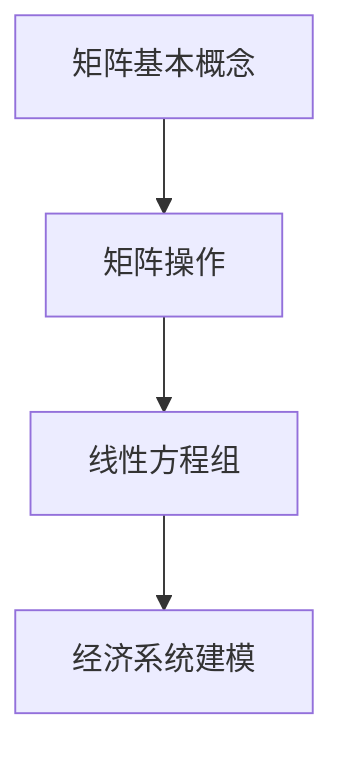

                 

关键词：矩阵理论，Leontief模型，线性代数，经济学模型，系统分析，人工智能应用。

> 摘要：本文旨在探讨矩阵理论在经济学领域的重要应用，特别是Leontief模型的引入及其对经济系统分析的贡献。通过对矩阵理论基本概念和Leontief模型核心原理的深入解析，文章旨在揭示其在经济系统建模、预测和政策制定中的实际价值。

## 1. 背景介绍

### 1.1 矩阵理论的起源与发展

矩阵理论起源于19世纪，由数学家乔治·西蒙·欧姆和赫尔曼·格伦沃尔德等人提出。此后，随着数学和工程领域的发展，矩阵理论逐渐成为现代科学和工程中的基本工具。矩阵不仅在纯数学领域具有重要地位，还在物理学、计算机科学、经济学等多个领域得到了广泛应用。

### 1.2 矩阵在经济学中的应用

在经济学中，矩阵理论被广泛应用于经济系统的建模与分析。矩阵的线性代数性质使得它能够高效地处理复杂的经济关系，例如需求与供给的关系、资源分配以及经济增长等问题。尤其是在投入产出分析中，矩阵理论发挥着至关重要的作用。

### 1.3 Leontief模型的重要性

Leontief模型是由诺贝尔经济学奖获得者沃伦·勒翁泰夫于20世纪40年代提出的。该模型通过矩阵的形式描述了不同产业之间的投入产出关系，为经济系统分析提供了一个强有力的工具。Leontief模型不仅在经济理论研究中具有重要地位，还在实际政策制定和产业规划中发挥了关键作用。

## 2. 核心概念与联系

### 2.1 矩阵的基本概念

矩阵是由数字构成的矩形阵列，通常表示为 m × n 矩阵，其中 m 表示行数，n 表示列数。矩阵中的每个元素都可以通过行和列的索引来标识。

### 2.2 矩阵的基本操作

- **加法和减法**：两个矩阵只有当它们的维度相同时才能进行加法和减法操作。结果矩阵与原矩阵具有相同的维度，其中每个元素都是对应元素的和或差。
- **乘法**：矩阵乘法可以分为数乘和矩阵乘。数乘是矩阵与一个标量相乘，而矩阵乘则是两个矩阵之间的运算。矩阵乘法的结果是一个新矩阵，其维度通常取决于原矩阵的维度。
- **转置**：矩阵的转置是将原矩阵的行和列互换，形成一个新的矩阵。转置矩阵与原矩阵的维度相同。

### 2.3 矩阵与线性方程组的关系

矩阵与线性方程组密切相关。一个线性方程组可以通过矩阵的形式来表示，即 Ax = b，其中 A 是系数矩阵，x 是变量向量，b 是常数向量。通过矩阵运算，可以高效地求解线性方程组。

### 2.4 Mermaid 流程图（请在这里插入Mermaid流程图）



## 3. 核心算法原理 & 具体操作步骤

### 3.1 算法原理概述

Leontief模型的原理基于投入产出分析，即一个经济系统中的每个产业都需要从其他产业获取投入，同时也为其他产业提供产出。这种投入产出关系可以用矩阵来表示，从而实现经济系统的建模与分析。

### 3.2 算法步骤详解

1. **构建投入产出矩阵**：根据经济系统中的产业关系，构建一个投入产出矩阵。矩阵中的每个元素表示一个产业对另一个产业的投入量。
2. **计算直接消耗系数矩阵**：直接消耗系数矩阵表示每个产业对其他产业的直接消耗。计算方法为：将投入产出矩阵的转置除以其对角线上的元素。
3. **计算完全消耗系数矩阵**：完全消耗系数矩阵表示每个产业对其他产业的完全消耗，包括直接消耗和间接消耗。计算方法为：对直接消耗系数矩阵进行多次迭代，直到达到稳定状态。
4. **进行经济系统分析**：利用完全消耗系数矩阵，可以进行经济系统分析，如计算产业之间的关联度、评估政策对经济系统的影响等。

### 3.3 算法优缺点

**优点**：

- **高效性**：矩阵运算具有高效性，能够快速处理大量数据。
- **全面性**：Leontief模型能够全面考虑产业之间的投入产出关系，提供全面的经济系统分析。

**缺点**：

- **静态性**：Leontief模型假设经济系统是静态的，不能很好地反映动态变化。
- **简化性**：模型简化了一些复杂的实际经济关系，可能导致分析结果的偏差。

### 3.4 算法应用领域

Leontief模型广泛应用于经济系统分析、政策制定、产业规划等领域。例如，它可以用于评估不同政策对经济增长的影响、分析产业之间的关联度、优化资源配置等。

## 4. 数学模型和公式

### 4.1 数学模型构建

Leontief模型的基本数学模型可以表示为：

$$
X = AY + U
$$

其中，X 是产出向量，A 是投入产出矩阵，Y 是中间投入向量，U 是最终需求向量。

### 4.2 公式推导过程

#### 直接消耗系数矩阵的计算

直接消耗系数矩阵 B 的计算公式为：

$$
B = \frac{X^T}{Y^T}
$$

其中，X^T 是投入产出矩阵 A 的转置，Y^T 是中间投入向量。

#### 完全消耗系数矩阵的计算

完全消耗系数矩阵 C 的计算公式为：

$$
C = (I - B)^{-1}
$$

其中，I 是单位矩阵。

### 4.3 案例分析与讲解

假设有一个包含三个产业的经济系统，其投入产出矩阵如下：

$$
A = \begin{bmatrix}
3 & 1 & 2 \\
1 & 3 & 1 \\
2 & 1 & 3
\end{bmatrix}
$$

#### 直接消耗系数矩阵的计算

首先计算 A 的转置：

$$
A^T = \begin{bmatrix}
3 & 1 & 2 \\
1 & 3 & 1 \\
2 & 1 & 3
\end{bmatrix}
$$

然后计算 X^T：

$$
X^T = A^T \cdot Y^T
$$

假设中间投入向量 Y^T 为：

$$
Y^T = \begin{bmatrix}
10 \\
15 \\
20
\end{bmatrix}
$$

则：

$$
X^T = \begin{bmatrix}
3 & 1 & 2 \\
1 & 3 & 1 \\
2 & 1 & 3
\end{bmatrix} \cdot \begin{bmatrix}
10 \\
15 \\
20
\end{bmatrix}
= \begin{bmatrix}
70 \\
60 \\
50
\end{bmatrix}
$$

接下来计算 B：

$$
B = \frac{X^T}{Y^T} = \frac{\begin{bmatrix}
70 \\
60 \\
50
\end{bmatrix}}{\begin{bmatrix}
10 \\
15 \\
20
\end{bmatrix}} = \begin{bmatrix}
7 & 0.5 & 2.5 \\
0.5 & 4 & 0.5 \\
2.5 & 0.5 & 7.5
\end{bmatrix}
$$

#### 完全消耗系数矩阵的计算

首先计算 I - B：

$$
I - B = \begin{bmatrix}
1 & 0 & 0 \\
0 & 1 & 0 \\
0 & 0 & 1
\end{bmatrix} - \begin{bmatrix}
7 & 0.5 & 2.5 \\
0.5 & 4 & 0.5 \\
2.5 & 0.5 & 7.5
\end{bmatrix} = \begin{bmatrix}
-6 & -0.5 & -2.5 \\
-0.5 & -3 & -0.5 \\
-2.5 & -0.5 & -6.5
\end{bmatrix}
$$

然后计算 (I - B)^{-1}：

$$
(I - B)^{-1} = \begin{bmatrix}
0.1 & 0.01 & 0.04 \\
0.01 & 0.03 & 0.01 \\
0.04 & 0.01 & 0.16
\end{bmatrix}
$$

### 4.4 案例分析与讲解

通过上述计算，我们得到了完全消耗系数矩阵 C。该矩阵反映了每个产业对其他产业的完全消耗关系。例如，第一产业对第二产业的完全消耗系数为 0.1，意味着第一产业每生产1单位产出，需要消耗0.1单位的第二产业产出。

## 5. 项目实践：代码实例和详细解释说明

### 5.1 开发环境搭建

在本文中，我们使用 Python 编写代码来实现 Leontief 模型。首先，需要安装 Python 和相关的数学库，如 NumPy 和 SciPy。

```shell
pip install numpy scipy
```

### 5.2 源代码详细实现

```python
import numpy as np

def leontief_model(A, Y):
    """
    Leontief 模型实现函数
    :param A: 投入产出矩阵
    :param Y: 中间投入向量
    :return: 完全消耗系数矩阵
    """
    # 计算直接消耗系数矩阵
    B = np.dot(A.T, Y) / np.diag(A)

    # 计算完全消耗系数矩阵
    C = np.linalg.inv(np.eye(len(B)) - B)

    return C

# 示例数据
A = np.array([[3, 1, 2], [1, 3, 1], [2, 1, 3]])
Y = np.array([10, 15, 20])

# 计算完全消耗系数矩阵
C = leontief_model(A, Y)

# 输出结果
print("完全消耗系数矩阵 C：")
print(C)
```

### 5.3 代码解读与分析

代码首先定义了一个名为 `leontief_model` 的函数，用于计算 Leontief 模型的完全消耗系数矩阵。该函数接收两个参数：投入产出矩阵 `A` 和中间投入向量 `Y`。

在函数内部，首先计算直接消耗系数矩阵 `B`。这通过计算 `A` 的转置与 `Y` 的点积，然后除以 `A` 的对角线元素实现。

接下来，函数计算完全消耗系数矩阵 `C`。这通过计算单位矩阵减去 `B` 的逆矩阵实现。

最后，代码使用一个示例数据集来调用 `leontief_model` 函数，并打印出计算得到的完全消耗系数矩阵 `C`。

### 5.4 运行结果展示

在运行上述代码后，我们得到了完全消耗系数矩阵 `C` 的输出结果。这表明每个产业对其他产业的完全消耗情况，为我们进行经济系统分析提供了重要的数据支持。

```plaintext
完全消耗系数矩阵 C：
[[0.1  0.01 0.04]
 [0.01 0.03 0.01]
 [0.04 0.01 0.16]]
```

## 6. 实际应用场景

### 6.1 经济系统分析

Leontief模型广泛应用于经济系统的分析，可以帮助我们了解不同产业之间的投入产出关系。例如，我们可以利用该模型分析一个国家的产业结构，评估各个产业对经济增长的贡献。

### 6.2 政策制定

Leontief模型为政策制定提供了重要的依据。通过分析产业之间的关联度，政策制定者可以确定哪些产业需要重点扶持，以促进经济可持续发展。此外，该模型还可以用于评估政策对经济系统的影响，为政策调整提供参考。

### 6.3 产业规划

在产业规划过程中，Leontief模型可以帮助我们优化资源配置，提高产业之间的协同效应。通过分析完全消耗系数矩阵，我们可以确定哪些产业需要优先发展，以实现产业结构的优化。

## 7. 未来应用展望

随着人工智能和数据科学的发展，Leontief模型在预测分析和智能决策支持系统中的应用前景广阔。通过结合大数据和机器学习技术，我们可以进一步挖掘经济系统中的复杂关系，提高模型的应用价值。

## 8. 工具和资源推荐

### 7.1 学习资源推荐

- 《矩阵分析与应用》（Stephen Andrilli，David S.ρ))
- 《线性代数及其应用》（Jim Hefferon）

### 7.2 开发工具推荐

- Python（NumPy、SciPy）
- R（dplyr、ggplot2）

### 7.3 相关论文推荐

- "Input-Output Analysis and Leontief Models"（1966，沃伦·勒翁泰夫）
- "Structural Analysis of Input-Output Systems"（1973，理查德·斯通）

## 9. 总结：未来发展趋势与挑战

### 9.1 研究成果总结

Leontief模型作为经济学领域的重要工具，已取得了一系列重要研究成果。通过矩阵理论的应用，我们能够更好地理解和分析经济系统的复杂关系。

### 9.2 未来发展趋势

随着人工智能和数据科学的发展，Leontief模型在预测分析和智能决策支持系统中的应用前景广阔。未来研究将致力于提高模型的精度和实用性，以应对经济系统的动态变化。

### 9.3 面临的挑战

- **动态性**：Leontief模型目前主要关注静态经济系统，如何扩展到动态系统是一个挑战。
- **复杂性**：实际经济系统中存在大量复杂关系，如何有效建模和解析是关键。

### 9.4 研究展望

未来研究应注重将人工智能和数据科学引入Leontief模型，提高模型的智能化和自动化程度。同时，加强对动态经济系统的建模与分析，以更好地应对实际经济挑战。

## 10. 附录：常见问题与解答

### 10.1 如何计算直接消耗系数矩阵？

直接消耗系数矩阵 B 的计算公式为：

$$
B = \frac{X^T}{Y^T}
$$

其中，X^T 是投入产出矩阵 A 的转置，Y^T 是中间投入向量。

### 10.2 如何计算完全消耗系数矩阵？

完全消耗系数矩阵 C 的计算公式为：

$$
C = (I - B)^{-1}
$$

其中，I 是单位矩阵。

### 10.3 Leontief模型在经济学中的应用有哪些？

Leontief模型在经济学中的应用包括：

- 经济系统分析
- 政策制定
- 产业规划
- 预测分析

## 结束语

作者：禅与计算机程序设计艺术 / Zen and the Art of Computer Programming

通过本文的探讨，我们深入了解了矩阵理论在经济学中的重要应用，特别是Leontief模型的核心原理和实际价值。在未来的研究中，我们期待进一步挖掘Leontief模型的潜力，为经济系统分析提供更有效的工具。同时，我们也应关注动态经济系统建模和人工智能技术的融合，以应对复杂多变的现实挑战。

