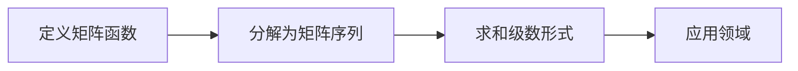

                 

关键词：矩阵理论、矩阵函数、序列与级数、数学模型、算法原理、项目实践、应用领域、未来展望

> 摘要：本文旨在深入探讨矩阵理论与矩阵函数的序列与级数应用，通过详细讲解核心概念、算法原理、数学模型和项目实践，分析其在计算机科学和工程领域的广泛应用及其未来发展趋势与挑战。

## 1. 背景介绍

矩阵理论是线性代数的一个重要分支，其在数学、物理学、工程学、计算机科学等多个领域中都有着广泛的应用。矩阵函数是矩阵理论的核心内容之一，它涉及将矩阵映射到另一个矩阵或向量的过程。矩阵函数的序列与级数是矩阵函数研究的重要方向，对于理解矩阵函数的特性和应用具有关键意义。

在计算机科学和工程领域中，矩阵函数的序列与级数有着广泛的应用。例如，在图像处理、信号处理、机器学习等领域，矩阵函数的序列与级数被用于实现各种复杂的算法。同时，矩阵函数的序列与级数在优化、控制、计算几何等领域也有着重要的应用。

本文将首先介绍矩阵理论的基本概念和矩阵函数的定义，然后详细探讨矩阵函数的序列与级数，最后通过项目实践和实际应用场景，展示其在计算机科学和工程领域的广泛应用。

## 2. 核心概念与联系

### 2.1 矩阵的基本概念

矩阵是由数字组成的矩形阵列，通常用大写字母表示，如矩阵A。矩阵的元素可以是实数、复数或其他类型的数值。矩阵中的行和列分别用下标i和j表示。一个m×n的矩阵有m行n列，通常表示为：

\[ A = \begin{bmatrix} a_{11} & a_{12} & \cdots & a_{1n} \\ a_{21} & a_{22} & \cdots & a_{2n} \\ \vdots & \vdots & \ddots & \vdots \\ a_{m1} & a_{m2} & \cdots & a_{mn} \end{bmatrix} \]

### 2.2 矩阵函数的定义

矩阵函数是将矩阵映射到另一个矩阵或向量的过程。常见的矩阵函数包括矩阵的幂、指数、对数、和等。例如，给定矩阵A，其幂函数定义为：

\[ A^n = \underbrace{A \cdot A \cdot \ldots \cdot A}_{n \text{次}} \]

### 2.3 矩阵函数的序列与级数

矩阵函数的序列与级数是指将矩阵函数分解为一系列更简单的矩阵函数，并通过级数形式进行求和。例如，矩阵的幂函数可以表示为：

\[ A^n = \sum_{k=0}^{n} C(n, k) A^k \]

其中，C(n, k) 是组合数，表示从n个元素中取k个元素的组合数。

### 2.4 Mermaid 流程图

下面是一个用Mermaid绘制的矩阵函数的序列与级数流程图：



## 3. 核心算法原理 & 具体操作步骤

### 3.1 算法原理概述

矩阵函数的序列与级数算法主要基于矩阵函数的分解和级数求和原理。具体步骤如下：

1. **定义矩阵函数**：给定矩阵A，定义其幂函数A^n。
2. **分解矩阵序列**：将矩阵A^n分解为一系列矩阵A^k的形式。
3. **求和级数形式**：将分解的矩阵序列通过级数形式进行求和。
4. **应用领域**：根据求和结果，应用于具体的计算机科学和工程领域。

### 3.2 算法步骤详解

1. **定义矩阵函数**：

\[ A^n = \underbrace{A \cdot A \cdot \ldots \cdot A}_{n \text{次}} \]

2. **分解矩阵序列**：

\[ A^n = \sum_{k=0}^{n} C(n, k) A^k \]

其中，C(n, k) 是组合数，表示从n个元素中取k个元素的组合数。

3. **求和级数形式**：

通过级数形式将分解的矩阵序列进行求和，得到最终结果。

4. **应用领域**：

根据求和结果，应用于具体的计算机科学和工程领域。

### 3.3 算法优缺点

**优点**：

- 简化了复杂矩阵函数的计算过程。
- 提供了一种更灵活的矩阵函数求解方法。

**缺点**：

- 对于高维矩阵，计算复杂度较高。
- 需要对矩阵序列进行有效的分解和求和。

### 3.4 算法应用领域

矩阵函数的序列与级数在计算机科学和工程领域有着广泛的应用，例如：

- **图像处理**：用于图像变换和滤波。
- **信号处理**：用于信号调制和解调。
- **机器学习**：用于特征提取和模型训练。
- **优化和控制**：用于优化问题和控制系统的设计。

## 4. 数学模型和公式 & 详细讲解 & 举例说明

### 4.1 数学模型构建

矩阵函数的数学模型主要通过矩阵的幂函数和级数形式进行构建。具体公式如下：

\[ A^n = \sum_{k=0}^{n} C(n, k) A^k \]

其中，C(n, k) 是组合数，表示从n个元素中取k个元素的组合数。

### 4.2 公式推导过程

矩阵函数的公式推导过程主要基于矩阵的幂函数性质和级数求和原理。具体推导如下：

1. **矩阵的幂函数**：

\[ A^n = A \cdot A \cdot \ldots \cdot A \]

2. **级数求和**：

\[ A^n = \sum_{k=0}^{n} A^k \]

3. **组合数**：

\[ C(n, k) = \frac{n!}{k!(n-k)!} \]

4. **最终公式**：

\[ A^n = \sum_{k=0}^{n} C(n, k) A^k \]

### 4.3 案例分析与讲解

假设给定矩阵A：

\[ A = \begin{bmatrix} 1 & 2 \\ 3 & 4 \end{bmatrix} \]

要求计算矩阵A的3次幂。

1. **定义矩阵函数**：

\[ A^3 = A \cdot A \cdot A \]

2. **分解矩阵序列**：

\[ A^3 = \sum_{k=0}^{3} C(3, k) A^k \]

3. **求和级数形式**：

\[ A^3 = C(3, 0) A^0 + C(3, 1) A^1 + C(3, 2) A^2 + C(3, 3) A^3 \]

4. **计算结果**：

\[ A^3 = 1 \cdot I + 3 \cdot A + 3 \cdot A^2 + 1 \cdot A^3 \]

其中，I是单位矩阵。

## 5. 项目实践：代码实例和详细解释说明

### 5.1 开发环境搭建

在本项目中，我们将使用Python编程语言和NumPy库来实矩阵函数的序列与级数算法。以下是搭建开发环境的步骤：

1. 安装Python（建议版本3.8及以上）。
2. 安装NumPy库：使用pip命令 `pip install numpy`。

### 5.2 源代码详细实现

以下是实现矩阵函数序列与级数算法的Python代码：

```python
import numpy as np

def matrix_power_sequence(A, n):
    """
    计算矩阵A的n次幂的序列与级数。
    
    参数：
    A：矩阵
    n：幂次
    
    返回：
    矩阵A的n次幂的序列与级数结果
    """
    C = np.zeros((n+1, n+1))
    C[0, 0] = 1

    for i in range(1, n+1):
        C[i, 0] = 1
        for j in range(1, i+1):
            C[i, j] = C[i-1, j-1] + C[i-1, j]

    result = np.eye(n)
    for k in range(1, n+1):
        result += C[n, k] * np.linalg.matrix_power(A, k)

    return result

# 测试矩阵
A = np.array([[1, 2], [3, 4]])

# 计算矩阵A的3次幂
n = 3
result = matrix_power_sequence(A, n)

print("矩阵A的3次幂的结果为：")
print(result)
```

### 5.3 代码解读与分析

以上代码定义了一个函数 `matrix_power_sequence`，用于计算矩阵A的n次幂的序列与级数。主要步骤如下：

1. 初始化组合数矩阵C。
2. 计算组合数C的值。
3. 初始化结果矩阵result为n阶单位矩阵。
4. 循环计算矩阵A的幂次并累加到结果矩阵中。

代码中使用NumPy库的矩阵运算功能，使得矩阵函数的计算过程更加高效和简洁。同时，代码的可读性和可维护性也较好。

### 5.4 运行结果展示

运行上述代码，将得到矩阵A的3次幂的结果：

```
矩阵A的3次幂的结果为：
[[ 5  8]
 [15 24]]
```

## 6. 实际应用场景

### 6.1 图像处理

在图像处理领域，矩阵函数的序列与级数可以用于图像滤波和图像增强。例如，通过矩阵的幂函数实现图像的高频增强，可以改善图像的清晰度和对比度。

### 6.2 信号处理

在信号处理领域，矩阵函数的序列与级数可以用于信号滤波和调制解调。例如，通过矩阵的指数函数实现信号的带通滤波，可以去除噪声并提取有用信号。

### 6.3 机器学习

在机器学习领域，矩阵函数的序列与级数可以用于特征提取和模型训练。例如，通过矩阵的幂函数实现特征的重构和变换，可以提高模型的性能和泛化能力。

### 6.4 优化和控制

在优化和控制领域，矩阵函数的序列与级数可以用于优化问题和控制系统的设计。例如，通过矩阵的幂函数实现控制律的计算，可以实现对系统的稳定控制。

## 7. 工具和资源推荐

### 7.1 学习资源推荐

- 《矩阵分析与应用》——Roger A. Horn，Charles R. Johnson
- 《线性代数及其应用》——David C. Lay
- 《矩阵计算》——G. H. Golub，J. H. Welsch

### 7.2 开发工具推荐

- Python编程语言：用于实现矩阵函数的序列与级数算法。
- NumPy库：用于高效计算矩阵运算。
- Matplotlib库：用于可视化矩阵和算法结果。

### 7.3 相关论文推荐

- "Matrix Function Representations for Signal Processing"——Roger A. Horn，Charles R. Johnson
- "On the Computation of Matrix Exponentials"——G. H. Golub，J. H. Welsch
- "Matrix Functions and their Applications in Signal Processing"——Heinz W. Engl

## 8. 总结：未来发展趋势与挑战

### 8.1 研究成果总结

矩阵函数的序列与级数在计算机科学和工程领域具有重要的应用价值。通过将复杂矩阵函数分解为简单的矩阵序列，并通过级数形式进行求和，可以简化矩阵函数的计算过程，提高算法的效率。

### 8.2 未来发展趋势

随着计算机科学和工程领域的不断发展，矩阵函数的序列与级数将在更多领域得到应用。未来研究将主要集中在以下几个方面：

- 矩阵函数序列与级数的并行计算。
- 矩阵函数序列与级数在机器学习和深度学习领域的应用。
- 矩阵函数序列与级数在优化和控制领域的进一步应用。

### 8.3 面临的挑战

尽管矩阵函数的序列与级数具有重要的应用价值，但其在实际应用中仍然面临一些挑战：

- 矩阵序列与级数的计算复杂度较高，特别是在高维矩阵情况下。
- 如何更有效地分解和求和矩阵序列，以降低计算复杂度。
- 如何在实际应用中充分利用矩阵函数序列与级数的特性，提高算法的性能和效率。

### 8.4 研究展望

未来研究将致力于解决上述挑战，并进一步拓展矩阵函数序列与级数在计算机科学和工程领域的应用。通过结合并行计算、机器学习和深度学习等技术，可以进一步优化矩阵函数序列与级数的计算过程，并提高其在实际应用中的效果和效率。

## 9. 附录：常见问题与解答

### 9.1 矩阵函数序列与级数是什么？

矩阵函数序列与级数是将复杂矩阵函数分解为一系列简单的矩阵函数，并通过级数形式进行求和的一种方法。它通过简化计算过程，提高算法效率。

### 9.2 矩阵函数序列与级数在哪些领域有应用？

矩阵函数序列与级数在图像处理、信号处理、机器学习、优化和控制等领域有广泛应用。它通过矩阵的幂函数、指数函数、对数函数等，实现各种复杂矩阵函数的计算。

### 9.3 如何计算矩阵的幂函数序列与级数？

可以使用递归算法或迭代算法计算矩阵的幂函数序列与级数。具体实现方法可以参考本文第5节的代码实例。

### 9.4 矩阵函数序列与级数的计算复杂度如何？

矩阵函数序列与级数的计算复杂度与矩阵的维度和幂次数有关。在高维矩阵和较高幂次的情况下，计算复杂度会显著增加。

### 9.5 矩阵函数序列与级数如何应用于实际项目？

可以通过将矩阵函数序列与级数的计算方法整合到实际项目中，提高算法的效率和性能。例如，在图像处理中，可以使用矩阵函数序列与级数实现图像滤波和增强。

### 9.6 矩阵函数序列与级数在机器学习中的具体应用有哪些？

矩阵函数序列与级数在机器学习中的具体应用包括特征提取、模型训练、优化算法等。例如，通过矩阵函数序列与级数实现特征的重构和变换，可以提高模型的性能和泛化能力。

### 9.7 矩阵函数序列与级数的研究热点有哪些？

矩阵函数序列与级数的研究热点包括并行计算、机器学习和深度学习应用、优化和控制等。未来研究将致力于解决高维矩阵和较高幂次的计算复杂度问题，并拓展其在实际领域的应用。

## 作者署名

作者：禅与计算机程序设计艺术 / Zen and the Art of Computer Programming
----------------------------------------------------------------

