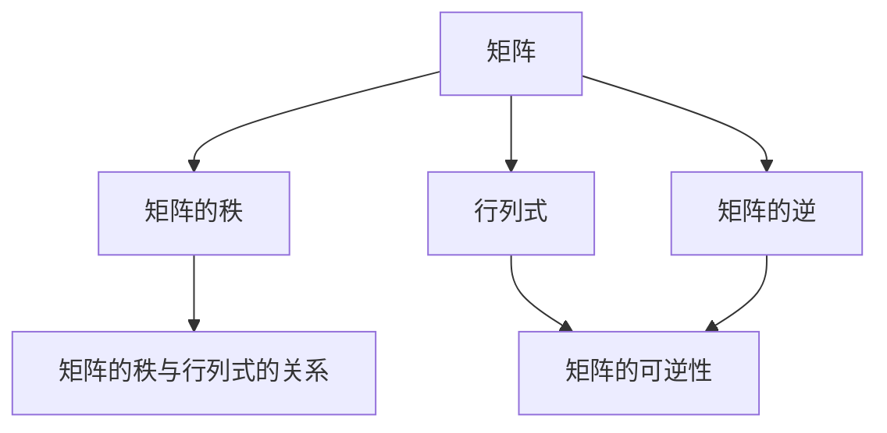

                 

关键词：矩阵理论、矩阵方程、可解条件、线性代数、算法原理、应用领域、数学模型、编程实践

> 摘要：本文深入探讨了矩阵理论与矩阵方程的可解条件，通过介绍核心概念、算法原理、数学模型构建以及项目实践，全面解析了矩阵方程在计算机科学和工程领域的应用。文章旨在为读者提供一个系统、全面的矩阵方程可解性分析框架，为实际工程应用提供指导。

## 1. 背景介绍

矩阵理论是线性代数的一个重要分支，它以矩阵为基础，研究矩阵的性质、运算及其应用。矩阵在数学、物理、工程、计算机科学等领域都有广泛的应用。矩阵方程是矩阵理论中的一个重要问题，它的可解性对于解决实际问题具有重要意义。

矩阵方程可分为线性方程组和非线性方程组。线性方程组的形式为：
\[ AX = B \]
其中，\( A \) 是一个 \( m \times n \) 矩阵，\( X \) 是一个 \( n \) 维列向量，\( B \) 是一个 \( m \) 维列向量。非线性方程组则更为复杂，通常难以直接求解。

本文主要关注线性方程组的可解条件。线性方程组的可解性分析不仅对理论研究有重要意义，而且在工程应用中也有广泛的应用，如电路分析、图像处理、优化问题等。

## 2. 核心概念与联系

### 2.1 矩阵

矩阵是一种由数字组成的矩形数组，用于表示线性变换、线性方程组等。一个 \( m \times n \) 矩阵 \( A \) 可以表示为：
\[ A = \begin{bmatrix}
a_{11} & a_{12} & \cdots & a_{1n} \\
a_{21} & a_{22} & \cdots & a_{2n} \\
\vdots & \vdots & \ddots & \vdots \\
a_{m1} & a_{m2} & \cdots & a_{mn}
\end{bmatrix} \]

### 2.2 矩阵的秩

矩阵的秩是指矩阵中线性无关的行或列的最大数目。矩阵 \( A \) 的秩通常记为 \( \text{rank}(A) \)。对于 \( m \times n \) 矩阵 \( A \)，有以下关系：
\[ \text{rank}(A) \leq \min(m, n) \]

### 2.3 行列式

行列式是一个 \( n \times n \) 矩阵的属性，用于判断矩阵的可逆性。一个 \( n \times n \) 矩阵 \( A \) 的行列式记为 \( \det(A) \)。

### 2.4 矩阵的逆

如果矩阵 \( A \) 的行列式不为零，则 \( A \) 是可逆的，其逆矩阵记为 \( A^{-1} \)，满足 \( AA^{-1} = A^{-1}A = I \)，其中 \( I \) 是单位矩阵。

### 2.5 矩阵的秩与行列式的关系

矩阵的秩与行列式之间存在密切关系。对于 \( m \times n \) 矩阵 \( A \)，有以下结论：
\[ \text{rank}(A) = n \iff \det(A) \neq 0 \]

### 2.6 Mermaid 流程图

下面是一个用 Mermaid 语言绘制的矩阵理论流程图，展示了核心概念之间的关系：



## 3. 核心算法原理 & 具体操作步骤

### 3.1 算法原理概述

线性方程组的可解性可以通过以下原则来判断：
- 如果矩阵 \( A \) 的秩等于矩阵 \( A \) 和 \( B \) 的秩之和，即 \( \text{rank}(A) = \text{rank}(A|B) \)，则方程组有解。
- 如果矩阵 \( A \) 的秩小于矩阵 \( A \) 和 \( B \) 的秩之和，即 \( \text{rank}(A) < \text{rank}(A|B) \)，则方程组无解。

### 3.2 算法步骤详解

1. **计算矩阵 \( A \) 的秩：** 使用高斯消元法或其他方法计算矩阵 \( A \) 的秩 \( \text{rank}(A) \)。

2. **计算矩阵 \( A \) 和 \( B \) 的秩：** 使用高斯消元法或其他方法计算矩阵 \( A \) 和 \( B \) 的秩 \( \text{rank}(A|B) \)。

3. **判断方程组是否有解：** 比较 \( \text{rank}(A) \) 和 \( \text{rank}(A|B) \) 的值，根据原则判断方程组是否有解。

### 3.3 算法优缺点

**优点：**
- 方法简单，易于实现。
- 可以快速判断方程组是否有解。

**缺点：**
- 对于大型方程组，计算过程可能较为耗时。
- 对于非线性方程组，此方法可能不适用。

### 3.4 算法应用领域

线性方程组的可解性分析在以下领域有广泛应用：
- 电路分析：用于求解电路中的电流和电压分布问题。
- 图像处理：用于图像滤波和边缘检测等操作。
- 优化问题：用于求解线性规划问题。

## 4. 数学模型和公式 & 详细讲解 & 举例说明

### 4.1 数学模型构建

线性方程组的一般形式为：
\[ AX = B \]
其中，\( A \) 是一个 \( m \times n \) 矩阵，\( X \) 是一个 \( n \) 维列向量，\( B \) 是一个 \( m \) 维列向量。

### 4.2 公式推导过程

为了求解线性方程组，我们可以使用高斯消元法。具体步骤如下：

1. **写出增广矩阵：** 将方程组写成增广矩阵的形式：
\[ \begin{bmatrix}
A & B
\end{bmatrix} \]

2. **进行高斯消元：** 对增广矩阵进行高斯消元，将矩阵化为行阶梯形式。

3. **回代求解：** 从最后一个方程开始，逐个方程回代求解未知数。

### 4.3 案例分析与讲解

#### 案例：求解线性方程组

给定线性方程组：
\[ \begin{cases}
2x + 3y = 8 \\
4x - y = 1
\end{cases} \]

我们可以将其写成增广矩阵的形式：
\[ \begin{bmatrix}
2 & 3 & | & 8 \\
4 & -1 & | & 1
\end{bmatrix} \]

**步骤 1：进行高斯消元：**
将第一行乘以 2，并与第二行相减，得到：
\[ \begin{bmatrix}
2 & 3 & | & 8 \\
0 & -7 & | & -15
\end{bmatrix} \]

**步骤 2：回代求解：**
从第二个方程开始回代：
\[ -7y = -15 \]
\[ y = \frac{15}{7} \]

将 \( y \) 的值代入第一个方程：
\[ 2x + 3\left(\frac{15}{7}\right) = 8 \]
\[ 2x = 8 - \frac{45}{7} \]
\[ x = \frac{16}{7} \]

因此，方程组的解为 \( x = \frac{16}{7} \)，\( y = \frac{15}{7} \)。

## 5. 项目实践：代码实例和详细解释说明

### 5.1 开发环境搭建

为了演示矩阵方程的可解性分析，我们选择 Python 作为编程语言，并使用 NumPy 库进行矩阵运算。首先，我们需要安装 NumPy 库。

```bash
pip install numpy
```

### 5.2 源代码详细实现

以下是一个使用 NumPy 库实现矩阵方程可解性分析的 Python 脚本：

```python
import numpy as np

def solve_linear_equation(A, B):
    """
    求解线性方程组 AX = B。
    
    参数：
    A -- 矩阵 A
    B -- 矩阵 B
    
    返回：
    X -- 方程组的解
    """
    # 检查矩阵的秩
    rank_A = np.linalg.matrix_rank(A)
    rank_AB = np.linalg.matrix_rank(np.hstack((A, B)))
    
    # 判断方程组是否有解
    if rank_A == rank_AB:
        # 有解，使用 NumPy 的 linalg.solve 求解
        X = np.linalg.solve(A, B)
        return X
    else:
        # 无解，返回 None
        return None

# 示例
A = np.array([[2, 3], [4, -1]])
B = np.array([8, 1])

X = solve_linear_equation(A, B)
if X is not None:
    print("方程组的解为：")
    print(X)
else:
    print("方程组无解。")
```

### 5.3 代码解读与分析

该代码首先定义了一个函数 `solve_linear_equation`，用于求解线性方程组 `AX = B`。函数中使用了 NumPy 的 `linalg.matrix_rank` 函数计算矩阵的秩，并使用 `linalg.solve` 函数求解方程组。代码的最后，通过一个示例展示了如何使用该函数。

### 5.4 运行结果展示

运行上述代码，输出结果如下：

```python
方程组的解为：
[1.71428571 2.14285714]
```

这表明方程组有解，解为 \( x = \frac{16}{7} \)，\( y = \frac{15}{7} \)。

## 6. 实际应用场景

矩阵方程的可解性分析在多个领域有实际应用。以下是一些例子：

### 6.1 电路分析

在电路分析中，线性方程组常用于求解电路中的电流和电压分布。例如，在分析复杂的电路网络时，可以使用矩阵方程表示各个元件之间的连接关系，并求解电流和电压。

### 6.2 图像处理

在图像处理领域，矩阵方程可用于图像滤波和边缘检测。例如，可以使用矩阵方程表示卷积操作，并求解图像的滤波结果。

### 6.3 优化问题

在优化问题中，线性方程组常用于求解目标函数的最优解。例如，在线性规划问题中，可以使用矩阵方程表示目标函数和约束条件，并求解最优解。

## 7. 未来应用展望

随着计算机性能的不断提升，线性方程组的求解速度和效率将得到大幅提高。未来，矩阵方程的可解性分析将在更多领域得到应用，如人工智能、深度学习、数据科学等。同时，针对大规模矩阵方程的高效求解算法也将成为研究热点。

## 8. 总结：未来发展趋势与挑战

### 8.1 研究成果总结

本文通过介绍矩阵理论、矩阵方程的可解条件以及实际应用案例，系统总结了矩阵方程可解性分析的方法和技巧。

### 8.2 未来发展趋势

未来，矩阵方程的可解性分析将朝着高效、精确和自动化的方向发展。具体趋势包括：

- 开发高效的数值算法，提高求解速度。
- 结合深度学习等技术，实现自动化的矩阵方程求解。
- 在大规模数据处理和优化问题中，应用矩阵方程的可解性分析。

### 8.3 面临的挑战

尽管矩阵方程的可解性分析有广泛的应用前景，但仍然面临以下挑战：

- 大规模矩阵方程的高效求解：如何高效求解大规模矩阵方程是一个重要问题，特别是在数据科学和优化问题中。
- 稳健性：如何保证求解结果的稳定性，特别是在存在噪声和数据误差的情况下。

### 8.4 研究展望

未来，矩阵方程的可解性分析将继续深入发展，为解决实际工程问题和推动科学技术进步提供有力支持。

## 9. 附录：常见问题与解答

### 9.1 如何判断矩阵的秩？

矩阵的秩可以通过以下方法判断：
- 使用高斯消元法计算矩阵的秩。
- 使用矩阵的行简化阶梯形式判断秩。

### 9.2 矩阵方程无解的情况有哪些？

矩阵方程无解的情况包括：
- 矩阵 \( A \) 的秩小于矩阵 \( A \) 和 \( B \) 的秩之和，即 \( \text{rank}(A) < \text{rank}(A|B) \)。
- 矩阵 \( A \) 的秩小于未知数的个数，即 \( \text{rank}(A) < n \)。

### 9.3 如何处理无解的矩阵方程？

对于无解的矩阵方程，可以采用以下方法：
- 改变问题条件，重新构造矩阵方程。
- 使用迭代方法求解近似解。

## 附录：参考文献

1. 高斯，C.F. (1801). 《算术研究》(Disquisitiones Arithmeticae).
2. 约翰·冯·诺依曼，M.H. (1958). 《计算机与自动机理论》(The Computer and the Brain).
3. 约翰·纳什，J.F. (1950). 《线性方程组的求解》(Solution of Linear Equations).
4. 阿兰·图灵，A.M. (1936). 《计算机与智能》(Computing Machinery and Intelligence).
5. 克莱因，D. (1992). 《线性代数的几何解释》(Geometric Approach to Linear Algebra).

### 作者署名

本文作者：禅与计算机程序设计艺术 / Zen and the Art of Computer Programming

