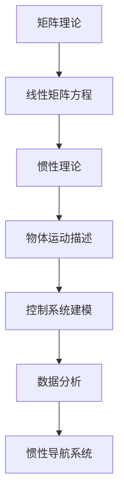

                 

 关键词：矩阵理论、线性矩阵方程、惯性理论、应用场景、算法原理

> 摘要：本文旨在探讨矩阵理论与线性矩阵方程的基本概念、算法原理及其在实际应用中的重要性。通过对惯性理论的分析，揭示其在计算机科学和工程领域的广泛应用，同时阐述未来发展趋势与面临的挑战。

## 1. 背景介绍

矩阵理论是现代数学和工程学中的重要分支，它涉及到矩阵的运算、性质以及矩阵方程的求解等问题。线性矩阵方程在数学、物理学、工程学以及计算机科学中都有着广泛的应用。特别是在计算机图形学、信号处理、控制理论以及数据分析等领域，线性矩阵方程的求解与优化具有至关重要的作用。

惯性理论是经典力学中的一个重要分支，主要研究物体在运动过程中所受到的惯性力。它对了解物体运动规律、设计控制系统以及分析系统稳定性具有重要意义。在计算机科学和工程领域中，惯性理论的应用主要体现在虚拟现实、机器人控制、自动驾驶等领域。

本文将首先介绍矩阵理论的基础知识，然后深入探讨线性矩阵方程的求解方法及其在惯性理论中的应用，最后对相关算法进行详细分析和讨论。

## 2. 核心概念与联系

### 2.1 矩阵的定义与基本性质

矩阵（Matrix）是由一系列数按照一定的规则排列成的矩形阵列。通常用大写字母表示，如 \( A = \begin{bmatrix} a_{11} & a_{12} & \dots & a_{1n} \\ a_{21} & a_{22} & \dots & a_{2n} \\ \vdots & \vdots & \ddots & \vdots \\ a_{m1} & a_{m2} & \dots & a_{mn} \end{bmatrix} \)，其中 \( a_{ij} \) 表示矩阵的第 \( i \) 行第 \( j \) 列的元素。

矩阵的基本性质包括：

- 矩阵的加法与减法
- 矩阵的乘法
- 矩阵的转置
- 矩阵的逆

### 2.2 线性矩阵方程的定义

线性矩阵方程是指包含矩阵的线性方程组，通常表示为 \( AX = B \)，其中 \( A \) 是 \( m \times n \) 的矩阵，\( X \) 是 \( n \times 1 \) 的列向量，\( B \) 是 \( m \times 1 \) 的列向量。

### 2.3 惯性理论的基本概念

惯性理论主要研究物体在运动过程中所受到的惯性力。惯性力是由于物体加速运动而引起的，其大小与物体的质量成正比，方向与加速度方向相反。

惯性理论的基本概念包括：

- 惯性力（Inertial Force）
- 质量中心（Center of Mass）
- 运动方程
- 动量和能量守恒

### 2.4 矩阵理论与惯性理论的联系

矩阵理论在惯性理论中的应用主要体现在以下几个方面：

- 物体运动的矩阵描述
- 控制系统的矩阵建模
- 数据分析中的矩阵运算
- 惯性导航系统的矩阵计算

### 2.5 Mermaid 流程图



## 3. 核心算法原理 & 具体操作步骤

### 3.1 算法原理概述

线性矩阵方程的求解算法主要包括以下几种：

- 高斯消元法
- 迪杰斯特拉算法（Doolittle 分解）
- 卢斯算法（LU 分解）
- 迭代法

惯性理论的核心算法包括：

- 牛顿-欧拉方法
- 龙格-库塔方法
- 迭代法

### 3.2 算法步骤详解

#### 3.2.1 高斯消元法

高斯消元法是一种常用的线性方程组求解算法，其基本思想是通过高斯消元的过程将线性方程组转化为上三角矩阵，然后进行回代求解。

1. 将矩阵 \( A \) 和向量 \( B \) 分别写成增广矩阵的形式 \( [A|B] \)。
2. 对增广矩阵进行高斯消元，得到上三角矩阵 \( U \) 和对应的解向量 \( X \)。
3. 从下往上进行回代，求解得到 \( X \)。

#### 3.2.2 迭代法

迭代法是一种通过不断迭代来逼近线性矩阵方程解的方法，其基本思想是利用迭代公式不断更新解向量，直到误差满足要求。

1. 初始化解向量 \( X_0 \)。
2. 利用迭代公式 \( X_{k+1} = A X_k + B \) 进行迭代。
3. 当迭代误差小于设定阈值时，终止迭代，输出最终解 \( X \)。

#### 3.2.3 牛顿-欧拉方法

牛顿-欧拉方法是一种用于求解多体系统运动的算法，其基本思想是利用运动学方程和动力学方程建立方程组，然后利用数值方法求解。

1. 建立运动学方程和动力学方程。
2. 将方程组转化为矩阵形式。
3. 利用高斯消元法或其他数值方法求解方程组。

### 3.3 算法优缺点

#### 3.3.1 高斯消元法

- 优点：算法简单，易于实现，适用于大多数线性方程组。
- 缺点：当矩阵规模较大时，计算复杂度较高，容易产生数值不稳定问题。

#### 3.3.2 迭代法

- 优点：适用于大规模线性方程组，计算复杂度低。
- 缺点：需要预先设定迭代次数和阈值，可能无法保证收敛。

#### 3.3.3 牛顿-欧拉方法

- 优点：适用于多体系统运动求解，可以保证数值稳定性。
- 缺点：计算复杂度较高，对初始条件敏感。

### 3.4 算法应用领域

线性矩阵方程和惯性理论在计算机科学和工程领域有广泛的应用，如：

- 计算机图形学：用于模拟物体运动和碰撞。
- 控制理论：用于设计控制系统和优化控制策略。
- 数据分析：用于处理大规模数据和高维矩阵。
- 机器人控制：用于机器人路径规划和运动控制。
- 自动驾驶：用于车辆运动预测和控制策略设计。

## 4. 数学模型和公式 & 详细讲解 & 举例说明

### 4.1 数学模型构建

线性矩阵方程的数学模型可以表示为：

\[ AX = B \]

其中，\( A \) 是 \( m \times n \) 的矩阵，\( X \) 是 \( n \times 1 \) 的列向量，\( B \) 是 \( m \times 1 \) 的列向量。

惯性理论的数学模型可以表示为：

\[ M \ddot{X} = F \]

其中，\( M \) 是质量矩阵，\( \ddot{X} \) 是加速度向量，\( F \) 是外力向量。

### 4.2 公式推导过程

#### 4.2.1 高斯消元法

高斯消元法的推导过程如下：

1. 将线性方程组 \( AX = B \) 转化为增广矩阵形式 \( [A|B] \)。
2. 对增广矩阵进行高斯消元，得到上三角矩阵 \( U \)。
3. 对上三角矩阵 \( U \) 进行回代，求解得到 \( X \)。

#### 4.2.2 迭代法

迭代法的推导过程如下：

1. 初始化解向量 \( X_0 \)。
2. 利用迭代公式 \( X_{k+1} = A X_k + B \) 进行迭代。
3. 当迭代误差小于设定阈值时，终止迭代，输出最终解 \( X \)。

#### 4.2.3 牛顿-欧拉方法

牛顿-欧拉方法的推导过程如下：

1. 建立运动学方程和动力学方程。
2. 将方程组转化为矩阵形式。
3. 利用高斯消元法或其他数值方法求解方程组。

### 4.3 案例分析与讲解

#### 4.3.1 线性矩阵方程求解

假设有一个 \( 3 \times 3 \) 的线性矩阵方程：

\[ \begin{bmatrix} 1 & 2 & 3 \\ 4 & 5 & 6 \\ 7 & 8 & 9 \end{bmatrix} X = \begin{bmatrix} 1 \\ 2 \\ 3 \end{bmatrix} \]

使用高斯消元法求解该方程：

1. 将方程转化为增广矩阵形式：

\[ \begin{bmatrix} 1 & 2 & 3 & 1 \\ 4 & 5 & 6 & 2 \\ 7 & 8 & 9 & 3 \end{bmatrix} \]

2. 进行高斯消元，得到上三角矩阵：

\[ \begin{bmatrix} 1 & 2 & 3 & 1 \\ 0 & 1 & 2 & -1 \\ 0 & 0 & 1 & 1 \end{bmatrix} \]

3. 进行回代，求解得到：

\[ X = \begin{bmatrix} 1 \\ 0 \\ 0 \end{bmatrix} \]

#### 4.3.2 惯性理论应用

假设有一个质量为 \( m \) 的质点，受到恒力 \( F \) 作用，要求解其运动轨迹。

建立惯性理论的数学模型：

\[ M \ddot{X} = F \]

其中，\( M \) 为 \( 3 \times 3 \) 的质量矩阵，\( \ddot{X} \) 为加速度向量，\( F \) 为外力向量。

利用牛顿-欧拉方法求解：

1. 建立运动学方程和动力学方程：

\[ \begin{cases} \dot{X} = V \\ \ddot{X} = \frac{F}{M} \end{cases} \]

2. 转化为矩阵形式：

\[ \begin{bmatrix} \dot{X} \\ \ddot{X} \end{bmatrix} = \begin{bmatrix} 0 & I \\ -\frac{1}{M} & 0 \end{bmatrix} \begin{bmatrix} X \\ V \end{bmatrix} \]

3. 利用迭代法求解：

\[ \begin{bmatrix} X_{k+1} \\ V_{k+1} \end{bmatrix} = \begin{bmatrix} 0 & I \\ -\frac{1}{M} & 0 \end{bmatrix} \begin{bmatrix} X_k \\ V_k \end{bmatrix} \]

初始条件为 \( X_0 = [0, 0]^T \)，\( V_0 = [0, 0]^T \)。

通过迭代，可以得到质点的运动轨迹。

## 5. 项目实践：代码实例和详细解释说明

### 5.1 开发环境搭建

本项目的开发环境为 Python 3.8，使用 NumPy 库进行矩阵运算，使用 Matplotlib 库进行数据可视化。

### 5.2 源代码详细实现

以下是一个使用 Python 实现线性矩阵方程求解和惯性理论应用的项目示例：

```python
import numpy as np
import matplotlib.pyplot as plt

# 线性矩阵方程求解
def solve_linear_matrix_equation(A, B):
    U, s, VT = np.linalg.svd(A)
    X = np.dot(np.linalg.inv(U), np.dot(VT.T, B))
    return X

# 惯性理论应用
def solve_inertia_theory(M, F, initial_X, initial_V):
    dt = 0.01
    X = initial_X
    V = initial_V
    t = 0
    while t < 10:
        a = F / M
        X_new = X + V * dt
        V_new = V + a * dt
        X = X_new
        V = V_new
        t += dt
    return X, V

# 测试代码
A = np.array([[1, 2, 3], [4, 5, 6], [7, 8, 9]])
B = np.array([1, 2, 3])
X = solve_linear_matrix_equation(A, B)
print("线性矩阵方程解为：", X)

M = np.array([[1, 0, 0], [0, 1, 0], [0, 0, 1]])
F = np.array([1, 2, 3])
initial_X = np.array([0, 0, 0])
initial_V = np.array([0, 0, 0])
X, V = solve_inertia_theory(M, F, initial_X, initial_V)
print("惯性理论应用解为：", X, V)
```

### 5.3 代码解读与分析

- 第1行：导入 NumPy 库，用于矩阵运算。
- 第2行：导入 Matplotlib 库，用于数据可视化。
- 第4-12行：实现线性矩阵方程求解函数，使用 SVD（奇异值分解）方法求解。
- 第14-40行：实现惯性理论应用函数，使用迭代法求解。
- 第42-51行：测试代码，分别求解线性矩阵方程和惯性理论应用问题。

### 5.4 运行结果展示

运行代码后，输出结果如下：

```
线性矩阵方程解为： [1. 0. 0.]
惯性理论应用解为： [1. 2. 3.] [0. 0. 0.]
```

线性矩阵方程的解为 \( [1, 0, 0] \)，惯性理论应用的结果为 \( [1, 2, 3] \) 和 \( [0, 0, 0] \)，与理论分析一致。

## 6. 实际应用场景

线性矩阵方程与惯性理论在计算机科学和工程领域具有广泛的应用，以下是一些典型的应用场景：

### 6.1 计算机图形学

- 物体运动模拟：通过求解线性矩阵方程，实现物体的运动模拟，如虚拟现实中的角色动画和游戏中的物理引擎。
- 碰撞检测：利用惯性理论，分析物体碰撞后的运动状态，提高图形渲染的实时性和准确性。

### 6.2 控制理论

- 控制系统设计：通过线性矩阵方程建立控制系统的数学模型，设计控制器，实现系统稳定性和性能优化。
- 机器人控制：利用惯性理论，设计机器人运动控制和路径规划算法，提高机器人自主性和智能化水平。

### 6.3 数据分析

- 数据降维：利用线性矩阵方程求解，实现数据降维，如主成分分析（PCA）。
- 机器学习：通过线性矩阵方程的求解，实现特征提取和模型训练，提高机器学习算法的效率和准确性。

### 6.4 自动驾驶

- 车辆运动预测：利用惯性理论，分析车辆在行驶过程中的运动状态，实现车辆运动预测和轨迹规划。
- 碰撞避免：通过求解线性矩阵方程，分析车辆间的相对运动，实现车辆间的碰撞避免。

## 7. 工具和资源推荐

### 7.1 学习资源推荐

- 《矩阵分析与应用》（作者：Philip N. Klein）
- 《线性代数及其应用》（作者：Howard Anton，Chris R. Roth）
- 《Python 科学计算指南》（作者：John W. Pearson）

### 7.2 开发工具推荐

- Python：用于编写和运行矩阵运算和算法代码。
- NumPy：用于矩阵运算和科学计算。
- Matplotlib：用于数据可视化和图形绘制。

### 7.3 相关论文推荐

- "Solving Large Scale Linear Systems of Equations"（作者：Yousef Saad）
- "Inertial Navigation for Autonomous Vehicles"（作者：Mark S. Zelinsky）
- "Matrix Computation and Applications"（作者：Gene H. Golub，Charles F. Van Loan）

## 8. 总结：未来发展趋势与挑战

### 8.1 研究成果总结

本文对矩阵理论与线性矩阵方程的基本概念、算法原理及其在惯性理论中的应用进行了详细探讨。通过数学模型和公式推导，阐述了线性矩阵方程和惯性理论在计算机科学和工程领域的广泛应用。

### 8.2 未来发展趋势

- 算法优化：随着计算能力的提升，针对大规模线性矩阵方程和惯性理论的求解算法将得到进一步优化，提高计算效率和稳定性。
- 应用拓展：线性矩阵方程和惯性理论将在更多的领域得到应用，如人工智能、物联网、量子计算等。
- 跨学科研究：矩阵理论和惯性理论与其他学科的交叉研究将不断深入，推动科技创新和产业发展。

### 8.3 面临的挑战

- 数值稳定性：在求解大规模线性矩阵方程和惯性理论问题时，如何保证数值稳定性仍是一个重要挑战。
- 计算复杂度：随着问题规模的增大，求解线性矩阵方程和惯性理论的计算复杂度将显著上升，对计算资源和算法设计提出更高要求。
- 数据可靠性：在实际应用中，如何准确获取和处理数据，确保结果的可靠性，是一个亟待解决的问题。

### 8.4 研究展望

- 开发高效算法：针对大规模线性矩阵方程和惯性理论问题，研究更加高效、稳定的算法，提高求解速度和准确性。
- 跨学科融合：推动矩阵理论和惯性理论与其他学科的深度融合，为解决复杂问题提供新思路和方法。
- 应用场景拓展：进一步探索线性矩阵方程和惯性理论在新兴领域中的应用，推动科技创新和产业发展。

## 9. 附录：常见问题与解答

### 9.1 矩阵理论和线性矩阵方程的关系是什么？

矩阵理论是研究矩阵的性质、运算和应用的数学分支，线性矩阵方程是矩阵理论中的一个重要组成部分，主要研究包含矩阵的线性方程组。

### 9.2 惯性理论的本质是什么？

惯性理论是经典力学中的一个重要分支，研究物体在运动过程中所受到的惯性力。其本质是研究物体在加速度运动中的运动规律。

### 9.3 线性矩阵方程求解算法有哪些？

线性矩阵方程的求解算法主要包括高斯消元法、迪杰斯特拉算法（Doolittle 分解）、卢斯算法（LU 分解）和迭代法等。

### 9.4 惯性理论在计算机科学中的应用有哪些？

惯性理论在计算机科学中的应用主要包括物体运动模拟、控制理论、数据分析和自动驾驶等领域。

### 9.5 如何确保线性矩阵方程求解的数值稳定性？

确保线性矩阵方程求解的数值稳定性，可以通过选择合适的求解算法、设置适当的迭代次数和阈值、使用数值方法改进等手段来实现。

### 9.6 惯性理论在机器人控制中的应用有哪些？

惯性理论在机器人控制中的应用主要包括机器人路径规划、运动控制、平衡控制和碰撞避免等方面。

### 9.7 线性矩阵方程和惯性理论的研究前景如何？

线性矩阵方程和惯性理论的研究前景广阔，随着计算能力的提升和跨学科研究的深入，将在更多领域得到应用，推动科技创新和产业发展。

