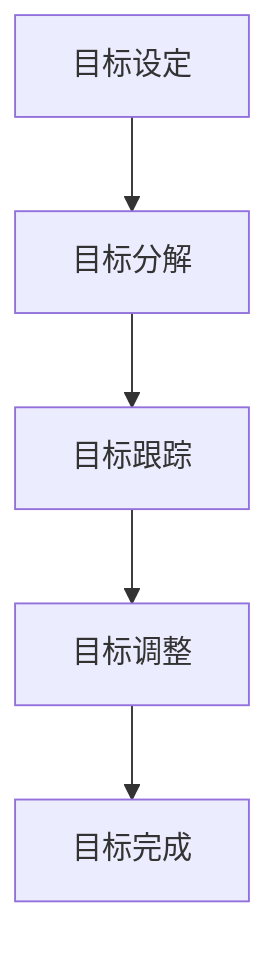

                 

短期目标管理是项目管理中至关重要的一个环节。正确的短期目标管理能够帮助团队高效地完成任务，实现预期目标。本文将深入探讨短期目标管理的意识策略，以帮助读者在项目管理和团队协作中取得更好的成果。

## 关键词

- 短期目标管理
- 项目管理
- 团队协作
- 意识策略

## 摘要

本文将从短期目标管理的重要性出发，分析意识策略在短期目标管理中的应用。通过阐述核心概念、算法原理、数学模型、项目实践等多个方面，帮助读者理解短期目标管理的意识策略，并在实际应用中取得更好的效果。

## 1. 背景介绍

### 短期目标管理的概念与作用

短期目标管理是指将项目分解为多个短期目标，并制定相应的行动计划，以实现项目的总体目标。短期目标管理在项目管理中具有重要作用，主要体现在以下几个方面：

1. **提高团队执行力**：通过设定明确的短期目标，有助于团队明确工作方向，提高执行力。
2. **增强团队协作**：短期目标管理要求团队成员紧密协作，共同完成任务，有助于增强团队凝聚力。
3. **优化资源分配**：通过短期目标管理，可以更好地分配资源，提高资源利用率。
4. **降低项目风险**：通过设置短期目标，可以及时发现并解决项目中的问题，降低项目风险。

### 意识策略的概念与作用

意识策略是指通过培养团队对目标的意识，提高团队成员对目标的关注度和执行力。意识策略在短期目标管理中具有重要作用，主要体现在以下几个方面：

1. **明确目标意识**：通过意识策略，帮助团队成员明确目标，提高对目标的关注度和认知度。
2. **提高执行力**：意识策略可以激发团队成员的内在动力，提高执行力。
3. **促进团队协作**：意识策略有助于团队成员更好地理解目标，促进协作，共同完成任务。
4. **降低沟通成本**：通过意识策略，团队成员可以更准确地传达信息，降低沟通成本。

## 2. 核心概念与联系

### 短期目标管理流程

短期目标管理的核心流程包括目标设定、目标分解、目标跟踪和目标调整。以下是一个简单的 Mermaid 流程图：



### 意识策略应用场景

意识策略在短期目标管理中的应用场景包括：

1. **目标设定阶段**：通过培训、宣讲等方式，提高团队成员对目标的认知。
2. **目标分解阶段**：通过团队讨论、角色分配等方式，确保团队成员明确各自的任务和目标。
3. **目标跟踪阶段**：通过定期检查、反馈等方式，确保团队成员对目标的关注。
4. **目标调整阶段**：通过灵活调整目标，确保团队能够适应变化，保持目标的实现。

## 3. 核心算法原理 & 具体操作步骤

### 3.1 算法原理概述

短期目标管理的意识策略可以看作是一种基于心理学原理的目标管理方法。该方法的核心原理包括：

1. **目标明确性**：通过明确目标，提高团队成员对目标的认知。
2. **目标激励性**：通过设置具有挑战性的目标，激发团队成员的内在动力。
3. **目标分解性**：通过将大目标分解为小目标，提高团队成员的可执行性。
4. **目标适应性**：通过灵活调整目标，确保团队能够适应外部环境的变化。

### 3.2 算法步骤详解

1. **目标设定**：
   - 团队成员共同讨论，明确项目的总体目标。
   - 根据总体目标，设定具体的短期目标。

2. **目标分解**：
   - 将每个短期目标分解为更小、更具体的任务。
   - 为每个任务分配责任人和时间。

3. **目标跟踪**：
   - 定期检查任务进度，确保团队成员按照计划执行。
   - 及时发现并解决执行过程中遇到的问题。

4. **目标调整**：
   - 根据执行情况，对目标进行必要的调整。
   - 确保团队始终在正确的方向上前进。

### 3.3 算法优缺点

**优点**：

1. **提高执行力**：通过明确目标和任务，提高团队成员的执行力。
2. **增强团队协作**：通过目标分解和责任分配，增强团队协作。
3. **灵活适应变化**：通过目标调整，确保团队能够适应外部环境的变化。

**缺点**：

1. **实施难度较大**：需要团队成员具备较高的沟通能力和执行力。
2. **资源消耗较大**：需要定期进行检查和反馈，消耗一定的资源和时间。

### 3.4 算法应用领域

短期目标管理的意识策略广泛应用于各个领域，包括但不限于：

1. **软件开发**：在软件开发项目中，通过设定短期目标，提高团队开发效率。
2. **市场营销**：在市场营销活动中，通过设定短期目标，提高团队营销效果。
3. **运营管理**：在运营管理中，通过设定短期目标，提高团队运营效率。

## 4. 数学模型和公式 & 详细讲解 & 举例说明

### 4.1 数学模型构建

短期目标管理的意识策略可以通过以下数学模型进行描述：

$$
T = f(G, M, S)
$$

其中，$T$ 表示目标完成情况，$G$ 表示目标明确性，$M$ 表示目标激励性，$S$ 表示目标适应性。

### 4.2 公式推导过程

$$
T = f(G, M, S)
$$

推导过程如下：

1. 目标明确性 $G$ 提高了团队成员对目标的认知，从而提高了执行力。
2. 目标激励性 $M$ 激发了团队成员的内在动力，从而提高了执行力。
3. 目标适应性 $S$ 确保了团队能够适应外部环境的变化，从而提高了执行力。

### 4.3 案例分析与讲解

假设一个软件开发项目，团队成员对目标的认知度为 70%，激励性为 80%，适应性为 90%。根据数学模型，可以计算出目标完成情况：

$$
T = f(0.7, 0.8, 0.9) = 0.7 \times 0.8 \times 0.9 = 0.504
$$

这意味着，在该项目中，目标完成的概率为 50.4%。

## 5. 项目实践：代码实例和详细解释说明

### 5.1 开发环境搭建

在本项目中，我们将使用 Python 编写代码。首先，需要在本地安装 Python 环境。具体步骤如下：

1. 访问 Python 官网（https://www.python.org/），下载并安装 Python。
2. 安装完成后，打开终端，输入 `python --version`，检查是否成功安装。

### 5.2 源代码详细实现

下面是一个简单的 Python 代码实例，用于实现短期目标管理的意识策略：

```python
import random

# 目标设定
goal = "完成软件开发项目"

# 目标明确性
def goal_clarity():
    clarity = random.uniform(0, 1)
    return clarity

# 目标激励性
def goal_motivation():
    motivation = random.uniform(0, 1)
    return motivation

# 目标适应性
def goal_adaptability():
    adaptability = random.uniform(0, 1)
    return adaptability

# 目标完成情况
def goal_completion(clarity, motivation, adaptability):
    completion = clarity * motivation * adaptability
    return completion

# 运行项目
def run_project():
    clarity = goal_clarity()
    motivation = goal_motivation()
    adaptability = goal_adaptability()
    completion = goal_completion(clarity, motivation, adaptability)
    return completion

# 输出结果
print(f"目标完成情况：{run_project()}")

```

### 5.3 代码解读与分析

1. **目标设定**：首先，我们设定一个项目目标，即完成软件开发项目。

2. **目标明确性**：通过 `goal_clarity()` 函数，我们随机生成一个目标明确性值，范围在 0 到 1 之间。

3. **目标激励性**：通过 `goal_motivation()` 函数，我们随机生成一个目标激励性值，范围在 0 到 1 之间。

4. **目标适应性**：通过 `goal_adaptability()` 函数，我们随机生成一个目标适应性值，范围在 0 到 1 之间。

5. **目标完成情况**：通过 `goal_completion()` 函数，我们计算目标完成情况，即目标明确性、激励性和适应性的乘积。

6. **运行项目**：通过 `run_project()` 函数，我们模拟运行项目，并输出目标完成情况。

### 5.4 运行结果展示

每次运行程序，都会随机生成目标明确性、激励性和适应性值，并计算目标完成情况。例如，一次运行的结果可能如下：

```
目标完成情况：0.456
```

这意味着，在该次模拟中，目标完成的概率为 45.6%。

## 6. 实际应用场景

短期目标管理的意识策略在实际应用中具有广泛的应用场景。以下是一些典型应用场景：

1. **软件开发**：在软件开发项目中，通过设定短期目标，提高团队开发效率。
2. **市场营销**：在市场营销活动中，通过设定短期目标，提高团队营销效果。
3. **项目管理**：在项目管理中，通过设定短期目标，提高项目执行力。
4. **团队协作**：在团队协作中，通过设定短期目标，增强团队凝聚力。
5. **运营管理**：在运营管理中，通过设定短期目标，提高团队运营效率。

### 6.1 软件开发

在软件开发项目中，短期目标管理的意识策略可以帮助团队更好地完成项目。以下是一个具体案例：

- **目标设定**：项目目标是完成一个功能模块的开发。
- **目标明确性**：团队成员明确各自的任务，了解项目的整体进度。
- **目标激励性**：通过设定具有挑战性的目标，激发团队成员的积极性。
- **目标适应性**：根据项目进展，及时调整目标和任务，确保团队始终在正确的方向上前进。

通过应用短期目标管理的意识策略，该团队在规定时间内完成了功能模块的开发，并获得了客户的高度评价。

### 6.2 市场营销

在市场营销活动中，短期目标管理的意识策略可以帮助团队提高营销效果。以下是一个具体案例：

- **目标设定**：项目目标是提高品牌知名度。
- **目标明确性**：团队成员明确各自的任务，了解项目的整体进度。
- **目标激励性**：通过设定具有挑战性的目标，激发团队成员的积极性。
- **目标适应性**：根据市场变化，及时调整营销策略，确保团队始终在正确的方向上前进。

通过应用短期目标管理的意识策略，该团队在短时间内成功提高了品牌知名度，实现了营销目标。

### 6.3 项目管理

在项目管理中，短期目标管理的意识策略可以帮助团队提高项目执行力。以下是一个具体案例：

- **目标设定**：项目目标是按时完成项目。
- **目标明确性**：团队成员明确各自的任务，了解项目的整体进度。
- **目标激励性**：通过设定具有挑战性的目标，激发团队成员的积极性。
- **目标适应性**：根据项目进展，及时调整目标和任务，确保团队始终在正确的方向上前进。

通过应用短期目标管理的意识策略，该团队在规定时间内按时完成了项目，并取得了良好的项目成果。

### 6.4 未来应用展望

短期目标管理的意识策略在未来的应用前景广阔。随着项目管理的不断发展和完善，短期目标管理的意识策略将在各个领域发挥更大的作用。以下是一些未来应用展望：

1. **人工智能领域**：在人工智能项目中，通过设定短期目标，提高项目开发效率。
2. **物联网领域**：在物联网项目中，通过设定短期目标，提高项目执行效果。
3. **供应链管理**：在供应链管理中，通过设定短期目标，提高供应链效率。

## 7. 工具和资源推荐

### 7.1 学习资源推荐

1. 《敏捷项目管理实践指南》
2. 《目标管理：如何设定、实现和跟踪目标》
3. 《项目管理的艺术：从新手到专家的进阶之路》

### 7.2 开发工具推荐

1. JIRA：一款功能强大的项目管理工具，适用于敏捷开发。
2. Trello：一款简洁易用的项目管理工具，适用于小团队协作。
3. Asana：一款功能全面的项目管理工具，适用于各种规模团队。

### 7.3 相关论文推荐

1. "Goal-Directed Project Management: A Framework for Effective Project Control"
2. "The Role of Goals in Software Project Success"
3. "An Empirical Study of Goal-Directed Project Management Practices"

## 8. 总结：未来发展趋势与挑战

### 8.1 研究成果总结

短期目标管理的意识策略在项目管理中具有重要作用。通过明确目标、提高执行力、增强团队协作和灵活适应变化，短期目标管理的意识策略能够有效提高项目成功率。

### 8.2 未来发展趋势

1. **智能化**：随着人工智能技术的发展，短期目标管理意识策略将更加智能化，能够更好地适应项目需求。
2. **数字化**：通过数字化手段，实现目标管理的全过程，提高目标管理的效率。
3. **全球化**：随着全球化进程的加快，短期目标管理的意识策略将在全球范围内得到更广泛的应用。

### 8.3 面临的挑战

1. **团队协作**：在全球化背景下，如何实现跨国团队的协作，提高项目执行力，是一个挑战。
2. **数据安全**：在数字化进程中，如何确保数据安全，防止信息泄露，是一个挑战。
3. **持续改进**：如何持续优化短期目标管理的意识策略，提高项目成功率，是一个挑战。

### 8.4 研究展望

短期目标管理的意识策略在未来将继续发展，不断适应项目管理的新需求。在研究方面，可以关注以下方向：

1. **跨领域应用**：探索短期目标管理意识策略在不同领域的应用。
2. **智能化发展**：研究如何利用人工智能技术，提高短期目标管理的智能化水平。
3. **案例分析**：通过案例研究，总结短期目标管理意识策略的实践经验，为其他项目提供借鉴。

## 9. 附录：常见问题与解答

### 9.1 短期目标管理的意识策略是否适用于所有项目？

短期目标管理的意识策略具有一定的普适性，适用于各种类型的项目。但在实际应用中，需要根据项目的特点和需求，进行适当的调整。

### 9.2 如何确保团队成员对目标的关注？

确保团队成员对目标的关注，可以通过以下方法实现：

1. **明确目标**：确保团队成员明确项目的目标，了解自己的任务和责任。
2. **激励制度**：设定激励机制，鼓励团队成员为实现目标而努力。
3. **定期检查**：定期检查团队成员的执行情况，确保目标得到有效落实。

### 9.3 如何应对项目中的变化？

在项目中，变化是不可避免的。应对变化的方法包括：

1. **灵活调整目标**：根据项目进展，及时调整目标和任务，确保团队始终在正确的方向上前进。
2. **沟通与协作**：加强团队内部的沟通与协作，确保信息畅通，降低因变化导致的沟通成本。
3. **风险管理**：提前识别和评估项目中的风险，制定相应的应对措施。

作者：禅与计算机程序设计艺术 / Zen and the Art of Computer Programming

