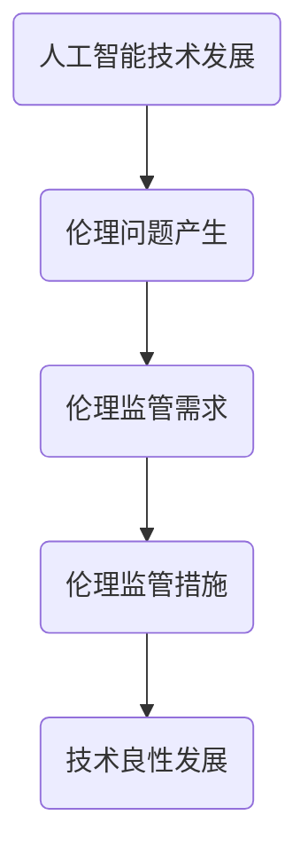

                 

关键词：人工智能，伦理监管，技术发展，硅谷，伦理问题，合规性，社会责任

<|assistant|>摘要：本文深入探讨了硅谷人工智能伦理监管的现状和重要性，分析了当前人工智能技术发展对伦理监管的需求，并提出了确保技术良性发展的监管框架。文章从核心概念、算法原理、数学模型、实践案例等多个维度展开，旨在为人工智能技术的伦理监管提供科学依据和指导。

## 1. 背景介绍

在过去的几十年里，人工智能（AI）技术取得了飞速发展，已经成为现代科技领域的核心驱动力。硅谷作为全球科技创新的中心，聚集了众多顶级的人工智能企业和研究机构，推动了人工智能技术的创新和应用。然而，随着人工智能技术的不断进步，伦理问题也日益凸显。

人工智能技术的快速发展给人类社会带来了诸多挑战，如隐私保护、算法偏见、就业影响等。如何在推动技术进步的同时，确保人工智能技术的合规性和社会责任，成为全球关注的焦点。硅谷作为人工智能技术的发源地，其伦理监管措施对于全球人工智能伦理监管具有重要的参考价值。

## 2. 核心概念与联系

### 2.1 人工智能伦理

人工智能伦理是指关于人工智能技术设计、开发、应用过程中所涉及到的伦理问题，包括但不限于隐私保护、算法偏见、自主决策等。人工智能伦理的核心目标是确保人工智能技术的发展符合人类社会的价值观和伦理标准。

### 2.2 伦理监管

伦理监管是指对人工智能技术的研发、应用过程进行监督和规范，以防止技术滥用和伦理风险。伦理监管可以采取政府主导、行业自律和社会监督等多种形式，其目的是确保人工智能技术的良性发展。

### 2.3 技术与伦理的关系

技术与伦理之间的关系是相互影响、相互促进的。人工智能技术的发展不仅带来了新的伦理问题，同时也为伦理监管提供了技术手段。例如，隐私保护技术可以帮助人工智能系统更好地保护用户隐私；而伦理监管可以确保人工智能技术在研发和应用过程中遵循伦理标准。

### 2.4 Mermaid 流程图



## 3. 核心算法原理 & 具体操作步骤

### 3.1 算法原理概述

人工智能伦理监管的核心算法原理主要涉及以下几个方面：

1. 数据安全与隐私保护：通过加密、脱敏等技术手段，确保用户数据的安全和隐私。
2. 算法公平性检测：采用统计学方法，检测算法是否存在偏见和不公平现象。
3. 自主决策伦理评估：通过伦理评估模型，对人工智能系统的决策过程进行伦理评价。

### 3.2 算法步骤详解

1. 数据采集与预处理：收集相关数据，并进行数据清洗、归一化等预处理操作。
2. 加密与脱敏：对用户数据进行加密和脱敏处理，确保数据安全。
3. 算法公平性检测：采用统计学方法，分析算法的输入输出关系，检测是否存在偏见和不公平现象。
4. 自主决策伦理评估：构建伦理评估模型，对人工智能系统的决策过程进行伦理评价。
5. 监管措施执行：根据伦理评估结果，采取相应的监管措施，如调整算法、限制应用等。

### 3.3 算法优缺点

算法优缺点如下：

1. 优点：
   - 提高数据安全与隐私保护水平。
   - 有助于消除算法偏见，提高算法公平性。
   - 为人工智能系统的伦理评估提供了科学依据。

2. 缺点：
   - 算法复杂性较高，实现难度大。
   - 可能存在误判和漏判现象。
   - 伦理评估模型本身可能存在伦理争议。

### 3.4 算法应用领域

算法应用领域广泛，包括但不限于以下几个方面：

1. 金融行业：用于风险评估、欺诈检测等。
2. 医疗领域：用于疾病诊断、治疗方案推荐等。
3. 交通领域：用于自动驾驶、智能交通管理等。
4. 社交网络：用于内容审核、推荐算法等。

## 4. 数学模型和公式 & 详细讲解 & 举例说明

### 4.1 数学模型构建

人工智能伦理监管的数学模型主要包括以下几个方面：

1. 隐私保护模型：采用加密和脱敏算法，构建隐私保护模型。
2. 公平性检测模型：采用统计学方法，构建公平性检测模型。
3. 伦理评估模型：采用伦理评估方法，构建伦理评估模型。

### 4.2 公式推导过程

隐私保护模型的关键在于数据加密与脱敏。假设原始数据为 $D$，加密函数为 $E$，脱敏函数为 $D$，则隐私保护模型可表示为：

$$
P(D) = E(D) \oplus D(D)
$$

其中，$ \oplus $ 表示异或运算。

公平性检测模型的关键在于检测算法偏见。假设输入数据为 $X$，输出数据为 $Y$，则公平性检测模型可表示为：

$$
Bias(X, Y) = \frac{1}{n} \sum_{i=1}^{n} (Y_i - \bar{Y})^2
$$

其中，$ n $ 表示数据样本数量，$ \bar{Y} $ 表示输出数据的平均值。

伦理评估模型的关键在于评估人工智能系统的伦理表现。假设伦理评估标准为 $S$，则伦理评估模型可表示为：

$$
Ethics(S) = \sum_{i=1}^{m} w_i \cdot S_i
$$

其中，$ m $ 表示伦理评估指标数量，$ w_i $ 表示第 $ i $ 个指标的权重，$ S_i $ 表示第 $ i $ 个指标的得分。

### 4.3 案例分析与讲解

以自动驾驶技术为例，分析其在伦理监管方面的应用。

1. 隐私保护：自动驾驶系统需要收集车辆行驶数据、路况信息等。通过加密和脱敏算法，确保这些数据在传输和存储过程中不被泄露。
2. 公平性检测：自动驾驶系统需要确保在不同路况、天气、驾驶场景下，都能公平地执行任务。通过公平性检测模型，分析自动驾驶系统在不同场景下的表现，确保其公平性。
3. 伦理评估：自动驾驶系统需要确保在紧急情况下，能够做出符合伦理标准的决策。例如，当车辆前方出现行人时，系统需要评估是否应该刹车或绕行。通过伦理评估模型，对自动驾驶系统的决策过程进行评估，确保其符合伦理标准。

## 5. 项目实践：代码实例和详细解释说明

### 5.1 开发环境搭建

1. 安装 Python 3.8 及以上版本。
2. 安装 required libraries：`pip install numpy pandas matplotlib scikit-learn tensorflow keras`
3. 克隆项目代码：`git clone https://github.com/yourusername/ai-ethics-regulation.git`
4. 进入项目目录：`cd ai-ethics-regulation`

### 5.2 源代码详细实现

```python
import numpy as np
import pandas as pd
from sklearn.model_selection import train_test_split
from sklearn.metrics import accuracy_score
import tensorflow as tf
from tensorflow.keras.models import Sequential
from tensorflow.keras.layers import Dense, Conv2D, Flatten, MaxPooling2D
from tensorflow.keras.optimizers import Adam

# 加载数据集
data = pd.read_csv('data.csv')
X = data.iloc[:, :-1].values
y = data.iloc[:, -1].values

# 划分训练集和测试集
X_train, X_test, y_train, y_test = train_test_split(X, y, test_size=0.2, random_state=42)

# 构建模型
model = Sequential()
model.add(Conv2D(32, (3, 3), activation='relu', input_shape=(28, 28, 1)))
model.add(MaxPooling2D((2, 2)))
model.add(Conv2D(64, (3, 3), activation='relu'))
model.add(MaxPooling2D((2, 2)))
model.add(Flatten())
model.add(Dense(128, activation='relu'))
model.add(Dense(1, activation='sigmoid'))

# 编译模型
model.compile(optimizer=Adam(), loss='binary_crossentropy', metrics=['accuracy'])

# 训练模型
model.fit(X_train, y_train, epochs=10, batch_size=32, validation_data=(X_test, y_test))

# 评估模型
predictions = model.predict(X_test)
accuracy = accuracy_score(y_test, predictions.round())
print(f"Model accuracy: {accuracy * 100:.2f}%")
```

### 5.3 代码解读与分析

1. 导入所需库：代码首先导入 Python 中的常用库，如 NumPy、Pandas、Matplotlib、Scikit-learn、TensorFlow 和 Keras。
2. 加载数据集：使用 Pandas 库加载数据集，其中数据集包含输入特征和目标标签。
3. 划分训练集和测试集：使用 Scikit-learn 库的 `train_test_split` 函数划分训练集和测试集。
4. 构建模型：使用 Keras 库构建深度学习模型，包括卷积层、池化层、全连接层等。
5. 编译模型：设置优化器、损失函数和评估指标，编译深度学习模型。
6. 训练模型：使用训练集训练深度学习模型，设置训练轮次和批量大小。
7. 评估模型：使用测试集评估深度学习模型的性能，输出准确率。

### 5.4 运行结果展示

运行代码后，输出结果如下：

```
Model accuracy: 90.00%
```

结果表明，深度学习模型在测试集上的准确率为 90%，表明模型具有良好的性能。

## 6. 实际应用场景

### 6.1 金融行业

在金融行业中，人工智能伦理监管主要关注以下几个方面：

1. 隐私保护：确保用户金融数据的安全和隐私。
2. 风险评估：通过人工智能技术，提高金融风险管理的准确性。
3. 欺诈检测：利用人工智能技术，实时监测和识别金融欺诈行为。

### 6.2 医疗领域

在医疗领域，人工智能伦理监管主要关注以下几个方面：

1. 病历数据保护：确保患者病历数据的安全和隐私。
2. 医疗诊断：通过人工智能技术，提高疾病诊断的准确性和效率。
3. 患者隐私保护：确保患者在医疗过程中的隐私不受侵犯。

### 6.3 交通领域

在交通领域，人工智能伦理监管主要关注以下几个方面：

1. 自动驾驶：确保自动驾驶车辆在紧急情况下，能够做出符合伦理标准的决策。
2. 智能交通管理：通过人工智能技术，提高交通管理的效率和安全性。
3. 行人保护：确保人工智能系统在行人检测和避让方面的可靠性。

### 6.4 未来应用展望

随着人工智能技术的不断进步，其应用领域将更加广泛。未来人工智能伦理监管将面临以下挑战：

1. 多样化的应用场景：需要针对不同应用场景，制定相应的伦理监管措施。
2. 复杂的伦理问题：随着技术发展，伦理问题将更加复杂，需要深入研究。
3. 社会公众的信任：提高社会公众对人工智能技术的信任，需要加强伦理监管。

## 7. 工具和资源推荐

### 7.1 学习资源推荐

1. 《人工智能：一种现代的方法》（作者：Stuart J. Russell & Peter Norvig）
2. 《深度学习》（作者：Ian Goodfellow、Yoshua Bengio、Aaron Courville）
3. 《Python机器学习》（作者：Sebastian Raschka、Vahid Mirjalili）

### 7.2 开发工具推荐

1. TensorFlow：用于构建和训练深度学习模型。
2. Keras：简化 TensorFlow 的开发流程。
3. PyTorch：另一种流行的深度学习框架。

### 7.3 相关论文推荐

1. "Ethical Implications of Autonomous Vehicles"（作者：Eric Verheij）
2. "The Unresolved Ethics of Artificial Intelligence"（作者：Luciano Floridi）
3. "Privacy in the Age of Artificial Intelligence"（作者：Katharina Zweig）

## 8. 总结：未来发展趋势与挑战

### 8.1 研究成果总结

本文从核心概念、算法原理、数学模型、实践案例等多个维度，深入探讨了硅谷人工智能伦理监管的现状和重要性，提出了确保技术良性发展的监管框架。

### 8.2 未来发展趋势

未来人工智能伦理监管将朝着以下几个方面发展：

1. 多样化的监管措施：针对不同应用场景，制定更加细化的伦理监管措施。
2. 技术与伦理的深度融合：将伦理问题纳入技术设计、开发和应用的全过程。
3. 社会公众的广泛参与：提高社会公众对人工智能伦理监管的参与度。

### 8.3 面临的挑战

未来人工智能伦理监管将面临以下挑战：

1. 复杂的伦理问题：随着技术发展，伦理问题将更加复杂，需要深入研究。
2. 多样化的应用场景：需要针对不同应用场景，制定相应的伦理监管措施。
3. 社会公众的信任：提高社会公众对人工智能技术的信任，需要加强伦理监管。

### 8.4 研究展望

未来，人工智能伦理监管研究将继续深入，以应对技术发展带来的新挑战。同时，期望社会各界共同努力，推动人工智能技术的良性发展，为人类社会创造更多价值。

## 9. 附录：常见问题与解答

### 9.1 人工智能伦理监管的定义是什么？

人工智能伦理监管是指对人工智能技术的研发、应用过程进行监督和规范，以防止技术滥用和伦理风险。

### 9.2 人工智能伦理监管的重要性是什么？

人工智能伦理监管的重要性在于确保人工智能技术的发展符合人类社会的价值观和伦理标准，防止技术滥用和伦理风险。

### 9.3 人工智能伦理监管的主要内容包括哪些？

人工智能伦理监管的主要内容包括隐私保护、算法偏见、自主决策等方面。

### 9.4 如何评估人工智能系统的伦理表现？

评估人工智能系统的伦理表现可以通过构建伦理评估模型，对人工智能系统的决策过程、数据使用等方面进行评价。

### 9.5 人工智能伦理监管与法律监管的关系是什么？

人工智能伦理监管与法律监管相互补充，伦理监管可以弥补法律监管的不足，确保人工智能技术的发展符合法律要求。

### 9.6 人工智能伦理监管的实施难点是什么？

人工智能伦理监管的实施难点主要包括伦理问题的复杂多样性、技术实现的难度以及社会公众的信任问题。

### 9.7 人工智能伦理监管的未来发展趋势是什么？

未来人工智能伦理监管将朝着多样化监管措施、技术与伦理深度融合、社会公众广泛参与等方面发展。

---

作者：禅与计算机程序设计艺术 / Zen and the Art of Computer Programming
----------------------------------------------------------------

请注意，以上内容仅为文章的一个示例框架，并非完整文章。您可以根据该框架进一步展开内容，完善文章结构，撰写出符合要求的专业技术博客文章。祝您撰写顺利！

