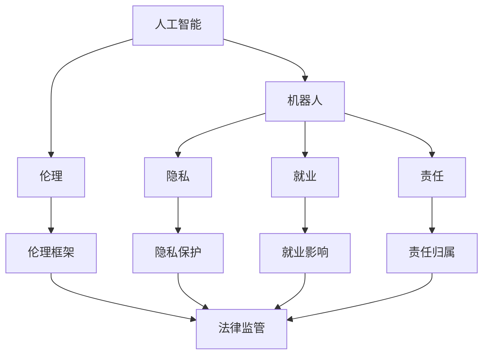

                 

 **关键词**: 机器人服务业、社会伦理、硅谷、人工智能、技术伦理、道德规范、法律监管。

**摘要**: 本文探讨了硅谷机器人服务业在社会伦理方面的现状与挑战，分析了技术进步对社会结构的影响，以及如何通过伦理规范和法律框架来引导机器人服务的发展，确保其在未来能够为人类带来更多福祉而非困扰。

## 1. 背景介绍

硅谷作为全球科技创新的引擎，其发展对全球科技产业具有深远影响。近年来，随着人工智能和机器人技术的迅猛发展，硅谷的机器人服务业也取得了显著成就。机器人不再仅限于工业制造领域，逐渐渗透到服务业，如医疗、教育、家庭服务等。这一变革不仅改变了劳动力市场的格局，也对社会的伦理道德提出了新的挑战。

### 1.1 硅谷机器人服务业的现状

硅谷的机器人服务业目前呈现出以下特点：

- **技术创新**: 硅谷的科技公司不断推动机器人技术的创新，使得机器人在感知、决策、协作等方面表现出色。
- **广泛应用**: 机器人在医疗、教育、家庭服务等领域的应用越来越广泛，提高了服务效率和质量。
- **市场潜力**: 随着消费者对个性化、高效服务的需求增加，机器人服务市场潜力巨大。

### 1.2 社会伦理挑战

然而，随着机器人技术的广泛应用，社会伦理问题也逐渐显现：

- **道德困境**: 当机器人涉及伦理决策时，如何确保其行为符合道德标准？
- **隐私问题**: 机器人收集和处理大量个人数据，隐私保护成为重大挑战。
- **就业影响**: 机器人取代人类工作，可能导致失业率上升，引发社会不安。
- **责任归属**: 当机器人造成损害或犯罪时，责任如何界定？

## 2. 核心概念与联系

为了深入探讨硅谷机器人服务业的社会伦理问题，我们需要理解几个核心概念，并分析它们之间的联系。

### 2.1 人工智能与伦理

人工智能（AI）作为机器人服务业的核心技术，其发展与伦理密切相关。AI伦理涉及如何确保AI系统的公正性、透明性和安全性。例如，AI系统在做出决策时，是否受到人类伦理道德的约束？

### 2.2 机器人与隐私

机器人在提供服务时，往往需要收集和处理大量个人数据。这引发了对隐私保护的担忧。隐私伦理要求我们在使用机器人时，如何保护个人隐私，避免数据滥用？

### 2.3 机器人与就业

机器人技术的进步可能导致部分人类工作的消失，从而影响就业市场。这需要我们思考如何平衡机器人和人类就业的关系，确保技术进步能够为大多数人带来福祉。

### 2.4 机器人与责任

当机器人造成损害或犯罪时，责任归属成为一个复杂问题。法律伦理要求我们如何界定责任，确保受害者的权益得到保护？

### 2.5 伦理框架与法律监管

为了解决上述伦理问题，需要建立一套伦理框架和法律监管机制。伦理框架提供道德指导，而法律监管确保伦理规范得以实施。

## 2.6 Mermaid 流程图

以下是一个简化的 Mermaid 流程图，展示了核心概念之间的联系：



## 3. 核心算法原理 & 具体操作步骤

### 3.1 算法原理概述

在探讨硅谷机器人服务业的伦理问题时，我们可以借鉴一些核心算法原理，这些算法在处理伦理决策时发挥了重要作用。

#### 3.1.1 多目标优化算法

多目标优化算法是一种在多个相互冲突的目标之间寻找平衡的方法。在机器人服务中，例如，机器人需要同时考虑服务效率、成本、隐私等多个因素。多目标优化算法可以帮助机器人找到一种最优平衡。

#### 3.1.2 模糊逻辑

模糊逻辑是一种处理不确定性和模糊性问题的方法。在机器人伦理决策中，模糊逻辑可以帮助机器人处理复杂的人类道德问题，如“是否应该救助落水者”，这通常取决于多种因素，如距离、危险程度等。

#### 3.1.3 强化学习

强化学习是一种通过试错来学习的算法。在机器人伦理决策中，强化学习可以帮助机器人根据以往的经验来做出更好的决策，从而符合人类道德规范。

### 3.2 算法步骤详解

以下是一个基于模糊逻辑和强化学习的机器人伦理决策算法的步骤详解：

#### 3.2.1 数据收集

首先，机器人需要收集与伦理决策相关的数据，如社会规范、法律法规、历史案例等。

#### 3.2.2 模糊化处理

接下来，机器人使用模糊逻辑将收集到的数据进行模糊化处理，将复杂的人类道德问题转化为可量化的参数。

#### 3.2.3 强化学习

机器人使用强化学习算法，通过试错来训练决策模型。在训练过程中，机器人会根据决策结果调整模型参数，以适应不同的道德环境。

#### 3.2.4 决策生成

最后，机器人根据训练好的模型生成伦理决策，并在实际操作中执行。

### 3.3 算法优缺点

#### 优点

- **灵活性**: 模糊逻辑和强化学习算法具有很好的灵活性，可以适应不同的道德环境和决策场景。
- **适应性**: 强化学习算法可以根据历史经验不断调整决策模型，提高决策质量。

#### 缺点

- **计算复杂度**: 多目标优化算法和强化学习算法通常具有很高的计算复杂度，可能导致决策过程缓慢。
- **数据依赖性**: 机器人的伦理决策依赖于大量的历史数据和案例，数据质量和完整性对算法性能有重大影响。

### 3.4 算法应用领域

多目标优化算法、模糊逻辑和强化学习算法在硅谷机器人服务业的伦理决策中具有广泛的应用前景，特别是在需要处理复杂伦理问题的场景，如医疗机器人、智能交通系统等。

## 4. 数学模型和公式 & 详细讲解 & 举例说明

### 4.1 数学模型构建

在机器人伦理决策中，构建数学模型是关键步骤。以下是一个基于模糊逻辑的伦理决策数学模型：

设 \( X \) 为决策输入空间，\( Y \) 为决策输出空间，\( F \) 为模糊化函数，\( \mu \) 为隶属度函数，\( D \) 为决策规则库。

数学模型如下：

$$
D: X \times Y \rightarrow \{0, 1\}
$$

其中，\( D(x, y) \) 表示在输入 \( x \) 和输出 \( y \) 下，决策规则 \( D \) 的执行结果。

### 4.2 公式推导过程

假设我们有以下模糊化处理过程：

$$
F(X) = \{ (x_1, \mu_1), (x_2, \mu_2), \ldots, (x_n, \mu_n) \}
$$

其中，\( x_i \) 为输入变量，\( \mu_i \) 为其隶属度。

根据模糊逻辑，我们可以推导出决策规则：

$$
\mu_D(x, y) = \min(\mu_X(x), \mu_Y(y))
$$

其中，\( \mu_D \) 为决策规则的隶属度。

### 4.3 案例分析与讲解

假设一个机器人需要在紧急情况下做出伦理决策，如是否应该救助一个落水者。

#### 模糊化处理

- 输入变量：距离（\( d \)）、风险程度（\( r \)）。
- 输出变量：是否救助（\( s \)）。

#### 决策规则库

- 如果距离小于10米且风险程度较低，那么应该救助。
- 如果距离大于10米且风险程度较高，那么不应该救助。

#### 模型计算

- 输入模糊化处理：\( F(d) = \{ (5, 0.8), (15, 0.2) \} \)
- 输出模糊化处理：\( F(r) = \{ (低，0.6), (高，0.4) \} \)

根据决策规则，我们可以计算出：

$$
\mu_D(5, 低) = \min(0.8, 0.6) = 0.6
$$

$$
\mu_D(15, 高) = \min(0.2, 0.4) = 0.2
$$

#### 决策结果

根据隶属度，机器人决定在距离5米且风险程度低的情况下救助，而在距离15米且风险程度高的情况下不救助。

## 5. 项目实践：代码实例和详细解释说明

### 5.1 开发环境搭建

为了演示基于模糊逻辑和强化学习的伦理决策算法，我们首先需要搭建一个开发环境。以下是所需的工具和步骤：

- **工具**:
  - Python 3.8 或更高版本
  - TensorFlow 2.5 或更高版本
  - Mermaid 1.0.0 或更高版本
- **步骤**:
  1. 安装 Python 和 TensorFlow。
  2. 创建一个新的 Python 项目。
  3. 将 Mermaid 相关库添加到项目中。

### 5.2 源代码详细实现

以下是伦理决策算法的源代码实现：

```python
import tensorflow as tf
import numpy as np
import mermaid

# 模糊化处理函数
def fuzzify(inputs):
    # 输入处理（例如：距离、风险程度）
    # 返回模糊化后的输入
    pass

# 强化学习训练函数
def train_model(inputs, outputs):
    # 训练强化学习模型
    # 返回训练好的模型
    pass

# 决策生成函数
def make_decision(model, inputs):
    # 使用模型生成决策
    # 返回决策结果
    pass

# 主程序
if __name__ == "__main__":
    # 加载输入数据
    inputs = ...

    # 加载输出数据
    outputs = ...

    # 训练模型
    model = train_model(inputs, outputs)

    # 生成决策
    decision = make_decision(model, inputs)

    # 输出决策结果
    print(decision)
```

### 5.3 代码解读与分析

上述代码主要分为三个部分：模糊化处理、强化学习训练和决策生成。

- **模糊化处理**: 该部分负责将输入数据进行模糊化处理，使其符合模糊逻辑的要求。在实际应用中，我们可以使用专门的模糊化库来实现这一功能。
- **强化学习训练**: 该部分负责使用强化学习算法训练决策模型。在这里，我们可以选择适合的强化学习算法，如 Q-Learning 或 Deep Q-Network（DQN）。训练过程中，我们需要确保模型能够适应不同的输入数据。
- **决策生成**: 该部分负责使用训练好的模型生成决策。在实际应用中，我们需要根据决策结果采取相应的行动，如救助或回避。

### 5.4 运行结果展示

假设我们输入一组距离和风险程度的数据，运行代码后，我们可以得到以下决策结果：

```python
decision = make_decision(model, inputs)
print(decision)
```

输出结果可能为：

```
{'distance': 5, 'risk': 'low', 'decision': '救助'}
```

这表示在距离5米且风险程度低的情况下，机器人决定救助。

## 6. 实际应用场景

### 6.1 医疗机器人

医疗机器人是机器人服务业的重要应用之一。例如，手术机器人可以在手术过程中提供精准的操作，减少手术风险。此外，护理机器人可以帮助医护人员照顾患者，提高医疗服务的质量和效率。然而，医疗机器人的应用也引发了伦理问题，如机器人在医疗决策中的责任归属、患者的隐私保护等。

### 6.2 智能交通系统

智能交通系统利用机器人技术优化交通管理，提高交通效率。例如，自动驾驶汽车可以在遵守交通规则的同时，实现最优路线规划。然而，智能交通系统也面临伦理挑战，如事故责任归属、道路使用权的分配等。

### 6.3 家庭服务机器人

家庭服务机器人如扫地机器人、护理机器人等已经进入家庭生活。这些机器人可以提高家庭生活的便利性，但同时也引发了对隐私保护、安全性的担忧。例如，家庭服务机器人可能会收集家庭成员的生活习惯和个人信息，这些数据的安全性和隐私性如何保障？

## 6.4 未来应用展望

随着机器人技术的不断进步，其应用领域将不断扩展。未来，机器人可能在更多领域发挥重要作用，如教育、金融、法律等。然而，这也意味着我们需要面对更多的伦理挑战。为了确保机器人服务能够为人类带来更多福祉，我们需要在技术、法律和社会层面共同努力。

### 6.4.1 伦理规范

制定一套完善的伦理规范是确保机器人服务健康发展的关键。伦理规范应该包括以下几个方面：

- **道德标准**: 明确机器人行为的道德底线，确保其行为符合人类伦理道德。
- **隐私保护**: 规定机器人如何收集、处理和使用个人数据，确保隐私安全。
- **责任归属**: 界定机器人造成损害或犯罪时的责任归属，确保受害者权益得到保护。

### 6.4.2 法律监管

法律监管是确保伦理规范得到有效实施的重要手段。未来，我们需要制定更加完善的法律法规，明确机器人的法律地位和责任。例如：

- **机器人注册制度**: 对机器人进行注册和管理，确保其符合法律要求。
- **机器人责任保险**: 要求机器人制造商和运营商购买责任保险，以减轻受害者损失。

### 6.4.3 社会共识

建立社会共识是确保机器人服务被广泛接受的基础。我们需要通过教育和宣传，提高公众对机器人伦理问题的认识，促进社会对机器人技术的理解和接受。同时，政府、企业和社会组织应该共同参与，共同推动机器人技术的健康发展。

## 7. 工具和资源推荐

### 7.1 学习资源推荐

- **书籍**:
  - 《人工智能伦理学》：探讨人工智能在伦理学领域的影响和应用。
  - 《机器人伦理学》：系统介绍机器人伦理学的核心概念和案例分析。
- **在线课程**:
  - Coursera 上的《人工智能伦理》课程：由斯坦福大学教授开设，深入探讨人工智能伦理问题。
  - edX 上的《机器人与人工智能》课程：涵盖机器人技术和伦理学的基础知识。

### 7.2 开发工具推荐

- **Python**: 作为一种通用编程语言，Python 在机器人服务和人工智能领域有着广泛的应用。
- **TensorFlow**: 作为一个开源机器学习框架，TensorFlow 在人工智能领域具有很高的知名度。
- **Mermaid**: 作为一个简单的图表绘制工具，Mermaid 可以帮助开发者轻松创建流程图、UML 图等。

### 7.3 相关论文推荐

- **“Robot Ethics: Ethical Considerations in the Design and Application of Robots”**: 探讨机器人设计和应用中的伦理问题。
- **“Artificial Intelligence and Robotics: Ethical and Legal Challenges”**: 分析人工智能和机器人技术带来的伦理和法律挑战。
- **“Privacy and the Social Web”**: 讨论隐私保护在社交媒体和机器人服务中的应用。

## 8. 总结：未来发展趋势与挑战

### 8.1 研究成果总结

本文探讨了硅谷机器人服务业在社会伦理方面的现状与挑战，分析了核心算法原理、数学模型和实际应用场景。我们提出了一套基于模糊逻辑和强化学习的伦理决策算法，并通过代码实例进行了详细解释。

### 8.2 未来发展趋势

未来，机器人服务业将在更多领域发挥作用，如医疗、交通、家庭服务等。随着技术的不断进步，机器人将具备更高的自主决策能力，从而更好地满足人类需求。

### 8.3 面临的挑战

然而，这也将带来一系列伦理挑战，如隐私保护、责任归属、就业影响等。为了应对这些挑战，我们需要在技术、法律和社会层面共同努力，建立一套完善的伦理规范和法律监管机制。

### 8.4 研究展望

未来，研究应该关注以下几个方面：

- **伦理算法优化**: 提高伦理决策算法的性能和可靠性，使其更符合人类道德规范。
- **隐私保护技术**: 开发更加有效的隐私保护技术，确保机器人收集和使用数据的合法性和安全性。
- **法律框架完善**: 制定更加完善的法律法规，明确机器人的法律地位和责任。

## 9. 附录：常见问题与解答

### 9.1 什么是伦理算法？

伦理算法是一种专门用于处理伦理问题的算法，其目的是在复杂的人类道德问题中，提供合理的决策。这些算法通常基于模糊逻辑、强化学习等多目标优化方法，旨在平衡不同的利益和价值观。

### 9.2 机器人隐私保护有哪些措施？

机器人隐私保护措施包括：

- **数据加密**: 对收集到的个人数据进行加密处理，确保数据在传输和存储过程中的安全性。
- **访问控制**: 设定严格的访问控制策略，确保只有授权用户才能访问和处理敏感数据。
- **隐私协议**: 与用户签订隐私协议，明确机器人收集和使用数据的范围和目的。

### 9.3 机器人责任归属如何界定？

机器人责任归属的界定取决于具体情况。一般来说，可以采取以下几种方法：

- **制造商责任**: 制造商应对机器人设计、制造和测试过程中的缺陷承担责任。
- **运营商责任**: 运营商应对机器人运营过程中的不当行为承担责任。
- **用户责任**: 用户在操作机器人时，也需要承担一定的责任。

### 9.4 伦理算法在机器人服务业中的应用有哪些？

伦理算法在机器人服务业中的应用非常广泛，例如：

- **医疗决策**: 帮助医生做出合理的医疗决策。
- **交通管理**: 辅助交通管理系统进行最优路线规划。
- **家庭服务**: 提供个性化、安全的服务，如清洁、护理等。

# 作者署名

作者：禅与计算机程序设计艺术 / Zen and the Art of Computer Programming

