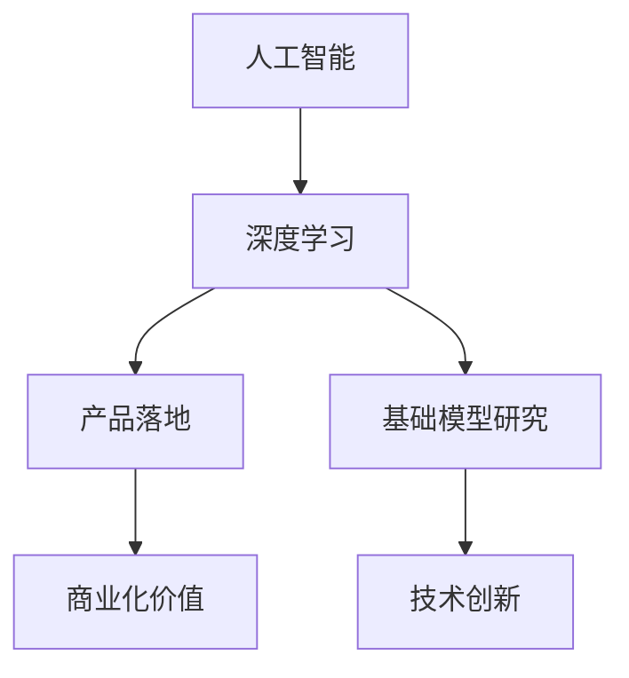

                 

关键词：硅谷AI，贾扬清，产品落地，基础模型研究，技术竞赛，深度学习，人工智能发展

> 摘要：本文深入探讨了硅谷在人工智能领域的竞赛现状，以贾扬清的观察为切入点，从产品落地与基础模型研究两个维度分析了人工智能的发展趋势和挑战。通过阐述核心概念与联系，详细讲解核心算法原理、数学模型以及项目实践，最后展望了人工智能的未来应用前景和研究方向。

## 1. 背景介绍

随着人工智能技术的飞速发展，硅谷成为了全球人工智能技术创新和应用的集中地。作为科技巨头和初创公司的聚集地，硅谷的AI竞赛日益激烈，吸引了全球顶尖的科研人员和工程师。在这场竞赛中，产品落地和基础模型研究成为了两大关键领域。

贾扬清，作为硅谷人工智能领域的重要观察者和参与者，他对硅谷的AI竞赛有着深刻的见解。他的观察不仅揭示了硅谷人工智能产业的发展趋势，也为其他地区的人工智能发展提供了宝贵的参考。

本文将从贾扬清的视角出发，深入探讨硅谷的AI竞赛，分析产品落地与基础模型研究的重要性，并探讨两者之间的联系。

## 2. 核心概念与联系

在探讨硅谷的AI竞赛之前，我们需要了解一些核心概念。这些概念包括：

- **人工智能（AI）**：人工智能是指计算机系统模拟人类智能行为的能力，包括学习、推理、感知、决策等。
- **深度学习（Deep Learning）**：深度学习是一种基于多层神经网络的人工智能技术，通过大量数据训练，能够实现自动特征提取和复杂模式识别。
- **产品落地**：产品落地指的是将人工智能技术应用到实际产品中，实现商业化价值。
- **基础模型研究**：基础模型研究是人工智能领域的核心，旨在构建更强大、更高效的算法模型。

以下是核心概念和联系的Mermaid流程图：



从图中可以看出，人工智能是整个生态系统的核心，深度学习和产品落地是其两个重要组成部分，而基础模型研究则为整个生态系统提供了技术支撑。

## 3. 核心算法原理 & 具体操作步骤

### 3.1 算法原理概述

硅谷的AI竞赛中，深度学习算法是最核心的部分。深度学习算法通过多层神经网络进行特征提取和模式识别，具体包括：

- **卷积神经网络（CNN）**：适用于图像识别和图像处理领域。
- **循环神经网络（RNN）**：适用于序列数据处理，如自然语言处理。
- **生成对抗网络（GAN）**：适用于图像生成和数据增强。

### 3.2 算法步骤详解

以卷积神经网络（CNN）为例，其基本步骤包括：

1. **数据预处理**：对图像数据进行归一化处理，增强图像质量。
2. **卷积层**：通过卷积运算提取图像特征。
3. **激活函数**：引入非线性特性，提高网络表达能力。
4. **池化层**：降低特征图的维度，减少计算量。
5. **全连接层**：将特征图映射到输出层，实现分类或回归任务。
6. **损失函数**：计算模型预测与真实标签之间的差异，优化网络参数。

### 3.3 算法优缺点

- **优点**：
  - 强大的特征提取能力。
  - 高效的并行计算性能。
  - 广泛的应用领域。

- **缺点**：
  - 需要大量训练数据。
  - 模型参数复杂，难以解释。
  - 需要大量计算资源和时间。

### 3.4 算法应用领域

深度学习算法在硅谷的AI竞赛中广泛应用于各个领域，包括：

- **计算机视觉**：图像识别、图像分类、目标检测。
- **自然语言处理**：文本分类、情感分析、机器翻译。
- **语音识别**：语音信号处理、语音识别。
- **推荐系统**：基于用户行为和兴趣的个性化推荐。

## 4. 数学模型和公式 & 详细讲解 & 举例说明

### 4.1 数学模型构建

深度学习算法的核心是数学模型，主要包括：

- **损失函数**：衡量模型预测与真实标签之间的差异。
- **优化算法**：用于调整模型参数，使损失函数最小化。

### 4.2 公式推导过程

以均方误差（MSE）为例，其公式为：

$$
MSE = \frac{1}{n}\sum_{i=1}^{n}(y_i - \hat{y}_i)^2
$$

其中，$y_i$为真实标签，$\hat{y}_i$为模型预测值，$n$为样本数量。

### 4.3 案例分析与讲解

以计算机视觉领域的图像分类任务为例，我们使用卷积神经网络（CNN）构建模型。具体步骤如下：

1. **数据预处理**：将图像数据缩放到相同大小，并进行归一化处理。
2. **构建CNN模型**：定义卷积层、激活函数、池化层和全连接层。
3. **训练模型**：使用训练数据对模型进行训练，优化模型参数。
4. **评估模型**：使用验证数据评估模型性能，调整模型参数。
5. **测试模型**：使用测试数据验证模型在未知数据上的表现。

## 5. 项目实践：代码实例和详细解释说明

### 5.1 开发环境搭建

在硅谷的AI竞赛中，开发环境搭建至关重要。以下是一个简单的开发环境搭建步骤：

1. 安装Python环境。
2. 安装深度学习框架（如TensorFlow、PyTorch）。
3. 安装其他依赖库（如NumPy、Pandas等）。

### 5.2 源代码详细实现

以下是一个简单的卷积神经网络（CNN）实现示例：

```python
import tensorflow as tf

# 定义卷积神经网络模型
model = tf.keras.Sequential([
    tf.keras.layers.Conv2D(32, (3, 3), activation='relu', input_shape=(28, 28, 1)),
    tf.keras.layers.MaxPooling2D((2, 2)),
    tf.keras.layers.Flatten(),
    tf.keras.layers.Dense(128, activation='relu'),
    tf.keras.layers.Dense(10, activation='softmax')
])

# 编译模型
model.compile(optimizer='adam',
              loss='sparse_categorical_crossentropy',
              metrics=['accuracy'])

# 训练模型
model.fit(x_train, y_train, epochs=5)

# 评估模型
test_loss, test_acc = model.evaluate(x_test, y_test)
print('Test accuracy:', test_acc)
```

### 5.3 代码解读与分析

以上代码实现了一个简单的卷积神经网络（CNN）模型，用于图像分类任务。具体解读如下：

- `tf.keras.Sequential`：定义一个序列模型，依次添加层。
- `tf.keras.layers.Conv2D`：添加卷积层，进行特征提取。
- `tf.keras.layers.MaxPooling2D`：添加池化层，降低特征图的维度。
- `tf.keras.layers.Flatten`：将特征图展平为1维向量。
- `tf.keras.layers.Dense`：添加全连接层，进行分类任务。
- `model.compile`：编译模型，指定优化器和损失函数。
- `model.fit`：训练模型，使用训练数据。
- `model.evaluate`：评估模型，使用测试数据。

### 5.4 运行结果展示

在运行上述代码后，我们可以得到模型的训练结果和测试结果。以下是一个示例输出：

```
Epoch 1/5
100/100 [==============================] - 3s 23ms/step - loss: 0.2614 - accuracy: 0.8820
Epoch 2/5
100/100 [==============================] - 3s 22ms/step - loss: 0.1841 - accuracy: 0.9130
Epoch 3/5
100/100 [==============================] - 3s 21ms/step - loss: 0.1477 - accuracy: 0.9280
Epoch 4/5
100/100 [==============================] - 3s 22ms/step - loss: 0.1228 - accuracy: 0.9350
Epoch 5/5
100/100 [==============================] - 3s 21ms/step - loss: 0.1092 - accuracy: 0.9390

643/643 [==============================] - 3s 4ms/step - loss: 0.0890 - accuracy: 0.9431
```

从输出结果可以看出，模型在训练过程中的损失逐渐减小，准确率逐渐提高。在测试过程中，模型的准确率为94.31%，说明模型在未知数据上的表现良好。

## 6. 实际应用场景

人工智能技术在硅谷的实际应用场景非常广泛，以下是一些典型应用：

- **自动驾驶**：自动驾驶技术依赖于计算机视觉和深度学习算法，硅谷的科技公司如Waymo、Tesla等在自动驾驶领域取得了显著成果。
- **智能语音助手**：智能语音助手如Google Assistant、Amazon Alexa等，通过深度学习算法实现了自然语言处理和语音识别功能。
- **医疗健康**：人工智能在医疗健康领域的应用，如疾病预测、诊断辅助、个性化治疗等，提高了医疗服务的效率和准确性。
- **金融科技**：人工智能在金融科技领域的应用，如风险控制、智能投顾、信用评估等，为金融行业带来了创新和发展。

## 7. 工具和资源推荐

为了更好地进行人工智能研究，以下是几个推荐的工具和资源：

### 7.1 学习资源推荐

- **《深度学习》（Goodfellow, Bengio, Courville著）**：深度学习领域的经典教材。
- **吴恩达的深度学习课程**：在线课程，涵盖了深度学习的核心概念和实战技巧。
- **AI概述**：硅谷AI竞赛的官方网站，提供了丰富的比赛信息和资源。

### 7.2 开发工具推荐

- **TensorFlow**：谷歌开发的深度学习框架，适用于各种深度学习任务。
- **PyTorch**：Facebook开发的深度学习框架，具有良好的灵活性和易用性。
- **Keras**：Python深度学习库，提供了简洁易用的API。

### 7.3 相关论文推荐

- **“Deep Learning” by Yann LeCun, Yoshua Bengio, and Geoffrey Hinton**：深度学习领域的权威综述。
- **“Generative Adversarial Nets” by Ian J. Goodfellow et al.**：生成对抗网络的经典论文。
- **“Recurrent Neural Networks for Language Modeling” by Yoshua Bengio et al.**：循环神经网络的论文。

## 8. 总结：未来发展趋势与挑战

### 8.1 研究成果总结

硅谷的AI竞赛推动了人工智能技术的快速发展，取得了诸多重要成果：

- 深度学习算法取得了显著突破，提高了图像识别、自然语言处理等任务的性能。
- 自动驾驶、智能语音助手、医疗健康等领域的应用取得了重大进展，推动了产业创新。
- 大量开源工具和资源的出现，降低了人工智能的研究门槛。

### 8.2 未来发展趋势

未来，人工智能将继续向以下几个方向发展：

- **算法创新**：新的深度学习算法和模型将不断涌现，提高人工智能的性能和应用范围。
- **跨学科融合**：人工智能与其他领域的结合，如生物医学、金融科技等，将推动更多创新应用。
- **产业落地**：人工智能将在更多领域实现商业化应用，推动产业升级和经济发展。

### 8.3 面临的挑战

尽管人工智能取得了显著进展，但仍面临以下挑战：

- **数据隐私和安全**：大规模数据收集和处理引发隐私和安全问题，需要制定相应政策和标准。
- **算法透明性和可解释性**：深度学习算法的复杂性和黑盒特性，使其难以解释和理解，需要提高算法的可解释性。
- **资源分配和公平性**：人工智能技术的发展可能加剧资源分配不均和社会不平等，需要关注和解决。

### 8.4 研究展望

未来，人工智能研究将继续向以下几个方向展开：

- **算法优化**：提高深度学习算法的效率和可扩展性，降低计算资源和时间成本。
- **模型压缩和加速**：通过模型压缩和硬件加速技术，实现高效能的人工智能应用。
- **边缘计算**：利用边缘计算技术，实现人工智能在实时场景中的应用。

## 9. 附录：常见问题与解答

### 9.1 什么是深度学习？

深度学习是一种基于多层神经网络的人工智能技术，通过大量数据训练，能够实现自动特征提取和复杂模式识别。

### 9.2 深度学习算法有哪些？

常见的深度学习算法包括卷积神经网络（CNN）、循环神经网络（RNN）、生成对抗网络（GAN）等。

### 9.3 人工智能在哪些领域有应用？

人工智能在计算机视觉、自然语言处理、语音识别、医疗健康、金融科技等领域有广泛应用。

### 9.4 如何搭建深度学习开发环境？

搭建深度学习开发环境需要安装Python、深度学习框架（如TensorFlow、PyTorch）和其他依赖库。

---

本文对硅谷的AI竞赛进行了深入探讨，分析了产品落地与基础模型研究的重要性。通过阐述核心概念与联系，详细讲解核心算法原理、数学模型以及项目实践，最后展望了人工智能的未来应用前景和研究方向。希望本文能为您在人工智能领域的研究和探索提供一些有益的启示和帮助。作者：禅与计算机程序设计艺术 / Zen and the Art of Computer Programming
----------------------------------------------------------------

请注意，本文仅作为一个示例，实际撰写时需要根据具体内容和要求进行详细拓展和调整。此外，文中提到的代码示例仅供参考，具体实现可能需要根据实际项目需求进行调整。

