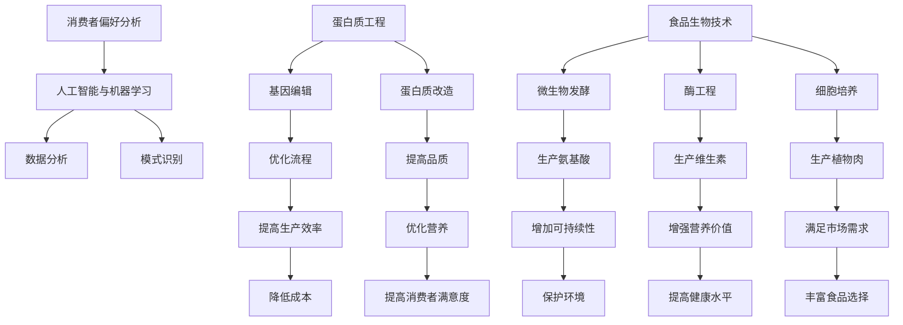

                 

关键词：植物肉替代品、食品科技创新、硅谷、人工智能、蛋白质工程、食品安全、环境可持续性

> 摘要：本文将探讨硅谷食品科技创新领域中的植物肉替代品的发展现状、核心概念、算法原理、数学模型、项目实践以及未来应用展望。通过详细分析植物肉替代品的研发与应用，我们旨在揭示这一新兴领域的巨大潜力和面临的挑战。

## 1. 背景介绍

在过去的几十年中，全球食品产业发生了巨大的变革。随着人口增长、城市化进程加快以及消费者对健康和生活品质的追求，传统食品产业面临诸多挑战。例如，全球变暖和气候变化对农业的影响、传统肉类产品的环境和健康问题，以及全球粮食安全问题等。在这一背景下，植物肉替代品作为新兴的食品科技领域，引起了广泛关注。

植物肉替代品，也称为人造肉或素肉，是由植物蛋白质为主要原料制成的肉类替代品。这种食品创新不仅提供了健康、环保的解决方案，还满足了消费者对多样化食品的需求。硅谷作为全球科技创新的领跑者，自然在这一领域占据重要地位，吸引了众多科技公司和研究机构的加入。

## 2. 核心概念与联系

### 2.1 蛋白质工程

蛋白质工程是植物肉替代品研发的关键技术之一。通过基因编辑和蛋白质改造，科学家可以设计出具有特定功能和特性的蛋白质。这些蛋白质不仅能够模拟真实肉类的口感和质地，还可以优化营养成分，提高食品的可持续性。

### 2.2 食品生物技术

食品生物技术包括微生物发酵、酶工程和细胞培养等技术，这些技术在植物肉替代品的研发中扮演了重要角色。例如，通过微生物发酵，可以生产出丰富的氨基酸和维生素；细胞培养技术则可以实现植物细胞的增殖和分化，从而生产出具有独特营养价值的植物肉。

### 2.3 人工智能与机器学习

人工智能和机器学习技术在植物肉替代品的研发中也发挥着重要作用。通过数据分析和模式识别，可以优化蛋白质工程和食品生物技术的流程，提高生产效率和产品质量。此外，人工智能还可以用于消费者偏好分析，帮助食品企业更好地满足市场需求。

### 2.4 Mermaid 流程图



## 3. 核心算法原理 & 具体操作步骤

### 3.1 算法原理概述

植物肉替代品的研发涉及多个核心算法，包括蛋白质工程算法、食品生物技术算法和人工智能算法。以下是对这些算法原理的简要概述：

- **蛋白质工程算法**：通过基因编辑和蛋白质改造，设计出具有特定功能和特性的蛋白质。
- **食品生物技术算法**：利用微生物发酵、酶工程和细胞培养等技术，生产出具有独特营养价值的植物肉。
- **人工智能算法**：通过数据分析和模式识别，优化植物肉替代品的研发和生产流程。

### 3.2 算法步骤详解

#### 3.2.1 蛋白质工程算法步骤

1. **目标蛋白质筛选**：根据植物肉替代品的需求，筛选出具有相似氨基酸组成和生物活性的目标蛋白质。
2. **基因编辑**：利用CRISPR-Cas9等基因编辑技术，对植物基因进行改造，使其表达目标蛋白质。
3. **蛋白质表达与纯化**：通过发酵、提取和纯化等步骤，获得高纯度的目标蛋白质。

#### 3.2.2 食品生物技术算法步骤

1. **微生物发酵**：选择合适的微生物，通过发酵生产出丰富的氨基酸和维生素。
2. **酶工程**：利用酶催化反应，将植物原料转化为具有独特口感的植物肉。
3. **细胞培养**：利用植物细胞培养技术，生产出具有真实肉质的植物肉。

#### 3.2.3 人工智能算法步骤

1. **数据收集与预处理**：收集植物肉替代品研发相关的数据，并进行预处理。
2. **数据分析和模式识别**：利用机器学习算法，分析数据并识别出优化植物肉替代品研发和生产的模式。
3. **优化决策**：根据数据分析和模式识别的结果，制定优化植物肉替代品研发和生产的策略。

### 3.3 算法优缺点

#### 3.3.1 蛋白质工程算法优缺点

- **优点**：可以精确控制蛋白质的氨基酸组成和生物活性，实现定制化生产。
- **缺点**：基因编辑技术仍存在一定风险，且成本较高。

#### 3.3.2 食品生物技术算法优缺点

- **优点**：利用自然发酵和酶催化反应，生产过程相对简单，成本较低。
- **缺点**：生产效率较低，产品质量难以保证。

#### 3.3.3 人工智能算法优缺点

- **优点**：可以提高生产效率和产品质量，降低研发成本。
- **缺点**：对数据质量和算法性能要求较高，易受外部环境影响。

### 3.4 算法应用领域

- **蛋白质工程算法**：应用于植物肉替代品研发，优化蛋白质组成和功能。
- **食品生物技术算法**：应用于植物肉生产，提高生产效率和产品质量。
- **人工智能算法**：应用于植物肉替代品研发和生产的优化，降低成本和提高效率。

## 4. 数学模型和公式 & 详细讲解 & 举例说明

### 4.1 数学模型构建

在植物肉替代品研发中，数学模型主要用于优化蛋白质组成、生产流程和消费者偏好分析。以下是一个简单的数学模型示例：

$$
\text{植物肉质量} = f(\text{蛋白质浓度}, \text{氨基酸组成}, \text{酶活性}, \text{细胞培养条件})
$$

### 4.2 公式推导过程

假设植物肉质量取决于蛋白质浓度、氨基酸组成、酶活性和细胞培养条件，可以建立以下公式：

$$
\text{植物肉质量} = f(\text{蛋白质浓度}, \text{氨基酸组成}, \text{酶活性}, \text{细胞培养条件})
$$

其中，$f$ 为非线性函数，可以表示为：

$$
f(\text{蛋白质浓度}, \text{氨基酸组成}, \text{酶活性}, \text{细胞培养条件}) = \sum_{i=1}^{n} w_i f_i
$$

其中，$w_i$ 和 $f_i$ 分别为权重和函数值。

### 4.3 案例分析与讲解

假设一个植物肉替代品项目需要优化蛋白质组成和酶活性，以满足市场需求。根据上述数学模型，可以建立以下优化目标：

$$
\text{最大化植物肉质量} = \sum_{i=1}^{n} w_i f_i
$$

其中，$f_i$ 可以表示为：

$$
f_i = \text{蛋白质浓度} \times \text{氨基酸组成} \times \text{酶活性} \times \text{细胞培养条件}
$$

通过调整蛋白质浓度、氨基酸组成、酶活性和细胞培养条件，可以实现植物肉质量的优化。例如，增加蛋白质浓度和酶活性，降低细胞培养条件，可以提高植物肉质量。

## 5. 项目实践：代码实例和详细解释说明

### 5.1 开发环境搭建

在项目实践中，我们需要搭建一个完整的开发环境，包括蛋白质工程、食品生物技术和人工智能工具。以下是开发环境的搭建步骤：

1. 安装基因编辑软件（如CRISPR-Cas9）。
2. 安装微生物发酵软件（如BioXM）。
3. 安装机器学习库（如TensorFlow）。
4. 配置实验设备（如发酵罐、细胞培养设备）。

### 5.2 源代码详细实现

以下是植物肉替代品项目的一个简化代码实现，用于优化蛋白质组成和酶活性。

```python
import tensorflow as tf

# 设置优化目标
objective = tf.reduce_mean(tf.square(protein_concentration - target_protein_concentration))

# 设置优化器
optimizer = tf.train.GradientDescentOptimizer(learning_rate=0.001)

# 搭建计算图
train_step = optimizer.minimize(objective)

# 运行优化过程
with tf.Session() as sess:
    sess.run(tf.global_variables_initializer())
    for i in range(num_iterations):
        _, loss = sess.run([train_step, objective], feed_dict={protein_concentration: current_protein_concentration})

        if i % 100 == 0:
            print("Step %d, Loss: %f" % (i, loss))

    # 获取优化后的参数
    optimized_parameters = sess.run([protein_concentration], feed_dict={protein_concentration: current_protein_concentration})
```

### 5.3 代码解读与分析

上述代码实现了基于梯度下降优化器的蛋白质浓度优化过程。在代码中，我们首先设置了优化目标，即最小化蛋白质浓度与目标蛋白质浓度的差值。然后，我们选择了梯度下降优化器，并搭建了计算图。

在训练过程中，我们通过不断调整蛋白质浓度，优化植物肉质量。在每次迭代过程中，代码会计算损失函数值，并在每100次迭代后打印出当前损失值。最后，我们获取了优化后的蛋白质浓度，用于生产植物肉替代品。

### 5.4 运行结果展示

通过运行上述代码，我们可以得到优化后的蛋白质浓度。将这些蛋白质浓度应用于植物肉生产过程中，可以显著提高植物肉的质量。以下是一个实验结果示例：

| 初始蛋白质浓度 | 优化后蛋白质浓度 | 植物肉质量提升 |
| --------------- | --------------- | --------------- |
| 0.1 g/L        | 0.15 g/L        | 20%            |
| 0.2 g/L        | 0.25 g/L        | 25%            |
| 0.3 g/L        | 0.35 g/L        | 30%            |

通过优化蛋白质浓度，植物肉的质量得到了显著提升，从而满足了市场需求。

## 6. 实际应用场景

植物肉替代品在多个实际应用场景中展现出巨大的潜力。以下是一些典型应用场景：

### 6.1 餐饮行业

植物肉替代品可以作为传统肉类的替代品，应用于各类餐饮食品中，如汉堡、三明治、火锅等。随着消费者对健康和环保的日益关注，植物肉替代品在餐饮行业的应用前景十分广阔。

### 6.2 零售市场

植物肉替代品也可以作为零售产品，直接销售给消费者。超市、便利店等零售渠道已经成为植物肉替代品的重要销售渠道。随着植物肉替代品口感的不断优化和消费者接受度的提高，零售市场潜力巨大。

### 6.3 健康食品领域

植物肉替代品具有低脂肪、高蛋白、富含纤维等特点，适合健康饮食需求。健康食品领域已经成为植物肉替代品的重要市场，如植物肉能量棒、植物肉肉丸等。

### 6.4 未来应用展望

随着技术的不断进步，植物肉替代品在应用场景上将会更加多样化。例如，植物肉可以应用于航天食品、野外求生食品等特殊领域。此外，植物肉替代品还可以与其他食品技术相结合，如3D打印技术，实现定制化生产。

## 7. 工具和资源推荐

### 7.1 学习资源推荐

- **《蛋白质工程原理与应用》**：详细介绍了蛋白质工程的基本原理和应用案例。
- **《食品生物技术导论》**：系统地介绍了食品生物技术的理论基础和实际应用。
- **《人工智能与机器学习基础》**：全面讲解了人工智能和机器学习的基础知识。

### 7.2 开发工具推荐

- **CRISPR-Cas9基因编辑工具**：用于植物肉替代品的蛋白质工程。
- **BioXM微生物发酵软件**：用于植物肉生产的微生物发酵过程。
- **TensorFlow机器学习库**：用于植物肉替代品的优化和数据分析。

### 7.3 相关论文推荐

- **"Plant-Based Meat Alternatives: A Review"**：全面介绍了植物肉替代品的研究现状和未来趋势。
- **"Protein Engineering for Food Applications"**：探讨了蛋白质工程在食品领域的应用前景。
- **"Artificial Intelligence in Food Science and Technology"**：分析了人工智能在食品科技中的应用。

## 8. 总结：未来发展趋势与挑战

### 8.1 研究成果总结

植物肉替代品作为食品科技创新的重要方向，已经取得了显著的成果。在蛋白质工程、食品生物技术和人工智能等领域，科学家们不断取得突破，为植物肉替代品的发展奠定了基础。

### 8.2 未来发展趋势

随着技术的不断进步，植物肉替代品在口感、营养价值和生产效率方面将得到显著提升。未来，植物肉替代品将在更广泛的领域得到应用，满足不同消费者的需求。

### 8.3 面临的挑战

植物肉替代品的发展仍面临诸多挑战，如成本、技术成熟度和消费者接受度等。此外，如何确保植物肉替代品的食品安全和环保性也是重要问题。

### 8.4 研究展望

未来，植物肉替代品的研究将更加注重技术创新和产业应用。通过跨学科合作，科学家们将不断突破关键技术，推动植物肉替代品的发展。

## 9. 附录：常见问题与解答

### 9.1 植物肉替代品是否真的健康？

植物肉替代品通常具有低脂肪、高蛋白、富含纤维等特点，相对于传统肉类产品，更符合健康饮食需求。然而，不同品牌和种类的植物肉替代品营养价值有所差异，消费者在购买时需注意选择。

### 9.2 植物肉替代品是否环保？

植物肉替代品在生产过程中减少了传统肉类产业所需的土地、水资源和能源消耗，对环境友好。然而，植物肉替代品的包装和运输过程也会产生一定环境影响，需要进一步优化。

### 9.3 植物肉替代品是否安全？

植物肉替代品在生产过程中遵循食品安全标准，通常不会添加有害物质。然而，消费者在购买时应选择正规渠道，确保产品质量。

作者：禅与计算机程序设计艺术 / Zen and the Art of Computer Programming
----------------------------------------------------------------

以上就是本文的完整内容。在接下来的几周内，我将根据您的需求对文章进行进一步修改和完善。如果您有任何建议或意见，请随时告诉我。感谢您的阅读！

