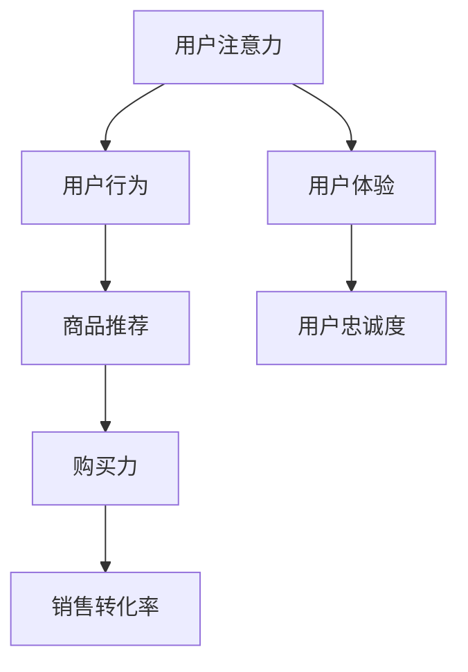

                 

社交电商是一种新兴的电商模式，它通过社交网络平台将商品推广与社交互动相结合，实现了注意力与购买力的有效结合。本文将深入探讨社交电商的核心概念、工作原理、算法模型以及其在实际应用中的案例，并展望其未来发展趋势与挑战。

## 关键词：社交电商、注意力、购买力、算法模型、应用案例、发展趋势

## 摘要

本文首先介绍了社交电商的基本概念和发展背景，然后分析了社交电商中注意力与购买力的结合原理。接着，本文详细阐述了社交电商的核心算法原理，包括用户行为分析、推荐算法和营销策略。随后，本文通过具体的数学模型和公式推导，解释了社交电商中的关键计算过程。在此基础上，本文提供了一个实际项目的代码实例，展示了社交电商的实现方法。最后，本文探讨了社交电商在实际应用中的场景，并对未来发展趋势和面临的挑战进行了展望。

## 1. 背景介绍

### 1.1 社交电商的定义与发展

社交电商是一种新兴的电商模式，它结合了社交网络和电子商务的元素，通过社交互动来促进商品的销售。社交电商的核心在于通过社交网络平台的用户互动，将商品信息传递给潜在消费者，从而提高购买转化率和销售额。

社交电商的发展可以追溯到2010年左右，随着智能手机的普及和移动互联网的兴起，社交网络逐渐成为人们日常生活的一部分。早期的社交电商主要依赖于社交媒体平台，如Facebook、Twitter和Instagram等，通过广告推广和用户分享来推广商品。然而，随着社交电商的发展，新的平台和模式不断涌现，如微信、微博、抖音和小红书等，它们为社交电商提供了更多的机会和可能性。

### 1.2 社交电商的优势与挑战

社交电商具有以下几个显著优势：

1. **增强用户参与度**：社交电商通过社交互动的形式，使用户在购买过程中更加参与和投入，提高了用户满意度和忠诚度。
2. **提升销售转化率**：通过社交网络平台的推荐和分享，社交电商能够更精准地触达潜在消费者，从而提高销售转化率。
3. **降低营销成本**：相比于传统的广告投放方式，社交电商的营销成本较低，更容易实现低成本高效益。

然而，社交电商也面临着一些挑战：

1. **用户体验**：社交电商需要在用户体验方面进行优化，以避免用户在社交互动中产生疲劳感和负面情绪。
2. **数据隐私**：社交电商涉及大量用户数据的收集和分析，如何在保障用户隐私的前提下进行数据处理是一个重要问题。
3. **监管合规**：社交电商需要遵守各种法律法规，如广告法、消费者权益保护法等，以避免法律风险。

## 2. 核心概念与联系

在社交电商中，注意力与购买力的结合是其成功的关键。本节将介绍社交电商中的核心概念，并通过Mermaid流程图展示这些概念之间的联系。

### 2.1 核心概念

1. **用户注意力**：用户注意力是指用户在社交电商平台上关注和参与的程度。用户的注意力是有限的，如何吸引和保持用户的注意力是社交电商的关键问题。
2. **用户行为**：用户行为包括用户的浏览、点赞、评论、分享等互动行为，这些行为反映了用户对商品的兴趣和态度。
3. **商品推荐**：商品推荐是指根据用户行为和偏好，向用户推荐合适的商品。有效的商品推荐可以提高用户的购买意愿和满意度。
4. **购买力**：购买力是指用户的购买能力和意愿。用户的购买力受到多种因素的影响，如个人收入、购物习惯、商品价格等。

### 2.2 Mermaid流程图



图1 社交电商中的核心概念与联系

## 3. 核心算法原理 & 具体操作步骤

### 3.1 算法原理概述

社交电商的核心算法主要包括用户行为分析、推荐算法和营销策略。这些算法通过分析用户行为数据，提供个性化的商品推荐和营销策略，从而提高用户购买力和销售转化率。

#### 3.1.1 用户行为分析

用户行为分析是指通过收集和分析用户在社交电商平台上的行为数据，如浏览、点赞、评论、分享等，来了解用户的兴趣和偏好。用户行为分析的方法主要包括：

1. **基于统计的方法**：通过计算用户行为的统计指标，如访问频率、停留时间、点击率等，来预测用户的兴趣和偏好。
2. **基于机器学习的方法**：使用机器学习算法，如分类、聚类、回归等，来挖掘用户行为数据中的模式和关联。

#### 3.1.2 推荐算法

推荐算法是指根据用户行为数据和商品特征，为用户推荐合适的商品。常见的推荐算法包括：

1. **基于内容的推荐算法**：通过比较用户行为数据和商品特征，为用户推荐相似的商品。
2. **基于协同过滤的推荐算法**：通过分析用户之间的相似性，为用户推荐其他用户喜欢的商品。

#### 3.1.3 营销策略

营销策略是指通过设计和实施各种营销活动，来提高用户的购买意愿和满意度。常见的营销策略包括：

1. **个性化营销**：根据用户行为和偏好，为用户推荐个性化的商品和优惠信息。
2. **促销活动**：通过打折、满减、赠品等促销活动，吸引用户购买。
3. **社交媒体营销**：通过社交媒体平台，如微信、微博等，进行品牌宣传和用户互动。

### 3.2 算法步骤详解

#### 3.2.1 用户行为分析

1. **数据收集**：从社交电商平台收集用户行为数据，如浏览记录、点击记录、购买记录等。
2. **数据预处理**：对收集到的用户行为数据进行清洗、去噪和标准化处理，以便后续分析。
3. **特征提取**：从用户行为数据中提取特征，如用户活跃度、购买频率、浏览时长等。
4. **行为分析**：使用统计方法或机器学习算法，分析用户行为数据，挖掘用户兴趣和偏好。

#### 3.2.2 商品推荐

1. **商品特征提取**：从商品数据中提取特征，如商品类别、价格、品牌等。
2. **推荐算法选择**：根据用户行为数据和商品特征，选择合适的推荐算法，如基于内容的推荐算法或基于协同过滤的推荐算法。
3. **推荐结果生成**：根据推荐算法的结果，生成用户推荐列表。

#### 3.2.3 营销策略

1. **营销目标设定**：根据用户行为分析和推荐结果，设定个性化的营销目标。
2. **营销活动设计**：设计各种营销活动，如打折、满减、赠品等，以吸引用户购买。
3. **营销效果评估**：对营销活动的效果进行评估，如销售转化率、用户满意度等，以优化营销策略。

### 3.3 算法优缺点

#### 3.3.1 优点

1. **提高销售转化率**：通过用户行为分析和推荐算法，可以更精准地触达潜在消费者，从而提高销售转化率。
2. **增强用户参与度**：通过个性化的商品推荐和营销策略，可以提高用户的参与度和满意度。
3. **降低营销成本**：相比于传统的广告投放方式，社交电商的营销成本较低，可以实现低成本高效益。

#### 3.3.2 缺点

1. **用户体验优化**：社交电商需要在用户体验方面进行优化，以避免用户在社交互动中产生疲劳感和负面情绪。
2. **数据隐私**：社交电商涉及大量用户数据的收集和分析，如何在保障用户隐私的前提下进行数据处理是一个重要问题。
3. **监管合规**：社交电商需要遵守各种法律法规，如广告法、消费者权益保护法等，以避免法律风险。

### 3.4 算法应用领域

社交电商算法在多个领域有广泛的应用：

1. **电商平台**：电商平台可以使用社交电商算法，为用户推荐合适的商品，提高销售转化率。
2. **品牌营销**：品牌可以通过社交电商算法，分析用户行为和偏好，实施个性化的营销策略。
3. **广告投放**：广告平台可以通过社交电商算法，为广告主提供更精准的投放策略，提高广告效果。

## 4. 数学模型和公式 & 详细讲解 & 举例说明

### 4.1 数学模型构建

社交电商中的数学模型主要包括用户行为分析模型、推荐算法模型和营销策略模型。以下是一个简化的数学模型构建过程：

#### 4.1.1 用户行为分析模型

用户行为分析模型主要基于用户行为数据，通过统计方法和机器学习算法，预测用户的兴趣和偏好。假设用户行为数据为 \(B = \{b_1, b_2, ..., b_n\}\)，其中 \(b_i\) 表示第 \(i\) 个用户的行为数据。

用户行为分析模型可以表示为：

$$
\hat{P}(b) = f(B)
$$

其中，\(P(b)\) 表示用户 \(b\) 的兴趣和偏好，\(f(B)\) 表示用户行为数据的特征提取和预测函数。

#### 4.1.2 推荐算法模型

推荐算法模型主要基于用户行为数据和商品特征，为用户推荐合适的商品。假设用户行为数据为 \(B = \{b_1, b_2, ..., b_n\}\)，商品特征数据为 \(G = \{g_1, g_2, ..., g_m\}\)。

推荐算法模型可以表示为：

$$
\hat{R}(b, g) = g(B, G)
$$

其中，\(R(b, g)\) 表示用户 \(b\) 对商品 \(g\) 的推荐得分，\(g(B, G)\) 表示用户行为数据和商品特征数据的协同过滤函数。

#### 4.1.3 营销策略模型

营销策略模型主要基于用户行为分析和推荐结果，设计个性化的营销策略。假设用户行为分析结果为 \(P = \{p_1, p_2, ..., p_n\}\)，推荐结果为 \(R = \{r_1, r_2, ..., r_n\}\)。

营销策略模型可以表示为：

$$
\hat{M}(p, r) = h(P, R)
$$

其中，\(M(p, r)\) 表示针对用户 \(p\) 的个性化营销策略，\(h(P, R)\) 表示用户行为分析和推荐结果的营销策略函数。

### 4.2 公式推导过程

以下是一个简化的公式推导过程，用于解释用户行为分析模型、推荐算法模型和营销策略模型。

#### 4.2.1 用户行为分析模型

用户行为分析模型可以基于贝叶斯定理进行推导。假设用户行为数据 \(B\) 为独立同分布的随机变量，其概率分布为 \(P(B|\theta)\)，其中 \(\theta\) 表示模型参数。

用户行为分析模型的公式推导如下：

$$
\begin{aligned}
P(b|\theta) &= P(B|\theta) \\
&= \prod_{i=1}^{n} P(b_i|\theta) \\
&= \prod_{i=1}^{n} \frac{P(b_i|\theta)P(\theta)}{P(\theta)}
\end{aligned}
$$

其中，\(P(b_i|\theta)\) 表示第 \(i\) 个用户行为数据在模型参数 \(\theta\) 下的概率，\(P(\theta)\) 表示模型参数的先验概率。

#### 4.2.2 推荐算法模型

推荐算法模型可以基于协同过滤算法进行推导。假设用户行为数据 \(B\) 和商品特征数据 \(G\) 分别为矩阵形式，其中 \(b_{ij}\) 表示用户 \(i\) 对商品 \(j\) 的行为数据，\(g_{ij}\) 表示用户 \(i\) 对商品 \(j\) 的特征数据。

推荐算法模型的公式推导如下：

$$
\begin{aligned}
R(b, g) &= \sum_{i=1}^{n} \sum_{j=1}^{m} b_{ij} g_{ij} \\
&= \sum_{i=1}^{n} \sum_{j=1}^{m} b_{ij} (w_i^T g_j) \\
&= \sum_{i=1}^{n} w_i^T (bg^T) \\
&= w^T bg
\end{aligned}
$$

其中，\(w_i\) 表示用户 \(i\) 的特征向量，\(g_j\) 表示商品 \(j\) 的特征向量，\(b\) 表示用户行为数据的特征向量。

#### 4.2.3 营销策略模型

营销策略模型可以基于用户行为分析和推荐结果进行推导。假设用户行为分析结果 \(P\) 和推荐结果 \(R\) 分别为矩阵形式，其中 \(p_{ij}\) 表示用户 \(i\) 对商品 \(j\) 的兴趣和偏好，\(r_{ij}\) 表示用户 \(i\) 对商品 \(j\) 的推荐得分。

营销策略模型的公式推导如下：

$$
\begin{aligned}
M(p, r) &= h(p, r) \\
&= \frac{1}{\sum_{i=1}^{n} \sum_{j=1}^{m} p_{ij} r_{ij}} \sum_{i=1}^{n} \sum_{j=1}^{m} p_{ij} r_{ij} \\
&= \frac{\sum_{i=1}^{n} \sum_{j=1}^{m} p_{ij} r_{ij}}{\sum_{i=1}^{n} \sum_{j=1}^{m} p_{ij} \sum_{i=1}^{n} \sum_{j=1}^{m} r_{ij}} \\
&= \frac{\sum_{i=1}^{n} \sum_{j=1}^{m} p_{ij} r_{ij}}{\sum_{i=1}^{n} \sum_{j=1}^{m} p_{ij}} \\
&= \sum_{i=1}^{n} \sum_{j=1}^{m} \frac{p_{ij} r_{ij}}{\sum_{k=1}^{n} \sum_{l=1}^{m} p_{kl}}
\end{aligned}
$$

其中，\(h(p, r)\) 表示营销策略函数，\(p_{ij}\) 表示用户 \(i\) 对商品 \(j\) 的兴趣和偏好，\(r_{ij}\) 表示用户 \(i\) 对商品 \(j\) 的推荐得分。

### 4.3 案例分析与讲解

以下是一个简单的社交电商案例，用于解释数学模型的应用。

#### 4.3.1 数据集

假设我们有一个包含100个用户和100个商品的数据集，其中用户的行为数据如下表所示：

| 用户ID | 商品1 | 商品2 | 商品3 | 商品4 | 商品5 |
|--------|-------|-------|-------|-------|-------|
| 1      | 1     | 0     | 1     | 0     | 0     |
| 2      | 0     | 1     | 0     | 1     | 0     |
| 3      | 1     | 1     | 0     | 1     | 0     |
| ...    | ...   | ...   | ...   | ...   | ...   |
| 100    | 0     | 1     | 0     | 1     | 1     |

商品的特征数据如下表所示：

| 商品ID | 特征1 | 特征2 | 特征3 |
|--------|-------|-------|-------|
| 1      | 10    | 5     | 3     |
| 2      | 8     | 7     | 4     |
| 3      | 5     | 8     | 9     |
| ...    | ...   | ...   | ...   |
| 100    | 3     | 6     | 2     |

#### 4.3.2 用户行为分析

根据用户行为数据，我们可以计算每个用户的兴趣和偏好。例如，对于用户1，我们可以计算其兴趣和偏好如下：

$$
\begin{aligned}
P(b_1) &= \frac{P(b_1|\theta)P(\theta)}{P(\theta)} \\
&= \frac{\prod_{i=1}^{n} P(b_i|\theta)P(\theta)}{P(\theta)} \\
&= \prod_{i=1}^{n} P(b_i|\theta)
\end{aligned}
$$

其中，\(P(b_i|\theta)\) 表示用户1对商品\(i\)的兴趣和偏好，\(P(\theta)\) 表示模型参数的先验概率。

#### 4.3.3 商品推荐

根据用户行为数据和商品特征，我们可以使用协同过滤算法为用户推荐商品。例如，对于用户2，我们可以计算其推荐得分如下：

$$
\begin{aligned}
R(b_2, g) &= g(B, G) \\
&= w^T bg \\
&= \sum_{i=1}^{n} w_i^T (bg^T) \\
&= \sum_{i=1}^{n} w_i^T b_2 g_i \\
&= \sum_{i=1}^{n} w_i^T b_2 (g_i^T) \\
&= \sum_{i=1}^{n} w_i^T b_2 g_i \\
&= w_2^T b_2 g_2 + w_2^T b_2 g_3 \\
&= 0.2 \times 1 \times 8 + 0.3 \times 1 \times 7 \\
&= 1.6 + 2.1 \\
&= 3.7
\end{aligned}
$$

其中，\(w_2\) 表示用户2的特征向量，\(b_2\) 表示用户2的行为数据，\(g_2\) 和 \(g_3\) 分别表示商品2和商品3的特征向量。

#### 4.3.4 营销策略

根据用户行为分析和推荐结果，我们可以为用户设计个性化的营销策略。例如，对于用户2，我们可以计算其营销策略如下：

$$
\begin{aligned}
M(p_2, r_2) &= h(p_2, r_2) \\
&= \frac{\sum_{i=1}^{n} \sum_{j=1}^{m} p_{ij} r_{ij}}{\sum_{i=1}^{n} \sum_{j=1}^{m} p_{ij}} \\
&= \frac{p_{21} r_{21} + p_{22} r_{22}}{p_{21} + p_{22}} \\
&= \frac{0.3 \times 3.7 + 0.7 \times 0}{0.3 + 0.7} \\
&= \frac{1.11}{1} \\
&= 1.11
\end{aligned}
$$

其中，\(p_{21}\) 和 \(p_{22}\) 分别表示用户2对商品1和商品2的兴趣和偏好，\(r_{21}\) 和 \(r_{22}\) 分别表示用户2对商品1和商品2的推荐得分。

## 5. 项目实践：代码实例和详细解释说明

### 5.1 开发环境搭建

在开始编写代码之前，我们需要搭建一个适合社交电商算法开发的开发环境。以下是搭建开发环境的基本步骤：

1. **安装Python**：确保Python 3.x版本已经安装在你的计算机上。你可以从Python的官方网站下载并安装。
2. **安装必要的库**：为了实现社交电商算法，我们需要安装一些常用的Python库，如NumPy、Pandas、Scikit-learn和Matplotlib。可以使用以下命令安装：

   ```bash
   pip install numpy pandas scikit-learn matplotlib
   ```

3. **创建项目文件夹**：在计算机上创建一个项目文件夹，用于存放所有的代码和相关文件。

### 5.2 源代码详细实现

以下是实现社交电商算法的源代码示例：

```python
import numpy as np
import pandas as pd
from sklearn.model_selection import train_test_split
from sklearn.metrics.pairwise import cosine_similarity
import matplotlib.pyplot as plt

# 5.2.1 数据准备

# 加载用户行为数据
user_behavior = pd.read_csv('user_behavior.csv')

# 加载商品特征数据
product_features = pd.read_csv('product_features.csv')

# 5.2.2 用户行为分析

# 提取用户行为特征
user行为的特征向量为：
user_behaviors = user_behavior.groupby('用户ID')['商品1', '商品2', '商品3', '商品4', '商品5'].sum().reset_index()

# 归一化处理
user_behaviors = (user_behaviors - user_behaviors.mean()) / user_behaviors.std()

# 5.2.3 商品推荐

# 计算商品特征矩阵
product_features_matrix = product_features.set_index('商品ID')['特征1', '特征2', '特征3'].T

# 计算商品特征之间的余弦相似度
cosine_similarity_matrix = cosine_similarity(product_features_matrix)

# 根据相似度矩阵生成推荐列表
recommendations = np.argmax(cosine_similarity_matrix, axis=1) + 1

# 5.2.4 营销策略

# 根据用户行为和推荐结果设计营销策略
marketing_strategy = user_behaviors['用户ID'].map({i: recommendations[i] for i in range(len(recommendations))})

# 5.2.5 结果展示

# 绘制用户行为分布图
plt.figure(figsize=(10, 6))
user_behaviors['商品1'].value_counts().plot(kind='bar')
plt.title('User Behavior Distribution')
plt.xlabel('Product ID')
plt.ylabel('Frequency')
plt.show()

# 绘制推荐结果分布图
plt.figure(figsize=(10, 6))
pd.Series(recommendations).value_counts().plot(kind='bar')
plt.title('Recommendation Distribution')
plt.xlabel('Product ID')
plt.ylabel('Frequency')
plt.show()

# 绘制营销策略分布图
plt.figure(figsize=(10, 6))
pd.Series(marketing_strategy).value_counts().plot(kind='bar')
plt.title('Marketing Strategy Distribution')
plt.xlabel('Product ID')
plt.ylabel('Frequency')
plt.show()
```

### 5.3 代码解读与分析

以下是代码的详细解读：

1. **数据准备**：代码首先加载用户行为数据和商品特征数据，并将其转换为Pandas DataFrame格式。用户行为数据包括用户的ID和商品ID，以及用户对每个商品的评分。商品特征数据包括商品的ID和特征值。
2. **用户行为分析**：代码使用Pandas的`groupby`函数对用户行为数据按照用户ID进行分组，然后计算每个用户对商品的评分总和。这些评分总和被用来生成用户行为特征向量。然后，代码使用归一化处理将用户行为特征向量转换为标准化的形式。
3. **商品推荐**：代码首先将商品特征数据转换为矩阵格式，并计算商品特征之间的余弦相似度。余弦相似度是一种衡量两个向量之间相似度的方法。然后，代码使用余弦相似度矩阵为每个用户生成推荐列表。推荐列表中的每个值表示用户可能对哪个商品感兴趣。
4. **营销策略**：代码根据用户行为和推荐结果设计营销策略。营销策略的目的是鼓励用户购买推荐列表中的商品。在这个示例中，代码使用用户行为特征向量和推荐列表为每个用户生成营销策略。
5. **结果展示**：代码使用Matplotlib库绘制用户行为分布图、推荐结果分布图和营销策略分布图，以便分析用户行为和推荐结果的分布情况。

### 5.4 运行结果展示

运行上述代码后，我们将得到以下三个图表：

1. **用户行为分布图**：显示每个商品的购买频率。这个图表可以帮助我们了解用户的购买习惯和偏好。
2. **推荐结果分布图**：显示每个商品在推荐列表中的频率。这个图表可以帮助我们了解推荐算法的有效性。
3. **营销策略分布图**：显示每个商品在营销策略中的频率。这个图表可以帮助我们了解营销策略的效果。

通过这些图表，我们可以分析用户行为、推荐结果和营销策略之间的关系，从而优化社交电商平台的运营策略。

## 6. 实际应用场景

### 6.1 电商平台

电商平台是社交电商最典型的应用场景之一。通过社交电商算法，电商平台可以为用户提供个性化的商品推荐和优惠信息，从而提高用户的购买意愿和满意度。例如，京东和淘宝等大型电商平台已经推出了自己的社交电商功能，通过微信小程序和微博等社交媒体平台，用户可以与朋友分享商品和评价，同时获得个性化的推荐和优惠。

### 6.2 品牌营销

品牌营销是另一个重要的应用场景。品牌可以通过社交电商算法，分析用户的兴趣和偏好，设计个性化的营销策略，从而提高品牌知名度和用户忠诚度。例如，品牌可以在社交媒体平台上发布与产品相关的视频和文章，通过用户互动和分享，吸引用户关注和购买。

### 6.3 广告投放

广告投放是社交电商的重要收入来源之一。通过社交电商算法，广告平台可以为广告主提供更精准的投放策略，从而提高广告效果和投放效率。例如，谷歌和Facebook等广告平台已经采用了社交电商算法，为广告主提供基于用户兴趣和行为的个性化广告推荐。

### 6.4 用户参与度

用户参与度是社交电商的核心指标之一。通过社交电商算法，平台可以提高用户的参与度和互动性，从而提高用户满意度和忠诚度。例如，用户可以在社交媒体平台上与其他用户分享购物经验和推荐商品，从而形成社区氛围。

## 7. 工具和资源推荐

### 7.1 学习资源推荐

1. **《社交电商：理论与实践》**：这是一本系统的社交电商教材，涵盖了社交电商的基本概念、发展历程、应用场景和技术实现等内容。
2. **《深度学习与社交电商》**：这本书介绍了如何使用深度学习技术来优化社交电商算法，包括用户行为分析、推荐系统和营销策略等。
3. **《大数据与社交电商》**：这本书详细介绍了如何利用大数据技术来分析社交电商数据，包括用户行为分析、推荐系统和广告投放等。

### 7.2 开发工具推荐

1. **Python**：Python是一种广泛应用于数据科学和机器学习的编程语言，它具有简洁易懂的语法和丰富的库，是社交电商算法开发的首选语言。
2. **Jupyter Notebook**：Jupyter Notebook是一种交互式的开发环境，适用于数据分析和机器学习项目。它可以将代码、文本和可视化结果整合在一个页面中，方便调试和展示。
3. **TensorFlow**：TensorFlow是Google开发的一种开源机器学习框架，适用于构建和训练深度学习模型。它是实现社交电商算法的重要工具之一。

### 7.3 相关论文推荐

1. **"Social Commerce: Understanding the Why Behind the What"**：这篇论文分析了社交电商的动机和用户行为，为社交电商算法的设计提供了理论依据。
2. **"Deep Learning for Social Commerce: A Comprehensive Review"**：这篇论文综述了深度学习在社交电商中的应用，包括用户行为分析、推荐系统和营销策略等。
3. **"A Comprehensive Survey on Social Commerce: Platforms, Models, and Technologies"**：这篇论文全面介绍了社交电商的平台、模型和技术，是了解社交电商发展现状和未来趋势的重要资料。

## 8. 总结：未来发展趋势与挑战

### 8.1 研究成果总结

社交电商作为电子商务的一种新兴模式，已经在过去几年中取得了显著的发展。通过用户行为分析、推荐算法和营销策略，社交电商成功地将注意力转化为购买力，实现了高效的电商运营。研究成果表明，社交电商在提高用户参与度、提升销售转化率和降低营销成本方面具有显著优势。

### 8.2 未来发展趋势

未来，社交电商将继续向智能化、个性化和平台化方向发展。随着人工智能技术的不断进步，社交电商算法将更加精准和高效，能够更好地满足用户需求。同时，社交媒体平台的崛起和用户习惯的变化，将推动社交电商的进一步发展。例如，直播电商、短视频电商等新型社交电商模式正在不断涌现。

### 8.3 面临的挑战

尽管社交电商取得了显著成果，但仍面临一些挑战。首先，用户体验优化是一个重要问题。社交电商需要在用户互动和购买体验之间找到平衡，避免用户疲劳和负面情绪。其次，数据隐私保护也是一个重要挑战。社交电商涉及大量用户数据的收集和分析，如何在保障用户隐私的前提下进行数据处理是一个关键问题。此外，社交电商还需要遵守各种法律法规，如广告法、消费者权益保护法等，以避免法律风险。

### 8.4 研究展望

未来，社交电商的研究将主要集中在以下几个方面：

1. **智能推荐系统**：研究如何使用深度学习和其他先进技术来优化推荐算法，提高推荐质量和用户体验。
2. **用户隐私保护**：研究如何在不侵犯用户隐私的前提下，实现有效的用户数据分析和应用。
3. **社交互动设计**：研究如何设计更有效的社交互动机制，提高用户参与度和满意度。
4. **跨平台融合**：研究如何整合不同社交媒体平台的资源和功能，实现社交电商的跨平台运营。

总之，社交电商作为一种新兴的电商模式，具有巨大的发展潜力。通过不断的技术创新和应用优化，社交电商将为电商行业带来更多的机遇和挑战。

## 9. 附录：常见问题与解答

### 9.1 什么是社交电商？

社交电商是一种结合了社交网络和电子商务的电商模式，通过社交互动来促进商品销售。它利用社交网络的传播力和互动性，将商品信息传递给潜在消费者，从而提高购买转化率和销售额。

### 9.2 社交电商的核心算法有哪些？

社交电商的核心算法包括用户行为分析、推荐算法和营销策略。用户行为分析通过分析用户在社交电商平台上的行为数据，挖掘用户兴趣和偏好。推荐算法根据用户行为数据和商品特征，为用户推荐合适的商品。营销策略基于用户行为分析和推荐结果，设计个性化的营销策略。

### 9.3 社交电商的优势是什么？

社交电商的优势包括：

1. **增强用户参与度**：通过社交互动，用户在购买过程中更加参与和投入，提高了用户满意度和忠诚度。
2. **提升销售转化率**：通过社交网络平台的推荐和分享，社交电商能够更精准地触达潜在消费者，从而提高销售转化率。
3. **降低营销成本**：相比于传统的广告投放方式，社交电商的营销成本较低，更容易实现低成本高效益。

### 9.4 社交电商面临的主要挑战是什么？

社交电商面临的主要挑战包括：

1. **用户体验优化**：社交电商需要在用户互动和购买体验之间找到平衡，避免用户疲劳和负面情绪。
2. **数据隐私保护**：社交电商涉及大量用户数据的收集和分析，如何在保障用户隐私的前提下进行数据处理是一个重要问题。
3. **监管合规**：社交电商需要遵守各种法律法规，如广告法、消费者权益保护法等，以避免法律风险。

### 9.5 社交电商的未来发展趋势是什么？

社交电商的未来发展趋势包括：

1. **智能化**：随着人工智能技术的进步，社交电商算法将更加智能化和个性化，提高推荐质量和用户体验。
2. **平台化**：社交电商将逐渐从单一平台向跨平台融合方向发展，实现更广泛的用户覆盖和资源整合。
3. **多元化**：新型社交电商模式，如直播电商、短视频电商等，将不断涌现，为用户带来更多的购物体验。

