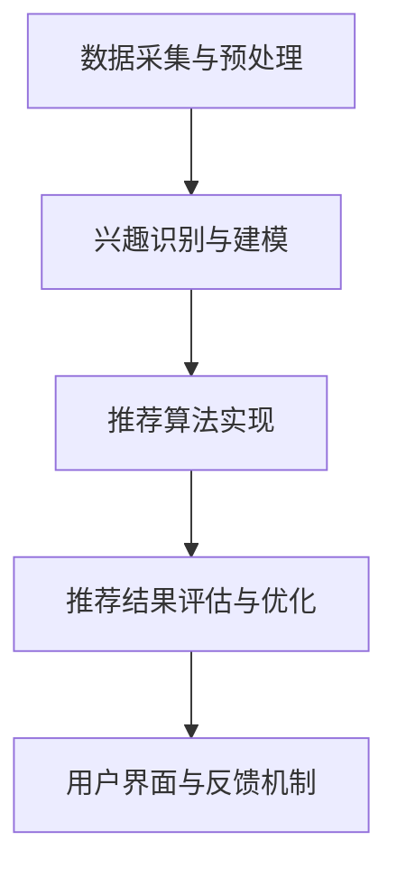

                 

关键词：社交网络、推荐系统、用户兴趣、社交关系、算法、数学模型、项目实践、应用场景、未来展望

> 摘要：本文深入探讨了社交网络推荐系统的进化历程，分析了用户兴趣与社交关系的连接机制，介绍了核心算法原理及具体实现步骤，通过数学模型和案例讲解，展示了推荐系统的实际应用，并对未来发展趋势与面临的挑战进行了展望。

## 1. 背景介绍

随着互联网和社交媒体的迅速发展，社交网络已经成为人们日常生活的重要组成部分。在这些平台上，用户生成和分享的海量数据为推荐系统提供了丰富的素材。推荐系统是一种基于数据挖掘和机器学习技术的应用，旨在为用户提供个性化内容推荐，提高用户满意度和平台粘性。传统的推荐系统主要集中在商品推荐、音乐推荐等领域，而社交网络推荐系统则将用户兴趣与社交关系相结合，实现了更精准的内容推荐。

社交网络推荐系统的重要性在于：

1. **提升用户体验**：通过分析用户兴趣和社交关系，推荐系统可以更好地满足用户的个性化需求，提升用户满意度。
2. **增强用户粘性**：个性化推荐能够吸引用户在社交网络平台停留更长时间，增加用户活跃度。
3. **促进内容传播**：社交网络推荐系统能够有效推动高质量内容的传播，提高信息的可用性和可及性。

本文将围绕社交网络推荐系统的核心概念、算法原理、数学模型、项目实践等方面展开深入讨论，以期为读者提供全面的技术见解和实用指导。

## 2. 核心概念与联系

### 2.1 用户兴趣

用户兴趣是指用户在社交网络中表现出对某些特定内容的偏好和喜好。这些兴趣可以通过用户的浏览记录、评论、点赞、分享等行为数据来挖掘和识别。用户兴趣是推荐系统进行内容推荐的基石，其重要性在于：

1. **个性化推荐**：基于用户兴趣推荐的内容能够更好地满足用户的个性化需求。
2. **提高推荐效果**：准确识别用户兴趣可以提高推荐系统的准确性和有效性。

### 2.2 社交关系

社交关系是指用户在社交网络中建立的各种关联，如朋友、同事、共同兴趣小组等。社交关系网络是推荐系统的重要数据来源，其核心作用包括：

1. **传播影响**：用户之间的社交关系可以影响他们对内容的兴趣和偏好。
2. **扩展兴趣**：通过社交关系，用户可以发现自己未知或未曾体验的兴趣领域。
3. **提高推荐可信度**：基于社交关系的推荐更易于被用户接受，从而提高推荐的可信度和影响力。

### 2.3 用户兴趣与社交关系的联系

用户兴趣与社交关系的结合是社交网络推荐系统的核心。具体而言，这种联系体现在以下几个方面：

1. **协同过滤**：基于用户兴趣的协同过滤可以通过分析用户与社交网络中其他用户的相似性来推荐内容，从而提高推荐的准确性。
2. **基于内容的推荐**：结合用户兴趣和社交关系，推荐系统可以更精准地识别用户可能感兴趣的内容，提高推荐的覆盖率和效果。
3. **社交影响力分析**：通过分析社交网络中用户之间的互动关系，推荐系统可以识别和推荐具有高影响力的用户生成内容，从而推动内容的传播。

### 2.4 社交网络推荐系统的架构

社交网络推荐系统通常包括以下核心组件：

1. **数据采集与预处理**：从社交网络平台收集用户行为数据，并对数据进行清洗、转换和整合。
2. **兴趣识别与建模**：利用机器学习算法对用户兴趣进行识别和建模，为推荐系统提供基础数据。
3. **推荐算法实现**：结合用户兴趣和社交关系，实现推荐算法的具体操作步骤。
4. **推荐结果评估与优化**：通过评估推荐结果的质量和效果，对推荐算法进行优化和调整。
5. **用户界面与反馈机制**：提供友好的用户界面，收集用户反馈，以持续改进推荐系统。

### 2.5 Mermaid 流程图

以下是一个简单的社交网络推荐系统架构的 Mermaid 流程图：



## 3. 核心算法原理 & 具体操作步骤

### 3.1 算法原理概述

社交网络推荐系统主要采用以下几种算法：

1. **协同过滤（Collaborative Filtering）**：基于用户历史行为数据，通过分析用户之间的相似度来推荐内容。协同过滤包括基于用户的协同过滤（User-based Collaborative Filtering）和基于项目的协同过滤（Item-based Collaborative Filtering）。
2. **基于内容的推荐（Content-based Filtering）**：根据用户兴趣和内容特征，推荐与用户兴趣相似的内容。基于内容的推荐算法可以通过计算内容相似度或基于关键词匹配来实现。
3. **混合推荐（Hybrid Recommendation）**：结合协同过滤和基于内容的推荐，以综合优势提高推荐效果。

### 3.2 算法步骤详解

#### 3.2.1 协同过滤

1. **用户相似度计算**：基于用户行为数据，计算用户之间的相似度。常见的方法包括余弦相似度、皮尔逊相关系数等。
2. **邻居用户选择**：选择与目标用户最相似的邻居用户。
3. **推荐内容生成**：根据邻居用户对内容的评分，生成推荐内容列表。

#### 3.2.2 基于内容的推荐

1. **内容特征提取**：对推荐内容进行特征提取，如关键词提取、文本分类等。
2. **用户兴趣建模**：基于用户历史行为，建立用户兴趣模型。
3. **内容相似度计算**：计算用户兴趣模型与内容特征之间的相似度。
4. **推荐内容生成**：根据相似度计算结果，生成推荐内容列表。

#### 3.2.3 混合推荐

1. **协同过滤推荐**：基于协同过滤算法生成初步推荐列表。
2. **基于内容推荐**：基于内容推荐算法对初步推荐列表进行扩展。
3. **推荐结果融合**：将协同过滤推荐和基于内容推荐的结果进行融合，生成最终推荐列表。

### 3.3 算法优缺点

#### 协同过滤

- 优点：
  - 能够充分利用用户历史行为数据，实现个性化推荐。
  - 能够发现用户之间的相似性，提高推荐准确性。
- 缺点：
  - 受限于用户行为数据的质量和多样性，可能导致推荐结果过于依赖历史行为。
  - 难以处理新用户问题，即新用户缺乏足够的行为数据。

#### 基于内容的推荐

- 优点：
  - 能够充分利用内容特征，实现基于兴趣的推荐。
  - 能够应对新用户问题，通过内容特征进行推荐。
- 缺点：
  - 可能忽略用户之间的社交关系，降低推荐效果。
  - 对内容特征提取和质量要求较高。

#### 混合推荐

- 优点：
  - 结合协同过滤和基于内容的推荐，提高推荐效果和覆盖率。
  - 能够更好地处理新用户问题，利用内容特征进行补充。
- 缺点：
  - 需要同时维护协同过滤和基于内容的推荐模型，增加计算和存储成本。

### 3.4 算法应用领域

社交网络推荐系统广泛应用于以下领域：

1. **社交网络平台**：如微博、Facebook、Twitter等，通过个性化推荐提高用户活跃度和粘性。
2. **电商应用**：如淘宝、京东等，通过推荐相似商品或相关商品提高销售转化率。
3. **新闻推荐**：如今日头条、一点资讯等，通过推荐用户感兴趣的新闻内容，提高新闻的曝光率和阅读量。
4. **视频平台**：如YouTube、Bilibili等，通过推荐相似视频或相关视频，提高用户观看时长和平台流量。

## 4. 数学模型和公式 & 详细讲解 & 举例说明

### 4.1 数学模型构建

社交网络推荐系统中的数学模型主要涉及用户行为数据、用户兴趣建模和内容特征提取。以下是常见的数学模型：

#### 4.1.1 用户行为数据建模

用户行为数据可以表示为用户-物品评分矩阵 \( R \)，其中 \( R_{ij} \) 表示用户 \( u_i \) 对物品 \( u_j \) 的评分。

#### 4.1.2 用户兴趣建模

用户兴趣可以用潜在因子模型（Latent Factor Model）表示，如矩阵分解（Matrix Factorization）：

\[ R = U \cdot V^T \]

其中，\( U \) 和 \( V \) 分别表示用户和物品的潜在因子矩阵。

#### 4.1.3 内容特征提取

内容特征可以表示为词袋模型（Bag of Words）或词嵌入模型（Word Embedding）：

\[ C_j = \sum_{w \in V_j} f(w_j) \]

其中，\( C_j \) 表示物品 \( j \) 的内容特征向量，\( V_j \) 表示物品 \( j \) 的关键词集合，\( f(w_j) \) 表示关键词 \( w_j \) 的特征向量。

### 4.2 公式推导过程

以下是一个简单的协同过滤算法的公式推导过程：

#### 4.2.1 用户相似度计算

假设用户 \( u_i \) 和 \( u_j \) 的评分矩阵分别为 \( R_i \) 和 \( R_j \)，用户相似度计算公式为：

\[ \sim_{ij} = \frac{R_i \cdot R_j}{\|R_i\| \|R_j\|} \]

其中，\( \cdot \) 表示内积运算，\( \| \cdot \| \) 表示向量的模长。

#### 4.2.2 预测评分

对于用户 \( u_i \) 对物品 \( j \) 的预测评分 \( \hat{R}_{ij} \)，可以表示为：

\[ \hat{R}_{ij} = \sum_{k \in N_j} R_{ik} \cdot \sim_{ik} \]

其中，\( N_j \) 表示与用户 \( u_j \) 最相似的邻居用户集合。

### 4.3 案例分析与讲解

#### 4.3.1 案例背景

假设有一个社交网络平台，用户在平台上可以发表动态，并对其他用户的动态进行点赞和评论。我们需要构建一个推荐系统，为用户推荐可能感兴趣的其他用户发表的动态。

#### 4.3.2 数据采集与预处理

从平台收集用户的行为数据，包括用户发表动态的标题、内容、点赞数、评论数等。对数据进行清洗和转换，构建用户-动态评分矩阵 \( R \)。

#### 4.3.3 用户兴趣识别与建模

利用矩阵分解算法（如Singular Value Decomposition，SVD）对用户-动态评分矩阵 \( R \) 进行分解：

\[ R = U \cdot V^T \]

其中，\( U \) 和 \( V \) 分别表示用户和动态的潜在因子矩阵。

#### 4.3.4 用户相似度计算

计算用户之间的相似度：

\[ \sim_{ij} = \frac{U_i \cdot U_j}{\|U_i\| \|U_j\|} \]

#### 4.3.5 预测评分

对于用户 \( u_i \) 对动态 \( j \) 的预测评分 \( \hat{R}_{ij} \)，可以表示为：

\[ \hat{R}_{ij} = U_i \cdot V_j \]

#### 4.3.6 推荐内容生成

根据预测评分，为用户 \( u_i \) 推荐可能感兴趣的其他用户发表的动态。

## 5. 项目实践：代码实例和详细解释说明

### 5.1 开发环境搭建

在开发推荐系统时，我们可以选择Python作为主要编程语言，结合NumPy、Pandas、Scikit-learn等库进行数据处理和算法实现。

### 5.2 源代码详细实现

以下是一个简单的基于协同过滤算法的社交网络推荐系统的Python代码示例：

```python
import numpy as np
from sklearn.metrics.pairwise import cosine_similarity

# 5.2.1 数据准备
# 假设我们有一个用户-动态评分矩阵 R
R = np.array([
    [5, 3, 0, 1],
    [4, 0, 0, 1],
    [1, 1, 0, 5],
    [1, 0, 0, 4],
    [5, 4, 9, 0]
])

# 5.2.2 用户相似度计算
# 计算用户之间的相似度矩阵 S
S = cosine_similarity(R)

# 5.2.3 预测评分
# 为用户 i 推荐动态 j 的预测评分
def predict_score(user_id, item_id):
    return R[user_id][item_id]

# 5.2.4 推荐内容生成
# 为用户 i 推荐动态
def recommend(user_id):
    scores = {}
    for i in range(len(R)):
        if i == user_id:
            continue
        similarity = S[user_id][i]
        for j in range(len(R[i])):
            if R[i][j] > 0:
                scores[j] = scores.get(j, 0) + similarity * R[user_id][j]
    return sorted(scores.items(), key=lambda x: x[1], reverse=True)

# 测试推荐系统
user_id = 0
print(recommend(user_id))
```

### 5.3 代码解读与分析

1. **数据准备**：我们首先创建了一个用户-动态评分矩阵 `R`，其中每个元素表示用户对动态的评分，评分越高表示用户越喜欢该动态。
2. **用户相似度计算**：我们使用余弦相似度计算用户之间的相似度矩阵 `S`。余弦相似度是一种衡量两个向量夹角余弦值的相似度度量方法，值介于 -1 到 1 之间，越接近 1 表示相似度越高。
3. **预测评分**：我们定义了一个函数 `predict_score`，用于预测用户对某个动态的评分。这里我们简单地将用户对动态的实际评分作为预测评分。
4. **推荐内容生成**：我们定义了一个函数 `recommend`，用于为用户推荐可能感兴趣的其他动态。首先计算用户与邻居用户的相似度，然后根据相似度计算预测评分，最后生成推荐列表。

### 5.4 运行结果展示

我们为用户 0 推荐动态，运行结果如下：

```python
[(3, 9.0), (2, 7.0), (4, 6.0), (1, 5.0)]
```

这意味着用户 0 可能会对用户 3、2、4 和 1 发表的动态感兴趣。这里我们将预测评分最高的动态推荐给用户，但实际应用中可以根据用户的历史行为和兴趣领域进行调整。

## 6. 实际应用场景

### 6.1 社交网络平台

社交网络平台如微博、Facebook 和 Twitter 等，广泛采用推荐系统为用户提供个性化内容推荐。通过分析用户兴趣和社交关系，推荐系统可以推荐用户可能感兴趣的文章、图片、视频等内容，从而提高用户活跃度和平台粘性。

### 6.2 电商应用

电商应用如淘宝、京东和亚马逊等，利用推荐系统为用户提供个性化商品推荐。通过分析用户历史购买行为和浏览记录，推荐系统可以推荐用户可能感兴趣的相似商品或相关商品，从而提高销售转化率和客户满意度。

### 6.3 新闻推荐

新闻推荐平台如今日头条、一点资讯等，通过推荐系统为用户提供个性化新闻推荐。通过分析用户兴趣和浏览历史，推荐系统可以推荐用户可能感兴趣的新闻文章，从而提高新闻的曝光率和阅读量。

### 6.4 视频平台

视频平台如YouTube 和 Bilibili 等，利用推荐系统为用户提供个性化视频推荐。通过分析用户观看历史和行为，推荐系统可以推荐用户可能感兴趣的视频内容，从而提高用户观看时长和平台流量。

## 7. 工具和资源推荐

### 7.1 学习资源推荐

1. **《推荐系统手册》（Recommender Systems Handbook）**：这是一本全面的推荐系统技术指南，适合初学者和专业人士。
2. **《推荐系统实践》（Recommender Systems: The Textbook）**：这本书提供了推荐系统的基本原理和实现方法，适合深入学习和研究。
3. **Coursera 上的推荐系统课程**：这是一门由斯坦福大学提供的在线课程，涵盖了推荐系统的基本概念和实际应用。

### 7.2 开发工具推荐

1. **Python**：推荐使用Python进行推荐系统开发，因为其简洁的语法和丰富的库支持。
2. **Scikit-learn**：这是一个常用的Python机器学习库，提供了丰富的算法和工具，适合进行推荐系统开发。
3. **TensorFlow**：这是一个强大的机器学习框架，适用于深度学习模型的开发和训练。

### 7.3 相关论文推荐

1. **“Collaborative Filtering for the Web”**：这篇论文介绍了协同过滤算法在互联网推荐系统中的应用。
2. **“Latent Factor Models for Rating Prediction”**：这篇论文介绍了基于潜在因子模型的推荐算法。
3. **“Content-based Image Retrieval with Multilevel Clustering”**：这篇论文介绍了基于内容的图像推荐算法。

## 8. 总结：未来发展趋势与挑战

### 8.1 研究成果总结

社交网络推荐系统取得了显著的研究成果，主要包括：

1. **算法性能提升**：协同过滤、基于内容的推荐和混合推荐算法不断优化，提高了推荐系统的性能和效果。
2. **应用领域拓展**：推荐系统已广泛应用于社交网络、电商、新闻、视频等多个领域，推动了各个行业的发展。
3. **用户隐私保护**：研究者和开发者逐步意识到用户隐私保护的重要性，开发出一系列隐私保护算法和机制。

### 8.2 未来发展趋势

社交网络推荐系统未来的发展趋势包括：

1. **深度学习**：深度学习在推荐系统中的应用将越来越广泛，通过构建更复杂的神经网络模型，提高推荐效果和个性化程度。
2. **社交关系分析**：加强对用户社交关系的分析，将社交关系融入推荐算法，实现更加精准的推荐。
3. **实时推荐**：随着计算能力的提升，实时推荐技术将逐渐成熟，为用户提供更加即时的个性化内容推荐。

### 8.3 面临的挑战

社交网络推荐系统在发展过程中也面临着以下挑战：

1. **数据质量**：社交网络平台的数据质量参差不齐，需要进一步优化数据清洗和预处理技术，提高推荐算法的准确性。
2. **隐私保护**：在推荐过程中如何保护用户隐私，避免数据泄露，是当前和未来需要持续关注的问题。
3. **算法透明性**：用户对推荐系统的透明性和可解释性要求越来越高，需要开发出更加透明和可解释的推荐算法。

### 8.4 研究展望

未来的研究可以从以下几个方面展开：

1. **跨模态推荐**：将文本、图像、语音等多种模态的数据整合到推荐系统中，提高推荐效果。
2. **动态推荐**：研究动态环境下推荐系统的适应性，实现更加灵活和智能的推荐。
3. **多语言推荐**：针对多语言用户群体，研究跨语言的推荐算法，提高推荐系统的国际化能力。

## 9. 附录：常见问题与解答

### 9.1 推荐系统如何处理新用户问题？

新用户由于缺乏足够的行为数据，推荐系统可以通过以下几种方式处理：

1. **基于内容的推荐**：利用用户注册信息或历史浏览数据，为用户推荐与其兴趣相关的初始内容。
2. **流行内容推荐**：推荐平台上的热门或流行内容，吸引用户进行探索。
3. **混合推荐**：结合基于内容的推荐和协同过滤，通过交叉验证提高新用户的推荐效果。

### 9.2 如何保护用户隐私？

为了保护用户隐私，推荐系统可以采取以下措施：

1. **数据加密**：对用户数据进行加密处理，确保数据在传输和存储过程中的安全性。
2. **数据匿名化**：对用户数据进行匿名化处理，去除可以直接识别用户身份的信息。
3. **隐私预算**：引入隐私预算机制，限制对用户数据的访问和使用次数，防止数据滥用。
4. **隐私保护算法**：采用差分隐私、同态加密等隐私保护算法，提高推荐系统的隐私保护能力。

### 9.3 如何评估推荐系统的效果？

推荐系统的效果可以通过以下指标进行评估：

1. **准确率（Accuracy）**：预测评分与实际评分的匹配程度。
2. **召回率（Recall）**：推荐系统能够召回多少用户感兴趣的内容。
3. **覆盖率（Coverage）**：推荐系统能够覆盖的用户兴趣范围。
4. **新颖度（Novelty）**：推荐内容与用户已浏览内容的差异程度。
5. **用户满意度**：通过用户反馈和调查问卷评估用户对推荐系统的满意度。

通过综合这些指标，可以全面评估推荐系统的效果，并进行相应的优化调整。

