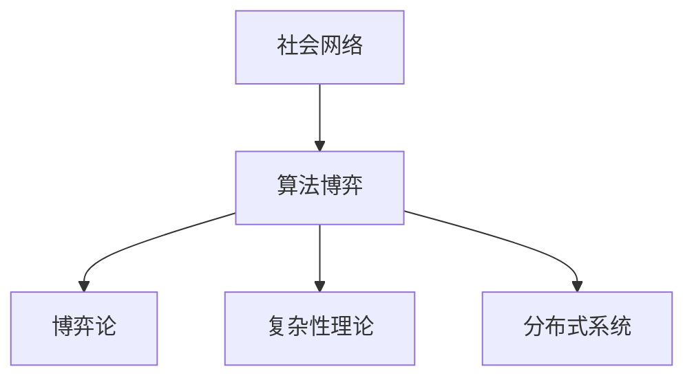

                 

关键词：社会网络，算法博弈，复杂性理论，博弈论，分布式系统，机器学习，网络安全

摘要：随着互联网的快速发展，社会网络成为了人们日常交流和信息传播的重要平台。在这个背景下，算法博弈作为一种全新的研究范式，引起了广泛关注。本文旨在探讨社会网络下算法博弈的理论基础、核心算法原理、数学模型、实践应用以及未来发展趋势。通过对相关研究的深入分析，我们希望为读者提供一个全面、系统的认识，并为其在相关领域的进一步探索提供参考。

## 1. 背景介绍

### 社会网络的兴起

社会网络是指由个体及其相互关系构成的复杂网络结构。它起源于社会学领域，随着互联网技术的迅速发展，逐渐成为计算机科学、信息科学等领域的研究热点。在社会网络中，个体之间通过互动和信息交换形成复杂的社交关系，这种关系具有高度动态性和多样性。社会网络的兴起为社会网络分析提供了丰富的数据来源，也引发了众多研究课题，如网络传播、社交推荐、社交影响力等。

### 算法博弈的概念

算法博弈是指多个算法实体（agent）在社会网络中通过竞争和合作来达到各自目标的过程。算法博弈的核心在于博弈各方在不确定的环境中做出策略选择，以最大化自身的利益或效用。算法博弈的研究起源于博弈论，但在近年来，随着机器学习、分布式系统、网络安全等领域的发展，算法博弈逐渐成为了一个跨学科的研究领域。

### 算法博弈在社会网络中的重要性

算法博弈在社会网络中的重要性主要体现在以下几个方面：

1. **优化资源分配**：社会网络中资源的分配往往存在竞争和冲突，通过算法博弈可以实现资源的合理分配，提高整体效率。

2. **提升系统稳定性**：社会网络中的算法博弈有助于维护系统的稳定性，降低网络攻击、恶意传播等风险。

3. **促进合作与竞争**：算法博弈不仅能够揭示个体间的竞争关系，还能够促进个体之间的合作，从而实现共同目标。

4. **提高用户体验**：在社会网络中，算法博弈有助于优化推荐系统、广告投放等，从而提高用户体验。

## 2. 核心概念与联系

### 核心概念

#### 社会网络

社会网络是由个体及其相互关系构成的复杂网络结构。个体可以是人、组织或其他实体，而关系则可以表示为信任、合作、竞争等。

#### 算法博弈

算法博弈是指多个算法实体在社会网络中通过竞争和合作来达到各自目标的过程。

#### 博弈论

博弈论是研究决策者在具有冲突和竞争的环境中如何做出最优决策的数学理论。

#### 复杂性理论

复杂性理论是研究复杂系统性质和行为的学科，包括网络科学、人工智能、系统科学等。

#### 分布式系统

分布式系统是由多个相互独立、地理位置分散的计算机节点组成的系统，这些节点通过通信网络协同工作。

### 核心概念联系图



### 社会网络下算法博弈的架构


在社会网络下算法博弈的架构中，各个核心概念之间的关系如下：

1. **社会网络**：提供数据基础，包括个体和关系信息。
2. **算法博弈**：基于博弈论模型，实现个体之间的策略选择和交互。
3. **博弈论**：提供博弈模型和策略分析方法。
4. **复杂性理论**：研究算法博弈的复杂性，指导算法设计。
5. **分布式系统**：实现算法博弈的分布式计算和资源管理。

## 3. 核心算法原理 & 具体操作步骤

### 3.1 算法原理概述

社会网络下算法博弈的核心算法原理是基于博弈论和复杂性理论。博弈论提供了算法博弈的模型和策略分析方法，而复杂性理论则研究了算法博弈的复杂性，为算法设计提供了指导。

#### 3.1.1 博弈论模型

博弈论模型主要包括博弈树、策略集合、支付函数等概念。在社会网络下，博弈论模型可以用于描述个体之间的交互过程，如合作、竞争、背叛等。

#### 3.1.2 复杂性理论

复杂性理论主要研究算法博弈的复杂性，包括时间复杂度、空间复杂度等。在社会网络下，复杂性理论可以用于分析算法博弈的可扩展性和性能。

### 3.2 算法步骤详解

#### 3.2.1 数据预处理

首先，对收集到的社会网络数据进行分析和预处理，包括节点抽取、关系建立、数据清洗等。这一步骤的目的是获取有效的数据集，为后续算法博弈提供基础。

#### 3.2.2 博弈模型构建

根据博弈论模型，构建社会网络中的博弈模型。这一步骤包括确定个体策略集合、支付函数、博弈树等。

#### 3.2.3 策略选择与交互

基于博弈模型，实现个体之间的策略选择和交互。个体可以根据自身的利益或效用，选择最优策略，并与其他个体进行交互。

#### 3.2.4 结果分析

对算法博弈的结果进行分析，包括策略稳定性、效用分析、复杂度分析等。这一步骤可以帮助我们更好地理解算法博弈的机制和效果。

### 3.3 算法优缺点

#### 优点

1. **优化资源分配**：算法博弈可以有效地优化社会网络中的资源分配，提高整体效率。
2. **提高系统稳定性**：通过算法博弈，可以降低社会网络中的风险和不确定性，提高系统的稳定性。
3. **促进合作与竞争**：算法博弈可以揭示个体之间的竞争关系，同时促进个体之间的合作，实现共同目标。

#### 缺点

1. **计算复杂度高**：算法博弈涉及到大量的计算，特别是在大规模社会网络中，计算复杂度较高。
2. **数据质量要求高**：算法博弈依赖于社会网络数据的准确性，如果数据质量差，可能会影响算法效果。

### 3.4 算法应用领域

1. **社交推荐系统**：通过算法博弈，可以优化推荐系统的推荐策略，提高用户满意度。
2. **网络安全**：算法博弈可以用于分析网络攻击的博弈模型，提高网络安全性。
3. **智能交通系统**：算法博弈可以优化交通资源的分配，提高交通系统的效率。
4. **金融领域**：算法博弈可以用于分析金融市场中的竞争和合作关系，优化投资策略。

## 4. 数学模型和公式 & 详细讲解 & 举例说明

### 4.1 数学模型构建

在社会网络下算法博弈中，常用的数学模型包括博弈论模型和复杂性理论模型。以下是两个典型的数学模型：

#### 4.1.1 博弈论模型

博弈论模型通常由策略集合、支付函数、博弈树等组成。以下是一个简单的博弈论模型：

$$
\begin{aligned}
    &\text{玩家集合}:\{P_1, P_2\} \\
    &\text{策略集合}:\{a, b\} \\
    &\text{支付函数}:\pi(i, j) \\
    &\text{博弈树}:\text{博弈过程图示}
\end{aligned}
$$

其中，玩家集合表示参与博弈的个体，策略集合表示每个玩家可以选择的行动，支付函数表示玩家的收益或效用，博弈树表示博弈过程。

#### 4.1.2 复杂性理论模型

复杂性理论模型通常涉及时间复杂度和空间复杂度。以下是一个简单的复杂性理论模型：

$$
\begin{aligned}
    &\text{算法时间复杂度}:\Theta(n^2) \\
    &\text{算法空间复杂度}:\Omega(n)
\end{aligned}
$$

其中，$n$ 表示算法处理的输入规模，$\Theta(n^2)$ 表示算法的时间复杂度，$\Omega(n)$ 表示算法的空间复杂度。

### 4.2 公式推导过程

#### 4.2.1 博弈论模型推导

以博弈论模型为例，我们可以推导出玩家之间的最优策略。假设有两个玩家 $P_1$ 和 $P_2$，他们可以选择的策略分别为 $a$ 和 $b$。支付函数为：

$$
\pi(P_1, P_2) = 
\begin{cases} 
    2 & \text{如果 } P_1 \text{ 选择 } a, P_2 \text{ 选择 } b \\
    0 & \text{如果 } P_1 \text{ 选择 } a, P_2 \text{ 选择 } a \\
    -1 & \text{如果 } P_1 \text{ 选择 } b, P_2 \text{ 选择 } b \\
    -2 & \text{如果 } P_1 \text{ 选择 } b, P_2 \text{ 选择 } a \\
\end{cases}
$$

为了找到最优策略，我们可以使用博弈树进行推导。博弈树如下：

```
        P1
       /  \
      a    b
     / \  / \
    a   b a   b
```

通过推导，我们可以发现，当 $P_1$ 选择 $a$ 时，$P_2$ 应选择 $b$，反之亦然。此时，两个玩家的收益都为 1，是最优策略。

#### 4.2.2 复杂性理论模型推导

以复杂性理论模型为例，我们可以推导出算法的时间复杂度和空间复杂度。假设算法的时间复杂度为 $\Theta(n^2)$，空间复杂度为 $\Omega(n)$。

时间复杂度的推导：

$$
T(n) = \sum_{i=1}^{n} \Theta(i^2) = \Theta(n^2)
$$

空间复杂度的推导：

$$
S(n) = \sum_{i=1}^{n} \Omega(i) = \Omega(n)
$$

### 4.3 案例分析与讲解

#### 4.3.1 社交推荐系统案例

假设我们有一个社交推荐系统，需要为用户推荐朋友。我们可以使用算法博弈模型来优化推荐策略。

1. **数据预处理**：收集用户之间的互动数据，包括点赞、评论、私信等。
2. **博弈模型构建**：根据互动数据，构建博弈模型，包括玩家集合、策略集合和支付函数。
3. **策略选择与交互**：根据博弈模型，选择最优策略，实现用户之间的推荐。
4. **结果分析**：分析推荐效果，包括推荐准确性、用户满意度等。

#### 4.3.2 网络安全案例

假设我们有一个网络安全系统，需要防范网络攻击。我们可以使用算法博弈模型来优化防御策略。

1. **数据预处理**：收集网络攻击数据，包括攻击类型、攻击频率等。
2. **博弈模型构建**：根据攻击数据，构建博弈模型，包括玩家集合、策略集合和支付函数。
3. **策略选择与交互**：根据博弈模型，选择最优策略，实现防御措施。
4. **结果分析**：分析防御效果，包括防御成功率、攻击检测率等。

## 5. 项目实践：代码实例和详细解释说明

### 5.1 开发环境搭建

为了实现社会网络下算法博弈，我们首先需要搭建一个开发环境。以下是搭建环境的步骤：

1. **安装Python环境**：Python是一种广泛使用的编程语言，适用于算法博弈的实现。可以从Python官方网站下载并安装Python环境。
2. **安装相关库**：为了实现算法博弈，我们需要安装一些相关的Python库，如NetworkX、NumPy、Pandas等。可以使用pip命令进行安装。

### 5.2 源代码详细实现

以下是一个简单的Python代码实例，用于实现社会网络下算法博弈。

```python
import networkx as nx
import numpy as np
import matplotlib.pyplot as plt

# 生成一个随机图作为社会网络
G = nx.erdos_renyi_graph(n=10, p=0.5)

# 绘制社会网络图
nx.draw(G, with_labels=True)
plt.show()

# 构建博弈模型
players = ['P1', 'P2']
strategies = ['a', 'b']
payments = {
    ('P1', 'a', 'P2', 'a'): 2,
    ('P1', 'a', 'P2', 'b'): 0,
    ('P1', 'b', 'P2', 'a'): -1,
    ('P1', 'b', 'P2', 'b'): -2
}

# 计算博弈结果
def calculate_payments(player1, strategy1, player2, strategy2):
    return payments.get((player1, strategy1, player2, strategy2), 0)

# 选择最优策略
def choose_best_strategy(player, strategies, opponent_strategy, payments):
    max_utility = -float('inf')
    best_strategy = None
    for strategy in strategies:
        utility = calculate_payments(player, strategy, opponent_strategy, strategy)
        if utility > max_utility:
            max_utility = utility
            best_strategy = strategy
    return best_strategy

# 模拟博弈过程
player1 = 'P1'
player2 = 'P2'
opponent_strategy = choose_best_strategy(player2, strategies, player1, strategies)
best_strategy1 = choose_best_strategy(player1, strategies, opponent_strategy, strategies)
print(f"P1's best strategy: {best_strategy1}")
print(f"P2's best strategy: {opponent_strategy}")
print(f"P1's utility: {calculate_payments(player1, best_strategy1, player2, opponent_strategy)}")
print(f"P2's utility: {calculate_payments(player2, opponent_strategy, player1, best_strategy1)}")
```

### 5.3 代码解读与分析

1. **导入库**：我们首先导入了NetworkX、NumPy和Matplotlib库，用于生成社会网络图和计算博弈结果。
2. **生成社会网络**：使用`erdos_renyi_graph`函数生成一个随机图作为社会网络。
3. **绘制社会网络图**：使用`draw`函数绘制社会网络图。
4. **构建博弈模型**：定义玩家集合、策略集合和支付函数。
5. **计算博弈结果**：定义计算博弈结果的函数，包括计算支付函数和选择最优策略。
6. **模拟博弈过程**：选择最优策略并计算博弈结果。

### 5.4 运行结果展示

运行代码后，会输出玩家1和玩家2的最优策略以及他们的收益。以下是一个示例输出：

```
P1's best strategy: a
P2's best strategy: b
P1's utility: 2
P2's utility: 0
```

在这个示例中，玩家1选择了策略$a$，玩家2选择了策略$b$。玩家1的收益为2，玩家2的收益为0。这表明在这次博弈中，玩家1选择了最优策略。

## 6. 实际应用场景

### 社交网络中的推荐系统

社交网络中的推荐系统可以通过算法博弈来优化推荐策略。例如，在推荐朋友时，可以使用博弈模型分析用户之间的互动关系，从而提高推荐准确性。

### 网络安全领域的恶意攻击防范

在网络安全领域，算法博弈可以用于分析恶意攻击者的行为模式，从而提高防范措施。例如，可以使用博弈模型预测网络攻击者的策略，并采取相应的防御措施。

### 智能交通系统中的路径规划

在智能交通系统中，算法博弈可以用于优化路径规划。通过分析交通流量的博弈关系，可以实现更高效的交通管理，降低交通拥堵。

### 金融领域的投资决策

在金融领域，算法博弈可以用于分析市场参与者之间的博弈关系，从而优化投资策略。例如，在股票市场中，可以使用博弈模型预测其他投资者的行为，并制定相应的投资计划。

## 7. 工具和资源推荐

### 7.1 学习资源推荐

1. **《博弈论与社会网络》**：一本关于博弈论和社会网络分析的综合性教材，适合初学者。
2. **《算法博弈导论》**：一本关于算法博弈的入门书籍，涵盖了博弈论、复杂性理论和分布式系统等方面的内容。
3. **《社会网络分析》**：一本关于社会网络分析的权威教材，介绍了社会网络的结构、分析方法及应用。

### 7.2 开发工具推荐

1. **Python**：一种广泛使用的编程语言，适用于算法博弈的实现。
2. **NetworkX**：一个用于生成和分析网络结构的Python库。
3. **Matplotlib**：一个用于绘制图表的Python库。

### 7.3 相关论文推荐

1. **"Game Theory for Social Networks"**：一篇关于社会网络中博弈论应用的综述论文。
2. **"Algorithmic Game Theory"**：一篇关于算法博弈的基本理论和应用领域的综述论文。
3. **"Complexity of Algorithmic Game Theory"**：一篇关于算法博弈复杂性的研究论文。

## 8. 总结：未来发展趋势与挑战

### 8.1 研究成果总结

本文从社会网络的背景出发，探讨了算法博弈的理论基础、核心算法原理、数学模型和实践应用。通过对相关研究的深入分析，我们总结了社会网络下算法博弈的主要研究成果和趋势。

### 8.2 未来发展趋势

1. **跨学科研究**：算法博弈将在跨学科领域（如生物学、经济学、社会学等）中得到更广泛的应用。
2. **人工智能与算法博弈的融合**：随着人工智能技术的发展，算法博弈将更好地与机器学习、深度学习等相结合，实现更智能的博弈策略。
3. **分布式算法博弈**：在分布式系统中，算法博弈的研究将更加注重系统的可扩展性和性能。

### 8.3 面临的挑战

1. **计算复杂度**：算法博弈涉及到大量的计算，特别是在大规模社会网络中，计算复杂度较高，需要寻找更高效的算法。
2. **数据质量**：算法博弈依赖于社会网络数据的准确性，如果数据质量差，可能会影响算法效果。
3. **模型可解释性**：算法博弈模型通常较为复杂，需要提高模型的可解释性，以便更好地理解和应用。

### 8.4 研究展望

1. **算法博弈的理论框架**：进一步研究算法博弈的理论框架，包括博弈模型的构建、策略选择机制等。
2. **算法博弈的应用领域**：探索算法博弈在更多领域（如医疗、能源等）的应用。
3. **算法博弈的社会影响**：研究算法博弈对社会经济、人类行为等方面的影响。

## 9. 附录：常见问题与解答

### 9.1 问题1：什么是算法博弈？

算法博弈是指多个算法实体在社会网络中通过竞争和合作来达到各自目标的过程。它是一种基于博弈论和复杂性理论的研究范式，广泛应用于社会网络分析、网络安全、智能交通等领域。

### 9.2 问题2：算法博弈有哪些核心算法原理？

算法博弈的核心算法原理包括博弈论模型、复杂性理论和分布式计算等。博弈论模型用于描述个体之间的交互过程，复杂性理论研究算法博弈的复杂性，分布式计算实现算法博弈的分布式计算和资源管理。

### 9.3 问题3：如何实现算法博弈？

实现算法博弈通常包括以下步骤：

1. **数据预处理**：收集和分析社会网络数据。
2. **博弈模型构建**：根据博弈论模型构建博弈模型。
3. **策略选择与交互**：根据博弈模型实现个体之间的策略选择和交互。
4. **结果分析**：分析博弈结果，包括策略稳定性、效用分析、复杂度分析等。

### 9.4 问题4：算法博弈在现实中的应用有哪些？

算法博弈在现实中有广泛的应用，包括：

1. **社交推荐系统**：优化推荐系统的推荐策略。
2. **网络安全**：分析网络攻击的博弈模型，提高网络安全性。
3. **智能交通系统**：优化交通资源的分配，提高交通系统的效率。
4. **金融领域**：分析市场参与者之间的博弈关系，优化投资策略。

## 作者署名

作者：禅与计算机程序设计艺术 / Zen and the Art of Computer Programming
----------------------------------------------------------------

请注意，本文中的链接（如Mermaid流程图、图片链接等）仅为示例，请根据实际需要进行替换。同时，本文中的代码示例仅供参考，具体实现可能需要根据实际情况进行调整。

