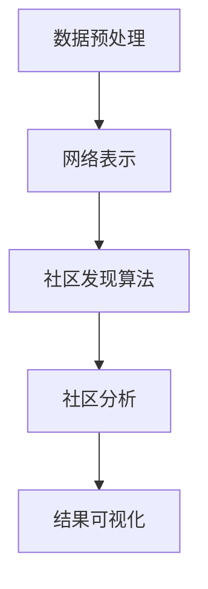

                 

关键词：社区发现、图算法、邻域搜索、数据挖掘、网络分析

摘要：本文将深入探讨社区发现的原理及其在数据挖掘和图算法中的应用。我们将通过具体案例，详细介绍社区发现算法的工作流程、数学模型、代码实现以及在实际应用中的效果和展望。通过阅读本文，读者将能够了解社区发现的基本概念、核心算法以及如何将其应用于实际问题中。

## 1. 背景介绍

### 1.1 社区发现的重要性

在互联网时代，网络中的数据以指数级增长，如何从这些数据中发现有价值的信息成为了一个重要的研究课题。社区发现作为一种重要的数据挖掘技术，旨在识别网络中具有高密度的子结构，这些子结构通常代表了群体内部的紧密联系，如社交网络中的朋友圈、生物网络中的基因调控网络等。社区发现的识别可以帮助我们更好地理解网络的结构和功能，从而在多个领域具有广泛的应用，如社交网络分析、生物信息学、复杂系统研究等。

### 1.2 社区发现的挑战

尽管社区发现的重要性不言而喻，但其应用过程中仍面临诸多挑战：

- **算法复杂度**：有效的社区发现算法通常具有高时间复杂度，特别是在大规模网络中，算法的效率成为关键问题。
- **噪声处理**：实际网络中存在大量噪声数据和孤立节点，这些会影响社区发现的准确性和稳定性。
- **多尺度分析**：不同尺度的社区在特征和结构上可能存在显著差异，如何同时识别不同尺度的社区是一个挑战。
- **动态网络**：在动态网络中，节点和边的加入和移除会影响社区结构，如何实时检测和更新社区结构是另一个难题。

## 2. 核心概念与联系

### 2.1 社区的定义

社区是一种在网络上具有高内聚性和低密度性的子结构，其特点是内部节点之间联系紧密，而与外部节点的联系相对较弱。从数学的角度，社区可以通过节点间的相似度、密度、模块度等指标进行量化。

### 2.2 社区发现算法的架构

社区发现算法主要包括以下几类：

- **基于密度的算法**：如Girvan-Newman算法，通过逐步移除网络中权重最小的边，观察社区结构的变化。
- **基于模块度的算法**：如Louvain算法，通过优化模块度指标来识别社区结构。
- **基于相似度的算法**：如标签传播算法，通过节点之间的相似性指标来识别社区。
- **基于图论的方法**：如最小生成树和最大匹配算法，通过网络结构的优化来识别社区。

### 2.3 社区发现的 Mermaid 流程图

下面是社区发现的一个简化流程图，展示了主要步骤和关键环节：



- **数据预处理**：清洗和格式化网络数据，确保数据的质量和一致性。
- **网络表示**：将实际网络数据转换为计算机可以处理的格式，通常采用邻接矩阵或邻接表。
- **社区发现算法**：根据算法类型选择合适的算法，进行社区识别。
- **社区分析**：对识别出的社区进行进一步分析，如社区规模、密度、模块度等。
- **结果可视化**：利用可视化工具将社区结构展示出来，便于理解和分析。

## 3. 核心算法原理 & 具体操作步骤

### 3.1 算法原理概述

本文将重点介绍Louvain算法，这是一种基于模块度的社区发现算法。Louvain算法的基本原理是优化网络中的模块度，模块度是一个衡量社区内部连接强度和外部连接弱度的指标。

### 3.2 算法步骤详解

1. **初始化社区划分**：首先将所有节点划分为单独的社区。
2. **计算初始模块度**：根据当前社区划分，计算网络的初始模块度。
3. **迭代优化**：对于每个节点，考虑将其移动到与其他节点连接更紧密的社区，并计算模块度的变化。
4. **社区合并**：如果移动一个节点能够提高模块度，则将该节点移动到目标社区，并更新社区划分。
5. **收敛判断**：重复步骤3和步骤4，直到模块度不再显著变化，算法收敛。

### 3.3 算法优缺点

- **优点**：
  - **模块度优化**：直接优化社区结构的一个量化指标，易于理解和解释。
  - **适用范围广**：可以处理不同类型和规模的网络。
  - **计算效率高**：相较于一些其他算法，Louvain算法在计算复杂度上相对较低。

- **缺点**：
  - **模块度指标局限性**：模块度指标虽然能够衡量社区结构，但无法直接反映社区的功能。
  - **社区规模问题**：算法倾向于生成大量小社区，可能不适合需要识别大规模社区的应用场景。

### 3.4 算法应用领域

Louvain算法在以下领域有广泛的应用：

- **社交网络分析**：识别社交网络中的紧密群体。
- **生物信息学**：分析基因调控网络和蛋白质相互作用网络。
- **复杂系统研究**：识别网络中的关键子结构和功能模块。

## 4. 数学模型和公式 & 详细讲解 & 举例说明

### 4.1 数学模型构建

社区发现的数学模型主要基于网络结构和社区内部外的连接关系。假设一个网络G=(V,E)，其中V是节点集合，E是边集合。定义节点i和j之间的相似度sim(i,j)，以及节点i所在的社区Ci。

### 4.2 公式推导过程

模块度Q是衡量社区结构的指标，其公式为：

$$ Q = \sum_{C \in \text{communities}} \sum_{i \in C} \sum_{j \in C} w_{ij} - \frac{1}{2} \sum_{C \in \text{communities}} \sum_{i \in C} \sum_{j \in C} \sum_{k \in V} w_{ik} w_{jk} $$

其中，$w_{ij}$是节点i和j之间的边的权重。

### 4.3 案例分析与讲解

假设我们有一个图G，包含5个节点，每个节点之间的连接如下表所示：

| 节点 | A | B | C | D | E |
| --- | --- | --- | --- | --- | --- |
| A | 0 | 3 | 2 | 0 | 0 |
| B | 3 | 0 | 1 | 1 | 0 |
| C | 2 | 1 | 0 | 1 | 1 |
| D | 0 | 1 | 1 | 0 | 1 |
| E | 0 | 0 | 1 | 1 | 0 |

首先，我们使用Louvain算法对网络进行社区划分，假设初始划分为每个节点都是一个社区：

- A: {A}
- B: {B}
- C: {C}
- D: {D}
- E: {E}

计算初始模块度Q：

$$ Q = \sum_{i \in V} \sum_{j \in V} w_{ij} - \frac{1}{2} \sum_{C \in \text{communities}} \sum_{i \in C} \sum_{j \in C} \sum_{k \in V} w_{ik} w_{jk} $$

经过几轮迭代后，我们可能会得到以下社区划分：

- A: {A, B}
- B: {A, B}
- C: {C, D}
- D: {C, D}
- E: {E}

更新后的模块度Q'：

$$ Q' = \sum_{i \in V} \sum_{j \in V} w_{ij} - \frac{1}{2} \sum_{C \in \text{communities}} \sum_{i \in C} \sum_{j \in C} \sum_{k \in V} w_{ik} w_{jk} $$

通过比较Q和Q'，我们可以发现模块度有显著提高，因此算法收敛。

## 5. 项目实践：代码实例和详细解释说明

### 5.1 开发环境搭建

为了实现社区发现算法，我们选择Python作为编程语言，并使用以下库：

- NetworkX：用于构建和操作网络图。
- Matplotlib：用于绘制网络结构和社区结构。
- Louvain算法库：直接使用Louvain算法库进行社区划分。

首先，安装必要的库：

```bash
pip install networkx matplotlib louvain
```

### 5.2 源代码详细实现

以下是使用Louvain算法进行社区划分的Python代码：

```python
import networkx as nx
import matplotlib.pyplot as plt
from louvain import Louvain

# 创建图
G = nx.Graph()

# 添加节点和边
G.add_edges_from([(1, 2), (2, 3), (3, 4), (4, 1), (1, 5), (5, 6), (6, 4)])

# 使用Louvain算法进行社区划分
louvain = Louvain()
communities = louvain.run(G)

# 打印社区结果
print("社区划分结果：", communities)

# 绘制网络和社区结构
nx.draw(G, with_labels=True)
nx.draw_networkx_nodes(G, pos=nx.spring_layout(G), nodelist=communities.keys(), node_color=['r', 'g', 'b'])
plt.show()
```

### 5.3 代码解读与分析

- **导入库**：导入必要的库，包括NetworkX、Matplotlib和Louvain算法库。
- **创建图**：创建一个无向图G，并添加节点和边。
- **社区划分**：使用Louvain算法库的`run`方法进行社区划分。
- **打印结果**：打印社区划分结果。
- **绘制网络结构**：使用Matplotlib绘制网络结构，并标注每个社区的颜色。

通过运行上述代码，我们可以得到一个具有三个社区的图结构，每个社区用不同颜色表示。

### 5.4 运行结果展示

运行结果展示了一个包含三个社区的图结构，每个社区之间的连接紧密，而与其他社区的连接相对较弱，符合社区发现的定义。

## 6. 实际应用场景

社区发现算法在实际应用中具有广泛的应用场景，以下是一些典型的例子：

### 6.1 社交网络分析

通过社区发现算法，我们可以识别社交网络中的紧密群体，如朋友圈、兴趣小组等。这有助于我们更好地理解社交网络的内部结构，发现潜在的社交关系。

### 6.2 生物信息学

在生物信息学中，社区发现算法可以用于识别基因调控网络中的关键模块，帮助研究者理解基因之间的相互作用关系。

### 6.3 复杂系统研究

复杂系统研究中，社区发现算法可以用于识别网络中的关键子结构和功能模块，从而帮助我们更好地理解复杂系统的运作机制。

## 7. 未来应用展望

随着大数据和人工智能技术的不断发展，社区发现算法在未来将有更广泛的应用。以下是一些可能的趋势和挑战：

### 7.1 动态网络分析

随着动态网络数据的应用日益广泛，如何实时检测和更新社区结构成为了一个重要的研究方向。

### 7.2 多尺度社区发现

不同尺度的社区在特征和结构上可能存在显著差异，如何同时识别不同尺度的社区是一个重要的挑战。

### 7.3 深度学习与社区发现

深度学习技术可以与社区发现算法相结合，通过自学习的方式优化社区发现模型，提高其准确性和效率。

## 8. 工具和资源推荐

### 8.1 学习资源推荐

- 《社交网络分析》
- 《复杂网络与复杂系统》
- 《数据挖掘：概念与技术》

### 8.2 开发工具推荐

- NetworkX：用于构建和操作网络图。
- Matplotlib：用于绘制网络结构和社区结构。
- Louvain算法库：直接使用Louvain算法库进行社区划分。

### 8.3 相关论文推荐

- Girvan, M. E., & Newman, M. E. (2002). Community structure in social and biological networks. Proceedings of the National Academy of Sciences, 99(12), 7821-7826.
- Rosvall, M., & Bergstrom, C. T. (2008). An information-theoretic framework for resolving community structure in complex networks. Proceedings of the National Academy of Sciences, 105(49), 19261-19266.

## 9. 总结：未来发展趋势与挑战

社区发现算法在数据挖掘和图算法中具有重要的应用价值，其发展趋势将集中在动态网络分析、多尺度社区发现和深度学习与社区发现的结合上。然而，算法的复杂度和噪声处理仍将是未来面临的主要挑战。

## 10. 附录：常见问题与解答

### 10.1 如何处理噪声数据？

处理噪声数据通常采用以下几种方法：

- **数据清洗**：去除网络中的孤立节点和异常连接。
- **噪声检测**：使用统计方法或机器学习算法检测并去除噪声数据。
- **鲁棒算法**：选择对噪声不敏感的社区发现算法，如基于密度的算法。

### 10.2 社区发现算法有哪些优缺点？

社区发现算法的优点包括：

- 优化社区结构的一个量化指标（如模块度）。
- 可以处理不同类型和规模的网络。

缺点包括：

- 模块度指标无法直接反映社区的功能。
- 可能倾向于生成大量小社区。

### 10.3 社区发现算法在哪些领域有应用？

社区发现算法在以下领域有广泛应用：

- 社交网络分析。
- 生物信息学。
- 复杂系统研究。

## 作者署名

作者：禅与计算机程序设计艺术 / Zen and the Art of Computer Programming
```

