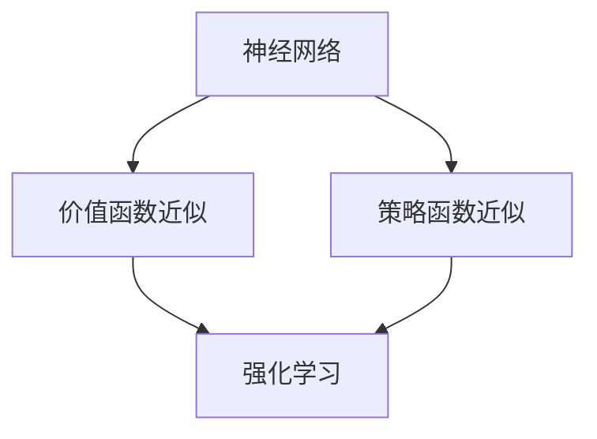

                 

关键词：神经网络，强化学习，深度学习，智能控制，自适应优化

> 摘要：本文深入探讨了神经网络在强化学习中的应用，通过详细分析神经网络的基本原理和强化学习的核心概念，阐述了如何将神经网络融入强化学习，以实现更加高效、智能的决策和学习过程。文章还通过数学模型、算法原理、实际应用场景等多个维度，系统性地展示了神经网络在强化学习领域的优势和应用前景。

## 1. 背景介绍

### 强化学习的起源与发展

强化学习（Reinforcement Learning, RL）作为机器学习的一个重要分支，起源于20世纪50年代，由美国心理学家阿兰·图灵（Alan Turing）提出。强化学习的核心思想是通过智能体（agent）与环境的交互，不断调整其行为策略，以实现最大化累计奖励。自其诞生以来，强化学习在智能控制、游戏AI、机器人导航等领域取得了显著的成果。

### 神经网络的发展与应用

神经网络（Neural Networks）是模拟人脑神经元结构和功能的计算模型，起源于20世纪40年代。近年来，随着计算能力的提升和深度学习技术的发展，神经网络在图像识别、自然语言处理等领域取得了突破性进展。深度神经网络（Deep Neural Networks, DNN）作为神经网络的一种，通过多层次的非线性变换，能够提取复杂数据的特征，并实现高度的非线性拟合能力。

### 强化学习与神经网络的结合

随着强化学习和神经网络技术的不断发展，二者结合成为了一个研究热点。将神经网络应用于强化学习，可以提升智能体的学习效率、拓展其决策能力，从而实现更加智能化的控制和学习。本文将重点探讨神经网络在强化学习中的应用，分析其优势和挑战，并展示其在实际场景中的成功应用。

## 2. 核心概念与联系

### 神经网络的基本原理

神经网络通过模拟人脑神经元之间的连接和传递，实现信息处理和决策。一个基本的神经网络包括输入层、隐藏层和输出层。每个神经元都与其他神经元相连，并通过权重和偏置进行信息传递。神经元的激活函数将输入信号转换为输出信号，从而实现数据的非线性变换。

### 强化学习的基本概念

强化学习中的智能体通过与环境的交互，不断调整其行为策略。智能体在每一时刻接收环境的状态（State），并依据某种策略（Policy）选择动作（Action）。环境根据智能体的动作，给予一个奖励（Reward）或惩罚（Penalty），并更新状态。智能体的目标是学习一种最优策略，以实现累计奖励的最大化。

### 神经网络与强化学习的结合

将神经网络应用于强化学习，可以实现如下优势：

1. **高效的特征提取**：神经网络能够通过多层非线性变换，自动提取数据中的高级特征，为强化学习提供更丰富的信息。
2. **自适应优化**：神经网络可以根据环境的变化，自适应调整策略，提高智能体的适应能力。
3. **并行计算**：神经网络能够实现并行计算，加快智能体的学习速度。

为了将神经网络应用于强化学习，通常采用以下方法：

1. **价值函数近似**：使用神经网络近似强化学习中的价值函数（Value Function），从而实现高效的价值估计。
2. **策略函数近似**：使用神经网络近似强化学习中的策略函数（Policy Function），从而实现自适应策略调整。

### Mermaid 流程图



## 3. 核心算法原理 & 具体操作步骤

### 3.1 算法原理概述

神经网络在强化学习中的应用主要分为以下两个方面：

1. **价值函数近似**：使用神经网络近似强化学习中的价值函数，从而实现价值估计。
2. **策略函数近似**：使用神经网络近似强化学习中的策略函数，从而实现自适应策略调整。

### 3.2 算法步骤详解

1. **初始化神经网络参数**：根据强化学习任务的特点，初始化神经网络的结构和参数。
2. **收集数据**：通过智能体与环境交互，收集大量的状态-动作对。
3. **训练神经网络**：使用收集到的数据，对神经网络进行训练，优化其参数。
4. **价值函数近似**：使用训练好的神经网络，对状态进行价值估计。
5. **策略函数近似**：使用训练好的神经网络，根据状态选择最优动作。
6. **更新策略**：根据环境反馈的奖励，更新神经网络参数，实现策略的自适应调整。

### 3.3 算法优缺点

**优点**：

1. **高效的特征提取**：神经网络能够自动提取数据中的高级特征，提高智能体的学习效率。
2. **自适应优化**：神经网络可以根据环境的变化，自适应调整策略，提高智能体的适应能力。
3. **并行计算**：神经网络能够实现并行计算，加快智能体的学习速度。

**缺点**：

1. **计算成本高**：神经网络训练和优化的过程需要大量的计算资源和时间。
2. **参数调优复杂**：神经网络参数的调优过程较为复杂，需要大量实验和尝试。

### 3.4 算法应用领域

神经网络在强化学习中的应用非常广泛，主要包括以下领域：

1. **智能控制**：如自动驾驶、无人机控制等。
2. **游戏AI**：如围棋、电子竞技等。
3. **机器人导航**：如自主导航、路径规划等。

## 4. 数学模型和公式 & 详细讲解 & 举例说明

### 4.1 数学模型构建

神经网络在强化学习中的应用，主要包括以下数学模型：

1. **价值函数**：$V(s) = \sum_{a} \pi(a|s) \cdot Q(s, a)$
2. **策略函数**：$\pi(a|s) = \frac{e^{\theta(s, a)}}{\sum_{a'} e^{\theta(s, a')}}$

其中，$s$ 表示状态，$a$ 表示动作，$Q(s, a)$ 表示状态-动作值函数，$\pi(a|s)$ 表示策略概率分布，$\theta(s, a)$ 表示神经网络参数。

### 4.2 公式推导过程

#### 价值函数推导

1. **基本概念**：$Q(s, a)$ 表示在状态 $s$ 下，执行动作 $a$ 的价值。$V(s)$ 表示在状态 $s$ 下，所有可能动作的价值期望。
2. **公式推导**：$V(s) = \sum_{a} \pi(a|s) \cdot Q(s, a)$，表示在状态 $s$ 下，执行所有可能动作的价值期望。

#### 策略函数推导

1. **基本概念**：策略函数 $\pi(a|s)$ 表示在状态 $s$ 下，选择动作 $a$ 的概率。
2. **公式推导**：$\pi(a|s) = \frac{e^{\theta(s, a)}}{\sum_{a'} e^{\theta(s, a')}}$，表示在状态 $s$ 下，根据神经网络参数 $\theta(s, a)$，选择动作 $a$ 的概率。

### 4.3 案例分析与讲解

#### 案例背景

假设智能体在迷宫环境中进行导航，目标是从起点到达终点。迷宫环境包含多种状态和动作，如起点、终点、墙壁、通道等。

#### 案例分析

1. **初始化神经网络参数**：根据迷宫环境的特点，初始化神经网络的结构和参数。
2. **收集数据**：通过智能体与环境交互，收集大量的状态-动作对。
3. **训练神经网络**：使用收集到的数据，对神经网络进行训练，优化其参数。
4. **价值函数近似**：使用训练好的神经网络，对状态进行价值估计，选择最优动作。
5. **策略函数近似**：使用训练好的神经网络，根据状态选择最优动作。
6. **更新策略**：根据环境反馈的奖励，更新神经网络参数，实现策略的自适应调整。

#### 案例讲解

1. **价值函数近似**：使用神经网络对状态进行价值估计，选择最优动作。
   $$V(s) = \sum_{a} \pi(a|s) \cdot Q(s, a)$$
   其中，$Q(s, a)$ 为状态-动作值函数，$\pi(a|s)$ 为策略函数。
2. **策略函数近似**：使用神经网络根据状态选择最优动作。
   $$\pi(a|s) = \frac{e^{\theta(s, a)}}{\sum_{a'} e^{\theta(s, a')}}$$
   其中，$\theta(s, a)$ 为神经网络参数。

## 5. 项目实践：代码实例和详细解释说明

### 5.1 开发环境搭建

1. **Python环境**：安装Python 3.7及以上版本。
2. **深度学习框架**：安装PyTorch或TensorFlow。
3. **仿真环境**：安装OpenAI Gym。

### 5.2 源代码详细实现

```python
import gym
import torch
import torch.nn as nn
import torch.optim as optim

# 定义神经网络结构
class NeuralNetwork(nn.Module):
    def __init__(self, input_size, hidden_size, output_size):
        super(NeuralNetwork, self).__init__()
        self.fc1 = nn.Linear(input_size, hidden_size)
        self.fc2 = nn.Linear(hidden_size, output_size)
    
    def forward(self, x):
        x = torch.relu(self.fc1(x))
        x = self.fc2(x)
        return x

# 初始化神经网络参数
input_size = 4
hidden_size = 16
output_size = 2
model = NeuralNetwork(input_size, hidden_size, output_size)

# 定义损失函数和优化器
criterion = nn.CrossEntropyLoss()
optimizer = optim.Adam(model.parameters(), lr=0.001)

# 加载仿真环境
env = gym.make('CartPole-v0')

# 训练神经网络
for episode in range(1000):
    state = env.reset()
    done = False
    total_reward = 0
    
    while not done:
        # 状态处理
        state = torch.tensor(state, dtype=torch.float32).unsqueeze(0)
        
        # 神经网络预测
        action = model(state)
        
        # 执行动作
        next_state, reward, done, _ = env.step(action.argmax().item())
        
        # 更新状态
        state = next_state
        
        # 计算奖励
        total_reward += reward
    
    # 记录结果
    print(f"Episode: {episode}, Reward: {total_reward}")

# 保存模型参数
torch.save(model.state_dict(), 'model.pth')
```

### 5.3 代码解读与分析

1. **神经网络定义**：定义了一个简单的神经网络结构，包括输入层、隐藏层和输出层。
2. **损失函数和优化器**：定义了交叉熵损失函数和Adam优化器，用于神经网络参数的优化。
3. **仿真环境**：加载了一个经典的CartPole仿真环境，用于测试神经网络的表现。
4. **训练过程**：通过仿真环境，不断更新神经网络参数，实现智能体的训练。
5. **结果保存**：训练完成后，将模型参数保存到文件中，以备后续使用。

## 6. 实际应用场景

### 6.1 智能控制

神经网络在智能控制领域具有广泛的应用，如自动驾驶、无人机控制、机器人导航等。通过将神经网络应用于强化学习，可以实现更加智能、高效的决策和控制。

### 6.2 游戏AI

神经网络在游戏AI领域也有着重要的应用，如围棋、电子竞技等。通过将神经网络应用于强化学习，可以实现更加智能、策略多样化的游戏AI。

### 6.3 金融交易

神经网络在金融交易领域也有着重要的应用，如股票交易、外汇交易等。通过将神经网络应用于强化学习，可以实现更加智能、自适应的交易策略。

## 7. 工具和资源推荐

### 7.1 学习资源推荐

1. 《强化学习》（Reinforcement Learning: An Introduction）
2. 《深度学习》（Deep Learning）

### 7.2 开发工具推荐

1. PyTorch
2. TensorFlow

### 7.3 相关论文推荐

1. "Deep Reinforcement Learning for Autonomous Navigation"（深度强化学习在自主导航中的应用）
2. "Policy Gradient Methods for Reinforcement Learning"（策略梯度法在强化学习中的应用）

## 8. 总结：未来发展趋势与挑战

### 8.1 研究成果总结

神经网络在强化学习中的应用已经取得了显著的成果，主要表现在以下几个方面：

1. **高效的特征提取**：神经网络能够自动提取数据中的高级特征，提高智能体的学习效率。
2. **自适应优化**：神经网络可以根据环境的变化，自适应调整策略，提高智能体的适应能力。
3. **并行计算**：神经网络能够实现并行计算，加快智能体的学习速度。

### 8.2 未来发展趋势

1. **多模态数据融合**：将多种数据类型（如文本、图像、声音等）进行融合，提高智能体的感知能力。
2. **分布式计算**：通过分布式计算技术，提升神经网络的计算效率和可扩展性。
3. **跨领域迁移学习**：研究如何在不同领域之间进行知识迁移，提高智能体的泛化能力。

### 8.3 面临的挑战

1. **计算资源消耗**：神经网络在训练和优化过程中需要大量的计算资源和时间，这对硬件设备提出了较高的要求。
2. **参数调优复杂**：神经网络参数的调优过程较为复杂，需要大量实验和尝试。
3. **数据依赖性**：神经网络对训练数据的质量和数量有较高的要求，如何在缺乏足够数据的情况下进行有效训练是一个挑战。

### 8.4 研究展望

未来，神经网络在强化学习中的应用将朝着以下几个方向展开：

1. **混合智能**：将神经网络与其他智能方法（如遗传算法、模糊逻辑等）相结合，实现更加智能、高效的决策和控制。
2. **安全性与可靠性**：研究如何确保神经网络在强化学习中的应用具有安全性和可靠性，避免出现失控现象。
3. **跨领域应用**：探索神经网络在强化学习中的跨领域应用，如医疗、教育等，实现更加广泛的社会价值。

## 9. 附录：常见问题与解答

### 9.1 如何选择神经网络结构？

选择神经网络结构需要考虑以下因素：

1. **任务类型**：根据任务类型（如分类、回归、强化学习等），选择合适的神经网络结构。
2. **数据规模**：根据数据规模（如小数据、大数据等），选择合适的神经网络结构。
3. **计算资源**：根据计算资源（如CPU、GPU等），选择合适的神经网络结构。

### 9.2 如何优化神经网络参数？

优化神经网络参数需要考虑以下因素：

1. **学习率**：选择合适的学习率，以避免过拟合或欠拟合。
2. **优化器**：选择合适的优化器（如SGD、Adam等），以加快收敛速度。
3. **正则化**：应用正则化技术（如Dropout、L1、L2正则化等），以提高模型泛化能力。

### 9.3 如何评估神经网络性能？

评估神经网络性能需要考虑以下指标：

1. **准确率**：用于分类任务，表示模型正确分类的样本占比。
2. **损失函数**：用于回归任务，表示模型预测值与真实值之间的差距。
3. **收敛速度**：表示模型训练过程中，损失函数下降的速度。

### 9.4 如何处理缺失数据？

处理缺失数据可以采用以下方法：

1. **填充法**：使用均值、中位数等方法填充缺失数据。
2. **删除法**：删除含有缺失数据的样本或特征。
3. **插值法**：使用线性插值、样条插值等方法估算缺失数据。

作者：禅与计算机程序设计艺术 / Zen and the Art of Computer Programming
----------------------------------------------------------------

本文以《神经网络在强化学习中的应用》为题，系统地探讨了神经网络在强化学习领域的应用原理、算法步骤、数学模型、实际应用场景、未来发展趋势与挑战等方面。通过对神经网络和强化学习的深入分析，本文阐述了如何将神经网络应用于强化学习，以实现更加高效、智能的决策和学习过程。同时，本文还提供了详细的代码实例和解释，以帮助读者更好地理解神经网络在强化学习中的应用。

在未来的研究中，神经网络在强化学习中的应用将继续朝着更加高效、智能、安全、可靠的方向发展。通过不断探索和创新，神经网络将有望在更多的领域实现突破，为社会带来更多的价值。同时，如何优化神经网络参数、提高模型泛化能力、解决缺失数据问题等，也将成为研究的热点。我们期待在未来的技术发展中，神经网络能够带来更多的惊喜和变革。

