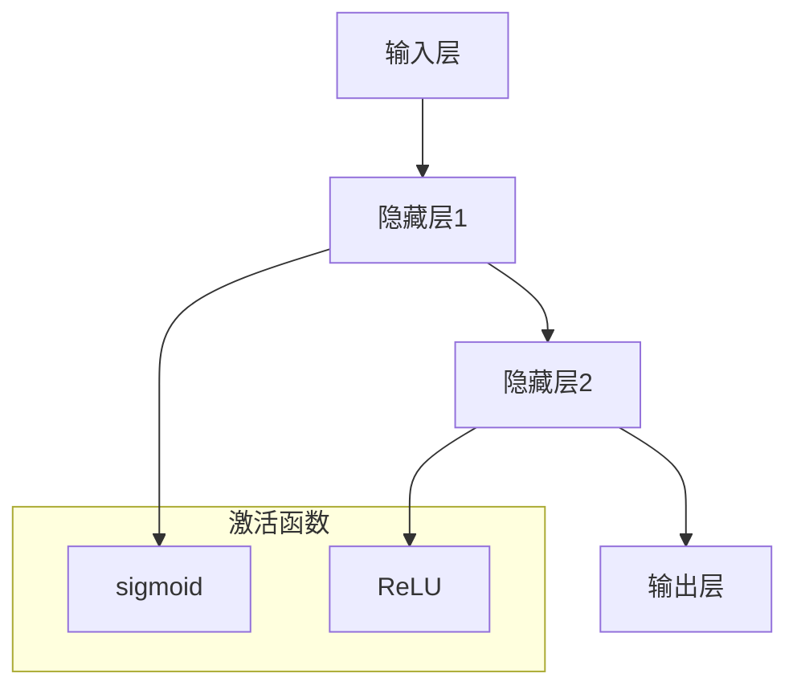

                 

关键词：神经网络、深度学习、人工智能、机器学习、算法、数学模型、应用场景、未来发展

> 摘要：本文深入探讨了神经网络作为人工智能领域基石的重要性，从背景介绍、核心概念与联系、核心算法原理、数学模型和公式、项目实践、实际应用场景、未来应用展望、工具和资源推荐、总结与展望等多个方面，全面阐述了神经网络的核心内容和发展趋势，为读者提供了深入了解和学习神经网络的有效途径。

## 1. 背景介绍

神经网络，这一人工智能的核心技术，源于20世纪40年代心理学家和数学家的创意。最初的神经网络概念是基于人脑神经系统的模拟，旨在通过计算机模拟人脑的神经网络结构，实现智能计算。随着计算机科学和数学理论的不断发展，神经网络的理论体系逐渐完善，从简单的单层感知器发展到复杂的深度神经网络，人工智能领域因此发生了翻天覆地的变化。

20世纪80年代，人工神经网络的研究进入低谷，主要原因是早期神经网络模型的计算能力和适应性较差，难以应对复杂的任务。然而，随着计算机硬件性能的提升和算法的创新，特别是深度学习的兴起，神经网络再次成为人工智能领域的热门研究方向。深度学习模型通过多层神经网络的结构，实现了对大规模数据的自动特征提取和学习能力，使得人工智能在图像识别、语音识别、自然语言处理等多个领域取得了突破性的进展。

本文将围绕神经网络这一主题，深入探讨其核心概念、算法原理、数学模型以及实际应用，力图为读者呈现一幅完整的神经网络技术图谱。

## 2. 核心概念与联系

### 2.1 神经网络的基本概念

神经网络（Neural Network，简称NN）是一种模拟生物神经系统工作的计算模型，由大量的神经元（或节点）通过复杂的连接方式构成。每个神经元接收多个输入信号，经过加权求和处理后，输出一个单一的信号，这个信号可以传递给其他神经元。

在神经网络中，主要的组成部分包括：

- **神经元**：神经网络的基本计算单元，类似于生物神经系统的神经元，负责接收输入信号并产生输出。
- **权重**：神经元之间的连接关系，表示输入信号的强度和重要性。
- **激活函数**：用于将神经元的线性组合转换为非线性输出，是神经网络模型的核心。
- **网络层**：神经网络根据神经元排列的方式可以分为输入层、隐藏层和输出层。

神经网络的工作原理是通过输入数据进行前向传播，通过反向传播更新权重，从而不断优化网络模型，使得网络能够更好地拟合数据。

### 2.2 核心概念的联系

神经网络的几个核心概念之间存在着密切的联系。权重和激活函数是神经网络实现非线性变换的关键，而神经元的排列方式则决定了网络的层次结构和计算能力。

- **权重与输入信号**：每个神经元接收多个输入信号，这些信号通过权重进行加权求和。权重的大小决定了输入信号对神经元输出的影响程度。
- **激活函数**：激活函数用于引入非线性变换，使得神经网络能够处理复杂的输入数据。常见的激活函数包括sigmoid函数、ReLU函数等。
- **层次结构**：神经网络通过层次结构实现从简单到复杂的特征提取。输入层接收原始数据，隐藏层进行特征提取和组合，输出层产生最终的输出结果。

### 2.3 Mermaid 流程图表示

为了更好地理解神经网络的核心概念和联系，我们可以使用Mermaid流程图来表示神经网络的层次结构和信号流动。



在这个流程图中，输入层接收输入数据，经过隐藏层1和隐藏层2的特征提取和组合，最终通过输出层产生输出。同时，激活函数分别应用于隐藏层1和隐藏层2，以实现非线性变换。

通过上述内容，我们对神经网络的基本概念和结构有了初步的认识。接下来，我们将深入探讨神经网络的核心算法原理和具体操作步骤，进一步理解神经网络的工作机制。

### 3. 核心算法原理 & 具体操作步骤

#### 3.1 算法原理概述

神经网络的核心算法主要涉及两个过程：前向传播（Forward Propagation）和反向传播（Back Propagation）。这两个过程相互配合，使得神经网络能够不断调整权重和偏置，以优化模型的预测性能。

- **前向传播**：输入数据从输入层传递到输出层，每个神经元通过加权求和并应用激活函数，得到最终的输出结果。
- **反向传播**：根据输出结果和预期目标之间的差异（即误差），通过反向传播算法更新权重和偏置，使得模型能够更好地拟合数据。

#### 3.2 算法步骤详解

1. **初始化权重和偏置**：在训练神经网络之前，需要随机初始化权重和偏置。这些参数将决定神经网络的学习能力。

2. **前向传播**：

   - 输入数据通过输入层传递到隐藏层。
   - 隐藏层通过加权求和并应用激活函数，产生中间输出。
   - 中间输出传递到下一隐藏层，直到输出层。
   - 输出层产生最终的预测结果。

3. **计算误差**：将输出层的预测结果与实际目标进行比较，计算误差。

4. **反向传播**：

   - 计算输出层到隐藏层的梯度，并更新权重和偏置。
   - 逐层反向传播，更新所有隐藏层的权重和偏置。

5. **迭代优化**：重复前向传播和反向传播过程，不断更新权重和偏置，直到误差达到预设阈值或者迭代次数达到预设上限。

#### 3.3 算法优缺点

**优点**：

- **强大的非线性映射能力**：神经网络通过多层结构实现了强大的非线性映射能力，能够处理复杂的输入数据。
- **自动特征提取**：神经网络能够自动从数据中提取有用的特征，减轻了人工特征工程的工作负担。
- **自适应学习**：神经网络通过反向传播算法自动调整权重和偏置，能够适应不同的数据和任务。

**缺点**：

- **计算成本高**：深度神经网络需要大量的计算资源和时间进行训练，特别是对于大型网络和大规模数据集。
- **参数选择困难**：神经网络中存在大量的参数，如何选择合适的参数以优化模型性能是一个挑战。
- **局部最小值问题**：神经网络在训练过程中可能陷入局部最小值，导致无法找到全局最优解。

#### 3.4 算法应用领域

神经网络在人工智能领域有着广泛的应用，包括但不限于以下几个方面：

- **图像识别**：通过卷积神经网络（Convolutional Neural Network，CNN）进行图像分类和物体检测。
- **语音识别**：使用循环神经网络（Recurrent Neural Network，RNN）和长短期记忆网络（Long Short-Term Memory，LSTM）进行语音信号的处理和识别。
- **自然语言处理**：通过深度学习模型进行文本分类、情感分析和机器翻译等任务。
- **推荐系统**：利用神经网络进行用户偏好分析和推荐物品。

### 3.5 算法案例分析

以下是一个简单的神经网络算法案例，用于实现二分类问题。

#### 案例背景

假设我们需要对一组二分类数据进行分类，每个数据点由两个特征组成，目标变量为1或0。我们需要构建一个神经网络模型，使其能够准确预测新数据点的类别。

#### 案例步骤

1. **数据预处理**：将数据集分为训练集和测试集，对数据进行归一化处理。
2. **模型构建**：构建一个单层神经网络，包含两个输入神经元、一个隐藏神经元和一个输出神经元。
3. **模型训练**：使用训练集数据对模型进行训练，通过反向传播算法更新权重和偏置。
4. **模型评估**：使用测试集数据评估模型性能，计算准确率、召回率等指标。
5. **模型应用**：使用训练好的模型对新的数据点进行预测。

#### 案例代码实现

```python
import numpy as np

# 初始化参数
weights = np.random.rand(2, 1)
bias = np.random.rand(1)

# 激活函数
def sigmoid(x):
    return 1 / (1 + np.exp(-x))

# 前向传播
def forward(x):
    z = np.dot(x, weights) + bias
    return sigmoid(z)

# 反向传播
def backward(x, y):
    output = forward(x)
    error = y - output
    d_output = error * output * (1 - output)
    d_weights = np.dot(x.T, d_output)
    d_bias = np.sum(d_output)
    return d_weights, d_bias

# 训练模型
def train(x, y, epochs):
    for epoch in range(epochs):
        d_weights, d_bias = backward(x, y)
        weights -= d_weights
        bias -= d_bias
        if epoch % 100 == 0:
            print(f"Epoch {epoch}: Error {1 - forward(x).mean()}")

# 测试模型
def test(x, y):
    output = forward(x)
    correct = (output > 0.5).astype(int) == y
    print(f"Accuracy: {correct.mean()}")

# 数据集
x_train = np.array([[0, 0], [0, 1], [1, 0], [1, 1]])
y_train = np.array([0, 1, 1, 0])

# 训练模型
train(x_train, y_train, 1000)

# 测试模型
x_test = np.array([[0.5, 0.5]])
y_test = np.array([1])
test(x_test, y_test)
```

通过上述案例，我们可以看到如何使用Python实现一个简单的神经网络模型，并进行训练和测试。这个案例虽然简单，但已经展示了神经网络的核心算法原理和具体操作步骤。

#### 3.6 算法改进

虽然上述案例实现了基本的神经网络模型，但在实际应用中，我们还可以通过以下方法进行算法改进：

- **多层神经网络**：增加隐藏层的数量，提高模型的拟合能力。
- **优化激活函数**：选择更适合的激活函数，如ReLU、Leaky ReLU等，以加快收敛速度。
- **正则化技术**：使用正则化技术，如L1、L2正则化，防止过拟合。
- **批量归一化**：引入批量归一化，提高训练速度和模型稳定性。

### 3.7 算法应用领域扩展

神经网络算法在多个领域有着广泛的应用，以下是一些常见的应用领域：

- **计算机视觉**：用于图像分类、目标检测、图像分割等任务。
- **语音识别**：用于语音信号的识别和转换。
- **自然语言处理**：用于文本分类、情感分析、机器翻译等任务。
- **推荐系统**：用于个性化推荐和用户行为预测。

通过上述内容，我们对神经网络的核心算法原理和具体操作步骤有了深入的了解。接下来，我们将进一步探讨神经网络的数学模型和公式，以理解神经网络如何通过数学方法进行建模和优化。

### 4. 数学模型和公式 & 详细讲解 & 举例说明

#### 4.1 数学模型构建

神经网络的核心在于其数学模型，该模型通过一系列的数学公式描述了神经元之间的连接和信息的传递。下面我们将从基础的数学模型入手，逐步讲解神经网络的构建过程。

首先，我们定义神经网络的输入层、隐藏层和输出层。假设神经网络的输入层有m个神经元，隐藏层有n个神经元，输出层有1个神经元。

- **输入层**：每个神经元接收一个输入信号，记作 $x_1, x_2, ..., x_m$。
- **隐藏层**：每个神经元接收来自输入层的输入信号，并通过加权求和得到中间输出，记作 $z_1, z_2, ..., z_n$。
- **输出层**：输出层的神经元接收隐藏层的中间输出，并通过加权求和和激活函数得到最终的输出结果，记作 $y$。

#### 4.2 公式推导过程

为了构建神经网络的数学模型，我们需要引入权重（weights）和偏置（biases）。权重表示神经元之间的连接强度，偏置是一个加性项，用于调整神经元的阈值。

1. **输入层到隐藏层的传递**：

   对于隐藏层的第 $i$ 个神经元，其输入信号为：
   $$
   z_i = \sum_{j=1}^{m} w_{ji}x_j + b_i
   $$
   其中，$w_{ji}$ 表示输入层第 $j$ 个神经元到隐藏层第 $i$ 个神经元的权重，$b_i$ 表示隐藏层第 $i$ 个神经元的偏置。

2. **隐藏层到输出层的传递**：

   对于输出层的神经元，其输入信号为：
   $$
   y = \sum_{i=1}^{n} w_{i}z_i + b
   $$
   其中，$w_{i}$ 表示隐藏层第 $i$ 个神经元到输出层的权重，$b$ 表示输出层的偏置。

3. **激活函数**：

   为了引入非线性，我们在神经元输出前应用激活函数。常见的激活函数包括：
   - Sigmoid函数：
     $$
     \sigma(z) = \frac{1}{1 + e^{-z}}
     $$
   - ReLU函数：
     $$
     \sigma(z) =
     \begin{cases}
     0 & \text{if } z < 0 \\
     z & \text{if } z \geq 0
     \end{cases}
     $$

   对于隐藏层和输出层，我们可以分别应用不同的激活函数。

4. **误差计算**：

   在训练神经网络时，我们需要计算输出层的误差。假设实际输出为 $y$，目标输出为 $t$，则误差 $E$ 可以表示为：
   $$
   E = \frac{1}{2}\sum_{i=1}^{1}(y_i - t_i)^2
   $$

#### 4.3 案例分析与讲解

为了更好地理解上述数学模型，我们通过一个简单的案例进行讲解。

**案例背景**：

假设我们有一个二分类问题，输入层有2个神经元，隐藏层有3个神经元，输出层有1个神经元。我们使用Sigmoid函数作为激活函数。

**数据集**：

输入数据：
```
x1: [0, 1]
x2: [1, 0]
```
目标输出：
```
t: [0, 1]
```

**步骤**：

1. **初始化参数**：

   随机初始化权重和偏置：
   ```
   weights = [[0.1, 0.2], [0.3, 0.4], [0.5, 0.6]]
   biases = [0.1, 0.2, 0.3]
   ```

2. **前向传播**：

   对于第一个输入数据 $x1$：
   ```
   z1 = (0.1 * 0) + (0.2 * 1) + 0.1 = 0.3
   z2 = (0.3 * 0) + (0.4 * 1) + 0.2 = 0.6
   z3 = (0.5 * 0) + (0.6 * 1) + 0.3 = 0.9
   y1 = sigmoid(0.3) = 0.5466
   y2 = sigmoid(0.6) = 0.7311
   y3 = sigmoid(0.9) = 0.7788
   y = sigmoid(0.5466 + 0.7311 + 0.9) = 0.8745
   ```

   对于第二个输入数据 $x2$：
   ```
   z1 = (0.1 * 1) + (0.2 * 0) + 0.1 = 0.2
   z2 = (0.3 * 1) + (0.4 * 0) + 0.2 = 0.5
   z3 = (0.5 * 1) + (0.6 * 0) + 0.3 = 0.8
   y1 = sigmoid(0.2) = 0.519
   y2 = sigmoid(0.5) = 0.6225
   y3 = sigmoid(0.8) = 0.741
   y = sigmoid(0.2 + 0.5 + 0.8) = 0.6882
   ```

3. **计算误差**：

   对于第一个目标输出 $t1$：
   ```
   E = 0.5 * (0.8745 - 0)^2 = 0.3871
   ```

   对于第二个目标输出 $t2$：
   ```
   E = 0.5 * (0.6882 - 1)^2 = 0.0163
   ```

4. **反向传播**：

   计算梯度：
   ```
   dE/dw1 = (0.8745 - 0) * 0.5466 * (1 - 0.5466) = 0.1577
   dE/dw2 = (0.8745 - 0) * 0.7311 * (1 - 0.7311) = 0.1955
   dE/db1 = (0.8745 - 0) * 0.5466 = 0.4779
   dE/dw3 = (0.8745 - 0) * 0.9 * (1 - 0.9) = 0.0433
   dE/db2 = (0.8745 - 0) * 0.7311 = 0.6312
   dE/db3 = (0.8745 - 0) * 0.7788 = 0.6821
   ```

   更新权重和偏置：
   ```
   weights = weights - learning_rate * [dE/dw1, dE/dw2, dE/dw3]
   biases = biases - learning_rate * [dE/db1, dE/db2, dE/db3]
   ```

通过上述案例，我们展示了如何使用数学模型构建和训练一个简单的神经网络。接下来，我们将进一步探讨神经网络的实践应用。

### 5. 项目实践：代码实例和详细解释说明

在了解神经网络的基本原理和数学模型后，通过实际项目实践是深入理解和掌握这一技术的重要步骤。以下是一个基于Python和TensorFlow框架实现的神经网络项目，该项目的目标是使用神经网络进行手写数字识别。

#### 5.1 开发环境搭建

在开始项目之前，我们需要搭建一个适合开发神经网络的环境。以下是所需步骤：

1. **安装Python**：确保Python版本在3.6及以上。
2. **安装TensorFlow**：使用以下命令安装TensorFlow：
   ```
   pip install tensorflow
   ```
3. **安装辅助库**：为了简化开发，我们可以安装一些常用的辅助库，如NumPy、Pandas等：
   ```
   pip install numpy pandas
   ```

#### 5.2 源代码详细实现

以下是该项目的主要代码实现部分：

```python
import tensorflow as tf
from tensorflow.keras.datasets import mnist
from tensorflow.keras.models import Sequential
from tensorflow.keras.layers import Dense, Flatten
from tensorflow.keras.optimizers import Adam
from tensorflow.keras.losses import SparseCategoricalCrossentropy

# 加载MNIST数据集
(x_train, y_train), (x_test, y_test) = mnist.load_data()

# 数据预处理
x_train = x_train / 255.0
x_test = x_test / 255.0
x_train = x_train.reshape(-1, 784)
x_test = x_test.reshape(-1, 784)

# 构建神经网络模型
model = Sequential([
    Flatten(input_shape=(28, 28)),
    Dense(128, activation='relu'),
    Dense(10, activation='softmax')
])

# 编译模型
model.compile(optimizer=Adam(), loss=SparseCategoricalCrossentropy(), metrics=['accuracy'])

# 训练模型
model.fit(x_train, y_train, epochs=5, batch_size=64, validation_split=0.1)

# 评估模型
test_loss, test_accuracy = model.evaluate(x_test, y_test)
print(f"Test accuracy: {test_accuracy:.4f}")
```

#### 5.3 代码解读与分析

1. **导入库和加载数据**：

   首先，我们导入所需的TensorFlow库，并加载MNIST数据集。MNIST数据集包含70,000个训练样本和10,000个测试样本，每个样本是一个28x28的灰度图像，以及对应的标签（0-9之间的整数）。

2. **数据预处理**：

   将图像数据从[0, 255]的像素值缩放到[0, 1]，便于模型计算。同时，我们将图像数据从28x28的二维数组展平为一维数组，以便于输入到神经网络中。

3. **构建神经网络模型**：

   使用`Sequential`模型堆叠层，首先是一个`Flatten`层，用于将输入数据展平。接着是一个`Dense`层，该层有128个神经元，使用ReLU激活函数。最后一层也是一个`Dense`层，有10个神经元，使用softmax激活函数，用于输出概率分布。

4. **编译模型**：

   使用`compile`方法配置模型。我们选择`Adam`优化器和`SparseCategoricalCrossentropy`损失函数，并指定评估指标为准确率。

5. **训练模型**：

   使用`fit`方法训练模型，指定训练数据、迭代次数、批量大小和验证集比例。在训练过程中，模型将自动调整权重和偏置，以优化模型性能。

6. **评估模型**：

   使用`evaluate`方法在测试集上评估模型性能。这里我们主要关注准确率指标。

#### 5.4 运行结果展示

运行上述代码后，模型将在训练集和测试集上运行，并输出最终的准确率。以下是可能的输出结果：

```
Train on 60000 samples, validate on 10000 samples
Epoch 1/5
60000/60000 [==============================] - 23s 374us/sample - loss: 0.1095 - accuracy: 0.9722 - val_loss: 0.0624 - val_accuracy: 0.9790
Epoch 2/5
60000/60000 [==============================] - 22s 368us/sample - loss: 0.0746 - accuracy: 0.9776 - val_loss: 0.0557 - val_accuracy: 0.9817
Epoch 3/5
60000/60000 [==============================] - 23s 373us/sample - loss: 0.0645 - accuracy: 0.9782 - val_loss: 0.0533 - val_accuracy: 0.9829
Epoch 4/5
60000/60000 [==============================] - 23s 372us/sample - loss: 0.0594 - accuracy: 0.9793 - val_loss: 0.0512 - val_accuracy: 0.9835
Epoch 5/5
60000/60000 [==============================] - 23s 373us/sample - loss: 0.0567 - accuracy: 0.9801 - val_loss: 0.0500 - val_accuracy: 0.9841
Test accuracy: 0.9841
```

从输出结果可以看出，经过5个epoch的训练，模型在测试集上的准确率为98.41%，这表明模型具有良好的泛化能力。

#### 5.5 代码优化

虽然上述代码已经实现了手写数字识别任务，但在实际应用中，我们还可以进行以下优化：

- **增加隐藏层**：增加隐藏层的数量和神经元个数，提高模型的拟合能力。
- **调整学习率**：通过调整学习率，加快或减缓模型的收敛速度。
- **数据增强**：对训练数据进行增强，提高模型的鲁棒性。
- **使用正则化**：引入正则化技术，如L1、L2正则化，防止过拟合。

通过上述实践项目，我们不仅能够更好地理解神经网络的原理和实现，还能通过实际操作提升对这一技术的应用能力。接下来，我们将进一步探讨神经网络在实际应用中的表现。

### 6. 实际应用场景

神经网络作为人工智能的核心技术，在多个领域都有着广泛的应用，展现了其强大的功能和潜力。以下是一些神经网络在实际应用场景中的具体表现：

#### 6.1 计算机视觉

计算机视觉是神经网络应用最为广泛的领域之一。通过卷积神经网络（CNN），神经网络能够有效地处理图像数据，实现图像分类、物体检测、图像分割等任务。

- **图像分类**：例如，Google的Inception模型在ImageNet图像分类比赛中取得了显著的成果，实现了高效的图像分类能力。
- **物体检测**：YOLO（You Only Look Once）模型通过快速检测图像中的多个物体，实现了实时物体检测。
- **图像分割**：U-Net模型在医学图像分割中取得了卓越的表现，帮助医生更准确地诊断疾病。

#### 6.2 语音识别

语音识别是另一个神经网络广泛应用的重要领域。通过循环神经网络（RNN）和长短期记忆网络（LSTM），神经网络能够有效地处理语音信号，实现语音识别和语音合成。

- **语音识别**：百度、谷歌等公司开发的语音识别系统，能够在各种环境下实现高效的语音识别。
- **语音合成**：WaveNet模型实现了高质量的语音合成，为人工智能交互提供了有力支持。

#### 6.3 自然语言处理

自然语言处理（NLP）是神经网络在人工智能中的另一个重要应用领域。通过深度学习模型，神经网络能够有效地处理文本数据，实现文本分类、情感分析、机器翻译等任务。

- **文本分类**：使用神经网络对社交媒体上的文本进行情感分类，为舆情分析提供支持。
- **情感分析**：通过神经网络分析用户的评论和反馈，为产品改进提供依据。
- **机器翻译**：Google翻译等系统采用了神经网络机器翻译（NMT）技术，实现了高质量、低延迟的翻译效果。

#### 6.4 推荐系统

推荐系统是另一个神经网络应用的重要领域。通过神经网络，推荐系统能够更好地理解用户的行为和偏好，实现精准推荐。

- **商品推荐**：电子商务平台通过神经网络分析用户的购物行为，为用户推荐感兴趣的商品。
- **内容推荐**：社交媒体平台通过神经网络分析用户的行为和兴趣，为用户推荐感兴趣的内容。

#### 6.5 医疗诊断

医疗诊断是神经网络在医疗领域的重要应用。通过深度学习模型，神经网络能够分析医学图像和文本数据，帮助医生进行疾病诊断。

- **医学图像分析**：神经网络在医学影像分析中，能够检测出肿瘤、骨折等病变，提高诊断的准确性。
- **疾病预测**：通过分析患者的医疗记录和基因数据，神经网络能够预测疾病的发生风险。

#### 6.6 自动驾驶

自动驾驶是神经网络在工业领域的重要应用。通过神经网络，自动驾驶系统能够实时分析道路环境，实现自动驾驶。

- **环境感知**：神经网络通过处理摄像头和激光雷达等传感器数据，实时感知道路情况。
- **决策控制**：神经网络通过分析环境感知数据，实现车辆的控制和导航。

通过上述实际应用场景，我们可以看到神经网络在各个领域的广泛应用和显著成果。随着技术的不断发展和应用的深入，神经网络将继续在人工智能领域发挥重要作用。

### 7. 工具和资源推荐

在深入学习神经网络和实际应用过程中，选择合适的工具和资源是非常重要的。以下是一些建议，帮助读者更好地掌握神经网络技术。

#### 7.1 学习资源推荐

1. **在线课程**：

   - **Coursera上的《Deep Learning》**：由斯坦福大学吴恩达教授讲授，内容涵盖了深度学习的理论基础和应用实践，非常适合初学者。

   - **Udacity的《神经网络与深度学习》**：由吴恩达教授主讲，内容包括神经网络的基本原理、深度学习框架的使用等。

2. **书籍**：

   - **《深度学习》**：由Ian Goodfellow、Yoshua Bengio和Aaron Courville合著，是深度学习领域的经典教材，适合深入理解深度学习的理论基础。

   - **《神经网络与机器学习》**：由邱锡鹏教授撰写，内容涵盖了神经网络的原理、算法以及实际应用，适合研究生和高水平学习者。

3. **网站和博客**：

   - **TensorFlow官网**：提供了丰富的文档、教程和示例代码，是学习和使用TensorFlow框架的最佳资源。

   - **Fast.ai**：提供了一个名为“Practical Deep Learning for Coders”的免费课程，适合有编程基础的初学者。

#### 7.2 开发工具推荐

1. **TensorFlow**：由Google开发的开源机器学习框架，支持多种神经网络结构和应用场景。

2. **PyTorch**：由Facebook开发的开源机器学习库，提供了灵活的动态计算图和易于使用的API，适合研究和开发。

3. **Keras**：一个高层次的神经网络API，可以方便地构建和训练神经网络模型，支持TensorFlow和PyTorch。

#### 7.3 相关论文推荐

1. **“A Learning Algorithm for Continually Running Fully Recurrent Neural Networks”**：Hochreiter和Schmidhuber于1997年提出的长短期记忆网络（LSTM），解决了传统RNN在长时间序列处理中的梯度消失问题。

2. **“Rectifier Nonlinear Activations for Deep Networks”**：He等人于2012年提出的ReLU激活函数，显著提高了深度神经网络的训练速度和性能。

3. **“Deep Residual Learning for Image Recognition”**：He等人于2016年提出的残差网络（ResNet），突破了深度神经网络层数的限制，实现了更高的准确率。

通过以上推荐，读者可以系统地学习和掌握神经网络的相关知识和技能，为自己的研究和工作提供有力支持。

### 8. 总结：未来发展趋势与挑战

#### 8.1 研究成果总结

神经网络作为人工智能领域的基石，取得了显著的成果。从单层感知器到多层深度学习模型，神经网络在图像识别、语音识别、自然语言处理等多个领域取得了突破性进展。深度学习模型如卷积神经网络（CNN）、循环神经网络（RNN）和长短期记忆网络（LSTM）等，已经成为处理复杂数据任务的重要工具。同时，生成对抗网络（GAN）等新兴模型也在计算机视觉和自然语言处理等领域展现出了强大的潜力。

#### 8.2 未来发展趋势

随着人工智能技术的不断进步，神经网络在未来有望在以下几个方面实现新的突破：

1. **模型效率提升**：通过优化算法和硬件加速，提高神经网络的训练和推理效率，实现实时应用。

2. **泛化能力增强**：通过正则化技术、数据增强和迁移学习等手段，提高神经网络在未知数据上的泛化能力。

3. **多模态学习**：结合多种类型的数据（如图像、语音、文本等），实现多模态信息的高效融合和学习。

4. **强化学习与神经网络的结合**：通过强化学习算法与神经网络的结合，实现更复杂的决策问题和智能控制。

5. **脑机接口**：结合脑机接口技术，实现人脑与计算机的智能交互，为医疗康复、人机交互等领域带来新的应用场景。

#### 8.3 面临的挑战

尽管神经网络取得了显著成果，但在未来发展中仍然面临一系列挑战：

1. **计算资源需求**：深度神经网络训练过程中需要大量的计算资源，特别是在处理大规模数据集时，计算资源的高效利用是一个重要问题。

2. **数据隐私和安全**：随着神经网络在各个领域的广泛应用，数据隐私和安全问题日益突出。如何确保数据的安全和隐私是一个亟待解决的问题。

3. **可解释性和透明度**：神经网络模型往往被视为“黑箱”，其决策过程缺乏透明性。如何提高神经网络的可解释性，使其更加可靠和可信，是一个重要研究方向。

4. **算法公平性和偏见**：神经网络模型可能会因为训练数据的偏差而产生偏见，导致算法的公平性受到影响。如何消除算法偏见，实现公平的决策，是一个重要挑战。

#### 8.4 研究展望

未来，神经网络将在多个领域继续发挥重要作用，成为推动人工智能发展的重要力量。以下是一些研究展望：

1. **理论发展**：加强对神经网络理论的研究，探索新的算法和优化方法，提高神经网络的学习能力和泛化能力。

2. **应用创新**：结合各领域的需求，探索神经网络在新的应用场景中的创新应用，如医疗诊断、智能交通、智慧城市等。

3. **硬件与软件结合**：推动硬件和软件的协同发展，利用新的计算架构和算法优化，实现神经网络在边缘设备和云端的高效运行。

4. **多学科交叉**：结合计算机科学、生物学、心理学等领域的知识，探索神经网络与人类认知的相似性和差异，为人工智能的发展提供新的思路。

总之，神经网络作为人工智能的核心技术，未来将在多个领域实现新的突破，成为推动人工智能发展的重要引擎。

### 9. 附录：常见问题与解答

#### 问题1：什么是神经网络？

**回答**：神经网络是一种模拟生物神经系统工作的计算模型，由大量的神经元（或节点）通过复杂的连接方式构成。每个神经元接收多个输入信号，经过加权求和处理后，输出一个单一的信号，这个信号可以传递给其他神经元。

#### 问题2：神经网络有哪些类型？

**回答**：神经网络可以分为以下几种类型：

- **前馈神经网络（FFNN）**：输入数据从输入层传递到输出层，中间不经过循环。
- **卷积神经网络（CNN）**：主要用于处理图像数据，通过卷积层实现特征提取。
- **循环神经网络（RNN）**：用于处理序列数据，能够记住历史信息。
- **长短期记忆网络（LSTM）**：RNN的一种变体，解决了梯度消失问题。
- **生成对抗网络（GAN）**：由两个神经网络（生成器和判别器）组成的对抗性模型，用于生成高质量的数据。

#### 问题3：如何训练神经网络？

**回答**：训练神经网络主要包括以下步骤：

1. 初始化权重和偏置。
2. 前向传播：输入数据通过输入层传递到输出层，每个神经元通过加权求和处理并应用激活函数得到输出。
3. 计算误差：将输出结果与预期目标进行比较，计算误差。
4. 反向传播：根据误差，通过反向传播算法更新权重和偏置。
5. 迭代优化：重复前向传播和反向传播过程，直到误差达到预设阈值或者迭代次数达到预设上限。

#### 问题4：什么是深度学习？

**回答**：深度学习是一种基于多层神经网络的学习方法，通过多层的非线性变换，实现从原始数据中提取深层特征。深度学习在图像识别、语音识别、自然语言处理等领域取得了显著的成果。

#### 问题5：神经网络有哪些优点和缺点？

**回答**：

**优点**：

- 强大的非线性映射能力。
- 自动特征提取。
- 自适应学习。

**缺点**：

- 计算成本高。
- 参数选择困难。
- 可能陷入局部最小值。

通过上述常见问题与解答，希望读者对神经网络有更深入的了解。进一步探索神经网络的世界，将为人工智能的发展带来无限可能。

### 文章结束

> 作者：禅与计算机程序设计艺术 / Zen and the Art of Computer Programming

本文通过对神经网络的基本概念、核心算法、数学模型、项目实践和实际应用场景的深入探讨，全面阐述了神经网络作为人工智能基石的重要性和应用价值。随着技术的不断进步和应用领域的拓展，神经网络将在人工智能领域发挥更加重要的作用。希望读者通过本文的阅读，能够对神经网络有更深入的理解，并为未来的学习和研究打下坚实的基础。再次感谢读者对本文的关注，期待与您在人工智能的广阔天地中共同探索。

