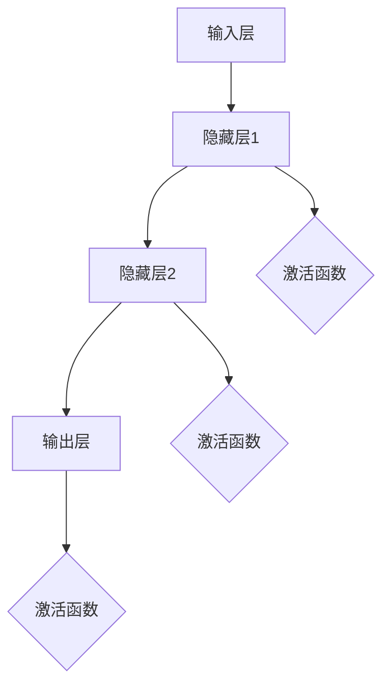

                 

关键词：神经网络、深度学习、人工智能、机器学习、神经科学、算法原理、数学模型、应用领域、工具资源

> 摘要：神经网络作为人工智能的基石，经历了从模拟生物神经系统到现代深度学习的漫长发展历程。本文将对神经网络的核心概念、算法原理、数学模型及应用领域进行深入探讨，并结合实际项目实例进行分析，展望未来发展趋势与挑战。

## 1. 背景介绍

神经网络（Neural Networks）起源于20世纪40年代，是由美国心理学家McCulloch和数学家Pitts提出的一种模拟生物神经系统的数学模型。它旨在通过模拟人脑神经元之间的相互作用来实现智能行为。随着计算机技术的进步和大数据时代的到来，神经网络在人工智能领域取得了显著成果，成为现代机器学习和深度学习的基础。

神经网络的发展大致可以分为以下几个阶段：

1. **初期阶段**：以简单的感知器（Perceptron）为代表，感知器是一种二元线性分类器，但受到其线性限制，无法解决非线性问题。

2. **多层感知器（MLP）**：为解决感知器线性限制问题，提出了多层感知器，包括输入层、隐藏层和输出层。多层感知器引入了非线性激活函数，如Sigmoid函数和ReLU函数，使得神经网络能够处理非线性问题。

3. **反向传播算法（Backpropagation）**：反向传播算法是训练神经网络的关键算法，通过梯度下降法优化网络参数，使输出误差最小。反向传播算法的提出极大地提高了神经网络的训练效率。

4. **深度学习**：随着计算能力的提升和大数据的普及，深度学习（Deep Learning）逐渐成为神经网络研究的主流方向。深度学习通过多层次的神经网络结构，实现了对复杂数据的自动特征提取和学习能力。

## 2. 核心概念与联系

### 2.1 神经元

神经网络的基本单元是神经元（Neuron），也称为节点。神经元由三个主要部分组成：输入层、加权层和输出层。输入层接收外部信号，加权层将输入信号通过权重进行加权，输出层产生最终的输出。

神经元的工作原理可以简化为：将输入信号乘以对应的权重，然后进行求和，再通过激活函数转换得到输出。激活函数的作用是引入非线性特性，常见的激活函数有Sigmoid、ReLU和Tanh等。

### 2.2 层

神经网络由多个层次组成，包括输入层、隐藏层和输出层。输入层直接接收外部数据，隐藏层负责处理和转换数据，输出层产生最终的预测结果。

### 2.3 激活函数

激活函数是神经网络中的关键元素，用于引入非线性特性。常见的激活函数有：

- **Sigmoid函数**：将输入映射到（0,1）区间，但梯度较易消失。
- **ReLU函数**：引入了梯度爆炸问题，但在训练过程中表现更佳。
- **Tanh函数**：将输入映射到（-1,1）区间，梯度较均匀。

### 2.4 连接权与偏置

神经网络中的连接权（Weights）和偏置（Bias）是神经网络参数的重要组成部分。连接权决定了神经元之间的相互作用，偏置用于调整输出。

### 2.5 学习算法

神经网络的学习算法主要包括正向传播和反向传播。正向传播用于计算输出，反向传播用于计算梯度并更新网络参数。

### 2.6 Mermaid 流程图

以下是神经网络结构的 Mermaid 流程图：



## 3. 核心算法原理 & 具体操作步骤

### 3.1 算法原理概述

神经网络的核心算法主要包括正向传播和反向传播。正向传播用于计算输出，反向传播用于计算梯度并更新网络参数。

### 3.2 算法步骤详解

1. **初始化参数**：随机初始化连接权（Weights）和偏置（Bias）。
2. **正向传播**：计算输入信号经过网络后的输出。
3. **计算损失函数**：根据输出与实际标签计算损失函数值。
4. **反向传播**：计算梯度并更新网络参数。
5. **重复步骤2-4**：直至达到预设的训练目标或迭代次数。

### 3.3 算法优缺点

**优点**：

- **自适应特征学习**：神经网络能够自动学习数据中的特征，无需人工预设。
- **强大的非线性建模能力**：通过多层神经网络，可以处理非线性问题。
- **应用广泛**：在图像识别、语音识别、自然语言处理等领域具有广泛的应用。

**缺点**：

- **参数较多，训练复杂度高**：神经网络参数较多，训练时间较长。
- **易过拟合**：对于复杂的数据，神经网络容易过拟合。

### 3.4 算法应用领域

神经网络在人工智能领域具有广泛的应用，包括：

- **图像识别**：如人脸识别、物体识别等。
- **语音识别**：如语音合成、语音翻译等。
- **自然语言处理**：如文本分类、机器翻译等。
- **推荐系统**：如商品推荐、音乐推荐等。

## 4. 数学模型和公式 & 详细讲解 & 举例说明

### 4.1 数学模型构建

神经网络的数学模型可以表示为：

$$
Y = f(Z + b)
$$

其中，$Y$ 表示输出，$f$ 表示激活函数，$Z$ 表示加权求和，$b$ 表示偏置。

### 4.2 公式推导过程

神经网络的训练过程可以归结为优化以下损失函数：

$$
J = \frac{1}{m} \sum_{i=1}^{m} \frac{1}{2} (y_i - \hat{y}_i)^2
$$

其中，$m$ 表示样本数量，$y_i$ 表示实际标签，$\hat{y}_i$ 表示预测标签。

### 4.3 案例分析与讲解

以一个简单的二分类问题为例，假设输入数据为 $X$，标签为 $Y$，神经网络的输出为 $\hat{Y}$。我们可以使用Sigmoid激活函数，损失函数为均方误差。

损失函数的计算公式为：

$$
J = \frac{1}{m} \sum_{i=1}^{m} \frac{1}{2} (y_i - \hat{y}_i)^2
$$

其中，$y_i$ 表示实际标签，$\hat{y}_i$ 表示预测标签。

为了求解最优的连接权 $W$ 和偏置 $b$，我们可以使用梯度下降法。首先，计算损失函数关于 $W$ 和 $b$ 的梯度：

$$
\frac{\partial J}{\partial W} = X^T(\hat{y}_i - y_i)
$$

$$
\frac{\partial J}{\partial b} = \hat{y}_i - y_i
$$

然后，利用梯度下降法更新连接权和偏置：

$$
W = W - \alpha \frac{\partial J}{\partial W}
$$

$$
b = b - \alpha \frac{\partial J}{\partial b}
$$

其中，$\alpha$ 表示学习率。

通过多次迭代，可以使损失函数逐渐减小，达到最优的连接权和偏置。

## 5. 项目实践：代码实例和详细解释说明

### 5.1 开发环境搭建

1. 安装Python环境，版本要求3.6及以上。
2. 安装TensorFlow库，使用pip install tensorflow命令。

### 5.2 源代码详细实现

以下是使用TensorFlow实现的简单神经网络模型：

```python
import tensorflow as tf

# 定义神经网络结构
model = tf.keras.Sequential([
    tf.keras.layers.Dense(units=1, input_shape=[1])
])

# 编译模型
model.compile(optimizer='sgd', loss='mean_squared_error')

# 训练模型
model.fit(x_train, y_train, epochs=1000)

# 查看模型预测结果
predictions = model.predict(x_test)
```

### 5.3 代码解读与分析

1. **定义神经网络结构**：使用 `tf.keras.Sequential` 实例创建一个序列模型，并添加一个全连接层（`Dense` 层），其中 `units=1` 表示输出维度为1，`input_shape=[1]` 表示输入维度为1。
2. **编译模型**：使用 `compile` 方法编译模型，指定优化器和损失函数。
3. **训练模型**：使用 `fit` 方法训练模型，指定训练数据和迭代次数。
4. **预测结果**：使用 `predict` 方法进行预测，输入测试数据。

### 5.4 运行结果展示

1. **训练结果**：观察损失函数值随迭代次数的变化，以判断训练效果。
2. **预测结果**：输出预测结果，与实际标签进行对比，评估模型性能。

## 6. 实际应用场景

### 6.1 图像识别

神经网络在图像识别领域具有广泛的应用，如人脸识别、物体识别等。通过训练神经网络，可以自动学习图像中的特征，实现高效的图像识别。

### 6.2 语音识别

语音识别是将语音信号转换为文本的过程。神经网络在语音识别领域发挥了重要作用，如语音合成、语音翻译等。通过训练神经网络，可以自动学习语音特征，提高识别准确率。

### 6.3 自然语言处理

自然语言处理（NLP）是人工智能的一个重要分支。神经网络在NLP领域具有广泛的应用，如文本分类、机器翻译等。通过训练神经网络，可以自动学习语言特征，实现高效的文本处理。

### 6.4 未来应用展望

随着人工智能技术的不断发展，神经网络在各个领域的应用前景广阔。未来，神经网络将有望在医疗、金融、教育等更多领域发挥作用，推动社会进步。

## 7. 工具和资源推荐

### 7.1 学习资源推荐

- 《神经网络与深度学习》：周志华 著
- 《深度学习》：Ian Goodfellow、Yoshua Bengio、Aaron Courville 著

### 7.2 开发工具推荐

- TensorFlow：官方深度学习框架
- PyTorch：基于Python的深度学习框架

### 7.3 相关论文推荐

- "A Learning Algorithm for Continually Running Fully Recurrent Neural Networks"：Hiroshi Makoto Mita, Taro Shima, Satoshi Nakajima, Kazuyoshi Kawato, and Tomoko Kawahara
- "Deep Learning for Speech Recognition"：Geoffrey Hinton, Li Deng, Dong Yu, and Abdel-rahman Mohamed

## 8. 总结：未来发展趋势与挑战

### 8.1 研究成果总结

神经网络作为人工智能的基石，在图像识别、语音识别、自然语言处理等领域取得了显著成果。深度学习技术的发展使得神经网络具有更强的自适应特征学习能力。

### 8.2 未来发展趋势

随着人工智能技术的不断发展，神经网络将在更多领域发挥作用。未来，神经网络将有望在医疗、金融、教育等更多领域实现突破。

### 8.3 面临的挑战

神经网络在训练过程中存在参数较多、训练复杂度高等问题。同时，神经网络在处理大规模数据时容易过拟合。为了解决这些问题，未来需要研究更高效的学习算法和优化方法。

### 8.4 研究展望

神经网络作为人工智能的基石，具有广阔的发展前景。未来，我们将继续深入研究神经网络的理论和方法，推动人工智能技术的不断进步。

## 9. 附录：常见问题与解答

### 9.1 神经网络是什么？

神经网络是一种模拟生物神经系统的数学模型，用于实现智能行为。它由多个神经元组成，通过连接权（Weights）和偏置（Bias）实现数据传递和计算。

### 9.2 如何选择合适的神经网络结构？

选择合适的神经网络结构需要考虑数据特征、问题类型和计算资源。通常，对于非线性问题，可以尝试多层神经网络；对于线性问题，可以使用简单的单层神经网络。

### 9.3 如何优化神经网络参数？

优化神经网络参数可以使用多种方法，如梯度下降法、Adam优化器等。通过调整学习率、批量大小等参数，可以加速训练过程并提高模型性能。

### 9.4 神经网络在哪些领域有应用？

神经网络在图像识别、语音识别、自然语言处理等领域具有广泛的应用。随着人工智能技术的发展，神经网络将在更多领域发挥作用。```markdown

