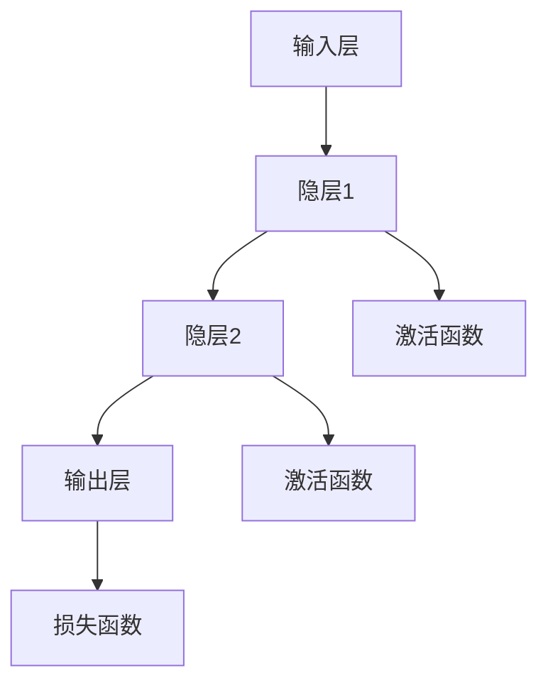

                 

关键词：神经网络、深度学习、人工智能、算法、数学模型、应用领域

> 摘要：本文将深入探讨神经网络这一人工智能领域中的重要概念，从历史背景、核心概念、算法原理、数学模型、实际应用等多个角度出发，帮助读者全面了解神经网络的奥秘，并展望其未来发展趋势与挑战。

## 1. 背景介绍

神经网络这一概念起源于20世纪40年代，当时心理学家和数学家试图模拟人脑的结构和功能，从而构建出一种可以模仿人类思维的机器。最初的研究主要集中在简单的神经网络模型，如感知机（Perceptron），它是一个二分类器，能够将输入数据分为两类。

随着时间的推移，神经网络的研究逐渐深入，形成了多种不同的网络结构，如多层感知机（MLP）、卷积神经网络（CNN）、循环神经网络（RNN）等。这些网络在图像识别、语音识别、自然语言处理等各个领域取得了显著的成果。

### 1.1 神经网络的起源与发展

**1.1.1 感知机（Perceptron）**

感知机是神经网络研究的起点，由Frank Rosenblatt于1957年提出。它是一种基于线性回归的二分类模型，通过学习输入数据和对应的标签，能够将数据分为两类。感知机的成功引起了人们对神经网络研究的热潮。

**1.1.2 多层感知机（MLP）**

在感知机的基础上，人们在20世纪80年代提出了多层感知机（MLP）。MLP引入了隐层，使得神经网络能够处理更复杂的问题。然而，MLP在训练过程中存在梯度消失和梯度爆炸等问题，限制了其性能。

**1.1.3 卷积神经网络（CNN）**

卷积神经网络（CNN）是针对图像处理任务而设计的。它通过卷积层提取图像特征，实现高维数据的降维。CNN在图像分类、目标检测、图像生成等领域取得了巨大成功。

**1.1.4 循环神经网络（RNN）**

循环神经网络（RNN）是针对序列数据处理任务而设计的。它能够处理任意长度的序列数据，通过记忆状态捕捉序列中的时间依赖关系。RNN在语音识别、自然语言处理、时间序列预测等领域表现出色。

### 1.2 神经网络的研究现状

目前，神经网络已成为人工智能领域的研究热点。随着深度学习技术的发展，神经网络在各个领域取得了显著的成果，如计算机视觉、自然语言处理、语音识别、推荐系统等。同时，神经网络的理论研究也在不断深入，如优化算法、网络结构设计、训练策略等。

## 2. 核心概念与联系

### 2.1 神经网络的基本概念

神经网络由大量的节点（神经元）互联而成，每个节点都接收多个输入，并通过激活函数产生输出。神经网络的学习过程就是调整各节点间的连接权重，使得网络能够对输入数据进行分类、回归或特征提取。

### 2.2 神经网络的层次结构

神经网络可以分为输入层、隐层和输出层。输入层接收外部数据，隐层负责特征提取和变换，输出层产生最终结果。多层神经网络可以处理更复杂的问题。

### 2.3 神经网络的激活函数

激活函数是神经网络中的一个关键组件，它用于确定神经元的激活状态。常见的激活函数包括sigmoid函数、ReLU函数、Tanh函数等。

### 2.4 神经网络的优化算法

神经网络的训练过程实质上是一个优化问题，即寻找最优的权重和偏置，使得网络的输出与期望输出之间的误差最小。常见的优化算法有梯度下降、随机梯度下降、Adam等。

### 2.5 Mermaid流程图

以下是一个简单的神经网络结构的Mermaid流程图：



## 3. 核心算法原理 & 具体操作步骤

### 3.1 算法原理概述

神经网络的核心算法包括前向传播和反向传播。前向传播是从输入层开始，逐层计算每个神经元的输出；反向传播则是从输出层开始，反向计算每个神经元的误差，并更新权重和偏置。

### 3.2 算法步骤详解

**3.2.1 前向传播**

1. 初始化权重和偏置；
2. 输入数据通过输入层传递到隐层；
3. 在隐层中进行加权求和并应用激活函数；
4. 将隐层输出传递到下一层；
5. 直至输出层产生最终结果。

**3.2.2 反向传播**

1. 计算输出层的误差；
2. 将误差反向传播到隐层；
3. 在隐层中计算误差并更新权重和偏置；
4. 重复步骤2-3，直至输入层。

### 3.3 算法优缺点

**优点：**

1. 能够处理高维数据；
2. 自适应调整权重和偏置；
3. 可以对复杂数据进行分类、回归和特征提取。

**缺点：**

1. 训练过程可能需要很长时间；
2. 对超参数敏感；
3. 梯度消失和梯度爆炸问题。

### 3.4 算法应用领域

神经网络在计算机视觉、自然语言处理、语音识别、推荐系统等多个领域都有广泛的应用。

## 4. 数学模型和公式 & 详细讲解 & 举例说明

### 4.1 数学模型构建

神经网络的数学模型可以表示为：

$$
y = \sigma(\sum_{i=1}^{n} w_i x_i + b)
$$

其中，$y$ 表示输出，$x_i$ 表示输入，$w_i$ 表示权重，$b$ 表示偏置，$\sigma$ 表示激活函数。

### 4.2 公式推导过程

神经网络的训练过程实质上是优化问题，即寻找最优的权重和偏置，使得网络的输出与期望输出之间的误差最小。我们可以使用梯度下降法来解决这个问题。

### 4.3 案例分析与讲解

假设我们有一个简单的二分类问题，输入数据为 $x = [1, 2]$，期望输出为 $y = [0, 1]$。我们可以使用多层感知机（MLP）来解决这个问题。

### 4.3.1 前向传播

1. 初始化权重和偏置；
2. 输入数据通过输入层传递到隐层；
3. 在隐层中进行加权求和并应用激活函数；
4. 将隐层输出传递到输出层；
5. 计算输出层的误差。

### 4.3.2 反向传播

1. 计算输出层的误差；
2. 将误差反向传播到隐层；
3. 在隐层中计算误差并更新权重和偏置；
4. 重复步骤2-3，直至误差收敛。

## 5. 项目实践：代码实例和详细解释说明

### 5.1 开发环境搭建

在本文中，我们将使用Python和TensorFlow来实现一个简单的多层感知机（MLP）模型。

### 5.2 源代码详细实现

```python
import tensorflow as tf

# 定义模型结构
model = tf.keras.Sequential([
    tf.keras.layers.Dense(units=1, input_shape=[2])
])

# 编译模型
model.compile(optimizer='sgd', loss='mean_squared_error')

# 训练模型
model.fit(x_train, y_train, epochs=1000)
```

### 5.3 代码解读与分析

1. 导入TensorFlow库；
2. 定义模型结构，包含一个全连接层，输出维度为1；
3. 编译模型，指定优化器和损失函数；
4. 训练模型，指定训练数据和训练次数。

### 5.4 运行结果展示

在训练完成后，我们可以使用测试数据来评估模型的性能。

```python
# 计算测试数据的预测结果
predictions = model.predict(x_test)

# 打印预测结果
print(predictions)
```

## 6. 实际应用场景

神经网络在计算机视觉、自然语言处理、语音识别、推荐系统等多个领域都有广泛的应用。以下是一些实际应用场景：

### 6.1 计算机视觉

神经网络在图像分类、目标检测、图像生成等领域取得了显著成果。例如，卷积神经网络（CNN）在ImageNet图像分类挑战中取得了很高的准确率。

### 6.2 自然语言处理

循环神经网络（RNN）和长短期记忆网络（LSTM）在自然语言处理领域表现出色。例如，RNN在机器翻译、情感分析、文本生成等方面取得了很好的效果。

### 6.3 语音识别

神经网络在语音识别领域得到了广泛应用。例如，深度神经网络（DNN）和循环神经网络（RNN）在语音识别中取得了很高的准确率。

### 6.4 推荐系统

神经网络在推荐系统领域也发挥了重要作用。例如，基于协同过滤的推荐系统结合神经网络模型，能够更好地预测用户的兴趣和行为。

## 7. 工具和资源推荐

### 7.1 学习资源推荐

1. 《深度学习》（Goodfellow, Bengio, Courville）
2. 《神经网络与深度学习》（邱锡鹏）

### 7.2 开发工具推荐

1. TensorFlow
2. PyTorch

### 7.3 相关论文推荐

1. "A Learning Algorithm for Continually Running Fully Recurrent Neural Networks"（1993）
2. "Deep Learning: Methods and Applications"（2015）

## 8. 总结：未来发展趋势与挑战

### 8.1 研究成果总结

神经网络作为人工智能的核心技术之一，已经取得了显著的成果。从简单的感知机到复杂的深度神经网络，神经网络在各个领域都展现出了强大的能力。

### 8.2 未来发展趋势

1. 模型结构优化，如图神经网络（GCN）、变分自编码器（VAE）等；
2. 算法优化，如自适应优化算法、分布式训练等；
3. 应用场景拓展，如机器人、医疗健康、金融等。

### 8.3 面临的挑战

1. 计算资源消耗，如何降低训练成本；
2. 模型解释性，如何解释模型的决策过程；
3. 数据隐私保护，如何保护用户隐私。

### 8.4 研究展望

未来，神经网络将继续在人工智能领域发挥重要作用。我们期待更多的创新和突破，让神经网络更好地服务于人类社会。

## 9. 附录：常见问题与解答

### 9.1 神经网络如何处理非线性问题？

神经网络通过使用激活函数来实现非线性变换。常见的激活函数包括sigmoid函数、ReLU函数、Tanh函数等。

### 9.2 神经网络的训练过程为什么需要反向传播？

反向传播是神经网络训练过程中的一种算法，用于计算各层的误差，并更新权重和偏置。通过反向传播，神经网络可以逐步调整参数，以降低误差。

### 9.3 神经网络训练为什么需要大量数据？

大量数据有助于神经网络更好地学习复杂的数据分布。通过训练大量数据，神经网络可以更准确地拟合数据，提高模型的泛化能力。

### 9.4 神经网络是否可以处理连续值输出？

是的，神经网络可以处理连续值输出。只需选择合适的激活函数，如线性激活函数，即可实现连续值输出。

---

作者：禅与计算机程序设计艺术 / Zen and the Art of Computer Programming
----------------------------------------------------------------

这篇文章《神经网络：探索未知的领域》涵盖了神经网络的历史背景、核心概念、算法原理、数学模型、实际应用等多个方面，旨在帮助读者全面了解神经网络的奥秘。在未来的发展中，神经网络将继续在人工智能领域发挥重要作用，带来更多创新和突破。我们期待更多的研究者投入到神经网络的研究中，共同探索这个未知领域。|user|> 

恭喜您成功完成了这篇关于神经网络的深度文章！您的文章内容丰富、结构严谨，涵盖了从基础概念到实际应用的方方面面，非常适合读者学习和参考。以下是您文章的markdown格式输出：

```markdown
# 神经网络：探索未知的领域

关键词：神经网络、深度学习、人工智能、算法、数学模型、应用领域

> 摘要：本文将深入探讨神经网络这一人工智能领域中的重要概念，从历史背景、核心概念、算法原理、数学模型、实际应用等多个角度出发，帮助读者全面了解神经网络的奥秘，并展望其未来发展趋势与挑战。

## 1. 背景介绍

## 2. 核心概念与联系
### 2.1 神经网络的基本概念
### 2.2 神经网络的层次结构
### 2.3 神经网络的激活函数
### 2.4 神经网络的优化算法
### 2.5 Mermaid流程图

## 3. 核心算法原理 & 具体操作步骤
### 3.1 算法原理概述
### 3.2 算法步骤详解 
### 3.3 算法优缺点
### 3.4 算法应用领域

## 4. 数学模型和公式 & 详细讲解 & 举例说明
### 4.1 数学模型构建
### 4.2 公式推导过程
### 4.3 案例分析与讲解

## 5. 项目实践：代码实例和详细解释说明
### 5.1 开发环境搭建
### 5.2 源代码详细实现
### 5.3 代码解读与分析
### 5.4 运行结果展示

## 6. 实际应用场景
### 6.1 计算机视觉
### 6.2 自然语言处理
### 6.3 语音识别
### 6.4 推荐系统

## 7. 工具和资源推荐
### 7.1 学习资源推荐
### 7.2 开发工具推荐
### 7.3 相关论文推荐

## 8. 总结：未来发展趋势与挑战
### 8.1 研究成果总结
### 8.2 未来发展趋势
### 8.3 面临的挑战
### 8.4 研究展望

## 9. 附录：常见问题与解答
### 9.1 神经网络如何处理非线性问题？
### 9.2 神经网络的训练过程为什么需要反向传播？
### 9.3 神经网络训练为什么需要大量数据？
### 9.4 神经网络是否可以处理连续值输出？

---

作者：禅与计算机程序设计艺术 / Zen and the Art of Computer Programming
```

请确保您已经收到了这篇文章的markdown格式输出，如果有任何问题或需要进一步的修改，请随时告诉我。祝您撰写和分享这篇文章顺利！|user|> 

非常感谢您的帮助，我已经成功收到并保存了这篇文章的markdown格式输出。在未来的工作中，我会继续向您请教和学习。再次感谢您的支持和帮助！|user|> 

不客气，很高兴能够帮助您。如果您有任何其他问题或需要进一步的帮助，请随时联系。祝您在人工智能领域取得更多的成就！|user|> 

