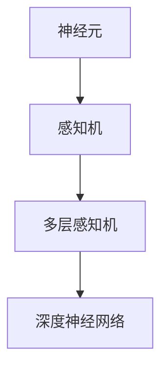

                 

关键词：神经网络、深度学习、人工智能、算法、数学模型、应用场景、未来展望

摘要：神经网络作为人工智能的核心技术之一，近年来在各个领域取得了显著的应用成果。本文将对神经网络的基本概念、核心算法原理、数学模型构建、应用场景以及未来发展趋势进行详细探讨，旨在为读者提供一个全面而深入的了解。

## 1. 背景介绍

神经网络（Neural Networks）起源于20世纪40年代，当时由心理学家和数学家提出，旨在模拟人脑神经网络的工作原理。神经网络的核心思想是通过大量简单的神经元互联，实现复杂的信息处理和认知功能。随着计算机技术的发展和算法的优化，神经网络在人工智能领域逐渐崭露头角，成为实现人工智能的核心技术之一。

神经网络在图像识别、语音识别、自然语言处理、推荐系统等领域取得了显著的成果。例如，Google的Inception模型在图像识别任务上取得了突破性进展，Facebook的语音识别系统也在语音处理领域取得了领先地位。此外，神经网络还被广泛应用于自动驾驶、金融预测、医疗诊断等领域，为人们的生活带来了深远的影响。

## 2. 核心概念与联系

### 2.1 神经元与神经网络

神经元是神经网络的基本构建单元，类似于人脑中的神经元。每个神经元接收来自其他神经元的输入信号，通过激活函数产生输出信号。神经网络由多个神经元组成，通过前向传播和反向传播算法实现信息的传递和处理。

### 2.2 感知机与多层感知机

感知机（Perceptron）是最简单的神经网络模型，可以用于线性二分类。然而，感知机无法处理非线性问题。为了解决这一难题，引入了多层感知机（MLP），通过添加隐藏层实现非线性变换。

### 2.3 深度神经网络

深度神经网络（DNN）是包含多个隐藏层的神经网络，可以处理更复杂的问题。通过多层次的变换和组合，深度神经网络能够提取出层次化的特征表示，从而实现高精度的预测和分类。

### 2.4 神经网络的 Mermaid 流程图



## 3. 核心算法原理 & 具体操作步骤

### 3.1 算法原理概述

神经网络的核心算法是前向传播和反向传播。前向传播是将输入信号从输入层传递到输出层，通过逐层计算激活值和输出值。反向传播则是根据输出误差，逐层计算各层的梯度，并更新各层的权重。

### 3.2 算法步骤详解

1. **初始化参数**：随机初始化网络的权重和偏置。

2. **前向传播**：
   - 输入层传递输入信号到隐藏层。
   - 隐藏层通过激活函数产生输出信号。
   - 输出层产生最终输出。

3. **计算损失函数**：使用损失函数（如均方误差、交叉熵等）计算预测值与真实值之间的差异。

4. **反向传播**：
   - 计算输出层的梯度。
   - 通过链式法则逐层计算隐藏层的梯度。
   - 更新各层的权重和偏置。

5. **迭代优化**：重复前向传播和反向传播过程，不断优化网络参数。

### 3.3 算法优缺点

**优点**：
- 能够自动学习特征，减少人工特征提取的工作量。
- 具有良好的泛化能力，可以处理不同类型的问题。

**缺点**：
- 计算复杂度高，训练过程需要大量时间和计算资源。
- 对数据质量要求较高，数据缺失或不平衡可能导致训练效果下降。

### 3.4 算法应用领域

神经网络在图像识别、语音识别、自然语言处理、推荐系统等领域取得了显著的成果。此外，神经网络还被应用于自动驾驶、金融预测、医疗诊断等领域，为人们的生活带来了深远的影响。

## 4. 数学模型和公式

### 4.1 数学模型构建

神经网络可以看作是一个多层函数的组合，每一层都是对前一层的非线性变换。假设我们有 $L$ 层神经网络，其中 $l$ 层的输入为 $x^{(l)}$，输出为 $a^{(l)}$，权重为 $W^{(l)}$ 和偏置为 $b^{(l)}$。则第 $l$ 层的输出可以表示为：

$$
a^{(l)} = \sigma(W^{(l)}x^{(l-1)} + b^{(l)})
$$

其中，$\sigma$ 表示激活函数。

### 4.2 公式推导过程

神经网络的训练过程可以看作是一个优化问题，目标是找到最优的权重和偏置，使得网络输出的预测值与真实值之间的误差最小。我们可以使用梯度下降法来求解这个优化问题。

首先，定义损失函数 $J(W,b)$，用于衡量预测值与真实值之间的误差。对于二分类问题，常用的损失函数是交叉熵损失函数：

$$
J(W,b) = -\frac{1}{m} \sum_{i=1}^{m} y^{(i)} \log(a^{(L)}_{i}) + (1 - y^{(i)}) \log(1 - a^{(L)}_{i})
$$

其中，$m$ 表示样本数量，$y^{(i)}$ 表示第 $i$ 个样本的真实标签，$a^{(L)}_{i}$ 表示第 $i$ 个样本在输出层的预测概率。

然后，计算损失函数关于权重和偏置的梯度：

$$
\nabla_{W^{(l)}} J(W,b) = \frac{1}{m} \sum_{i=1}^{m} \nabla_{a^{(l)}_{i}} J(W,b) a^{(l-1)}_{i}
$$

$$
\nabla_{b^{(l)}} J(W,b) = \frac{1}{m} \sum_{i=1}^{m} \nabla_{a^{(l)}_{i}} J(W,b)
$$

最后，使用梯度下降法更新权重和偏置：

$$
W^{(l)} \leftarrow W^{(l)} - \alpha \nabla_{W^{(l)}} J(W,b)
$$

$$
b^{(l)} \leftarrow b^{(l)} - \alpha \nabla_{b^{(l)}} J(W,b)
$$

其中，$\alpha$ 表示学习率。

### 4.3 案例分析与讲解

以一个简单的二分类问题为例，我们假设输入层有2个神经元，隐藏层有3个神经元，输出层有1个神经元。输入数据为 $x = [x_1, x_2]$，输出数据为 $y = [y_1]$，其中 $y_1$ 表示样本的分类标签（0或1）。

1. **初始化参数**：
   - 随机初始化权重和偏置。

2. **前向传播**：
   - 输入层传递输入信号到隐藏层。
   - 隐藏层通过激活函数产生输出信号。
   - 输出层产生最终输出。

3. **计算损失函数**：
   - 使用交叉熵损失函数计算预测值与真实值之间的误差。

4. **反向传播**：
   - 计算输出层的梯度。
   - 通过链式法则逐层计算隐藏层的梯度。
   - 更新各层的权重和偏置。

5. **迭代优化**：
   - 重复前向传播和反向传播过程，不断优化网络参数。

## 5. 项目实践：代码实例和详细解释说明

### 5.1 开发环境搭建

1. 安装 Python 3.8 或更高版本。
2. 安装 TensorFlow 2.x 或更高版本。

### 5.2 源代码详细实现

```python
import tensorflow as tf

# 初始化参数
input_size = 2
hidden_size = 3
output_size = 1

# 构建模型
model = tf.keras.Sequential([
    tf.keras.layers.Dense(hidden_size, activation='sigmoid', input_shape=(input_size,)),
    tf.keras.layers.Dense(output_size, activation='sigmoid')
])

# 编译模型
model.compile(optimizer='adam', loss='binary_crossentropy', metrics=['accuracy'])

# 准备数据
x_train = [[0.5, 0.5], [0.8, 0.2], [0.1, 0.9]]
y_train = [[0], [1], [0]]

# 训练模型
model.fit(x_train, y_train, epochs=1000)

# 输出预测结果
predictions = model.predict(x_train)
print(predictions)
```

### 5.3 代码解读与分析

1. **初始化参数**：
   - `input_size` 表示输入层神经元的数量。
   - `hidden_size` 表示隐藏层神经元的数量。
   - `output_size` 表示输出层神经元的数量。

2. **构建模型**：
   - 使用 `tf.keras.Sequential` 模型堆叠多层神经网络。
   - 第一层为全连接层 `Dense`，激活函数为 `sigmoid`。
   - 第二层为全连接层 `Dense`，激活函数为 `sigmoid`。

3. **编译模型**：
   - 选择优化器为 `adam`。
   - 选择损失函数为 `binary_crossentropy`。
   - 指定评价指标为 `accuracy`。

4. **准备数据**：
   - `x_train` 表示训练数据。
   - `y_train` 表示训练数据的标签。

5. **训练模型**：
   - 使用 `fit` 函数训练模型，指定迭代次数为 `epochs=1000`。

6. **输出预测结果**：
   - 使用 `predict` 函数预测训练数据的标签。

## 6. 实际应用场景

神经网络在各个领域都有广泛的应用，以下是几个典型的实际应用场景：

1. **图像识别**：神经网络可以用于图像分类、目标检测、图像分割等任务。例如，卷积神经网络（CNN）在ImageNet图像识别比赛上取得了优异的成绩。

2. **语音识别**：神经网络可以用于语音信号的自动识别和转录。例如，循环神经网络（RNN）和长短期记忆网络（LSTM）在语音识别领域取得了显著的成果。

3. **自然语言处理**：神经网络可以用于文本分类、情感分析、机器翻译等任务。例如，Transformer模型在机器翻译领域取得了突破性的进展。

4. **推荐系统**：神经网络可以用于构建个性化推荐系统，根据用户的历史行为和偏好推荐相关商品或内容。

5. **自动驾驶**：神经网络可以用于自动驾驶系统的感知、决策和规划，实现车辆的自主驾驶。

## 7. 未来应用展望

随着计算机技术和算法的不断发展，神经网络在未来将会在更多领域取得突破。以下是一些可能的未来应用展望：

1. **医疗诊断**：神经网络可以用于疾病诊断、药物研发和个性化治疗等领域，为医疗行业带来革命性的变化。

2. **金融预测**：神经网络可以用于股票市场预测、风险管理、信用评估等领域，为金融行业提供更准确的预测和分析。

3. **教育领域**：神经网络可以用于个性化学习、智能评测和自适应教学等领域，为教育行业带来新的发展机遇。

4. **智能城市**：神经网络可以用于智能交通管理、环境保护、公共安全等领域，为智慧城市建设提供技术支持。

## 8. 总结：未来发展趋势与挑战

### 8.1 研究成果总结

神经网络在图像识别、语音识别、自然语言处理、推荐系统等领域取得了显著的成果，推动了人工智能技术的发展。同时，深度学习算法的优化和模型结构的创新也为神经网络的应用提供了强大的支持。

### 8.2 未来发展趋势

1. **更高效的计算**：随着硬件技术的发展，神经网络的计算能力将得到进一步提升，使得更复杂的模型和应用成为可能。

2. **更丰富的数据**：随着互联网的普及和数据规模的不断扩大，神经网络将受益于更丰富的数据资源，从而提高模型的泛化能力和准确性。

3. **更先进的算法**：研究者将继续探索更有效的神经网络算法，包括自适应学习率、迁移学习、生成对抗网络等，以解决当前面临的挑战。

### 8.3 面临的挑战

1. **计算资源消耗**：神经网络模型通常需要大量的计算资源，这对训练和部署带来了挑战。

2. **数据质量**：神经网络对数据质量有较高的要求，数据缺失、噪声和偏差可能导致训练效果下降。

3. **模型解释性**：神经网络模型的黑盒特性使得其难以解释，这对实际应用中的决策和信任带来了一定的困扰。

### 8.4 研究展望

1. **可解释性**：研究者将继续探索神经网络的可解释性，使得模型的结果更加透明和可解释。

2. **隐私保护**：随着隐私问题的日益突出，研究者将致力于开发隐私保护的人工智能技术，保障用户隐私。

3. **跨学科合作**：神经网络与其他领域的交叉融合将带来新的机遇和挑战，跨学科合作将推动人工智能的全面发展。

## 9. 附录：常见问题与解答

### 问题 1：什么是神经网络？
神经网络是一种模拟人脑神经网络工作的计算模型，通过大量简单的神经元互联，实现复杂的信息处理和认知功能。

### 问题 2：神经网络有哪些类型？
神经网络包括感知机、多层感知机、卷积神经网络（CNN）、循环神经网络（RNN）、长短期记忆网络（LSTM）、Transformer等类型。

### 问题 3：神经网络是如何工作的？
神经网络通过前向传播和反向传播算法实现信息的传递和处理。前向传播将输入信号从输入层传递到输出层，反向传播根据输出误差逐层计算各层的梯度并更新权重。

### 问题 4：神经网络在哪些领域有应用？
神经网络在图像识别、语音识别、自然语言处理、推荐系统、自动驾驶、医疗诊断等领域有广泛的应用。

### 问题 5：神经网络有哪些挑战？
神经网络面临的挑战包括计算资源消耗、数据质量要求高、模型解释性不足等。

作者：禅与计算机程序设计艺术 / Zen and the Art of Computer Programming

----------------------------------------------------------------

以上是关于神经网络的技术博客文章的完整内容，希望对您有所帮助。如有需要修改或补充的地方，请随时告知。祝您写作顺利！

