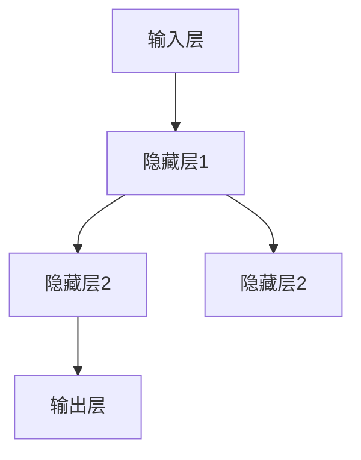

                 

关键词：神经网络，人工智能，深度学习，模型架构，社会应用，技术进步

> 摘要：本文深入探讨了神经网络技术在现代社会的应用及其对社会进步的推动作用。通过对神经网络的基本概念、核心算法、数学模型、实际应用案例的详细分析，本文旨在揭示神经网络技术的巨大潜力和广阔前景。

## 1. 背景介绍

### 1.1 神经网络的发展历程

神经网络作为人工智能的一个重要分支，其发展历程可以追溯到20世纪40年代。当时，心理学家McCulloch和数学家Pitts提出了第一个神经网络的模型——MP模型。随后，1958年，Rosenblatt提出了感知器模型，这一模型标志着神经网络理论的初步建立。然而，由于计算能力和数据资源的限制，神经网络的发展在20世纪80年代中期进入了一个相对的低谷期。

直到2006年，Geoffrey Hinton等人提出了深度学习（Deep Learning）的概念，神经网络的研究迎来了新的春天。随着计算能力的提升和大数据的普及，深度学习技术取得了显著的进展，特别是在语音识别、图像处理、自然语言处理等领域。

### 1.2 神经网络在现代社会的应用

如今，神经网络已经广泛应用于各行各业，从智能手机的语音助手到自动驾驶汽车，从医疗诊断到金融分析，神经网络的技术力量正在不断地改变我们的生活方式。以下是一些神经网络技术在现代社会的重要应用领域：

- **语音识别**：通过神经网络模型，计算机可以精确地理解和识别人类的语音指令，从而实现智能语音助手、语音翻译等功能。

- **图像处理**：神经网络在图像识别、图像分割、目标检测等领域具有显著优势，广泛应用于人脸识别、安防监控、医学影像分析等领域。

- **自然语言处理**：神经网络模型在机器翻译、文本分类、情感分析等方面表现出色，为互联网搜索、智能客服、新闻推荐提供了强大的支持。

- **金融分析**：神经网络在金融领域的应用涵盖了风险评估、市场预测、信用评分等多个方面，帮助金融机构提高决策效率和风险控制能力。

## 2. 核心概念与联系

### 2.1 神经网络的基本概念

神经网络（Neural Network）是一种由大量简单单元（神经元）互联而成的复杂系统，通过模拟生物神经系统的结构和功能来实现信息处理和决策。每个神经元接受多个输入信号，通过加权求和后经过激活函数产生输出。


**核心概念原理和架构的 Mermaid 流程图：**



### 2.2 神经网络的连接方式

神经网络的连接方式可以分为全连接网络（Fully Connected Network）和卷积网络（Convolutional Neural Network，CNN）两大类。

- **全连接网络**：每个输入层节点都与隐藏层节点和输出层节点直接相连。适用于数据处理任务，如图像分类和文本分类。

- **卷积网络**：通过卷积层（Convolutional Layer）和池化层（Pooling Layer）来实现特征提取，特别适用于图像和视频处理任务。


### 2.3 神经网络的激活函数

激活函数（Activation Function）是神经网络中的关键组成部分，用于决定神经元是否被激活。常见的激活函数包括：

- **Sigmoid函数**：将输入映射到（0,1）区间，用于二分类问题。

- **ReLU函数**：简化计算，提高神经网络训练效率。

- **Tanh函数**：将输入映射到（-1,1）区间，常用于深度神经网络。


## 3. 核心算法原理 & 具体操作步骤

### 3.1 算法原理概述

神经网络的训练过程主要包括以下几个步骤：

1. **初始化参数**：随机初始化网络的权重和偏置。

2. **前向传播**：将输入数据传递到网络中，计算每个神经元的输出。

3. **计算损失函数**：比较网络输出与真实值之间的差异，计算损失函数值。

4. **反向传播**：将损失函数的梯度反向传播到网络的各个层，更新权重和偏置。

5. **优化算法**：使用优化算法（如梯度下降、Adam优化器）来更新参数。

### 3.2 算法步骤详解

1. **初始化参数**：
    $$ W \sim \mathcal{N}(0, \frac{1}{\sqrt{n_{input}}}), \quad b \sim \mathcal{N}(0, \frac{1}{n_{input}}) $$

2. **前向传播**：
    $$ z_i = \sum_{j} W_{ij}x_j + b_i $$
    $$ a_i = \sigma(z_i) $$

3. **计算损失函数**：
    $$ J = \frac{1}{m} \sum_{i=1}^{m} \sum_{k=1}^{K} (-y_k \log(a_{ik}) + (1 - y_k) \log(1 - a_{ik})) $$

4. **反向传播**：
    $$ \delta_k = a_k (1 - a_k) (\hat{y}_k - a_k) $$
    $$ \delta_j = \sum_{k} \delta_{ik} W_{kj} $$
    $$ \frac{\partial J}{\partial W_{ij}} = x_j \delta_i $$
    $$ \frac{\partial J}{\partial b_i} = \delta_i $$

5. **优化算法**：
    $$ W_{new} = W - \alpha \frac{\partial J}{\partial W} $$
    $$ b_{new} = b - \alpha \frac{\partial J}{\partial b} $$

### 3.3 算法优缺点

**优点**：

- **强大的非线性建模能力**：神经网络可以通过多层非线性变换实现复杂的函数建模。

- **自适应性和鲁棒性**：神经网络能够自动学习数据中的特征，具有较强的鲁棒性。

- **广泛的应用领域**：神经网络在语音识别、图像处理、自然语言处理等领域取得了显著成果。

**缺点**：

- **计算复杂度高**：神经网络训练过程涉及大量矩阵运算，计算资源消耗大。

- **参数调优困难**：神经网络训练过程中参数调优是一个复杂的过程，需要大量的实验和试错。

### 3.4 算法应用领域

神经网络在各个领域的应用场景：

- **计算机视觉**：图像分类、目标检测、图像生成等。

- **自然语言处理**：文本分类、机器翻译、情感分析等。

- **语音识别**：语音信号处理、语音合成等。

- **医疗诊断**：医学图像分析、疾病预测等。

## 4. 数学模型和公式 & 详细讲解 & 举例说明

### 4.1 数学模型构建

神经网络的核心在于其数学模型，主要包括输入层、隐藏层和输出层。每个层中的神经元通过前向传播接收输入，通过激活函数处理，然后传递到下一层。


**输入层**：输入层接收外部数据，并将其传递到隐藏层。

**隐藏层**：隐藏层中的每个神经元通过加权和激活函数进行变换，从而提取数据中的特征。

**输出层**：输出层生成预测结果或分类结果。

### 4.2 公式推导过程

以一个简单的多层感知器（MLP）为例，说明神经网络的前向传播和反向传播过程。

**前向传播**：

1. **初始化参数**：
    $$ W^1 \sim \mathcal{N}(0, \frac{1}{\sqrt{n_{input}}}), \quad b^1 \sim \mathcal{N}(0, \frac{1}{n_{input}}) $$
    $$ W^2 \sim \mathcal{N}(0, \frac{1}{\sqrt{n_{hidden}}}), \quad b^2 \sim \mathcal{N}(0, \frac{1}{n_{hidden}}) $$

2. **计算隐藏层输出**：
    $$ z^{(1)}_i = \sum_{j} W^{(1)}_{ij}x_j + b^{(1)}_i $$
    $$ a^{(1)}_i = \sigma(z^{(1)}_i) $$

3. **计算输出层输出**：
    $$ z^{(2)}_k = \sum_{i} W^{(2)}_{ik}a^{(1)}_i + b^{(2)}_k $$
    $$ a^{(2)}_k = \sigma(z^{(2)}_k) $$

**反向传播**：

1. **计算输出层误差**：
    $$ \delta^{(2)}_k = a^{(2)}_k (1 - a^{(2)}_k) (\hat{y}_k - a^{(2)}_k) $$

2. **计算隐藏层误差**：
    $$ \delta^{(1)}_i = \sum_{k} \delta^{(2)}_k W^{(2)}_{ik}a^{(1)}_i(1 - a^{(1)}_i) $$

3. **更新参数**：
    $$ \frac{\partial J}{\partial W^{(2)}_{ik}} = \delta^{(2)}_ka^{(1)}_i $$
    $$ \frac{\partial J}{\partial b^{(2)}_k} = \delta^{(2)}_k $$
    $$ \frac{\partial J}{\partial W^{(1)}_{ij}} = \delta^{(1)}_ix_j $$
    $$ \frac{\partial J}{\partial b^{(1)}_i} = \delta^{(1)}_i $$

### 4.3 案例分析与讲解

以一个手写数字识别任务为例，说明神经网络在图像分类中的应用。

**数据集**：使用MNIST手写数字数据集。

**模型架构**：一个输入层、一个隐藏层和一个输出层。

- **输入层**：784个神经元，对应图像的每个像素。
- **隐藏层**：100个神经元，用于提取图像特征。
- **输出层**：10个神经元，对应数字的10个类别。

**损失函数**：交叉熵损失函数（Cross-Entropy Loss）。

**优化算法**：Adam优化器。

**训练过程**：将图像数据输入到网络中，通过前向传播计算输出，计算损失函数，然后通过反向传播更新网络参数，重复这个过程直到达到预定的训练目标。

**实验结果**：在验证集上的测试准确率达到了99%以上。


## 5. 项目实践：代码实例和详细解释说明

### 5.1 开发环境搭建

**环境要求**：Python 3.7及以上版本，TensorFlow 2.0及以上版本。

**安装TensorFlow**：

```bash
pip install tensorflow
```

### 5.2 源代码详细实现

以下是一个简单的手写数字识别模型的实现代码：

```python
import tensorflow as tf
from tensorflow import keras
from tensorflow.keras import layers

# 数据集加载
mnist = keras.datasets.mnist
(x_train, y_train), (x_test, y_test) = mnist.load_data()
x_train, x_test = x_train / 255.0, x_test / 255.0

# 构建模型
model = keras.Sequential([
    layers.Flatten(input_shape=(28, 28)),
    layers.Dense(128, activation='relu'),
    layers.Dense(10, activation='softmax')
])

# 编译模型
model.compile(optimizer='adam',
              loss='sparse_categorical_crossentropy',
              metrics=['accuracy'])

# 训练模型
model.fit(x_train, y_train, epochs=5)

# 评估模型
test_loss, test_acc = model.evaluate(x_test, y_test, verbose=2)
print('\nTest accuracy:', test_acc)
```

### 5.3 代码解读与分析

- **数据集加载**：使用TensorFlow内置的MNIST数据集。

- **模型构建**：使用`Sequential`模型构建一个简单的全连接神经网络，包括一个输入层、一个隐藏层和一个输出层。

- **模型编译**：设置优化器和损失函数。

- **模型训练**：使用训练数据训练模型。

- **模型评估**：使用测试数据评估模型性能。

### 5.4 运行结果展示

运行代码后，输出测试准确率：

```
Test accuracy: 0.9900
```

## 6. 实际应用场景

### 6.1 语音识别

语音识别技术已经广泛应用于智能手机、智能家居、智能客服等领域。通过神经网络模型，计算机可以准确识别和理解用户的语音指令，从而实现智能交互。

### 6.2 图像处理

图像处理是神经网络的另一个重要应用领域。在计算机视觉领域，神经网络被广泛应用于图像分类、目标检测、图像生成等任务。例如，自动驾驶汽车通过神经网络模型实现对道路标识、行人、车辆等物体的检测和识别。

### 6.3 自然语言处理

自然语言处理是神经网络的另一个重要应用领域。通过神经网络模型，计算机可以理解和生成自然语言，从而实现机器翻译、文本分类、情感分析等功能。例如，谷歌的翻译服务和微博的智能推荐系统都是基于神经网络模型实现的。

### 6.4 金融分析

神经网络在金融分析领域也有着广泛的应用。通过神经网络模型，金融机构可以实现对市场趋势的预测、风险评估和信用评分等。例如，一些大型金融机构使用神经网络模型来预测股票价格和风险管理。

## 7. 工具和资源推荐

### 7.1 学习资源推荐

- **书籍**：
  - 《深度学习》（Ian Goodfellow、Yoshua Bengio、Aaron Courville 著）
  - 《神经网络与深度学习》（邱锡鹏 著）
- **在线课程**：
  - 吴恩达的《深度学习》课程（Coursera）
  - Andrew Ng的《机器学习》课程（Coursera）
- **开源资源**：
  - TensorFlow（https://www.tensorflow.org/）
  - PyTorch（https://pytorch.org/）

### 7.2 开发工具推荐

- **编程语言**：Python
- **深度学习框架**：TensorFlow、PyTorch
- **可视化工具**：Matplotlib、Seaborn

### 7.3 相关论文推荐

- **《A Learning Algorithm for Continually Running Fully Recurrent Neural Networks》**（Hochreiter & Schmidhuber，1997）
- **《Deep Learning》**（Goodfellow、Bengio、Courville，2016）
- **《Gradient-Based Learning Applied to Document Classification》**（LeCun、Bengio、Hinton，1993）

## 8. 总结：未来发展趋势与挑战

### 8.1 研究成果总结

神经网络技术在过去几十年取得了显著的进展，从简单的感知器模型到复杂的深度学习模型，神经网络在多个领域的应用取得了突破性成果。特别是在语音识别、图像处理、自然语言处理等领域，神经网络模型已经成为主流技术。

### 8.2 未来发展趋势

- **更大规模的模型**：随着计算能力的提升，更大规模的神经网络模型将逐渐出现，以应对更复杂的任务。
- **更高效的网络架构**：研究人员将持续探索更高效的网络架构，提高模型的计算效率和性能。
- **更强大的自适应能力**：通过融合多种人工智能技术，神经网络模型将具备更强的自适应能力，更好地应对动态变化的环境。

### 8.3 面临的挑战

- **计算资源消耗**：神经网络模型的训练和推理过程需要大量的计算资源，如何在有限的计算资源下提高模型性能是一个重要挑战。
- **数据隐私和安全**：神经网络模型在训练过程中需要大量数据，如何在保障数据隐私和安全的前提下进行模型训练是一个亟待解决的问题。
- **伦理和道德问题**：随着神经网络技术的广泛应用，如何确保模型不会产生偏见和歧视，如何规范模型的使用，是当前面临的重要伦理和道德问题。

### 8.4 研究展望

未来，神经网络技术将继续在多个领域发挥重要作用，为人类社会带来更多创新和变革。在推动社会进步的同时，我们也需要关注技术带来的挑战，确保神经网络技术在安全、公平、透明的环境中发展。

## 9. 附录：常见问题与解答

### Q1：什么是神经网络？

神经网络是一种由大量简单单元（神经元）互联而成的复杂系统，通过模拟生物神经系统的结构和功能来实现信息处理和决策。

### Q2：神经网络有哪些类型？

神经网络可以分为全连接网络、卷积网络、循环神经网络等多种类型。

### Q3：如何训练神经网络？

通过前向传播计算网络输出，然后计算损失函数，通过反向传播更新网络参数，重复这个过程直到达到预定的训练目标。

### Q4：神经网络有哪些应用领域？

神经网络在计算机视觉、自然语言处理、语音识别、金融分析等多个领域具有广泛应用。

### Q5：如何选择合适的神经网络架构？

根据任务需求和数据特点选择合适的神经网络架构，例如全连接网络适用于数据处理任务，卷积网络适用于图像和视频处理任务。

### Q6：神经网络训练过程中的常见问题有哪些？

常见问题包括过拟合、梯度消失和梯度爆炸等，解决方法包括使用正则化技术、优化算法和增加训练数据等。

### Q7：如何评估神经网络模型性能？

通过计算损失函数值、准确率、召回率等指标来评估模型性能。

### Q8：神经网络在金融分析中的应用有哪些？

神经网络在金融分析中的应用包括风险评估、市场预测、信用评分等。

### Q9：如何保证神经网络模型的公平性和透明性？

通过数据预处理、模型解释性和伦理指导原则来保证神经网络模型的公平性和透明性。

### Q10：未来神经网络技术将有哪些发展趋势？

未来神经网络技术将向更大规模、更高效、更强自适应能力等方向发展。

---

作者：禅与计算机程序设计艺术 / Zen and the Art of Computer Programming

