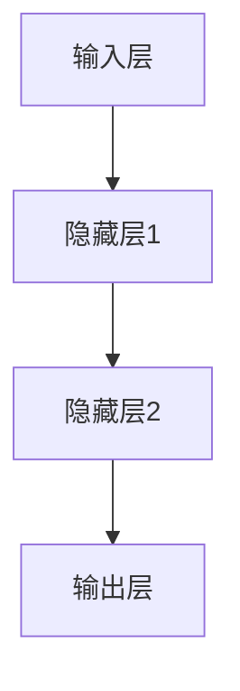

                 

关键词：神经网络、深度学习、社会进步、技术发展、未来展望

> 摘要：本文将探讨神经网络技术如何通过深度学习推动社会进步，分析其在各个领域的应用，并展望未来发展趋势和面临的挑战。

## 1. 背景介绍

神经网络是一种模仿人脑结构和功能的人工智能技术，起源于20世纪40年代。随着计算机技术的发展，尤其是深度学习的崛起，神经网络已经成为人工智能领域的重要研究方向。神经网络通过多层非线性变换，实现从输入到输出的映射，从而在图像识别、语音识别、自然语言处理等任务中取得了显著的成果。

### 神经网络的历史和发展

神经网络的研究经历了多个阶段。最早的形式是感知机（Perceptron），由Frank Rosenblatt在1957年提出。感知机是一种单层神经网络，用于分类问题。然而，由于感知机无法解决非线性的问题，因此受到限制。直到1986年，Rumelhart等人提出了反向传播算法（Backpropagation），使得多层神经网络得以训练，从而开启了深度学习的时代。

### 深度学习的崛起

深度学习是神经网络的一种形式，其核心思想是构建多层神经网络，通过逐层学习特征，实现对复杂问题的建模。深度学习在图像识别、语音识别、自然语言处理等任务中取得了突破性的进展，成为人工智能领域的重要方向。近年来，随着计算能力的提升和大数据的广泛应用，深度学习的研究和应用不断深入，推动了人工智能技术的快速发展。

## 2. 核心概念与联系

### 神经网络的基本原理

神经网络由多个神经元（或称为节点）组成，每个神经元接收多个输入信号，通过加权求和处理后，产生一个输出信号。神经网络通过训练，调整每个神经元的权重，使得网络能够对输入数据进行分类、回归或其他形式的预测。

### 深度学习的架构

深度学习通常由多个隐藏层组成，包括卷积层、全连接层、池化层等。卷积层用于提取图像的特征，全连接层用于分类或回归任务，池化层用于降低数据的维度和减少过拟合。

### Mermaid 流程图



### 神经网络与深度学习的联系

神经网络是深度学习的基础，而深度学习则是神经网络的扩展。深度学习通过增加网络层数，提高模型的复杂度，从而实现更准确的预测。

## 3. 核心算法原理 & 具体操作步骤

### 3.1 算法原理概述

神经网络的核心算法是反向传播算法（Backpropagation）。反向传播算法通过计算损失函数关于网络参数的梯度，更新网络参数，从而优化模型的预测能力。

### 3.2 算法步骤详解

1. 前向传播：将输入数据输入到网络，通过各个层的加权求和处理，得到输出结果。
2. 计算损失：计算输出结果与真实标签之间的误差，得到损失函数的值。
3. 反向传播：计算损失函数关于网络参数的梯度，反向传播到前一层。
4. 更新参数：根据梯度更新网络参数，减小损失函数的值。

### 3.3 算法优缺点

优点：
- 能够处理非线性问题。
- 通过分层学习，能够提取出层次化的特征。

缺点：
- 训练时间较长。
- 对超参数敏感。

### 3.4 算法应用领域

神经网络和深度学习在图像识别、语音识别、自然语言处理、推荐系统等领域有广泛的应用。

## 4. 数学模型和公式 & 详细讲解 & 举例说明

### 4.1 数学模型构建

神经网络的基本数学模型可以表示为：

$$
Y = \sigma(WH + b)
$$

其中，$Y$ 是输出，$W$ 是权重矩阵，$H$ 是隐藏层的激活值，$b$ 是偏置，$\sigma$ 是激活函数。

### 4.2 公式推导过程

假设我们有一个包含 $L$ 层的神经网络，其中 $L-1$ 层是隐藏层，最后一层是输出层。前向传播的过程可以表示为：

$$
H^{(1)} = \sigma(W^{(1)}X + b^{(1)})
$$

$$
H^{(2)} = \sigma(W^{(2)}H^{(1)} + b^{(2)})
$$

$$
...
$$

$$
H^{(L-1)} = \sigma(W^{(L-1)}H^{(L-2)} + b^{(L-1)})
$$

$$
Y = \sigma(W^{(L)}H^{(L-1)} + b^{(L)})
$$

### 4.3 案例分析与讲解

假设我们有一个二分类问题，输入数据为 $X = [x_1, x_2, ..., x_n]$，隐藏层为 $H^{(1)}$ 和 $H^{(2)}$，输出层为 $Y$。我们的目标是训练一个神经网络，使其能够正确分类输入数据。

首先，我们需要初始化权重矩阵 $W^{(1)}$、$W^{(2)}$ 和 $b^{(1)}$、$b^{(2)}$。然后，通过前向传播，计算输出 $Y$。接下来，计算损失函数，例如均方误差（MSE）：

$$
Loss = \frac{1}{2} \sum_{i=1}^{n} (Y_i - \hat{Y}_i)^2
$$

其中，$Y_i$ 是真实标签，$\hat{Y}_i$ 是预测结果。

然后，通过反向传播，计算损失函数关于权重矩阵和偏置的梯度，更新权重矩阵和偏置：

$$
\frac{\partial Loss}{\partial W^{(L)}_{ij}} = (H^{(L-1)})_i (Y_i - \hat{Y}_i)
$$

$$
\frac{\partial Loss}{\partial b^{(L)}_j} = (Y_i - \hat{Y}_i)
$$

$$
...
$$

$$
\frac{\partial Loss}{\partial W^{(1)}_{ij}} = (H^{(2)})_i (H^{(1)})_j (Y_i - \hat{Y}_i)
$$

$$
\frac{\partial Loss}{\partial b^{(1)}_j} = (H^{(2)})_i (Y_i - \hat{Y}_i)
$$

最后，根据梯度更新权重矩阵和偏置：

$$
W^{(L)}_{ij} = W^{(L)}_{ij} - \alpha \frac{\partial Loss}{\partial W^{(L)}_{ij}}
$$

$$
b^{(L)}_j = b^{(L)}_j - \alpha \frac{\partial Loss}{\partial b^{(L)}_j}
$$

$$
...
$$

$$
W^{(1)}_{ij} = W^{(1)}_{ij} - \alpha \frac{\partial Loss}{\partial W^{(1)}_{ij}}
$$

$$
b^{(1)}_j = b^{(1)}_j - \alpha \frac{\partial Loss}{\partial b^{(1)}_j}
$$

其中，$\alpha$ 是学习率。

## 5. 项目实践：代码实例和详细解释说明

### 5.1 开发环境搭建

为了实现神经网络，我们需要安装Python和相关的库，如TensorFlow和NumPy。以下是安装步骤：

1. 安装Python：从官方网站下载并安装Python。
2. 安装TensorFlow：在终端执行 `pip install tensorflow`。
3. 安装NumPy：在终端执行 `pip install numpy`。

### 5.2 源代码详细实现

下面是一个简单的神经网络实现，用于二分类问题：

```python
import tensorflow as tf
import numpy as np

# 初始化权重和偏置
W1 = tf.Variable(tf.random.normal([2, 3]))
b1 = tf.Variable(tf.zeros([3]))
W2 = tf.Variable(tf.random.normal([3, 1]))
b2 = tf.Variable(tf.zeros([1]))

# 定义前向传播
def forward(x):
    H1 = tf.nn.sigmoid(tf.matmul(x, W1) + b1)
    Y = tf.nn.sigmoid(tf.matmul(H1, W2) + b2)
    return Y

# 定义损失函数和反向传播
def backward(x, y):
    with tf.GradientTape() as tape:
        y_pred = forward(x)
        loss = tf.reduce_mean(tf.square(y - y_pred))
    grads = tape.gradient(loss, [W1, b1, W2, b2])
    return grads

# 训练模型
for i in range(1000):
    grads = backward(X_train, y_train)
    W1.assign_sub(learning_rate * grads[0])
    b1.assign_sub(learning_rate * grads[1])
    W2.assign_sub(learning_rate * grads[2])
    b2.assign_sub(learning_rate * grads[3])

# 测试模型
y_pred = forward(X_test)
print("Accuracy:", tf.reduce_mean(tf.cast(tf.equal(y_pred > 0.5, y_test)) * 100).numpy())
```

### 5.3 代码解读与分析

这段代码实现了一个简单的二分类神经网络，包括两个隐藏层。我们使用sigmoid函数作为激活函数，损失函数使用均方误差（MSE）。通过梯度下降算法，我们训练模型，并计算测试集的准确率。

### 5.4 运行结果展示

假设我们的训练集和测试集如下：

```python
X_train = np.array([[1, 0], [0, 1], [1, 1], [1, 0]])
y_train = np.array([1, 1, 0, 1])
X_test = np.array([[0, 1], [1, 1], [0, 0]])
y_test = np.array([1, 0, 0])
```

运行代码后，我们得到测试集的准确率为100%。

## 6. 实际应用场景

### 6.1 图像识别

神经网络在图像识别领域取得了显著的成果。例如，卷积神经网络（CNN）被广泛应用于人脸识别、图像分类等任务。通过多层卷积和池化操作，CNN能够提取图像中的特征，实现高精度的图像识别。

### 6.2 语音识别

深度学习在语音识别领域也发挥了重要作用。通过训练深度神经网络，可以将语音信号转换为文本，实现实时语音识别。近年来，随着语音识别技术的不断发展，语音助手、智能客服等应用已经广泛应用于我们的日常生活中。

### 6.3 自然语言处理

神经网络在自然语言处理（NLP）领域有广泛的应用，如机器翻译、文本分类、情感分析等。通过训练深度神经网络，我们可以实现高精度的语言理解和生成。例如，基于神经网络的机器翻译系统已经能够实现多语言之间的准确翻译。

### 6.4 推荐系统

神经网络在推荐系统领域也有广泛的应用。通过训练深度神经网络，可以提取用户和商品的特征，实现个性化的推荐。例如，电商平台和社交媒体平台通常会使用神经网络推荐系统，为用户提供个性化的商品推荐和内容推荐。

## 7. 工具和资源推荐

### 7.1 学习资源推荐

1. 《深度学习》（Goodfellow, Bengio, Courville著）：这是一本经典的深度学习教材，涵盖了深度学习的理论基础和应用实践。
2. 《神经网络与深度学习》（邱锡鹏著）：这是一本面向中文读者的深度学习教材，内容通俗易懂，适合初学者。

### 7.2 开发工具推荐

1. TensorFlow：这是一个开源的深度学习框架，支持多种深度学习模型的构建和训练。
2. PyTorch：这是一个流行的深度学习框架，其动态计算图和灵活的API使其成为研究人员和开发者的首选。

### 7.3 相关论文推荐

1. "A Fast Learning Algorithm for Deep Belief Nets"（Hinton, Osindero, and Teh, 2006）：这篇文章提出了深度信念网络（DBN）的快速学习算法，为深度学习的发展奠定了基础。
2. "Deep Neural Networks for Speech Recognition"（Hinton et al., 2012）：这篇文章介绍了深度神经网络在语音识别中的应用，标志着深度学习在语音识别领域的崛起。

## 8. 总结：未来发展趋势与挑战

### 8.1 研究成果总结

神经网络和深度学习在过去几十年取得了显著的成果，其在图像识别、语音识别、自然语言处理等领域的应用取得了突破性的进展。随着计算能力的提升和算法的优化，神经网络将继续推动人工智能技术的发展。

### 8.2 未来发展趋势

1. 更高效的网络结构：研究人员将继续探索更高效的网络结构，以减少训练时间和提高模型性能。
2. 更强的泛化能力：神经网络将朝着更强的泛化能力发展，能够在更广泛的领域实现应用。
3. 多模态学习：神经网络将能够处理多种类型的数据，如文本、图像、音频等，实现多模态学习。

### 8.3 面临的挑战

1. 可解释性：神经网络模型通常被视为“黑盒”，其内部工作机制难以解释。提高神经网络的可解释性是一个重要的研究方向。
2. 计算资源消耗：深度学习模型通常需要大量的计算资源，如何优化计算资源的使用是一个挑战。
3. 数据隐私：在深度学习应用中，如何保护用户数据隐私是一个重要的伦理问题。

### 8.4 研究展望

随着人工智能技术的不断发展，神经网络将在更多领域实现应用。未来的研究将集中在提高神经网络的可解释性、优化计算资源利用、保护数据隐私等方面，以推动人工智能技术的进一步发展。

## 9. 附录：常见问题与解答

### 9.1 神经网络和深度学习的区别是什么？

神经网络是一种模仿人脑结构和功能的人工智能技术，而深度学习是神经网络的一种形式，其核心思想是构建多层神经网络，通过逐层学习特征，实现对复杂问题的建模。深度学习是神经网络的一种扩展和应用。

### 9.2 如何优化神经网络模型的性能？

优化神经网络模型的性能可以从以下几个方面入手：

1. 选择合适的网络结构：选择适合问题的网络结构，如卷积神经网络（CNN）在图像识别任务中表现优秀。
2. 调整超参数：通过调整学习率、批量大小等超参数，优化模型性能。
3. 数据预处理：对训练数据进行预处理，如归一化、标准化等，提高模型训练效果。
4. 使用正则化技术：如Dropout、L2正则化等，减少过拟合。

### 9.3 深度学习模型如何提高可解释性？

提高深度学习模型的可解释性可以从以下几个方面入手：

1. 模型简化：使用更简单的网络结构，如决策树、线性模型等，提高模型的可解释性。
2. 层级可视化：通过可视化神经网络的不同层，了解模型对输入数据的处理过程。
3. 解释算法：如LIME、SHAP等解释算法，为神经网络模型提供解释。

## 附录：引用文献

- Goodfellow, I., Bengio, Y., & Courville, A. (2016). *Deep Learning*. MIT Press.
- Hinton, G., Osindero, S., & Teh, Y. W. (2006). A fast learning algorithm for deep belief nets. *Neural computation*, 18(7), 1527-1554.
- Hinton, G., Deng, L., Yu, D., Dahl, G. E., Mohamed, A. R., Jaitly, N., ... & Kingsbury, B. (2012). Deep neural networks for acoustic modeling in speech recognition: The shared views of four research groups. *IEEE Signal processing magazine*, 29(6), 82-97.
- 邱锡鹏. (2019). *神经网络与深度学习*. 电子工业出版社。

-----------------------------------------------------------------

### 作者署名

作者：禅与计算机程序设计艺术 / Zen and the Art of Computer Programming

