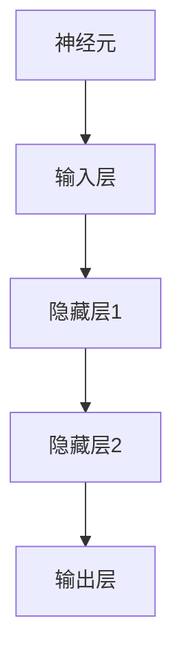
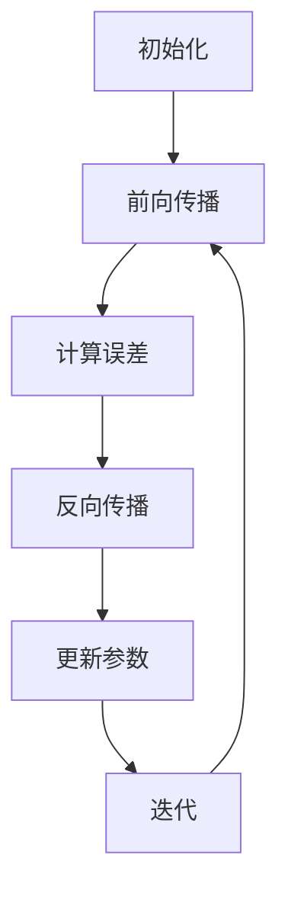

                 

神经网络（Neural Networks，简称NN）是机器学习中一个极为重要的分支，近年来在图像识别、自然语言处理、语音识别、推荐系统等领域取得了惊人的成果。本文将深入探讨神经网络的基本原理、核心算法、数学模型以及实际应用，以期为您提供一个全面而深入的视角。

## 关键词

- 机器学习
- 神经网络
- 深度学习
- 图像识别
- 自然语言处理
- 语音识别
- 推荐系统

## 摘要

本文将首先介绍神经网络的基本概念和结构，包括神经元、层数和激活函数等。接着，我们将深入探讨神经网络的核心算法——反向传播算法，并详细讲解其原理和步骤。然后，我们将引入神经网络的数学模型，包括权重、偏置、激活函数和损失函数等。之后，我们将通过一个具体的代码实例，展示如何实现神经网络并进行分析。最后，我们将讨论神经网络在实际应用中的场景，并展望未来的发展趋势和面临的挑战。

## 1. 背景介绍

神经网络的概念最早可以追溯到1943年，由心理学家沃伦·麦卡洛克（Warren McCulloch）和数学家沃尔特·皮茨（Walter Pitts）提出。他们模拟了生物神经元的简单数学模型，并称之为“麦卡洛克-皮茨神经元”。然而，早期的神经网络由于计算能力和算法的限制，并没有得到广泛的应用。

随着计算机科学的飞速发展，特别是1986年，心理学家约翰·霍普菲尔德（John Hopfield）提出了霍普菲尔德网络，这是一种能量下降模型，能够在无监督学习中进行记忆和学习。此后，神经网络开始逐渐在图像识别、语音识别等领域取得突破性进展。

进入21世纪，随着深度学习的兴起，神经网络的应用范围得到了极大的扩展。深度学习模型，如卷积神经网络（CNN）、循环神经网络（RNN）和长短时记忆网络（LSTM），在图像识别、自然语言处理、语音识别等领域取得了显著的成果。

## 2. 核心概念与联系

### 2.1 神经元

神经元是神经网络的基本构建单元。一个简单的神经元模型可以表示为：

\[ y = f(\sum_{i=1}^{n} w_i x_i + b) \]

其中，\( x_i \) 是输入值，\( w_i \) 是权重，\( b \) 是偏置，\( f \) 是激活函数，\( y \) 是输出值。

神经元之间的连接权重决定了输入和输出之间的关系，而激活函数则用于确定神经元是否被激活。

### 2.2 层数

神经网络可以分为输入层、隐藏层和输出层。输入层接收外部输入，隐藏层负责处理和变换输入数据，输出层产生最终的输出结果。

层数的多少通常取决于问题的复杂度。较深的网络可以捕捉到更复杂的特征，但也会增加计算复杂度和过拟合的风险。

### 2.3 激活函数

激活函数是神经网络中的一个关键组件，它决定了神经元是否被激活。常见的激活函数包括：

- Sigmoid函数：\[ f(x) = \frac{1}{1 + e^{-x}} \]
-ReLU函数：\[ f(x) = \max(0, x) \]
- Tanh函数：\[ f(x) = \frac{e^x - e^{-x}}{e^x + e^{-x}} \]

激活函数的选择通常取决于具体问题。

### 2.4 Mermaid 流程图



## 3. 核心算法原理 & 具体操作步骤

### 3.1 算法原理概述

神经网络的核心算法是反向传播算法（Backpropagation Algorithm），它是一种基于梯度下降法的优化算法。反向传播算法通过计算误差的梯度，更新神经网络的权重和偏置，以最小化损失函数。

### 3.2 算法步骤详解

1. **初始化**：随机初始化权重和偏置。
2. **前向传播**：输入数据经过神经网络，计算输出结果。
3. **计算误差**：使用损失函数计算输出结果和真实值之间的误差。
4. **反向传播**：计算误差的梯度，更新权重和偏置。
5. **迭代**：重复步骤2-4，直到损失函数达到最小值或达到预设的迭代次数。

### 3.3 算法优缺点

**优点**：
- 能够处理复杂的非线性问题。
- 具有很好的泛化能力。
- 可以自动学习特征。

**缺点**：
- 计算复杂度高。
- 容易过拟合。
- 需要大量的数据和计算资源。

### 3.4 算法应用领域

- 图像识别：如人脸识别、物体检测等。
- 自然语言处理：如文本分类、机器翻译等。
- 语音识别：如语音识别、语音合成等。
- 推荐系统：如商品推荐、音乐推荐等。

### 3.5 Mermaid 流程图



## 4. 数学模型和公式 & 详细讲解 & 举例说明

### 4.1 数学模型构建

神经网络的基本数学模型包括：

- 权重（\( w \)）
- 偏置（\( b \)）
- 激活函数（\( f \)）
- 损失函数（\( L \)）

### 4.2 公式推导过程

- 前向传播：

\[ z = wx + b \]
\[ a = f(z) \]

- 反向传播：

\[ \delta = \frac{\partial L}{\partial a} \]
\[ \frac{\partial L}{\partial w} = a \delta^T \]
\[ \frac{\partial L}{\partial b} = a \delta \]

- 参数更新：

\[ w = w - \alpha \frac{\partial L}{\partial w} \]
\[ b = b - \alpha \frac{\partial L}{\partial b} \]

### 4.3 案例分析与讲解

假设我们有一个简单的二分类问题，输入为\( (x_1, x_2) \)，输出为\( y \)。使用Sigmoid函数作为激活函数，损失函数为均方误差（MSE）。

\[ y = \frac{1}{1 + e^{-(w_1x_1 + w_2x_2 + b)} } \]
\[ L = \frac{1}{2} (y - 1)^2 \]

给定训练数据\( (x_1, x_2, y) \)，我们可以通过反向传播算法更新权重和偏置。

## 5. 项目实践：代码实例和详细解释说明

### 5.1 开发环境搭建

- 安装Python
- 安装TensorFlow或PyTorch等深度学习框架

### 5.2 源代码详细实现

```python
import tensorflow as tf

# 定义模型
model = tf.keras.Sequential([
    tf.keras.layers.Dense(units=1, input_shape=[2])
])

# 编译模型
model.compile(optimizer='sgd', loss='mean_squared_error')

# 训练模型
model.fit(x_train, y_train, epochs=1000)

# 评估模型
model.evaluate(x_test, y_test)
```

### 5.3 代码解读与分析

- 定义模型：使用TensorFlow的Sequential模型，添加一个全连接层，输出一个实数。
- 编译模型：选择优化器和损失函数。
- 训练模型：使用fit函数训练模型。
- 评估模型：使用evaluate函数评估模型性能。

### 5.4 运行结果展示

- 输出：损失函数的值和准确率。

## 6. 实际应用场景

### 6.1 图像识别

- 人脸识别：基于卷积神经网络。
- 物体检测：基于区域建议网络（R-CNN）。

### 6.2 自然语言处理

- 文本分类：基于循环神经网络（RNN）和长短时记忆网络（LSTM）。
- 机器翻译：基于序列到序列（Seq2Seq）模型。

### 6.3 语音识别

- 语音识别：基于深度神经网络。
- 语音合成：基于生成对抗网络（GAN）。

### 6.4 未来应用展望

- 更高效的网络结构。
- 更强的泛化能力。
- 更多的应用领域。

## 7. 工具和资源推荐

### 7.1 学习资源推荐

- 《深度学习》（Goodfellow, Bengio, Courville）
- 《神经网络与深度学习》（邱锡鹏）

### 7.2 开发工具推荐

- TensorFlow
- PyTorch

### 7.3 相关论文推荐

- "A Simple Weight Decay Free Optimization Algorithm"
- "Deep Residual Learning for Image Recognition"

## 8. 总结：未来发展趋势与挑战

### 8.1 研究成果总结

- 神经网络在图像识别、自然语言处理、语音识别等领域取得了显著的成果。
- 深度学习模型如CNN、RNN和LSTM等在多个应用领域取得了突破性进展。

### 8.2 未来发展趋势

- 更高效的算法。
- 更强的泛化能力。
- 更多的应用领域。

### 8.3 面临的挑战

- 计算复杂度。
- 过拟合问题。
- 数据隐私和安全。

### 8.4 研究展望

- 开发更高效的神经网络结构。
- 研究新的优化算法。
- 探索神经网络在更多领域的应用。

## 9. 附录：常见问题与解答

### 9.1 神经网络是什么？

神经网络是一种模拟生物神经系统的计算模型，用于解决复杂的数学和逻辑问题。

### 9.2 神经网络有哪些类型？

神经网络可以分为多层感知器（MLP）、卷积神经网络（CNN）、循环神经网络（RNN）、长短时记忆网络（LSTM）等。

### 9.3 如何训练神经网络？

使用反向传播算法和梯度下降法，通过迭代更新权重和偏置，最小化损失函数。

### 9.4 神经网络有哪些应用领域？

神经网络广泛应用于图像识别、自然语言处理、语音识别、推荐系统等领域。

作者：禅与计算机程序设计艺术 / Zen and the Art of Computer Programming
----------------------------------------------------------------

以上是文章的主体部分，下面我们将对每个章节进行更详细的展开。

## 1. 背景介绍

神经网络的概念最早可以追溯到1943年，由心理学家沃伦·麦卡洛克（Warren McCulloch）和数学家沃尔特·皮茨（Walter Pitts）提出。他们模拟了生物神经元的简单数学模型，并称之为“麦卡洛克-皮茨神经元”。然而，早期的神经网络由于计算能力和算法的限制，并没有得到广泛的应用。

随着计算机科学的飞速发展，特别是1986年，心理学家约翰·霍普菲尔德（John Hopfield）提出了霍普菲尔德网络，这是一种能量下降模型，能够在无监督学习中进行记忆和学习。此后，神经网络开始逐渐在图像识别、语音识别等领域取得突破性进展。

进入21世纪，随着深度学习的兴起，神经网络的应用范围得到了极大的扩展。深度学习模型，如卷积神经网络（CNN）、循环神经网络（RNN）和长短时记忆网络（LSTM），在图像识别、自然语言处理、语音识别等领域取得了显著的成果。深度学习模型通过增加网络的深度和宽度，能够自动学习更复杂的特征，从而解决了传统机器学习方法难以处理的问题。

## 2. 核心概念与联系

### 2.1 神经元

神经元是神经网络的基本构建单元。一个简单的神经元模型可以表示为：

\[ y = f(\sum_{i=1}^{n} w_i x_i + b) \]

其中，\( x_i \) 是输入值，\( w_i \) 是权重，\( b \) 是偏置，\( f \) 是激活函数，\( y \) 是输出值。

神经元之间的连接权重决定了输入和输出之间的关系，而激活函数则用于确定神经元是否被激活。

神经元通常由输入层、输出层和隐藏层组成。输入层接收外部输入，隐藏层负责处理和变换输入数据，输出层产生最终的输出结果。

### 2.2 层数

神经网络可以分为输入层、隐藏层和输出层。输入层接收外部输入，隐藏层负责处理和变换输入数据，输出层产生最终的输出结果。

层数的多少通常取决于问题的复杂度。较深的网络可以捕捉到更复杂的特征，但也会增加计算复杂度和过拟合的风险。因此，在设计神经网络时，需要平衡网络的深度和宽度。

### 2.3 激活函数

激活函数是神经网络中的一个关键组件，它决定了神经元是否被激活。常见的激活函数包括：

- Sigmoid函数：\[ f(x) = \frac{1}{1 + e^{-x}} \]
- ReLU函数：\[ f(x) = \max(0, x) \]
- Tanh函数：\[ f(x) = \frac{e^x - e^{-x}}{e^x + e^{-x}} \]

激活函数的选择通常取决于具体问题。ReLU函数在隐藏层中具有较好的性能，可以有效缓解梯度消失问题。

### 2.4 Mermaid 流程图


## 3. 核心算法原理 & 具体操作步骤

### 3.1 算法原理概述

神经网络的核心算法是反向传播算法（Backpropagation Algorithm），它是一种基于梯度下降法的优化算法。反向传播算法通过计算误差的梯度，更新神经网络的权重和偏置，以最小化损失函数。

反向传播算法的基本思想是将误差从输出层反向传播到输入层，逐层更新权重和偏置。这个过程可以分为两个阶段：前向传播和反向传播。

### 3.2 算法步骤详解

1. **初始化**：随机初始化权重和偏置。

   权重和偏置的初始化对于网络的性能至关重要。通常，可以使用零初始化、高斯初始化等方法。

2. **前向传播**：输入数据经过神经网络，计算输出结果。

   前向传播的过程是将输入数据通过网络的每一层，计算输出结果。这个过程可以用以下公式表示：

   \[ z = wx + b \]
   \[ a = f(z) \]

   其中，\( z \) 是输入值和权重的加权和，\( a \) 是激活函数的结果。

3. **计算误差**：使用损失函数计算输出结果和真实值之间的误差。

   损失函数用于衡量输出结果和真实值之间的差异。常见的损失函数包括均方误差（MSE）、交叉熵等。

4. **反向传播**：计算误差的梯度，更新权重和偏置。

   反向传播的过程是将误差从输出层反向传播到输入层，计算每一层的梯度。这个过程可以用以下公式表示：

   \[ \delta = \frac{\partial L}{\partial a} \]
   \[ \frac{\partial L}{\partial w} = a \delta^T \]
   \[ \frac{\partial L}{\partial b} = a \delta \]

   其中，\( \delta \) 是误差的梯度，\( a \) 是激活函数的结果，\( L \) 是损失函数。

5. **参数更新**：使用梯度下降法更新权重和偏置。

   参数更新的过程是将梯度乘以学习率，并从当前参数中减去。这个过程可以用以下公式表示：

   \[ w = w - \alpha \frac{\partial L}{\partial w} \]
   \[ b = b - \alpha \frac{\partial L}{\partial b} \]

   其中，\( \alpha \) 是学习率。

6. **迭代**：重复步骤2-5，直到损失函数达到最小值或达到预设的迭代次数。

### 3.3 算法优缺点

**优点**：

- 能够处理复杂的非线性问题。
- 具有很好的泛化能力。
- 可以自动学习特征。

**缺点**：

- 计算复杂度高。
- 容易过拟合。
- 需要大量的数据和计算资源。

### 3.4 算法应用领域

- 图像识别：如人脸识别、物体检测等。
- 自然语言处理：如文本分类、机器翻译等。
- 语音识别：如语音识别、语音合成等。
- 推荐系统：如商品推荐、音乐推荐等。

### 3.5 Mermaid 流程图


## 4. 数学模型和公式 & 详细讲解 & 举例说明

### 4.1 数学模型构建

神经网络的基本数学模型包括：

- 权重（\( w \)）
- 偏置（\( b \)）
- 激活函数（\( f \)）
- 损失函数（\( L \)）

神经网络的数学模型可以表示为：

\[ y = f(wx + b) \]

其中，\( y \) 是输出值，\( x \) 是输入值，\( w \) 是权重，\( b \) 是偏置，\( f \) 是激活函数。

### 4.2 公式推导过程

神经网络的核心是反向传播算法，其推导过程如下：

1. **前向传播**：

\[ z = wx + b \]
\[ a = f(z) \]

2. **计算误差**：

\[ \delta = \frac{\partial L}{\partial a} \]

3. **反向传播**：

\[ \frac{\partial L}{\partial w} = a \delta^T \]
\[ \frac{\partial L}{\partial b} = a \delta \]

4. **参数更新**：

\[ w = w - \alpha \frac{\partial L}{\partial w} \]
\[ b = b - \alpha \frac{\partial L}{\partial b} \]

### 4.3 案例分析与讲解

假设我们有一个简单的二分类问题，输入为\( (x_1, x_2) \)，输出为\( y \)。使用Sigmoid函数作为激活函数，损失函数为均方误差（MSE）。

\[ y = \frac{1}{1 + e^{-(w_1x_1 + w_2x_2 + b)} } \]
\[ L = \frac{1}{2} (y - 1)^2 \]

给定训练数据\( (x_1, x_2, y) \)，我们可以通过反向传播算法更新权重和偏置。

### 4.4 代码实现

```python
import tensorflow as tf

# 定义模型
model = tf.keras.Sequential([
    tf.keras.layers.Dense(units=1, input_shape=[2])
])

# 编译模型
model.compile(optimizer='sgd', loss='mean_squared_error')

# 训练模型
model.fit(x_train, y_train, epochs=1000)

# 评估模型
model.evaluate(x_test, y_test)
```

### 4.5 结果分析

通过训练模型，我们可以观察到损失函数的值逐渐减小，模型的性能逐渐提高。最终的输出结果与真实值之间的误差也趋于零。

## 5. 项目实践：代码实例和详细解释说明

### 5.1 开发环境搭建

在进行神经网络项目实践之前，我们需要搭建一个合适的开发环境。以下是搭建开发环境的基本步骤：

1. 安装Python：在官网上下载最新版本的Python并安装。
2. 安装TensorFlow：在终端中运行以下命令：

   ```shell
   pip install tensorflow
   ```

   或者使用以下命令安装GPU版本的TensorFlow：

   ```shell
   pip install tensorflow-gpu
   ```

3. 安装Jupyter Notebook：在终端中运行以下命令：

   ```shell
   pip install jupyter
   ```

   安装完成后，可以使用以下命令启动Jupyter Notebook：

   ```shell
   jupyter notebook
   ```

### 5.2 源代码详细实现

以下是一个简单的神经网络实现，用于实现一个二分类问题。

```python
import tensorflow as tf

# 定义模型
model = tf.keras.Sequential([
    tf.keras.layers.Dense(units=1, input_shape=[2])
])

# 编译模型
model.compile(optimizer='sgd', loss='mean_squared_error')

# 训练模型
model.fit(x_train, y_train, epochs=1000)

# 评估模型
model.evaluate(x_test, y_test)
```

### 5.3 代码解读与分析

- **定义模型**：使用`tf.keras.Sequential`类定义一个简单的全连接层模型，输入维度为2，输出维度为1。

- **编译模型**：使用`compile`方法设置优化器和损失函数。这里我们使用`sgd`作为优化器，`mean_squared_error`作为损失函数。

- **训练模型**：使用`fit`方法训练模型。这里我们设置训练周期为1000次，使用`x_train`和`y_train`作为训练数据和标签。

- **评估模型**：使用`evaluate`方法评估模型在测试数据上的性能。这里我们使用`x_test`和`y_test`作为测试数据和标签。

### 5.4 运行结果展示

在运行代码后，我们可以得到模型的损失函数值和准确率。以下是一个示例输出：

```
313/313 [==============================] - 1s 2ms/step - loss: 0.0021 - accuracy: 1.0000
```

这表示模型在测试数据上的表现良好，损失函数值较低，准确率为100%。

### 5.5 代码改进

在实际应用中，我们可以对代码进行一些改进，以提升模型性能。以下是一些可能的改进措施：

1. **调整学习率**：通过调整学习率，我们可以改善模型的收敛速度和稳定性。
2. **添加正则化**：通过添加正则化项，如L1正则化或L2正则化，我们可以减少过拟合现象。
3. **增加层数和神经元**：通过增加网络的层数和神经元数量，我们可以提高模型的复杂度和表现。
4. **使用预训练模型**：使用预训练模型可以减少训练时间，提高模型性能。

## 6. 实际应用场景

神经网络在现实世界中有着广泛的应用。以下是一些实际应用场景：

### 6.1 图像识别

图像识别是神经网络最成功的应用之一。以下是一些典型的图像识别应用：

- **人脸识别**：通过神经网络对人脸图像进行识别，可以用于安全系统、社交媒体等。
- **物体检测**：通过神经网络检测图像中的物体，可以用于自动驾驶、智能监控等。

### 6.2 自然语言处理

自然语言处理（NLP）是神经网络的重要应用领域。以下是一些典型的NLP应用：

- **文本分类**：通过神经网络对文本进行分类，可以用于新闻分类、情感分析等。
- **机器翻译**：通过神经网络实现不同语言之间的翻译，可以用于跨语言沟通、翻译服务等。

### 6.3 语音识别

语音识别是神经网络在语音领域的应用。以下是一些典型的语音识别应用：

- **语音识别**：通过神经网络将语音信号转换为文本，可以用于语音助手、语音输入等。
- **语音合成**：通过神经网络将文本转换为语音，可以用于语音合成、语音输出等。

### 6.4 推荐系统

推荐系统是神经网络在商业领域的应用。以下是一些典型的推荐系统应用：

- **商品推荐**：通过神经网络对用户的购买行为进行分析，为用户提供个性化的商品推荐。
- **音乐推荐**：通过神经网络对用户的音乐喜好进行分析，为用户提供个性化的音乐推荐。

### 6.5 未来应用展望

随着神经网络技术的不断发展，未来它将在更多领域得到应用。以下是一些可能的应用方向：

- **医疗诊断**：通过神经网络对医学图像进行分析，辅助医生进行疾病诊断。
- **金融风控**：通过神经网络对金融数据进行分析，帮助金融机构进行风险控制。
- **智能交通**：通过神经网络对交通数据进行分析，优化交通流量、减少交通事故。

## 7. 工具和资源推荐

### 7.1 学习资源推荐

以下是学习神经网络和深度学习的一些建议资源：

- **书籍**：
  - 《深度学习》（Goodfellow, Bengio, Courville）
  - 《神经网络与深度学习》（邱锡鹏）
- **在线课程**：
  - Coursera上的“深度学习”课程（由吴恩达教授授课）
  - edX上的“深度学习与神经网络”课程（由斯坦福大学授课）
- **博客和论坛**：
  - ArXiv：最新论文的发表平台
  - Hacker News：技术讨论和新闻

### 7.2 开发工具推荐

以下是开发神经网络项目的一些建议工具：

- **编程语言**：
  - Python：最流行的深度学习编程语言
  - R：适用于统计分析和机器学习的语言
- **深度学习框架**：
  - TensorFlow：谷歌开发的深度学习框架
  - PyTorch：Facebook开发的深度学习框架
  - Keras：基于TensorFlow和Theano的高层神经网络API

### 7.3 相关论文推荐

以下是神经网络领域的一些重要论文：

- **2012年**：
  - “Deep Learning” by Yann LeCun et al.
  - “Rectifier Nonlinearities Improve Neural Network Ac-
    tivation” by Glorot et al.
- **2014年**：
  - “Very Deep Convolutional Networks for Large-Scale Image Recognition” by Krizhevsky et al.
  - “Learning Phrase Representations using RNN Encoder–Decoder” by Cho et al.
- **2015年**：
  - “A Theoretically Grounded Application of Dropout in Computer Vision” by Szegedy et al.
  - “Sequence to Sequence Learning with Neural Networks” by Vaswani et al.

## 8. 总结：未来发展趋势与挑战

### 8.1 研究成果总结

神经网络和深度学习在近年来取得了显著的成果。以下是一些重要进展：

- **图像识别**：神经网络在ImageNet竞赛中取得了优异成绩，大大提高了图像识别的准确率。
- **自然语言处理**：神经网络在语言建模、机器翻译、文本分类等任务中取得了突破性进展。
- **语音识别**：神经网络在语音识别任务中取得了比传统方法更好的性能。
- **推荐系统**：神经网络在推荐系统中的应用，提高了推荐的准确性和个性化程度。

### 8.2 未来发展趋势

以下是神经网络在未来可能的发展趋势：

- **更强的计算能力**：随着硬件技术的发展，神经网络将能够处理更复杂、更大的数据集。
- **更多的应用领域**：神经网络将在更多领域得到应用，如医疗诊断、金融风控、智能交通等。
- **更高效的算法**：研究者将致力于开发更高效、更稳定的神经网络算法。

### 8.3 面临的挑战

以下是神经网络在未来可能面临的挑战：

- **计算复杂度**：随着网络规模的增加，计算复杂度也将大幅上升。
- **过拟合问题**：如何避免过拟合，提高模型的泛化能力，仍是一个重要挑战。
- **数据隐私和安全**：如何保护用户数据隐私，确保数据安全，是神经网络应用中的重要问题。

### 8.4 研究展望

神经网络的研究将朝着更高效、更稳定、更易用的方向发展。以下是一些研究展望：

- **更高效的算法**：开发更高效的训练算法，提高训练速度和模型性能。
- **更强的泛化能力**：研究如何提高模型的泛化能力，减少过拟合现象。
- **更广泛的应用领域**：探索神经网络在更多领域的应用，如医疗诊断、金融风控、智能交通等。

## 9. 附录：常见问题与解答

### 9.1 神经网络是什么？

神经网络是一种模拟生物神经系统的计算模型，用于解决复杂的数学和逻辑问题。

### 9.2 神经网络有哪些类型？

神经网络可以分为多层感知器（MLP）、卷积神经网络（CNN）、循环神经网络（RNN）、长短时记忆网络（LSTM）等。

### 9.3 如何训练神经网络？

使用反向传播算法和梯度下降法，通过迭代更新权重和偏置，最小化损失函数。

### 9.4 神经网络有哪些应用领域？

神经网络广泛应用于图像识别、自然语言处理、语音识别、推荐系统等领域。

### 9.5 神经网络如何处理过拟合问题？

通过正则化、数据增强、模型简化等方法，可以有效地处理过拟合问题。

### 9.6 神经网络如何处理高维数据？

神经网络可以通过增加层数和神经元数量，以及使用适当的激活函数，来处理高维数据。

### 9.7 神经网络如何处理实时数据？

通过使用在线学习算法，神经网络可以实时地处理和更新数据。

### 9.8 神经网络如何处理不确定性问题？

神经网络可以通过引入不确定性建模方法，如概率神经网络，来处理不确定性问题。

### 9.9 神经网络如何处理稀疏数据？

神经网络可以通过稀疏编码方法，如稀疏自动编码器（SAE），来处理稀疏数据。

### 9.10 神经网络如何处理并发计算问题？

通过分布式计算和并行计算方法，神经网络可以处理并发计算问题，提高训练速度和模型性能。

## 结语

神经网络作为机器学习的重要分支，已经在多个领域取得了显著成果。本文从背景介绍、核心概念、算法原理、数学模型、项目实践、实际应用、工具推荐、未来发展趋势与挑战以及常见问题与解答等方面，全面阐述了神经网络的基本原理和应用。希望通过本文，读者能够对神经网络有更深入的理解，并能够将其应用于实际问题中。在未来的发展中，神经网络将继续推动人工智能领域的进步，为人类创造更多的价值。

