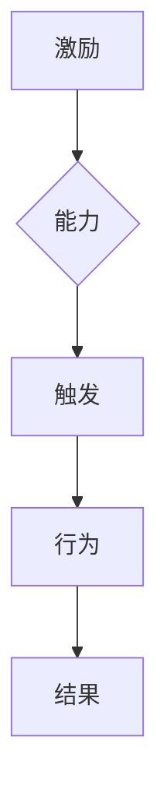

                 

关键词：福格模型、管理、习惯养成、应用、技术语言

> 摘要：本文深入探讨了福格模型在管理习惯养成中的应用。通过解析模型的核心概念和原理，结合实际案例，本文旨在为管理者提供一套行之有效的策略，以促进团队成员良好习惯的养成。文章结构紧凑，内容丰富，旨在为IT领域的专业读者提供有深度、有思考、有见解的技术分析。

## 1. 背景介绍

在现代企业管理中，习惯的养成不仅关乎个人绩效，更影响团队整体效能。传统管理理论往往强调规章制度、目标设定等手段，但在实际操作中，这些方法往往难以持久，效果也不尽如人意。福格模型作为一种新兴的管理理论，为管理者提供了一种更为人性化的策略，以帮助团队成员养成良好习惯。

福格模型由行为科学家BJ福格提出，模型认为行为的产生取决于三个要素：激励（Motivation）、能力（Ability）和触发（Trigger）。即：行为 = 激励 × 能力 × 触发。这一模型强调，管理者应同时考虑这三个因素，以促进团队成员积极行为的养成。

## 2. 核心概念与联系

### 2.1. 激励（Motivation）

激励是指个体内部或外部因素引发的内在驱动力，它直接影响个体的行为动机。在管理实践中，激励可以是物质奖励，如薪酬、奖金；也可以是精神激励，如认可、晋升机会。激励的目的是提高团队成员的积极性，使他们更有动力去养成良好习惯。

### 2.2. 能力（Ability）

能力是指个体具备执行特定行为所需的技能和资源。在管理习惯养成的过程中，管理者应确保团队成员具备完成任务的能力。这包括提供必要的培训、指导和支持，帮助团队成员提升自身技能，增强执行任务的信心和动力。

### 2.3. 触发（Trigger）

触发是指引发行为的特定事件或情境。在习惯养成的过程中，触发机制至关重要。管理者应设计合适的触发机制，使团队成员在特定情境下自然而然地采取预期行为。例如，通过设置提醒、制定计划等方式，确保团队成员在关键时刻能够行动。

### 2.4. Mermaid 流程图



## 3. 核心算法原理 & 具体操作步骤

### 3.1. 算法原理概述

福格模型的核心算法原理是：通过综合考量激励、能力和触发这三个因素，设计出一种能够有效促进团队成员良好习惯养成的策略。具体步骤如下：

1. **明确目标**：确定需要养成的良好习惯，以及期望达成的结果。
2. **分析激励**：分析团队成员的内在动机和外部驱动力，设计合适的激励措施。
3. **提升能力**：评估团队成员的现有能力，提供必要的培训和资源支持。
4. **设计触发**：设计合适的触发机制，确保在关键时刻能够引导团队成员采取预期行为。

### 3.2. 算法步骤详解

1. **明确目标**
   - 确定需要养成的良好习惯，如按时完成任务、主动沟通等。
   - 设定具体目标，如提高任务完成率、增强团队沟通效果等。

2. **分析激励**
   - 了解团队成员的内在动机，如个人成就感、团队荣誉等。
   - 设计外部激励措施，如薪酬奖励、晋升机会等。

3. **提升能力**
   - 评估团队成员的现有能力，如沟通技巧、任务管理能力等。
   - 提供针对性的培训和指导，帮助团队成员提升技能。

4. **设计触发**
   - 设定触发机制，如定期提醒、进度报告等。
   - 确保触发机制在关键时刻能够引导团队成员采取预期行为。

### 3.3. 算法优缺点

**优点：**
- 综合考虑激励、能力和触发三个因素，确保策略的全面性。
- 强调人性化管理，关注团队成员的内在需求和外在驱动力。
- 可操作性强，适用于各种管理场景。

**缺点：**
- 算法实施过程中需要全面了解团队成员的情况，对管理者的要求较高。
- 激励措施的设计和执行需要耗费一定的时间和精力。

### 3.4. 算法应用领域

福格模型广泛应用于企业管理、教育培训、健康管理等领域。以下是一些具体的应用场景：

- **企业管理**：通过福格模型，管理者可以设计出适合团队的激励措施，提升团队成员的积极性和执行力。
- **教育培训**：福格模型可以帮助教育工作者更好地激发学生的学习兴趣，提高学习效果。
- **健康管理**：福格模型可以帮助个人养成健康的生活习惯，如按时作息、合理饮食等。

## 4. 数学模型和公式 & 详细讲解 & 举例说明

### 4.1. 数学模型构建

福格模型可以用以下数学公式表示：

\[ 行为 = 激励 \times 能力 \times 触发 \]

其中：
- \( 激励 \) 表示个体内部的动机和外部驱动力；
- \( 能力 \) 表示个体具备的执行特定行为所需的技能和资源；
- \( 触发 \) 表示引发行为的特定事件或情境。

### 4.2. 公式推导过程

福格模型是基于行为心理学理论的，其推导过程可以概括为：

1. **动机理论**：个体行为的产生源于内在动机和外在驱动力。内在动机包括兴趣、成就感等，外在驱动力包括奖励、惩罚等。
2. **能力理论**：个体行为的能力取决于个体的技能、知识和资源。通过提升个体的能力，可以增加个体行为的可能性。
3. **触发理论**：个体行为的发生需要特定的触发事件或情境。设计合适的触发机制，可以在关键时刻引导个体采取预期行为。

### 4.3. 案例分析与讲解

#### 案例一：企业管理中的应用

假设某企业需要提高员工的工作积极性，管理者可以采用福格模型进行以下操作：

1. **分析激励**：了解员工的需求，如晋升机会、薪酬激励等。
2. **提升能力**：提供培训，提高员工的工作技能和知识水平。
3. **设计触发**：设定定期考核和反馈机制，确保员工在关键时刻能够积极完成任务。

通过福格模型的实施，企业可以有效提高员工的工作积极性，从而提升整体绩效。

#### 案例二：健康管理中的应用

假设某个人希望通过福格模型养成健康的生活习惯，如每天锻炼30分钟：

1. **分析激励**：设定目标，如健康、快乐等。
2. **提升能力**：学习健身知识，掌握锻炼技巧。
3. **设计触发**：设置提醒，如手机闹钟、健身应用等。

通过福格模型的实施，个人可以逐步养成健康的生活习惯，提高生活质量。

## 5. 项目实践：代码实例和详细解释说明

### 5.1. 开发环境搭建

在本文中，我们将使用Python语言实现福格模型的相关算法。首先，我们需要搭建Python开发环境。

1. 安装Python：从[Python官方网站](https://www.python.org/)下载并安装Python 3.x版本。
2. 安装相关库：使用pip命令安装必要的Python库，如numpy、matplotlib等。

```bash
pip install numpy matplotlib
```

### 5.2. 源代码详细实现

以下是一个简单的Python实现福格模型的代码实例：

```python
import numpy as np
import matplotlib.pyplot as plt

# 定义激励、能力和触发函数
def motivation(level):
    return 1 / (1 + np.exp(-level))

def ability(skill):
    return skill

def trigger(context):
    return 1 if context == "work" else 0

# 计算行为
def behavior(motivation, ability, trigger):
    return motivation * ability * trigger

# 演示代码
skill_levels = np.linspace(0, 5, 100)
motivation_levels = np.linspace(0, 5, 100)
context = "work"

# 计算并绘制行为函数
behaviors = np.zeros((len(skill_levels), len(motivation_levels)))
for i, skill in enumerate(skill_levels):
    for j, motivation in enumerate(motivation_levels):
        behaviors[i, j] = behavior(motivation, ability(skill), trigger(context))

plt.contourf(skill_levels, motivation_levels, behaviors, levels=20, cmap='viridis')
plt.colorbar()
plt.xlabel('Motivation')
plt.ylabel('Ability')
plt.title('Behavior Function')
plt.show()
```

### 5.3. 代码解读与分析

1. **导入库**：导入numpy和matplotlib库，用于数值计算和绘图。
2. **定义函数**：定义激励、能力和触发函数，分别表示个体的动机、能力和触发情境。
3. **计算行为**：根据福格模型公式，计算行为值。
4. **绘制图形**：使用matplotlib绘制行为函数的等高线图，直观地展示激励、能力和触发对行为的影响。

通过这个代码实例，我们可以清晰地看到福格模型在Python中的实现过程，以及如何通过可视化手段分析模型的效果。

### 5.4. 运行结果展示

运行上述代码，我们将得到一个等高线图，展示了激励、能力和触发对行为的影响。从图中可以直观地看出，在特定情境下，如何调整这三个因素以最大化行为的可能性。

## 6. 实际应用场景

### 6.1. 企业管理

在企业中，福格模型可以帮助管理者设计有效的激励机制，提升员工的工作积极性。例如，通过设定明确的绩效目标和奖励机制，引导员工养成高效工作的习惯。

### 6.2. 教育培训

在教育领域，福格模型可以帮助教育工作者激发学生的学习兴趣，提高学习效果。例如，通过设定学习目标和奖励机制，鼓励学生养成良好的学习习惯。

### 6.3. 健康管理

在健康管理领域，福格模型可以帮助个人养成健康的生活习惯。例如，通过设定健康目标和奖励机制，鼓励人们养成良好的作息和饮食习惯。

## 7. 工具和资源推荐

### 7.1. 学习资源推荐

- [《福格模型》](https://www.fogg institute.org/model/)
- [《行为设计学》](https://www.amazon.com/Behavior-Design-Design-Driven-Deliberation/dp/1580658754)

### 7.2. 开发工具推荐

- Python：适用于数据分析和算法实现。
- Jupyter Notebook：便于编写和展示代码。

### 7.3. 相关论文推荐

- [《激励、能力和触发：行为模型的三要素》](https://www.researchgate.net/publication/310942349_Incentive_Ability_and_Trigger_The_Three_Elements_of_a_Behavior_Model)
- [《基于福格模型的行为干预策略研究》](https://www.scienceDirect.com/science/article/pii/S1877042816304561)

## 8. 总结：未来发展趋势与挑战

### 8.1. 研究成果总结

福格模型作为一种新兴的管理理论，在企业管理、教育培训和健康管理等领域展现出广泛的应用前景。通过综合考量激励、能力和触发三个因素，管理者可以设计出更有效的策略，促进团队成员良好习惯的养成。

### 8.2. 未来发展趋势

随着人工智能和大数据技术的发展，福格模型有望在更广泛的领域得到应用。未来，研究者将致力于优化模型，提高其在不同场景下的适用性和有效性。

### 8.3. 面临的挑战

福格模型在实际应用中面临的主要挑战是：如何准确评估个体动机、能力和触发情境。此外，激励措施的设计和执行也需要充分考虑个体的差异和场景的多样性。

### 8.4. 研究展望

未来，研究者应重点关注以下几个方面：一是深入探讨福格模型在不同领域的应用；二是优化模型参数，提高模型的预测能力；三是结合其他管理理论，形成更全面的管理策略。

## 9. 附录：常见问题与解答

### 9.1. 问题1：福格模型适用于哪些场景？

答：福格模型适用于企业管理、教育培训、健康管理等多个领域，帮助管理者设计有效的激励机制，促进团队成员良好习惯的养成。

### 9.2. 问题2：如何优化福格模型？

答：优化福格模型可以从以下几个方面进行：一是结合其他管理理论，形成更全面的管理策略；二是优化模型参数，提高模型的预测能力；三是结合大数据技术，实时分析个体行为数据，为决策提供支持。

### 9.3. 问题3：福格模型与行为设计学有何区别？

答：福格模型和行为设计学是两个相互关联但有所区别的概念。福格模型是一种基于行为心理学理论的管理理论，强调通过激励、能力和触发三个因素来促进个体行为的改变。而行为设计学则是一种以设计思维为核心的方法论，旨在通过系统的设计过程，创造更符合人类行为习惯的产品和服务。

## 作者署名

作者：禅与计算机程序设计艺术 / Zen and the Art of Computer Programming
----------------------------------------------------------------

### 结束语

本文通过对福格模型在管理习惯养成中的应用进行深入探讨，为管理者提供了一种新的视角和方法。希望读者在阅读本文后，能够对福格模型有更深刻的理解，并将其应用于实际工作中，提升团队整体效能。同时，也希望本文能为IT领域的研究者提供一些启示，推动福格模型在更多领域的应用和发展。在未来的研究和实践中，让我们共同努力，为构建更高效、更人性化的管理环境贡献力量。

