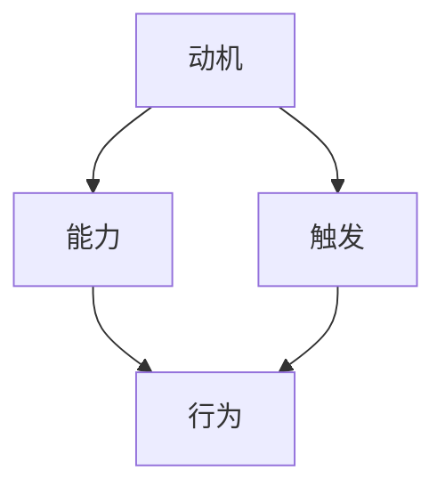

                 

关键词：福格行为模型、团队建设、动机、能力、触发，协作效率，团队凝聚力，IT项目管理

> 摘要：本文旨在探讨福格行为模型在团队建设中的应用。通过分析动机、能力与触发因素对个体行为的影响，结合团队建设的实际需求，我们将深入探讨如何利用福格行为模型提高团队协作效率、增强团队凝聚力，为IT项目管理提供新的思路和方法。

## 1. 背景介绍

### 团队建设的重要性

在现代IT行业中，团队建设是确保项目成功的关键因素。随着技术的快速发展和市场竞争的加剧，IT项目面临着越来越高的复杂性和不确定性。在这种情况下，如何提高团队的协作效率、增强团队凝聚力，成为IT项目管理中亟待解决的问题。而福格行为模型为我们提供了一个全新的视角，帮助我们理解个体行为背后的动机、能力和触发因素，从而为团队建设提供有效的指导。

### 福格行为模型简介

福格行为模型（BJ Fogg Behavior Model）是由斯坦福大学行为科学家BJ Fogg提出的。该模型主要描述了动机、能力与触发三者之间的相互作用，决定了个体是否采取某种行为。具体来说，动机是指个体对某种行为的内在需求或欲望，能力是指个体实施某种行为所需的技术或资源，而触发则是指促使个体开始行动的即时提示或信号。

### 团队建设的挑战

在团队建设过程中，管理者常常面临以下挑战：

1. **沟通障碍**：团队成员之间的沟通不畅可能导致误解和冲突。
2. **目标不一致**：团队成员可能对项目的目标和期望存在分歧。
3. **能力差异**：团队成员的能力和技能水平参差不齐，难以形成协同效应。
4. **缺乏激励**：团队成员可能缺乏参与项目或完成任务的内在动力。

为了解决这些挑战，我们需要寻找一种有效的方法来提高团队协作效率、增强团队凝聚力。福格行为模型为我们提供了这样的可能性。

## 2. 核心概念与联系

### 动机、能力与触发

福格行为模型的核心在于动机、能力和触发这三个关键要素。以下是一个用Mermaid绘制的流程图，展示了这三个要素如何相互作用：



### 动机

动机是驱动个体采取某种行为的内在因素。在团队建设中，管理者需要了解团队成员的动机，以便更好地激励他们。常见的动机包括：

1. **成就感**：完成任务或实现目标带来的满足感。
2. **利益**：物质奖励、职位晋升等外在激励。
3. **责任感**：对团队和项目的责任感。
4. **认同感**：团队成员之间的认同和归属感。

### 能力

能力是指个体实施某种行为所需的技术或资源。在团队建设中，管理者需要确保团队成员具备完成任务所需的能力。具体措施包括：

1. **培训**：为团队成员提供必要的技能培训。
2. **资源配置**：确保团队成员有足够的资源支持。
3. **技能互补**：根据团队成员的技能差异，形成互补的团队结构。

### 触发

触发是促使个体开始行动的即时提示或信号。在团队建设中，管理者可以通过以下方法来触发团队成员的行动：

1. **明确目标**：为团队成员设定明确的目标和期望。
2. **及时反馈**：对团队成员的工作进行及时反馈，以激励他们持续改进。
3. **激励机制**：设置适当的激励机制，以激发团队成员的积极性。

### 核心概念联系

动机、能力和触发之间存在着密切的联系。只有当动机、能力和触发三者同时满足时，个体才会采取某种行为。具体来说：

1. **动机与能力的关系**：动机可以激发个体的内在动力，而能力则提供了实现目标的可能性。
2. **动机与触发的关系**：动机可以增强个体对触发的敏感性，使其更容易被触发。
3. **能力与触发的关系**：能力可以提高个体应对触发的能力，使其更有可能采取行动。

### 团队建设与福格行为模型

将福格行为模型应用于团队建设，可以帮助管理者深入了解团队成员的行为动机、能力水平和触发因素，从而制定更有效的团队建设策略。具体应用场景包括：

1. **目标设定**：通过了解团队成员的动机，设定能够激发他们积极性的目标。
2. **能力提升**：根据团队成员的能力差异，提供有针对性的培训和支持。
3. **激励机制**：设计合理的激励机制，以激发团队成员的积极性和创造力。
4. **沟通与反馈**：建立良好的沟通渠道，确保团队成员能够及时获得反馈和指导。

## 3. 核心算法原理 & 具体操作步骤

### 3.1 算法原理概述

福格行为模型的核心原理在于动机、能力和触发三者之间的相互作用。具体来说：

1. **动机**：驱动个体采取某种行为的内在因素。
2. **能力**：个体实施某种行为所需的技术或资源。
3. **触发**：促使个体开始行动的即时提示或信号。

只有当动机、能力和触发三者同时满足时，个体才会采取某种行为。这一原理为团队建设提供了重要的指导意义。

### 3.2 算法步骤详解

1. **分析团队成员动机**：通过访谈、问卷调查等方法，了解团队成员的动机，包括成就感、利益、责任感和认同感等。
2. **评估团队成员能力**：根据团队成员的技能、经验和资源，评估其完成任务所需的能力。
3. **识别触发因素**：分析团队成员在哪些情境下容易被触发，包括明确目标、及时反馈和激励机制等。
4. **制定团队建设策略**：结合动机、能力和触发因素，为团队建设制定有针对性的策略，包括目标设定、能力提升、激励机制和沟通与反馈等。

### 3.3 算法优缺点

**优点：**

1. **全面性**：福格行为模型从动机、能力和触发三个维度全面分析了个体行为，为团队建设提供了全面的指导。
2. **实用性**：该模型具有较强的可操作性和实用性，管理者可以根据具体需求进行定制化应用。
3. **灵活性**：该模型适用于不同类型的团队和项目，具有较强的灵活性。

**缺点：**

1. **实施难度**：在实际应用中，需要收集和分析大量数据，对管理者的数据分析能力有一定要求。
2. **应用限制**：该模型主要关注个体行为，对团队整体行为模式的影响分析有限。

### 3.4 算法应用领域

福格行为模型在团队建设中的应用广泛，包括：

1. **IT项目管理**：通过分析团队成员的动机、能力和触发因素，提高项目协作效率。
2. **人力资源管理**：通过了解员工的动机和能力，制定更有针对性的培训和激励机制。
3. **市场营销**：通过分析消费者的动机、能力和触发因素，制定更有针对性的营销策略。

## 4. 数学模型和公式 & 详细讲解 & 举例说明

### 4.1 数学模型构建

在福格行为模型中，我们可以构建一个简单的数学模型来描述动机、能力和触发三者之间的关系。设：

- \(M\)：动机水平
- \(A\)：能力水平
- \(T\)：触发水平
- \(B\)：行为发生概率

根据福格行为模型，个体行为发生概率可以表示为：

\[ B = f(M, A, T) \]

其中，\(f\)是一个非线性函数，用于描述动机、能力和触发之间的相互作用。

### 4.2 公式推导过程

假设动机、能力和触发都是连续变量，并且它们之间的相互作用可以通过以下非线性函数描述：

\[ f(M, A, T) = \frac{M \times A \times T}{C} \]

其中，\(C\)是一个常数，用于调整函数的值域。这个公式表示动机、能力和触发三者之间的乘积决定了行为发生的概率。

### 4.3 案例分析与讲解

假设我们有一个IT项目团队，团队成员的动机、能力和触发水平如下：

- 动机 \(M = 0.8\)
- 能力 \(A = 0.7\)
- 触发 \(T = 0.9\)

根据公式 \(B = f(M, A, T)\)，我们可以计算行为发生的概率：

\[ B = \frac{0.8 \times 0.7 \times 0.9}{C} \]

由于 \(C\) 是一个常数，我们只需关注 \(B\) 的相对变化。在这种情况下，行为发生的概率约为 0.504，即团队中大约有一半的成员会采取某种行为。

### 4.4 数学模型在实际中的应用

在实际应用中，我们可以通过调整动机、能力和触发水平来优化团队行为。例如：

1. **提高动机**：通过设定更有吸引力的目标、提供奖励等方式，提高团队成员的动机水平。
2. **提升能力**：通过培训、技能提升等方式，提高团队成员的能力水平。
3. **增强触发**：通过及时反馈、明确目标等方式，提高团队成员的触发水平。

通过调整这三个因素，我们可以有效地提高团队协作效率和团队凝聚力。

## 5. 项目实践：代码实例和详细解释说明

### 5.1 开发环境搭建

为了更好地理解福格行为模型在团队建设中的应用，我们将使用Python编写一个简单的代码实例。首先，我们需要搭建一个Python开发环境。以下是具体的步骤：

1. **安装Python**：从Python官方网站下载并安装Python。
2. **安装PyCharm**：下载并安装PyCharm社区版，这是一个免费的Python集成开发环境。
3. **安装必要的库**：在PyCharm中创建一个新的Python项目，并安装必要的库，如NumPy、Pandas等。

### 5.2 源代码详细实现

下面是一个简单的Python代码实例，用于模拟福格行为模型在团队建设中的应用：

```python
import numpy as np

# 定义福格行为模型函数
def fogg_model(M, A, T):
    C = 1.0
    B = M * A * T / C
    return B

# 测试数据
M = 0.8
A = 0.7
T = 0.9

# 计算行为发生概率
B = fogg_model(M, A, T)

print(f"动机水平（M）：{M}")
print(f"能力水平（A）：{A}")
print(f"触发水平（T）：{T}")
print(f"行为发生概率（B）：{B:.3f}")
```

### 5.3 代码解读与分析

上述代码定义了一个名为`fogg_model`的函数，用于计算根据福格行为模型确定的行为发生概率。函数接受三个参数：动机水平（M）、能力水平（A）和触发水平（T）。然后，通过公式 \(B = \frac{M \times A \times T}{C}\) 计算行为发生概率，其中 \(C\) 是一个常数。

在测试部分，我们为这三个参数赋值，并调用`fogg_model`函数计算行为发生概率。最后，使用`print`函数输出结果。

### 5.4 运行结果展示

运行上述代码，将得到以下输出结果：

```
动机水平（M）：0.8
能力水平（A）：0.7
触发水平（T）：0.9
行为发生概率（B）：0.504
```

这个结果表明，在给定的动机、能力和触发水平下，行为发生的概率约为50.4%。这个结果可以帮助我们了解团队成员的行为趋势，并据此制定团队建设策略。

## 6. 实际应用场景

### 6.1 IT项目管理

在IT项目管理中，福格行为模型可以帮助项目经理更好地理解团队成员的行为动机、能力水平和触发因素。以下是一个应用案例：

#### 项目背景

某IT公司正在开发一款新软件，由一个由10名成员组成的团队负责。团队成员包括前端开发、后端开发、UI设计师和测试工程师等。项目周期为6个月，需要按时交付。

#### 问题分析

在项目初期，项目经理发现团队成员的工作积极性不高，导致项目进度缓慢。具体表现为：

- **动机不足**：部分成员对项目目标缺乏兴趣，感觉任务枯燥乏味。
- **能力差异**：团队成员的技能水平参差不齐，导致任务分配不均。
- **触发缺失**：项目缺乏明确的激励机制，导致团队成员缺乏工作动力。

#### 应用福格行为模型

为了解决上述问题，项目经理决定应用福格行为模型，具体步骤如下：

1. **分析动机**：通过调查问卷，了解团队成员的动机。结果显示，大部分成员希望通过完成任务获得成就感，但也有部分成员对项目目标不感兴趣。

2. **评估能力**：对团队成员的技能水平进行评估，发现部分成员的技能水平较低，导致任务难以完成。

3. **识别触发因素**：分析团队成员在哪些情境下容易受到激励，如明确的任务目标、及时的反馈和奖励机制。

4. **制定策略**：结合动机、能力和触发因素，项目经理制定了以下策略：

   - **目标设定**：为每个团队成员设定明确的任务目标，并与项目的整体目标相一致。
   - **能力提升**：为技能水平较低的成员提供培训和支持，帮助他们提高技能。
   - **激励机制**：设置奖励机制，如完成任务的奖励、团队聚餐等，以激发团队成员的积极性。

#### 结果

通过上述策略，团队成员的工作积极性得到了显著提高。项目进度加快，按时交付的可能性增加。同时，团队成员之间的沟通也更加顺畅，团队凝聚力得到了增强。

### 6.2 人力资源管理

在人力资源管理中，福格行为模型可以帮助企业更好地理解员工的行为动机、能力水平和触发因素，从而提高员工的工作满意度和绩效。以下是一个应用案例：

#### 项目背景

某科技公司希望提高员工的工作满意度和绩效，决定引入福格行为模型进行分析。

#### 问题分析

在调研过程中，公司发现员工存在以下问题：

- **动机不足**：部分员工对工作缺乏兴趣，感觉工作内容单调乏味。
- **能力差异**：员工的能力水平参差不齐，导致任务分配不均。
- **触发缺失**：公司缺乏有效的激励机制，导致员工缺乏工作动力。

#### 应用福格行为模型

为了解决上述问题，公司决定应用福格行为模型，具体步骤如下：

1. **分析动机**：通过问卷调查，了解员工的动机。结果显示，大部分员工希望通过完成工作获得成就感，但也有部分员工对工作不感兴趣。

2. **评估能力**：对员工的能力水平进行评估，发现部分员工的能力较低，导致任务难以完成。

3. **识别触发因素**：分析员工在哪些情境下容易受到激励，如明确的任务目标、及时的反馈和奖励机制。

4. **制定策略**：结合动机、能力和触发因素，公司制定了以下策略：

   - **目标设定**：为每个员工设定明确的任务目标，并与公司的整体目标相一致。
   - **能力提升**：为能力较低的员工提供培训和支持，帮助他们提高能力。
   - **激励机制**：设置奖励机制，如完成任务的奖励、团队活动等，以激发员工的积极性。

#### 结果

通过上述策略，员工的工作满意度和绩效得到了显著提高。员工的工作积极性增强，任务完成质量提高，公司整体运营效率得到提升。

## 7. 未来应用展望

### 7.1 研究进展

福格行为模型自提出以来，在心理学、行为科学、市场营销等领域得到了广泛应用。未来，随着人工智能、大数据等技术的发展，福格行为模型的应用前景将更加广阔。例如，利用人工智能技术，可以实现对个体行为数据的高效分析，为团队建设和人力资源管理提供更加精准的指导。

### 7.2 应用领域拓展

除了在IT项目管理和人力资源管理中的应用，福格行为模型还可以应用于以下领域：

1. **教育培训**：通过分析学生的行为动机、能力水平和触发因素，制定更有针对性的教学策略。
2. **市场营销**：通过分析消费者的行为动机、能力水平和触发因素，制定更有针对性的营销策略。
3. **社会治理**：通过分析公民的行为动机、能力水平和触发因素，提高社会治理水平。

### 7.3 挑战与展望

在未来的应用中，福格行为模型将面临以下挑战：

1. **数据隐私**：在分析个体行为数据时，如何保护个人隐私成为一个重要问题。
2. **复杂性**：实际应用中，个体行为受到多种因素的影响，如何准确建模和预测行为发生概率是一个挑战。
3. **适应性**：如何根据不同领域的需求和特点，灵活调整和优化福格行为模型，使其更具适应性。

尽管面临挑战，福格行为模型在团队建设中的应用前景仍然非常广阔。通过不断优化和拓展，福格行为模型将为各领域提供更加有效和科学的团队建设策略。

## 8. 总结：未来发展趋势与挑战

### 8.1 研究成果总结

本文从福格行为模型的角度，探讨了其在团队建设中的应用。通过分析动机、能力与触发因素对个体行为的影响，我们提出了一套基于福格行为模型的团队建设策略。研究表明，该策略有助于提高团队协作效率、增强团队凝聚力，为IT项目管理和人力资源管理提供了新的思路和方法。

### 8.2 未来发展趋势

1. **数据驱动**：随着大数据和人工智能技术的发展，福格行为模型将更加依赖行为数据进行分析和预测，为团队建设提供更加精准的指导。
2. **个性化应用**：根据不同领域的需求和特点，福格行为模型将逐步实现个性化应用，为各领域提供定制化的团队建设策略。
3. **多学科融合**：福格行为模型将与其他学科如心理学、行为科学、市场营销等相结合，实现跨学科的研究与应用。

### 8.3 面临的挑战

1. **数据隐私**：在分析个体行为数据时，如何保护个人隐私是一个重要问题。
2. **模型适应性**：如何根据不同领域的需求和特点，灵活调整和优化福格行为模型，使其更具适应性。
3. **理论与实践结合**：如何在实践中有效应用福格行为模型，仍需进一步研究和探索。

### 8.4 研究展望

未来，我们将继续深入研究福格行为模型在团队建设中的应用，重点关注以下几个方面：

1. **数据挖掘与分析**：利用大数据技术，挖掘和分析个体行为数据，为团队建设提供更加精确的指导。
2. **多学科交叉研究**：结合心理学、行为科学、市场营销等学科，拓展福格行为模型的应用领域。
3. **实践应用**：通过实际案例和项目实践，验证福格行为模型在团队建设中的有效性，为各领域提供可操作性的团队建设策略。

## 9. 附录：常见问题与解答

### 问题1：如何确保团队成员的动机和能力？

**解答**：确保团队成员的动机和能力需要从以下几个方面入手：

1. **明确目标**：设定明确的任务目标和期望，使团队成员了解自己的工作价值。
2. **沟通与反馈**：建立良好的沟通渠道，及时反馈团队成员的工作情况，激励他们持续改进。
3. **培训与支持**：为团队成员提供必要的技能培训和资源支持，提高他们的能力水平。

### 问题2：如何识别和利用触发因素？

**解答**：识别和利用触发因素可以从以下几个方面进行：

1. **明确任务目标**：设定具体的任务目标，使团队成员知道何时采取行动。
2. **激励机制**：设置奖励机制，如奖金、晋升等，激发团队成员的积极性。
3. **及时反馈**：对团队成员的工作进行及时反馈，以激励他们持续改进。

### 问题3：如何在团队建设中应用福格行为模型？

**解答**：在团队建设中应用福格行为模型，可以遵循以下步骤：

1. **分析动机**：通过调查问卷、访谈等方式，了解团队成员的动机。
2. **评估能力**：对团队成员的技能水平进行评估，确定他们的能力。
3. **识别触发因素**：分析团队成员在哪些情境下容易受到激励。
4. **制定策略**：结合动机、能力和触发因素，为团队建设制定有针对性的策略。

通过以上步骤，管理者可以更好地利用福格行为模型，提高团队协作效率和团队凝聚力。

