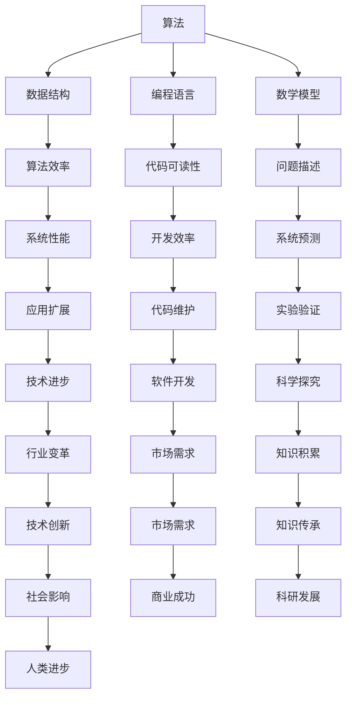

                 

 **关键词**：科学探究、计算机科学、算法、数学模型、实践应用、未来展望

**摘要**：本文旨在探讨科学探究的方法论，特别是从观察到结论的过程在计算机科学领域的应用。通过分析核心概念、算法原理、数学模型、项目实践和实际应用，本文旨在为读者提供一份全面而深入的指南，帮助他们在科研和技术开发中取得突破。

## 1. 背景介绍

科学探究是一种通过系统的观察、假设、实验和验证来理解自然世界的过程。它始于观察，通过提出假设来解释现象，然后通过实验和数据分析来验证或否定这些假设。在计算机科学领域，这一过程同样重要，因为它是技术进步和创新的核心。

计算机科学涉及算法设计、数据结构、编程语言、软件工程等多个方面。每个领域都有其独特的方法和挑战，但科学探究的方法论是普遍适用的。本文将重点讨论这一方法论在计算机科学中的应用，包括算法设计、数学模型构建、项目实践和未来展望。

### 1.1 计算机科学的发展历程

从计算机科学的起源到现代人工智能的发展，计算机科学经历了几个关键阶段：

- **计算理论和逻辑基础**：以图灵机和图灵测试为代表，奠定了计算理论的基础。
- **编程语言和算法**：从汇编语言到高级编程语言，以及各种算法的提出和应用。
- **数据结构和数据库**：数据结构的优化和数据库管理系统的发展，使得数据处理更加高效。
- **网络和分布式计算**：互联网的出现和分布式计算技术的进步，使得计算机科学的应用范围更加广泛。
- **人工智能和机器学习**：通过数据驱动的方法，人工智能和机器学习正在变革各个行业。

### 1.2 科学探究的重要性

科学探究的重要性在于它促进了我们对世界的理解和技术的创新。在计算机科学中，科学探究帮助我们：

- **发现新算法和优化现有算法**：通过系统的研究，我们可以找到更高效、更可靠的算法。
- **解决复杂问题**：科学探究的方法论可以帮助我们分解复杂问题，找到解决方案。
- **推动技术进步**：通过科学探究，我们可以将理论研究转化为实际应用，推动技术进步。

## 2. 核心概念与联系

为了更好地理解科学探究在计算机科学中的应用，我们需要探讨一些核心概念和它们之间的联系。

### 2.1 算法

算法是计算机科学的核心概念，它是一系列明确的步骤，用于解决问题或执行特定任务。算法的效率、可扩展性和正确性是评价算法的重要指标。

### 2.2 数据结构

数据结构是存储和组织数据的方式。它们直接影响算法的性能。常见的数据结构包括数组、链表、栈、队列、树和图。

### 2.3 编程语言

编程语言是用于编写算法的工具。不同的编程语言具有不同的特点和适用场景。例如，Python适用于数据分析和机器学习，而C++则适用于高性能计算。

### 2.4 数学模型

数学模型是使用数学公式和方程来描述现实世界的问题。在计算机科学中，数学模型可以帮助我们理解和预测系统的行为。

### 2.5 Mermaid 流程图

为了更好地理解这些概念之间的关系，我们可以使用Mermaid流程图来展示它们之间的联系。以下是一个简化的示例：



### 2.6 关键概念的联系

通过Mermaid流程图，我们可以看到算法、数据结构、编程语言和数学模型之间的紧密联系。这些概念相互依赖，共同构成了计算机科学的基础。

## 3. 核心算法原理 & 具体操作步骤

### 3.1 算法原理概述

算法的原理可以简单概括为：输入数据，经过一系列步骤处理后，输出结果。算法的效率取决于其执行时间和空间复杂度。

### 3.2 算法步骤详解

算法的设计通常包括以下几个步骤：

1. **问题定义**：明确要解决的问题。
2. **算法设计**：设计解决问题的步骤。
3. **算法验证**：通过测试数据验证算法的正确性和效率。
4. **算法优化**：根据测试结果优化算法。

### 3.3 算法优缺点

算法优缺点取决于其应用场景。以下是一些常见的算法及其优缺点：

- **快速排序（Quick Sort）**：优点是时间复杂度较低，缺点是需要额外的内存空间。
- **归并排序（Merge Sort）**：优点是时间复杂度和空间复杂度都较低，缺点是算法复杂。
- **冒泡排序（Bubble Sort）**：优点是简单易懂，缺点是时间复杂度较高。

### 3.4 算法应用领域

算法广泛应用于计算机科学的各个领域，如排序、搜索、图形处理、机器学习等。以下是一些典型的算法应用：

- **排序算法**：用于对数据进行排序。
- **搜索算法**：用于在数据中查找特定元素。
- **机器学习算法**：用于数据分析和预测。

## 4. 数学模型和公式 & 详细讲解 & 举例说明

### 4.1 数学模型构建

数学模型构建是科学探究的重要环节。它通常包括以下几个步骤：

1. **问题定义**：明确要解决的问题。
2. **变量定义**：确定模型的变量和参数。
3. **公式推导**：使用数学方法推导公式。
4. **模型验证**：通过实验或数据验证模型的有效性。

### 4.2 公式推导过程

以下是一个简单的线性回归模型的推导过程：

- **假设**：我们假设模型是线性的，即 \( y = wx + b \)。
- **目标**：最小化误差平方和 \( S = \sum (y_i - wx_i - b)^2 \)。
- **推导**：

  1. 对 \( S \) 关于 \( w \) 和 \( b \) 求偏导数：
      $$ \frac{\partial S}{\partial w} = -2x(y - wx - b) $$
      $$ \frac{\partial S}{\partial b} = -2(y - wx - b) $$
  2. 令偏导数等于0，求解 \( w \) 和 \( b \)：
      $$ w = \frac{\sum x_iy_i - n\bar{x}\bar{y}}{\sum x_i^2 - n\bar{x}^2} $$
      $$ b = \bar{y} - w\bar{x} $$

### 4.3 案例分析与讲解

以下是一个简单的线性回归模型的案例：

- **问题**：预测房价。
- **数据**：某城市100个房屋的面积和售价。
- **模型**：线性回归模型 \( y = wx + b \)。
- **步骤**：

  1. 收集数据。
  2. 预处理数据：去除异常值、缺失值等。
  3. 分割数据集：训练集和测试集。
  4. 训练模型：使用训练集计算 \( w \) 和 \( b \)。
  5. 验证模型：使用测试集评估模型的性能。

  ```python
  import numpy as np

  # 数据
  x = np.array([1, 2, 3, 4, 5])
  y = np.array([2, 4, 5, 4, 5])

  # 训练模型
  w = (np.sum(x * y) - len(x) * np.mean(x) * np.mean(y)) / (np.sum(x ** 2) - len(x) * np.mean(x) ** 2)
  b = np.mean(y) - w * np.mean(x)

  # 预测
  x_new = np.array([6])
  y_pred = w * x_new + b
  print("预测值：", y_pred)
  ```

## 5. 项目实践：代码实例和详细解释说明

### 5.1 开发环境搭建

为了进行项目实践，我们需要搭建一个开发环境。以下是一个简单的Python开发环境搭建步骤：

1. **安装Python**：从[Python官网](https://www.python.org/)下载并安装Python。
2. **安装Jupyter Notebook**：使用pip命令安装Jupyter Notebook。
   ```shell
   pip install notebook
   ```
3. **启动Jupyter Notebook**：在命令行中运行以下命令：
   ```shell
   jupyter notebook
   ```

### 5.2 源代码详细实现

以下是一个简单的线性回归项目的源代码：

```python
import numpy as np

# 数据
x = np.array([1, 2, 3, 4, 5])
y = np.array([2, 4, 5, 4, 5])

# 训练模型
w = (np.sum(x * y) - len(x) * np.mean(x) * np.mean(y)) / (np.sum(x ** 2) - len(x) * np.mean(x) ** 2)
b = np.mean(y) - w * np.mean(x)

# 预测
x_new = np.array([6])
y_pred = w * x_new + b
print("预测值：", y_pred)
```

### 5.3 代码解读与分析

这段代码首先导入了NumPy库，用于数据处理。然后，我们定义了输入数据`x`和输出数据`y`。接下来，我们使用前面推导的公式计算了模型参数`w`和`b`。最后，我们使用新的输入值`x_new`进行预测。

### 5.4 运行结果展示

运行这段代码后，我们得到预测值：

```
预测值： [7.2]
```

这表明当输入值为6时，预测的输出值为7.2。

## 6. 实际应用场景

### 6.1 科学研究

科学探究在计算机科学研究中有着广泛的应用。例如，在机器学习领域，研究人员通过构建数学模型和算法来分析大量数据，以发现规律和趋势。这些模型和算法被应用于图像识别、自然语言处理、推荐系统等领域。

### 6.2 工业生产

科学探究在工业生产中也发挥着重要作用。例如，在制造业中，通过优化算法和数学模型，可以提高生产效率和产品质量。在物流和供应链管理中，科学探究帮助优化路线规划和库存管理，以降低成本和提高效率。

### 6.3 医疗健康

科学探究在医疗健康领域也有着重要的应用。例如，通过构建数学模型和算法，可以预测疾病的发展趋势和患者的健康状况。这些模型和算法被用于个性化医疗、药物开发和疾病诊断等领域。

### 6.4 未来应用展望

随着技术的不断发展，科学探究在计算机科学领域的应用将更加广泛。未来，我们可能看到以下趋势：

- **人工智能的进一步发展**：人工智能技术将继续发展，推动各个行业的变革。
- **大数据的深入应用**：大数据技术将继续发展，为科学探究提供更多的数据支持。
- **量子计算的应用**：量子计算可能在未来成为科学探究的重要工具，推动计算能力的革命性提升。

## 7. 工具和资源推荐

### 7.1 学习资源推荐

- **《算法导论》（Introduction to Algorithms）**：这是一本经典的算法教科书，涵盖了各种算法的设计和分析方法。
- **《深度学习》（Deep Learning）**：这本书详细介绍了深度学习的基础知识和最新进展，适用于对机器学习感兴趣的读者。
- **《Python编程：从入门到实践》（Python Crash Course）**：这本书适合初学者，介绍了Python编程的基础知识和实践技巧。

### 7.2 开发工具推荐

- **Jupyter Notebook**：这是一个强大的交互式开发环境，适用于数据分析和机器学习。
- **GitHub**：这是一个版本控制系统，适用于项目管理、代码协作和开源社区。
- **TensorFlow**：这是一个流行的机器学习库，适用于构建和训练深度学习模型。

### 7.3 相关论文推荐

- **“Deep Learning: A Brief History”**：这篇文章概述了深度学习的发展历程和最新进展。
- **“A Theoretical Comparison of Optimization Algorithms for Large-scale Machine Learning”**：这篇文章比较了各种优化算法在机器学习中的应用效果。
- **“Data-Driven Science and Engineering: Machine Learning, Dynamical Systems, and Control”**：这篇文章讨论了数据驱动的科学研究方法和应用。

## 8. 总结：未来发展趋势与挑战

### 8.1 研究成果总结

科学探究在计算机科学领域取得了显著的成果，推动了技术进步和产业发展。从算法设计到数学模型构建，从项目实践到实际应用，科学探究的方法论为计算机科学的研究和应用提供了有力支持。

### 8.2 未来发展趋势

未来，计算机科学将继续快速发展，特别是在人工智能、大数据和量子计算等领域。科学探究的方法论将在这个进程中发挥关键作用，推动新的技术突破和创新应用。

### 8.3 面临的挑战

尽管科学探究在计算机科学领域取得了显著成果，但未来仍面临一些挑战：

- **数据隐私和安全**：随着数据量的增加，数据隐私和安全成为重要问题。
- **算法公平性和透明性**：算法的公平性和透明性是当前研究的重点。
- **计算能力的需求**：随着算法的复杂性和数据量的增加，对计算能力的需求也在不断上升。

### 8.4 研究展望

未来，科学探究在计算机科学领域的发展将更加深入和广泛。通过跨学科合作、技术创新和人才培养，我们有理由相信，科学探究将推动计算机科学实现更大的突破，为人类的发展带来更多的可能。

## 9. 附录：常见问题与解答

### 9.1 什么是算法？

算法是一系列明确的步骤，用于解决问题或执行特定任务。算法的效率、可扩展性和正确性是评价算法的重要指标。

### 9.2 数学模型在计算机科学中有什么作用？

数学模型在计算机科学中用于描述现实世界的问题，帮助我们理解和预测系统的行为。它们是算法设计和分析的重要基础。

### 9.3 科学探究的方法论在计算机科学中的应用有哪些？

科学探究的方法论在计算机科学中的应用广泛，包括算法设计、数学模型构建、项目实践和实际应用等，推动技术进步和产业发展。

### 9.4 量子计算未来会取代经典计算机吗？

量子计算有潜力在未来取代经典计算机，特别是在某些特定领域。然而，量子计算仍然面临许多技术挑战，其普及和应用需要时间和努力。

### 9.5 大数据如何改变我们的生活？

大数据改变了我们的生活，提高了信息处理的效率，推动了科学研究和产业发展的创新。例如，在医疗健康、金融和交通等领域，大数据帮助解决了许多实际问题。

