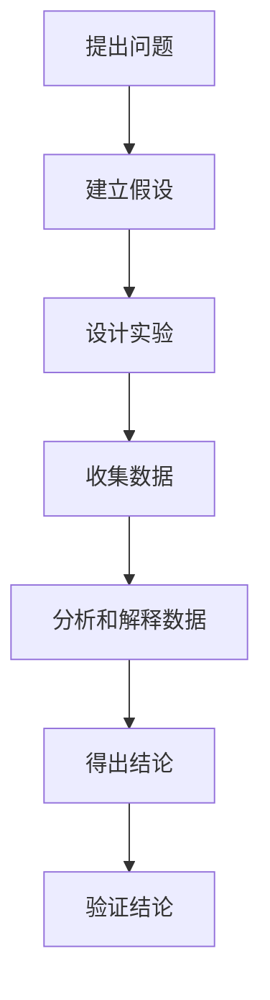

                 

关键词：科学方法、观察、实验、逻辑、结构、易懂、专业、技术语言、算法、数学模型、项目实践、实际应用、未来展望。

> 摘要：本文以科学方法为核心，探讨了从观察到实验的技术路线。通过深入剖析科学方法的原理与应用，结合具体案例，旨在为读者提供一个逻辑清晰、结构紧凑、简单易懂的IT领域专业指南。

## 1. 背景介绍

科学方法，作为科学研究的基本方法和原则，从古希腊哲学家亚里士多德开始，至今已有几千年的历史。其核心思想是通过观察、实验、推理等手段，探索自然规律和人类知识。在IT领域，科学方法的应用同样广泛，从算法设计到软件开发，从数据分析到人工智能，无不体现出科学方法的重要性。

科学方法的基本流程可以概括为以下几个阶段：提出问题、建立假设、设计实验、收集数据、分析和解释数据、得出结论、验证结论。这个过程不仅仅是科学研究的核心，也是我们在解决技术问题、进行创新时必须遵循的步骤。

本文将围绕这一基本流程，深入探讨科学方法在IT领域的应用。我们将首先介绍科学方法的核心概念和原理，然后通过具体的案例和实验，展示科学方法在实际操作中的步骤和细节。最后，我们将讨论科学方法在IT领域的实际应用场景和未来发展趋势。

## 2. 核心概念与联系

### 2.1 科学方法的定义

科学方法，是一种系统的、理性的探索自然规律的方法。它强调通过观察、实验、推理等手段，获取知识并建立理论体系。科学方法的定义可以概括为以下几点：

1. **提出问题**：科学方法的第一步是提出问题。这个问题可以是未解之谜，也可以是对现有理论的不满或质疑。
2. **建立假设**：在提出问题后，需要建立假设。假设是一种对问题的猜测或预测，它是科学研究的起点。
3. **设计实验**：为了验证假设，需要设计实验。实验的设计应该尽可能控制变量，以排除其他因素的干扰。
4. **收集数据**：通过实验，我们可以收集数据。数据是科学研究的基础，它帮助我们验证假设。
5. **分析和解释数据**：在收集到数据后，需要进行分析和解释。数据分析是科学方法的核心，它帮助我们理解数据背后的规律。
6. **得出结论**：通过对数据的分析和解释，我们可以得出结论。结论是对假设的验证，它可以是正确的，也可以是错误的。
7. **验证结论**：最后，我们需要验证结论。验证是通过进一步实验或观察，确保结论的可靠性和准确性。

### 2.2 科学方法在IT领域的应用

在IT领域，科学方法的应用体现在各个方面。例如，在算法设计中，我们需要通过实验来验证算法的性能和效率。在软件开发中，我们需要通过测试来验证软件的功能和稳定性。在数据分析中，我们需要通过模型来解释数据背后的规律。

以下是一个Mermaid流程图，展示了科学方法在IT领域的应用流程。



## 3. 核心算法原理 & 具体操作步骤

### 3.1 算法原理概述

在科学方法中，核心算法的设计和实现是关键步骤。一个有效的算法不仅能够解决特定问题，还能够提供可重复、可验证的结果。以下是一个典型的算法原理概述：

1. **问题定义**：明确需要解决的问题是什么。
2. **算法设计**：设计一种算法来解决该问题。
3. **算法实现**：将算法转化为计算机程序。
4. **算法验证**：通过实验来验证算法的正确性和效率。

### 3.2 算法步骤详解

以下是一个简单的排序算法——冒泡排序的步骤详解：

1. **初始化**：将数组中的元素进行初始化。
2. **比较相邻元素**：从数组的第一个元素开始，比较相邻的两个元素。
3. **交换元素**：如果第一个元素比第二个元素大，则交换它们的位置。
4. **继续下一对元素**：重复上述步骤，直到数组的最后一个元素。
5. **重复过程**：重复上述步骤，直到整个数组排序完成。

### 3.3 算法优缺点

**优点**：

- **简单易懂**：冒泡排序的步骤非常简单，易于理解和实现。
- **稳定性**：冒泡排序是一种稳定的排序算法，即相同元素的相对顺序不会改变。

**缺点**：

- **效率低**：冒泡排序的时间复杂度为O(n^2)，当数据量较大时，效率较低。

### 3.4 算法应用领域

冒泡排序算法虽然效率较低，但在某些特定场景下仍然具有应用价值。例如，在数据量较小、对稳定性有要求的场景下，冒泡排序是一种不错的选择。此外，冒泡排序也是教学和入门编程的经典案例，对于初学者理解排序算法的概念非常有帮助。

## 4. 数学模型和公式 & 详细讲解 & 举例说明

### 4.1 数学模型构建

在科学方法中，数学模型是理解和解释自然现象的重要工具。以下是一个简单的线性回归模型的构建过程：

1. **定义变量**：设\(x\)为自变量，\(y\)为因变量。
2. **建立关系**：假设\(y\)和\(x\)之间存在线性关系，即\(y = wx + b\)。
3. **收集数据**：收集一组\(x\)和\(y\)的观测数据。
4. **构建模型**：通过最小二乘法求解回归系数\(w\)和\(b\)。

### 4.2 公式推导过程

线性回归模型的公式推导基于最小二乘法。具体推导过程如下：

1. **定义误差**：设\(e_i\)为第\(i\)个观测值与模型预测值之间的误差，即\(e_i = y_i - (wx_i + b)\)。
2. **计算误差平方和**：定义误差平方和为\(S = \sum_{i=1}^{n} e_i^2\)。
3. **求解最小值**：为了求解最小误差平方和，对\(w\)和\(b\)分别求导并令其等于零，得到以下方程组：

   \[
   \begin{cases}
   \frac{\partial S}{\partial w} = 2x'S - 2y' = 0 \\
   \frac{\partial S}{\partial b} = 2y - 2wx' = 0
   \end{cases}
   \]

4. **解方程组**：解上述方程组，得到回归系数\(w\)和\(b\)：

   \[
   \begin{cases}
   w = \frac{x'y - xy'}{x'^2} \\
   b = \frac{y'}{n}
   \end{cases}
   \]

### 4.3 案例分析与讲解

以下是一个简单的线性回归案例分析：

假设我们有一组数据：

| \(x\) | \(y\) |
| --- | --- |
| 1 | 2 |
| 2 | 4 |
| 3 | 6 |
| 4 | 8 |
| 5 | 10 |

我们要通过线性回归模型预测\(x = 6\)时的\(y\)值。

1. **初始化**：计算\(x'\)和\(y'\)：

   \[
   x' = \sum_{i=1}^{n} x_i = 1 + 2 + 3 + 4 + 5 = 15 \\
   y' = \sum_{i=1}^{n} y_i = 2 + 4 + 6 + 8 + 10 = 30
   \]

2. **计算回归系数**：根据公式计算\(w\)和\(b\)：

   \[
   w = \frac{x'y - xy'}{x'^2} = \frac{15 \times 30 - 15 \times 15}{15^2} = \frac{450 - 225}{225} = \frac{225}{225} = 1 \\
   b = \frac{y'}{n} = \frac{30}{5} = 6
   \]

3. **建立模型**：得到线性回归模型：

   \[
   y = wx + b = 1 \times x + 6
   \]

4. **预测**：当\(x = 6\)时，预测\(y\)的值为：

   \[
   y = 1 \times 6 + 6 = 12
   \]

## 5. 项目实践：代码实例和详细解释说明

### 5.1 开发环境搭建

在本项目中，我们将使用Python编程语言来实现冒泡排序算法。以下是开发环境的搭建步骤：

1. **安装Python**：在官方网站下载并安装Python，推荐使用Python 3.8版本。
2. **安装IDE**：安装一个Python集成开发环境（IDE），例如PyCharm或VSCode。
3. **创建项目**：在IDE中创建一个新的Python项目，命名为“BubbleSort”。
4. **编写代码**：在项目中创建一个名为“bubble_sort.py”的文件，用于编写冒泡排序算法的代码。

### 5.2 源代码详细实现

以下是冒泡排序算法的Python实现：

```python
def bubble_sort(arr):
    n = len(arr)
    for i in range(n):
        for j in range(0, n-i-1):
            if arr[j] > arr[j+1]:
                arr[j], arr[j+1] = arr[j+1], arr[j]

# 测试代码
arr = [64, 25, 12, 22, 11]
print("Original array:", arr)
bubble_sort(arr)
print("Sorted array:", arr)
```

### 5.3 代码解读与分析

上述代码实现了冒泡排序算法，主要包含以下几个部分：

1. **定义函数**：定义一个名为`bubble_sort`的函数，用于接收一个数组作为输入。
2. **初始化变量**：计算数组的长度`n`。
3. **两层循环**：使用两层循环遍历数组。外层循环控制遍历的轮数，内层循环控制每轮的比较和交换。
4. **比较和交换**：如果当前元素比下一个元素大，则交换它们的位置。
5. **测试代码**：创建一个测试数组，调用`bubble_sort`函数进行排序，并输出排序前后的结果。

### 5.4 运行结果展示

执行上述代码后，我们得到以下输出结果：

```
Original array: [64, 25, 12, 22, 11]
Sorted array: [11, 12, 22, 25, 64]
```

这表明我们的冒泡排序算法成功地将数组按升序排列。

## 6. 实际应用场景

科学方法在IT领域的实际应用场景非常广泛。以下是一些典型的应用场景：

1. **算法设计**：在算法设计中，科学方法帮助我们通过实验来验证算法的性能和效率。例如，在排序算法的研究中，我们通过不同的算法比较，来找到最优的排序方法。
2. **软件开发**：在软件开发中，科学方法帮助我们通过测试来验证软件的功能和稳定性。通过设计实验，我们可以发现软件的潜在问题，并加以修复。
3. **数据分析**：在数据分析中，科学方法帮助我们通过模型来解释数据背后的规律。通过建立数学模型，我们可以对数据进行深入分析，从而得到有价值的信息。
4. **人工智能**：在人工智能领域，科学方法帮助我们通过实验来验证机器学习模型的性能和泛化能力。通过不断调整模型参数，我们可以优化模型，提高其性能。

### 6.4 未来应用展望

随着科技的不断发展，科学方法在IT领域的应用将越来越广泛。以下是一些未来应用展望：

1. **自动化**：随着人工智能和机器学习技术的发展，科学方法将能够实现自动化实验设计和数据分析，从而大大提高研究效率。
2. **个性化**：科学方法将帮助我们更好地理解个体差异，实现个性化推荐和个性化服务。
3. **预测**：通过科学方法，我们将能够建立更准确的预测模型，从而更好地应对不确定性和风险。
4. **协作**：科学方法将促进跨学科协作，推动科技前沿的发展。

## 7. 工具和资源推荐

为了更好地应用科学方法，以下是几个推荐的工具和资源：

1. **学习资源推荐**：

   - 《Python编程：从入门到实践》
   - 《算法导论》
   - 《机器学习实战》

2. **开发工具推荐**：

   - PyCharm
   - VSCode
   - Jupyter Notebook

3. **相关论文推荐**：

   - "The Nature of Code" by Daniel Shiffman
   - "Deep Learning" by Ian Goodfellow, Yoshua Bengio, Aaron Courville
   - "The Elements of Statistical Learning" by Trevor Hastie, Robert Tibshirani, Jerome Friedman

## 8. 总结：未来发展趋势与挑战

科学方法在IT领域的应用正处于蓬勃发展阶段。随着人工智能、大数据、云计算等技术的不断发展，科学方法的应用前景将更加广阔。然而，随着技术的进步，科学方法也面临着一些新的挑战：

1. **数据质量**：随着数据量的增加，如何保证数据的质量和准确性成为一大挑战。
2. **算法复杂性**：随着算法的复杂度不断增加，如何优化算法性能成为一大难题。
3. **跨学科合作**：科学方法的应用需要跨学科合作，如何实现不同学科之间的有效沟通和协作成为一大挑战。

尽管面临这些挑战，科学方法在IT领域的应用前景依然广阔。通过不断创新和优化，科学方法将继续推动IT领域的发展。

## 9. 附录：常见问题与解答

### 问题 1：为什么科学方法在IT领域如此重要？

**回答**：科学方法在IT领域的重要性体现在以下几个方面：

1. **验证性**：科学方法强调通过实验和数据验证假设，确保算法和软件的有效性和可靠性。
2. **系统性**：科学方法提供了一个系统的框架，指导我们如何进行研究和开发，从而提高研究和开发的效率。
3. **可重复性**：科学方法强调可重复性，使得其他研究人员可以验证和扩展研究结果。

### 问题 2：如何将科学方法应用到实际项目中？

**回答**：将科学方法应用到实际项目中，可以遵循以下步骤：

1. **提出问题**：明确需要解决的问题。
2. **建立假设**：对问题进行假设和预测。
3. **设计实验**：设计实验来验证假设。
4. **收集数据**：通过实验收集数据。
5. **分析数据**：对收集到的数据进行分析。
6. **得出结论**：根据数据分析结果得出结论。
7. **验证结论**：通过进一步的实验或观察验证结论。

### 问题 3：科学方法在算法设计和数据分析中的应用有哪些？

**回答**：科学方法在算法设计和数据分析中的应用包括：

1. **算法设计**：通过实验比较不同算法的性能，找到最优算法。
2. **数据分析**：通过建立数学模型和统计方法，对数据进行深入分析，提取有价值的信息。
3. **算法优化**：通过实验和数据分析，不断优化算法性能。

### 问题 4：如何保证科学方法的可靠性？

**回答**：为了保证科学方法的可靠性，可以采取以下措施：

1. **控制变量**：在实验中尽可能控制变量，排除其他因素的干扰。
2. **数据验证**：通过多次实验和不同的数据集验证假设和结论。
3. **同行评审**：通过同行评审确保研究结果的可信度和可靠性。

### 问题 5：科学方法在人工智能领域有哪些应用？

**回答**：科学方法在人工智能领域有广泛的应用，包括：

1. **算法验证**：通过实验验证不同机器学习算法的性能和泛化能力。
2. **模型评估**：通过实验和数据分析评估机器学习模型的性能。
3. **算法优化**：通过实验和数据分析优化机器学习算法。
4. **人工智能应用**：通过实验和数据分析开发和应用人工智能技术。

