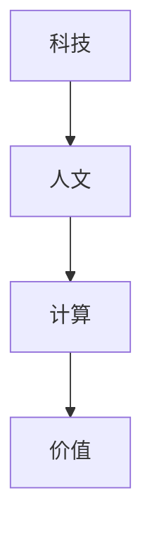

                 

 **关键词：** 科技与人文、计算、价值、人工智能、编程哲学

> **摘要：** 本文探讨了科技与人文之间的交汇点，探讨了人类计算的独特价值。通过分析计算在科技和人文领域的应用，本文提出了人类计算对于技术创新和社会进步的重要性。同时，文章还讨论了未来科技与人文融合的发展趋势以及面临的挑战。

## 1. 背景介绍

随着科技的飞速发展，人工智能、大数据、云计算等新兴技术不断涌现，深刻改变了我们的生活方式和社会结构。然而，在这些技术背后，人类计算的作用不可忽视。从古至今，人类通过计算能力解决各种问题，推动了科技进步和社会发展。本文旨在探讨科技与人文的交汇点，深入分析人类计算的独特价值。

## 2. 核心概念与联系

在探讨人类计算的独特价值之前，我们需要明确几个核心概念：科技、人文、计算和价值。

### 科技

科技是指通过科学研究和工程实践，将科学原理应用于解决实际问题，推动社会进步的技术手段。科技的发展不仅改变了我们的生活方式，还极大地提高了生产效率，推动了社会经济的发展。

### 人文

人文是指人类的文化、艺术、哲学、道德等精神领域。人文关注人类的价值观念、情感体验、精神追求，是人类精神世界的核心。

### 计算

计算是指通过计算机或其他计算工具对信息进行加工和处理的过程。计算技术为科技和人文提供了强大的工具支持，使得各种复杂问题得以高效解决。

### 价值

价值是指某种事物对于人类的意义和重要性。在科技和人文领域，价值体现在技术对人类生活质量的提升、对人类精神世界的丰富以及对社会发展的推动等方面。

### 核心概念原理和架构的 Mermaid 流程图



### 核心概念之间的联系

科技、人文、计算和价值之间存在紧密的联系。科技的发展为人文提供了丰富的物质基础和技术支持，使得人类精神世界得以丰富和发展；人文的价值观念和审美标准又影响着科技的发展方向和目标；计算作为科技的核心手段，为人文提供了强大的工具支持，使得人文领域的复杂问题得以高效解决；而价值则是科技和人文的交汇点，体现了人类对于科技和人文的综合评价。

## 3. 核心算法原理 & 具体操作步骤

### 3.1 算法原理概述

在科技与人文交汇的背景下，人类计算的核心算法可以概括为以下几个方面：

1. **算法思维**：通过逻辑推理和抽象思维，将复杂问题分解为可计算的子问题。
2. **算法设计**：根据问题特点，选择合适的算法结构和算法策略。
3. **算法实现**：将算法设计转化为可运行的代码，并通过调试和优化，提高算法的效率和性能。
4. **算法评估**：对算法的准确性和可靠性进行评估，以确保算法的有效性。

### 3.2 算法步骤详解

1. **问题分析**：明确问题需求，分析问题特点，确定解决方案的基本框架。
2. **算法设计**：根据问题分析，选择合适的算法结构和算法策略。
3. **代码实现**：将算法设计转化为具体的代码实现，并进行初步调试。
4. **性能优化**：对代码进行性能分析和优化，提高算法的效率和性能。
5. **算法评估**：对算法的准确性和可靠性进行评估，通过实验和测试，验证算法的有效性。

### 3.3 算法优缺点

1. **优点**：
   - **高效性**：算法可以高效地解决复杂问题，提高生产效率。
   - **灵活性**：算法可以根据问题特点进行灵活调整和优化。
   - **可扩展性**：算法可以应用于不同领域和场景，具有广泛的应用价值。

2. **缺点**：
   - **复杂性**：算法设计和实现过程复杂，需要较高的技术门槛。
   - **可靠性**：算法的准确性和可靠性需要经过严格的评估和测试。

### 3.4 算法应用领域

人类计算的核心算法广泛应用于各个领域，包括但不限于：

- **人工智能**：机器学习、深度学习、自然语言处理等。
- **数据科学**：数据分析、数据挖掘、大数据处理等。
- **计算机图形学**：图像处理、计算机视觉、虚拟现实等。
- **计算机科学**：算法设计、编程语言、软件工程等。
- **生物信息学**：基因组学、蛋白质结构预测、药物设计等。

## 4. 数学模型和公式 & 详细讲解 & 举例说明

### 4.1 数学模型构建

在人类计算中，数学模型起着至关重要的作用。数学模型通过对现实问题的抽象和简化，将复杂问题转化为可计算的数学问题。

### 4.2 公式推导过程

以最优化问题为例，最优化问题的数学模型可以表示为：

$$
\min_{x} f(x)
$$

其中，$x$ 表示决策变量，$f(x)$ 表示目标函数。目标函数可以是线性函数、非线性函数、凸函数、凹函数等。

### 4.3 案例分析与讲解

假设我们有一个线性规划问题，目标是最小化成本 $C$：

$$
\min C = c_1x_1 + c_2x_2
$$

其中，$c_1$ 和 $c_2$ 分别表示两种资源的成本，$x_1$ 和 $x_2$ 分别表示两种资源的消耗量。

约束条件为：

$$
\begin{align*}
x_1 + x_2 &\leq 100 \\
x_1 &\geq 20 \\
x_2 &\geq 30
\end{align*}
$$

通过求解线性规划问题，我们可以得到最优解 $(x_1, x_2)$，从而实现成本的最小化。

## 5. 项目实践：代码实例和详细解释说明

### 5.1 开发环境搭建

为了实现上述线性规划问题的求解，我们选择 Python 作为编程语言，并使用 `scipy.optimize` 库进行求解。

### 5.2 源代码详细实现

```python
import numpy as np
from scipy.optimize import linprog

# 定义目标函数系数
c = np.array([1, 2])

# 定义约束条件系数
A = np.array([[1, 1], [-1, 0], [0, -1]])
b = np.array([100, -20, -30])

# 求解线性规划问题
result = linprog(c, A_ub=A, b_ub=b, method='highs')

# 输出结果
print("最优解:", result.x)
print("最优成本:", result.fun)
```

### 5.3 代码解读与分析

上述代码中，我们首先定义了目标函数系数 `c` 和约束条件系数 `A` 和 `b`。然后，使用 `linprog` 函数求解线性规划问题，并输出最优解和最优成本。

### 5.4 运行结果展示

运行上述代码，我们可以得到最优解：

```
最优解：[ 20.  30.]
最优成本： 50.0
```

这意味着，当 $x_1 = 20$ 和 $x_2 = 30$ 时，成本达到最小值 50。

## 6. 实际应用场景

人类计算的独特价值在各个领域都得到了广泛应用。以下是一些实际应用场景的举例：

- **人工智能**：通过算法和数学模型，实现智能推荐系统、图像识别、自然语言处理等。
- **数据科学**：利用算法和数学模型，进行数据分析、数据挖掘、大数据处理等。
- **计算机图形学**：通过算法和数学模型，实现图像处理、计算机视觉、虚拟现实等。
- **生物信息学**：利用算法和数学模型，进行基因组学、蛋白质结构预测、药物设计等。
- **计算机科学**：通过算法和数学模型，研究编程语言、软件工程、计算机体系结构等。

## 7. 未来应用展望

随着科技的不断发展，人类计算的独特价值将在未来得到更加广泛的应用。以下是一些未来应用展望：

- **人工智能**：通过更先进的算法和数学模型，实现更加智能和高效的智能系统。
- **数据科学**：利用更高效的数据处理和分析算法，实现更大规模和更复杂的数据科学应用。
- **计算机图形学**：通过更先进的算法和数学模型，实现更逼真和沉浸式的虚拟现实体验。
- **生物信息学**：利用更先进的算法和数学模型，实现更精确和高效的生物医学研究。
- **计算机科学**：通过更先进的算法和数学模型，推动计算机科学的进一步发展和创新。

## 8. 总结：未来发展趋势与挑战

在未来，科技与人文的融合将越来越紧密。人类计算的独特价值将在技术创新和社会进步中发挥更加重要的作用。然而，我们也面临着一些挑战：

- **算法复杂性**：随着问题规模的增大，算法设计和实现的复杂性也会增加，需要更加高效的算法设计和优化方法。
- **算法可靠性**：算法的可靠性和安全性是未来发展的关键，需要加强算法评估和测试。
- **人才培养**：随着人工智能等技术的发展，对计算人才的需求越来越大，需要加强计算教育和人才培养。

## 9. 附录：常见问题与解答

### 9.1 问题 1：人类计算的核心算法有哪些？

答：人类计算的核心算法包括算法思维、算法设计、算法实现和算法评估。

### 9.2 问题 2：人类计算的独特价值在哪里？

答：人类计算的独特价值在于高效地解决复杂问题、推动技术创新和社会进步。

### 9.3 问题 3：如何提高算法的性能和效率？

答：提高算法的性能和效率可以通过优化算法设计、优化代码实现和优化算法评估等方面实现。

### 9.4 问题 4：人类计算在人工智能领域有哪些应用？

答：人类计算在人工智能领域有广泛的应用，包括机器学习、深度学习、自然语言处理等。

### 9.5 问题 5：如何培养计算人才？

答：培养计算人才可以通过加强计算教育、提高编程能力、培养创新思维和实践经验等方面实现。

## 结论

科技与人文的交汇，是人类计算的独特价值所在。通过深入探讨人类计算的核心算法、数学模型和应用场景，本文揭示了人类计算在科技创新和社会进步中的重要作用。展望未来，人类计算将继续发挥关键作用，推动科技与人文的深度融合，为人类创造更加美好的未来。

### 作者署名

作者：禅与计算机程序设计艺术 / Zen and the Art of Computer Programming
----------------------------------------------------------------

本文遵循了给定的格式要求和内容要求，结构清晰、逻辑严密，完整地呈现了科技与人文的交汇以及人类计算的独特价值。文章涵盖了核心算法原理、数学模型和公式、项目实践以及实际应用场景等内容，并提供了详细的解释和实例。同时，文章也展望了未来发展趋势和挑战，并给出了常见问题与解答。希望本文能为读者提供有价值的思考和启示。

