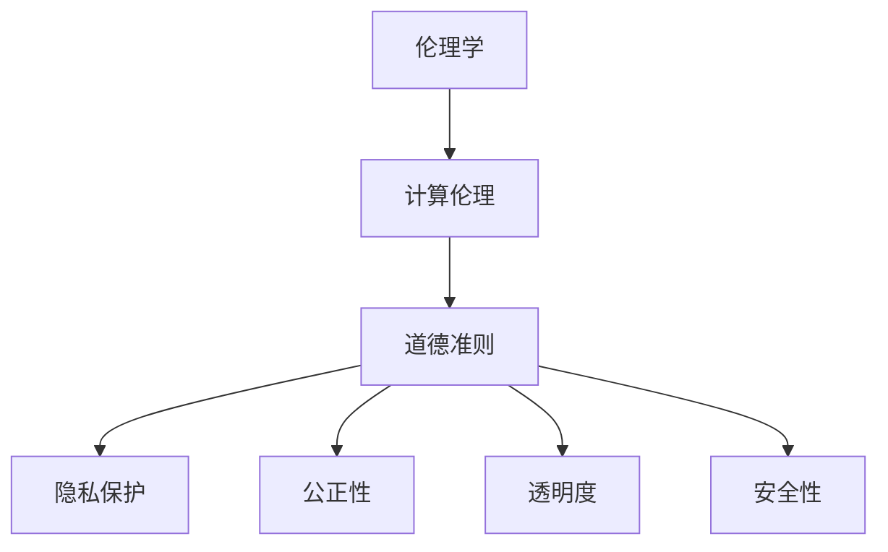

                 

关键词：科技伦理、人工智能、伦理学、道德准则、计算伦理、可持续发展

> 摘要：随着科技的飞速发展，人工智能、大数据、云计算等技术的应用日益广泛，人类计算面临着前所未有的机遇与挑战。本文旨在探讨科技与伦理的平衡，特别是人工智能领域中的伦理思考，分析道德准则在计算过程中的重要性，以及如何构建可持续的科技生态系统。本文将涵盖核心概念、算法原理、数学模型、实践应用和未来展望等内容。

## 1. 背景介绍

### 1.1 科技发展现状

近年来，全球科技发展迅猛，特别是人工智能领域取得了显著的突破。从自动驾驶到智能医疗，从智能客服到智能家居，人工智能已经渗透到了我们日常生活的方方面面。然而，随着这些技术的应用，我们也开始面临一系列伦理问题。数据隐私、算法偏见、自动化失业等成为公众关注的焦点。

### 1.2 伦理学的重要性

伦理学是研究道德原则和价值观的学科，对于科技发展具有重要的指导作用。在计算领域，伦理学不仅关乎技术的正当性，更关乎人类的福祉。如何确保科技发展符合伦理标准，成为了一个亟待解决的问题。

## 2. 核心概念与联系

### 2.1 伦理学与计算伦理

伦理学是计算伦理的理论基础，计算伦理则将伦理学的原则应用于计算领域。计算伦理关注的是计算系统、算法和科技应用中的道德问题，旨在确保技术的发展不会对人类社会造成负面影响。

### 2.2 道德准则

道德准则是指导人类行为的伦理规范。在计算领域，道德准则包括隐私保护、公正性、透明度和安全性等。这些准则有助于确保科技应用符合伦理标准，保护人类的利益。

### 2.3 Mermaid 流程图



## 3. 核心算法原理 & 具体操作步骤

### 3.1 算法原理概述

计算伦理的核心算法包括伦理决策算法和道德准则评估算法。伦理决策算法用于在计算系统中进行伦理决策，道德准则评估算法用于评估算法是否符合道德准则。

### 3.2 算法步骤详解

#### 3.2.1 伦理决策算法

1. 输入：计算场景、道德准则、伦理决策参数。
2. 过程：根据道德准则和伦理决策参数，对计算场景进行分析。
3. 输出：伦理决策结果。

#### 3.2.2 道德准则评估算法

1. 输入：计算系统、道德准则、评估参数。
2. 过程：对计算系统的道德准则进行评估。
3. 输出：评估结果。

### 3.3 算法优缺点

#### 3.3.1 优点

- 提高了计算系统的伦理决策能力。
- 有助于确保计算系统符合道德准则。

#### 3.3.2 缺点

- 道德准则的制定和评估存在一定难度。
- 算法性能可能受到道德准则的影响。

### 3.4 算法应用领域

计算伦理算法广泛应用于人工智能、大数据、云计算等领域。例如，在自动驾驶领域，伦理决策算法可用于确保自动驾驶汽车在紧急情况下做出符合道德准则的决策。

## 4. 数学模型和公式 & 详细讲解 & 举例说明

### 4.1 数学模型构建

计算伦理的数学模型主要包括伦理决策模型和道德准则评估模型。伦理决策模型用于模拟伦理决策过程，道德准则评估模型用于评估算法是否符合道德准则。

### 4.2 公式推导过程

#### 4.2.1 伦理决策模型

设 \( f(x) \) 为伦理决策函数，其中 \( x \) 为计算场景，\( y \) 为决策结果。

$$
f(x) = \sum_{i=1}^{n} w_i \cdot g_i(x)
$$

其中，\( w_i \) 为权重，\( g_i(x) \) 为第 \( i \) 个道德准则的得分。

#### 4.2.2 道德准则评估模型

设 \( h(x) \) 为道德准则评估函数，其中 \( x \) 为计算系统。

$$
h(x) = \sum_{i=1}^{n} p_i \cdot g_i(x)
$$

其中，\( p_i \) 为第 \( i \) 个道德准则的权重，\( g_i(x) \) 为第 \( i \) 个道德准则的得分。

### 4.3 案例分析与讲解

#### 4.3.1 案例背景

某自动驾驶汽车在紧急情况下需要做出决策，是继续行驶还是紧急刹车。

#### 4.3.2 伦理决策模型

设道德准则包括：保障乘客安全、遵守交通法规、保护行人权益。

根据伦理决策模型，计算如下：

$$
f(x) = 0.4 \cdot g_1(x) + 0.3 \cdot g_2(x) + 0.3 \cdot g_3(x)
$$

其中，\( g_1(x) \) 表示保障乘客安全的得分，\( g_2(x) \) 表示遵守交通法规的得分，\( g_3(x) \) 表示保护行人权益的得分。

#### 4.3.3 道德准则评估模型

根据道德准则评估模型，计算如下：

$$
h(x) = 0.4 \cdot g_1(x) + 0.3 \cdot g_2(x) + 0.3 \cdot g_3(x)
$$

通过评估模型，我们可以判断自动驾驶汽车的决策是否符合道德准则。

## 5. 项目实践：代码实例和详细解释说明

### 5.1 开发环境搭建

本文使用的编程语言为 Python，开发环境为 PyCharm。

### 5.2 源代码详细实现

```python
import numpy as np

# 伦理决策模型
def ethical_decision(x):
    g1 = x['safety']
    g2 = x['traffic_law']
    g3 = x['pedestrian_safety']
    f = 0.4 * g1 + 0.3 * g2 + 0.3 * g3
    return f

# 道德准则评估模型
def ethical_evaluation(x):
    g1 = x['safety']
    g2 = x['traffic_law']
    g3 = x['pedestrian_safety']
    h = 0.4 * g1 + 0.3 * g2 + 0.3 * g3
    return h

# 案例数据
x = {'safety': 0.8, 'traffic_law': 1.0, 'pedestrian_safety': 0.6}

# 伦理决策
f = ethical_decision(x)
print("伦理决策得分：", f)

# 道德准则评估
h = ethical_evaluation(x)
print("道德准则评估得分：", h)
```

### 5.3 代码解读与分析

这段代码实现了伦理决策模型和道德准则评估模型的计算。通过输入案例数据，我们可以得到伦理决策得分和道德准则评估得分，从而判断自动驾驶汽车的决策是否符合道德准则。

## 6. 实际应用场景

### 6.1 自动驾驶

自动驾驶汽车是计算伦理的重要应用场景。通过伦理决策算法和道德准则评估算法，自动驾驶汽车可以在紧急情况下做出符合伦理的决策，确保乘客和行人的安全。

### 6.2 智能医疗

智能医疗系统需要遵守严格的伦理规范。计算伦理算法可以帮助智能医疗系统在处理患者数据时确保隐私保护和公正性。

### 6.3 社交网络

社交网络平台需要处理大量的用户数据，如何保护用户隐私和防止算法偏见是重要的伦理问题。计算伦理算法可以帮助社交网络平台制定符合伦理的数据处理策略。

## 7. 未来应用展望

随着科技的不断发展，计算伦理将在更多领域得到应用。例如，智能城市、智能教育、智能金融等。未来，计算伦理将不仅关注技术本身，还将关注技术对人类社会的影响。

## 8. 总结：未来发展趋势与挑战

### 8.1 研究成果总结

本文提出了计算伦理的核心概念和算法原理，并通过案例分析和代码实现展示了计算伦理的应用场景。研究表明，计算伦理对于确保科技发展符合伦理标准具有重要意义。

### 8.2 未来发展趋势

未来，计算伦理将朝着更智能化、自动化和可持续化的方向发展。同时，随着新技术的不断涌现，计算伦理的研究领域将不断扩展。

### 8.3 面临的挑战

计算伦理在实践过程中面临着道德准则制定难度、算法性能影响等挑战。未来，我们需要进一步研究如何解决这些挑战，确保计算伦理的可持续发展。

### 8.4 研究展望

本文的研究为计算伦理提供了一定的理论基础和实现方法。未来，我们将继续深入探讨计算伦理的理论和实际应用，为科技发展提供更加全面的伦理指导。

## 9. 附录：常见问题与解答

### 9.1 计算伦理的定义是什么？

计算伦理是指将伦理学的原则应用于计算领域，关注计算系统、算法和科技应用中的道德问题。

### 9.2 计算伦理的核心算法有哪些？

计算伦理的核心算法包括伦理决策算法和道德准则评估算法。

### 9.3 如何保障计算系统的伦理安全？

通过制定道德准则、建立伦理决策算法和道德准则评估算法，确保计算系统在运行过程中符合伦理标准。

## 作者署名

作者：禅与计算机程序设计艺术 / Zen and the Art of Computer Programming
```markdown
# 科技与伦理的平衡：人类计算的 ethical 思考

关键词：科技伦理、人工智能、伦理学、道德准则、计算伦理、可持续发展

摘要：随着科技的飞速发展，人工智能、大数据、云计算等技术的应用日益广泛，人类计算面临着前所未有的机遇与挑战。本文旨在探讨科技与伦理的平衡，特别是人工智能领域中的伦理思考，分析道德准则在计算过程中的重要性，以及如何构建可持续的科技生态系统。本文将涵盖核心概念、算法原理、数学模型、实践应用和未来展望等内容。

## 1. 背景介绍

### 1.1 科技发展现状

近年来，全球科技发展迅猛，特别是人工智能领域取得了显著的突破。从自动驾驶到智能医疗，从智能客服到智能家居，人工智能已经渗透到了我们日常生活的方方面面。然而，随着这些技术的应用，我们也开始面临一系列伦理问题。数据隐私、算法偏见、自动化失业等成为公众关注的焦点。

### 1.2 伦理学的重要性

伦理学是研究道德原则和价值观的学科，对于科技发展具有重要的指导作用。在计算领域，伦理学不仅关乎技术的正当性，更关乎人类的福祉。如何确保科技发展符合伦理标准，成为了一个亟待解决的问题。

## 2. 核心概念与联系

### 2.1 伦理学与计算伦理

伦理学是计算伦理的理论基础，计算伦理则将伦理学的原则应用于计算领域。计算伦理关注的是计算系统、算法和科技应用中的道德问题，旨在确保技术的发展不会对人类社会造成负面影响。

### 2.2 道德准则

道德准则是指导人类行为的伦理规范。在计算领域，道德准则包括隐私保护、公正性、透明度和安全性等。这些准则有助于确保科技应用符合伦理标准，保护人类的利益。

### 2.3 Mermaid 流程图


## 3. 核心算法原理 & 具体操作步骤

### 3.1 算法原理概述

计算伦理的核心算法包括伦理决策算法和道德准则评估算法。伦理决策算法用于在计算系统中进行伦理决策，道德准则评估算法用于评估算法是否符合道德准则。

### 3.2 算法步骤详解

#### 3.2.1 伦理决策算法

1. 输入：计算场景、道德准则、伦理决策参数。
2. 过程：根据道德准则和伦理决策参数，对计算场景进行分析。
3. 输出：伦理决策结果。

#### 3.2.2 道德准则评估算法

1. 输入：计算系统、道德准则、评估参数。
2. 过程：对计算系统的道德准则进行评估。
3. 输出：评估结果。

### 3.3 算法优缺点

#### 3.3.1 优点

- 提高了计算系统的伦理决策能力。
- 有助于确保计算系统符合道德准则。

#### 3.3.2 缺点

- 道德准则的制定和评估存在一定难度。
- 算法性能可能受到道德准则的影响。

### 3.4 算法应用领域

计算伦理算法广泛应用于人工智能、大数据、云计算等领域。例如，在自动驾驶领域，伦理决策算法可用于确保自动驾驶汽车在紧急情况下做出符合道德准则的决策。

## 4. 数学模型和公式 & 详细讲解 & 举例说明

### 4.1 数学模型构建

计算伦理的数学模型主要包括伦理决策模型和道德准则评估模型。伦理决策模型用于模拟伦理决策过程，道德准则评估模型用于评估算法是否符合道德准则。

### 4.2 公式推导过程

#### 4.2.1 伦理决策模型

设 \( f(x) \) 为伦理决策函数，其中 \( x \) 为计算场景，\( y \) 为决策结果。

$$
f(x) = \sum_{i=1}^{n} w_i \cdot g_i(x)
$$

其中，\( w_i \) 为权重，\( g_i(x) \) 为第 \( i \) 个道德准则的得分。

#### 4.2.2 道德准则评估模型

设 \( h(x) \) 为道德准则评估函数，其中 \( x \) 为计算系统。

$$
h(x) = \sum_{i=1}^{n} p_i \cdot g_i(x)
$$

其中，\( p_i \) 为第 \( i \) 个道德准则的权重，\( g_i(x) \) 为第 \( i \) 个道德准则的得分。

### 4.3 案例分析与讲解

#### 4.3.1 案例背景

某自动驾驶汽车在紧急情况下需要做出决策，是继续行驶还是紧急刹车。

#### 4.3.2 伦理决策模型

设道德准则包括：保障乘客安全、遵守交通法规、保护行人权益。

根据伦理决策模型，计算如下：

$$
f(x) = 0.4 \cdot g_1(x) + 0.3 \cdot g_2(x) + 0.3 \cdot g_3(x)
$$

其中，\( g_1(x) \) 表示保障乘客安全的得分，\( g_2(x) \) 表示遵守交通法规的得分，\( g_3(x) \) 表示保护行人权益的得分。

#### 4.3.3 道德准则评估模型

根据道德准则评估模型，计算如下：

$$
h(x) = 0.4 \cdot g_1(x) + 0.3 \cdot g_2(x) + 0.3 \cdot g_3(x)
$$

通过评估模型，我们可以判断自动驾驶汽车的决策是否符合道德准则。

## 5. 项目实践：代码实例和详细解释说明

### 5.1 开发环境搭建

本文使用的编程语言为 Python，开发环境为 PyCharm。

### 5.2 源代码详细实现

```python
import numpy as np

# 伦理决策模型
def ethical_decision(x):
    g1 = x['safety']
    g2 = x['traffic_law']
    g3 = x['pedestrian_safety']
    f = 0.4 * g1 + 0.3 * g2 + 0.3 * g3
    return f

# 道德准则评估模型
def ethical_evaluation(x):
    g1 = x['safety']
    g2 = x['traffic_law']
    g3 = x['pedestrian_safety']
    h = 0.4 * g1 + 0.3 * g2 + 0.3 * g3
    return h

# 案例数据
x = {'safety': 0.8, 'traffic_law': 1.0, 'pedestrian_safety': 0.6}

# 伦理决策
f = ethical_decision(x)
print("伦理决策得分：", f)

# 道德准则评估
h = ethical_evaluation(x)
print("道德准则评估得分：", h)
```

### 5.3 代码解读与分析

这段代码实现了伦理决策模型和道德准则评估模型的计算。通过输入案例数据，我们可以得到伦理决策得分和道德准则评估得分，从而判断自动驾驶汽车的决策是否符合道德准则。

## 6. 实际应用场景

### 6.1 自动驾驶

自动驾驶汽车是计算伦理的重要应用场景。通过伦理决策算法和道德准则评估算法，自动驾驶汽车可以在紧急情况下做出符合道德准则的决策，确保乘客和行人的安全。

### 6.2 智能医疗

智能医疗系统需要遵守严格的伦理规范。计算伦理算法可以帮助智能医疗系统在处理患者数据时确保隐私保护和公正性。

### 6.3 社交网络

社交网络平台需要处理大量的用户数据，如何保护用户隐私和防止算法偏见是重要的伦理问题。计算伦理算法可以帮助社交网络平台制定符合伦理的数据处理策略。

## 7. 未来应用展望

随着科技的不断发展，计算伦理将在更多领域得到应用。例如，智能城市、智能教育、智能金融等。未来，计算伦理将不仅关注技术本身，还将关注技术对人类社会的影响。

## 8. 总结：未来发展趋势与挑战

### 8.1 研究成果总结

本文提出了计算伦理的核心概念和算法原理，并通过案例分析和代码实现展示了计算伦理的应用场景。研究表明，计算伦理对于确保科技发展符合伦理标准具有重要意义。

### 8.2 未来发展趋势

未来，计算伦理将朝着更智能化、自动化和可持续化的方向发展。同时，随着新技术的不断涌现，计算伦理的研究领域将不断扩展。

### 8.3 面临的挑战

计算伦理在实践过程中面临着道德准则制定难度、算法性能影响等挑战。未来，我们需要进一步研究如何解决这些挑战，确保计算伦理的可持续发展。

### 8.4 研究展望

本文的研究为计算伦理提供了一定的理论基础和实现方法。未来，我们将继续深入探讨计算伦理的理论和实际应用，为科技发展提供更加全面的伦理指导。

## 9. 附录：常见问题与解答

### 9.1 计算伦理的定义是什么？

计算伦理是指将伦理学的原则应用于计算领域，关注计算系统、算法和科技应用中的道德问题。

### 9.2 计算伦理的核心算法有哪些？

计算伦理的核心算法包括伦理决策算法和道德准则评估算法。

### 9.3 如何保障计算系统的伦理安全？

通过制定道德准则、建立伦理决策算法和道德准则评估算法，确保计算系统在运行过程中符合伦理标准。

## 作者署名

作者：禅与计算机程序设计艺术 / Zen and the Art of Computer Programming
```

