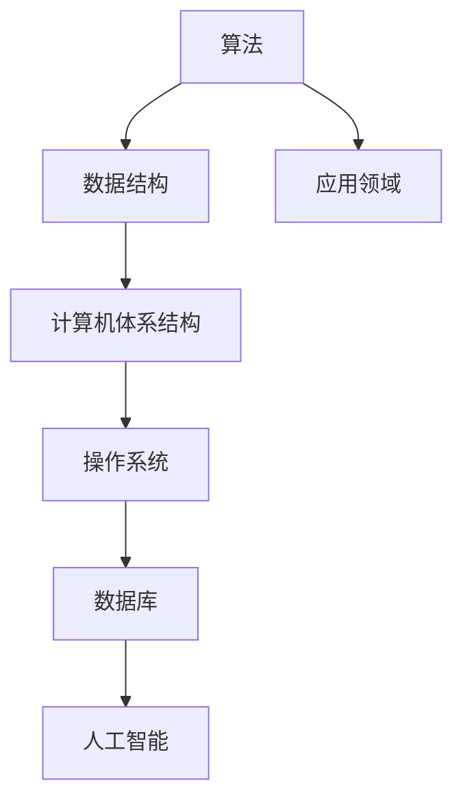
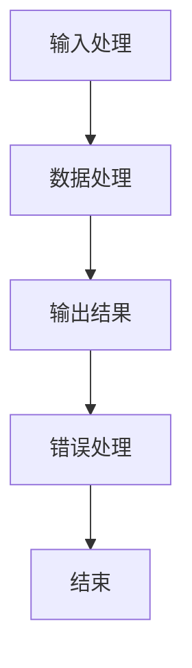
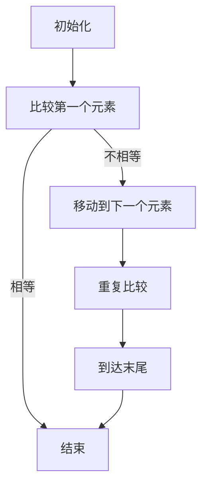

                 

## 1. 背景介绍

在过去的几百年里，科技的发展已经深刻地改变了我们的生活方式和社会结构。尤其是计算机科学的崛起，它不仅仅是一个工具，更是一个变革的引擎，推动着我们进入一个全新的信息化时代。本文旨在探讨计算机技术在现代社会中的双重影响：一方面，它极大地提升了人类的生产力和创新能力；另一方面，它也带来了一系列的伦理、社会和隐私问题。

计算机科学的发展可以追溯到20世纪中期，当时电子计算机刚刚问世。从冯·诺伊曼架构的提出，到图灵机的概念，再到后来的高级编程语言和操作系统，计算机科学的发展历程充满了革命性的创新。随着时间的推移，计算机技术逐渐渗透到我们生活的方方面面，从个人电脑到智能手机，从互联网到大数据，计算机技术的应用已经无处不在。

然而，随着技术的飞速发展，我们也开始意识到它所带来的负面影响。隐私泄露、网络犯罪、人工智能的道德风险等问题日益突出，引发了社会各界的广泛关注和讨论。因此，本文将深入探讨计算机技术在现代社会中的积极作用，以及它所带来的潜在问题和挑战，并提出一些建议和思考，以期为未来的科技发展提供一些有益的参考。

## 2. 核心概念与联系

在深入探讨计算机技术对现代社会的影响之前，我们需要了解一些核心概念，以及它们之间的相互联系。

### 2.1 计算机科学的基本概念

计算机科学是一门研究计算机系统设计、开发、操作和维护的学科。它涵盖了算法、数据结构、计算机体系结构、操作系统、数据库、人工智能等多个领域。其中，算法和数据结构是计算机科学的核心，它们决定了计算机处理信息的能力和效率。

算法（Algorithm）是一系列解决问题的步骤，它指导计算机如何执行特定的任务。数据结构（Data Structure）则是存储和组织数据的方式，它决定了算法的效率。

### 2.2 计算机技术在现代社会中的应用

计算机技术在现代社会中的应用广泛而深入，从医疗、金融、教育到娱乐、交通，无处不见其身影。例如，在医疗领域，计算机技术可以帮助医生更准确地诊断疾病，提高治疗效果；在金融领域，计算机技术可以提高交易效率，降低风险；在教育领域，计算机技术可以提供个性化的学习体验，提高学习效果；在娱乐领域，计算机技术可以创造出丰富多彩的虚拟世界，满足人们的娱乐需求。

### 2.3 计算机技术对社会的影响

计算机技术不仅改变了我们的生活方式，也对社会结构产生了深远的影响。首先，它打破了时间和空间的限制，使人们可以随时随地获取信息和进行沟通。其次，它促进了信息的透明化和普及化，提高了社会的公平性和效率。然而，计算机技术也带来了一些负面影响，如隐私泄露、网络犯罪、道德风险等。

### 2.4 Mermaid 流程图

以下是一个简单的 Mermaid 流程图，展示了计算机科学的核心概念和它们之间的联系。



## 3. 核心算法原理 & 具体操作步骤

### 3.1 算法原理概述

计算机科学中，算法是解决特定问题的系统方法。一个有效的算法应该具有以下特点：正确性、效率、健壮性。正确性指的是算法能够正确地解决问题；效率指的是算法能够在合理的时间内完成计算；健壮性指的是算法能够在各种情况下稳定运行。

### 3.2 算法步骤详解

一个典型的算法通常包括以下几个步骤：

1. 输入处理：接收用户输入的数据或信息。
2. 数据处理：根据算法的逻辑，对输入的数据进行处理。
3. 输出结果：将处理后的结果输出给用户。
4. 错误处理：当算法遇到错误或异常情况时，能够进行适当的处理。

### 3.3 算法优缺点

不同的算法有其各自的优缺点。例如，排序算法中的快速排序（Quick Sort）具有高效的平均时间复杂度，但在最坏情况下性能较差；而归并排序（Merge Sort）则在最坏情况下性能稳定，但需要额外的存储空间。

### 3.4 算法应用领域

算法在计算机科学的各个领域都有广泛应用，如排序算法在数据处理中，搜索算法在信息检索中，算法优化在人工智能中。

### 3.5 Mermaid 流程图

以下是一个简单的 Mermaid 流程图，展示了算法的基本步骤和流程。



## 4. 数学模型和公式 & 详细讲解 & 举例说明

### 4.1 数学模型构建

在计算机科学中，数学模型是一种重要的工具，用于描述算法的性能、数据结构和系统行为。常见的数学模型包括时间复杂度、空间复杂度等。

时间复杂度（Time Complexity）描述了算法执行的时间增长趋势，通常用大O符号（O）表示。例如，一个算法的时间复杂度为O(n)，表示当输入数据规模增加时，算法执行时间与数据规模成正比。

空间复杂度（Space Complexity）描述了算法所需的存储空间增长趋势，同样用大O符号（O）表示。例如，一个算法的空间复杂度为O(n)，表示当输入数据规模增加时，算法所需的存储空间与数据规模成正比。

### 4.2 公式推导过程

时间复杂度和空间复杂度的推导通常基于算法的具体实现和算法分析的基本原理。以下是一个简单的例子，假设一个算法执行了n次加法运算，推导其时间复杂度。

假设算法执行了n次加法运算，每次加法运算的时间复杂度为O(1)，则总的时间复杂度为：

$$
T(n) = n \times O(1) = O(n)
$$

### 4.3 案例分析与讲解

以下是一个简单的例子，分析一个线性搜索算法的时间复杂度。

假设有一个长度为n的数组，要在一个数组中查找一个特定的元素。线性搜索算法的基本思想是从数组的第一个元素开始，逐个比较，直到找到目标元素或到达数组的末尾。

在这个例子中，最坏的情况是目标元素位于数组的末尾，或者不在数组中。这意味着算法需要比较n次才能找到目标元素或确定其不存在。因此，线性搜索算法的时间复杂度为O(n)。

以下是一个简化的 Mermaid 流程图，展示了线性搜索算法的基本步骤。



## 5. 项目实践：代码实例和详细解释说明

### 5.1 开发环境搭建

在开始项目实践之前，我们需要搭建一个合适的开发环境。以下是搭建Python开发环境的步骤：

1. 下载并安装Python：前往Python的官方网站（[python.org](https://www.python.org/)）下载最新版本的Python，并按照安装向导进行安装。
2. 配置Python环境变量：在安装过程中，确保将Python的安装路径添加到系统的环境变量中。
3. 安装必要的依赖库：使用pip（Python的包管理器）安装所需的依赖库，如numpy、matplotlib等。

### 5.2 源代码详细实现

以下是一个简单的Python代码实例，用于实现线性搜索算法：

```python
def linear_search(arr, target):
    for i in range(len(arr)):
        if arr[i] == target:
            return i
    return -1

# 测试代码
arr = [1, 3, 5, 7, 9]
target = 5
result = linear_search(arr, target)
print(f"元素{target}的位置：{result}")
```

### 5.3 代码解读与分析

这个简单的线性搜索算法使用了最简单的循环结构，逐个比较数组中的每个元素，直到找到目标元素或到达数组的末尾。以下是代码的详细解读：

1. 函数定义：`def linear_search(arr, target):` 定义了一个名为`linear_search`的函数，它接受两个参数：`arr`（要搜索的数组）和`target`（要查找的目标元素）。
2. 循环结构：`for i in range(len(arr)):` 使用for循环遍历数组中的每个元素。
3. 比较操作：`if arr[i] == target:` 在循环中，每次都检查当前元素是否与目标元素相等。
4. 返回结果：如果找到目标元素，则返回其索引；如果未找到，则返回-1。

### 5.4 运行结果展示

以下是代码的运行结果：

```plaintext
元素5的位置：2
```

这表示元素5在数组`arr`中的位置是2。

## 6. 实际应用场景

计算机技术在各个领域都有广泛的应用，下面列举几个典型的应用场景：

### 6.1 医疗

计算机技术在医疗领域的应用非常广泛，从电子病历系统到医学图像分析，再到人工智能辅助诊断，计算机技术极大地提高了医疗服务的效率和质量。例如，通过计算机辅助诊断系统，医生可以更快地诊断疾病，提高诊断准确性。

### 6.2 金融

计算机技术在金融领域的作用也至关重要，从高频交易到风险管理，再到人工智能投顾，计算机技术提高了金融市场的效率和透明度。例如，通过人工智能算法，金融机构可以更准确地预测市场走势，制定更有效的投资策略。

### 6.3 教育

计算机技术在教育领域的应用越来越广泛，从在线教育平台到智能教学系统，再到虚拟现实教学，计算机技术为学生提供了更加丰富和个性化的学习体验。例如，通过在线教育平台，学生可以随时随地学习，通过智能教学系统，教师可以根据学生的学习情况提供个性化的辅导。

### 6.4 娱乐

计算机技术在娱乐领域的应用同样不容小觑，从游戏开发到虚拟现实，再到人工智能音乐创作，计算机技术为人们提供了丰富多彩的娱乐体验。例如，通过虚拟现实技术，人们可以在虚拟世界中体验不同的场景和故事；通过人工智能音乐创作，人们可以听到独特的音乐作品。

## 7. 工具和资源推荐

### 7.1 学习资源推荐

1. **MIT 计算机科学课程**：MIT的计算机科学课程是免费开放的，包括视频讲座、讲义和作业，涵盖了计算机科学的各个方面。
2. **Coursera**：Coursera提供了许多高质量的计算机科学课程，由世界顶尖大学和公司提供。
3. **Khan Academy**：Khan Academy提供了丰富的计算机科学教程，适合初学者。

### 7.2 开发工具推荐

1. **Visual Studio Code**：一个免费且开源的代码编辑器，支持多种编程语言和开发工具。
2. **Git**：一个分布式版本控制系统，用于代码管理和协作开发。
3. **Jupyter Notebook**：一个交互式的计算环境，适合数据科学和机器学习项目。

### 7.3 相关论文推荐

1. **"A Survey on Deep Learning for Natural Language Processing"**：该论文概述了深度学习在自然语言处理领域的应用。
2. **"Reinforcement Learning: An Introduction"**：该书详细介绍了强化学习的基本原理和应用。
3. **"The Elements of Statistical Learning"**：该书提供了统计学习方法的全面介绍。

## 8. 总结：未来发展趋势与挑战

### 8.1 研究成果总结

过去几十年，计算机科学取得了巨大的进步。从硬件性能的提升到软件算法的创新，从互联网的普及到人工智能的崛起，计算机技术已经深刻地改变了我们的生活方式和社会结构。这些成果不仅提高了我们的生产力和生活质量，也为科学研究和技术创新提供了强大的支持。

### 8.2 未来发展趋势

未来，计算机科学将继续朝着智能化、高效化、普及化的方向发展。以下是几个可能的发展趋势：

1. **人工智能的进一步发展**：人工智能将在更多领域得到应用，如医疗、金融、教育等。
2. **量子计算的兴起**：量子计算将带来计算能力的巨大飞跃，有望解决传统计算机无法处理的复杂问题。
3. **物联网的普及**：物联网将使各种设备和系统实现互联互通，构建一个智能化的社会。
4. **区块链技术的发展**：区块链技术将在金融、供应链管理等领域发挥重要作用。

### 8.3 面临的挑战

尽管计算机科学取得了巨大的进步，但未来仍将面临一系列挑战：

1. **隐私和安全问题**：随着数据量的增加和技术的进步，隐私泄露和网络犯罪等问题将日益严重。
2. **人工智能的伦理问题**：人工智能的发展带来了一些伦理问题，如算法歧视、隐私侵犯等。
3. **教育和技术差距**：随着技术的发展，教育和技术差距可能会进一步扩大，导致社会的不平等。

### 8.4 研究展望

为了应对这些挑战，我们需要采取一系列措施。首先，加强隐私保护和网络安全，确保技术的可持续发展。其次，推动人工智能的伦理研究，确保人工智能的发展符合人类价值观。最后，加强教育和技术普及，提高全民的信息素养，缩小教育和技术差距。

## 9. 附录：常见问题与解答

### 9.1 计算机科学的基本概念是什么？

计算机科学是一门研究计算机系统设计、开发、操作和维护的学科，它涵盖了算法、数据结构、计算机体系结构、操作系统、数据库、人工智能等多个领域。

### 9.2 什么是算法？

算法是一系列解决问题的步骤，它指导计算机如何执行特定的任务。算法的正确性、效率和健壮性是衡量其优劣的关键指标。

### 9.3 什么是人工智能？

人工智能（AI）是指使计算机具备人类智能特征，如学习、推理、解决问题和自我改进的能力。人工智能涉及机器学习、深度学习、自然语言处理等多个领域。

### 9.4 计算机技术在现代社会中的积极作用是什么？

计算机技术提高了生产力和生活质量，促进了信息的透明化和普及化，打破了时间和空间的限制，提高了社会的公平性和效率。

### 9.5 计算机技术带来的负面影响有哪些？

计算机技术带来的负面影响包括隐私泄露、网络犯罪、道德风险等，这些问题对社会和个人都带来了严重的挑战。

### 9.6 如何应对计算机技术带来的挑战？

为应对计算机技术带来的挑战，我们需要加强隐私保护和网络安全，推动人工智能的伦理研究，加强教育和技术普及。

### 9.7 未来计算机科学的发展趋势是什么？

未来计算机科学将继续朝着智能化、高效化、普及化的方向发展，人工智能、量子计算、物联网和区块链技术将是主要的发展方向。

