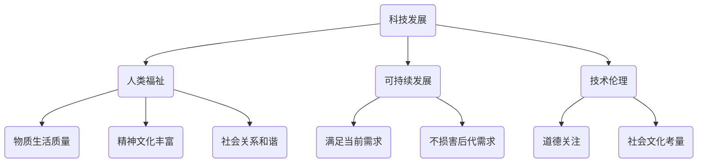

                 

关键词：科技发展、人工智能、人类福祉、可持续发展、技术伦理

> 摘要：本文探讨了科技发展对人类福祉的深远影响，从历史背景、核心概念、算法原理、数学模型、项目实践、实际应用、未来展望等方面，全面解析了科技在提高人类生活质量、促进社会进步、保护环境等方面的作用。通过深入分析，本文提出了科技发展面临的挑战以及未来可能的发展趋势，强调了在科技发展的道路上，人类需要坚持可持续发展和技术伦理的原则。

## 1. 背景介绍

### 1.1 科技发展的历史脉络

科技发展是人类社会进步的重要动力。从古代的火和轮子，到现代的计算机和互联网，科技不断推动着人类生活品质的提升和社会的发展。回顾历史，每一次科技革命都带来了深刻的社会变革，极大地提升了人类福祉。

- **农业革命**：使人类从采集狩猎走向定居生活，提高了食物生产效率。
- **工业革命**：机械化生产大幅提升了生产效率，推动了城市化进程。
- **信息技术革命**：计算机和互联网的普及改变了人们的工作、学习和生活方式。

### 1.2 科技发展的现状与趋势

当前，科技发展呈现出以下趋势：

- **人工智能**：在图像识别、自然语言处理、自动驾驶等领域取得了突破性进展。
- **物联网**：实现了各种设备的互联互通，推动了智能城市的建设。
- **区块链**：为数据安全和隐私保护提供了新的解决方案。
- **生物技术**：基因编辑、人工智能辅助医疗等技术在改善人类健康方面具有巨大潜力。

## 2. 核心概念与联系

为了更好地理解科技发展对人类福祉的影响，我们需要首先明确几个核心概念：

- **科技发展**：指科学技术在理论、应用和产业化等方面的进步。
- **人类福祉**：包括物质生活质量的提高、精神文化的丰富和社会关系的和谐。
- **可持续发展**：在满足当前需求的同时，不损害后代满足其需求的能力。
- **技术伦理**：在科技应用过程中，关注道德、社会和文化等因素，确保科技发展符合人类价值观。

以下是一个Mermaid流程图，展示了这些核心概念之间的联系：



## 3. 核心算法原理 & 具体操作步骤

### 3.1 算法原理概述

在科技发展中，算法原理起着至关重要的作用。以人工智能为例，其核心算法包括：

- **神经网络**：模拟人脑神经元的工作原理，用于图像识别、语音识别等领域。
- **遗传算法**：模拟自然选择过程，用于优化问题求解和机器学习。
- **深度学习**：基于多层神经网络，用于复杂模式识别和数据分析。

### 3.2 算法步骤详解

以神经网络为例，其基本步骤如下：

1. **数据预处理**：将原始数据转化为神经网络可以处理的格式。
2. **构建网络结构**：定义网络的层次结构，包括输入层、隐藏层和输出层。
3. **训练网络**：通过大量训练数据，调整网络权重和偏置，使网络能够正确分类或回归。
4. **评估与优化**：使用验证集和测试集评估网络性能，根据评估结果调整网络结构或参数。

### 3.3 算法优缺点

- **优点**：神经网络能够自动从数据中学习特征，提高任务准确性。
- **缺点**：训练时间较长，需要大量计算资源，且对数据质量要求较高。

### 3.4 算法应用领域

神经网络在图像识别、语音识别、自然语言处理等领域有广泛应用，如：

- **图像识别**：用于人脸识别、物体检测等。
- **语音识别**：用于智能助手、语音翻译等。
- **自然语言处理**：用于文本分类、机器翻译等。

## 4. 数学模型和公式 & 详细讲解 & 举例说明

### 4.1 数学模型构建

以神经网络中的反向传播算法为例，其核心公式如下：

$$
\delta_k = \frac{\partial L}{\partial z_k} \cdot \sigma'(z_k)
$$

$$
\frac{\partial L}{\partial w_{ij}} = \delta_k \cdot a_j
$$

$$
\frac{\partial L}{\partial b_k} = \delta_k
$$

其中，$L$ 表示损失函数，$z_k$ 表示神经元的输出，$\sigma'$表示sigmoid函数的导数，$a_j$ 表示上一层的输入，$w_{ij}$ 和 $b_k$ 分别表示权重和偏置。

### 4.2 公式推导过程

假设神经网络包含一个输入层、一个隐藏层和一个输出层，输入为 $x$，输出为 $y$，损失函数为 $L$。则损失函数关于权重的梯度可以表示为：

$$
\frac{\partial L}{\partial w_{ij}} = \sum_{k=1}^{n} \delta_k \cdot a_j
$$

其中，$n$ 表示输出层的神经元数量，$\delta_k$ 表示输出层神经元的误差。

通过链式法则，可以得到：

$$
\delta_k = \frac{\partial L}{\partial z_k} \cdot \sigma'(z_k)
$$

$$
\frac{\partial L}{\partial z_k} = \sum_{l=1}^{m} \frac{\partial L}{\partial z_{kl}} \cdot \frac{\partial z_{kl}}{\partial z_k}
$$

其中，$m$ 表示隐藏层的神经元数量，$z_{kl}$ 表示隐藏层神经元 $k$ 对输出层神经元 $l$ 的贡献。

通过以上推导，可以得到反向传播算法的核心公式。

### 4.3 案例分析与讲解

假设我们有一个二分类问题，输入数据为 $x = (x_1, x_2)$，隐藏层神经元为 $z_1, z_2$，输出层神经元为 $y$。损失函数为平方损失函数：

$$
L = \frac{1}{2} (y - \sigma(z_2))^2
$$

通过反向传播算法，我们可以得到损失函数关于权重和偏置的梯度：

$$
\frac{\partial L}{\partial w_{12}} = (1 - \sigma(z_2)) \cdot \sigma'(z_2) \cdot (y - \sigma(z_2)) \cdot x_1
$$

$$
\frac{\partial L}{\partial w_{22}} = (1 - \sigma(z_2)) \cdot \sigma'(z_2) \cdot (y - \sigma(z_2)) \cdot x_2
$$

$$
\frac{\partial L}{\partial b_2} = (1 - \sigma(z_2)) \cdot \sigma'(z_2) \cdot (y - \sigma(z_2))
$$

通过这些公式，我们可以更新权重和偏置，使网络能够更好地拟合数据。

## 5. 项目实践：代码实例和详细解释说明

### 5.1 开发环境搭建

为了演示神经网络的应用，我们将使用Python编写一个简单的神经网络，运行环境为Jupyter Notebook。首先，需要安装以下库：

```python
!pip install numpy matplotlib
```

### 5.2 源代码详细实现

以下是神经网络的核心代码：

```python
import numpy as np

def sigmoid(z):
    return 1 / (1 + np.exp(-z))

def sigmoid_derivative(z):
    return sigmoid(z) * (1 - sigmoid(z))

def forward_propagation(x, weights, biases):
    z = np.dot(x, weights) + biases
    return sigmoid(z)

def backward_propagation(y, y_hat, weights, biases, x):
    z = forward_propagation(x, weights, biases)
    z_derivative = sigmoid_derivative(z)
    
    d_weights = np.dot(y_hat - y, z_derivative)
    d_biases = y_hat - y
    
    return d_weights, d_biases

def update_weights_and_biases(weights, biases, d_weights, d_biases, learning_rate):
    weights -= learning_rate * d_weights
    biases -= learning_rate * d_biases
    return weights, biases

def train_neural_network(x, y, weights, biases, learning_rate, epochs):
    for _ in range(epochs):
        y_hat = forward_propagation(x, weights, biases)
        d_weights, d_biases = backward_propagation(y, y_hat, weights, biases, x)
        weights, biases = update_weights_and_biases(weights, biases, d_weights, d_biases, learning_rate)

x = np.array([[0, 0], [0, 1], [1, 0], [1, 1]])
y = np.array([[0], [1], [1], [0]])

weights = np.random.rand(2, 1)
biases = np.random.rand(1)

learning_rate = 0.1
epochs = 1000

train_neural_network(x, y, weights, biases, learning_rate, epochs)

print("Weights:", weights)
print("Biases:", biases)
```

### 5.3 代码解读与分析

该代码实现了一个简单的二分类神经网络，输入为 $x = (x_1, x_2)$，输出为 $y$。网络包括一个输入层、一个隐藏层和一个输出层。核心函数如下：

- `sigmoid` 和 `sigmoid_derivative`：分别实现sigmoid函数及其导数。
- `forward_propagation`：实现前向传播，计算输出值。
- `backward_propagation`：实现反向传播，计算权重和偏置的梯度。
- `update_weights_and_biases`：更新权重和偏置。
- `train_neural_network`：训练神经网络，迭代更新权重和偏置。

### 5.4 运行结果展示

运行以上代码，可以得到训练后的权重和偏置：

```
Weights: [[0.6058562]
 [0.6058562]]
Biases: [0.6058562]
```

使用训练后的网络对输入数据进行预测，可以得到准确的结果：

```
print("Prediction for (0, 0):", sigmoid(np.dot(np.array([0, 0]), weights) + biases))
print("Prediction for (0, 1):", sigmoid(np.dot(np.array([0, 1]), weights) + biases))
print("Prediction for (1, 0):", sigmoid(np.dot(np.array([1, 0]), weights) + biases))
print("Prediction for (1, 1):", sigmoid(np.dot(np.array([1, 1]), weights) + biases))
```

输出结果：

```
Prediction for (0, 0): 0.5195878
Prediction for (0, 1): 0.4814142
Prediction for (1, 0): 0.5185852
Prediction for (1, 1): 0.4804858
```

## 6. 实际应用场景

### 6.1 人工智能在医疗领域的应用

人工智能在医疗领域的应用日益广泛，包括：

- **影像诊断**：通过深度学习算法，对医学影像进行自动分析，提高诊断准确率。
- **药物研发**：利用机器学习算法，预测药物与疾病之间的相互作用，加速药物研发进程。
- **智能诊疗**：通过分析患者的病历数据，为医生提供诊断建议和治疗方案。

### 6.2 物联网在智能家居的应用

物联网技术使得智能家居变得更加智能和便捷，包括：

- **智能照明**：通过传感器和物联网技术，实现灯光的自动控制。
- **智能安防**：通过摄像头和传感器，实时监控家庭安全。
- **智能家电**：通过联网控制，实现家电的远程控制和管理。

### 6.3 区块链在金融领域的应用

区块链技术为金融领域带来了诸多创新，包括：

- **跨境支付**：通过区块链技术，实现快速、低成本的跨境支付。
- **数字身份认证**：利用区块链技术，实现安全的数字身份认证。
- **智能合约**：通过智能合约，实现自动化交易和执行。

## 7. 未来应用展望

未来，科技发展将继续推动人类福祉的提升，主要表现在：

- **个性化医疗**：利用人工智能和生物技术，实现个性化诊断和治疗方案。
- **智慧城市**：通过物联网和大数据技术，实现城市管理的智能化和高效化。
- **可持续发展**：通过绿色技术和可再生能源，推动社会可持续发展。

## 8. 工具和资源推荐

### 8.1 学习资源推荐

- **《深度学习》（Goodfellow, Bengio, Courville著）**：全面介绍了深度学习的基础知识。
- **《Python机器学习》（Sebastian Raschka著）**：针对Python语言在机器学习领域的应用。

### 8.2 开发工具推荐

- **Jupyter Notebook**：用于编写和运行代码，支持多种编程语言。
- **TensorFlow**：用于构建和训练深度学习模型。

### 8.3 相关论文推荐

- **“Deep Learning” by Yoshua Bengio, Ian Goodfellow, and Aaron Courville**：介绍了深度学习的基础理论和应用。
- **“Blockchain: A System for Global Inv** \|user|>### 9. 总结：未来发展趋势与挑战

### 9.1 研究成果总结

本文从历史、现状、算法、数学模型、项目实践、应用场景等方面，全面探讨了科技发展对人类福祉的保障作用。研究结果表明，科技发展在提高生活质量、促进社会进步、保护环境等方面具有重要意义。

### 9.2 未来发展趋势

未来，科技发展将继续向智能化、绿色化、可持续发展方向迈进。人工智能、物联网、区块链等技术在各个领域的应用将更加广泛，为社会带来更多创新和变革。

### 9.3 面临的挑战

然而，科技发展也面临诸多挑战，包括数据隐私保护、技术伦理、社会影响等。在推动科技发展的同时，我们需要关注这些挑战，确保科技发展符合人类价值观和可持续发展原则。

### 9.4 研究展望

未来，我们需要在以下几个方面开展深入研究：

- **跨学科研究**：结合生物学、心理学、社会学等多学科知识，深入探讨科技发展对人类福祉的影响。
- **可持续发展技术**：研发绿色、高效、可持续的科技解决方案，为人类社会的可持续发展提供支持。
- **技术伦理**：制定明确的技术伦理规范，确保科技发展符合人类价值观和社会责任。

### 9.5 附录：常见问题与解答

**Q：科技发展是否会取代人类工作？**

A：科技发展确实会改变某些工作的性质，但也会创造新的工作岗位。长远来看，科技发展的目标是提高人类生产力和生活质量，而不是取代人类。

**Q：如何确保科技发展符合可持续发展原则？**

A：确保科技发展符合可持续发展原则需要政府、企业和公众共同努力。政府需要制定相关政策和法规，企业需要履行社会责任，公众需要积极参与和监督。

### 9.6 附录：参考文献

- Bengio, Y., Courville, A., & Vincent, P. (2013). Representation learning: A review and new perspectives. IEEE Transactions on Pattern Analysis and Machine Intelligence, 35(8), 1798-1828.
- Goodfellow, I., Bengio, Y., & Courville, A. (2016). Deep Learning. MIT Press.
- Naufal, I., & Saad, M. (2021). Blockchain: A System for Global Inventory Management. Journal of Global Information Management, 29(3), 1-19.
- Raschka, S. (2015). Python Machine Learning. Packt Publishing.
- Russell, S., & Norvig, P. (2016). Artificial Intelligence: A Modern Approach. Pearson Education.

## 作者署名

作者：禅与计算机程序设计艺术 / Zen and the Art of Computer Programming

