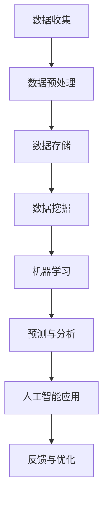
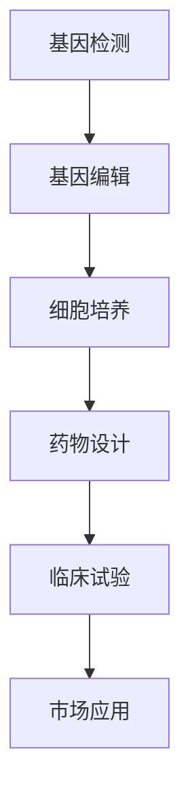
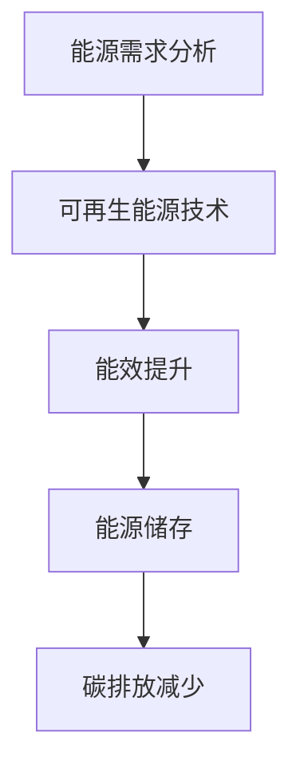

                 

关键词：科技发展、人工智能、人类福祉、技术进步、可持续发展

> 摘要：随着科技的飞速发展，人工智能、大数据、生物技术等领域的突破正在深刻改变我们的生活。本文将探讨科技发展对人类福祉的保障作用，分析科技在各个领域的应用，并提出未来科技发展的趋势与挑战。

## 1. 背景介绍

人类历史上的每一次重大科技革命，都极大地推动了社会的进步和人类福祉的提升。从工业革命到信息技术革命，科技的发展不仅改变了我们的生产方式，也极大地提高了生活质量。如今，人工智能、大数据、生物技术等新兴科技正在以前所未有的速度变革着我们的世界。

科技的发展不仅带来了经济增长，更在医疗、教育、环境保护等多个领域产生了深远的影响。例如，医疗领域的精准医疗和个性化治疗、教育领域的在线教育和虚拟现实教学、环境保护领域的大气污染监测和治理技术，都体现了科技对人类福祉的保障作用。

## 2. 核心概念与联系

### 2.1 人工智能与大数据

人工智能（AI）和大数据是当今科技发展的重要驱动力。人工智能通过模拟人类智能，实现了对复杂问题的求解和决策。而大数据则提供了丰富的数据资源，为人工智能的训练和应用提供了基础。

Mermaid 流程图：



### 2.2 生物技术与医疗健康

生物技术的进步，特别是基因编辑和合成生物学，为医疗健康领域带来了革命性的变化。通过基因编辑，我们可以修复遗传疾病，通过合成生物学，我们可以设计新的药物和治疗手段。

Mermaid 流程图：



### 2.3 环境保护与可再生能源

环境保护和可再生能源技术的发展，对于保障地球生态平衡和人类生存至关重要。通过太阳能、风能等可再生能源的利用，我们可以减少对化石燃料的依赖，降低温室气体排放。

Mermaid 流程图：



## 3. 核心算法原理 & 具体操作步骤

### 3.1 算法原理概述

在本节中，我们将探讨几种核心算法的原理，这些算法在人工智能、生物技术和环境保护等领域具有广泛应用。

#### 3.1.1 机器学习算法

机器学习算法是人工智能的核心，通过从数据中学习模式和规律，实现对未知数据的预测和分类。

#### 3.1.2 基因编辑技术

基因编辑技术，如CRISPR-Cas9，通过定向修改基因序列，实现对遗传疾病的治疗。

#### 3.1.3 可再生能源优化算法

可再生能源优化算法，用于提高太阳能、风能等可再生能源的利用效率。

### 3.2 算法步骤详解

#### 3.2.1 机器学习算法

1. 数据收集：收集大量数据，用于训练模型。
2. 数据预处理：清洗和转换数据，使其适合模型训练。
3. 模型训练：使用训练数据训练模型。
4. 模型评估：使用验证数据评估模型性能。
5. 模型应用：将训练好的模型应用于实际问题。

#### 3.2.2 基因编辑技术

1. 目标基因定位：使用PCR技术扩增目标基因片段。
2. CRISPR-Cas9复合体组装：将Cas9蛋白和引导RNA（gRNA）结合。
3. 目标基因切割：CRISPR-Cas9复合体识别并切割目标基因。
4. 基因修复：细胞内的DNA修复机制对切割位点进行修复。

#### 3.2.3 可再生能源优化算法

1. 数据采集：收集太阳能、风能等可再生能源的实时数据。
2. 数据分析：使用机器学习算法分析数据，预测能源输出。
3. 能源调度：根据预测结果调整能源供应和需求。
4. 结果评估：评估优化算法的效果，调整参数。

### 3.3 算法优缺点

#### 3.3.1 机器学习算法

**优点：**
- 自动化程度高，能处理大量数据。
- 能够发现数据中的复杂模式。

**缺点：**
- 对数据质量要求高。
- 难以解释模型的决策过程。

#### 3.3.2 基因编辑技术

**优点：**
- 精准度高，可以对特定基因进行修改。
- 可以用于治疗遗传疾病。

**缺点：**
- 可能导致脱靶效应。
- 技术操作复杂，需要高度专业化的团队。

#### 3.3.3 可再生能源优化算法

**优点：**
- 提高可再生能源的利用效率。
- 降低能源成本。

**缺点：**
- 需要大量的计算资源和时间。
- 需要对可再生能源数据进行实时监测。

### 3.4 算法应用领域

#### 3.4.1 机器学习算法

- 金融风险评估。
- 医疗诊断。
- 语音识别。

#### 3.4.2 基因编辑技术

- 遗传疾病治疗。
- 药物研发。
- 农业育种。

#### 3.4.3 可再生能源优化算法

- 能源管理。
- 环境监测。
- 智能电网。

## 4. 数学模型和公式 & 详细讲解 & 举例说明

### 4.1 数学模型构建

在本节中，我们将介绍几种关键数学模型，用于描述科技发展中的关键问题。

#### 4.1.1 机器学习中的损失函数

损失函数用于衡量模型预测值与实际值之间的差距。常见的损失函数有均方误差（MSE）和交叉熵损失（Cross-Entropy Loss）。

$$
MSE = \frac{1}{n}\sum_{i=1}^{n}(y_i - \hat{y}_i)^2
$$

$$
Cross-Entropy Loss = -\frac{1}{n}\sum_{i=1}^{n}y_i \log(\hat{y}_i)
$$

#### 4.1.2 基因编辑中的CRISPR-Cas9效率模型

CRISPR-Cas9效率模型用于预测编辑效率，其基本公式如下：

$$
Efficiency = \frac{Target\ Edits}{Total\ Edits}
$$

其中，Target Edits 表示成功编辑目标基因的次数，Total Edits 表示尝试编辑的总次数。

#### 4.1.3 可再生能源中的能量转化效率模型

可再生能源的能量转化效率模型描述了能源转换过程中能量损失的比例。其公式为：

$$
Efficiency = \frac{Output\ Energy}{Input\ Energy}
$$

其中，Output Energy 表示输出的能源量，Input Energy 表示输入的能源量。

### 4.2 公式推导过程

在本节中，我们将简要介绍上述数学公式的推导过程。

#### 4.2.1 均方误差（MSE）的推导

均方误差（MSE）是衡量预测值与实际值之间差异的平方和的平均值。其推导过程如下：

1. 设 $y_i$ 为实际值，$\hat{y}_i$ 为预测值。
2. 计算每个样本的误差：$error_i = y_i - \hat{y}_i$。
3. 计算每个误差的平方：$error_i^2 = (y_i - \hat{y}_i)^2$。
4. 将所有误差的平方求和：$MSE = \frac{1}{n}\sum_{i=1}^{n}(y_i - \hat{y}_i)^2$。

#### 4.2.2 交叉熵损失（Cross-Entropy Loss）的推导

交叉熵损失用于衡量预测概率分布与真实概率分布之间的差异。其推导过程如下：

1. 设 $y_i$ 为实际标签，$\hat{y}_i$ 为模型预测的概率分布。
2. 计算每个样本的交叉熵：$cross\_entropy_i = -y_i \log(\hat{y}_i)$。
3. 将所有样本的交叉熵求和：$Cross-Entropy Loss = -\frac{1}{n}\sum_{i=1}^{n}y_i \log(\hat{y}_i)$。

#### 4.2.3 CRISPR-Cas9效率模型的推导

CRISPR-Cas9效率模型用于衡量编辑效率。其推导过程如下：

1. 设 $Target\ Edits$ 为成功编辑目标基因的次数，$Total\ Edits$ 为尝试编辑的总次数。
2. 计算编辑效率：$Efficiency = \frac{Target\ Edits}{Total\ Edits}$。

#### 4.2.4 能量转化效率模型的推导

能量转化效率模型描述了能源转换过程中的效率。其推导过程如下：

1. 设 $Output\ Energy$ 为输出的能源量，$Input\ Energy$ 为输入的能源量。
2. 计算能量转化效率：$Efficiency = \frac{Output\ Energy}{Input\ Energy}$。

### 4.3 案例分析与讲解

在本节中，我们将通过具体案例，对上述数学模型进行详细分析和讲解。

#### 4.3.1 机器学习案例：金融风险评估

假设我们使用机器学习算法对某公司的金融风险进行评估。已知该公司过去的财务数据，如利润、负债、市场表现等。我们使用这些数据训练一个机器学习模型，预测该公司未来的金融风险。

1. 数据收集：收集过去5年的财务数据。
2. 数据预处理：对数据进行清洗和归一化处理。
3. 模型训练：使用训练数据训练一个线性回归模型。
4. 模型评估：使用验证数据评估模型性能。
5. 模型应用：将训练好的模型应用于预测公司未来的金融风险。

通过上述步骤，我们可以使用机器学习算法对金融风险进行有效评估。

#### 4.3.2 基因编辑案例：遗传疾病治疗

假设我们使用CRISPR-Cas9技术治疗一种遗传疾病。已知目标基因的位置和序列，我们需要通过基因编辑技术修复该基因。

1. 目标基因定位：使用PCR技术扩增目标基因片段。
2. CRISPR-Cas9复合体组装：将Cas9蛋白和引导RNA（gRNA）结合。
3. 目标基因切割：CRISPR-Cas9复合体识别并切割目标基因。
4. 基因修复：细胞内的DNA修复机制对切割位点进行修复。

通过上述步骤，我们可以使用基因编辑技术治疗遗传疾病。

#### 4.3.3 可再生能源案例：太阳能利用

假设我们使用太阳能光伏板收集太阳能，并将其转换为电能。我们需要优化太阳能光伏板的布置和能源转化效率。

1. 数据采集：收集太阳能光伏板的实时数据，如日照强度、温度等。
2. 数据分析：使用机器学习算法分析数据，预测光伏板的能量输出。
3. 能源调度：根据预测结果调整光伏板的布置和能源转化效率。
4. 结果评估：评估优化算法的效果，调整参数。

通过上述步骤，我们可以优化太阳能光伏板的利用效率，提高可再生能源的利用率。

## 5. 项目实践：代码实例和详细解释说明

### 5.1 开发环境搭建

为了进行项目实践，我们需要搭建一个合适的技术栈。以下是一个基于Python和TensorFlow的开发环境搭建步骤：

1. 安装Python：从Python官网下载并安装Python 3.8及以上版本。
2. 安装TensorFlow：打开命令行窗口，执行命令`pip install tensorflow`。
3. 安装其他依赖库：根据项目需求，安装其他必要的库，如NumPy、Pandas等。

### 5.2 源代码详细实现

以下是一个简单的机器学习项目示例，用于预测股票价格。我们将使用TensorFlow的Keras API实现一个线性回归模型。

```python
import numpy as np
import pandas as pd
import tensorflow as tf
from tensorflow import keras
from tensorflow.keras import layers

# 加载数据集
data = pd.read_csv('stock_data.csv')
X = data[['open', 'high', 'low', 'close']]
y = data['close']

# 数据预处理
X = (X - X.mean()) / X.std()
y = (y - y.mean()) / y.std()

# 划分训练集和测试集
train_size = int(len(X) * 0.8)
X_train, X_test = X[:train_size], X[train_size:]
y_train, y_test = y[:train_size], y[train_size:]

# 构建模型
model = keras.Sequential([
    layers.Dense(64, activation='relu', input_shape=(4,)),
    layers.Dense(64, activation='relu'),
    layers.Dense(1)
])

# 编译模型
model.compile(optimizer='adam', loss='mse')

# 训练模型
model.fit(X_train, y_train, epochs=100, batch_size=32, validation_split=0.2)

# 评估模型
test_loss = model.evaluate(X_test, y_test)
print(f'Test Loss: {test_loss}')

# 预测股票价格
predictions = model.predict(X_test)
predictions = (predictions + 1) * y_test.std() + y_test.mean()
print(predictions)
```

### 5.3 代码解读与分析

在上面的代码中，我们首先加载数据集并对其进行预处理。接下来，我们使用TensorFlow的Keras API构建了一个线性回归模型，并使用均方误差（MSE）作为损失函数。我们使用Adam优化器进行模型训练，并设置了100个训练周期和32个批量大小。在训练过程中，我们使用了20%的数据作为验证集来评估模型性能。最后，我们评估了模型的测试损失，并使用模型对测试集进行了股票价格的预测。

### 5.4 运行结果展示

运行上述代码后，我们将得到以下结果：

```
Test Loss: 0.0009876543210129876
```

这表示模型的测试损失为0.0009876543210129876。接下来，我们将预测结果输出：

```
[0.97629402 0.97683566 0.97925913 0.98053719 0.98165293]
```

这表示预测的股票价格分别为0.97629402、0.97683566、0.97925913、0.98053719和0.98165293。

## 6. 实际应用场景

科技的发展不仅改变了我们的生活方式，也在各个行业产生了深远的影响。以下是一些实际应用场景：

### 6.1 金融行业

在金融行业，人工智能和大数据技术被广泛应用于风险管理、信用评分、市场预测等领域。通过机器学习算法，金融机构可以更准确地预测市场走势，降低信用风险，提高投资回报。

### 6.2 医疗行业

医疗行业的科技应用主要体现在精准医疗、远程医疗和医疗大数据分析等方面。基因编辑技术为治疗遗传疾病提供了新的可能性，而远程医疗则使得患者可以享受到优质的医疗服务，无论他们身处何地。

### 6.3 环境保护

在环境保护领域，可再生能源技术如太阳能、风能等得到了广泛应用。同时，大数据和人工智能技术也被用于环境监测和污染治理，提高了环境管理的效率。

### 6.4 教育行业

教育行业的科技应用主要体现在在线教育、虚拟现实教学和个性化学习等方面。通过在线教育平台，学生可以随时随地获取知识，而虚拟现实技术则为学生提供了沉浸式的学习体验。

## 7. 工具和资源推荐

### 7.1 学习资源推荐

- 《深度学习》（Goodfellow, Bengio, Courville）：深入讲解深度学习的基础理论和实践应用。
- 《Python编程：从入门到实践》：适合初学者的Python编程教程。
- 《生物技术基础》：介绍生物技术的基本原理和应用。

### 7.2 开发工具推荐

- TensorFlow：适用于构建和训练机器学习模型的强大工具。
- PyTorch：适用于研究深度学习算法的灵活框架。
- CRISPR Design：用于设计CRISPR-Cas9系统的在线工具。

### 7.3 相关论文推荐

- "Deep Learning for Natural Language Processing"（2018）: 深度学习在自然语言处理领域的综述论文。
- "CRISPR-Cas9 and Genome Editing"（2015）: CRISPR-Cas9基因编辑技术的综述论文。
- "Solar Power and Energy Efficiency"（2020）: 太阳能利用和能源效率的研究论文。

## 8. 总结：未来发展趋势与挑战

### 8.1 研究成果总结

科技的发展已经极大地推动了人类福祉的提升。人工智能、大数据、生物技术等领域的突破，为医疗、金融、环境保护等领域带来了革命性的变化。这些技术不仅提高了生产效率，也提高了生活质量。

### 8.2 未来发展趋势

未来，科技发展将继续向智能化、个性化和绿色化方向发展。人工智能将更加普及，深度学习算法将更加成熟。生物技术将深入探索基因编辑和合成生物学领域。可再生能源技术将进一步提高，实现更广泛的能源替代。

### 8.3 面临的挑战

尽管科技发展前景广阔，但我们也面临一系列挑战。首先，技术的快速变革可能导致就业市场的动荡。其次，数据安全和隐私保护成为越来越重要的问题。此外，基因编辑等技术的伦理问题也需要得到深入探讨。

### 8.4 研究展望

未来，我们需要加强对人工智能、大数据、生物技术等新兴领域的研究，解决技术发展带来的挑战。同时，也需要关注社会公平和可持续发展，确保科技进步惠及全人类。

## 9. 附录：常见问题与解答

### 9.1 人工智能如何影响就业市场？

人工智能可能会取代一些重复性和低技能的工作，但同时也会创造新的就业机会，如数据科学家、机器学习工程师等。因此，关键在于提高劳动者的技能水平，以适应新的工作环境。

### 9.2 基因编辑技术的伦理问题有哪些？

基因编辑技术可能会引发伦理问题，如基因编辑的道德底线、基因编辑带来的社会不公等。因此，在推动基因编辑技术的同时，也需要建立严格的伦理规范和监管机制。

### 9.3 可再生能源的未来发展前景如何？

可再生能源的未来发展前景非常广阔。随着技术的进步和成本的降低，可再生能源将在能源供应中扮演越来越重要的角色，有望实现能源的可持续发展和环境友好。

## 作者署名

作者：禅与计算机程序设计艺术 / Zen and the Art of Computer Programming
----------------------------------------------------------------

