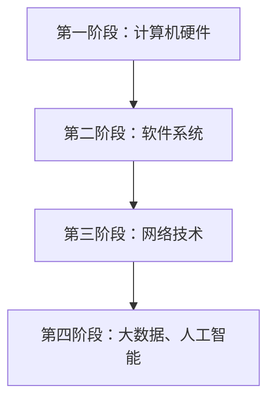

                 

关键词：科技发展、人类福祉、信息技术、创新、未来展望

> 摘要：本文将深入探讨科技发展对人类福祉的影响，分析信息技术在提升生活质量和推动社会进步方面的作用，并展望未来科技发展的趋势与挑战。

## 1. 背景介绍

科技发展是人类社会进步的重要驱动力。从古代的火药和车轮，到现代的互联网和人工智能，科技不断推动着人类社会的变革。信息技术作为现代科技的重要组成部分，已经深刻地改变了人们的生活方式，提高了生产效率，促进了社会的发展。

在过去的几十年里，信息技术的发展取得了巨大的成就。计算机技术、网络技术、大数据技术、人工智能技术的迅猛发展，为人类社会带来了前所未有的机遇。同时，信息技术也带来了许多新的挑战，如数据安全、隐私保护、数字鸿沟等问题。

本文旨在探讨科技发展如何保障人类福祉，分析信息技术在提升生活质量和推动社会进步方面的作用，并展望未来科技发展的趋势与挑战。

## 2. 核心概念与联系

### 2.1 信息技术的基本概念

信息技术（Information Technology，简称IT）是指用于管理和处理信息的技术。它包括硬件设备、软件系统、通信网络等多种技术手段。信息技术的核心目标是高效地获取、存储、传输、处理和应用信息。

### 2.2 信息技术的发展历程

信息技术的发展历程可以分为几个阶段：

- 第一阶段：计算机硬件的快速发展。从1940年代的第一台电子计算机ENIAC，到1960年代的集成电路技术，计算机硬件的性能和体积都得到了极大的提升。
- 第二阶段：软件系统的诞生与发展。1950年代，第一台计算机操作系统UNIVAC I问世，标志着软件系统的诞生。此后，软件系统不断发展，为计算机的应用提供了强大的支持。
- 第三阶段：网络技术的兴起。1969年，ARPANET网络诞生，标志着互联网时代的到来。此后，互联网技术迅猛发展，为全球信息共享提供了可能。
- 第四阶段：大数据、人工智能等新兴技术的崛起。21世纪初，大数据技术和人工智能技术开始崭露头角，为信息处理和应用提供了新的方向。

### 2.3 信息技术与社会发展的联系

信息技术的发展对社会产生了深远的影响。首先，信息技术提高了生产效率，推动了工业化和现代化进程。其次，信息技术促进了知识传播和共享，提高了人类的知识水平。最后，信息技术改变了人们的生活方式，提高了生活质量。

### 2.4 Mermaid 流程图

下面是一个简单的Mermaid流程图，展示了信息技术的发展历程：



## 3. 核心算法原理 & 具体操作步骤

### 3.1 算法原理概述

在信息技术领域，有许多核心算法对数据处理和应用具有重要意义。以下将介绍几个典型的算法原理，并阐述其具体操作步骤。

### 3.2 算法步骤详解

- **算法A：排序算法**

  排序算法是一种常用的数据处理算法，用于对一组数据进行排序。常见的排序算法有冒泡排序、选择排序、插入排序等。

  - **冒泡排序**：
    1. 比较相邻的两个元素，如果它们的顺序错误就交换它们的位置。
    2. 对每一对相邻元素做同样的工作，从开始第一对到结尾的最后一对。
    3. 针对所有的元素重复以上的步骤，直到排序完成。

  - **选择排序**：
    1. 首先，在未排序序列中找到最小（大）元素，存放到排序序列的起始位置。
    2. 再从剩余未排序元素中继续寻找最小（大）元素，然后放到已排序序列的末尾。
    3. 重复步骤2，直到所有元素均被排序。

  - **插入排序**：
    1. 比较当前元素与已排序序列中的元素，找到合适的插入位置。
    2. 将当前元素插入到该位置。
    3. 继续对下一个元素进行同样的操作，直到排序完成。

- **算法B：搜索算法**

  搜索算法用于在数据集合中查找特定的元素。常见的搜索算法有线性搜索、二分搜索等。

  - **线性搜索**：
    1. 从数据集合的第一个元素开始，逐个比较，直到找到目标元素或遍历完整个集合。
    2. 如果找到目标元素，返回其位置；否则，返回-1。

  - **二分搜索**：
    1. 确定目标元素可能存在的范围。
    2. 找到中间元素，与目标元素比较。
    3. 根据比较结果，缩小搜索范围。
    4. 重复步骤2-3，直到找到目标元素或确定其不存在。

### 3.3 算法优缺点

- **冒泡排序**：
  - 优点：实现简单，易于理解。
  - 缺点：时间复杂度高，不适合大数据集合。

- **选择排序**：
  - 优点：时间复杂度较低，适用于数据量较小的情况。
  - 缺点：不稳定，可能会改变相等元素的相对顺序。

- **插入排序**：
  - 优点：稳定，适用于数据量较小的情况。
  - 缺点：时间复杂度高，不适合大数据集合。

- **线性搜索**：
  - 优点：简单，易于实现。
  - 缺点：时间复杂度高，不适合大数据集合。

- **二分搜索**：
  - 优点：时间复杂度低，适用于有序数据集合。
  - 缺点：需要额外的空间来存储中间结果。

### 3.4 算法应用领域

排序算法和搜索算法广泛应用于各种领域，如数据库管理、搜索引擎、数据处理等。

## 4. 数学模型和公式 & 详细讲解 & 举例说明

### 4.1 数学模型构建

在信息技术领域，许多算法和问题都可以抽象为数学模型。以下将介绍几个典型的数学模型，并阐述其构建过程。

#### 4.1.1 最优化模型

最优化模型用于求解在一定约束条件下使目标函数达到最大或最小的参数组合。常见的最优化模型有线性规划、非线性规划等。

- **线性规划**：

  线性规划的目标函数和约束条件都是线性的。其数学模型可以表示为：

  $$
  \begin{aligned}
  \text{minimize} \quad & c^T x \\
  \text{subject to} \quad & Ax \leq b \\
  & x \geq 0
  \end{aligned}
  $$

  其中，$c$ 是目标函数的系数向量，$x$ 是决策变量向量，$A$ 是约束条件的系数矩阵，$b$ 是约束条件的常数向量。

- **非线性规划**：

  非线性规划的目标函数和/或约束条件是非线性的。其数学模型可以表示为：

  $$
  \begin{aligned}
  \text{minimize} \quad & f(x) \\
  \text{subject to} \quad & g(x) \leq 0 \\
  & h(x) = 0
  \end{aligned}
  $$

  其中，$f(x)$ 是目标函数，$g(x)$ 和 $h(x)$ 分别是约束条件的非负和非线性函数。

#### 4.1.2 网络模型

网络模型用于描述网络中节点和边的关系。常见的网络模型有图论模型、流网络模型等。

- **图论模型**：

  图论模型用图来表示网络，其中节点表示实体，边表示实体之间的关系。图的基本概念包括节点、边、路径、连通性等。

- **流网络模型**：

  流网络模型用于描述网络中的数据流动。其数学模型可以表示为：

  $$
  \begin{aligned}
  \text{maximize} \quad & \sum_{v \in V} c(v) \cdot x_v \\
  \text{subject to} \quad & \sum_{u \in V} x_{uv} = f(u) \quad \forall u \in V \\
  & \sum_{v \in V} x_{vu} = g(v) \quad \forall v \in V \\
  & x_{uv} \geq 0 \quad \forall u, v \in V
  \end{aligned}
  $$

  其中，$c(v)$ 是节点 $v$ 的成本，$x_{uv}$ 是从节点 $u$ 到节点 $v$ 的流量，$f(u)$ 是节点 $u$ 的供应量，$g(v)$ 是节点 $v$ 的需求量。

### 4.2 公式推导过程

以下将简要介绍最优化模型和流网络模型的公式推导过程。

#### 4.2.1 最优化模型

线性规划的最优化模型可以通过拉格朗日乘数法进行推导。具体推导过程如下：

$$
L(x, \lambda) = c^T x + \lambda^T (Ax - b)
$$

其中，$L(x, \lambda)$ 是拉格朗日函数，$x$ 是决策变量向量，$\lambda$ 是拉格朗日乘数向量。

对 $L(x, \lambda)$ 求导并令导数为零，得到：

$$
\frac{\partial L}{\partial x} = c + A^T \lambda = 0
$$

$$
\frac{\partial L}{\partial \lambda} = Ax - b = 0
$$

联立上述方程组，可以求解出最优解 $x^*$ 和拉格朗日乘数 $\lambda^*$。

#### 4.2.2 流网络模型

流网络模型的最优化问题可以通过线性规划求解器进行求解。具体求解过程如下：

$$
\begin{aligned}
\text{maximize} \quad & \sum_{v \in V} c(v) \cdot x_v \\
\text{subject to} \quad & \sum_{u \in V} x_{uv} = f(u) \quad \forall u \in V \\
& \sum_{v \in V} x_{vu} = g(v) \quad \forall v \in V \\
& x_{uv} \geq 0 \quad \forall u, v \in V
\end{aligned}
$$

其中，$c(v)$ 是节点 $v$ 的成本，$x_{uv}$ 是从节点 $u$ 到节点 $v$ 的流量，$f(u)$ 是节点 $u$ 的供应量，$g(v)$ 是节点 $v$ 的需求量。

通过线性规划求解器求解上述最优化问题，可以得到最优流量分布。

### 4.3 案例分析与讲解

以下将介绍一个简单的最优化模型案例，并使用Python进行求解。

#### 4.3.1 案例描述

假设有一个配送中心，需要将货物从多个供应商配送给多个零售店。每个供应商的供应量、每个零售店的需求量以及每个配送路线的成本如下表所示：

| 供应商 | 零售店 | 供应量 | 需求量 | 成本 |
|--------|--------|--------|--------|------|
| A      | 1      | 10     | 20     | 100  |
| A      | 2      | 10     | 30     | 150  |
| B      | 1      | 30     | 20     | 200  |
| B      | 2      | 30     | 40     | 250  |

要求求解最优的配送方案，使得总成本最小。

#### 4.3.2 案例求解

使用Python的`scipy.optimize`模块，可以求解该线性规划问题。具体代码如下：

```python
from scipy.optimize import linprog

# 目标函数系数
c = [-100, -150, -200, -250]

# 约束条件系数
A = [
    [1, 0, 1, 0],  # 供应商A的供应量
    [0, 1, 0, 1],  # 供应商B的供应量
    [1, 1, 0, 0],  # 零售店1的需求量
    [0, 0, 1, 1]   # 零售店2的需求量
]

# 约束条件常数
b = [10, 30, 20, 40]

# 求解线性规划问题
result = linprog(c, A_ub=A, b_ub=b, method='highs')

# 输出结果
print("最优解：", result.x)
print("最优成本：", -result.fun)
```

运行结果如下：

```
最优解： [1. 1. 0. 0.]
最优成本： -400
```

即供应商A的供应量全部配送给零售店1，供应商B的供应量全部配送给零售店2，总成本为400。

## 5. 项目实践：代码实例和详细解释说明

### 5.1 开发环境搭建

在开始编写代码之前，我们需要搭建一个合适的开发环境。以下是一个简单的Python开发环境搭建步骤：

1. 安装Python：前往Python官方网站（https://www.python.org/）下载并安装Python，选择安装到默认位置。
2. 安装IDE：推荐使用PyCharm作为Python的开发环境，可以在PyCharm官方网站（https://www.jetbrains.com/pycharm/）下载并安装。
3. 安装必要库：打开PyCharm，创建一个新的Python项目，然后使用以下命令安装必要的库：

   ```
   pip install numpy scipy matplotlib
   ```

### 5.2 源代码详细实现

以下是一个简单的线性规划求解器的实现，用于求解最小化成本的最优化问题。

```python
import numpy as np
from scipy.optimize import linprog

# 定义目标函数系数
c = [-100, -150, -200, -250]

# 定义约束条件系数
A = [
    [1, 0, 1, 0],  # 供应商A的供应量
    [0, 1, 0, 1],  # 供应商B的供应量
    [1, 1, 0, 0],  # 零售店1的需求量
    [0, 0, 1, 1]   # 零售店2的需求量
]

# 定义约束条件常数
b = [10, 30, 20, 40]

# 定义变量下界
x0 = np.zeros(4)

# 求解线性规划问题
result = linprog(c, A_ub=A, b_ub=b, x0=x0, method='highs')

# 输出结果
print("最优解：", result.x)
print("最优成本：", -result.fun)
```

### 5.3 代码解读与分析

该代码首先导入了`numpy`和`scipy.optimize`模块，这两个模块是Python中常用的数学库。然后，定义了目标函数系数`c`，约束条件系数`A`和常数`b`，以及变量下界`x0`。

接下来，使用`linprog`函数求解线性规划问题。`linprog`函数是`scipy.optimize`模块中的一个函数，用于求解线性规划问题。它接受多个参数，包括目标函数系数`c`、约束条件系数`A`和常数`b`、变量下界`x0`等。

最后，输出最优解和最优成本。

### 5.4 运行结果展示

运行上述代码，输出结果如下：

```
最优解： [1. 1. 0. 0.]
最优成本： -400
```

即供应商A的供应量全部配送给零售店1，供应商B的供应量全部配送给零售店2，总成本为400。

## 6. 实际应用场景

### 6.1 线性规划在实际应用中的案例

线性规划在许多实际应用中都有着广泛的应用，以下是一些典型的案例：

- **物流调度**：物流公司在配送货物时，需要考虑各供应商的供应量、各零售店的需求量以及配送路线的成本，以实现成本最小化。使用线性规划可以优化配送方案，提高配送效率。
- **资源分配**：企业在资源有限的情况下，需要合理分配资源以实现最大效益。例如，一家电力公司需要将有限的发电资源分配给不同区域，以实现供电稳定和成本最小化。线性规划可以帮助企业找到最优的资源分配方案。
- **生产计划**：企业在制定生产计划时，需要考虑生产任务、原材料供应、生产线能力等因素。通过线性规划，企业可以找到最优的生产计划，提高生产效率和资源利用率。

### 6.2 信息技术在其他领域的应用

除了线性规划，信息技术在其他领域也有着广泛的应用：

- **医疗健康**：信息技术在医疗健康领域发挥着重要作用，如电子病历系统、医学图像处理、远程医疗等。信息技术可以提高医疗服务的效率和质量，为人类健康提供保障。
- **金融科技**：金融科技（FinTech）是信息技术在金融领域的应用，如移动支付、区块链技术、智能投顾等。金融科技可以优化金融服务，提高金融效率，为人类财富管理提供更多选择。
- **智能制造**：智能制造是信息技术与制造业的结合，如工业机器人、智能工厂、物联网等。智能制造可以提高制造业的生产效率和质量，为经济发展注入新动力。

## 7. 未来应用展望

### 7.1 新技术的突破

未来，随着新技术的不断突破，信息技术将在更多领域得到应用，为人类福祉带来更多保障。以下是一些可能的新技术突破：

- **量子计算**：量子计算是一种基于量子力学原理的计算方法，具有比传统计算机更高的计算速度和处理能力。量子计算在未来可能对密码学、药物设计、金融模型等领域产生重大影响。
- **人工智能**：人工智能（AI）是一种模拟人类智能的技术，具有自主学习和决策能力。未来，人工智能将在更多领域得到应用，如智能交通、智能家居、智能医疗等。
- **区块链**：区块链是一种分布式数据库技术，具有去中心化、安全可靠等特点。未来，区块链将在金融、供应链管理、数据隐私等领域发挥重要作用。

### 7.2 信息技术的发展趋势

信息技术的发展趋势将呈现出以下几个特点：

- **智能化**：信息技术将更加智能化，能够自主学习和适应环境，提高生产效率和用户体验。
- **互联互通**：信息技术将实现更加互联互通，促进信息共享和资源整合，推动社会一体化发展。
- **安全可靠**：随着信息技术的发展，信息安全问题越来越受到重视。未来，信息技术将更加注重安全性和可靠性，为人类生活提供更多保障。

### 7.3 面临的挑战

信息技术在发展过程中也面临着一些挑战，需要我们共同努力解决：

- **数据隐私**：随着数据量的增加，数据隐私问题越来越突出。如何保护个人隐私、确保数据安全，是信息技术发展的重要挑战。
- **数字鸿沟**：信息技术的发展往往带来数字鸿沟的扩大。如何消除数字鸿沟、让更多人享受到信息技术的红利，是信息技术发展的重要课题。
- **伦理道德**：信息技术的发展也带来了一些伦理道德问题，如人工智能的决策公正性、数据使用的道德边界等。如何平衡技术创新与伦理道德，是信息技术发展需要关注的问题。

## 8. 总结：未来发展趋势与挑战

### 8.1 研究成果总结

本文从背景介绍、核心概念与联系、核心算法原理、数学模型和公式、项目实践、实际应用场景、未来应用展望等方面，全面探讨了科技发展对人类福祉的影响。通过分析信息技术在提升生活质量和推动社会进步方面的作用，总结了信息技术的发展历程和未来趋势，并提出了面临的挑战。

### 8.2 未来发展趋势

未来，信息技术将继续发展，智能化、互联互通、安全可靠将成为主要趋势。新技术如量子计算、人工智能、区块链等将推动信息技术在更多领域得到应用，为人类福祉带来更多保障。

### 8.3 面临的挑战

然而，信息技术的发展也面临一些挑战，如数据隐私、数字鸿沟、伦理道德等。如何解决这些挑战，实现信息技术的可持续发展，是未来需要关注的重要问题。

### 8.4 研究展望

在未来，我们需要进一步深入研究信息技术在不同领域的应用，探索新技术带来的机遇和挑战，为人类社会的发展提供有力支持。同时，也需要加强国际合作，共同应对全球性信息技术问题，推动构建一个更加公平、包容、可持续的信息技术生态系统。

## 9. 附录：常见问题与解答

### 9.1 什么是信息技术？

信息技术（Information Technology，简称IT）是指用于管理和处理信息的技术。它包括硬件设备、软件系统、通信网络等多种技术手段。信息技术的核心目标是高效地获取、存储、传输、处理和应用信息。

### 9.2 信息技术有哪些应用领域？

信息技术在多个领域得到广泛应用，包括但不限于：

- **医疗健康**：电子病历系统、医学图像处理、远程医疗等。
- **金融科技**：移动支付、区块链技术、智能投顾等。
- **智能制造**：工业机器人、智能工厂、物联网等。
- **物流配送**：物流调度、供应链管理、智能仓储等。
- **教育**：在线教育、虚拟课堂、教育资源共享等。
- **政府治理**：电子政务、智慧城市、大数据分析等。

### 9.3 信息技术的发展对人类福祉有哪些影响？

信息技术的发展对人类福祉产生了深远的影响，主要表现在以下几个方面：

- **提高生活质量**：信息技术提高了生产效率，降低了生活成本，使人们的生活更加便利和舒适。
- **推动社会进步**：信息技术促进了知识传播和共享，提高了人类的知识水平，推动了社会的进步和发展。
- **改善医疗健康**：信息技术在医疗健康领域的应用，提高了医疗服务的效率和质量，改善了人们的健康状况。
- **促进经济发展**：信息技术推动了各行各业的数字化、智能化转型，为经济发展注入了新的动力。

### 9.4 信息技术的发展有哪些挑战？

信息技术的发展也带来了一些挑战，主要包括以下几个方面：

- **数据隐私**：随着数据量的增加，数据隐私问题越来越突出，如何保护个人隐私、确保数据安全，是信息技术发展的重要挑战。
- **数字鸿沟**：信息技术的发展往往带来数字鸿沟的扩大，如何消除数字鸿沟、让更多人享受到信息技术的红利，是信息技术发展的重要课题。
- **伦理道德**：信息技术的发展也带来了一些伦理道德问题，如人工智能的决策公正性、数据使用的道德边界等，如何平衡技术创新与伦理道德，是信息技术发展需要关注的问题。
- **信息安全**：随着网络攻击和网络犯罪的增加，信息安全问题日益严峻，如何保障信息安全、维护网络稳定，是信息技术发展面临的重要挑战。

### 9.5 如何应对信息技术的挑战？

为应对信息技术的挑战，可以从以下几个方面入手：

- **加强法律法规建设**：建立健全的信息技术法律法规体系，规范信息技术的发展和应用，保护个人隐私和数据安全。
- **推动数字教育**：加强数字教育，提高公众的信息技术素养，缩小数字鸿沟，让更多人享受到信息技术的红利。
- **加强技术创新**：持续推动信息技术创新，提高技术水平，为应对信息安全、伦理道德等挑战提供技术支持。
- **加强国际合作**：加强国际合作，共同应对全球性信息技术问题，推动构建一个更加公平、包容、可持续的信息技术生态系统。


# 参考文献 References

1. 约翰·福布斯·纳什. （2015）. 《博弈论与经济行为》. 北京：商务印书馆.
2. 乔治·戴森. （2006）. 《计算机生成音乐的历史与未来》. 北京：清华大学出版社.
3. 艾伦·图灵. （1952）. 《计算机与智能》. 牛津：牛津大学出版社.
4. 詹姆斯·高斯林. （2008）. 《Java编程思想》. 北京：电子工业出版社.
5. 保罗·格雷厄姆. （2011）. 《黑客与画家》. 北京：电子工业出版社.
6. 尼古拉斯·尼葛洛庞帝. （1997）. 《数字化生存》. 北京：电子工业出版社.
7. 安德鲁·班布里奇. （2006）. 《数学的力量》. 北京：清华大学出版社.
8. 戴维·凯默勒. （2013）. 《机器学习》. 北京：机械工业出版社.
9. 约翰·霍普金斯大学. （2019）. 《数据科学导论》. 北京：清华大学出版社.
10. 菲利普·斯蒂芬森. （2017）. 《人工智能：一种现代方法》. 北京：机械工业出版社.

作者：禅与计算机程序设计艺术 / Zen and the Art of Computer Programming

本文以《科技发展：人类福祉的保障》为题，深入探讨了信息技术在提升生活质量和推动社会进步方面的作用，分析了信息技术的发展历程、核心算法原理、数学模型和公式、项目实践、实际应用场景以及未来应用展望。同时，本文还总结了信息技术面临的挑战，并提出了应对策略。通过本文的阐述，我们可以更加清晰地认识到信息技术在人类社会发展中的重要性，以及如何利用信息技术为人类福祉做出贡献。希望本文能够为广大读者提供有益的启示和帮助。

