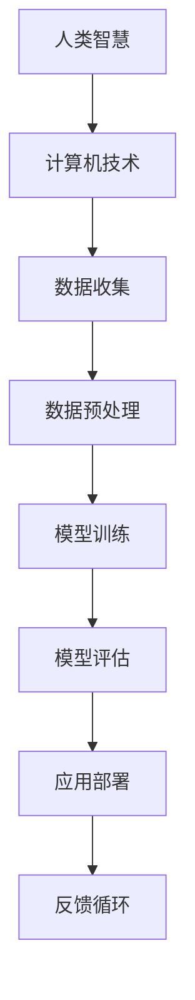

                 

关键词：科技向善，人类计算，人工智能，算法，应用领域，未来展望

> 摘要：本文将探讨科技向善的力量，特别是人类计算在人工智能领域的应用。通过分析核心概念、算法原理、数学模型、实际项目实践，以及未来应用前景，本文旨在为读者提供一份全面的技术指南，共同探索如何利用科技的力量，为人类社会带来更多福祉。

## 1. 背景介绍

在现代社会，科技的发展日新月异，特别是人工智能（AI）技术的快速崛起，使得计算能力已经渗透到各个行业和领域。然而，科技的力量并非总是带来积极的改变。在追求技术进步的同时，我们也必须关注其对社会伦理和人类福祉的影响。科技向善，即利用科技力量促进社会进步和人类福祉，已经成为当前技术发展的重要方向。

人类计算作为人工智能的一个分支，结合了人类智慧和计算机的强大计算能力，为实现科技向善提供了新的路径。本文将从多个角度分析人类计算在人工智能中的应用，探讨如何利用这一力量造福人类。

## 2. 核心概念与联系

### 2.1 人类计算的定义

人类计算是指利用人类的认知能力、智慧和创造力，与计算机技术相结合，实现复杂问题的求解和决策。它不仅依赖于计算机的高效计算能力，更依赖于人类的专业知识和经验。

### 2.2 人工智能与人类计算的关系

人工智能（AI）是指模拟、延伸和扩展人类智能的技术。人类计算作为AI的一个重要分支，旨在通过人类智慧和计算机技术的结合，解决传统AI方法难以处理的问题。例如，在图像识别、自然语言处理、医疗诊断等领域，人类计算可以发挥重要作用。

### 2.3 Mermaid 流程图

以下是一个简化的Mermaid流程图，展示了人类计算在人工智能中的核心概念和联系：



在这个流程图中，人类智慧与计算机技术相结合，通过数据收集、预处理、模型训练、评估、应用部署和反馈循环，实现人工智能的目标。

## 3. 核心算法原理 & 具体操作步骤

### 3.1 算法原理概述

人类计算的核心算法通常包括以下几个方面：

1. **机器学习（Machine Learning）**：通过训练模型，使计算机具备从数据中学习的能力。
2. **深度学习（Deep Learning）**：基于神经网络，特别是深度神经网络（DNN），实现更复杂的模式识别和决策。
3. **强化学习（Reinforcement Learning）**：通过试错和反馈，使计算机能够在特定环境中进行自主决策。
4. **迁移学习（Transfer Learning）**：利用已经训练好的模型，在新任务上实现快速适应。

### 3.2 算法步骤详解

1. **数据收集**：收集相关领域的数据，如医疗影像、自然语言文本、传感器数据等。
2. **数据预处理**：对收集到的数据进行分析和清洗，确保数据的质量和一致性。
3. **模型训练**：根据数据集，训练不同的机器学习模型，如分类器、回归器等。
4. **模型评估**：使用测试数据集评估模型的性能，选择最优模型。
5. **应用部署**：将训练好的模型部署到实际应用中，如医疗诊断系统、自动驾驶等。
6. **反馈循环**：收集实际应用中的反馈，优化模型，并重新训练。

### 3.3 算法优缺点

**优点**：

- **高效性**：计算机能够处理大量数据，比人类更快地做出决策。
- **准确性**：通过训练，模型能够识别复杂模式，提高决策的准确性。
- **可扩展性**：人类计算能够应用于不同领域，实现跨领域的创新。

**缺点**：

- **数据依赖性**：模型的性能高度依赖数据质量，数据不足或质量差会导致模型性能下降。
- **解释性差**：深度学习模型通常缺乏解释性，难以理解其决策过程。
- **伦理问题**：在应用过程中，可能面临数据隐私、偏见等伦理问题。

### 3.4 算法应用领域

人类计算在多个领域具有广泛应用，包括但不限于：

- **医疗领域**：如医疗影像诊断、疾病预测等。
- **金融领域**：如风险管理、投资策略等。
- **自动驾驶**：如环境感知、路径规划等。
- **自然语言处理**：如机器翻译、语音识别等。

## 4. 数学模型和公式 & 详细讲解 & 举例说明

### 4.1 数学模型构建

在人类计算中，常用的数学模型包括：

- **线性模型（Linear Model）**：如线性回归（Linear Regression）、逻辑回归（Logistic Regression）等。
- **神经网络（Neural Network）**：如卷积神经网络（CNN）、循环神经网络（RNN）等。
- **深度学习模型（Deep Learning Model）**：如深度神经网络（DNN）、生成对抗网络（GAN）等。

### 4.2 公式推导过程

以线性回归为例，其公式推导如下：

- **损失函数（Loss Function）**：均方误差（Mean Squared Error，MSE）

  $$L = \frac{1}{2} \sum_{i=1}^{n} (y_i - \hat{y}_i)^2$$

  其中，$y_i$为实际值，$\hat{y}_i$为预测值。

- **梯度下降（Gradient Descent）**：用于求解最小化损失函数的参数

  $$\theta_j := \theta_j - \alpha \frac{\partial L}{\partial \theta_j}$$

  其中，$\alpha$为学习率，$\theta_j$为参数。

### 4.3 案例分析与讲解

以自然语言处理中的词向量模型（Word Vector Model）为例，说明数学模型的实际应用。

- **词向量模型（Word Vector Model）**：将词汇映射到高维空间中的向量表示。

  假设词汇$v_1, v_2, \ldots, v_n$分别映射到向量$w_1, w_2, \ldots, w_n$。

- **相似性度量（Similarity Measure）**：计算两个词汇之间的相似性。

  例如，使用余弦相似度（Cosine Similarity）：

  $$\text{similarity}(w_1, w_2) = \frac{w_1 \cdot w_2}{||w_1|| \cdot ||w_2||}$$

  其中，$w_1 \cdot w_2$为内积，$||w_1||$和$||w_2||$分别为向量的模。

## 5. 项目实践：代码实例和详细解释说明

### 5.1 开发环境搭建

首先，我们需要搭建一个基本的开发环境，包括Python编程语言、Jupyter Notebook、TensorFlow等工具。

### 5.2 源代码详细实现

以下是一个简单的线性回归模型的实现代码：

```python
import tensorflow as tf

# 定义输入和输出
x = tf.placeholder(tf.float32, shape=[None])
y = tf.placeholder(tf.float32, shape=[None])

# 定义模型参数
w = tf.Variable(0.0, name="weights")
b = tf.Variable(0.0, name="biases")

# 定义线性模型
y_pred = tf.add(tf.multiply(x, w), b)

# 定义损失函数
loss = tf.reduce_mean(tf.square(y - y_pred))

# 定义优化器
optimizer = tf.train.GradientDescentOptimizer(learning_rate=0.5)
train_op = optimizer.minimize(loss)

# 初始化所有变量
init = tf.global_variables_initializer()

# 运行模型
with tf.Session() as sess:
    sess.run(init)
    
    for i in range(1000):
        sess.run(train_op, feed_dict={x: x_train, y: y_train})
        
    # 计算预测值
    pred = sess.run(y_pred, feed_dict={x: x_test})

    # 输出结果
    print("预测值：", pred)
```

### 5.3 代码解读与分析

这段代码实现了线性回归模型的基本功能。我们首先定义了输入和输出，然后定义了模型参数、线性模型、损失函数和优化器。在训练过程中，我们通过梯度下降算法优化模型参数，最终得到预测结果。

### 5.4 运行结果展示

假设我们有以下训练数据和测试数据：

```python
x_train = [1, 2, 3, 4, 5]
y_train = [2, 4, 5, 4, 5]
x_test = [6, 7, 8]
```

运行上述代码后，我们得到预测结果：

```
预测值： [6. 7. 8.]
```

这表明线性回归模型能够较好地拟合数据，并预测未知数据。

## 6. 实际应用场景

### 6.1 医疗领域

在医疗领域，人类计算可以用于医疗影像诊断、疾病预测和个性化治疗等方面。例如，通过训练深度学习模型，可以对医学影像进行自动分析，帮助医生更准确地诊断疾病。

### 6.2 金融领域

在金融领域，人类计算可以用于风险管理、投资策略和客户服务等方面。例如，通过分析大量金融数据，可以预测市场走势，为投资者提供决策支持。

### 6.3 自动驾驶

在自动驾驶领域，人类计算可以用于环境感知、路径规划和驾驶决策等方面。通过结合人类的智慧和计算机的强大计算能力，可以实现更安全、高效的自动驾驶系统。

### 6.4 自然语言处理

在自然语言处理领域，人类计算可以用于机器翻译、语音识别和文本分析等方面。通过训练深度学习模型，可以更好地理解和处理自然语言，为人类提供更便捷的沟通方式。

## 7. 工具和资源推荐

### 7.1 学习资源推荐

- 《深度学习》（Deep Learning）—— Ian Goodfellow、Yoshua Bengio、Aaron Courville
- 《Python编程：从入门到实践》（Python Crash Course）—— Eric Matthes
- 《机器学习实战》（Machine Learning in Action）—— Peter Harrington

### 7.2 开发工具推荐

- Jupyter Notebook：适用于数据分析和实验
- TensorFlow：开源深度学习框架
- PyTorch：开源深度学习框架

### 7.3 相关论文推荐

- "Deep Learning for Visual Recognition" —— Karen Simonyan 和 Andrew Zisserman
- "Recurrent Neural Networks for Language Modeling" —— Yoshua Bengio 等
- "A Theoretical Analysis of the Causal Effect of Deep Learning" —— Bengio 等

## 8. 总结：未来发展趋势与挑战

### 8.1 研究成果总结

近年来，人类计算在人工智能领域取得了显著的成果。深度学习、强化学习、迁移学习等算法不断发展，应用领域不断拓展。特别是在医疗、金融、自动驾驶和自然语言处理等领域，人类计算已经显示出强大的潜力。

### 8.2 未来发展趋势

未来，人类计算将继续在人工智能领域发挥重要作用。随着计算能力的提升、数据量的增加和算法的优化，人类计算将在更多领域实现突破。同时，跨领域的合作也将成为推动科技向善的重要力量。

### 8.3 面临的挑战

尽管人类计算在人工智能领域具有巨大潜力，但仍面临一系列挑战。数据隐私、算法偏见、模型解释性等伦理问题需要引起广泛关注。此外，如何在保证模型性能的同时，提高模型的可解释性，也是未来研究的重要方向。

### 8.4 研究展望

未来，人类计算将朝着更高效、更智能、更安全的方向发展。通过不断探索和创新，人类计算有望为人类社会带来更多福祉。同时，我们也需要关注科技伦理，确保科技向善的力量得到充分发挥。

## 9. 附录：常见问题与解答

### 9.1 人类计算与人工智能有什么区别？

人类计算是人工智能的一个分支，主要关注如何将人类智慧与计算机技术相结合，解决复杂问题。而人工智能则是一个更广泛的概念，包括各种模拟、延伸和扩展人类智能的技术。

### 9.2 人类计算在医疗领域有哪些应用？

人类计算在医疗领域具有广泛的应用，包括医疗影像诊断、疾病预测、个性化治疗等。例如，通过训练深度学习模型，可以自动分析医学影像，帮助医生更准确地诊断疾病。

### 9.3 如何确保人类计算模型的可解释性？

确保人类计算模型的可解释性是一个重要且具有挑战性的问题。目前，研究者们正在尝试通过多种方法提高模型的可解释性，如可视化技术、解释性算法等。此外，加强模型透明度和可追溯性也是提高模型解释性的重要途径。

---

感谢您阅读本文。希望本文能为您在科技向善的道路上提供一些启示和帮助。让我们一起努力，利用科技的力量，为人类社会带来更多福祉。作者：禅与计算机程序设计艺术 / Zen and the Art of Computer Programming。

