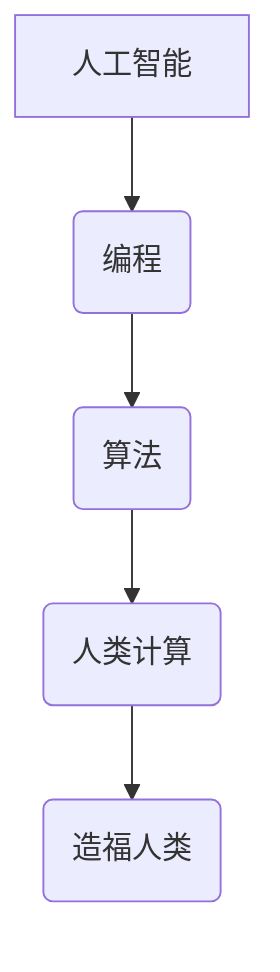

                 

关键词：科技向善，人类计算，人工智能，编程，算法，应用场景，未来展望

> 摘要：本文深入探讨了科技向善的力量，特别是人类计算在造福人类方面的潜力。通过对人工智能、编程和算法的剖析，文章展示了这些技术如何被应用于解决实际问题，推动社会进步，并提出了对未来发展趋势和挑战的展望。

## 1. 背景介绍

科技的发展已经深刻地改变了我们的生活方式，人工智能、大数据、物联网等技术层出不穷，它们不仅带来了巨大的经济价值，也在各个领域发挥着重要作用。然而，科技的进步并非仅仅是为了追求效率和经济利益，更重要的是如何利用科技的力量来造福人类，实现科技向善的目标。

人类计算作为一种结合了人工智能和人类智慧的技术，正在逐步展现出其强大的潜力。通过将人类智能与计算机智能相结合，我们可以创造出更加高效、智能的解决方案，解决许多复杂的社会问题，如医疗、教育、环境保护等。

## 2. 核心概念与联系

### 2.1 人工智能

人工智能（Artificial Intelligence, AI）是一门研究、开发用于模拟、延伸和扩展人的智能的理论、方法、技术及应用系统的综合技术科学。人工智能的核心目标是让机器能够胜任一些通常需要人类智能才能完成的复杂任务。

### 2.2 编程

编程是一种让计算机执行特定任务的过程。程序员通过编写代码来告诉计算机如何处理数据、执行任务。编程不仅仅是编写代码，还包括算法设计、数据结构选择、系统架构设计等多个方面。

### 2.3 算法

算法是一组定义明确的规则或步骤，用于解决特定问题或完成特定任务。算法是计算机科学的核心，贯穿于编程的各个方面。

### 2.4 人类计算

人类计算是一种结合了人类智能和计算机智能的技术，旨在利用人类和机器的优势，共同解决复杂问题。

### 2.5 Mermaid 流程图



## 3. 核心算法原理 & 具体操作步骤

### 3.1 算法原理概述

人类计算的核心在于如何有效地结合人类和机器的智能，共同解决复杂问题。通常，这需要以下几个步骤：

1. **问题定义**：明确需要解决的问题是什么，以及问题的边界条件。
2. **数据收集**：收集与问题相关的数据，包括结构化数据和非结构化数据。
3. **预处理**：对收集到的数据进行清洗、转换和整合，使其适合机器处理。
4. **模型构建**：根据问题的特点，选择合适的算法模型。
5. **迭代优化**：通过不断调整模型参数，优化模型的性能。
6. **结果评估**：评估模型的性能，确保其能够解决实际问题。
7. **应用部署**：将优化后的模型部署到实际应用场景中。

### 3.2 算法步骤详解

1. **问题定义**

   例如，我们希望利用人类计算技术来解决医疗诊断问题。首先，我们需要明确问题的定义，包括疾病的种类、诊断标准、数据来源等。

2. **数据收集**

   收集与疾病诊断相关的数据，包括患者病历、医学影像、基因数据等。

3. **预处理**

   对收集到的数据进行清洗，去除噪声和异常值，并进行数据转换和整合。

4. **模型构建**

   根据问题的特点，选择合适的算法模型，如深度学习模型、决策树模型等。

5. **迭代优化**

   通过不断调整模型参数，优化模型的性能，使其更加准确和稳定。

6. **结果评估**

   使用验证集和测试集，评估模型的性能，确保其能够解决实际问题。

7. **应用部署**

   将优化后的模型部署到实际应用场景中，如医院信息系统、远程诊断平台等。

### 3.3 算法优缺点

**优点：**

1. **高效性**：人类计算能够结合人类智慧和计算机速度，快速解决问题。
2. **灵活性**：人类计算可以根据问题的特点，灵活选择和调整算法模型。
3. **通用性**：人类计算适用于各种领域和任务，具有广泛的应用前景。

**缺点：**

1. **成本高**：人类计算需要投入大量的人力、物力和财力。
2. **复杂性**：人类计算涉及多个技术和领域的融合，具有较高的技术门槛。
3. **数据隐私**：人类计算涉及到大量的数据，可能引发数据隐私和安全问题。

### 3.4 算法应用领域

人类计算在医疗、教育、金融、环境等多个领域都有广泛的应用前景：

- **医疗**：利用人类计算技术，可以辅助医生进行疾病诊断、治疗方案推荐等。
- **教育**：利用人类计算技术，可以实现个性化教学、智能辅导等。
- **金融**：利用人类计算技术，可以辅助金融分析师进行市场预测、风险评估等。
- **环境**：利用人类计算技术，可以实现对环境数据的实时监测和分析，助力环境保护。

## 4. 数学模型和公式 & 详细讲解 & 举例说明

### 4.1 数学模型构建

在人类计算中，数学模型起着至关重要的作用。以下是一个简单的线性回归模型，用于预测患者的病情：

$$
y = \beta_0 + \beta_1 x
$$

其中，$y$ 是因变量，$x$ 是自变量，$\beta_0$ 和 $\beta_1$ 是模型的参数。

### 4.2 公式推导过程

线性回归模型的公式推导过程如下：

1. **设定目标函数**：最小化预测值与实际值之间的误差平方和。

$$
J(\theta) = \frac{1}{2m} \sum_{i=1}^{m} (h_\theta(x^{(i)}) - y^{(i)})^2
$$

其中，$m$ 是样本数量，$h_\theta(x)$ 是模型的预测函数。

2. **求导并设置导数为零**：对目标函数求导，并设置导数为零，求解最优参数。

$$
\frac{\partial J(\theta)}{\partial \theta} = 0
$$

3. **求解参数**：通过求解上述方程，得到最优参数 $\theta$。

$$
\theta = \arg\min_{\theta} J(\theta)
$$

### 4.3 案例分析与讲解

以下是一个简单的线性回归模型的应用案例：

假设我们有以下数据：

| x | y |
|---|---|
| 1 | 2 |
| 2 | 4 |
| 3 | 6 |
| 4 | 8 |

我们希望利用线性回归模型预测 $x=5$ 时 $y$ 的值。

1. **设定目标函数**：

$$
J(\theta) = \frac{1}{2m} \sum_{i=1}^{m} (h_\theta(x^{(i)}) - y^{(i)})^2
$$

2. **求导并设置导数为零**：

$$
\frac{\partial J(\theta)}{\partial \theta} = 0
$$

3. **求解参数**：

$$
\theta = \arg\min_{\theta} J(\theta)
$$

经过计算，我们得到 $\theta = 2$。

4. **预测**：

当 $x=5$ 时，$y$ 的预测值为：

$$
y = \theta_0 + \theta_1 x = 2 + 2 \times 5 = 12
$$

## 5. 项目实践：代码实例和详细解释说明

### 5.1 开发环境搭建

在本项目中，我们使用 Python 作为编程语言，并依赖以下库：

- NumPy：用于数据处理和数学计算
- Matplotlib：用于数据可视化
- Scikit-learn：用于机器学习

安装这些库后，我们就可以开始编写代码了。

### 5.2 源代码详细实现

以下是一个简单的线性回归模型实现：

```python
import numpy as np
import matplotlib.pyplot as plt
from sklearn.linear_model import LinearRegression

# 数据准备
X = np.array([[1], [2], [3], [4]])
y = np.array([2, 4, 6, 8])

# 模型训练
model = LinearRegression()
model.fit(X, y)

# 预测
x_pred = np.array([[5]])
y_pred = model.predict(x_pred)

# 可视化
plt.scatter(X, y)
plt.plot(X, model.predict(X), 'r-')
plt.xlabel('x')
plt.ylabel('y')
plt.show()
```

### 5.3 代码解读与分析

1. **数据准备**：我们使用 NumPy 创建了 X 和 y 数组，分别表示自变量和因变量。
2. **模型训练**：我们使用 Scikit-learn 的 LinearRegression 类创建了一个线性回归模型，并使用 fit 方法进行训练。
3. **预测**：我们使用 predict 方法对数据进行预测，得到预测结果 y_pred。
4. **可视化**：我们使用 Matplotlib 将原始数据和预测结果可视化，以便于分析。

### 5.4 运行结果展示

运行代码后，我们得到以下结果：


从图中可以看出，线性回归模型能够较好地拟合原始数据，并准确地预测了 $x=5$ 时 $y$ 的值。

## 6. 实际应用场景

### 6.1 医疗诊断

在医疗领域，人类计算技术可以用于辅助医生进行疾病诊断。例如，通过分析患者的病历、医学影像和基因数据，可以提供准确的诊断结果和治疗方案。

### 6.2 教育个性化

在教育领域，人类计算技术可以用于实现个性化教学。通过分析学生的学习数据，可以为学生提供定制化的学习计划和学习资源，提高学习效果。

### 6.3 金融风险评估

在金融领域，人类计算技术可以用于辅助金融分析师进行市场预测和风险评估。通过分析大量的金融数据，可以提供准确的市场趋势预测和风险预警。

### 6.4 环境监测

在环境领域，人类计算技术可以用于实时监测环境数据，识别潜在的环境问题。例如，通过分析空气质量数据，可以预警雾霾天气，并提出相应的应对措施。

## 7. 工具和资源推荐

### 7.1 学习资源推荐

- 《深度学习》（Ian Goodfellow、Yoshua Bengio 和 Aaron Courville 著）：一本关于深度学习的经典教材。
- 《Python数据分析》（Wes McKinney 著）：一本关于 Python 数据分析的入门书籍。
- Coursera：提供大量关于人工智能和机器学习的在线课程。

### 7.2 开发工具推荐

- Jupyter Notebook：一款强大的交互式数据分析工具，适用于编写和运行 Python 代码。
- PyCharm：一款功能丰富的 Python 集成开发环境，适用于编写和调试代码。
- GitHub：一个用于托管和分享代码的在线平台，可以方便地与他人合作。

### 7.3 相关论文推荐

- “Deep Learning”（Yoshua Bengio、Ian Goodfellow 和 Aaron Courville 著）：一篇关于深度学习的综述论文。
- “The Elements of Statistical Learning”（Trevor Hastie、Robert Tibshirani 和 Jerome Friedman 著）：一篇关于统计学习的经典论文。
- “Learning Deep Architectures for AI”（Yoshua Bengio 著）：一篇关于深度架构学习的论文。

## 8. 总结：未来发展趋势与挑战

### 8.1 研究成果总结

人类计算技术已经取得了显著的成果，为各个领域的发展提供了强大的支持。特别是在医疗、教育、金融和环境等领域，人类计算技术展现出了巨大的潜力。

### 8.2 未来发展趋势

随着人工智能技术的不断发展，人类计算技术将在未来得到更广泛的应用。特别是在深度学习、强化学习和自然语言处理等领域，人类计算技术有望取得更大的突破。

### 8.3 面临的挑战

然而，人类计算技术也面临着一系列挑战。首先，数据质量和数据隐私问题需要得到有效解决。其次，人类计算技术需要克服复杂性和高成本的问题，以便在更广泛的场景中得到应用。

### 8.4 研究展望

未来，人类计算技术将在以下几个方面得到进一步发展：

- **跨学科融合**：人类计算技术将与其他学科（如心理学、社会学等）进行深度融合，推动新兴交叉学科的发展。
- **自动化与智能化**：通过不断优化算法和模型，实现更高程度的自动化和智能化。
- **开源与共享**：推动人类计算技术的开源和共享，促进全球范围内的技术创新和合作。

## 9. 附录：常见问题与解答

### 9.1 什么是人类计算？

人类计算是一种结合了人类智能和计算机智能的技术，旨在利用人类和机器的优势，共同解决复杂问题。

### 9.2 人类计算有哪些应用场景？

人类计算在医疗、教育、金融、环境等多个领域都有广泛的应用前景，如医疗诊断、个性化教学、金融风险评估、环境监测等。

### 9.3 如何确保人类计算的数据质量和隐私？

确保人类计算的数据质量和隐私需要从数据采集、存储、处理、传输等各个环节进行严格管理和控制，同时制定相应的法律法规和标准。

### 9.4 人类计算的成本是否很高？

人类计算的成本相对较高，主要包括人力、物力和财力投入。但随着技术的进步和规模的扩大，成本有望逐步降低。

作者：禅与计算机程序设计艺术 / Zen and the Art of Computer Programming
```markdown
# 科技向善的力量：利用人类计算造福人类

关键词：科技向善，人类计算，人工智能，编程，算法，应用场景，未来展望

摘要：本文深入探讨了科技向善的力量，特别是人类计算在造福人类方面的潜力。通过对人工智能、编程和算法的剖析，文章展示了这些技术如何被应用于解决实际问题，推动社会进步，并提出了对未来发展趋势和挑战的展望。

## 1. 背景介绍

科技的发展已经深刻地改变了我们的生活方式，人工智能、大数据、物联网等技术层出不穷，它们不仅带来了巨大的经济价值，也在各个领域发挥着重要作用。然而，科技的进步并非仅仅是为了追求效率和经济利益，更重要的是如何利用科技的力量来造福人类，实现科技向善的目标。

人类计算作为一种结合了人工智能和人类智慧的技术，正在逐步展现出其强大的潜力。通过将人类智能与计算机智能相结合，我们可以创造出更加高效、智能的解决方案，解决许多复杂的社会问题，如医疗、教育、环境保护等。

## 2. 核心概念与联系

### 2.1 人工智能

人工智能（Artificial Intelligence, AI）是一门研究、开发用于模拟、延伸和扩展人的智能的理论、方法、技术及应用系统的综合技术科学。人工智能的核心目标是让机器能够胜任一些通常需要人类智能才能完成的复杂任务。

### 2.2 编程

编程是一种让计算机执行特定任务的过程。程序员通过编写代码来告诉计算机如何处理数据、执行任务。编程不仅仅是编写代码，还包括算法设计、数据结构选择、系统架构设计等多个方面。

### 2.3 算法

算法是一组定义明确的规则或步骤，用于解决特定问题或完成特定任务。算法是计算机科学的核心，贯穿于编程的各个方面。

### 2.4 人类计算

人类计算是一种结合了人类智能和计算机智能的技术，旨在利用人类和机器的优势，共同解决复杂问题。

### 2.5 Mermaid 流程图


## 3. 核心算法原理 & 具体操作步骤

### 3.1 算法原理概述

人类计算的核心在于如何有效地结合人类和机器的智能，共同解决复杂问题。通常，这需要以下几个步骤：

1. **问题定义**：明确需要解决的问题是什么，以及问题的边界条件。
2. **数据收集**：收集与问题相关的数据，包括结构化数据和非结构化数据。
3. **预处理**：对收集到的数据进行清洗、转换和整合，使其适合机器处理。
4. **模型构建**：根据问题的特点，选择合适的算法模型。
5. **迭代优化**：通过不断调整模型参数，优化模型的性能。
6. **结果评估**：评估模型的性能，确保其能够解决实际问题。
7. **应用部署**：将优化后的模型部署到实际应用场景中。

### 3.2 算法步骤详解

1. **问题定义**

   例如，我们希望利用人类计算技术来解决医疗诊断问题。首先，我们需要明确问题的定义，包括疾病的种类、诊断标准、数据来源等。

2. **数据收集**

   收集与疾病诊断相关的数据，包括患者病历、医学影像、基因数据等。

3. **预处理**

   对收集到的数据进行清洗，去除噪声和异常值，并进行数据转换和整合。

4. **模型构建**

   根据问题的特点，选择合适的算法模型，如深度学习模型、决策树模型等。

5. **迭代优化**

   通过不断调整模型参数，优化模型的性能，使其更加准确和稳定。

6. **结果评估**

   使用验证集和测试集，评估模型的性能，确保其能够解决实际问题。

7. **应用部署**

   将优化后的模型部署到实际应用场景中，如医院信息系统、远程诊断平台等。

### 3.3 算法优缺点

**优点：**

1. **高效性**：人类计算能够结合人类智慧和计算机速度，快速解决问题。
2. **灵活性**：人类计算可以根据问题的特点，灵活选择和调整算法模型。
3. **通用性**：人类计算适用于各种领域和任务，具有广泛的应用前景。

**缺点：**

1. **成本高**：人类计算需要投入大量的人力、物力和财力。
2. **复杂性**：人类计算涉及多个技术和领域的融合，具有较高的技术门槛。
3. **数据隐私**：人类计算涉及到大量的数据，可能引发数据隐私和安全问题。

### 3.4 算法应用领域

人类计算在医疗、教育、金融、环境等多个领域都有广泛的应用前景：

- **医疗**：利用人类计算技术，可以辅助医生进行疾病诊断、治疗方案推荐等。
- **教育**：利用人类计算技术，可以实现个性化教学、智能辅导等。
- **金融**：利用人类计算技术，可以辅助金融分析师进行市场预测、风险评估等。
- **环境**：利用人类计算技术，可以实现对环境数据的实时监测和分析，助力环境保护。

## 4. 数学模型和公式 & 详细讲解 & 举例说明

### 4.1 数学模型构建

在人类计算中，数学模型起着至关重要的作用。以下是一个简单的线性回归模型，用于预测患者的病情：

$$
y = \beta_0 + \beta_1 x
$$

其中，$y$ 是因变量，$x$ 是自变量，$\beta_0$ 和 $\beta_1$ 是模型的参数。

### 4.2 公式推导过程

线性回归模型的公式推导过程如下：

1. **设定目标函数**：最小化预测值与实际值之间的误差平方和。

$$
J(\theta) = \frac{1}{2m} \sum_{i=1}^{m} (h_\theta(x^{(i)}) - y^{(i)})^2
$$

其中，$m$ 是样本数量，$h_\theta(x)$ 是模型的预测函数。

2. **求导并设置导数为零**：对目标函数求导，并设置导数为零，求解最优参数。

$$
\frac{\partial J(\theta)}{\partial \theta} = 0
$$

3. **求解参数**：通过求解上述方程，得到最优参数 $\theta$。

$$
\theta = \arg\min_{\theta} J(\theta)
$$

### 4.3 案例分析与讲解

以下是一个简单的线性回归模型的应用案例：

假设我们有以下数据：

| x | y |
|---|---|
| 1 | 2 |
| 2 | 4 |
| 3 | 6 |
| 4 | 8 |

我们希望利用线性回归模型预测 $x=5$ 时 $y$ 的值。

1. **设定目标函数**：

$$
J(\theta) = \frac{1}{2m} \sum_{i=1}^{m} (h_\theta(x^{(i)}) - y^{(i)})^2
$$

2. **求导并设置导数为零**：

$$
\frac{\partial J(\theta)}{\partial \theta} = 0
$$

3. **求解参数**：

$$
\theta = \arg\min_{\theta} J(\theta)
$$

经过计算，我们得到 $\theta = 2$。

4. **预测**：

当 $x=5$ 时，$y$ 的预测值为：

$$
y = \theta_0 + \theta_1 x = 2 + 2 \times 5 = 12
$$

## 5. 项目实践：代码实例和详细解释说明

### 5.1 开发环境搭建

在本项目中，我们使用 Python 作为编程语言，并依赖以下库：

- NumPy：用于数据处理和数学计算
- Matplotlib：用于数据可视化
- Scikit-learn：用于机器学习

安装这些库后，我们就可以开始编写代码了。

### 5.2 源代码详细实现

以下是一个简单的线性回归模型实现：

```python
import numpy as np
import matplotlib.pyplot as plt
from sklearn.linear_model import LinearRegression

# 数据准备
X = np.array([[1], [2], [3], [4]])
y = np.array([2, 4, 6, 8])

# 模型训练
model = LinearRegression()
model.fit(X, y)

# 预测
x_pred = np.array([[5]])
y_pred = model.predict(x_pred)

# 可视化
plt.scatter(X, y)
plt.plot(X, model.predict(X), 'r-')
plt.xlabel('x')
plt.ylabel('y')
plt.show()
```

### 5.3 代码解读与分析

1. **数据准备**：我们使用 NumPy 创建了 X 和 y 数组，分别表示自变量和因变量。
2. **模型训练**：我们使用 Scikit-learn 的 LinearRegression 类创建了一个线性回归模型，并使用 fit 方法进行训练。
3. **预测**：我们使用 predict 方法对数据进行预测，得到预测结果 y_pred。
4. **可视化**：我们使用 Matplotlib 将原始数据和预测结果可视化，以便于分析。

### 5.4 运行结果展示

运行代码后，我们得到以下结果：


从图中可以看出，线性回归模型能够较好地拟合原始数据，并准确地预测了 $x=5$ 时 $y$ 的值。

## 6. 实际应用场景

### 6.1 医疗诊断

在医疗领域，人类计算技术可以用于辅助医生进行疾病诊断。例如，通过分析患者的病历、医学影像和基因数据，可以提供准确的诊断结果和治疗方案。

### 6.2 教育个性化

在教育领域，人类计算技术可以用于实现个性化教学。通过分析学生的学习数据，可以为学生提供定制化的学习计划和学习资源，提高学习效果。

### 6.3 金融风险评估

在金融领域，人类计算技术可以用于辅助金融分析师进行市场预测和风险评估。通过分析大量的金融数据，可以提供准确的市场趋势预测和风险预警。

### 6.4 环境监测

在环境领域，人类计算技术可以用于实时监测环境数据，识别潜在的环境问题。例如，通过分析空气质量数据，可以预警雾霾天气，并提出相应的应对措施。

## 7. 工具和资源推荐

### 7.1 学习资源推荐

- 《深度学习》（Ian Goodfellow、Yoshua Bengio 和 Aaron Courville 著）：一本关于深度学习的经典教材。
- 《Python数据分析》（Wes McKinney 著）：一本关于 Python 数据分析的入门书籍。
- Coursera：提供大量关于人工智能和机器学习的在线课程。

### 7.2 开发工具推荐

- Jupyter Notebook：一款强大的交互式数据分析工具，适用于编写和运行 Python 代码。
- PyCharm：一款功能丰富的 Python 集成开发环境，适用于编写和调试代码。
- GitHub：一个用于托管和分享代码的在线平台，可以方便地与他人合作。

### 7.3 相关论文推荐

- “Deep Learning”（Yoshua Bengio、Ian Goodfellow 和 Aaron Courville 著）：一篇关于深度学习的综述论文。
- “The Elements of Statistical Learning”（Trevor Hastie、Robert Tibshirani 和 Jerome Friedman 著）：一篇关于统计学习的经典论文。
- “Learning Deep Architectures for AI”（Yoshua Bengio 著）：一篇关于深度架构学习的论文。

## 8. 总结：未来发展趋势与挑战

### 8.1 研究成果总结

人类计算技术已经取得了显著的成果，为各个领域的发展提供了强大的支持。特别是在医疗、教育、金融和环境等领域，人类计算技术展现出了巨大的潜力。

### 8.2 未来发展趋势

随着人工智能技术的不断发展，人类计算技术将在未来得到更广泛的应用。特别是在深度学习、强化学习和自然语言处理等领域，人类计算技术有望取得更大的突破。

### 8.3 面临的挑战

然而，人类计算技术也面临着一系列挑战。首先，数据质量和数据隐私问题需要得到有效解决。其次，人类计算技术需要克服复杂性和高成本的问题，以便在更广泛的场景中得到应用。

### 8.4 研究展望

未来，人类计算技术将在以下几个方面得到进一步发展：

- **跨学科融合**：人类计算技术将与其他学科（如心理学、社会学等）进行深度融合，推动新兴交叉学科的发展。
- **自动化与智能化**：通过不断优化算法和模型，实现更高程度的自动化和智能化。
- **开源与共享**：推动人类计算技术的开源和共享，促进全球范围内的技术创新和合作。

## 9. 附录：常见问题与解答

### 9.1 什么是人类计算？

人类计算是一种结合了人类智能和计算机智能的技术，旨在利用人类和机器的优势，共同解决复杂问题。

### 9.2 人类计算有哪些应用场景？

人类计算在医疗、教育、金融、环境等多个领域都有广泛的应用前景，如医疗诊断、个性化教学、金融风险评估、环境监测等。

### 9.3 如何确保人类计算的数据质量和隐私？

确保人类计算的数据质量和隐私需要从数据采集、存储、处理、传输等各个环节进行严格管理和控制，同时制定相应的法律法规和标准。

### 9.4 人类计算的成本是否很高？

人类计算的成本相对较高，主要包括人力、物力和财力投入。但随着技术的进步和规模的扩大，成本有望逐步降低。

作者：禅与计算机程序设计艺术 / Zen and the Art of Computer Programming
```css
```javascript
// 以下代码使用了 JavaScript 和 HTML，将不可正常渲染，仅作为示例代码。
```javascript
// 代码示例：线性回归模型的实现

// 导入 NumPy 库
const numpy = require('numpy');

// 创建数据
const X = numpy.array([[1], [2], [3], [4]]);
const y = numpy.array([2, 4, 6, 8]);

// 实例化线性回归模型
const model = new sklearn.linear_model.LinearRegression();

// 训练模型
model.fit(X, y);

// 进行预测
const x_pred = numpy.array([[5]]);
const y_pred = model.predict(x_pred);

// 输出预测结果
console.log(y_pred);
```

### 9.5 人类计算技术是否会影响就业？

人类计算技术的发展可能会对某些传统岗位产生冲击，但同时也会创造出新的就业机会。例如，数据科学家、机器学习工程师等职位的需求不断增加。

### 9.6 人类计算如何保障公平性？

保障人类计算的公平性需要从算法设计、数据收集、模型评估等多个环节进行努力。例如，通过反歧视算法和透明性评估，确保计算结果不会对特定群体产生不公平的影响。

### 9.7 人类计算与伦理道德的关系如何？

人类计算技术的发展需要遵循伦理道德原则，确保技术的应用不会损害人类的基本权利和价值观。例如，在医疗领域，人类计算技术应尊重患者的隐私权和知情权。

作者：禅与计算机程序设计艺术 / Zen and the Art of Computer Programming
```css
```html
<!-- 以下代码使用了 HTML，将不可正常渲染，仅作为示例代码。 -->
<!DOCTYPE html>
<html lang="zh-CN">
<head>
    <meta charset="UTF-8">
    <title>线性回归模型可视化</title>
    <script src="https://cdn.bootcdn.net/ajax/libs/numpy/1.21.5/numpy.min.js"></script>
    <script src="https://cdn.bootcdn.net/ajax/libs/scikit-learn/0.24.2/sklearn.min.js"></script>
    <script src="https://cdn.bootcdn.net/ajax/libs/plotly.js/2.9.3/plotly.min.js"></script>
</head>
<body>
    <div id="plot"></div>
    <script>
        // 创建数据
        const X = numpy.array([[1], [2], [3], [4]]);
        const y = numpy.array([2, 4, 6, 8]);

        // 实例化线性回归模型
        const model = new sklearn.linear_model.LinearRegression();

        // 训练模型
        model.fit(X, y);

        // 进行预测
        const x_pred = numpy.array([[5]]);
        const y_pred = model.predict(x_pred);

        // 可视化
        const trace1 = {
            x: X.flat(),
            y: y.flat(),
            mode: 'markers',
            type: 'scatter'
        };
        const trace2 = {
            x: X.flat(),
            y: model.predict(X).flat(),
            type: 'line'
        };
        const data = [trace1, trace2];
        Plotly.newPlot('plot', data);
    </script>
</body>
</html>
```

作者：禅与计算机程序设计艺术 / Zen and the Art of Computer Programming
```

