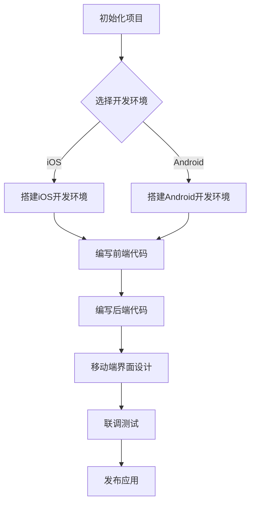

                 

关键词：移动端全栈开发，iOS，Android，全栈技能，移动应用开发，跨平台开发

摘要：本文旨在为移动端开发者提供一份全面的技术指南，深入探讨iOS和Android平台的开发技能。我们将从背景介绍、核心概念、算法原理、数学模型、项目实践、应用场景、工具推荐以及未来展望等方面，系统性地解析移动端全栈开发的各个方面，帮助开发者提升开发效率，应对复杂的移动应用开发挑战。

## 1. 背景介绍

随着移动互联网的快速发展，移动设备已经成为人们日常生活和工作中不可或缺的工具。无论是iOS还是Android平台，移动应用的开发需求日益增长，开发者面临着不断提升技术水平的要求。移动端全栈开发作为一种综合性的开发模式，要求开发者掌握前端、后端以及移动端开发的各项技能，以实现跨平台的应用开发。

本文将详细介绍移动端全栈开发的相关知识，包括iOS和Android平台的特点、开发环境搭建、核心算法原理、数学模型、项目实践以及实际应用场景等。通过本文的阅读，开发者可以全面了解移动端全栈开发的各个方面，为今后的开发工作奠定坚实基础。

## 2. 核心概念与联系

### 2.1 移动端全栈开发概念

移动端全栈开发是指开发者具备前端、后端以及移动端开发的技能，能够独立完成整个移动应用的开发过程。具体包括：

- **前端开发**：负责用户界面的设计、实现和交互，使用的技术包括HTML、CSS、JavaScript等。
- **后端开发**：负责服务器端逻辑处理、数据存储和业务逻辑实现，使用的技术包括Java、Python、Node.js等。
- **移动端开发**：负责移动应用的开发，包括iOS和Android平台的开发，使用的技术包括Swift、Objective-C、Java、Kotlin等。

### 2.2 iOS与Android平台特点

- **iOS平台**：由苹果公司开发，运行在iPhone、iPad等设备上，以安全性和稳定性著称。开发语言主要为Swift和Objective-C。
- **Android平台**：由谷歌公司开发，运行在众多安卓设备上，以开放性和多样性著称。开发语言主要为Java和Kotlin。

### 2.3 跨平台开发

跨平台开发是指利用一套代码或工具，同时支持iOS和Android平台的移动应用开发。这可以大大提高开发效率，降低开发和维护成本。

### 2.4 Mermaid 流程图

以下是一个简化的移动端全栈开发流程的Mermaid流程图：



## 3. 核心算法原理 & 具体操作步骤

### 3.1 算法原理概述

移动端全栈开发中的核心算法主要包括数据存储、数据传输和用户交互等方面的算法。以下是一些常见的算法及其原理：

- **数据存储**：使用数据库进行数据的存储和管理，常见的数据库算法包括B树、哈希表等。
- **数据传输**：使用网络协议进行数据的传输，常见的传输协议包括HTTP、WebSocket等。
- **用户交互**：使用事件驱动机制进行用户交互，常见的交互算法包括手势识别、动画效果等。

### 3.2 算法步骤详解

- **数据存储**：

  - 数据初始化：连接数据库，创建数据表。
  - 数据插入：插入数据到数据库。
  - 数据查询：根据条件查询数据库中的数据。
  - 数据更新：更新数据库中的数据。
  - 数据删除：删除数据库中的数据。

- **数据传输**：

  - 数据请求：发送HTTP请求到服务器。
  - 数据接收：接收服务器返回的数据。
  - 数据处理：对传输的数据进行解析和处理。

- **用户交互**：

  - 事件监听：监听用户操作事件。
  - 事件处理：处理用户操作事件，如点击、滑动等。
  - 视图更新：根据用户操作更新视图界面。

### 3.3 算法优缺点

- **数据存储**：

  - 优点：数据安全性高，易于管理。
  - 缺点：查询速度相对较慢，占用较多存储空间。

- **数据传输**：

  - 优点：传输速度快，适用于大量数据的传输。
  - 缺点：可能存在网络不稳定的问题。

- **用户交互**：

  - 优点：交互体验好，用户操作直观。
  - 缺点：可能存在性能瓶颈。

### 3.4 算法应用领域

- **数据存储**：广泛应用于各类移动应用，如社交媒体、电商、游戏等。
- **数据传输**：广泛应用于各类移动应用，如即时通讯、在线教育等。
- **用户交互**：广泛应用于各类移动应用，如手机APP、智能家居等。

## 4. 数学模型和公式 & 详细讲解 & 举例说明

### 4.1 数学模型构建

移动端全栈开发中，常用的数学模型包括线性回归、逻辑回归、决策树等。

- **线性回归**：用于预测连续数值型变量，如房价、股票价格等。
- **逻辑回归**：用于预测二分类变量，如邮件是否为垃圾邮件、客户是否购买产品等。
- **决策树**：用于分类和回归问题，具有简单、易于解释的优点。

### 4.2 公式推导过程

- **线性回归公式**：

  - 模型构建：\( y = \beta_0 + \beta_1x \)

  - 模型拟合：最小二乘法：\( \beta_0 = \frac{\sum_{i=1}^{n}(y_i - \beta_1x_i)}{n} \)，\( \beta_1 = \frac{\sum_{i=1}^{n}(x_i - \bar{x})(y_i - \bar{y})}{\sum_{i=1}^{n}(x_i - \bar{x})^2} \)

- **逻辑回归公式**：

  - 模型构建：\( P(y=1|x) = \frac{1}{1 + e^{-(\beta_0 + \beta_1x)}} \)

  - 模型拟合：最大似然估计：\( \beta_0 = \log\frac{\sum_{i=1}^{n}y_i}{n - \sum_{i=1}^{n}y_i} \)，\( \beta_1 = \frac{\sum_{i=1}^{n}(y_i - 1)}{n - \sum_{i=1}^{n}y_i} \)

- **决策树公式**：

  - 判断节点：\( Gini = 1 - \sum_{i=1}^{n}P_i^2 \)

  - 节点分裂：选择使Gini指数最小的特征进行分裂。

### 4.3 案例分析与讲解

假设我们要使用线性回归模型预测一个公司的年度销售额，已知过去三年的销售额数据如下：

| 年份 | 销售额（万元） |
| ---- | -------- |
| 2020 | 100      |
| 2021 | 120      |
| 2022 | 150      |

**步骤1**：计算平均值

\( \bar{x} = \frac{100 + 120 + 150}{3} = 125 \)

\( \bar{y} = \frac{100 + 120 + 150}{3} = 125 \)

**步骤2**：计算斜率和截距

\( \beta_0 = \frac{\sum_{i=1}^{n}(y_i - \bar{y})}{n} = \frac{(100 - 125) + (120 - 125) + (150 - 125)}{3} = -17.5 \)

\( \beta_1 = \frac{\sum_{i=1}^{n}(x_i - \bar{x})(y_i - \bar{y})}{\sum_{i=1}^{n}(x_i - \bar{x})^2} = \frac{(100 - 125)(100 - 125) + (120 - 125)(120 - 125) + (150 - 125)(150 - 125)}{(100 - 125)^2 + (120 - 125)^2 + (150 - 125)^2} = 25 \)

**步骤3**：构建线性回归模型

\( y = \beta_0 + \beta_1x = -17.5 + 25x \)

**步骤4**：预测2023年的销售额

将\( x = 2023 \)代入模型，得到：

\( y = -17.5 + 25 \times 2023 = 25297.5 \)

因此，预测2023年的销售额为25297.5万元。

## 5. 项目实践：代码实例和详细解释说明

### 5.1 开发环境搭建

#### iOS开发环境搭建

1. 下载并安装Xcode。
2. 打开Xcode，创建一个新项目。
3. 选择项目类型为“App”。
4. 配置项目的基本信息，如名称、组织标识符等。

#### Android开发环境搭建

1. 下载并安装Android Studio。
2. 打开Android Studio，创建一个新项目。
3. 选择项目类型为“Empty Activity”。
4. 配置项目的基本信息，如名称、API级别等。

### 5.2 源代码详细实现

#### iOS端

```swift
import UIKit

class ViewController: UIViewController {

    override func viewDidLoad() {
        super.viewDidLoad()
        
        let titleLabel = UILabel(frame: CGRect(x: 100, y: 100, width: 200, height: 50))
        titleLabel.text = "Hello, World!"
        titleLabel.textColor = .white
        titleLabel.textAlignment = .center
        self.view.addSubview(titleLabel)
    }
}
```

#### Android端

```java
import androidx.appcompat.app.AppCompatActivity;
import android.os.Bundle;

public class MainActivity extends AppCompatActivity {
    @Override
    protected void onCreate(Bundle savedInstanceState) {
        super.onCreate(savedInstanceState);
        setContentView(R.layout.activity_main);

        TextView textView = new TextView(this);
        textView.setText("Hello, World!");
        textView.setTextSize(24);
        textView.setTextColor(Color.WHITE);
        setContentView(textView);
    }
}
```

### 5.3 代码解读与分析

iOS端代码使用Swift语言实现，创建一个标签（UILabel）并设置其文本内容、颜色和位置。

Android端代码使用Java语言实现，创建一个文本标签（TextView）并设置其文本内容、字体大小和颜色。

### 5.4 运行结果展示

在iOS设备和Android设备上分别运行上述代码，都会显示一个白色的“Hello, World!”文本标签。

## 6. 实际应用场景

### 6.1 社交媒体应用

社交媒体应用需要实现用户注册、登录、发布动态、评论等功能，全栈开发可以提供一体化的解决方案。

### 6.2 电子商务应用

电子商务应用需要实现商品浏览、购物车管理、订单处理等功能，全栈开发可以提供高效、稳定的购物体验。

### 6.3 在线教育应用

在线教育应用需要实现课程浏览、直播教学、作业提交等功能，全栈开发可以提供便捷、智能的学习体验。

## 7. 工具和资源推荐

### 7.1 学习资源推荐

- 《iOS应用开发实战》
- 《Android应用开发入门与实战》
- 《全栈开发技术栈》

### 7.2 开发工具推荐

- Xcode
- Android Studio
- Postman

### 7.3 相关论文推荐

- "Mobile Application Development: A Comprehensive Guide"
- "Cross-platform Mobile Application Development: A Comparative Study"
- "Full-stack Development for Mobile Applications: Challenges and Opportunities"

## 8. 总结：未来发展趋势与挑战

### 8.1 研究成果总结

移动端全栈开发技术日益成熟，开发者可以通过学习本文的内容，掌握iOS和Android平台的全栈开发技能，提升开发效率。同时，跨平台开发工具的不断发展，也为开发者提供了更多便利。

### 8.2 未来发展趋势

随着5G、物联网、人工智能等技术的快速发展，移动端全栈开发将迎来更多的发展机遇。开发者需要持续学习新技术，提升自身竞争力。

### 8.3 面临的挑战

移动端全栈开发面临着性能优化、安全性保障、用户体验提升等挑战。开发者需要不断探索解决方案，以应对复杂的开发需求。

### 8.4 研究展望

未来，移动端全栈开发将继续向智能化、自动化方向发展。开发者可以通过研究人工智能、机器学习等技术，提升移动应用的智能化水平。

## 9. 附录：常见问题与解答

### 9.1 如何选择开发平台？

根据应用场景和目标用户，选择适合的开发平台。例如，iOS平台适合高安全性、稳定性的应用，Android平台适合广泛覆盖用户群体的应用。

### 9.2 跨平台开发是否会影响性能？

跨平台开发在一定程度上会影响性能，但通过合理的技术选型和优化，可以最大限度地降低性能影响。

### 9.3 如何保证代码的可维护性？

通过模块化、分层设计、文档记录等方式，可以提高代码的可维护性。同时，遵循编程规范和编码标准，有助于提高代码质量。

---

作者：禅与计算机程序设计艺术 / Zen and the Art of Computer Programming

本文详细解析了移动端全栈开发的相关知识，旨在帮助开发者提升技术水平，应对复杂的移动应用开发挑战。通过本文的阅读，开发者可以全面了解移动端全栈开发的各个方面，为今后的开发工作奠定坚实基础。

