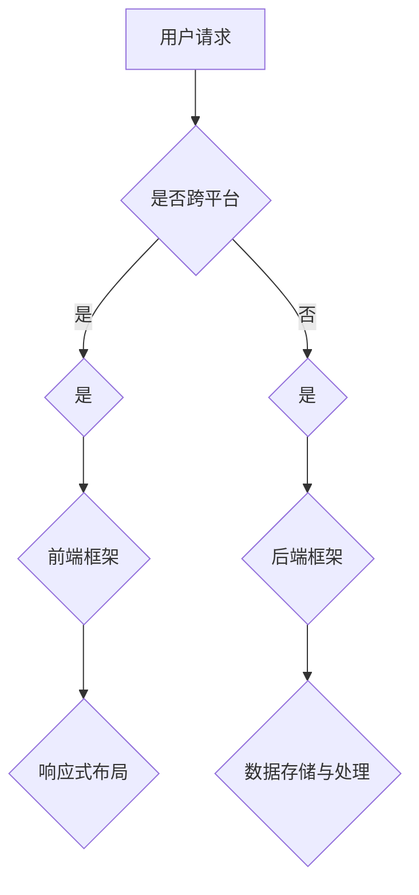

                 

关键词：移动端开发，智能手机，用户体验，开发框架，技术实现，性能优化

摘要：随着智能手机的普及和移动互联网的快速发展，移动端开发框架成为了开发者关注的焦点。本文将探讨移动端开发框架的核心概念、原理、应用场景以及未来发展趋势，帮助开发者深入了解如何利用这些框架提升智能手机的用户体验。

## 1. 背景介绍

移动端开发，即针对智能手机、平板电脑等移动设备进行的应用程序开发。随着移动互联网的快速发展和智能手机的普及，移动端开发已经成为了软件开发领域的重要组成部分。开发者需要面对的挑战是如何在有限的设备资源和网络环境下，为用户提供流畅、高效、安全的应用体验。

移动端开发框架是为了解决上述问题而出现的一系列开发工具和技术的集合。它们提供了通用的组件和库，使得开发者能够更快速地构建应用程序，同时确保应用程序在不同的设备和操作系统上具有一致的体验。

本文将围绕移动端开发框架的几个核心方面展开讨论，包括核心概念、算法原理、数学模型、项目实践以及未来发展趋势。通过本文的阅读，开发者将能够更好地理解如何利用移动端开发框架提升智能手机的用户体验。

## 2. 核心概念与联系

### 2.1 核心概念

在移动端开发框架中，核心概念包括以下几方面：

- **响应式布局**：通过使用媒体查询和弹性布局技术，使应用程序能够适应不同尺寸和分辨率的设备屏幕。

- **跨平台开发**：通过使用一套代码库，能够在多个操作系统（如iOS和Android）上运行。

- **前端框架**：如React、Vue、Angular等，用于构建用户界面和交互逻辑。

- **后端框架**：如Node.js、Django、Flask等，用于处理业务逻辑和数据存储。

### 2.2 架构联系

以下是一个简化的移动端开发框架的Mermaid流程图：



在这个流程图中，用户请求通过前端框架处理，前端框架负责响应式布局，后端框架处理数据存储与处理。

## 3. 核心算法原理 & 具体操作步骤

### 3.1 算法原理概述

移动端开发框架中的核心算法包括响应式布局算法、跨平台编译算法、前端框架的渲染算法等。

- **响应式布局算法**：通过媒体查询和CSS3的弹性布局特性，根据设备尺寸和分辨率动态调整界面元素的大小和位置。

- **跨平台编译算法**：使用JSCTranspiler等技术，将同一套代码编译成不同操作系统的原生应用。

- **前端框架渲染算法**：如React的虚拟DOM、Vue的双向绑定等，用于提高页面渲染的效率。

### 3.2 算法步骤详解

#### 3.2.1 响应式布局算法

1. **检测设备尺寸和分辨率**：使用JavaScript获取设备尺寸和分辨率。
2. **应用媒体查询**：根据媒体查询结果，动态调整CSS样式。
3. **布局更新**：根据调整后的CSS样式，重新布局界面元素。

#### 3.2.2 跨平台编译算法

1. **代码解析**：使用解析器将源代码解析成抽象语法树（AST）。
2. **代码转换**：将AST转换成目标平台的代码。
3. **代码优化**：对转换后的代码进行优化，提高性能。

#### 3.2.3 前端框架渲染算法

以React为例：

1. **虚拟DOM构建**：使用JSX构建虚拟DOM。
2. **状态更新**：当组件状态变化时，重新构建虚拟DOM。
3. **差异比较**：比较新旧虚拟DOM的差异。
4. **更新真实DOM**：根据差异更新真实DOM。

### 3.3 算法优缺点

#### 3.3.1 响应式布局算法

优点：能够适应不同尺寸的设备屏幕，提高用户体验。

缺点：需要编写大量的媒体查询和CSS代码，开发效率较低。

#### 3.3.2 跨平台编译算法

优点：一套代码库，减少重复劳动。

缺点：编译过程可能较慢，且在一些特定场景下，原生应用性能可能更高。

#### 3.3.3 前端框架渲染算法

优点：提高页面渲染效率，减少渲染延迟。

缺点：可能增加项目的复杂度，学习曲线较陡。

### 3.4 算法应用领域

移动端开发框架适用于各种类型的移动应用，包括社交应用、电商应用、游戏应用等。特别是在需要跨平台开发、响应式布局和高效渲染的场景下，框架的优势更加明显。

## 4. 数学模型和公式 & 详细讲解 & 举例说明

### 4.1 数学模型构建

移动端开发框架中的数学模型主要包括以下几个方面：

- **几何变换**：用于实现响应式布局，如平移、缩放、旋转等。
- **数据结构**：如树结构、链表等，用于存储和操作数据。
- **算法优化**：如分治算法、动态规划等，用于提高计算效率。

### 4.2 公式推导过程

以响应式布局中的几何变换为例，一个二维平面上的点\( P(x, y) \)经过平移\( (a, b) \)后的新位置\( P'(x', y') \)可以通过以下公式计算：

$$
\begin{cases}
x' = x + a \\
y' = y + b
\end{cases}
$$

### 4.3 案例分析与讲解

假设有一个移动应用，用户界面包含一个按钮，按钮的初始位置为\( (100, 200) \)，需要将其移动到屏幕中央，即位置\( (200, 300) \)。

1. **确定平移量**：目标位置与初始位置的差值，即\( a = 200 - 100 = 100 \)，\( b = 300 - 200 = 100 \)。
2. **应用平移公式**：将平移量代入公式，得到新位置：
   $$
   \begin{cases}
   x' = 100 + 100 = 200 \\
   y' = 200 + 100 = 300
   \end{cases}
   $$
   因此，按钮的新位置为\( (200, 300) \)。

## 5. 项目实践：代码实例和详细解释说明

### 5.1 开发环境搭建

在开始项目实践之前，需要搭建一个合适的开发环境。以下是一个基于React和Node.js的移动端开发环境搭建步骤：

1. **安装Node.js**：从官方网站下载并安装Node.js。
2. **安装React**：使用npm命令安装React：
   ```
   npm install react
   ```
3. **安装React Native**：使用npm命令安装React Native：
   ```
   npm install react-native
   ```

### 5.2 源代码详细实现

以下是一个简单的React Native应用示例，实现了一个包含一个按钮的界面，按钮点击后显示一个弹窗。

```jsx
import React from 'react';
import {
  View,
  Text,
  Button,
  Modal,
  StyleSheet,
} from 'react-native';

const App = () => {
  const [visible, setVisible] = React.useState(false);

  const toggleModal = () => {
    setVisible(!visible);
  };

  return (
    <View style={styles.container}>
      <Text style={styles.text}>点击按钮查看弹窗</Text>
      <Button title="打开弹窗" onPress={toggleModal} />
      <Modal visible={visible} transparent={true}>
        <View style={styles.modalContainer}>
          <Text style={styles.modalText}>这是一个弹窗</Text>
          <Button title="关闭" onPress={toggleModal} />
        </View>
      </Modal>
    </View>
  );
};

const styles = StyleSheet.create({
  container: {
    flex: 1,
    justifyContent: 'center',
    alignItems: 'center',
  },
  text: {
    fontSize: 20,
  },
  modalContainer: {
    flex: 1,
    backgroundColor: 'rgba(0, 0, 0, 0.5)',
    justifyContent: 'center',
    alignItems: 'center',
  },
  modalText: {
    fontSize: 24,
    color: 'white',
  },
});

export default App;
```

### 5.3 代码解读与分析

1. **导入组件和样式**：从`react-native`导入必要的组件和样式，如`View`、`Text`、`Button`和`Modal`。
2. **创建App组件**：使用函数组件的方式创建`App`组件，并设置初始状态`visible`为`false`。
3. **定义按钮点击事件**：使用`toggleModal`函数切换`visible`状态，打开或关闭弹窗。
4. **渲染组件**：在`View`组件中，首先渲染文本和按钮，然后根据`visible`状态渲染弹窗。

### 5.4 运行结果展示

在开发工具中运行上述代码，将看到一个包含按钮的界面。点击按钮后，会弹出一个透明的弹窗，显示文本“这是一个弹窗”，并包含一个关闭按钮。

## 6. 实际应用场景

移动端开发框架在各个行业和领域都有广泛的应用。以下是一些实际应用场景：

- **社交应用**：如微信、微博等，使用移动端开发框架实现跨平台和响应式布局。
- **电商应用**：如淘宝、京东等，使用移动端开发框架提升用户购物体验。
- **游戏应用**：如王者荣耀、和平精英等，使用移动端开发框架实现跨平台和高性能渲染。
- **教育应用**：如网易云课堂、慕课网等，使用移动端开发框架提供在线学习服务。

## 7. 工具和资源推荐

### 7.1 学习资源推荐

- **《React Native实战》**：一本深入浅出的React Native开发指南，适合初学者和进阶者。
- **《React Native官方文档》**：React Native官方提供的文档，内容全面，适合查阅。
- **《移动应用UI设计》**：一本关于移动应用UI设计的经典书籍，有助于提升设计能力。

### 7.2 开发工具推荐

- **Visual Studio Code**：一款轻量级、开源的代码编辑器，支持多种编程语言和扩展。
- **Xcode**：苹果官方提供的开发工具，用于iOS应用开发。
- **Android Studio**：谷歌官方提供的开发工具，用于Android应用开发。

### 7.3 相关论文推荐

- **“React Native: A Framework for Building Native Apps with JavaScript”**：介绍了React Native的设计原理和实现方法。
- **“Cross-Platform Mobile Development with React Native”**：讨论了React Native在跨平台开发中的应用。

## 8. 总结：未来发展趋势与挑战

移动端开发框架在过去的几年中取得了显著的进展，为开发者提供了强大的工具和平台。然而，随着技术的不断进步和用户需求的不断变化，移动端开发框架也面临着一系列新的挑战和发展趋势。

### 8.1 研究成果总结

- **性能优化**：移动端开发框架在性能优化方面取得了显著成果，如React Native的虚拟DOM、Vue的双向绑定等。
- **跨平台兼容性**：移动端开发框架逐渐实现了更高的跨平台兼容性，减少了开发者的重复劳动。
- **开发者体验**：移动端开发框架提供了丰富的工具和库，提高了开发者的工作效率和代码质量。

### 8.2 未来发展趋势

- **人工智能集成**：未来移动端开发框架可能会集成更多人工智能技术，如自然语言处理、图像识别等。
- **低代码开发**：随着低代码开发平台的发展，移动端开发框架可能会更加注重简化开发流程，降低开发门槛。
- **云原生应用**：云原生技术逐渐成熟，移动端开发框架可能会更加注重与云计算的结合，提供更强大的后端支持。

### 8.3 面临的挑战

- **性能瓶颈**：随着应用的复杂度增加，移动端设备性能可能成为瓶颈，需要不断优化框架和算法。
- **安全性**：移动端应用面临着各种安全威胁，如数据泄露、恶意软件等，需要加强安全防护。
- **开发者培训**：随着框架的不断更新和技术的快速发展，开发者需要不断学习和适应新的开发工具和框架。

### 8.4 研究展望

移动端开发框架将继续发挥重要作用，成为移动应用开发的重要工具。未来，开发者需要不断关注新技术和新趋势，提升自己的技能和知识水平，以应对不断变化的市场需求和技术挑战。

## 9. 附录：常见问题与解答

### 9.1 常见问题

1. **什么是移动端开发框架？**
   移动端开发框架是一套为移动应用开发提供支持的库和工具，旨在简化开发流程、提高开发效率，并确保应用程序在不同设备和操作系统上具有一致的体验。

2. **移动端开发框架有哪些优势？**
   移动端开发框架的优势包括：提高开发效率、减少代码重复、实现跨平台兼容性、优化性能、提升用户体验等。

3. **如何选择合适的移动端开发框架？**
   选择移动端开发框架时，需要考虑应用的需求、开发团队的技能、项目的规模和预算等因素。常见的框架有React Native、Flutter、SwiftUI等，开发者可以根据具体情况进行选择。

### 9.2 解答

1. **什么是移动端开发框架？**
   移动端开发框架是一套为移动应用开发提供支持的库和工具，旨在简化开发流程、提高开发效率，并确保应用程序在不同设备和操作系统上具有一致的体验。这些框架通常提供通用的组件、库和工具，使得开发者可以更快速地构建和部署移动应用。

2. **移动端开发框架有哪些优势？**
   移动端开发框架的优势主要体现在以下几个方面：
   - **跨平台兼容性**：使用移动端开发框架可以在不编写过多额外代码的情况下，同时在iOS和Android等不同操作系统上运行。
   - **提高开发效率**：框架提供的组件和工具可以减少开发中的重复工作，加快开发速度。
   - **性能优化**：一些框架（如React Native）通过使用原生组件和优化渲染机制，可以提供与原生应用相似的性能。
   - **代码复用**：开发者可以在多个项目中复用相同的代码库，降低维护成本。

3. **如何选择合适的移动端开发框架？**
   选择合适的移动端开发框架时，需要考虑以下几个因素：
   - **项目需求**：根据项目的技术需求，如需要跨平台兼容、性能优化等，选择相应的框架。
   - **开发团队技能**：评估团队成员对各种框架的熟悉程度，选择团队擅长的框架。
   - **社区支持和文档**：选择社区活跃、文档完善的框架，以便在开发过程中获得帮助。
   - **项目预算**：考虑框架的使用成本，包括许可费用、学习成本等。
   - **市场趋势**：关注市场趋势，选择被广泛认可和使用的框架。

### 9.3 进一步阅读

- **《移动端开发实战》**：详细介绍了移动端开发的基本概念、框架选择和实战技巧。
- **《Flutter实战》**：全面讲解了Flutter框架的使用方法和最佳实践。
- **《React Native官方文档》**：提供了React Native的详细使用方法和参考指南。

---

通过本文的讨论，我们深入了解了移动端开发框架的核心概念、原理、应用场景和未来发展趋势。希望本文能够为开发者提供有价值的参考和启示，助力他们在移动端开发领域取得更好的成果。作者：禅与计算机程序设计艺术 / Zen and the Art of Computer Programming。

