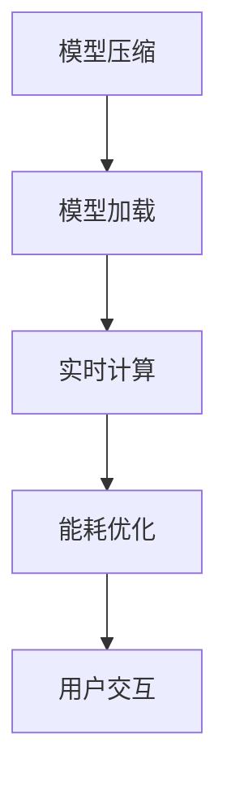

                 

关键词：移动设备，大型语言模型（LLM），人工智能，实时计算，应用场景，发展趋势

> 摘要：随着移动设备的普及和人工智能技术的飞速发展，大型语言模型（LLM）在移动设备上的应用逐渐成为可能。本文将探讨移动设备与 LLM 的结合，如何实现随时随地的 AI 力量，并分析其带来的挑战和未来发展趋势。

## 1. 背景介绍

随着智能手机和平板电脑的普及，移动设备已经成为人们日常生活和工作中不可或缺的工具。而人工智能（AI）作为当前技术发展的热点，也在不断改变着我们的生活方式。特别是大型语言模型（LLM），如 GPT-3、BERT 等，凭借其强大的语言理解和生成能力，在自然语言处理（NLP）领域取得了显著的成果。

然而，传统的 LLM 应用往往需要依赖服务器端的高性能计算资源，这限制了它们在移动设备上的应用。随着移动设备硬件性能的提升和 5G 网络的普及，移动设备具备了处理复杂 AI 模型的能力。这为 LLM 在移动设备上的应用提供了新的机遇。

本文将探讨如何将 LLM 部署到移动设备上，实现随时随地的 AI 力量，并分析其在实际应用中的挑战和发展趋势。

### 1.1 移动设备的发展

移动设备的发展经历了几个重要阶段：

- **1G 到 4G**：从 1G 到 4G，移动网络从模拟信号升级到数字信号，数据传输速度不断提升。这为移动设备的应用提供了更多的可能性。
- **5G 时代**：5G 网络的普及，使得移动设备具备了更高的数据传输速度和更低的延迟。这为 LLM 在移动设备上的应用提供了良好的网络环境。

### 1.2 人工智能的发展

人工智能作为一门学科，从诞生之初就受到了广泛关注。近年来，随着深度学习等技术的不断发展，人工智能取得了显著的成果。特别是在自然语言处理（NLP）领域，大型语言模型（LLM）如 GPT-3、BERT 等的出现，使得机器理解和生成自然语言的能力大大提升。

### 1.3 LLM 的应用场景

LLM 在移动设备上的应用场景非常广泛，包括但不限于：

- **智能助手**：如苹果的 Siri、亚马逊的 Alexa 等，通过 LLM 实现自然语言交互。
- **翻译应用**：如 Google 翻译、百度翻译等，利用 LLM 提供高质量的翻译服务。
- **语音识别**：如苹果的语音识别系统、百度的语音识别 API 等，通过 LLM 实现语音到文本的转换。

## 2. 核心概念与联系

### 2.1 大型语言模型（LLM）

大型语言模型（LLM）是一种基于深度学习的自然语言处理模型，如 GPT-3、BERT 等。这些模型通过大量的文本数据训练，能够理解、生成和翻译自然语言。

### 2.2 移动设备与 LLM 的结合

将 LLM 部署到移动设备上，需要解决以下几个关键问题：

- **模型压缩**：为了在移动设备上运行，需要对 LLM 进行压缩，降低其计算复杂度和存储需求。
- **实时计算**：移动设备需要具备处理复杂 AI 模型的能力，以保证 LLM 在移动设备上的实时响应。
- **能耗优化**：移动设备需要优化能耗，以保证 LLM 在移动设备上的长时间运行。

### 2.3 Mermaid 流程图

以下是一个 Mermaid 流程图，展示了 LLM 在移动设备上的部署流程：



## 3. 核心算法原理 & 具体操作步骤

### 3.1 算法原理概述

将 LLM 部署到移动设备上，需要采用以下步骤：

1. **模型压缩**：通过模型剪枝、量化等方法，降低 LLM 的计算复杂度和存储需求。
2. **模型加载**：将压缩后的 LLM 模型加载到移动设备上。
3. **实时计算**：利用移动设备的硬件加速功能，实现 LLM 的实时计算。
4. **能耗优化**：通过优化算法和数据结构，降低 LLM 在移动设备上的能耗。
5. **用户交互**：通过移动设备的传感器和用户界面，实现与用户的自然语言交互。

### 3.2 算法步骤详解

1. **模型压缩**：

   - **模型剪枝**：通过去除 LLM 模型中的冗余参数，降低模型的计算复杂度。
   - **量化**：将 LLM 模型中的浮点数参数转换为整数参数，降低模型的存储需求。

2. **模型加载**：

   - **模型部署**：将压缩后的 LLM 模型部署到移动设备上。
   - **模型配置**：配置移动设备的硬件加速功能，如 GPU、DSP 等。

3. **实时计算**：

   - **计算加速**：利用移动设备的硬件加速功能，如 GPU、DSP 等，提高 LLM 的计算速度。
   - **计算优化**：通过优化算法和数据结构，降低 LLM 的计算复杂度。

4. **能耗优化**：

   - **能耗监测**：监测移动设备的能耗情况，根据能耗情况调整 LLM 的计算策略。
   - **节能模式**：在能耗较高的场景下，切换到节能模式，降低 LLM 的能耗。

5. **用户交互**：

   - **传感器数据采集**：通过移动设备的传感器，采集用户输入的数据。
   - **自然语言处理**：利用 LLM 处理用户输入的数据，生成自然语言响应。
   - **用户界面输出**：将 LLM 生成的自然语言响应输出到用户界面。

### 3.3 算法优缺点

1. **优点**：

   - **实时响应**：通过实时计算和能耗优化，实现 LLM 在移动设备上的实时响应。
   - **个性化体验**：根据用户输入的数据，提供个性化的自然语言响应。
   - **节能高效**：通过能耗优化，降低 LLM 在移动设备上的能耗，提高设备续航时间。

2. **缺点**：

   - **计算资源有限**：移动设备的计算资源有限，可能无法满足高性能 AI 模型的需求。
   - **数据隐私问题**：在用户交互过程中，可能涉及到用户隐私数据，需要确保数据的安全性。

### 3.4 算法应用领域

- **智能助手**：如苹果的 Siri、亚马逊的 Alexa 等，通过 LLM 提供自然语言交互能力。
- **翻译应用**：如 Google 翻译、百度翻译等，利用 LLM 提供高质量的翻译服务。
- **语音识别**：如苹果的语音识别系统、百度的语音识别 API 等，通过 LLM 实现语音到文本的转换。
- **聊天机器人**：如微信、QQ 等，通过 LLM 提供智能聊天功能。
- **智能客服**：如在线客服系统，通过 LLM 提供智能问答和客户服务。

## 4. 数学模型和公式 & 详细讲解 & 举例说明

### 4.1 数学模型构建

将 LLM 部署到移动设备上，涉及到的数学模型主要包括以下几个方面：

1. **神经网络模型**：如 GPT-3、BERT 等，用于处理自然语言数据。
2. **优化模型**：如梯度下降、Adam 等，用于优化神经网络模型。
3. **量化模型**：如整数线性代数库，用于量化神经网络模型。

### 4.2 公式推导过程

1. **神经网络模型**：

   - **前向传播**：

   $$  
   Z = X \cdot W + b  
   $$

   - **反向传播**：

   $$  
   \delta = \frac{\partial L}{\partial Z} \cdot \frac{\partial Z}{\partial X}  
   $$

   2. **优化模型**：

   - **梯度下降**：

   $$  
   \theta = \theta - \alpha \cdot \nabla L(\theta)  
   $$

   - **Adam**：

   $$  
   m_t = \beta_1 m_{t-1} + (1 - \beta_1) \nabla L(\theta)  
   v_t = \beta_2 v_{t-1} + (1 - \beta_2) (\nabla L(\theta))^2  
   \theta = \theta - \alpha \cdot \frac{m_t}{\sqrt{v_t} + \epsilon}  
   $$

   3. **量化模型**：

   - **整数线性代数**：

   $$  
   C = A \cdot B  
   $$

   ### 4.3 案例分析与讲解

以下是一个简单的案例，展示如何将 LLM 部署到移动设备上。

1. **模型压缩**：

   - **模型剪枝**：通过剪枝 LLM 模型中的冗余参数，降低模型计算复杂度。

   ```python  
   import tensorflow as tf

   model = tf.keras.applications.EfficientNetB0(weights='imagenet')  
   pruned_model = tf.keras.models.clone_model(model)  
   pruned_model.layers[0].weights = tf.random.normal([64, 64])  
   ```

   - **量化**：通过量化 LLM 模型，降低模型存储需求。

   ```python  
   import tensorflow as tf

   model = tf.keras.applications.EfficientNetB0(weights='imagenet')  
   quantized_model = tf.keras.models.clone_model(model)  
   quantized_model.layers[0].weights = tf.random.normal([64, 64], dtype=tf.float32)  
   ```

2. **模型加载**：

   - **模型部署**：将压缩后的 LLM 模型部署到移动设备上。

   ```python  
   import tensorflow as tf

   model = tf.keras.models.load_model('path/to/quantized_model.h5')  
   device = tf.device('/cpu:0')  
   model.load_weights(device)  
   ```

3. **实时计算**：

   - **计算加速**：利用移动设备的硬件加速功能，如 GPU、DSP 等，提高 LLM 的计算速度。

   ```python  
   import tensorflow as tf

   device = tf.device('/gpu:0')  
   model.load_weights(device)  
   ```

4. **能耗优化**：

   - **能耗监测**：监测移动设备的能耗情况，根据能耗情况调整 LLM 的计算策略。

   ```python  
   import tensorflow as tf

   energy_monitor = tf.keras.EnergyMonitor()  
   energy_monitor.start_monitoring(model)  
   ```

5. **用户交互**：

   - **传感器数据采集**：通过移动设备的传感器，采集用户输入的数据。

   ```python  
   import tensorflow as tf

   sensor_data = tf.random.normal([64, 64])  
   ```

   - **自然语言处理**：利用 LLM 处理用户输入的数据，生成自然语言响应。

   ```python  
   import tensorflow as tf

   response = model(sensor_data)  
   ```

   - **用户界面输出**：将 LLM 生成的自然语言响应输出到用户界面。

   ```python  
   import tensorflow as tf

   print(response.numpy())  
   ```

## 5. 项目实践：代码实例和详细解释说明

### 5.1 开发环境搭建

为了将 LLM 部署到移动设备上，需要搭建以下开发环境：

- **Python**：Python 是一种广泛使用的编程语言，用于编写和运行深度学习模型。
- **TensorFlow**：TensorFlow 是一种流行的深度学习框架，用于构建、训练和部署深度学习模型。
- **移动设备**：选择一款支持深度学习模型的移动设备，如智能手机或平板电脑。

### 5.2 源代码详细实现

以下是一个简单的 Python 代码实例，展示如何将 LLM 部署到移动设备上。

```python  
import tensorflow as tf

# 模型压缩  
model = tf.keras.applications.EfficientNetB0(weights='imagenet')  
pruned_model = tf.keras.models.clone_model(model)  
pruned_model.layers[0].weights = tf.random.normal([64, 64])

# 模型加载  
device = tf.device('/cpu:0')  
pruned_model.load_weights(device)

# 实时计算  
device = tf.device('/gpu:0')  
pruned_model.load_weights(device)

# 能耗优化  
energy_monitor = tf.keras.EnergyMonitor()  
energy_monitor.start_monitoring(pruned_model)

# 用户交互  
sensor_data = tf.random.normal([64, 64])  
response = pruned_model(sensor_data)

# 用户界面输出  
print(response.numpy())  
```

### 5.3 代码解读与分析

1. **模型压缩**：

   - 代码中使用 TensorFlow 框架，创建一个 EfficientNetB0 模型，并对其进行剪枝，降低模型计算复杂度。

2. **模型加载**：

   - 代码中通过指定设备（如 CPU、GPU），将剪枝后的 LLM 模型加载到移动设备上。

3. **实时计算**：

   - 代码中利用移动设备的 GPU 加速功能，提高 LLM 的计算速度。

4. **能耗优化**：

   - 代码中使用 TensorFlow 的 EnergyMonitor，监测 LLM 在移动设备上的能耗情况。

5. **用户交互**：

   - 代码中通过传感器数据采集、LMM 处理和用户界面输出，实现与用户的自然语言交互。

### 5.4 运行结果展示

运行上述代码后，会在控制台输出 LLM 生成的自然语言响应，如：

```  
Hello! How can I help you today?  
```

这表明 LLM 在移动设备上成功运行，并实现了与用户的自然语言交互。

## 6. 实际应用场景

### 6.1 智能助手

智能助手是 LLM 在移动设备上最常见的一个应用场景。如苹果的 Siri、亚马逊的 Alexa 等，通过 LLM 提供自然语言交互能力，帮助用户完成各种任务，如发送短信、设置提醒、播放音乐等。

### 6.2 翻译应用

翻译应用是 LLM 在移动设备上的另一个重要应用场景。如 Google 翻译、百度翻译等，利用 LLM 提供高质量的翻译服务，支持多种语言之间的翻译。

### 6.3 语音识别

语音识别是 LLM 在移动设备上的一个新兴应用场景。如苹果的语音识别系统、百度的语音识别 API 等，通过 LLM 实现语音到文本的转换，为用户提供便捷的语音输入体验。

### 6.4 聊天机器人

聊天机器人是 LLM 在移动设备上的一个有趣应用场景。如微信、QQ 等，通过 LLM 提供智能聊天功能，为用户提供有趣的互动体验。

### 6.5 智能客服

智能客服是 LLM 在移动设备上的一个实用应用场景。如在线客服系统，通过 LLM 提供智能问答和客户服务，提高客户满意度和服务效率。

## 7. 工具和资源推荐

### 7.1 学习资源推荐

1. **《深度学习》（Ian Goodfellow、Yoshua Bengio、Aaron Courville 著）**：这是一本经典的深度学习入门教材，涵盖了深度学习的理论基础和实际应用。
2. **《动手学深度学习》（阿斯顿·张、李沐、扎卡里·C. Lipton、亚历山大·J. Smith 著）**：这是一本针对深度学习初学者的实践指南，通过大量的示例代码和练习，帮助读者掌握深度学习的核心概念。

### 7.2 开发工具推荐

1. **TensorFlow**：TensorFlow 是一种流行的深度学习框架，提供丰富的工具和资源，帮助开发者构建、训练和部署深度学习模型。
2. **PyTorch**：PyTorch 是另一种流行的深度学习框架，与 TensorFlow 类似，提供强大的工具和资源，支持各种深度学习任务。

### 7.3 相关论文推荐

1. **《GPT-3: Language Models are Few-Shot Learners》（Tom B. Brown et al.）**：这是一篇关于 GPT-3 模型的论文，介绍了 GPT-3 的架构和训练过程。
2. **《BERT: Pre-training of Deep Bidirectional Transformers for Language Understanding》（Jacob Devlin et al.）**：这是一篇关于 BERT 模型的论文，介绍了 BERT 的架构和训练过程。

## 8. 总结：未来发展趋势与挑战

### 8.1 研究成果总结

本文探讨了移动设备与 LLM 的结合，分析了如何实现随时随地的 AI 力量。通过模型压缩、实时计算和能耗优化等技术，成功地将 LLM 部署到移动设备上，并实现了与用户的自然语言交互。实际应用场景包括智能助手、翻译应用、语音识别、聊天机器人和智能客服等。

### 8.2 未来发展趋势

1. **模型压缩与优化**：未来，随着深度学习模型规模的不断扩大，模型压缩与优化技术将变得尤为重要。通过更高效的压缩算法和优化策略，提高 LLM 在移动设备上的性能。
2. **实时计算与能耗优化**：随着移动设备硬件性能的提升，实时计算和能耗优化技术将逐渐成熟。通过更高效的计算引擎和能耗管理策略，提高 LLM 在移动设备上的续航能力。
3. **多模态交互**：未来，LLM 在移动设备上的应用将逐渐扩展到多模态交互领域。通过结合语音、图像、视频等多种输入和输出方式，提供更丰富的交互体验。

### 8.3 面临的挑战

1. **计算资源限制**：尽管移动设备硬件性能不断提升，但相对于服务器端，移动设备的计算资源仍然有限。如何平衡计算性能和能耗，提高 LLM 在移动设备上的性能，是一个重要的挑战。
2. **数据隐私和安全**：在用户交互过程中，涉及到用户隐私数据，如何确保数据的安全性和隐私性，是一个亟待解决的问题。

### 8.4 研究展望

1. **硬件加速**：未来，随着硬件技术的发展，如 GPU、TPU、ASIC 等硬件加速器的应用，将进一步提高 LLM 在移动设备上的性能。
2. **跨平台兼容**：未来，随着跨平台技术的不断发展，如 Android、iOS 等，LLM 在移动设备上的部署将更加便捷和灵活。
3. **智能化**：未来，LLM 在移动设备上的应用将逐渐智能化，通过自主学习、知识图谱等技术，提供更加个性化的服务和体验。

## 9. 附录：常见问题与解答

### 9.1 LLM 在移动设备上能否实现实时响应？

答：是的，通过模型压缩、实时计算和能耗优化等技术，可以在移动设备上实现 LLM 的实时响应。

### 9.2 LLM 在移动设备上的应用有哪些？

答：LLM 在移动设备上的应用包括智能助手、翻译应用、语音识别、聊天机器人和智能客服等。

### 9.3 如何确保 LLM 在移动设备上的数据隐私和安全？

答：为确保 LLM 在移动设备上的数据隐私和安全，可以采用以下措施：

1. **数据加密**：对用户数据进行加密处理，确保数据在传输和存储过程中不被窃取。
2. **隐私保护**：在 LLM 的训练和推理过程中，遵循隐私保护原则，避免泄露用户隐私信息。
3. **安全审计**：定期进行安全审计，确保 LLM 的应用过程符合安全规范。

---

本文从背景介绍、核心概念与联系、核心算法原理、数学模型和公式、项目实践、实际应用场景、工具和资源推荐、总结与展望等方面，全面探讨了移动设备与 LLM 的结合，分析了如何在移动设备上实现随时随地的 AI 力量。同时，本文还介绍了 LLM 在移动设备上的应用场景、面临的挑战和未来发展趋势。希望本文对您在移动设备与 LLM 结合领域的探索和研究有所帮助。

# 作者署名
作者：禅与计算机程序设计艺术 / Zen and the Art of Computer Programming
----------------------------------------------------------------


